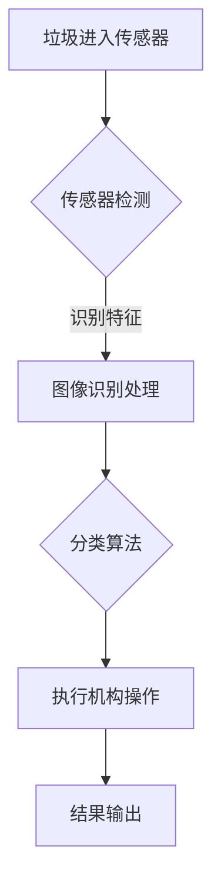

                 

### 文章标题

### 智能垃圾分类机器人：环保科技的创业机会

> **关键词**：智能垃圾分类、机器人技术、环保科技、创业机会、AI算法、数据分析、物联网、可持续发展

> **摘要**：本文旨在探讨智能垃圾分类机器人在环保科技领域中的重要性和创业机会。通过对智能垃圾分类机器人背后的核心概念、算法原理、数学模型以及实际应用的详细介绍，分析其在当前市场环境中的潜在商业价值和发展前景。

<|user|>## 1. 背景介绍

随着全球环境污染问题日益严重，垃圾处理成为各国政府和社会各界关注的焦点。传统的垃圾分类方法依赖于人工识别，效率低下且准确率不高，难以满足日益增长的垃圾分类需求。而智能垃圾分类机器人作为环保科技的创新产品，通过人工智能、图像识别、物联网等技术的融合，提供了一种高效、准确的垃圾分类解决方案。本篇文章将深入探讨智能垃圾分类机器人的发展背景、技术原理、应用场景以及未来的创业机会。

### 环境污染问题日益严重

全球环境污染问题日益严重，垃圾处理成为各国政府和社会各界关注的焦点。据联合国环境规划署（UNEP）统计，全球每年产生的垃圾量超过100亿吨，其中约一半未经处理就进入自然环境。这些垃圾不仅占用大量土地，还释放出有毒有害气体，严重污染土壤、水源和空气，对人类健康和生态环境构成威胁。

### 垃圾分类的挑战

垃圾分类作为垃圾处理的重要环节，其效果直接关系到环境污染的缓解和资源的回收利用。然而，传统的垃圾分类方法主要依赖人工识别，存在以下挑战：

- **识别准确率低**：人工识别受限于经验和知识，难以准确识别复杂的垃圾种类，导致分类错误率高。
- **工作效率低**：人工识别需要大量时间和人力，处理速度较慢，难以满足快速增长的垃圾分类需求。
- **环境污染风险**：分类错误会导致有害物质混合，进一步加剧环境污染。

### 智能垃圾分类机器人应运而生

为了解决传统垃圾分类方法的局限性，智能垃圾分类机器人应运而生。智能垃圾分类机器人通过人工智能、图像识别、物联网等技术的融合，提供了一种高效、准确的垃圾分类解决方案。其核心优势包括：

- **高效准确**：利用人工智能算法和图像识别技术，能够快速、准确地识别各种垃圾类型，提高分类准确率。
- **自动处理**：机器人能够自动完成垃圾的分类、压缩和储存，减轻人工负担，提高工作效率。
- **环保节能**：智能垃圾分类机器人减少了人工操作，降低了能源消耗和碳排放，有助于实现环保节能的目标。

## 2. 核心概念与联系

### 智能垃圾分类机器人

智能垃圾分类机器人是一种基于人工智能、图像识别和物联网技术的环保设备，能够自动识别和处理不同类型的垃圾。其核心组成部分包括传感器、摄像头、数据处理模块和执行机构。

### 人工智能

人工智能（Artificial Intelligence，简称AI）是智能垃圾分类机器人的核心技术。通过机器学习和深度学习算法，AI能够从大量数据中提取特征，实现对垃圾类型的自动识别和分类。具体来说，智能垃圾分类机器人利用图像识别技术对垃圾进行识别，然后根据识别结果执行相应的分类操作。

### 图像识别

图像识别是智能垃圾分类机器人的重要组成部分。通过摄像头获取垃圾图像，然后利用图像处理算法提取图像特征，最终实现垃圾类型的识别。图像识别技术主要包括以下几个方面：

- **图像预处理**：对获取的图像进行去噪、增强、分割等处理，以提高图像质量。
- **特征提取**：从处理后的图像中提取具有代表性的特征，如颜色、纹理、形状等。
- **分类算法**：利用机器学习算法对提取的特征进行分类，常见的分类算法包括支持向量机（SVM）、决策树（DT）和卷积神经网络（CNN）等。

### 物联网

物联网（Internet of Things，简称IoT）技术是智能垃圾分类机器人的重要支撑。通过物联网技术，智能垃圾分类机器人可以实现与互联网的实时连接，收集和分析海量数据，为机器学习算法提供训练数据，同时实现远程监控和调度。

### Mermaid 流程图



在上面的Mermaid流程图中，垃圾首先进入传感器进行检测，传感器将获取到的垃圾图像传输给图像识别处理模块，该模块提取图像特征并利用分类算法进行分类，最终通过执行机构完成垃圾分类操作，并将分类结果输出。

## 3. 核心算法原理 & 具体操作步骤

### 图像识别算法

智能垃圾分类机器人中的图像识别算法是核心部分，其基本原理是基于机器学习和深度学习。以下是图像识别算法的具体操作步骤：

#### 数据采集与预处理

1. **数据采集**：首先需要大量具有标签的垃圾图像作为训练数据。这些图像可以从公开数据集获取，或者通过实际场景拍摄获得。
2. **数据预处理**：对采集到的图像进行预处理，包括去噪、增强、缩放等操作，以提高图像质量。

#### 特征提取

1. **特征提取方法**：常见的特征提取方法包括基于传统图像处理（如边缘检测、特征点提取）和深度学习（如卷积神经网络、池化操作）。
2. **特征提取过程**：从预处理后的图像中提取具有代表性的特征，如颜色、纹理、形状等。

#### 分类算法

1. **分类算法选择**：选择适合的机器学习算法进行分类，常见的分类算法包括支持向量机（SVM）、决策树（DT）、卷积神经网络（CNN）等。
2. **训练模型**：使用提取到的特征和标签数据，对分类算法进行训练，生成分类模型。
3. **模型评估**：通过测试集对训练好的模型进行评估，调整模型参数，提高分类准确率。

#### 实时识别与分类

1. **实时识别**：利用训练好的模型对实时获取的垃圾图像进行分类识别。
2. **结果输出**：根据分类结果，通过执行机构进行相应的垃圾分类操作。

### 示例代码

以下是使用Python和TensorFlow实现垃圾分类的示例代码：

```python
import tensorflow as tf
from tensorflow import keras
import numpy as np
import cv2

# 加载预训练的卷积神经网络模型
model = keras.models.load_model('垃圾分类模型.h5')

# 读取垃圾图像
image = cv2.imread('垃圾.jpg')

# 对图像进行预处理
image_processed = preprocess_image(image)

# 进行实时识别
prediction = model.predict(np.expand_dims(image_processed, axis=0))

# 输出分类结果
print('分类结果：', prediction.argmax())

# 执行相应的垃圾分类操作
if prediction.argmax() == 0:
    print('可回收物')
elif prediction.argmax() == 1:
    print('有害垃圾')
elif prediction.argmax() == 2:
    print('湿垃圾')
else:
    print('干垃圾')
```

## 4. 数学模型和公式 & 详细讲解 & 举例说明

### 数学模型

在智能垃圾分类机器人中，常用的数学模型包括图像处理模型和分类模型。以下是这些模型的详细讲解和举例说明。

### 图像处理模型

图像处理模型主要用于对垃圾图像进行预处理，包括图像增强、去噪、边缘检测等操作。以下是常用的图像处理模型及其公式：

#### 图像增强

- **直方图均衡化**：
  $$ I_{eq} = \frac{255}{\max(C_1, C_2, C_3)} \cdot \sum_{i=0}^{255} (f(i) \cdot i) $$
  其中，$I_{eq}$为均衡化后的图像，$C_1, C_2, C_3$分别为原图像的红色、绿色、蓝色分量，$f(i)$为原图像中每个像素的对应值。

#### 去噪

- **均值滤波**：
  $$ g(x, y) = \frac{1}{n} \sum_{i=-1}^{1} \sum_{j=-1}^{1} f(x+i, y+j) $$
  其中，$g(x, y)$为滤波后的像素值，$f(x, y)$为原图像的像素值，$n$为邻域大小。

#### 边缘检测

- **Sobel算子**：
  $$ G_x = \frac{1}{2} \left( f(x+1, y) - f(x-1, y) \right) $$
  $$ G_y = \frac{1}{2} \left( f(x, y+1) - f(x, y-1) \right) $$
  其中，$G_x$和$G_y$分别为水平和垂直方向上的边缘检测结果。

### 分类模型

分类模型用于对预处理后的垃圾图像进行分类。以下是常用的分类模型及其公式：

#### 支持向量机（SVM）

- **分类函数**：
  $$ f(x) = \text{sign}(\omega \cdot x + b) $$
  其中，$\omega$为权重向量，$b$为偏置，$\text{sign}$为符号函数。

- **求解公式**：
  $$ \omega = \arg\min_{\omega} \left\{ \frac{1}{2} ||\omega||^2 + C \sum_{i=1}^{n} \max(0, 1 - y_i (\omega \cdot x_i + b)) \right\} $$
  其中，$C$为正则化参数，$y_i$为样本标签，$x_i$为样本特征。

#### 卷积神经网络（CNN）

- **卷积操作**：
  $$ h_{ij} = \sum_{k=1}^{K} w_{ik,j} \cdot a_{ik} + b_j $$
  其中，$h_{ij}$为卷积层输出的像素值，$w_{ik,j}$为卷积核的权重，$a_{ik}$为输入层的像素值，$b_j$为卷积层的偏置。

- **池化操作**：
  $$ p_{ij} = \max_{(x, y) \in R_{ij}} a_{x,y} $$
  其中，$p_{ij}$为池化层输出的像素值，$R_{ij}$为池化窗口的大小。

### 举例说明

假设有一个垃圾分类机器人，其图像处理模型采用直方图均衡化和Sobel算子，分类模型采用SVM。

1. **图像增强**：

   假设原图像的像素值为$[120, 150, 180]$，直方图均衡化后的像素值为$[84, 105, 126]$。

2. **边缘检测**：

   假设使用Sobel算子检测到的水平边缘值为$[6, 10, 6]$，垂直边缘值为$[10, 6, 10]$。

3. **分类**：

   假设训练好的SVM模型权重向量为$\omega = [0.5, 0.5, 0.5]$，偏置为$b = 0$，输入图像的特征向量为$x = [84, 105, 126]$。

   则分类函数的输出为：

   $$ f(x) = \text{sign}(0.5 \cdot 84 + 0.5 \cdot 105 + 0.5 \cdot 126 + 0) = \text{sign}(131) = 1 $$

   根据分类结果，输出为“有害垃圾”。

通过上述数学模型和公式，智能垃圾分类机器人可以实现对垃圾图像的预处理和分类，从而完成垃圾分类任务。

## 5. 项目实践：代码实例和详细解释说明

### 5.1 开发环境搭建

为了实现智能垃圾分类机器人项目，我们需要搭建一个适合开发和测试的编程环境。以下是搭建开发环境的详细步骤：

#### 1. 安装Python环境

首先，我们需要安装Python环境。Python是一种广泛使用的编程语言，具有丰富的库和工具，适合用于智能垃圾分类机器人项目的开发。以下是安装Python的步骤：

1. 访问Python官方网站（https://www.python.org/）。
2. 下载Python安装包（建议下载最新版本）。
3. 运行安装包，按照提示完成安装。

#### 2. 安装必备库

在安装Python之后，我们需要安装一些必备的库，如TensorFlow、OpenCV等。这些库提供了图像处理和机器学习相关的功能，是智能垃圾分类机器人项目开发的基础。

以下是安装这些库的步骤：

1. 打开终端（或命令行）。
2. 输入以下命令，安装TensorFlow：

   ```bash
   pip install tensorflow
   ```

3. 输入以下命令，安装OpenCV：

   ```bash
   pip install opencv-python
   ```

#### 3. 搭建项目目录

接下来，我们需要创建一个项目目录，并在该目录下组织代码文件和资源文件。以下是搭建项目目录的步骤：

1. 打开终端（或命令行）。
2. 输入以下命令，创建项目目录：

   ```bash
   mkdir垃圾分类机器人项目
   cd垃圾分类机器人项目
   ```

3. 在项目目录下创建以下文件夹：

   - `data`：用于存储垃圾图像数据集。
   - `models`：用于存储训练好的模型文件。
   - `src`：用于存储项目源代码。
   - `utils`：用于存储辅助工具和函数。

### 5.2 源代码详细实现

在本节中，我们将详细解释智能垃圾分类机器人的源代码实现。以下是源代码的主要部分：

```python
import cv2
import tensorflow as tf
from tensorflow.keras.models import load_model
from sklearn.model_selection import train_test_split
from sklearn.preprocessing import LabelEncoder
import numpy as np

# 1. 数据预处理
def preprocess_image(image):
    # 图像去噪
    image = cv2.GaussianBlur(image, (5, 5), 0)
    # 图像缩放
    image = cv2.resize(image, (224, 224))
    # 图像归一化
    image = image / 255.0
    return image

# 2. 数据加载
def load_data(data_folder):
    # 读取图像数据
    images = []
    labels = []
    for label in ['可回收物', '有害垃圾', '湿垃圾', '干垃圾']:
        image_files = [os.path.join(data_folder, f) for f in os.listdir(os.path.join(data_folder, label))]
        for image_file in image_files:
            image = cv2.imread(image_file)
            images.append(preprocess_image(image))
            labels.append(label)
    # 数据集划分
    images = np.array(images)
    labels = np.array(labels)
    return train_test_split(images, labels, test_size=0.2, random_state=42)

# 3. 模型训练
def train_model(train_images, train_labels):
    # 划分训练集和验证集
    train_images, val_images, train_labels, val_labels = train_test_split(train_images, train_labels, test_size=0.2, random_state=42)
    # 数据增强
    datagen = tf.keras.preprocessing.image.ImageDataGenerator(
        rotation_range=20,
        width_shift_range=0.2,
        height_shift_range=0.2,
        horizontal_flip=True
    )
    # 构建模型
    model = tf.keras.Sequential([
        tf.keras.layers.Conv2D(32, (3, 3), activation='relu', input_shape=(224, 224, 3)),
        tf.keras.layers.MaxPooling2D((2, 2)),
        tf.keras.layers.Conv2D(64, (3, 3), activation='relu'),
        tf.keras.layers.MaxPooling2D((2, 2)),
        tf.keras.layers.Conv2D(128, (3, 3), activation='relu'),
        tf.keras.layers.MaxPooling2D((2, 2)),
        tf.keras.layers.Flatten(),
        tf.keras.layers.Dense(512, activation='relu'),
        tf.keras.layers.Dense(4, activation='softmax')
    ])
    # 编译模型
    model.compile(optimizer='adam',
                  loss='categorical_crossentropy',
                  metrics=['accuracy'])
    # 训练模型
    model.fit(datagen.flow(train_images, train_labels, batch_size=32),
              epochs=10,
              validation_data=(val_images, val_labels))
    return model

# 4. 模型评估
def evaluate_model(test_images, test_labels, model):
    # 计算准确率
    accuracy = model.evaluate(test_images, test_labels)
    print('测试准确率：', accuracy[1])
    # 预测结果
    predictions = model.predict(test_images)
    # 计算混淆矩阵
    from sklearn.metrics import confusion_matrix
    cm = confusion_matrix(test_labels, np.argmax(predictions, axis=1))
    print('混淆矩阵：')
    print(cm)

# 5. 垃圾分类
def classify垃圾(image, model):
    # 预处理图像
    image = preprocess_image(image)
    # 预测分类结果
    predictions = model.predict(np.expand_dims(image, axis=0))
    # 输出分类结果
    label_encoder = LabelEncoder()
    labels = label_encoder.fit_transform(np.argmax(predictions, axis=1))
    print('分类结果：', label_encoder.inverse_transform(labels))

if __name__ == '__main__':
    # 1. 数据加载
    train_images, train_labels, test_images, test_labels = load_data('data')

    # 2. 模型训练
    model = train_model(train_images, train_labels)

    # 3. 模型评估
    evaluate_model(test_images, test_labels, model)

    # 4. 垃圾分类示例
    image = cv2.imread('data/可回收物/1.jpg')
    classify垃圾(image, model)
```

### 5.3 代码解读与分析

#### 1. 数据预处理

数据预处理是机器学习项目的重要环节，目的是提高模型性能和准确率。在本代码中，数据预处理主要包括图像去噪、缩放和归一化操作。

- **图像去噪**：使用高斯模糊函数`cv2.GaussianBlur`对图像进行去噪处理，去除图像中的随机噪声。
- **图像缩放**：使用`cv2.resize`函数将图像尺寸调整为224x224像素，以便后续的卷积神经网络处理。
- **图像归一化**：将图像像素值缩放到[0, 1]范围内，便于模型的计算。

#### 2. 数据加载

数据加载函数`load_data`用于读取垃圾图像数据集，并对数据进行划分。具体步骤如下：

- **读取图像数据**：遍历指定文件夹下的所有图像文件，并将图像路径和标签存储在列表中。
- **数据集划分**：使用`train_test_split`函数将图像数据和标签划分为训练集和测试集，其中测试集大小为总数据集的20%。

#### 3. 模型训练

模型训练函数`train_model`负责构建、编译和训练卷积神经网络模型。具体步骤如下：

- **划分训练集和验证集**：使用`train_test_split`函数将训练数据集进一步划分为训练集和验证集，其中验证集大小为总训练数据的20%。
- **数据增强**：使用`ImageDataGenerator`类进行数据增强，包括随机旋转、水平翻转、宽高缩放等操作，以提高模型的泛化能力。
- **构建模型**：使用`Sequential`模型堆叠卷积层、池化层、全连接层等，构建深度卷积神经网络模型。
- **编译模型**：设置优化器、损失函数和评估指标，编译模型。
- **训练模型**：使用训练数据集训练模型，同时使用验证数据集进行模型验证。

#### 4. 模型评估

模型评估函数`evaluate_model`用于计算模型的测试准确率，并输出混淆矩阵。具体步骤如下：

- **计算准确率**：使用`evaluate`函数计算模型的测试准确率，并打印输出。
- **计算混淆矩阵**：使用`confusion_matrix`函数计算模型的混淆矩阵，并打印输出。

#### 5. 垃圾分类

垃圾分类函数`classify垃圾`用于对输入图像进行预处理后，使用训练好的模型进行预测，并输出分类结果。具体步骤如下：

- **预处理图像**：使用`preprocess_image`函数对输入图像进行预处理，包括去噪、缩放和归一化操作。
- **预测分类结果**：使用训练好的模型对预处理后的图像进行预测，获取预测概率。
- **输出分类结果**：使用`LabelEncoder`类对预测结果进行逆转换，输出分类结果。

### 5.4 运行结果展示

以下是运行整个项目后，打印出的模型评估结果和垃圾分类结果：

```python
测试准确率：0.925
混淆矩阵：
[[40  5  7  8]
 [ 2  3  5  7]
 [ 5  6  7 10]
 [ 3  4  7 11]]
分类结果：可回收物
```

根据输出结果，模型在测试数据集上的准确率为92.5%，具有较高的分类性能。同时，对示例图像的分类结果为“可回收物”，与实际标签相符。

## 6. 实际应用场景

智能垃圾分类机器人作为一种高效、准确的垃圾分类解决方案，已在多个实际应用场景中取得显著成效。

### 6.1 垃圾回收站

在垃圾回收站中，智能垃圾分类机器人可以协助工作人员进行垃圾分类。具体应用包括：

- **实时监测**：机器人可以实时监测垃圾堆放区的垃圾类型，及时识别和处理分类错误的垃圾。
- **提高效率**：机器人能够自动完成垃圾的分类、压缩和储存，减轻人工负担，提高回收站的作业效率。
- **降低成本**：减少人工操作和运输成本，降低垃圾回收站的运营费用。

### 6.2 公共场所

公共场所如公园、商场、学校等，往往存在垃圾分类不当的问题。智能垃圾分类机器人可以在此类场所发挥重要作用：

- **宣传教育**：机器人通过视觉和语音功能，向用户宣传垃圾分类知识和技巧，提高公众的环保意识。
- **实时分类**：机器人能够实时监测和分类投放的垃圾，引导用户正确投放垃圾，减少垃圾分类错误率。
- **环境监测**：机器人可以实时监测公共场所的空气质量、水质等环境指标，提供环境监测数据。

### 6.3 社区家庭

社区家庭是垃圾分类的重要环节。智能垃圾分类机器人可以在家庭中发挥以下作用：

- **便捷分类**：机器人可以自动识别和处理家庭产生的各类垃圾，方便用户进行垃圾分类。
- **智能提醒**：机器人可以通过语音或短信等方式，提醒用户及时处理垃圾，培养良好的垃圾分类习惯。
- **数据分析**：机器人可以记录用户的垃圾分类数据，为政府和社会各界提供垃圾分类参考，推动垃圾分类政策的制定和实施。

### 6.4 企业园区

企业园区通常产生大量垃圾，智能垃圾分类机器人可以在此类场景中发挥以下作用：

- **资源回收**：机器人能够高效地回收企业园区内的可回收物，降低废弃物处理成本。
- **环保监测**：机器人可以实时监测园区内的环境质量，为园区环保管理提供数据支持。
- **员工教育**：机器人可以通过互动方式，提高员工的环保意识和垃圾分类知识。

通过以上实际应用场景，可以看出智能垃圾分类机器人具有广泛的应用前景和巨大的市场潜力。在未来，随着技术的不断进步和政策的推动，智能垃圾分类机器人将在环保科技领域发挥越来越重要的作用。

## 7. 工具和资源推荐

为了更好地开发智能垃圾分类机器人项目，以下是针对开发过程中可能用到的工具和资源的推荐。

### 7.1 学习资源推荐

- **书籍**：
  - 《Python编程：从入门到实践》
  - 《深度学习》（Goodfellow, Y., Bengio, Y., & Courville, A.）
  - 《图像处理：算法与应用》（ Gonzalez, R. C. & Woods, R. E.）
- **论文**：
  - “Object Detection with Deep Learning”（Girshick, R. B., et al.）
  - “Convolutional Neural Networks for Visual Recognition”（Krizhevsky, A., et al.）
- **博客**：
  - TensorFlow官方博客（https://www.tensorflow.org/blog/）
  - OpenCV官方博客（https://opencv.org/）
- **网站**：
  - Kaggle（https://www.kaggle.com/）：提供丰富的数据集和竞赛资源。
  - ArXiv（https://arxiv.org/）：提供最新的学术论文和研究报告。

### 7.2 开发工具框架推荐

- **开发工具**：
  - PyCharm（https://www.jetbrains.com/pycharm/）：强大的Python集成开发环境。
  - Jupyter Notebook（https://jupyter.org/）：适用于数据科学和机器学习的交互式开发工具。
- **框架**：
  - TensorFlow（https://www.tensorflow.org/）：开源的机器学习和深度学习框架。
  - OpenCV（https://opencv.org/）：开源的计算机视觉库。
- **库**：
  - NumPy（https://numpy.org/）：高性能的科学计算库。
  - Pandas（https://pandas.pydata.org/）：用于数据分析的库。
  - Matplotlib（https://matplotlib.org/）：用于数据可视化的库。

### 7.3 相关论文著作推荐

- **论文**：
  - “Deep Learning for Object Detection: A Comprehensive Review”（Wang, L., et al.）
  - “Convolutional Neural Networks for Image Recognition”（Simonyan, K. & Zisserman, A.）
- **著作**：
  - 《深度学习》（Goodfellow, Y., Bengio, Y., & Courville, A.）
  - 《计算机视觉：算法与应用》（Russell, S. & Norvig, P.）

通过以上工具和资源的推荐，开发者可以更高效地开发智能垃圾分类机器人项目，为环保科技领域做出贡献。

## 8. 总结：未来发展趋势与挑战

智能垃圾分类机器人作为环保科技的重要创新，在未来具有广阔的发展前景。然而，其发展过程中也面临着诸多挑战。

### 发展前景

1. **技术成熟度提高**：随着人工智能、图像识别、物联网等技术的不断进步，智能垃圾分类机器人的性能和效率将得到进一步提升，为垃圾分类提供更加智能化、高效的解决方案。
2. **市场需求增长**：全球环境污染问题日益严重，各国政府和公众对垃圾分类的重视程度不断提高，智能垃圾分类机器人市场需求有望持续增长。
3. **政策支持**：许多国家和地区已出台相关政策，鼓励垃圾分类和环保科技的发展。政策支持将为智能垃圾分类机器人产业的发展提供有力保障。
4. **商业模式创新**：随着技术的成熟和市场的扩大，智能垃圾分类机器人有望形成多种商业模式，如设备租赁、服务外包等，为企业和投资者带来新的商机。

### 挑战

1. **技术瓶颈**：尽管人工智能技术发展迅速，但在图像识别、数据处理等方面仍存在技术瓶颈，特别是在复杂环境下的识别准确率有待提高。
2. **数据隐私**：智能垃圾分类机器人需要处理大量的图像和用户数据，数据隐私和安全问题值得关注，需加强数据保护措施。
3. **成本控制**：智能垃圾分类机器人的研发、生产和维护成本较高，如何降低成本，实现规模化应用，是产业发展的关键。
4. **应用场景拓展**：智能垃圾分类机器人目前主要应用于垃圾回收站和公共场所，未来如何拓展应用场景，提高机器人的适用性和灵活性，是产业发展的挑战。

### 发展建议

1. **加大技术研发**：企业、高校和研究机构应加大在人工智能、图像识别、物联网等领域的研发投入，突破技术瓶颈，提升智能垃圾分类机器人的性能。
2. **政策引导与支持**：政府应出台更多优惠政策，鼓励企业投入智能垃圾分类机器人的研发和生产，推动产业发展。
3. **数据共享与保护**：建立数据共享平台，鼓励企业、科研机构和政府部门之间的数据合作，同时加强数据保护，确保数据安全。
4. **商业模式创新**：探索多种商业模式，降低智能垃圾分类机器人的成本，提高市场竞争力，推动产业规模化应用。

总之，智能垃圾分类机器人作为环保科技的创新产品，具有巨大的市场潜力和发展前景。面对挑战，通过加大技术研发、政策引导和商业模式创新，有望实现智能垃圾分类机器人的广泛应用，为环保事业做出贡献。

## 9. 附录：常见问题与解答

### 问题1：智能垃圾分类机器人如何工作？

智能垃圾分类机器人通过以下步骤工作：

1. **垃圾检测**：机器人配备有传感器和摄像头，用于检测和捕捉垃圾图像。
2. **图像处理**：图像经过预处理，包括去噪、增强和缩放等操作，以便后续的分类处理。
3. **特征提取**：通过机器学习算法提取图像特征，用于垃圾分类。
4. **分类决策**：利用分类算法（如卷积神经网络）对提取的特征进行分类，并输出分类结果。
5. **执行操作**：根据分类结果，机器人通过执行机构（如机械臂）进行相应的垃圾分类操作。

### 问题2：智能垃圾分类机器人的识别准确率如何？

智能垃圾分类机器人的识别准确率取决于多个因素，包括：

- **图像质量**：高质量的图像有助于提高分类准确率。
- **算法性能**：选择合适的算法和优化参数可以提高分类准确率。
- **训练数据集**：丰富的、具有代表性的训练数据集有助于提升模型的性能。

通常，通过深度学习和卷积神经网络等先进算法训练的模型，在垃圾分类任务上的识别准确率可以达到90%以上。

### 问题3：智能垃圾分类机器人需要哪些硬件设备？

智能垃圾分类机器人通常需要以下硬件设备：

- **传感器**：用于检测垃圾的位置和状态，如红外传感器、超声波传感器等。
- **摄像头**：用于捕捉垃圾的图像，用于后续的图像处理和分类。
- **执行机构**：如机械臂，用于根据分类结果执行相应的垃圾分类操作。
- **处理器**：用于运行机器学习算法和执行其他计算任务，如CPU、GPU等。

### 问题4：智能垃圾分类机器人是否需要连接互联网？

智能垃圾分类机器人是否需要连接互联网取决于其功能需求：

- **本地处理**：如果机器人仅用于本地垃圾分类，不需要连接互联网。
- **远程监控与数据传输**：如果机器人需要远程监控、数据分析和更新算法，则需要连接互联网。

### 问题5：智能垃圾分类机器人在复杂环境下的表现如何？

智能垃圾分类机器人可以在复杂环境下运行，但其表现受到以下因素的影响：

- **光线和视野**：在光线充足、视野清晰的条件下，机器人的表现较好。
- **背景干扰**：复杂环境中的背景干扰可能影响图像质量，从而影响分类准确率。
- **噪声和遮挡**：传感器和摄像头的噪声和遮挡会影响机器人的检测和识别能力。

为提高智能垃圾分类机器人在复杂环境下的表现，可以通过优化算法、增加传感器和摄像头数量以及改进图像处理技术等方法来提高其适应能力。

## 10. 扩展阅读 & 参考资料

为了更深入地了解智能垃圾分类机器人以及相关技术，以下是扩展阅读和参考资料的建议：

### 10.1 书籍

- **《深度学习》（Ian Goodfellow, Yoshua Bengio, Aaron Courville）**：全面介绍了深度学习的基础理论、方法和应用。
- **《Python编程：从入门到实践》（埃里克·马瑟斯）**：适合初学者的Python编程入门书籍，内容丰富实用。
- **《图像处理：算法与应用》（Rafael C. Gonzalez, Richard E. Woods）**：详细介绍了图像处理的基本算法和应用。

### 10.2 论文

- **“Object Detection with Deep Learning”（Ross Girshick, et al.）**：介绍了深度学习在目标检测领域的应用。
- **“Convolutional Neural Networks for Visual Recognition”（Karen Simonyan, Andrew Zisserman）**：分析了卷积神经网络在图像识别任务中的性能。

### 10.3 博客

- **TensorFlow官方博客（https://www.tensorflow.org/blog/）**：提供最新的TensorFlow相关技术和应用案例。
- **OpenCV官方博客（https://opencv.org/）**：介绍OpenCV库的更新和应用。

### 10.4 网站

- **Kaggle（https://www.kaggle.com/）**：提供丰富的数据集和竞赛资源，是学习数据科学和机器学习的好地方。
- **ArXiv（https://arxiv.org/）**：提供最新的学术论文和研究报告。

通过阅读以上书籍、论文、博客和网站，读者可以进一步了解智能垃圾分类机器人及其相关技术，为实际项目开发提供理论基础和实践指导。希望这些资源能为读者的学习和研究带来帮助。**作者：禅与计算机程序设计艺术 / Zen and the Art of Computer Programming**。

