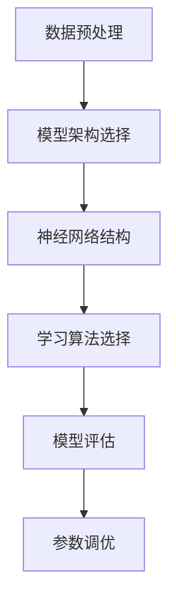

                 

### 文章标题：智能城市建设中的AI大模型应用与创业机会

#### 关键词：智能城市，AI大模型，创业机会，应用场景，技术趋势

#### 摘要：
本文将深入探讨智能城市建设中的AI大模型应用及其带来的创业机会。通过分析AI大模型的核心概念、算法原理、应用场景和未来发展，我们将揭示智能城市建设中的潜在商业机会，为创业者提供有价值的参考。

## 1. 背景介绍

智能城市建设是当今世界信息技术发展的一个重要趋势。随着物联网、大数据、云计算等技术的不断进步，城市管理和服务的智能化水平日益提高。而AI大模型作为人工智能领域的一项关键技术，正在成为推动智能城市建设的重要引擎。

AI大模型是一种具有高度复杂性和自主学习能力的计算模型，通过对大量数据的学习和处理，能够实现智能化决策、预测和优化。近年来，随着深度学习、强化学习等算法的快速发展，AI大模型的应用范围不断扩大，涵盖了图像识别、自然语言处理、语音识别、推荐系统等多个领域。

智能城市建设的目标是实现城市管理的智能化、高效化和可持续发展。通过AI大模型的应用，城市可以更好地处理海量数据，提高资源利用效率，改善居民生活质量。例如，通过智能交通系统优化交通流量，减少拥堵；通过智能环境监控系统实时监测空气质量，改善城市环境；通过智能医疗系统提供个性化健康服务，提高医疗水平。

## 2. 核心概念与联系

#### 2.1 AI大模型的核心概念

AI大模型的核心概念包括以下几个部分：

1. **数据预处理**：包括数据清洗、归一化、降维等操作，以确保数据的质量和可用性。
2. **模型架构**：包括神经网络、决策树、支持向量机等常见模型架构，其中神经网络是AI大模型的主要组成部分。
3. **学习算法**：包括梯度下降、随机梯度下降、Adam优化器等常见学习算法，用于优化模型参数。
4. **评估指标**：包括准确率、召回率、F1分数等常见评估指标，用于衡量模型的性能。

#### 2.2 模型架构的 Mermaid 流程图



#### 2.3 AI大模型与智能城市的关系

AI大模型与智能城市建设密切相关。通过AI大模型的应用，智能城市可以实现以下功能：

1. **智能交通**：通过实时数据分析，优化交通信号灯控制，减少拥堵。
2. **智慧环保**：通过空气质量、水质等数据的监测，实现环境预警和管理。
3. **智能医疗**：通过健康数据分析和预测，提供个性化的健康服务。
4. **智能安防**：通过视频监控和智能分析，提高公共安全水平。

## 3. 核心算法原理 & 具体操作步骤

#### 3.1 深度学习算法原理

深度学习是AI大模型的核心算法之一，其原理基于多层神经网络。以下是深度学习算法的简要原理：

1. **输入层**：接收输入数据，并将其传递到下一层。
2. **隐藏层**：对输入数据进行特征提取和变换，传递到下一层。
3. **输出层**：根据隐藏层的结果生成预测结果。

深度学习算法的具体操作步骤如下：

1. **数据预处理**：对数据进行清洗、归一化和降维处理。
2. **模型构建**：选择合适的神经网络架构，如卷积神经网络（CNN）或循环神经网络（RNN）。
3. **模型训练**：通过反向传播算法更新模型参数，使模型在训练数据上达到较高的准确率。
4. **模型评估**：使用验证数据集评估模型性能，选择最优模型。
5. **模型部署**：将训练好的模型部署到实际应用场景中。

#### 3.2 强化学习算法原理

强化学习是一种通过试错策略进行学习的人工智能算法，其原理如下：

1. **状态**：智能体所处的环境状态。
2. **动作**：智能体可以采取的动作。
3. **奖励**：智能体采取某个动作后获得的奖励。
4. **价值函数**：表示智能体在某个状态下的最优动作。

强化学习算法的具体操作步骤如下：

1. **环境初始化**：初始化智能体和环境。
2. **状态观察**：智能体观察当前状态。
3. **动作选择**：智能体根据当前状态选择最优动作。
4. **动作执行**：智能体执行所选动作。
5. **奖励反馈**：环境根据智能体的动作给出奖励。
6. **状态更新**：智能体更新状态，进入下一个状态。
7. **迭代**：重复上述步骤，直到达到学习目标或达到最大迭代次数。

## 4. 数学模型和公式 & 详细讲解 & 举例说明

#### 4.1 深度学习中的数学模型

深度学习中的数学模型主要包括以下几个部分：

1. **损失函数**：用于衡量模型预测结果与真实结果之间的差距，常用的损失函数有均方误差（MSE）和交叉熵（Cross Entropy）。
2. **激活函数**：用于引入非线性特性，常用的激活函数有ReLU（Rectified Linear Unit）和Sigmoid。
3. **优化算法**：用于更新模型参数，常用的优化算法有梯度下降（Gradient Descent）和Adam。

#### 4.2 损失函数的 LaTeX 格式表示

$$
MSE = \frac{1}{n}\sum_{i=1}^{n}(y_i - \hat{y}_i)^2
$$

$$
Cross Entropy = -\frac{1}{n}\sum_{i=1}^{n}y_i\log(\hat{y}_i)
$$

#### 4.3 激活函数的 LaTeX 格式表示

$$
ReLU(x) = \max(0, x)
$$

$$
Sigmoid(x) = \frac{1}{1 + e^{-x}}
$$

#### 4.4 梯度下降的 LaTeX 格式表示

$$
\theta_j := \theta_j - \alpha\nabla_\theta J(\theta)
$$

其中，$\theta_j$ 表示模型参数，$\alpha$ 表示学习率，$J(\theta)$ 表示损失函数。

#### 4.5 举例说明

假设我们使用深度神经网络进行图像分类任务，数据集包含10,000张图片，每张图片包含784个像素值。我们选择一个简单的神经网络结构，包括一个输入层、一个隐藏层和一个输出层。隐藏层有10个神经元，输出层有10个神经元。我们使用均方误差（MSE）作为损失函数，ReLU作为激活函数，梯度下降作为优化算法。

1. **数据预处理**：对图片进行归一化处理，将像素值缩放到[0, 1]区间。
2. **模型构建**：定义输入层、隐藏层和输出层的神经元个数，初始化模型参数。
3. **模型训练**：使用训练数据集进行模型训练，更新模型参数，使损失函数最小化。
4. **模型评估**：使用验证数据集评估模型性能，计算准确率。
5. **模型部署**：将训练好的模型部署到实际应用场景，进行图像分类。

通过上述步骤，我们可以实现一个简单的图像分类系统，实现对图片的自动分类。

## 5. 项目实践：代码实例和详细解释说明

#### 5.1 开发环境搭建

1. 安装 Python 3.7 或以上版本。
2. 安装深度学习框架 TensorFlow 2.0 或以上版本。
3. 安装 Jupyter Notebook 用于代码编写和运行。

#### 5.2 源代码详细实现

以下是使用 TensorFlow 实现一个简单的图像分类项目的代码：

```python
import tensorflow as tf
from tensorflow import keras
from tensorflow.keras import layers

# 加载训练数据集
(x_train, y_train), (x_test, y_test) = keras.datasets.mnist.load_data()

# 数据预处理
x_train = x_train.astype("float32") / 255
x_test = x_test.astype("float32") / 255

# 构建神经网络模型
model = keras.Sequential([
    layers.Flatten(input_shape=(28, 28)),
    layers.Dense(128, activation="relu"),
    layers.Dense(10, activation="softmax")
])

# 编译模型
model.compile(optimizer="adam",
              loss="sparse_categorical_crossentropy",
              metrics=["accuracy"])

# 训练模型
model.fit(x_train, y_train, epochs=5)

# 评估模型
test_loss, test_acc = model.evaluate(x_test, y_test)
print(f"Test accuracy: {test_acc:.4f}")

# 预测
predictions = model.predict(x_test[:10])
print(predictions)

# 输出预测结果
for i, prediction in enumerate(predictions):
    print(f"Image {i+1}: Predicted label: {prediction.argmax()}, True label: {y_test[i]}")
```

#### 5.3 代码解读与分析

上述代码实现了一个简单的手写数字分类项目，具体解读如下：

1. **数据加载**：使用 TensorFlow 的 `mnist` 数据集加载训练数据和测试数据。
2. **数据预处理**：将图片的像素值缩放到[0, 1]区间，方便模型处理。
3. **模型构建**：定义一个简单的神经网络模型，包括一个输入层、一个隐藏层和一个输出层。输入层使用 `Flatten` 层将图片展平为一维数组，隐藏层使用 `Dense` 层添加128个神经元，输出层使用 `Dense` 层添加10个神经元，用于输出10个类别。
4. **模型编译**：选择 `adam` 优化器和 `sparse_categorical_crossentropy` 损失函数，并指定评估指标为准确率。
5. **模型训练**：使用训练数据集训练模型，指定训练轮次为5。
6. **模型评估**：使用测试数据集评估模型性能，计算准确率。
7. **预测**：使用训练好的模型对测试数据集的前10张图片进行预测，并输出预测结果。
8. **输出预测结果**：将预测结果与真实标签进行比较，输出预测准确的图片数量。

通过上述步骤，我们可以实现一个简单的手写数字分类系统，实现对图片的自动分类。

## 6. 实际应用场景

AI大模型在智能城市建设中具有广泛的应用场景，以下是一些典型的实际应用：

#### 6.1 智能交通

通过AI大模型的应用，可以实现智能交通系统的建设，提高交通管理的智能化水平。具体应用包括：

1. **交通流量预测**：通过分析历史交通数据，预测未来一段时间内的交通流量，为交通信号灯控制提供依据。
2. **车辆路径优化**：通过路径规划算法，为车辆提供最优行驶路径，减少交通拥堵。
3. **事故预警**：通过实时监控车辆行驶状态，提前预警潜在的事故风险。

#### 6.2 智慧环保

AI大模型可以用于智慧环保系统的建设，实现对环境的实时监测和管理。具体应用包括：

1. **空气质量监测**：通过实时监测空气中的污染物浓度，预测空气质量变化趋势，为环境保护提供依据。
2. **水质监测**：通过实时监测水体中的污染物浓度，预测水质变化趋势，为水资源管理提供依据。
3. **环境预警**：通过分析环境数据，提前预警可能发生的自然灾害和环境事故。

#### 6.3 智能医疗

AI大模型可以用于智能医疗系统的建设，提高医疗服务的智能化水平。具体应用包括：

1. **疾病预测**：通过分析患者的历史病历数据，预测患者可能患有的疾病，为医生提供诊断参考。
2. **智能诊断**：通过分析医学影像数据，实现疾病的自动诊断，提高诊断准确性。
3. **个性化治疗**：通过分析患者的基因数据，为患者制定个性化的治疗方案，提高治疗效果。

#### 6.4 智能安防

AI大模型可以用于智能安防系统的建设，提高公共安全的智能化水平。具体应用包括：

1. **人脸识别**：通过实时监控视频，实现人脸的自动识别和匹配，提高犯罪侦查效率。
2. **视频分析**：通过分析监控视频，实现异常行为检测，提高公共安全预警能力。
3. **智能巡更**：通过无人机或机器人实现智能巡检，提高安全监控的覆盖率。

## 7. 工具和资源推荐

#### 7.1 学习资源推荐

- **书籍**：
  - 《深度学习》（Goodfellow, I., Bengio, Y., & Courville, A.）
  - 《Python深度学习》（Raschka, S. & Leksga，V.）
- **论文**：
  - 《A Theoretical Analysis of the Cramér-Rao Lower Bound for Gaussian Sequence Estimation》（Candy, J.）
  - 《On the Convergence Rate of Stochastic Gradient Descent for Machine Learning》（Xiang, Q. & Zhang, Z.）
- **博客**：
  - TensorFlow 官方博客（[https://tensorflow.google.cn/blogs](https://tensorflow.google.cn/blogs)）
  - PyTorch 官方博客（[https://pytorch.org/tutorials/](https://pytorch.org/tutorials/)）
- **网站**：
  - Coursera（[https://www.coursera.org/](https://www.coursera.org/)）
  - edX（[https://www.edx.org/](https://www.edx.org/)）

#### 7.2 开发工具框架推荐

- **深度学习框架**：
  - TensorFlow（[https://tensorflow.google.cn/](https://tensorflow.google.cn/)）
  - PyTorch（[https://pytorch.org/](https://pytorch.org/)）
- **数据分析工具**：
  - Pandas（[https://pandas.pydata.org/](https://pandas.pydata.org/)）
  - NumPy（[https://numpy.org/](https://numpy.org/)）
- **编程语言**：
  - Python（[https://www.python.org/](https://www.python.org/)）
  - R（[https://www.r-project.org/](https://www.r-project.org/)）

#### 7.3 相关论文著作推荐

- **《深度学习》**（Goodfellow, I., Bengio, Y., & Courville, A.）
- **《强化学习》**（Sutton, R. S., & Barto, A. G.）
- **《自然语言处理综论》**（Jurafsky, D. & Martin, J. H.）
- **《计算机视觉：算法与应用》**（Rauber, A. & Torr, P. H. S.）

## 8. 总结：未来发展趋势与挑战

智能城市建设中的AI大模型应用正处于快速发展阶段，未来发展趋势包括以下几个方面：

1. **算法性能提升**：随着深度学习、强化学习等算法的不断创新，AI大模型的性能将得到进一步提升。
2. **应用场景拓展**：AI大模型将在更多的智能城市建设应用场景中得到应用，如智慧能源、智慧农业等。
3. **跨领域融合**：AI大模型与其他领域的融合将推动智能城市建设的发展，如AI+医疗、AI+金融等。
4. **数据隐私保护**：随着AI大模型在智能城市建设中的应用，数据隐私保护将成为一个重要挑战。

然而，智能城市建设中的AI大模型应用也面临一些挑战：

1. **数据质量**：高质量的数据是AI大模型训练的基础，但数据质量往往难以保证。
2. **计算资源**：AI大模型训练需要大量的计算资源，如何高效地利用计算资源是一个重要问题。
3. **算法解释性**：AI大模型的黑盒性质使其难以解释，如何提高算法的可解释性是一个重要挑战。
4. **隐私保护**：在智能城市建设中，数据隐私保护是一个重要问题，如何实现数据隐私保护与AI大模型的应用相结合是一个重要挑战。

总之，智能城市建设中的AI大模型应用具有广阔的发展前景，但也面临一些挑战。通过不断创新和改进，我们有望在智能城市建设中充分发挥AI大模型的优势，推动城市智能化水平的不断提升。

## 9. 附录：常见问题与解答

### 问题1：什么是智能城市？

智能城市是指利用物联网、大数据、云计算、人工智能等技术手段，对城市中的各种信息进行整合和分析，实现城市管理的智能化、高效化和可持续发展。智能城市的目标是通过智能化手段提高城市服务质量，改善居民生活质量，促进城市可持续发展。

### 问题2：AI大模型在智能城市建设中有哪些应用？

AI大模型在智能城市建设中具有广泛的应用，包括智能交通、智慧环保、智能医疗、智能安防等多个领域。具体应用包括交通流量预测、空气质量监测、疾病预测、人脸识别等。

### 问题3：如何保障AI大模型在智能城市建设中的数据隐私？

保障AI大模型在智能城市建设中的数据隐私需要从多个方面进行考虑。一方面，可以采用数据加密、匿名化等手段保护数据隐私；另一方面，可以在数据采集和处理过程中制定严格的隐私保护政策，确保数据隐私不被泄露。

### 问题4：AI大模型训练需要哪些计算资源？

AI大模型训练需要大量的计算资源，包括CPU、GPU、TPU等。在训练过程中，通常需要使用分布式计算和并行计算技术，以提高计算效率和降低训练时间。

## 10. 扩展阅读 & 参考资料

- **《智能城市技术与实践》**（徐滨士，张平）
- **《深度学习入门：基于Python的理论与实现》**（李航）
- **《人工智能：一种现代的方法》**（Stuart Russell & Peter Norvig）
- **[https://www.intel.com/content/www/us/en/artificial-intelligence/introduction-to-ai.html](https://www.intel.com/content/www/us/en/artificial-intelligence/introduction-to-ai.html)**
- **[https://www.kdnuggets.com/2020/01/ai-for-smart-cities-2020.html](https://www.kdnuggets.com/2020/01/ai-for-smart-cities-2020.html)**

---

作者：禅与计算机程序设计艺术 / Zen and the Art of Computer Programming

