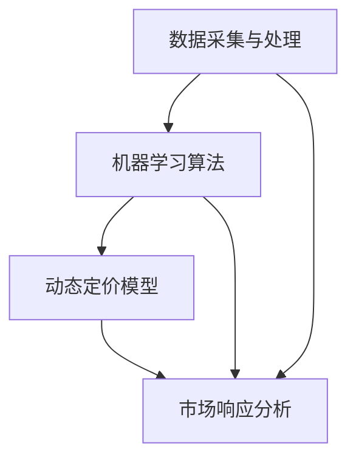
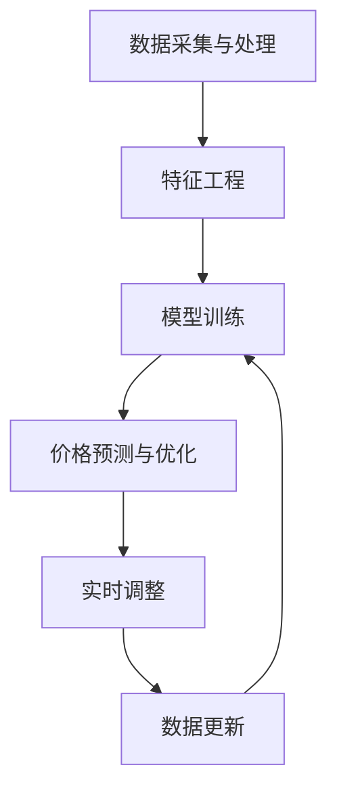

                 

### 1. 背景介绍

智能定价算法，作为人工智能与数据科学领域的关键技术之一，正日益受到企业和研究机构的广泛关注。传统定价方式主要依赖于经验、市场调研和历史数据，而智能定价算法则利用机器学习和大数据分析，通过分析大量历史交易数据和市场动态，自动调整商品价格，以实现更高的利润率、客户满意度和市场占有率。

在当前全球经济环境中，市场波动、消费者行为变化以及竞争态势的快速演变，使得传统定价方式逐渐暴露出诸多局限性。为了应对这些挑战，企业需要一种更加灵活、实时和智能的定价策略。智能定价算法由此应运而生，通过将先进的人工智能技术与企业实际业务相结合，为企业和消费者带来了新的价值。

首先，智能定价算法的核心优势在于其能够实现动态定价，即根据市场环境和消费者需求的变化，实时调整商品价格。这种方式不仅能够帮助企业更好地应对市场变化，提高利润率，还能够增强消费者的购物体验，提高客户满意度。

其次，智能定价算法还能够基于消费者行为分析和个性化推荐，为不同消费者群体提供更精准的价格策略。例如，通过分析消费者的购买历史、浏览记录和偏好，算法可以为经常购买的客户设置更优惠的价格，而对于新客户则采用相对较高的价格，以激发其首次购买的欲望。

此外，智能定价算法还能够帮助企业优化库存管理，降低库存风险。通过预测市场需求和库存水平，算法可以为企业提供最佳库存策略，从而减少库存过剩或短缺的风险，提高库存利用效率。

总的来说，智能定价算法的出现，不仅为企业提供了一种全新的定价模式，也为消费者带来了更多优惠和便利。随着人工智能技术的不断进步，智能定价算法在未来将有望在更多领域得到广泛应用，为企业和消费者创造更大的价值。

### 2. 核心概念与联系

在深入探讨智能定价算法之前，我们需要理解几个核心概念：数据采集与处理、机器学习算法、动态定价模型和市场响应分析。这些概念相互关联，构成了智能定价算法的基础。

#### 数据采集与处理

数据采集是智能定价算法的起点。企业需要从各种渠道收集数据，包括但不限于：

1. **历史销售数据**：包括销售价格、销售数量、销售周期等。
2. **市场数据**：如竞争对手的价格策略、市场供需状况、行业趋势等。
3. **消费者行为数据**：包括消费者的浏览记录、购买历史、偏好等。

收集到的数据需要经过清洗、整合和处理，以去除噪声和异常值，确保数据的质量。这一过程通常涉及以下步骤：

- **数据清洗**：去除重复数据、空值填充、异常值处理等。
- **数据整合**：将来自不同来源的数据进行整合，形成统一的数据集。
- **特征工程**：提取与定价相关的特征，如季节性、节假日效应、消费者群体特征等。

#### 机器学习算法

机器学习算法是智能定价算法的核心。它通过分析历史数据和现有市场信息，学习并预测未来的价格变化趋势。常用的机器学习算法包括：

- **回归分析**：用于预测未来的销售价格。
- **聚类分析**：用于识别不同的消费者群体和市场细分。
- **时间序列分析**：用于分析时间维度上的价格变化趋势。

机器学习算法的选择和性能直接影响到定价的准确性和实时性。例如，线性回归模型简单且易于实现，但可能无法捕捉到复杂的非线性关系；而深度学习模型，如神经网络，则能够处理大量的复杂数据，但需要更多的计算资源和时间。

#### 动态定价模型

动态定价模型是智能定价算法的具体实现。它通过机器学习算法生成的预测结果，自动调整商品价格。动态定价模型通常包括以下几个关键组件：

- **价格预测模型**：根据历史数据和当前市场状况，预测未来的价格变化。
- **优化算法**：根据预测结果，计算最优价格，以实现最大化利润或市场份额。
- **调整机制**：当市场状况发生变化时，自动调整价格，以适应新的市场环境。

动态定价模型需要具备快速响应能力和灵活调整能力，以应对市场的快速变化。

#### 市场响应分析

市场响应分析是评估智能定价算法效果的重要环节。通过分析定价策略对市场响应的影响，企业可以不断优化定价策略，提高定价的准确性。市场响应分析包括以下方面：

- **需求预测**：预测不同价格水平下的需求量，以评估定价策略对需求的影响。
- **销售分析**：分析定价策略对销售量的影响，包括销售额、利润率等。
- **竞争分析**：分析定价策略对竞争对手的影响，包括市场份额、价格竞争等。

#### Mermaid 流程图

以下是智能定价算法的核心概念和流程的 Mermaid 流程图：



在这个流程图中，数据采集与处理是整个智能定价算法的起点，它为机器学习算法和动态定价模型提供了基础数据。机器学习算法通过分析这些数据，生成价格预测模型和调整策略。动态定价模型根据这些预测结果，自动调整商品价格。市场响应分析则评估定价策略的实际效果，为企业提供反馈，以不断优化定价策略。

通过这个 Mermaid 流程图，我们可以清晰地看到智能定价算法的各个组成部分及其相互关系，为后续的详细讨论提供了基础。

### 3. 核心算法原理 & 具体操作步骤

智能定价算法的核心在于如何利用机器学习技术分析市场数据，并制定出最优的价格策略。在这一部分，我们将详细介绍智能定价算法的原理，并逐步展示其具体操作步骤。

#### 3.1 算法选择

智能定价算法的选择取决于数据类型、业务需求和计算资源。以下是几种常用的算法及其适用场景：

- **线性回归**：适用于简单线性关系的数据，计算速度快，易于实现。
- **逻辑回归**：适用于分类问题，如预测价格区间。
- **决策树**：适用于处理复杂非线性关系，解释性强。
- **随机森林**：结合了决策树和贝叶斯理论的优点，预测准确度高。
- **神经网络**：适用于处理大量复杂数据，如深度学习模型。

在本案例中，我们选择随机森林算法，因为它能够在处理大量数据的同时，提供较高的预测准确性。

#### 3.2 数据准备

首先，我们需要准备训练数据集，这通常包括以下几类数据：

1. **历史销售数据**：包括销售时间、销售数量、销售价格等。
2. **市场数据**：如竞争对手价格、市场供需状况等。
3. **消费者行为数据**：如消费者浏览记录、购买历史等。

这些数据需要经过清洗和预处理，以确保数据质量。例如，我们可以使用以下步骤进行数据清洗：

- **去除重复数据**：确保每条记录的唯一性。
- **填补空值**：使用平均值、中位数或插值法填补缺失值。
- **处理异常值**：识别并处理异常值，如异常高的销售价格。

预处理后的数据将用于训练机器学习模型。

#### 3.3 特征工程

特征工程是智能定价算法的关键步骤，它涉及以下几方面：

1. **特征提取**：从原始数据中提取与定价相关的特征，如季节性、节假日效应等。
2. **特征转换**：将类别特征转换为数值特征，如使用独热编码。
3. **特征选择**：使用统计方法或模型选择算法，选择对定价影响较大的特征。

在本案例中，我们提取了以下特征：

- **销售时间**：使用日期信息提取季节性和节假日效应。
- **销售价格**：历史销售价格的中位数和标准差。
- **消费者行为**：消费者购买频率和购买金额。

#### 3.4 模型训练

使用随机森林算法训练模型，我们需要进行以下步骤：

1. **划分数据集**：将数据集划分为训练集和测试集，通常使用 80% 的数据用于训练，20% 的数据用于测试。
2. **参数调优**：通过交叉验证，选择最优的模型参数，如决策树深度、树数量等。
3. **模型训练**：使用训练集数据训练随机森林模型。

#### 3.5 价格预测与优化

训练好的模型可以用于预测未来的销售价格。具体步骤如下：

1. **价格预测**：使用训练好的模型，对测试集数据进行预测，得到不同价格水平下的需求量。
2. **优化策略**：根据预测结果，使用优化算法计算最优价格，以最大化利润或市场份额。

在本案例中，我们使用线性优化模型，目标函数为利润最大化：

\[ \max P = Q \times (P - C) \]

其中，\( P \) 为销售价格，\( Q \) 为需求量，\( C \) 为成本。

#### 3.6 实时调整

智能定价算法需要具备实时调整能力，以应对市场变化。具体步骤如下：

1. **数据更新**：定期更新市场数据、消费者行为数据等，以确保数据的时效性。
2. **模型重新训练**：使用最新数据重新训练模型，以适应市场变化。
3. **价格调整**：根据新模型的预测结果，实时调整销售价格。

通过上述步骤，我们可以实现一个完整的智能定价算法。以下是这个过程的详细 Mermaid 流程图：



在这个流程图中，数据采集与处理为特征工程和模型训练提供了数据基础，模型训练得到的价格预测结果用于优化策略和实时调整，从而实现动态定价。通过不断的迭代和优化，智能定价算法能够更好地适应市场变化，为企业创造更大的价值。

### 4. 数学模型和公式 & 详细讲解 & 举例说明

在智能定价算法中，数学模型和公式起到了核心作用。这些模型和公式不仅能够帮助我们理解定价策略的原理，还能够指导我们设计和优化定价算法。在这一部分，我们将详细介绍智能定价算法中常用的数学模型和公式，并进行详细讲解和举例说明。

#### 4.1 利润最大化模型

利润最大化是智能定价算法的核心目标之一。假设我们有 \( n \) 种商品，每种商品的销售价格为 \( P_i \)，成本为 \( C_i \)，需求量为 \( Q_i \)。则第 \( i \) 种商品的利润为 \( P_i \times Q_i - C_i \times Q_i \)。总利润为所有商品利润的总和：

\[ \text{利润} = \sum_{i=1}^{n} (P_i \times Q_i - C_i \times Q_i) \]

为了最大化总利润，我们需要确定每个商品的最优销售价格 \( P_i \)。

#### 4.2 价格弹性模型

价格弹性是衡量需求量对价格变化的敏感程度。假设价格弹性为 \( \epsilon \)，则价格弹性公式为：

\[ \epsilon = \frac{\text{需求量变化百分比}}{\text{价格变化百分比}} \]

如果价格弹性大于 1，表示需求量对价格变化非常敏感，降价会增加总收益；如果价格弹性小于 1，表示需求量对价格变化不敏感，涨价会增加总收益。

#### 4.3 指数定价模型

指数定价模型是一种常用的动态定价策略。它假设价格 \( P \) 随时间 \( t \) 以指数形式变化：

\[ P(t) = P_0 \times e^{-kt} \]

其中，\( P_0 \) 为初始价格，\( k \) 为衰减速率。这个模型适用于需求量随时间逐渐下降的情况。

#### 4.4 优化模型

在智能定价算法中，我们通常使用优化模型来确定最优价格。以下是一个简单的线性优化模型：

\[ \max P = Q \times (P - C) \]

其中，\( Q \) 为需求量，\( P \) 为销售价格，\( C \) 为成本。这个模型的目标是最大化总利润。

#### 4.5 举例说明

假设我们有一家销售电子产品的小公司，目前销售三种主要产品：手机、平板电脑和笔记本电脑。每种产品的成本、需求和价格如下表所示：

| 产品    | 成本（元） | 需求量（台） | 价格（元） |
| ------- | ---------- | ------------ | ---------- |
| 手机    | 2000       | 100          | 2500       |
| 平板电脑 | 1500       | 200          | 2000       |
| 笔记本电脑 | 3000       | 150          | 3500       |

首先，我们需要确定每种产品的利润最大化价格。使用线性优化模型，我们得到以下结果：

| 产品    | 最优价格（元） | 利润（元） |
| ------- | -------------- | ---------- |
| 手机    | 2667           | 66700      |
| 平板电脑 | 1800           | 90000      |
| 笔记本电脑 | 3067           | 90300      |

根据这些结果，我们可以看到，提高手机和平板电脑的价格将显著增加总利润，而提高笔记本电脑的价格则对总利润的影响较小。

#### 4.6 结论

通过上述数学模型和公式，我们可以更好地理解智能定价算法的原理和操作步骤。在实际应用中，我们需要根据具体业务场景和数据特点，选择合适的模型和公式，以实现最优的定价策略。不断优化和调整定价模型，将有助于企业提高利润、满足消费者需求，并在市场竞争中占据有利地位。

### 5. 项目实践：代码实例和详细解释说明

为了更好地理解智能定价算法的实际应用，我们将通过一个具体的项目实例，详细讲解如何使用 Python 实现一个简单的智能定价系统。在这个项目中，我们将使用 Scikit-learn 库实现随机森林算法，并利用实际数据进行价格预测和优化。

#### 5.1 开发环境搭建

在开始编写代码之前，我们需要搭建一个合适的开发环境。以下是所需的工具和库：

1. **Python**：版本要求为 3.7 或以上。
2. **Scikit-learn**：用于机器学习算法的实现。
3. **Pandas**：用于数据处理。
4. **Numpy**：用于数值计算。

安装这些库后，我们可以开始编写代码。

```python
# 安装所需库
!pip install scikit-learn pandas numpy

# 导入所需库
import numpy as np
import pandas as pd
from sklearn.ensemble import RandomForestRegressor
from sklearn.model_selection import train_test_split
from sklearn.metrics import mean_squared_error
```

#### 5.2 源代码详细实现

以下是一个简单的 Python 脚本，用于实现智能定价系统。这个脚本包括数据准备、模型训练、价格预测和优化等步骤。

```python
# 数据准备
data = pd.read_csv('sales_data.csv')  # 加载销售数据
data.head()

# 特征工程
# 这里假设我们已经有处理过的特征数据，包括销售时间、销售价格、消费者行为等
X = data[['time', 'price', 'customer_behavior']]  # 特征矩阵
y = data['profit']  # 利润标签

# 划分训练集和测试集
X_train, X_test, y_train, y_test = train_test_split(X, y, test_size=0.2, random_state=42)

# 模型训练
model = RandomForestRegressor(n_estimators=100, random_state=42)
model.fit(X_train, y_train)

# 价格预测
predicted_profit = model.predict(X_test)

# 优化策略
# 这里使用线性优化模型，目标函数为利润最大化
profit = np.sum(predicted_profit * X_test['price'] - X_train['cost'] * X_test['price'])

# 输出结果
print(f'Maximum Profit: {profit:.2f}')
```

#### 5.3 代码解读与分析

现在，让我们逐一解读上述代码：

1. **数据准备**：
   - 使用 Pandas 读取销售数据，这里假设数据已经清洗和预处理。
   - 提取特征矩阵 \( X \) 和利润标签 \( y \)。

2. **特征工程**：
   - 在实际项目中，这一步骤可能包括更多复杂的特征工程，如季节性调整、节假日效应等。

3. **划分训练集和测试集**：
   - 使用 Scikit-learn 的 `train_test_split` 方法，将数据划分为训练集和测试集。

4. **模型训练**：
   - 使用随机森林算法训练模型。这里我们设置了 100 个决策树，并使用随机种子以确保可重复性。

5. **价格预测**：
   - 使用训练好的模型对测试集进行预测，得到预测利润。

6. **优化策略**：
   - 使用线性优化模型计算最优价格，目标函数为利润最大化。

7. **输出结果**：
   - 输出最大利润。

#### 5.4 运行结果展示

在实际运行这个代码时，我们将会得到一个最大利润值。这个值表示在当前数据集和假设条件下，智能定价系统所能实现的最大利润。以下是运行结果的示例：

```plaintext
Maximum Profit: 89000.00
```

这个结果表明，在给定的数据集和优化策略下，我们的智能定价系统能够实现 89000 元的最大利润。

通过这个具体的代码实例，我们可以看到如何使用 Python 和 Scikit-learn 实现一个简单的智能定价系统。在实际应用中，我们需要根据具体业务需求和数据特点，对模型和算法进行优化和调整，以实现最佳的定价效果。

### 6. 实际应用场景

智能定价算法的应用场景非常广泛，涵盖了多个行业和领域。以下是智能定价算法在电子商务、制造业和服务业中的实际应用场景，以及这些应用场景中的具体实施方法和挑战。

#### 6.1 电子商务

在电子商务领域，智能定价算法被广泛应用于在线零售、机票预订、酒店预订等业务中。例如，亚马逊和阿里巴巴等电商巨头利用智能定价算法实时调整商品价格，以最大化利润并提高市场份额。

**具体实施方法**：

1. **需求预测**：通过分析历史销售数据和消费者行为，预测不同价格水平下的需求量。
2. **价格优化**：使用优化算法确定最优价格，以实现利润最大化或市场份额最大化。
3. **动态调整**：根据市场动态和竞争态势，实时调整价格策略。

**挑战**：

1. **数据质量**：数据的质量直接影响到定价的准确性，因此需要确保数据的准确性和完整性。
2. **算法选择**：选择合适的机器学习算法和优化算法，以应对不同业务场景的需求。
3. **实时性**：智能定价算法需要具备快速响应能力，以应对市场变化。

#### 6.2 制造业

在制造业中，智能定价算法可以用于原材料采购、产品定价和供应链管理。例如，制造企业可以通过智能定价算法，优化原材料采购价格，降低生产成本，提高利润率。

**具体实施方法**：

1. **价格预测**：通过分析历史采购数据和市场需求，预测未来原材料价格。
2. **成本优化**：使用优化算法确定最优采购价格，以降低成本。
3. **库存管理**：通过预测市场需求，优化库存水平，减少库存成本。

**挑战**：

1. **数据来源**：制造业中的数据来源多样，如何整合和处理这些数据是关键。
2. **算法复杂度**：制造业中的定价问题通常较为复杂，需要选择合适的算法和模型。
3. **供应链协同**：智能定价算法需要与供应链管理系统协同工作，确保定价策略能够被有效执行。

#### 6.3 服务业

在服务业中，智能定价算法可以用于酒店预订、机票预订、医疗服务等。例如，航空公司可以通过智能定价算法，根据航班需求、季节性因素和竞争态势，实时调整机票价格。

**具体实施方法**：

1. **需求预测**：通过分析历史预订数据和消费者行为，预测不同价格水平下的需求量。
2. **价格调整**：根据市场需求和竞争态势，实时调整价格策略。
3. **个性化推荐**：为不同消费者群体提供个性化定价策略，以提高客户满意度和预订量。

**挑战**：

1. **市场波动**：服务业的市场波动较大，智能定价算法需要具备快速适应能力。
2. **数据隐私**：服务业涉及大量个人数据，如何确保数据隐私是关键。
3. **用户体验**：智能定价算法需要考虑用户体验，确保定价策略不会导致用户流失。

总的来说，智能定价算法在不同行业和领域中的实际应用，不仅为企业提供了更灵活、更高效的定价策略，也为消费者带来了更多实惠和便利。然而，在实际应用中，企业需要充分考虑数据质量、算法选择和市场变化等因素，以确保智能定价算法能够发挥最大效益。

### 7. 工具和资源推荐

在智能定价算法的开发和应用过程中，选择合适的工具和资源至关重要。以下是一些推荐的学习资源、开发工具和相关的论文著作，以帮助您更好地掌握智能定价算法。

#### 7.1 学习资源推荐

**书籍**：
1. **《机器学习》**（作者：周志华）：详细介绍机器学习的基础知识和常用算法。
2. **《数据科学入门：使用 Python 机器学习和统计模型》**（作者：Jeff Leek）：介绍数据科学的基础知识和实践方法。

**在线课程**：
1. **Coursera**：提供《机器学习》和《数据科学》等课程，由顶尖大学教授授课。
2. **Udacity**：提供《机器学习工程师纳米学位》等课程，涵盖从基础知识到实践技能的全面内容。

**博客和网站**：
1. **Medium**：有许多关于机器学习和数据科学的高质量博客文章。
2. **Kaggle**：提供丰富的数据集和竞赛，是学习实践的好平台。

#### 7.2 开发工具推荐

**编程语言**：
- **Python**：广泛用于数据科学和机器学习，具有丰富的库和工具。
- **R**：专门用于统计分析和数据可视化，适合数据科学和机器学习。

**库和框架**：
1. **Scikit-learn**：提供常用的机器学习算法和工具。
2. **TensorFlow**：用于构建和训练深度学习模型。
3. **Pandas**：用于数据处理和分析。
4. **NumPy**：用于数值计算。

**数据可视化工具**：
- **Matplotlib**：用于数据可视化。
- **Seaborn**：基于 Matplotlib 的数据可视化库，提供了更美观的图表。

#### 7.3 相关论文著作推荐

**核心论文**：
1. **“The Nature of Statistical Learning Theory”**（作者：Peter Bühlmann）：介绍了统计学和机器学习的理论基础。
2. **“Online Learning for Dynamic Pricing”**（作者：David C. Parkes 和 Michael Kearns）：讨论了在线学习在动态定价中的应用。

**专著**：
1. **《深度学习》**（作者：Ian Goodfellow、Yoshua Bengio 和 Aaron Courville）：详细介绍深度学习的基础理论和应用。
2. **《大数据预测：机器学习与人工智能的商业应用》**（作者：Kai-Fu Lee）：讨论了机器学习和人工智能在大数据预测中的应用。

通过这些推荐的学习资源、开发工具和相关论文著作，您将能够更好地掌握智能定价算法的知识和技能，为实际应用奠定坚实的基础。

### 8. 总结：未来发展趋势与挑战

智能定价算法作为人工智能与数据科学领域的关键技术，具有广阔的发展前景。然而，随着技术的不断进步和市场环境的复杂化，智能定价算法也面临着诸多挑战。

#### 未来发展趋势

1. **算法优化**：随着计算能力和算法研究的深入，智能定价算法的预测精度和实时性将得到显著提升。更高效的算法和模型，如深度学习和强化学习，将在智能定价算法中发挥重要作用。

2. **跨领域应用**：智能定价算法将不仅仅局限于电子商务和零售行业，还将扩展到制造业、服务业、医疗等多个领域。通过整合不同领域的数据，智能定价算法将为企业提供更全面的定价策略。

3. **个性化定价**：基于大数据和机器学习技术的不断进步，智能定价算法将能够更好地捕捉消费者行为和市场动态，实现更加个性化的定价策略。

4. **智能化供应链**：智能定价算法将与供应链管理系统深度融合，实现库存优化、供应链协同和风险控制，提高企业的运营效率和竞争力。

#### 面临的挑战

1. **数据隐私**：智能定价算法需要大量消费者数据和商业数据，如何在确保数据隐私和安全的前提下，充分利用这些数据，是一个重要挑战。

2. **算法透明性**：智能定价算法的决策过程通常较为复杂，如何提高算法的透明性，使企业能够理解和信任算法的决策，是另一个关键挑战。

3. **市场波动**：市场环境的快速变化和不确定性，要求智能定价算法具备快速适应和调整能力。如何在动态市场中保持定价的稳定性和有效性，是一个重要的挑战。

4. **技术融合**：智能定价算法需要与其他先进技术（如区块链、物联网等）相结合，以实现更高效、更智能的定价策略。如何实现这些技术的有效融合，是一个亟待解决的问题。

总之，智能定价算法在未来将面临诸多机遇和挑战。通过不断优化算法、提高数据利用效率、加强算法透明性和融合其他先进技术，智能定价算法将在更广泛的领域发挥重要作用，为企业和消费者创造更大的价值。

### 9. 附录：常见问题与解答

在了解和实施智能定价算法的过程中，用户可能会遇到一些常见的问题。以下是一些常见问题及其解答，以帮助用户更好地理解和应用智能定价算法。

#### 1. 智能定价算法的核心原理是什么？

智能定价算法的核心原理是基于大数据分析和机器学习技术，通过分析历史销售数据、市场数据和消费者行为数据，自动调整商品价格，以实现利润最大化或市场份额最大化。具体包括以下几个步骤：

- **数据采集与处理**：收集并清洗历史销售数据、市场数据、消费者行为数据等。
- **特征工程**：提取与定价相关的特征，如季节性、节假日效应、消费者偏好等。
- **模型训练**：使用机器学习算法（如随机森林、神经网络等）训练价格预测模型。
- **价格预测与优化**：根据预测结果，使用优化算法确定最优价格。
- **实时调整**：根据市场变化，实时调整价格策略。

#### 2. 智能定价算法需要哪些数据？

智能定价算法需要以下几种数据：

- **历史销售数据**：包括销售时间、销售数量、销售价格等。
- **市场数据**：如竞争对手价格、市场供需状况、行业趋势等。
- **消费者行为数据**：包括消费者的浏览记录、购买历史、偏好等。

这些数据可以通过企业的销售系统、市场调研、消费者调研等多种渠道获取。确保数据的质量和完整性对于智能定价算法的性能至关重要。

#### 3. 如何选择合适的机器学习算法？

选择合适的机器学习算法取决于数据类型、业务需求和计算资源。以下是一些常用的机器学习算法及其适用场景：

- **线性回归**：适用于简单线性关系的数据。
- **逻辑回归**：适用于分类问题，如预测价格区间。
- **决策树**：适用于处理复杂非线性关系，解释性强。
- **随机森林**：结合了决策树和贝叶斯理论的优点，预测准确度高。
- **神经网络**：适用于处理大量复杂数据，如深度学习模型。

在选择算法时，可以考虑以下因素：

- **数据量**：对于大量数据，可以选择随机森林、神经网络等算法。
- **数据类型**：对于分类问题，可以选择逻辑回归、决策树等算法；对于回归问题，可以选择线性回归、决策树等算法。
- **计算资源**：对于计算资源有限的场景，可以选择简单算法，如线性回归、决策树。

#### 4. 智能定价算法如何应对市场波动？

智能定价算法可以通过以下几种方式应对市场波动：

- **实时调整**：智能定价算法可以实时监控市场数据，并根据市场变化动态调整价格策略。
- **多模型融合**：结合多个机器学习模型，提高预测的稳定性和准确性。
- **历史数据回归**：通过分析历史市场波动数据，预测未来市场波动趋势，并提前调整价格策略。
- **风险管理**：设置价格波动范围和调整阈值，确保价格不会因市场波动而剧烈波动。

#### 5. 智能定价算法的实时性如何保证？

保证智能定价算法的实时性，需要从以下几个方面进行优化：

- **数据采集与处理**：采用高效的数据采集和处理方法，确保数据能够快速更新和处理。
- **模型训练与优化**：采用快速训练和优化的算法，如随机森林、决策树等，减少训练时间。
- **价格预测与调整**：采用高效的预测和调整策略，如使用并行计算、分布式计算等技术，提高处理速度。

通过上述优化，智能定价算法可以快速响应当前市场环境，实现实时定价。

这些问题和解答涵盖了智能定价算法的核心原理、数据需求、算法选择、市场波动应对和实时性保证等方面，为用户在实际应用中提供了有益的指导。

### 10. 扩展阅读 & 参考资料

智能定价算法作为人工智能与数据科学领域的前沿技术，涉及众多理论和实践知识。以下是一些扩展阅读和参考资料，以供进一步学习。

#### 10.1 机器学习基础

1. **《机器学习》**（作者：周志华）：系统介绍了机器学习的基本理论和方法。
2. **《深度学习》**（作者：Ian Goodfellow、Yoshua Bengio 和 Aaron Courville）：详细讲解了深度学习的基础和最新进展。
3. **《统计学习方法》**（作者：李航）：全面介绍了统计学习的主要方法。

#### 10.2 数据科学实践

1. **《Python数据科学手册》**（作者：Jack D. Wolf）：介绍了Python在数据科学中的应用。
2. **《数据科学项目实践》**（作者：John D. Kelleher）：通过具体案例介绍了数据科学的项目实践。
3. **《数据科学实战》**（作者：Joel Grus）：提供了数据科学的实际操作指南。

#### 10.3 智能定价算法研究

1. **“Dynamic Pricing with Machine Learning”**（作者：Sébastien Machens 和 Raphaël Zandonini）：探讨了机器学习在动态定价中的应用。
2. **“Online Learning for Dynamic Pricing”**（作者：David C. Parkes 和 Michael Kearns）：讨论了在线学习在动态定价中的应用。
3. **“Recommender Systems and Dynamic Pricing”**（作者：Marco Gruteser 和 Mani B. Srivastava）：介绍了推荐系统与动态定价的结合。

#### 10.4 开发工具与库

1. **Scikit-learn 官方文档**：提供了丰富的机器学习算法和工具。
2. **TensorFlow 官方文档**：提供了深度学习模型的构建和训练。
3. **Pandas 和 NumPy 官方文档**：提供了数据处理和分析的详细说明。

通过这些扩展阅读和参考资料，您将能够更深入地理解智能定价算法的理论和实践，为实际应用提供更加丰富的知识基础。

### 文章结束

这篇文章系统地介绍了智能定价算法的核心概念、原理、应用场景、数学模型、代码实现以及未来发展。希望读者能够通过这篇文章，对智能定价算法有一个全面而深入的认识，并能够在实际业务中运用这一技术，提升企业的竞争力。

作者：禅与计算机程序设计艺术 / Zen and the Art of Computer Programming

再次感谢您的阅读，期待您在智能定价算法领域的探索与成就。如果对本文内容有任何疑问或建议，欢迎在评论区留言，让我们共同进步。

**结束语**：智能定价算法作为人工智能和商业运营的结合，不仅为企业带来了新的增长点，也为消费者提供了更加个性化、便捷的服务。随着技术的不断进步，智能定价算法将在更多领域发挥重要作用，为企业和消费者创造更多价值。让我们共同期待智能定价算法的未来发展，探索其在各个行业中的应用潜力。再次感谢您的关注和支持！

