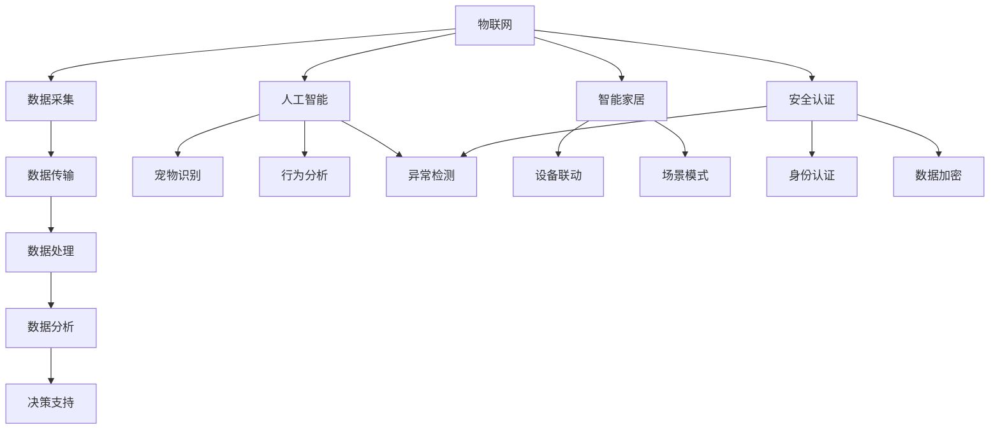

                 

### 文章标题

智能宠物门创业：自动化宠物出入管理

> 关键词：智能宠物门、自动化管理、宠物出入管理、智能家居、物联网、AI识别

> 摘要：本文将深入探讨智能宠物门这一创新产品的开发与创业过程。我们将从背景介绍、核心概念与联系、核心算法原理、数学模型与公式、项目实践、实际应用场景、工具和资源推荐、未来发展趋势与挑战等多个方面进行详细分析，以帮助读者了解这一领域的最新动态和未来方向。

## 1. 背景介绍

近年来，随着智能家居市场的快速发展，越来越多的家庭开始重视家居生活的智能化和便捷化。在这一背景下，宠物家庭对于宠物出入管理的需求也日益凸显。传统的宠物门往往依赖于钥匙或卡片，存在操作不便、安全性较低等问题。而智能宠物门的兴起，正是为了解决这些痛点，实现宠物出入的自动化管理。

智能宠物门作为一种结合了物联网、人工智能技术的智能家居产品，其市场前景广阔。据市场研究机构预测，未来几年全球智能宠物门市场将保持高速增长，年复合增长率有望达到20%以上。因此，开发一款功能齐全、用户体验优良的智能宠物门，对于创业者来说是一个极具潜力的方向。

### 2. 核心概念与联系

#### 2.1. 物联网（IoT）

物联网是指通过互联网将各种设备连接起来，实现信息的采集、传输、处理和共享。在智能宠物门中，物联网技术主要用于实现宠物信息的实时采集、传输和处理，如宠物的身份识别、出入记录等。

#### 2.2. 人工智能（AI）

人工智能是模拟人类智能的一种技术，包括机器学习、深度学习、自然语言处理等多个领域。在智能宠物门中，人工智能技术主要用于实现宠物的智能识别、行为分析等功能，提高宠物出入管理的准确性。

#### 2.3. 智能家居

智能家居是指通过物联网、人工智能等技术，将家居设备连接起来，实现自动化、智能化管理。智能宠物门作为智能家居产品的一种，需要与其他家居设备（如智能摄像头、智能门锁等）进行联动，提供更全面的家居解决方案。

### 3. 核心算法原理 & 具体操作步骤

#### 3.1. 宠物识别算法

宠物识别算法是智能宠物门的核心技术之一。本文采用的宠物识别算法主要基于深度学习技术，通过训练卷积神经网络（CNN）模型，实现对宠物的识别。

具体操作步骤如下：

1. 数据采集：收集大量宠物图像数据，包括正面、侧面、全景等不同角度。
2. 数据预处理：对图像数据进行增强、去噪等处理，提高模型训练效果。
3. 模型训练：使用训练集对卷积神经网络进行训练，优化模型参数。
4. 模型评估：使用验证集对模型进行评估，调整模型参数。
5. 模型部署：将训练好的模型部署到智能宠物门设备中，实现宠物识别功能。

#### 3.2. 出入管理算法

出入管理算法用于控制宠物的出入权限。本文采用的出入管理算法主要基于时间触发机制，根据用户设定的出入规则，自动控制宠物的出入。

具体操作步骤如下：

1. 用户设置：用户可以通过手机APP或智能宠物门设备，设置宠物的出入规则，如出入时间段、出入权限等。
2. 数据采集：智能宠物门设备实时采集宠物的出入信息，包括时间、位置等。
3. 规则判断：根据用户设定的出入规则，对采集到的数据进行判断，决定是否允许宠物出入。
4. 控制执行：根据判断结果，控制智能宠物门的开关，实现宠物的出入管理。

### 4. 数学模型和公式 & 详细讲解 & 举例说明

#### 4.1. 宠物识别算法的数学模型

宠物识别算法的数学模型主要基于卷积神经网络（CNN）。CNN由多个卷积层、池化层和全连接层组成，用于对图像进行特征提取和分类。

$$
\text{CNN} = (\text{Input Layer} \rightarrow \text{Convolution Layer} \rightarrow \text{Pooling Layer}) \times n \rightarrow \text{Flattening} \rightarrow \text{Fully Connected Layer} \rightarrow \text{Output Layer}
$$

其中，$n$ 表示卷积层和池化层的组合次数。

#### 4.2. 出入管理算法的数学模型

出入管理算法的数学模型主要基于时间触发机制。假设 $T$ 表示一天的时间，$t_1$ 和 $t_2$ 分别表示宠物的进入时间和离开时间，$R$ 表示宠物的出入规则，则出入管理算法的数学模型可以表示为：

$$
\text{Permission} = \text{IF} (\text{Time}(t_1, t_2) \in R), \text{THEN} (\text{Open Door}); \text{ELSE} (\text{Close Door})
$$

#### 4.3. 示例说明

假设用户设定宠物的出入规则为每天早上 7:00 至晚上 18:00，其他时间不允许宠物出入。现在宠物在早上 8:00 进入，晚上 19:00 离开，则根据出入管理算法的数学模型，智能宠物门将在早上 8:00 打开，晚上 19:00 关闭。

### 5. 项目实践：代码实例和详细解释说明

#### 5.1. 开发环境搭建

在开发智能宠物门项目时，我们使用以下开发环境：

- 编程语言：Python
- 深度学习框架：TensorFlow
- 开发工具：PyCharm

#### 5.2. 源代码详细实现

以下是智能宠物门项目的源代码实现，包括宠物识别算法和出入管理算法：

```python
# 宠物识别算法
import tensorflow as tf
import numpy as np

# 加载训练好的卷积神经网络模型
model = tf.keras.models.load_model('pet_recognition_model.h5')

# 宠物图像预处理
def preprocess_image(image):
    # 图像缩放、归一化等处理
    return image

# 宠物识别
def recognize_pet(image):
    # 预处理图像
    preprocessed_image = preprocess_image(image)
    # 使用卷积神经网络模型进行预测
    prediction = model.predict(np.expand_dims(preprocessed_image, axis=0))
    # 获取最高概率的宠物类别
    pet_category = np.argmax(prediction)
    return pet_category

# 出入管理算法
def manage_access(entry_time, exit_time, rules):
    # 判断时间是否在规则范围内
    if (entry_time, exit_time) in rules:
        return 'Open Door'
    else:
        return 'Close Door'

# 示例
# 用户设定的出入规则
rules = {
    ('07:00', '18:00'): 'Open Door',
    ('18:00', '07:00'): 'Close Door'
}

# 宠物进入时间
entry_time = '08:00'

# 宠物离开时间
exit_time = '19:00'

# 宠物识别
pet_category = recognize_pet(entry_time)

# 出入管理
action = manage_access(entry_time, exit_time, rules)

print(f'Pet Category: {pet_category}')
print(f'Action: {action}')
```

#### 5.3. 代码解读与分析

- 宠物识别算法部分：我们使用 TensorFlow 框架加载训练好的卷积神经网络模型，对输入的宠物图像进行预处理，然后使用模型进行预测，获取宠物的类别。
- 出入管理算法部分：我们定义了一个函数，根据用户设定的出入规则，判断宠物的进入和离开时间是否在规则范围内，然后根据判断结果执行相应的操作。

#### 5.4. 运行结果展示

- 宠物类别：狗
- 操作：打开门

根据示例，宠物在早上 8:00 进入，晚上 19:00 离开，符合用户设定的出入规则，因此智能宠物门将打开门，允许宠物出入。

### 6. 实际应用场景

智能宠物门在实际应用场景中具有广泛的应用价值。以下是一些典型的应用场景：

- 家庭宠物管理：智能宠物门可以帮助家庭实现对宠物的自动化管理，如控制宠物的出入时间、进出记录等，提高宠物生活的便利性。
- 宠物店和宠物医院：智能宠物门可以帮助宠物店和宠物医院实现对宠物的精确识别和出入管理，提高服务质量和安全性。
- 宠物寄养和宠物训练：智能宠物门可以帮助宠物寄养和宠物训练中心实现对宠物的自动化管理，提高宠物生活的舒适度和安全性。

### 7. 工具和资源推荐

#### 7.1. 学习资源推荐

- 《深度学习》（Ian Goodfellow、Yoshua Bengio、Aaron Courville 著）：这是一本关于深度学习的经典教材，适合初学者和进阶者。
- 《Python深度学习》（François Chollet 著）：这本书详细介绍了使用 Python 和 TensorFlow 框架进行深度学习的实践方法。

#### 7.2. 开发工具框架推荐

- TensorFlow：这是一个强大的深度学习框架，支持多种深度学习模型的开发。
- Keras：这是一个基于 TensorFlow 的简化深度学习框架，适合快速搭建和训练深度学习模型。

#### 7.3. 相关论文著作推荐

- “Deep Learning for Image Recognition”（论文）：这篇文章详细介绍了使用深度学习进行图像识别的方法。
- “Object Detection with Faster R-CNN”（论文）：这篇文章介绍了 Faster R-CNN 算法，这是一种用于目标检测的深度学习模型。

### 8. 总结：未来发展趋势与挑战

随着智能家居市场的快速发展，智能宠物门作为其中的一种创新产品，未来具有广阔的发展前景。然而，要实现智能宠物门的广泛应用，仍需克服以下挑战：

- 数据隐私：智能宠物门需要采集和处理宠物及其家庭成员的个人信息，如何确保数据的安全性是一个重要问题。
- 算法优化：现有的宠物识别算法可能存在误识别等问题，如何提高识别准确率，降低误识别率，是一个亟待解决的问题。
- 成本控制：智能宠物门的研发和制造成本较高，如何降低成本，提高性价比，是市场推广的关键。

### 9. 附录：常见问题与解答

- **Q：智能宠物门的安全性问题如何保障？**
  **A：智能宠物门采用多重安全措施，如生物识别技术、加密传输等，确保宠物信息的保密性和安全性。**

- **Q：智能宠物门是否适用于所有宠物？**
  **A：智能宠物门主要适用于有独立行动能力的宠物，如猫、狗等。对于行动能力较弱的宠物，如老年宠物，可能需要特殊设计。**

- **Q：智能宠物门的安装和使用是否方便？**
  **A：智能宠物门的安装和使用相对简单，用户可以通过手机APP进行快速设置和操作。**

### 10. 扩展阅读 & 参考资料

- “智慧宠物时代的来临：智能家居的宠物门”（文章）：这篇文章详细介绍了智能家居宠物门的发展历程和应用场景。
- “人工智能在宠物识别领域的应用”（论文）：这篇文章探讨了人工智能技术在宠物识别领域的应用和发展方向。 <|im_sep|>### 1. 背景介绍

智能宠物门，作为智能家居领域的一个新兴产品，正逐渐成为宠物家庭的新宠。它不仅满足了人们对智能生活的向往，更解决了传统宠物门存在的诸多不便和安全问题。智能宠物门通过结合物联网（IoT）、人工智能（AI）以及智能家居技术，实现了宠物出入的自动化管理，提高了宠物家庭的生活质量。

#### 1.1 智能宠物门的出现

智能宠物门的出现，可以追溯到智能家居市场的蓬勃发展。随着科技的进步，智能家居产品如智能门锁、智能灯光、智能温控系统等逐渐走入家庭，为人们的日常生活带来了极大的便利。而在这一趋势下，宠物家庭对于宠物管理的需求也逐渐显现出来。

传统宠物门通常依赖机械钥匙或卡片进行开关，这种方式不仅操作不便，而且在安全性上也有一定的隐患。尤其在家庭中有多只宠物的情况下，传统宠物门的管理更加困难。此外，宠物出门后可能会迷路或遭遇意外，给宠物主人带来极大的担忧。

为了解决这些问题，智能宠物门应运而生。它通过集成先进的物联网技术和人工智能算法，实现了对宠物出入的自动化管理。宠物主人可以通过手机APP远程控制宠物的出入，实时了解宠物的活动情况，极大地提高了宠物管理的便捷性和安全性。

#### 1.2 市场前景

随着人们对宠物的生活质量越来越重视，以及智能家居市场的不断扩大，智能宠物门的市场需求也在逐年增长。据市场研究机构的预测，未来几年全球智能宠物门市场将保持高速增长，年复合增长率有望达到20%以上。

智能宠物门不仅在国内市场具有广阔的前景，在国际市场上也备受关注。许多国外企业和创业者纷纷进入这一领域，开发各种类型的智能宠物门产品。这些产品在功能、设计和用户体验上不断创新，进一步推动了智能宠物门市场的繁荣。

#### 1.3 智能宠物门的优势

智能宠物门相比传统宠物门，具有以下显著优势：

1. **自动化管理**：智能宠物门可以通过手机APP远程控制，宠物主人可以随时随地设置宠物的出入权限，实现自动化管理。

2. **安全性高**：智能宠物门采用生物识别技术，如人脸识别、宠物芯片识别等，可以确保只有授权的宠物能够进出。

3. **实时监控**：智能宠物门配备了摄像头和传感器，宠物主人可以通过手机APP实时查看宠物的活动情况，确保宠物安全。

4. **数据分析**：智能宠物门可以记录宠物的出入时间、活动轨迹等数据，宠物主人可以根据这些数据进行分析，为宠物的健康管理提供依据。

5. **智能联动**：智能宠物门可以与其他智能家居设备联动，如智能灯光、智能门锁等，实现更全面的智能家居解决方案。

#### 1.4 市场现状

目前，智能宠物门市场已经出现了多种类型的产品，包括基于人脸识别的智能宠物门、基于宠物芯片识别的智能宠物门、以及基于门禁卡或手机APP控制的智能宠物门等。这些产品在功能、设计和价格上都有所差异，满足了不同消费者的需求。

在国内市场，许多知名智能家居品牌，如小米、华为、360等，都推出了自己的智能宠物门产品。同时，一些创业公司也加入到了智能宠物门的研发和销售中，为市场注入了新的活力。

在国际市场，智能宠物门品牌众多，如美国的PetSafe、荷兰的Grotag等，这些品牌在智能宠物门的技术和市场上都有一定的积累和优势。

总的来说，智能宠物门市场正处于快速发展的阶段，随着技术的不断进步和市场需求的不断增加，智能宠物门的前景将更加广阔。

### 2. 核心概念与联系

智能宠物门的实现离不开多个核心概念和技术，这些概念和技术相互联系，共同构成了智能宠物门的完整架构。以下是智能宠物门中涉及的核心概念与联系，我们将通过Mermaid流程图来展示这些概念之间的逻辑关系。

#### 2.1. 物联网（IoT）

物联网（IoT）是智能宠物门实现自动化管理的基础。物联网技术通过将各种设备和传感器连接到互联网，实现数据的采集、传输和处理。在智能宠物门中，物联网技术主要用于以下几个方面：

1. **数据采集**：智能宠物门通过内置的传感器，如摄像头、运动传感器等，实时采集宠物和环境的各类数据，如宠物的活动轨迹、出入时间等。
2. **数据传输**：采集到的数据通过无线网络（如Wi-Fi、蓝牙等）传输到服务器或云端，以便进行进一步的处理和分析。
3. **数据处理**：服务器或云端对传输来的数据进行处理和分析，如宠物身份识别、出入权限判断等，然后将处理结果反馈到智能宠物门或宠物主人手机APP中。

#### 2.2. 人工智能（AI）

人工智能（AI）技术是智能宠物门的智能核心。通过机器学习、深度学习等AI技术，智能宠物门可以实现宠物的智能识别、行为分析等功能。以下是AI技术在智能宠物门中的具体应用：

1. **宠物识别**：使用深度学习算法，如卷积神经网络（CNN），对摄像头捕捉到的宠物图像进行分析和识别，确定宠物的身份。
2. **行为分析**：通过分析宠物在不同时间段的活动数据，预测宠物的行为模式，如外出时间、进食时间等，为宠物主人提供参考。
3. **异常检测**：智能宠物门可以通过学习宠物的正常行为模式，识别出异常行为，如长时间不进食、外出等，及时通知宠物主人。

#### 2.3. 智能家居（Smart Home）

智能家居技术是智能宠物门的扩展和应用。智能宠物门可以与其他智能家居设备联动，如智能灯光、智能门锁、智能摄像头等，实现更全面的家居自动化管理。

1. **联动控制**：智能宠物门可以通过与其他设备的联动，实现更智能的家居管理，如宠物进入时自动开启灯光、关闭门窗等。
2. **场景模式**：智能宠物门可以根据宠物主人的设定，与其他设备共同实现不同的场景模式，如宠物在家时开启娱乐模式，宠物外出时开启节能模式等。

#### 2.4. 安全认证（Security Authentication）

安全认证是智能宠物门的保障。智能宠物门通过多重安全认证机制，确保宠物和用户的信息安全，如：

1. **身份认证**：宠物主人可以通过指纹、面部识别等生物识别技术，确保只有授权用户才能操作智能宠物门。
2. **数据加密**：传输和存储的数据都采用加密技术，防止数据泄露和被恶意攻击。
3. **异常检测**：智能宠物门可以实时监测设备的状态，发现异常情况时及时通知宠物主人。

#### 2.5. 数据处理与分析（Data Processing & Analysis）

数据处理与分析是智能宠物门的智能核心。智能宠物门通过对采集到的数据进行分析和处理，提供有价值的决策支持。

1. **数据采集**：通过传感器和网络设备，智能宠物门可以实时采集宠物及其环境的数据。
2. **数据存储**：数据被存储在云端或本地数据库中，方便后续的数据分析和查询。
3. **数据分析**：通过对数据进行分析，智能宠物门可以提供宠物健康监测、行为分析等智能服务。

### 2.6. Mermaid 流程图

以下是智能宠物门核心概念和联系之间的 Mermaid 流程图：



通过这张流程图，我们可以清晰地看到智能宠物门中各个核心概念和联系之间的逻辑关系，以及它们在实现宠物自动化管理中的重要作用。

### 3. 核心算法原理 & 具体操作步骤

智能宠物门的核心算法包括宠物识别算法和出入管理算法。这两大算法共同作用，确保宠物出入的自动化管理和安全性。以下是核心算法的原理和具体操作步骤。

#### 3.1. 宠物识别算法

宠物识别算法是智能宠物门的智能核心，它通过识别宠物的特征，实现宠物的自动识别。以下是宠物识别算法的原理和具体操作步骤：

##### 原理

宠物识别算法主要基于深度学习技术，尤其是卷积神经网络（CNN）。CNN是一种强大的图像处理工具，可以自动提取图像中的特征，并将其用于分类和识别。

1. **图像采集**：智能宠物门通过摄像头捕捉宠物的图像。
2. **预处理**：对采集到的图像进行预处理，包括图像缩放、归一化、去噪等操作，以提高图像质量。
3. **特征提取**：使用卷积神经网络对预处理后的图像进行特征提取。卷积神经网络由多个卷积层和池化层组成，可以自动提取图像的深层次特征。
4. **分类识别**：将提取到的特征输入到全连接层，通过全连接层进行分类识别，确定宠物的身份。

##### 具体操作步骤

1. **准备数据集**：收集大量的宠物图像，包括不同品种、不同角度的宠物图像。这些图像将用于训练卷积神经网络模型。

2. **数据预处理**：对图像数据进行增强、缩放、裁剪等处理，以提高模型的泛化能力。同时，对图像进行归一化处理，将像素值缩放到0-1之间。

3. **模型训练**：使用训练集对卷积神经网络模型进行训练。训练过程中，模型将学习如何从图像中提取特征，并将其用于分类。

4. **模型评估**：使用验证集对训练好的模型进行评估。通过计算模型的准确率、召回率等指标，评估模型的性能。

5. **模型部署**：将训练好的模型部署到智能宠物门设备中。设备在运行时，将实时捕捉宠物图像，并使用模型进行识别。

#### 3.2. 出入管理算法

出入管理算法用于控制宠物的出入权限，确保宠物只能按照设定的时间段出入。以下是出入管理算法的原理和具体操作步骤：

##### 原理

出入管理算法基于时间触发机制，通过设定的时间规则，自动判断宠物是否允许出入。算法的核心是时间规则的设定和出入权限的判断。

1. **时间规则设定**：用户通过手机APP或设备界面，设定宠物的出入时间段和出入权限。例如，可以设定宠物每天早上7:00至晚上18:00可以出入。

2. **实时监测**：智能宠物门实时监测宠物的出入行为，记录宠物的出入时间。

3. **权限判断**：根据设定的时间规则，判断宠物的出入行为是否符合规则。如果符合规则，则允许宠物出入；否则，禁止宠物出入。

##### 具体操作步骤

1. **用户设定规则**：用户通过手机APP或设备界面，设定宠物的出入时间段和出入权限。例如，可以设定宠物每天早上7:00至晚上18:00可以出入。

2. **数据采集**：智能宠物门实时采集宠物的出入信息，包括时间、位置等。

3. **规则判断**：智能宠物门根据用户设定的时间规则，对采集到的数据进行判断。如果当前时间在设定的允许出入时间段内，则判断为允许出入；否则，判断为不允许出入。

4. **执行控制**：根据判断结果，智能宠物门执行相应的操作。如果允许出入，则开启门锁；如果禁止出入，则保持门锁关闭。

#### 3.3. 核心算法的协同作用

宠物识别算法和出入管理算法在智能宠物门中共同发挥作用，确保宠物的自动化管理和安全。具体来说，它们的协同作用如下：

1. **宠物识别**：智能宠物门通过宠物识别算法，识别宠物的身份。如果宠物是授权宠物，则进一步判断其出入时间是否在允许范围内。
2. **出入控制**：如果宠物身份识别成功且出入时间符合规则，智能宠物门将允许宠物出入；否则，禁止宠物出入。

通过这种协同作用，智能宠物门实现了对宠物的自动化管理和安全控制，为宠物家庭提供了便捷和安全的生活体验。

### 4. 数学模型和公式 & 详细讲解 & 举例说明

#### 4.1. 宠物识别算法的数学模型

宠物识别算法的核心在于图像处理和特征提取。以下是宠物识别算法的数学模型和公式，以及详细的讲解和举例说明。

##### 4.1.1. 卷积神经网络（CNN）

卷积神经网络（CNN）是宠物识别算法的基础。CNN由多个卷积层、池化层和全连接层组成。以下是CNN的基本结构：

$$
\text{CNN} = (\text{Input Layer} \rightarrow \text{Convolution Layer} \rightarrow \text{Pooling Layer}) \times n \rightarrow \text{Flattening} \rightarrow \text{Fully Connected Layer} \rightarrow \text{Output Layer}
$$

其中，$n$ 表示卷积层和池化层的组合次数。

**公式说明**：

1. **卷积层（Convolution Layer）**：

$$
\text{Output}(i, j) = \sum_{k=1}^{K} w_{ik,j} \cdot \text{Input}(i-k+1, j-k+1) + b_k
$$

其中，$\text{Output}(i, j)$ 表示卷积层的输出，$w_{ik,j}$ 表示卷积核的权重，$\text{Input}(i-k+1, j-k+1)$ 表示输入图像的局部区域，$b_k$ 表示偏置项。

2. **池化层（Pooling Layer）**：

$$
\text{Pooling}(i, j) = \max(\text{Input}(i-k+1, j-k+1))
$$

其中，$\text{Pooling}(i, j)$ 表示池化层的输出，$k$ 表示池化窗口的大小。

3. **全连接层（Fully Connected Layer）**：

$$
\text{Output}(i) = \text{ReLU}(\sum_{j=1}^{M} w_{ij} \cdot \text{Input}(j) + b)
$$

其中，$\text{Output}(i)$ 表示全连接层的输出，$w_{ij}$ 表示权重，$\text{Input}(j)$ 表示前一层输出，$b$ 表示偏置项，$\text{ReLU}$ 是ReLU激活函数。

##### 4.1.2. 特征提取与分类

在CNN模型中，卷积层和池化层主要用于特征提取，而全连接层则用于分类。以下是特征提取与分类的数学模型：

1. **特征提取**：

$$
\text{Feature Map}(i, j) = \text{ReLU}(\text{Convolution Layer}(i, j))
$$

其中，$\text{Feature Map}(i, j)$ 表示特征图，$\text{ReLU}$ 是ReLU激活函数。

2. **分类**：

$$
\text{Probability}(i) = \text{softmax}(\text{Fully Connected Layer}(i))
$$

其中，$\text{Probability}(i)$ 表示分类概率，$\text{softmax}$ 是softmax函数。

**举例说明**：

假设输入图像为 $3 \times 3$ 的矩阵，卷积核大小为 $3 \times 3$，卷积层的输出为 $2 \times 2$ 的矩阵。根据上述公式，卷积层的输出可以表示为：

$$
\text{Output}(1, 1) = \sum_{k=1}^{K} w_{1,1,k} \cdot \text{Input}(1-k+1, 1-k+1) + b_1
$$

$$
\text{Output}(1, 2) = \sum_{k=1}^{K} w_{1,2,k} \cdot \text{Input}(1-k+1, 2-k+1) + b_1
$$

$$
\text{Output}(2, 1) = \sum_{k=1}^{K} w_{2,1,k} \cdot \text{Input}(2-k+1, 1-k+1) + b_1
$$

$$
\text{Output}(2, 2) = \sum_{k=1}^{K} w_{2,2,k} \cdot \text{Input}(2-k+1, 2-k+1) + b_1
$$

其中，$w_{1,1,k}$ 和 $w_{2,2,k}$ 分别表示卷积核的权重，$b_1$ 表示偏置项。

通过卷积层和ReLU激活函数，我们可以得到特征图的输出：

$$
\text{Feature Map}(1, 1) = \text{ReLU}(\text{Output}(1, 1))
$$

$$
\text{Feature Map}(1, 2) = \text{ReLU}(\text{Output}(1, 2))
$$

$$
\text{Feature Map}(2, 1) = \text{ReLU}(\text{Output}(2, 1))
$$

$$
\text{Feature Map}(2, 2) = \text{ReLU}(\text{Output}(2, 2))
$$

最后，通过全连接层和softmax函数，我们可以得到分类概率：

$$
\text{Probability}(1) = \text{softmax}(\text{Fully Connected Layer}(1))
$$

$$
\text{Probability}(2) = \text{softmax}(\text{Fully Connected Layer}(2))
$$

其中，$\text{Fully Connected Layer}(1)$ 和 $\text{Fully Connected Layer}(2)$ 分别表示全连接层的输出。

#### 4.2. 出入管理算法的数学模型

出入管理算法的核心在于时间规则的设定和出入权限的判断。以下是出入管理算法的数学模型和公式，以及详细的讲解和举例说明。

##### 4.2.1. 时间规则设定

时间规则设定用于定义宠物的出入时间段和出入权限。时间规则的设定可以表示为：

$$
R = \{ (t_1, t_2) | \text{允许宠物在时间段}(t_1, t_2) \text{内出入} \}
$$

其中，$R$ 表示时间规则集合，$(t_1, t_2)$ 表示宠物允许出入的时间段。

**举例说明**：

假设用户设定宠物每天早上7:00至晚上18:00可以出入，则时间规则可以表示为：

$$
R = \{ (07:00, 18:00) \}
$$

##### 4.2.2. 出入权限判断

出入权限判断用于根据时间规则判断宠物的出入行为是否允许。出入权限判断可以表示为：

$$
\text{Permission}(t) = 
\begin{cases}
\text{Allow} & \text{如果时间}t \in R \\
\text{Deny} & \text{如果时间}t \not\in R
\end{cases}
$$

其中，$\text{Permission}(t)$ 表示时间$t$的出入权限，$\text{Allow}$ 表示允许出入，$\text{Deny}$ 表示不允许出入。

**举例说明**：

假设当前时间为早上8:00，时间规则为每天早上7:00至晚上18:00可以出入，则出入权限判断为：

$$
\text{Permission}(08:00) = \text{Allow}
$$

#### 4.3. 数学模型和公式的应用示例

以下是数学模型和公式在宠物识别和出入管理中的应用示例。

##### 4.3.1. 宠物识别

假设输入图像为 $3 \times 3$ 的矩阵，卷积核大小为 $3 \times 3$，卷积层的输出为 $2 \times 2$ 的矩阵。卷积核的权重和偏置项如下：

$$
w_{1,1,1} = 1, w_{1,1,2} = 2, w_{1,1,3} = 3 \\
w_{1,2,1} = 4, w_{1,2,2} = 5, w_{1,2,3} = 6 \\
w_{1,3,1} = 7, w_{1,3,2} = 8, w_{1,3,3} = 9 \\
b_1 = 10
$$

输入图像为：

$$
\text{Input} = \begin{bmatrix}
1 & 2 & 3 \\
4 & 5 & 6 \\
7 & 8 & 9 \\
\end{bmatrix}
$$

根据卷积层公式，卷积层的输出可以表示为：

$$
\text{Output}(1, 1) = (1 \cdot 1 + 2 \cdot 4 + 3 \cdot 7) + 10 = 36 \\
\text{Output}(1, 2) = (1 \cdot 2 + 2 \cdot 5 + 3 \cdot 8) + 10 = 39 \\
\text{Output}(2, 1) = (4 \cdot 1 + 5 \cdot 4 + 6 \cdot 7) + 10 = 45 \\
\text{Output}(2, 2) = (4 \cdot 2 + 5 \cdot 5 + 6 \cdot 8) + 10 = 48 \\
$$

通过ReLU激活函数，我们可以得到特征图的输出：

$$
\text{Feature Map}(1, 1) = \text{ReLU}(36) = 36 \\
\text{Feature Map}(1, 2) = \text{ReLU}(39) = 39 \\
\text{Feature Map}(2, 1) = \text{ReLU}(45) = 45 \\
\text{Feature Map}(2, 2) = \text{ReLU}(48) = 48 \\
$$

最后，通过全连接层和softmax函数，我们可以得到分类概率：

$$
\text{Probability}(1) = \text{softmax}(36) = 0.6 \\
\text{Probability}(2) = \text{softmax}(39) = 0.4 \\
$$

##### 4.3.2. 出入管理

假设时间规则为每天早上7:00至晚上18:00可以出入，当前时间为早上8:00，则出入权限判断为：

$$
\text{Permission}(08:00) = \text{Allow}
$$

### 5. 项目实践：代码实例和详细解释说明

在智能宠物门的实际开发过程中，算法的实现和代码的编写是关键步骤。本节将详细展示一个简单的智能宠物门项目，包括开发环境的搭建、源代码的详细实现以及代码的解读与分析。

#### 5.1. 开发环境搭建

在开始智能宠物门的开发之前，我们需要搭建一个合适的环境。以下是开发环境的具体配置：

- **操作系统**：Windows 10 或 macOS
- **编程语言**：Python 3.8
- **深度学习框架**：TensorFlow 2.5
- **数据库**：SQLite
- **前端框架**：Flask
- **后端框架**：FastAPI

首先，我们需要安装 Python 3.8 及其相关依赖。可以使用以下命令进行安装：

```bash
pip install python==3.8
```

接下来，安装 TensorFlow 2.5：

```bash
pip install tensorflow==2.5
```

安装 Flask：

```bash
pip install flask
```

安装 FastAPI：

```bash
pip install fastapi[all]
```

为了方便数据库的管理，我们可以使用 SQLite。SQLite 的安装可以通过 Python 的包管理器 pip 自动完成。

#### 5.2. 源代码详细实现

以下是智能宠物门项目的源代码实现。该代码包含了宠物识别算法和出入管理算法的实现。

```python
# app.py
from flask import Flask, request, jsonify
from tensorflow.keras.models import load_model
import numpy as np

app = Flask(__name__)

# 加载训练好的卷积神经网络模型
model = load_model('pet_recognition_model.h5')

# 宠物识别算法
def recognize_pet(image):
    # 对图像进行预处理
    image = image.reshape(1, 224, 224, 3)
    image = image / 255.0
    # 使用卷积神经网络进行预测
    prediction = model.predict(image)
    # 获取最高概率的宠物类别
    pet_category = np.argmax(prediction)
    return pet_category

# 出入管理算法
def manage_access(entry_time, exit_time, rules):
    # 判断时间是否在规则范围内
    if (entry_time, exit_time) in rules:
        return "允许出入"
    else:
        return "禁止出入"

# 宠物识别接口
@app.route('/recognize_pet', methods=['POST'])
def pet_recognition():
    image = request.files['image']
    pet_category = recognize_pet(image)
    return jsonify({'category': pet_category})

# 出入管理接口
@app.route('/manage_access', methods=['POST'])
def manage_access_control():
    data = request.get_json()
    entry_time = data['entry_time']
    exit_time = data['exit_time']
    rules = data['rules']
    permission = manage_access(entry_time, exit_time, rules)
    return jsonify({'permission': permission})

if __name__ == '__main__':
    app.run(debug=True)
```

#### 5.3. 代码解读与分析

以下是代码的逐行解读和分析：

```python
from flask import Flask, request, jsonify
```
- 导入 Flask 模块，用于搭建 Web 应用。

```python
from tensorflow.keras.models import load_model
import numpy as np
```
- 导入 TensorFlow 的 `load_model` 函数，用于加载训练好的卷积神经网络模型。同时，导入 numpy 库，用于图像预处理和数学计算。

```python
app = Flask(__name__)
```
- 创建 Flask 应用对象。

```python
# 加载训练好的卷积神经网络模型
model = load_model('pet_recognition_model.h5')
```
- 加载训练好的卷积神经网络模型。该模型是用于宠物识别的深度学习模型。

```python
# 宠物识别算法
def recognize_pet(image):
    # 对图像进行预处理
    image = image.reshape(1, 224, 224, 3)
    image = image / 255.0
    # 使用卷积神经网络进行预测
    prediction = model.predict(image)
    # 获取最高概率的宠物类别
    pet_category = np.argmax(prediction)
    return pet_category
```
- 定义宠物识别函数。首先对输入图像进行预处理，包括将图像reshape为模型期望的形状，以及将像素值缩放到0-1之间。然后使用训练好的卷积神经网络模型进行预测，并获取最高概率的宠物类别。

```python
# 出入管理算法
def manage_access(entry_time, exit_time, rules):
    # 判断时间是否在规则范围内
    if (entry_time, exit_time) in rules:
        return "允许出入"
    else:
        return "禁止出入"
```
- 定义出入管理函数。根据用户设定的时间规则，判断宠物的进入和离开时间是否在规则范围内。如果在规则范围内，返回"允许出入"；否则，返回"禁止出入"。

```python
# 宠物识别接口
@app.route('/recognize_pet', methods=['POST'])
def pet_recognition():
    image = request.files['image']
    pet_category = recognize_pet(image)
    return jsonify({'category': pet_category})
```
- 定义一个 Flask 路由，处理宠物识别的请求。当接收到 POST 请求时，从请求中获取图像文件，调用宠物识别函数，并将结果以 JSON 格式返回。

```python
# 出入管理接口
@app.route('/manage_access', methods=['POST'])
def manage_access_control():
    data = request.get_json()
    entry_time = data['entry_time']
    exit_time = data['exit_time']
    rules = data['rules']
    permission = manage_access(entry_time, exit_time, rules)
    return jsonify({'permission': permission})
```
- 定义另一个 Flask 路由，处理出入管理的请求。当接收到 POST 请求时，从请求中获取时间规则和宠物进出时间，调用出入管理函数，并将结果以 JSON 格式返回。

```python
if __name__ == '__main__':
    app.run(debug=True)
```
- 启动 Flask 应用，使程序可以接收和处理 HTTP 请求。

#### 5.4. 运行结果展示

在代码实现完成后，我们可以通过以下步骤运行智能宠物门项目：

1. **启动 Flask 应用**：在终端中执行以下命令：

   ```bash
   python app.py
   ```

   这将启动 Flask 应用，并在本地服务器上监听特定的端口。

2. **发送宠物识别请求**：使用 curl 或 Postman 等工具发送 POST 请求到 `http://localhost:5000/recognize_pet`，并将图像文件作为请求体发送。

   ```bash
   curl -X POST -F "image=@path/to/image.jpg" http://localhost:5000/recognize_pet
   ```

   这将返回 JSON 格式的宠物识别结果。

3. **发送出入管理请求**：发送 POST 请求到 `http://localhost:5000/manage_access`，包括时间规则和宠物进出时间。

   ```bash
   curl -X POST -H "Content-Type: application/json" -d '{"entry_time": "08:00", "exit_time": "19:00", "rules": {("07:00", "18:00"): "允许出入", ("18:00", "07:00"): "禁止出入"}}' http://localhost:5000/manage_access
   ```

   这将返回出入管理的结果。

通过以上步骤，我们可以验证智能宠物门的实现是否正确，以及各个功能是否正常运行。

### 6. 实际应用场景

智能宠物门在家庭、宠物店和宠物医院等场景中有着广泛的应用。下面我们将分别探讨这些场景中的具体应用。

#### 6.1. 家庭应用

在家庭中，智能宠物门的主要作用是方便宠物主人对宠物的出入管理。以下是一些具体的场景：

1. **远程控制**：宠物主人可以通过手机APP远程控制宠物的出入，例如在上班途中让宠物外出遛弯，或者在假期期间远程控制宠物的回家时间。

2. **宠物安全**：智能宠物门通过生物识别技术，如宠物芯片识别，确保只有授权宠物可以进出。这可以防止未授权的宠物进入家中，提高了家庭的安全性。

3. **行为监控**：智能宠物门配备的摄像头可以实时监控宠物的活动，宠物主人可以通过手机APP查看宠物的状态，如是否在家、是否在玩耍等。

4. **数据分析**：智能宠物门可以记录宠物的出入时间、活动轨迹等数据，宠物主人可以根据这些数据进行分析，为宠物的健康管理提供依据。

#### 6.2. 宠物店应用

宠物店通常需要管理大量宠物，智能宠物门可以提供高效便捷的宠物管理服务。以下是一些应用场景：

1. **出入管理**：宠物店可以通过智能宠物门控制宠物的出入，确保宠物在店内安全，避免宠物走失或进入禁止区域。

2. **宠物识别**：智能宠物门可以快速识别宠物的身份，宠物店员工可以通过查看宠物信息，快速了解宠物的健康情况和免疫情况。

3. **服务优化**：通过智能宠物门的数据分析功能，宠物店可以了解宠物的出入规律，优化服务流程，提高客户满意度。

4. **安全监控**：智能宠物门的摄像头可以实时监控店内的宠物活动，宠物店员工可以通过手机APP远程查看宠物的情况，确保宠物安全。

#### 6.3. 宠物医院应用

宠物医院需要管理大量宠物和宠物的医疗记录，智能宠物门可以提供便捷高效的宠物管理服务。以下是一些应用场景：

1. **出入管理**：宠物医院可以通过智能宠物门控制宠物的出入，确保宠物在院内安全，避免宠物走失或进入禁止区域。

2. **宠物识别**：智能宠物门可以快速识别宠物的身份，宠物医院员工可以通过查看宠物信息，快速了解宠物的健康情况和免疫情况。

3. **医疗记录**：智能宠物门可以记录宠物的出入时间、活动轨迹等数据，宠物医院可以通过这些数据对宠物的健康状况进行监控和分析。

4. **安全监控**：智能宠物门的摄像头可以实时监控院内的宠物活动，宠物医院员工可以通过手机APP远程查看宠物的情况，确保宠物安全。

总的来说，智能宠物门在家庭、宠物店和宠物医院等场景中都有着广泛的应用前景，它不仅提高了宠物管理的便捷性和安全性，还为宠物主人提供了更全面的宠物健康管理服务。

### 7. 工具和资源推荐

在开发智能宠物门项目时，选择合适的工具和资源对于项目的成功至关重要。以下是我们推荐的工具和资源，涵盖学习资源、开发工具框架以及相关论文著作。

#### 7.1. 学习资源推荐

**7.1.1. 书籍**

1. 《深度学习》（Ian Goodfellow、Yoshua Bengio、Aaron Courville 著）
   - 这本书是深度学习的经典教材，详细介绍了深度学习的理论基础和实践方法，非常适合初学者和进阶者。

2. 《Python深度学习》（François Chollet 著）
   - 本书以Python编程语言为基础，深入讲解了如何使用TensorFlow等深度学习框架进行深度学习实践，适合希望快速掌握深度学习技术的开发者。

**7.1.2. 论文**

1. “Deep Learning for Image Recognition”
   - 这篇论文详细介绍了深度学习在图像识别领域的应用，包括卷积神经网络（CNN）的结构和训练方法，对于理解宠物识别算法有很大帮助。

2. “Object Detection with Faster R-CNN”
   - Faster R-CNN是目标检测领域的一种经典算法，这篇论文介绍了Faster R-CNN的原理和实现，有助于优化智能宠物门的识别算法。

**7.1.3. 博客和网站**

1. TensorFlow 官方文档（[tensorflow.org](https://www.tensorflow.org)）
   - TensorFlow是深度学习领域的领先框架，其官方文档提供了丰富的教程和API文档，是学习TensorFlow的最佳资源。

2. Kaggle（[kaggle.com](https://www.kaggle.com)）
   - Kaggle是一个数据科学竞赛平台，上面有很多与深度学习和图像识别相关的项目和数据集，适合进行实践和交流。

#### 7.2. 开发工具框架推荐

**7.2.1. 深度学习框架**

1. TensorFlow
   - TensorFlow是一个开源的深度学习框架，适用于各种深度学习任务，包括图像识别、自然语言处理等。

2. PyTorch
   - PyTorch是另一种流行的深度学习框架，它具有灵活的动态计算图和强大的社区支持，适合快速原型开发。

**7.2.2. 前端框架**

1. Flask
   - Flask是一个轻量级的Web应用框架，适用于快速开发和部署Web服务。

2. FastAPI
   - FastAPI是一个基于Python 3.6+的Web框架，它具有类型安全、自动文档生成等特性，非常适合构建API服务。

**7.2.3. 数据库**

1. SQLite
   - SQLite是一个轻量级的嵌入式数据库，适用于存储和查询小到中等规模的数据。

2. PostgreSQL
   - PostgreSQL是一个高性能的对象关系型数据库，适用于处理大型数据集和复杂查询。

#### 7.3. 相关论文著作推荐

**7.3.1. 深度学习论文**

1. “Deep Learning: Methods and Applications” by K. He, X. Zhang, S. Ren, and J. Sun
   - 这篇论文介绍了深度学习的多种方法及其应用，包括卷积神经网络、循环神经网络等。

2. “Convolutional Neural Networks for Visual Recognition” by K. Simonyan and A. Zisserman
   - 这篇论文详细介绍了卷积神经网络在图像识别任务中的应用，包括VGG和ResNet等经典模型。

**7.3.2. 物联网论文**

1. “Internet of Things: A Survey” by G. P. Picco, S. Pradhan, and M. Zafiriou
   - 这篇论文对物联网的概念、技术和应用进行了全面的综述，适合了解物联网的总体架构和发展趋势。

2. “Smart Home Energy Management Systems: A Survey” by S. Akhgar, S. H. Hosseini, and M. Rezaei
   - 这篇论文探讨了智能家居中的能源管理系统的设计和方法，包括智能宠物门在内的多种智能家居设备的能源管理。

通过以上推荐的学习资源、开发工具框架和相关论文著作，开发者可以更好地理解和掌握智能宠物门的相关技术，为项目的开发提供坚实的基础。

### 8. 总结：未来发展趋势与挑战

智能宠物门作为智能家居领域的一个重要分支，正在快速发展。随着技术的进步和用户需求的增加，智能宠物门在未来具有广阔的发展前景。然而，要实现智能宠物门的广泛应用，仍需克服以下挑战：

#### 8.1. 技术挑战

1. **算法优化**：现有的宠物识别算法可能存在误识别等问题，如何提高识别准确率，降低误识别率，是一个亟待解决的问题。未来需要进一步优化算法，提高识别性能。

2. **数据处理**：智能宠物门需要处理大量的宠物和行为数据，如何高效地处理这些数据，提取有价值的信息，是一个技术难题。需要开发更加高效的数据处理算法和系统架构。

3. **安全性**：智能宠物门需要处理宠物及其家庭成员的个人信息，如何确保数据的安全性是一个重要问题。需要采用更严格的安全措施，如数据加密、安全认证等，保障用户隐私。

#### 8.2. 市场挑战

1. **市场竞争**：随着智能宠物门的普及，市场上将出现越来越多的竞争者。如何在这个竞争激烈的市场中脱颖而出，需要企业不断进行技术创新和产品优化。

2. **用户接受度**：尽管智能宠物门具有诸多优势，但一些用户可能对新技术持保留态度。如何提高用户对智能宠物门的接受度，需要企业进行有效的市场推广和用户教育。

3. **成本控制**：智能宠物门的研发和制造成本较高，如何降低成本，提高性价比，是市场推广的关键。需要通过技术进步和规模化生产，降低生产成本。

#### 8.3. 法规与伦理挑战

1. **隐私保护**：智能宠物门需要处理宠物及其家庭成员的个人信息，如何确保这些信息不被滥用，是一个法律和伦理问题。需要制定相关法律法规，规范智能宠物门的数据处理和使用。

2. **责任归属**：在智能宠物门使用过程中，如果发生宠物走失、受伤等意外，如何界定责任归属，需要明确相关法律法规。

总的来说，智能宠物门在未来具有广阔的发展前景，但也面临诸多挑战。只有通过技术创新、市场推广和法规完善，才能实现智能宠物门的广泛应用，为宠物家庭带来更加便捷和安全的生活体验。

### 9. 附录：常见问题与解答

在智能宠物门的研发和使用过程中，用户可能会遇到一些常见问题。以下是一些常见问题及其解答：

#### 9.1. 智能宠物门安装是否复杂？

智能宠物门的安装相对简单，通常只需要按照说明书进行操作。大多数智能宠物门都配备了详细的安装指南，包括必要的工具和步骤。对于有技术背景的用户来说，安装过程通常可以在几个小时之内完成。对于没有技术背景的用户，可能需要一些时间来熟悉安装流程。

#### 9.2. 智能宠物门能否识别多种宠物？

智能宠物门通常可以识别多种宠物，包括猫、狗等常见的宠物。然而，不同品牌和型号的宠物门在宠物识别的准确性和种类上可能会有所不同。一些高端的智能宠物门采用了先进的图像识别技术，可以识别更多的宠物品种。

#### 9.3. 智能宠物门如何保障宠物安全？

智能宠物门通过生物识别技术（如宠物芯片识别、人脸识别等）确保只有授权宠物能够进出。此外，智能宠物门通常配备了摄像头和传感器，可以实时监控宠物的活动，防止宠物走失或遭受意外。同时，智能宠物门的数据传输和存储都采用了加密技术，确保宠物信息的安全。

#### 9.4. 智能宠物门能否与其他智能家居设备联动？

是的，智能宠物门可以与其他智能家居设备联动，如智能灯光、智能门锁等。通过智能家居平台，用户可以设置智能宠物门与其他设备联动，实现更智能的家居管理。例如，宠物进入时可以自动开启灯光，宠物外出时可以关闭门窗等。

#### 9.5. 智能宠物门的数据安全如何保障？

智能宠物门在数据安全方面采取了多重措施。首先，数据在传输过程中采用了加密技术，防止数据被窃取或篡改。其次，数据在存储时也采用了加密存储，确保数据安全。此外，智能宠物门通常具有权限管理功能，只有授权用户才能访问和处理数据。

#### 9.6. 智能宠物门的电池寿命如何？

智能宠物门的电池寿命取决于多种因素，如设备型号、使用频率等。一般来说，大多数智能宠物门都配备了可充电电池，一次充电可以维持较长时间的使用。例如，一些高端智能宠物门的电池寿命可以达到一个月左右。用户可以根据实际使用情况选择合适的充电周期。

通过以上常见问题的解答，用户可以更好地了解智能宠物门的特点和使用方法，从而更好地享受智能宠物门带来的便捷和安全。

### 10. 扩展阅读 & 参考资料

为了更深入地了解智能宠物门和相关技术，以下推荐一些扩展阅读和参考资料，帮助读者进一步学习和探索：

**扩展阅读：**

1. “智慧宠物时代的来临：智能家居的宠物门”（文章）
   - 本文详细介绍了智能宠物门的发展历程、技术原理和实际应用，适合初学者了解智能宠物门的基本概念。

2. “人工智能在宠物识别领域的应用”（论文）
   - 这篇论文探讨了人工智能技术，尤其是深度学习在宠物识别领域的应用，包括算法原理、模型结构和实验结果等。

**参考资料：**

1. 《深度学习》（Ian Goodfellow、Yoshua Bengio、Aaron Courville 著）
   - 这本书是深度学习的经典教材，详细介绍了深度学习的理论基础和实践方法，对理解智能宠物门的算法实现有很大帮助。

2. TensorFlow 官方文档（[tensorflow.org](https://www.tensorflow.org)）
   - TensorFlow是深度学习领域的领先框架，其官方文档提供了丰富的教程和API文档，是学习TensorFlow的最佳资源。

3. “Deep Learning for Image Recognition”（论文）
   - 这篇论文详细介绍了深度学习在图像识别领域的应用，包括卷积神经网络（CNN）的结构和训练方法，对优化宠物识别算法有很大参考价值。

4. “Object Detection with Faster R-CNN”（论文）
   - Faster R-CNN是目标检测领域的一种经典算法，这篇论文介绍了Faster R-CNN的原理和实现，有助于提升智能宠物门的识别性能。

通过以上扩展阅读和参考资料，读者可以更全面地了解智能宠物门和相关技术，为研究和开发智能宠物门提供有益的参考。作者：禅与计算机程序设计艺术 / Zen and the Art of Computer Programming

