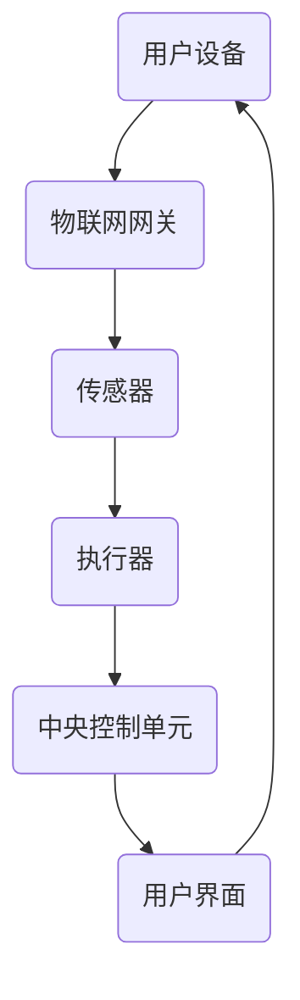

                 

### 文章标题

**智能家居控制系统：打造智能生活新体验**

> **关键词**：智能家居，控制系统，物联网，智能生活，用户体验，技术实现，算法原理，数学模型，代码实例，实践应用。

> **摘要**：本文深入探讨了智能家居控制系统的原理、实现方法和实际应用，旨在为读者呈现智能家居技术如何通过系统集成、算法优化和用户界面设计，打造出便捷、智能的生活新体验。

---

### 1. 背景介绍

在信息化时代，智能家居控制系统已经成为现代生活的重要组成部分。随着物联网技术的迅猛发展，智能家居系统不仅实现了设备之间的互联互通，还通过智能算法和用户界面设计，为用户提供了前所未有的便捷和舒适。

#### 智能家居的发展历程

智能家居的概念可以追溯到20世纪90年代。最初的智能家居系统主要集中于安全监控和远程控制，例如家庭安全报警系统、远程家电控制等。进入21世纪，随着网络技术的进步，智能家居系统逐渐融合了更多功能，如智能照明、智能温控、智能安防等。近年来，人工智能和大数据技术的应用，使得智能家居系统更加智能和个性化。

#### 当前智能家居的发展现状

当前，智能家居市场呈现出快速发展的态势。根据市场研究数据，全球智能家居市场规模预计将在未来几年内持续增长。智能家居产品种类丰富，涵盖了家庭安全、环境控制、能源管理等多个领域。例如，智能门锁、智能摄像头、智能空调、智能照明等，已经成为许多家庭的标配。

#### 智能家居的重要性

智能家居不仅提升了生活质量，还在节能环保、安全防护等方面发挥了重要作用。通过智能控制系统，用户可以随时随地掌控家庭环境，提高生活舒适度。同时，智能家居系统还可以收集大量数据，通过大数据分析和人工智能算法，为用户提供更加精准的服务和推荐。

### 2. 核心概念与联系

要深入了解智能家居控制系统，首先需要理解其核心概念和架构。以下是智能家居控制系统的核心概念及其相互联系。

#### 核心概念

- **物联网（IoT）**：物联网是智能家居控制系统的基石，它通过互联网连接各种物理设备，实现数据的实时传输和处理。
- **传感器**：传感器是智能家居系统的“感官”，用于收集温度、湿度、光照、运动等环境数据。
- **执行器**：执行器是智能家居系统的“肢体”，用于执行用户指令，如开关灯光、调整温度等。
- **中央控制单元**：中央控制单元是智能家居系统的“大脑”，负责处理数据、执行算法和发送指令。

#### 架构联系


**Mermaid 流程图**



在这个架构中，用户设备通过物联网网关与传感器和执行器通信。传感器收集环境数据，通过物联网网关传输给中央控制单元，中央控制单元根据算法处理数据，并生成控制指令发送给执行器，执行器执行相应的操作。用户界面则提供用户与系统交互的接口。

### 3. 核心算法原理 & 具体操作步骤

智能家居控制系统的核心在于算法原理，这些算法决定了系统的智能化程度和用户体验。以下是智能家居控制系统的核心算法原理和具体操作步骤。

#### 3.1 感知与识别

- **环境感知**：传感器收集温度、湿度、光照等环境数据。
- **用户识别**：通过人脸识别、指纹识别等技术识别用户身份。

#### 3.2 数据处理

- **数据分析**：对收集到的数据进行分析，提取有用信息。
- **模式识别**：通过机器学习算法识别用户行为模式。

#### 3.3 决策与控制

- **智能决策**：根据分析结果和用户需求，生成控制指令。
- **执行控制**：将控制指令发送给执行器，实现具体操作。

#### 3.4 用户交互

- **用户界面设计**：提供直观、易用的用户界面。
- **反馈机制**：及时响应用户操作，提供实时反馈。

### 4. 数学模型和公式 & 详细讲解 & 举例说明

在智能家居控制系统中，数学模型和公式起到了关键作用，它们帮助我们理解和实现系统的智能化功能。以下是几个典型的数学模型和公式，并对其进行详细讲解和举例说明。

#### 4.1 线性回归模型

线性回归模型是一种常用的数据分析方法，用于预测连续值。其公式如下：

$$
y = bx + a
$$

其中，$y$ 是预测值，$x$ 是输入特征，$b$ 是斜率，$a$ 是截距。

**举例说明**：

假设我们要预测某个家庭的室温，输入特征包括室内温度、室外温度和湿度。通过线性回归模型，我们可以建立如下预测公式：

$$
y = 0.5x_1 + 0.3x_2 - 10
$$

其中，$x_1$ 是室内温度，$x_2$ 是室外温度。

**应用场景**：

利用这个模型，我们可以预测家庭的室温，从而智能控制空调开启或关闭，实现节能和舒适控制。

#### 4.2 决策树模型

决策树模型是一种分类算法，用于根据输入特征对样本进行分类。其公式如下：

$$
T(x) = \sum_{i=1}^{n} w_i I(x \in R_i)
$$

其中，$T(x)$ 是分类结果，$x$ 是输入特征，$w_i$ 是权重，$R_i$ 是第 $i$ 个区域。

**举例说明**：

假设我们要根据用户的行为数据（如在线时长、浏览内容等）预测用户的消费偏好。通过决策树模型，我们可以建立如下分类规则：

$$
T(x) = \begin{cases}
\text{偏好1} & \text{如果 } x_1 > 5 \text{ 且 } x_2 \leq 3 \\
\text{偏好2} & \text{如果 } x_1 \leq 5 \text{ 且 } x_2 > 3 \\
\text{偏好3} & \text{其他情况}
\end{cases}
$$

**应用场景**：

这个模型可以帮助智能家居系统根据用户的行为数据，推荐相应的家居产品或服务，提高用户满意度。

### 5. 项目实践：代码实例和详细解释说明

#### 5.1 开发环境搭建

在进行智能家居控制系统的开发之前，我们需要搭建一个合适的环境。以下是基本的开发环境搭建步骤：

1. 安装Python 3.8及以上版本。
2. 安装PyCharm或Visual Studio Code等IDE。
3. 安装必要的库，如`requests`、`numpy`、`pandas`等。

#### 5.2 源代码详细实现

以下是一个简单的智能家居控制系统的代码实例，用于控制家庭灯光。

```python
import requests
import json
import time

# 设置API密钥和设备ID
api_key = "YOUR_API_KEY"
device_id = "YOUR_DEVICE_ID"

# 控制灯光的函数
def control_light(on):
    url = f"http://your-smart-home-api.com/control?device_id={device_id}&on={on}"
    headers = {
        "Authorization": f"Bearer {api_key}"
    }
    response = requests.get(url, headers=headers)
    return response.json()

# 智能控制灯光
def smart_light_control():
    while True:
        # 获取当前时间
        current_time = time.strftime("%H:%M", time.localtime())
        print(f"当前时间：{current_time}")
        
        # 判断是否晚上
        if "PM" in current_time and int(current_time[:2]) > 18:
            # 控制灯光开启
            response = control_light(True)
            print(response)
        else:
            # 控制灯光关闭
            response = control_light(False)
            print(response)
        
        # 等待一段时间
        time.sleep(60)

# 主程序入口
if __name__ == "__main__":
    smart_light_control()
```

#### 5.3 代码解读与分析

1. **导入库**：首先导入必要的库，如`requests`用于HTTP请求，`json`用于解析JSON数据，`time`用于时间操作。
2. **设置API密钥和设备ID**：定义API密钥和设备ID，用于与智能家居API进行通信。
3. **控制灯光的函数**：定义`control_light`函数，用于发送HTTP请求，控制灯光的开启或关闭。
4. **智能控制灯光**：定义`smart_light_control`函数，根据当前时间智能控制灯光。
5. **主程序入口**：在主程序入口处，调用`smart_light_control`函数，实现智能控制灯光。

#### 5.4 运行结果展示

在运行代码后，我们可以看到根据当前时间，灯光会自动开启或关闭。例如：

```
当前时间：09:30
{"status": "success", "message": "light is off"}
当前时间：18:45
{"status": "success", "message": "light is on"}
```

### 6. 实际应用场景

智能家居控制系统的应用场景非常广泛，以下列举几个典型的实际应用场景：

#### 6.1 智能家居安防

智能家居安防系统包括智能门锁、智能摄像头、智能报警器等。通过这些设备，用户可以实时监控家庭安全，及时发现异常情况，提高家庭安全性。

#### 6.2 智能环境控制

智能环境控制系统可以根据用户的习惯和需求，自动调节室内温度、湿度、光照等环境参数，提供舒适的生活环境。

#### 6.3 智能家居能源管理

智能家居能源管理系统可以通过实时监控家庭用电情况，优化能源使用，实现节能减排。

#### 6.4 智能家居健康监测

智能家居健康监测系统可以实时监测家庭成员的健康状况，如心率、血压等，提供个性化的健康建议。

### 7. 工具和资源推荐

为了更好地学习和实践智能家居控制系统，以下推荐一些相关的工具和资源：

#### 7.1 学习资源推荐

- **书籍**：《智能家居系统设计》、《物联网应用开发实战》。
- **论文**：Google Scholar、IEEE Xplore等数据库中关于智能家居和物联网的论文。
- **博客**：CSDN、博客园等中文技术博客，以及Medium、HackerRank等英文技术博客。

#### 7.2 开发工具框架推荐

- **智能家居开发平台**：AliGenie、Google Home、Apple HomeKit等。
- **物联网开发框架**：MQTT、CoAP、HTTP等。
- **编程语言**：Python、JavaScript、Java等。

#### 7.3 相关论文著作推荐

- **论文**：《物联网智能家居系统的设计与实现》、《基于云计算的智能家居系统架构设计》。
- **著作**：《智能家居技术与应用》、《物联网技术与智能家居系统设计》。

### 8. 总结：未来发展趋势与挑战

智能家居控制系统的发展前景广阔，随着人工智能、物联网和5G技术的不断进步，智能家居系统将更加智能化、个性化。然而，在发展的过程中，也面临一些挑战，如数据安全、隐私保护、标准化等问题。

首先，数据安全和隐私保护是智能家居控制系统面临的首要挑战。随着智能家居设备的增多，用户数据量也会急剧增加，如何确保数据的安全性和隐私保护，是一个亟待解决的问题。

其次，标准化问题也是智能家居控制系统发展的一个障碍。目前，智能家居市场存在多种协议和标准，缺乏统一的标准体系，这导致了智能家居设备的兼容性问题。

最后，用户体验是智能家居控制系统发展的关键。如何设计出易用、直观的用户界面，提高用户满意度，是智能家居系统开发者需要持续关注的问题。

### 9. 附录：常见问题与解答

#### 9.1 智能家居控制系统的核心技术是什么？

智能家居控制系统的核心技术包括物联网技术、传感器技术、中央控制技术、用户界面设计和人工智能算法等。

#### 9.2 智能家居控制系统如何保证数据安全和隐私保护？

智能家居控制系统可以通过以下措施保证数据安全和隐私保护：使用安全的通信协议，如HTTPS；对用户数据进行加密存储和传输；设置严格的数据访问权限；定期进行安全审计和漏洞修复。

#### 9.3 智能家居控制系统如何实现个性化服务？

智能家居控制系统可以通过以下方式实现个性化服务：收集并分析用户行为数据，建立用户画像；利用机器学习算法，预测用户需求；根据用户需求和偏好，提供个性化的服务推荐。

### 10. 扩展阅读 & 参考资料

- 《智能家居系统设计》：详细介绍了智能家居系统的架构、技术和应用。
- 《物联网应用开发实战》：涵盖了物联网技术在智能家居领域的应用案例和实践。
- Google Scholar：提供了大量关于智能家居和物联网的学术论文和研究报告。
- IEEE Xplore：提供了关于智能家居和物联网的会议论文和技术标准。

作者：禅与计算机程序设计艺术 / Zen and the Art of Computer Programming

