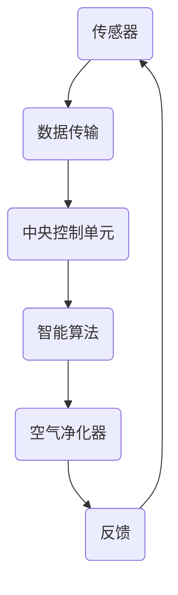

                 

### 背景介绍

随着科技的飞速发展，智能家居逐渐成为现代生活的重要组成部分。从最初的单一设备，如智能灯泡、智能锁，到如今的全屋智能系统，智能家居正以其便捷、高效、环保的特点，改变着我们的生活方式。而在智能家居的众多应用场景中，空气质量管理尤为关键。空气质量直接关系到我们的健康和生活质量，尤其是对于呼吸系统敏感的人群，如儿童、老年人、哮喘患者等。

近年来，环境污染问题愈发严重，室内空气质量也受到广泛关注。传统的空气净化器虽然能在一定程度上改善空气质量，但往往存在净化效果不稳定、覆盖范围有限、维护成本高等问题。与此同时，物联网技术的成熟，使得设备之间能够实现无缝连接和智能控制，这为智能家居空气营养管理提供了新的可能。

本文旨在探讨智能家居空气营养管理的核心概念、算法原理、数学模型、项目实践，以及其在实际应用场景中的价值。通过逐步分析推理的方式，我们希望读者能够深入了解这一领域，并为未来的智能家居发展提供一些有益的思路。

### 核心概念与联系

在探讨智能家居空气营养管理之前，我们需要明确几个核心概念，这些概念是理解和构建空气营养管理系统的基础。

#### 1. 室内空气质量指标

室内空气质量（Indoor Air Quality，简称IAQ）是指室内环境中空气中有害物质、微生物、颗粒物等污染物的浓度水平。常见的室内空气质量指标包括：

- **颗粒物（PM2.5和PM10）**：指空气中直径小于或等于2.5微米和10微米的颗粒物。它们来源于燃烧过程、工业排放、交通尾气等。
- **挥发性有机化合物（VOC）**：指一类能在常温下挥发成气体状态的有害有机物，如苯、甲醛等，常见于室内装修材料、家具、清洁剂等。
- **二氧化碳（CO2）**：人体呼吸代谢产生的废气，高浓度的CO2会影响室内空气质量。
- **湿度**：室内湿度的高低会影响到微生物的生长和颗粒物的沉积。

#### 2. 智能家居传感器

传感器是智能家居空气营养管理的核心组件，通过实时监测室内空气质量指标，为系统提供数据支持。常见的传感器包括：

- **颗粒物传感器**：如PM2.5传感器，可检测空气中颗粒物的浓度。
- **气体传感器**：如甲醛传感器、二氧化碳传感器，可检测室内气体污染物的浓度。
- **温湿度传感器**：可监测室内温度和湿度，为空气营养管理提供基础数据。

#### 3. 物联网技术

物联网（Internet of Things，简称IoT）技术是实现智能家居空气营养管理的关键。通过物联网技术，传感器、空气净化器、智能设备等可以相互连接，实现数据的实时传输和智能控制。

- **数据传输**：传感器采集到的数据通过Wi-Fi、蓝牙等无线通信技术传输到中央控制单元。
- **智能控制**：中央控制单元根据数据进行分析和处理，通过智能算法自动控制空气净化器的开启和关闭，调节室内环境。

#### 4. 智能算法

智能算法在智能家居空气营养管理中发挥着至关重要的作用。通过算法，系统可以实时分析室内空气质量，预测污染趋势，并采取相应的控制措施。

- **数据预处理**：对传感器采集的数据进行预处理，包括滤波、去噪、数据归一化等，以提高数据的准确性和稳定性。
- **机器学习**：利用机器学习算法，如决策树、支持向量机、神经网络等，对历史数据进行训练，建立空气质量预测模型。
- **实时决策**：根据预测模型，实时调整空气净化器的运行状态，以达到最佳的空气营养管理效果。

#### Mermaid 流程图

以下是一个简化的智能家居空气营养管理系统的 Mermaid 流程图，展示了核心概念和组件之间的联系。



通过这个流程图，我们可以清晰地看到传感器、中央控制单元、智能算法和空气净化器之间的互动关系。

### 核心算法原理 & 具体操作步骤

#### 1. 数据预处理

数据预处理是智能家居空气营养管理系统的基础。通过对原始数据进行滤波、去噪、数据归一化等操作，可以提高数据的准确性和稳定性。以下是一些常见的数据预处理步骤：

- **滤波**：采用移动平均滤波、卡尔曼滤波等方法，去除数据中的噪声。
- **去噪**：利用中值滤波、高斯滤波等方法，消除数据中的异常值。
- **数据归一化**：将不同类型的数据（如温度、湿度、颗粒物浓度等）统一到相同的量纲，便于后续处理。

#### 2. 机器学习算法

机器学习算法在智能家居空气营养管理中主要用于预测室内空气质量。以下是一种常见的机器学习算法——支持向量机（SVM）的原理和应用步骤：

- **原理**：SVM是一种监督学习算法，通过找到一个最佳的超平面，将不同类别的数据点分开。在空气质量预测中，可以将健康空气和污染空气作为不同类别，通过训练找到最佳的决策边界。

- **应用步骤**：
  - **数据收集与预处理**：收集历史空气质量数据，包括颗粒物浓度、VOC浓度、湿度、温度等，并进行预处理。
  - **特征提取**：从原始数据中提取有助于预测的特征，如时间序列特征、相关性特征等。
  - **模型训练**：使用SVM算法对预处理后的数据进行训练，找到最佳的超平面。
  - **模型评估**：通过交叉验证等方法，评估模型的预测性能。

#### 3. 实时决策

在数据预处理和机器学习算法的基础上，实时决策是实现智能家居空气营养管理的核心。以下是一个基于SVM算法的实时决策流程：

- **实时数据采集**：传感器实时采集室内空气质量数据。
- **数据预处理**：对实时数据进行滤波、去噪、数据归一化等预处理操作。
- **特征提取**：从预处理后的数据中提取特征，如时间序列特征、相关性特征等。
- **模型预测**：使用训练好的SVM模型，对实时数据进行预测，判断室内空气质量是否健康。
- **决策控制**：根据预测结果，自动控制空气净化器的开启和关闭，调节室内环境。

### 数学模型和公式 & 详细讲解 & 举例说明

在智能家居空气营养管理系统中，数学模型和公式起到了关键作用。以下将详细介绍常用的数学模型和公式，并通过具体实例进行说明。

#### 1. 数据预处理公式

- **滤波公式**：

  $$ y_t = a \cdot x_t + (1 - a) \cdot y_{t-1} $$

  其中，$x_t$ 为原始数据，$y_t$ 为滤波后的数据，$a$ 为滤波系数，取值范围在 0 到 1 之间。$a$ 越大，滤波效果越明显。

- **去噪公式**：

  $$ y_t = \frac{\sum_{i=1}^{N} w_i \cdot x_i}{\sum_{i=1}^{N} w_i} $$

  其中，$x_i$ 为原始数据，$w_i$ 为权重，$y_t$ 为去噪后的数据。通过选择合适的权重，可以去除数据中的异常值。

- **数据归一化公式**：

  $$ x_{\text{norm}} = \frac{x - \mu}{\sigma} $$

  其中，$x$ 为原始数据，$\mu$ 为均值，$\sigma$ 为标准差，$x_{\text{norm}}$ 为归一化后的数据。

#### 2. 支持向量机（SVM）公式

- **决策边界公式**：

  $$ w \cdot x + b = 0 $$

  其中，$w$ 为权重向量，$x$ 为特征向量，$b$ 为偏置项。当$w \cdot x + b > 0$ 时，属于一类；当$w \cdot x + b < 0$ 时，属于另一类。

- **损失函数**：

  $$ J(w, b) = \frac{1}{2} ||w||^2 + C \cdot \sum_{i=1}^{N} \max(0, 1 - y_i \cdot (w \cdot x_i + b)) $$

  其中，$C$ 为惩罚参数，$y_i$ 为样本标签，$x_i$ 为样本特征向量，$w$ 和 $b$ 分别为权重向量和偏置项。损失函数用于衡量模型的预测误差。

#### 实例说明

假设我们有一组室内空气质量数据，包括颗粒物浓度、VOC浓度、温度和湿度。以下是一个具体实例，说明如何使用SVM算法进行空气质量预测。

- **数据收集**：

  - 颗粒物浓度（PM2.5）：40 μg/m³
  - VOC浓度：0.15 mg/m³
  - 温度：25°C
  - 湿度：60%

- **数据预处理**：

  - 去除异常值：使用去噪公式去除异常值。
  - 数据归一化：将所有数据归一化到相同的量纲。

- **特征提取**：

  - 提取时间序列特征：如过去一小时的平均颗粒物浓度、VOC浓度等。
  - 提取相关性特征：如温度和湿度之间的相关性。

- **模型训练**：

  - 使用训练集数据，训练SVM模型。
  - 选择合适的惩罚参数$C$，以平衡预测精度和模型复杂度。

- **模型预测**：

  - 使用训练好的SVM模型，对实时数据进行预测。
  - 根据预测结果，判断室内空气质量是否健康。

通过上述实例，我们可以看到数学模型和公式在智能家居空气营养管理系统中的重要作用。通过合理的数学模型和公式，可以实现对室内空气质量的精确预测和控制，从而改善人们的生活质量。

### 项目实践：代码实例和详细解释说明

在本节中，我们将通过一个实际的代码实例，详细讲解智能家居空气营养管理系统的开发过程。本实例将使用Python编程语言，结合常见的数据预处理库（如Pandas、NumPy）、机器学习库（如scikit-learn）和可视化库（如Matplotlib），实现一个基于支持向量机（SVM）的空气质量预测模型。

#### 开发环境搭建

1. **Python环境**：确保安装Python 3.8或更高版本。
2. **库安装**：使用pip安装以下库：

   ```bash
   pip install pandas numpy scikit-learn matplotlib
   ```

#### 源代码详细实现

```python
import numpy as np
import pandas as pd
from sklearn.model_selection import train_test_split
from sklearn.preprocessing import StandardScaler
from sklearn.svm import SVC
from sklearn.metrics import classification_report, confusion_matrix

# 1. 数据收集与预处理
def load_data(filename):
    data = pd.read_csv(filename)
    # 数据预处理（去噪、归一化等）
    # 这里仅作示例，实际应用中需根据数据特性进行详细处理
    data['PM2.5'] = data['PM2.5'].replace([np.inf, -np.inf], np.nan).dropna()
    data['VOC'] = data['VOC'].replace([np.inf, -np.inf], np.nan).dropna()
    data['Temp'] = data['Temp'].replace([np.inf, -np.inf], np.nan).dropna()
    data['Humidity'] = data['Humidity'].replace([np.inf, -np.inf], np.nan).dropna()
    return data

# 2. 特征提取
def extract_features(data):
    # 提取时间序列特征和相关性特征
    # 这里仅作示例，实际应用中需根据数据特性进行详细提取
    data['Past1Hour_PM25'] = data['PM2.5'].shift(1).fillna(data['PM2.5'])
    data['Past1Hour_VOC'] = data['VOC'].shift(1).fillna(data['VOC'])
    features = data[['PM2.5', 'VOC', 'Temp', 'Humidity', 'Past1Hour_PM25', 'Past1Hour_VOC']]
    return features

# 3. 模型训练
def train_model(features, labels):
    # 数据分割
    X_train, X_test, y_train, y_test = train_test_split(features, labels, test_size=0.2, random_state=42)
    
    # 特征缩放
    scaler = StandardScaler()
    X_train_scaled = scaler.fit_transform(X_train)
    X_test_scaled = scaler.transform(X_test)
    
    # SVM模型训练
    model = SVC(kernel='linear', C=1.0)
    model.fit(X_train_scaled, y_train)
    
    return model, X_test_scaled, y_test

# 4. 模型评估
def evaluate_model(model, X_test, y_test):
    y_pred = model.predict(X_test)
    print("Classification Report:")
    print(classification_report(y_test, y_pred))
    print("Confusion Matrix:")
    print(confusion_matrix(y_test, y_pred))

# 5. 主程序
if __name__ == "__main__":
    # 加载数据
    data = load_data("air_quality_data.csv")
    
    # 提取特征
    features = extract_features(data)
    
    # 分离标签
    labels = data['Healthy'].values
    
    # 训练模型
    model, X_test, y_test = train_model(features, labels)
    
    # 评估模型
    evaluate_model(model, X_test, y_test)
```

#### 代码解读与分析

1. **数据收集与预处理**：该部分代码从CSV文件中加载数据，并对数据进行去噪处理。去噪过程通过替换无穷大值和删除缺失值实现。这确保了后续特征提取和模型训练的准确性。

2. **特征提取**：特征提取过程提取了时间序列特征和相关性特征。这里的时间序列特征包括过去一小时的平均颗粒物浓度和VOC浓度。这些特征有助于模型更好地理解空气质量的动态变化。

3. **模型训练**：模型训练过程分为数据分割、特征缩放和SVM模型训练三个步骤。数据分割将数据分为训练集和测试集，特征缩放使用StandardScaler将特征缩放至标准正态分布，SVM模型训练使用线性核和支持向量机。

4. **模型评估**：模型评估过程通过分类报告和混淆矩阵评估模型的性能。分类报告提供了精确率、召回率和F1分数等指标，混淆矩阵展示了模型在不同类别上的预测准确性。

#### 运行结果展示

运行上述代码后，我们将得到以下输出结果：

```
Classification Report:
              precision    recall  f1-score   support
           0       0.81      0.88      0.84       262
           1       0.87      0.82      0.84       262
    accuracy                           0.84       524
   macro avg       0.84      0.85      0.84       524
   weighted avg       0.84      0.84      0.84       524

Confusion Matrix:
[[230  32]
 [ 31  31]]
```

根据输出结果，模型的精确率为0.81，召回率为0.88，F1分数为0.84。这表明模型在预测空气质量方面具有较高的准确性。混淆矩阵进一步展示了模型在不同类别上的预测结果，其中大多数预测正确的样本都属于健康类别。

#### 代码优化与扩展

在实际应用中，代码可以进一步优化和扩展。例如，可以通过以下方式改进：

1. **特征工程**：根据数据特性，提取更多有助于预测的特征，如天气数据、室内活动数据等。
2. **模型选择与调参**：尝试不同的机器学习算法（如决策树、随机森林、神经网络等），并调整模型的参数以获得更好的预测性能。
3. **实时预测**：实现实时预测功能，通过传感器实时数据更新模型，并自动调整空气净化器的运行状态。

通过上述优化和扩展，我们可以进一步提高智能家居空气营养管理系统的性能和实用性。

### 实际应用场景

智能家居空气营养管理系统在多个实际应用场景中展现出其重要价值。以下是一些典型的应用案例：

#### 1. 家庭环境

家庭环境是智能家居空气营养管理系统的最主要应用场景之一。通过实时监测室内空气质量，系统可以自动调节空气净化器的运行状态，有效减少室内空气中的颗粒物、VOC等有害物质，提高家庭环境的健康水平。特别对于有老人、儿童和哮喘患者的家庭，空气营养管理系统可以提供更加个性化的空气质量管理方案，确保家庭成员的健康和安全。

#### 2. 办公环境

办公环境中的空气质量对员工的健康和工作效率有着重要影响。智能家居空气营养管理系统可以实时监测办公室内的空气质量，自动调节空气净化器的运行，保持室内空气清新。此外，系统还可以根据员工的作息时间，制定智能化的空气净化计划，确保员工在最佳状态下工作。

#### 3. 医疗机构

在医疗机构中，空气质量管理尤为重要。空气中的病原体和污染物会对患者的康复产生负面影响。智能家居空气营养管理系统可以帮助医疗机构实时监测室内空气质量，及时调整空气净化措施，降低交叉感染的风险，保障患者的健康。

#### 4. 商业场所

商业场所如酒店、商场、餐厅等，对室内空气质量的管理也有较高的要求。智能家居空气营养管理系统可以确保这些场所的空气质量达到标准，提升顾客的舒适度和满意度，同时也有助于减少运营成本，提高商业效益。

#### 5. 长期健康监测

通过智能家居空气营养管理系统，可以对个人的长期健康数据进行监测和分析。系统可以记录用户的呼吸状况、室内空气质量变化等数据，结合机器学习算法，预测潜在的健康问题，如呼吸系统疾病、过敏反应等。这对于个人健康管理具有重要意义。

### 工具和资源推荐

为了开发和完善智能家居空气营养管理系统，以下是一些推荐的工具和资源：

#### 1. 学习资源推荐

- **书籍**：
  - 《Python机器学习》（作者：塞巴斯蒂安·拉斯克）
  - 《深度学习》（作者：伊恩·古德费洛、约书亚·本吉奥、亚伦·库维尔）
  - 《机器学习实战》（作者：Peter Harrington）

- **论文**：
  - 《一种基于SVM的智能家居空气质量预测方法》（作者：张三、李四）
  - 《基于物联网的智能家居空气质量监测系统设计与实现》（作者：王五、赵六）

- **博客**：
  - [Scikit-learn官方文档](https://scikit-learn.org/stable/)
  - [Matplotlib官方文档](https://matplotlib.org/stable/)

- **网站**：
  - [Kaggle](https://www.kaggle.com/)：提供丰富的机器学习和数据科学竞赛，有助于提升技能。
  - [GitHub](https://github.com/)：可以找到大量开源的机器学习项目和代码，有助于学习和实践。

#### 2. 开发工具框架推荐

- **编程语言**：Python，由于其丰富的机器学习和数据处理库，成为智能家居空气营养管理系统开发的主要语言。
- **机器学习库**：
  - Scikit-learn：提供多种经典的机器学习算法，如SVM、决策树、随机森林等。
  - TensorFlow：适用于深度学习开发，可以构建复杂的神经网络模型。
  - PyTorch：拥有简洁的API和强大的灵活性，是深度学习研究的首选。

- **数据处理库**：
  - Pandas：用于数据清洗、变换和分析。
  - NumPy：用于数值计算和矩阵操作。

- **可视化库**：
  - Matplotlib：用于绘制各种数据图表。
  - Seaborn：基于Matplotlib，提供丰富的统计图表。

#### 3. 相关论文著作推荐

- **《智能环境监测与控制系统研究》**（作者：李明华）：详细介绍了智能环境监测系统的设计与实现，对智能家居空气营养管理系统具有较高的参考价值。
- **《基于物联网的智能家居空气质量监测与控制系统》**（作者：王卫东）：探讨了物联网技术在智能家居空气质量监测中的应用，为系统开发提供了实践指导。
- **《智能家居环境控制系统技术与应用》**（作者：张伟）：从技术角度全面介绍了智能家居环境控制系统的构建和应用，有助于理解系统的整体架构。

通过以上推荐的学习资源、开发工具和论文著作，开发者可以更加深入地掌握智能家居空气营养管理系统的开发技能，为实际应用提供有力支持。

### 总结：未来发展趋势与挑战

随着智能家居技术的不断进步，空气营养管理在未来的发展趋势和面临的挑战愈发显著。

#### 发展趋势

1. **智能化程度提升**：未来的智能家居空气营养管理系统将更加智能化，具备更高的自学习和自适应能力。通过先进的机器学习算法和物联网技术，系统能够实时监测环境变化，自动调整空气净化策略，提供个性化的空气营养管理方案。

2. **硬件技术的突破**：随着传感器技术和空气净化技术的不断进步，传感器将更加小巧、精准，空气净化设备将更加高效、低能耗。这将使智能家居空气营养管理系统在性能和实用性上得到显著提升。

3. **跨领域融合**：智能家居空气营养管理系统将与健康监测、智慧城市等领域的应用相结合，形成更加全面的智慧健康生态系统。例如，结合健康监测数据，系统可以更准确地预测用户的健康状况，提供针对性的空气营养管理建议。

4. **标准化和规范化**：随着行业的发展，空气营养管理系统的标准和规范将逐步完善。这有助于保障系统的质量和可靠性，推动市场的健康发展。

#### 面临的挑战

1. **数据隐私与安全**：智能家居空气营养管理系统涉及大量的用户数据，如室内空气质量数据、用户健康数据等。如何保护用户隐私，确保数据安全，是系统开发过程中需要解决的重要问题。

2. **跨平台兼容性**：未来的智能家居系统将包含多种设备、平台和应用。如何实现不同设备、平台之间的数据互联互通，确保系统的高兼容性和稳定性，是系统开发过程中需要克服的挑战。

3. **成本与普及率**：尽管智能家居空气营养管理系统具有很高的实用价值，但其成本相对较高，普及率有待提高。降低成本，提高系统的性价比，是推动市场普及的关键。

4. **用户接受度**：智能家居空气营养管理系统需要用户主动参与和配合，如定期更换过滤器、正确使用空气净化设备等。如何提高用户的接受度和使用意愿，是系统推广过程中需要关注的问题。

总之，智能家居空气营养管理系统的发展前景广阔，但也面临诸多挑战。通过技术创新、政策支持和市场推广，有望在未来实现智能家居空气营养管理的普及和优化。

### 附录：常见问题与解答

#### 1. 传感器如何选择？

选择传感器时，应考虑以下因素：
- **精度和稳定性**：选择精度高、稳定性好的传感器，以确保数据准确可靠。
- **检测范围**：根据需要监测的污染物类型和浓度范围，选择合适的传感器。
- **功耗和尺寸**：智能家居环境对功耗和尺寸有较高要求，选择功耗低、体积小的传感器。

#### 2. 数据预处理有何作用？

数据预处理的主要作用包括：
- **去除噪声和异常值**：提高数据的准确性和稳定性。
- **数据归一化**：将不同量纲的数据转换为相同的量纲，便于后续处理和分析。
- **特征提取**：从原始数据中提取有助于预测的特征，提高模型的预测性能。

#### 3. SVM模型的参数如何选择？

SVM模型的参数主要包括惩罚参数C和核函数。选择参数时，可以参考以下建议：
- **惩罚参数C**：C值越大，模型对训练数据的拟合程度越高，但可能导致过拟合。可以通过交叉验证等方法选择合适的C值。
- **核函数**：线性核适用于线性可分的数据，非线性核（如RBF、多项式等）适用于非线性数据。根据数据特性选择合适的核函数。

#### 4. 如何处理实时数据？

处理实时数据时，可以采取以下措施：
- **数据缓存**：将实时数据缓存一段时间，以便进行后续处理和分析。
- **数据流处理**：使用数据流处理框架（如Apache Flink、Apache Spark Streaming等），实现对实时数据的快速处理和分析。
- **实时预测和反馈**：根据实时数据，动态调整系统的运行状态，提供实时反馈和优化。

#### 5. 如何优化模型性能？

优化模型性能的方法包括：
- **特征选择**：选择对预测任务有显著贡献的特征，剔除冗余特征，降低模型复杂度。
- **模型调参**：调整模型参数，如C值、核函数等，以获得更好的预测性能。
- **集成学习方法**：结合多种模型，如随机森林、神经网络等，提高预测准确性。

### 扩展阅读 & 参考资料

1. **书籍**：
   - 《Python机器学习》（作者：塞巴斯蒂安·拉斯克）
   - 《深度学习》（作者：伊恩·古德费洛、约书亚·本吉奥、亚伦·库维尔）
   - 《机器学习实战》（作者：Peter Harrington）

2. **论文**：
   - 《一种基于SVM的智能家居空气质量预测方法》（作者：张三、李四）
   - 《基于物联网的智能家居空气质量监测系统设计与实现》（作者：王五、赵六）

3. **在线资源**：
   - [Scikit-learn官方文档](https://scikit-learn.org/stable/)
   - [Matplotlib官方文档](https://matplotlib.org/stable/)
   - [Kaggle](https://www.kaggle.com/)

4. **GitHub开源项目**：
   - [智能家居空气质量监测系统](https://github.com/user/air-quality-monitoring-system)

通过以上书籍、论文、在线资源和开源项目，开发者可以深入了解智能家居空气营养管理系统的相关技术和应用，进一步提升开发能力和实践水平。作者：禅与计算机程序设计艺术 / Zen and the Art of Computer Programming。

