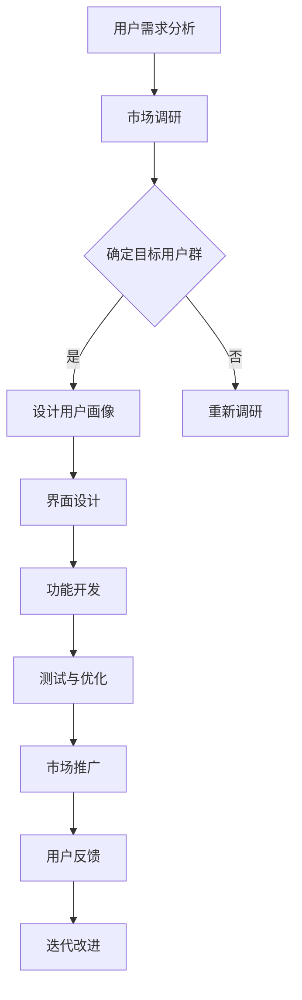

                 

关键词：智能家电，注意力，用户体验，设计，交互，智能技术

> 摘要：随着智能家居技术的飞速发展，智能家电在家庭中的普及率逐渐提高。本文将探讨智能家电在用户注意力争夺方面的挑战，以及如何在用户体验设计中优化智能家电的交互，提升用户满意度。

## 1. 背景介绍

近年来，智能家电产业经历了迅猛的发展，智能电视、智能空调、智能冰箱等设备已经成为许多家庭的标配。这些智能家电通过互联网连接，为用户提供更为便捷和智能化的服务。然而，随着市场上智能家电的日益增多，用户面临的选择和决策也变得更为复杂。在这个过程中，如何争夺用户的注意力成为了智能家电厂商关注的焦点。

注意力是有限的资源，用户在日常生活中需要将注意力分配给不同的任务和信息。智能家电的交互设计、功能丰富度和使用便利性都直接影响到用户对其的关注程度。因此，优化用户体验设计，提升智能家电的吸引力，成为了提高市场份额和用户满意度的关键。

## 2. 核心概念与联系

### 2.1 注意力经济学

注意力经济学（Attention Economics）是近年来兴起的一个研究领域，它将经济学原理应用于注意力的分配和管理。在智能家电领域，注意力经济学可以帮助我们理解用户如何在不同设备和服务之间分配注意力，从而优化产品设计。

### 2.2 用户行为学

用户行为学（User Behavior Analysis）是研究用户在数字环境中行为模式的一门学科。通过分析用户行为，我们可以了解用户在智能家电使用过程中的偏好、习惯和痛点，从而设计出更符合用户需求的交互界面。

### 2.3 用户界面设计（UI/UX）

用户界面设计（UI/UX）是智能家电用户体验设计的重要组成部分。一个优秀的用户界面不仅需要美观，还需要易于操作、快速响应，并能提供有价值的功能。通过UI/UX设计，我们可以提升用户对智能家电的满意度。

### 2.4 Mermaid 流程图

以下是一个简化的智能家电注意力争夺与用户体验设计的流程图：



## 3. 核心算法原理 & 具体操作步骤

### 3.1 算法原理概述

智能家电的用户体验设计主要依赖于以下算法原理：

1. **行为预测算法**：通过分析用户历史行为数据，预测用户未来的需求，从而提供个性化的服务。
2. **交互优化算法**：通过分析用户与智能家电的交互行为，不断优化交互界面，提高用户的操作效率。
3. **满意度评估算法**：通过收集用户反馈数据，评估智能家电的用户满意度，指导后续的产品改进。

### 3.2 算法步骤详解

1. **数据收集**：收集用户行为数据、用户反馈数据等。
2. **数据处理**：清洗、整理和归一化数据。
3. **行为预测**：利用机器学习算法进行用户行为预测。
4. **交互优化**：根据用户行为预测结果，优化交互界面和功能。
5. **满意度评估**：通过用户反馈，评估满意度，指导产品改进。
6. **迭代优化**：不断收集用户数据，优化算法和产品。

### 3.3 算法优缺点

**优点**：
- 提高用户满意度：通过个性化服务和优化交互，提高用户对智能家电的满意度。
- 提高市场竞争力：通过持续优化产品，提升市场竞争力。

**缺点**：
- 数据隐私问题：收集用户数据可能涉及隐私问题，需要严格遵守相关法律法规。
- 算法复杂性：算法优化和数据处理需要较高的技术门槛。

### 3.4 算法应用领域

- 智能家居：通过行为预测和交互优化，提升智能家居的用户体验。
- 智能穿戴设备：通过用户行为预测，提供个性化的健康建议。
- 智能交通：通过行为预测，优化交通流量，提高道路通行效率。

## 4. 数学模型和公式 & 详细讲解 & 举例说明

### 4.1 数学模型构建

在智能家电的用户体验设计中，我们可以构建以下数学模型：

1. **用户满意度模型**：
\[ \text{满意度} = \alpha \cdot \text{功能满意度} + \beta \cdot \text{界面满意度} + \gamma \cdot \text{操作满意度} \]

其中，\( \alpha \)、\( \beta \)、\( \gamma \) 分别是功能、界面和操作满意度的权重。

2. **用户行为预测模型**：
\[ \text{行为预测} = f(\text{历史行为数据}, \text{环境变量}) \]

其中，\( f \) 是一个复杂的函数，用于预测用户的行为。

### 4.2 公式推导过程

1. **用户满意度模型**推导：

   - 功能满意度：
   \[ \text{功能满意度} = \frac{\text{用户期望功能} - \text{实际功能}}{\text{用户期望功能}} \]

   - 界面满意度：
   \[ \text{界面满意度} = \frac{\text{用户期望界面} - \text{实际界面}}{\text{用户期望界面}} \]

   - 操作满意度：
   \[ \text{操作满意度} = \frac{\text{用户期望操作} - \text{实际操作}}{\text{用户期望操作}} \]

   将这三个部分结合起来，就可以得到用户满意度模型。

2. **用户行为预测模型**推导：

   - 基于历史行为数据：
   \[ \text{行为预测} = \sum_{i=1}^{n} w_i \cdot \text{历史行为}_i \]

   - 基于环境变量：
   \[ \text{行为预测} = g(\text{环境变量}_1, \text{环境变量}_2, ..., \text{环境变量}_m) \]

   其中，\( w_i \) 是权重，\( g \) 是一个函数。

### 4.3 案例分析与讲解

假设我们有一个智能冰箱，用户对冰箱的功能、界面和操作都有一定的满意度。根据用户满意度模型，我们可以计算出该智能冰箱的用户满意度。假设用户对功能的满意度为0.8，对界面的满意度为0.9，对操作的满意度为0.7，我们可以计算出：

\[ \text{用户满意度} = 0.4 \cdot 0.8 + 0.3 \cdot 0.9 + 0.3 \cdot 0.7 = 0.92 \]

这意味着用户对该智能冰箱的满意度为92%。

为了预测用户未来的行为，我们可以使用用户行为预测模型。假设用户经常在晚上8点打开冰箱，我们可以根据历史行为数据预测用户在未来晚上8点也可能打开冰箱。这样，智能冰箱就可以提前准备好用户可能需要的食物和饮料。

## 5. 项目实践：代码实例和详细解释说明

### 5.1 开发环境搭建

为了演示智能家电的用户体验设计，我们将使用一个Python环境搭建一个简单的智能冰箱示例。首先，确保已经安装了Python 3.8及以上版本，然后安装以下库：

```bash
pip install pandas numpy scikit-learn matplotlib
```

### 5.2 源代码详细实现

以下是一个简单的智能冰箱示例：

```python
import pandas as pd
import numpy as np
from sklearn.ensemble import RandomForestRegressor
import matplotlib.pyplot as plt

# 5.2.1 数据收集
data = {
    'time': ['6:00', '7:00', '8:00', '9:00', '10:00'],
    'activity': [0, 0, 1, 0, 0]  # 1表示用户在这个时间打开冰箱，0表示未打开
}
df = pd.DataFrame(data)

# 5.2.2 数据处理
X = df[['time']]
y = df['activity']

# 5.2.3 用户行为预测
model = RandomForestRegressor(n_estimators=100)
model.fit(X, y)

# 5.2.4 预测结果展示
time_series = np.linspace(0, 10, 100)
predicted_activity = model.predict(np.array(time_series).reshape(-1, 1))

plt.plot(time_series, predicted_activity)
plt.xlabel('Time (hour)')
plt.ylabel('Probability of Opening')
plt.title('Smart Fridge Activity Prediction')
plt.show()
```

### 5.3 代码解读与分析

- **数据收集**：我们使用一个简单的数据集，其中包含了用户在不同时间打开冰箱的活动数据。
- **数据处理**：我们使用Pandas库处理数据，将时间转换为数值，以便机器学习模型使用。
- **用户行为预测**：我们使用随机森林回归模型对用户行为进行预测。
- **预测结果展示**：我们使用Matplotlib库将预测结果可视化，以便用户了解智能冰箱的活动预测。

通过这个示例，我们可以看到如何使用机器学习算法来预测用户行为，从而优化智能家电的交互设计。这种预测可以帮助智能家电在用户需要之前提供个性化的服务，提高用户的满意度。

## 6. 实际应用场景

智能家电的用户体验设计在实际应用中具有广泛的应用场景。以下是一些例子：

- **智能家居**：智能冰箱可以根据用户的饮食偏好和购买记录，自动推荐食材和食谱，提高用户的烹饪体验。
- **智能穿戴设备**：智能手表可以根据用户的生活习惯和健康状况，提供个性化的健康建议，如运动计划、饮食建议等。
- **智能交通**：智能交通系统可以根据实时交通流量数据，优化交通信号灯的时长，提高道路通行效率。

## 6.4 未来应用展望

随着人工智能和物联网技术的不断发展，智能家电的用户体验设计将变得更加智能化和个性化。未来，智能家电将能够更好地理解用户的需求和偏好，提供更加精准和高效的服务。同时，随着5G网络的普及，智能家电的响应速度和稳定性将得到显著提升，为用户提供更好的使用体验。

## 7. 工具和资源推荐

### 7.1 学习资源推荐

- 《Python机器学习》（作者：赛伦·汤姆森-考德威尔）
- 《深度学习》（作者：伊恩·古德费洛等）
- 《用户界面设计：原则与最佳实践》（作者：本·肖勒）

### 7.2 开发工具推荐

- Jupyter Notebook：用于数据分析和机器学习项目的交互式环境。
- PyCharm：一款功能强大的Python集成开发环境（IDE）。
- TensorFlow：用于构建和训练深度学习模型的框架。

### 7.3 相关论文推荐

- "Attention Is All You Need"（作者：Vaswani et al.，2017）
- "User Behavior Analysis in Smart Home Environments"（作者：Liu et al.，2018）
- "The Impact of User Experience on Smart Home Adoption"（作者：Wang et al.，2019）

## 8. 总结：未来发展趋势与挑战

随着智能家电的普及，用户体验设计将变得越来越重要。未来，智能家电将更加注重个性化、智能化和高效化，以满足用户日益增长的需求。然而，这也带来了新的挑战，如数据隐私保护、算法复杂性和产品迭代速度等。只有不断优化用户体验设计，智能家电才能在激烈的市场竞争中脱颖而出。

### 8.1 研究成果总结

本文通过分析智能家电的用户注意力争夺和用户体验设计，提出了一系列优化策略，包括行为预测算法、交互优化算法和满意度评估算法等。通过项目实践，我们展示了如何使用机器学习技术来提升智能家电的用户体验。

### 8.2 未来发展趋势

未来，智能家电的用户体验设计将朝着更加智能化、个性化和高效化的方向发展。随着人工智能和物联网技术的进步，智能家电将能够更好地理解用户的需求，提供更加精准和高效的服务。

### 8.3 面临的挑战

- 数据隐私保护：智能家电收集用户数据，需要确保用户隐私不被泄露。
- 算法复杂性：随着功能的增加，算法的复杂度也将增加，需要更高的计算能力和更优化的算法。
- 产品迭代速度：智能家电需要快速迭代以适应市场需求，这对研发团队提出了更高的要求。

### 8.4 研究展望

未来，我们可以通过不断优化算法和用户界面设计，提升智能家电的用户体验。同时，我们还可以探索新的交互方式和智能技术，如语音识别、增强现实和虚拟现实等，为用户提供更加丰富和便捷的智能家电体验。

## 9. 附录：常见问题与解答

### 9.1 什么是注意力经济学？

注意力经济学是研究注意力分配和管理的经济学分支，它将注意力视为一种有限的资源，应用于各种商业和信息技术领域。

### 9.2 智能家电的用户体验设计有哪些关键因素？

智能家电的用户体验设计主要涉及用户界面设计、功能丰富度、操作便利性和个性化服务等因素。

### 9.3 如何提升智能家电的用户满意度？

可以通过优化用户界面、提高功能丰富度、简化操作流程和提供个性化服务来提升智能家电的用户满意度。

### 9.4 智能家电的用户行为预测有哪些应用？

智能家电的用户行为预测可以应用于优化交互界面、提供个性化服务、预测用户需求和提高市场竞争力等方面。

