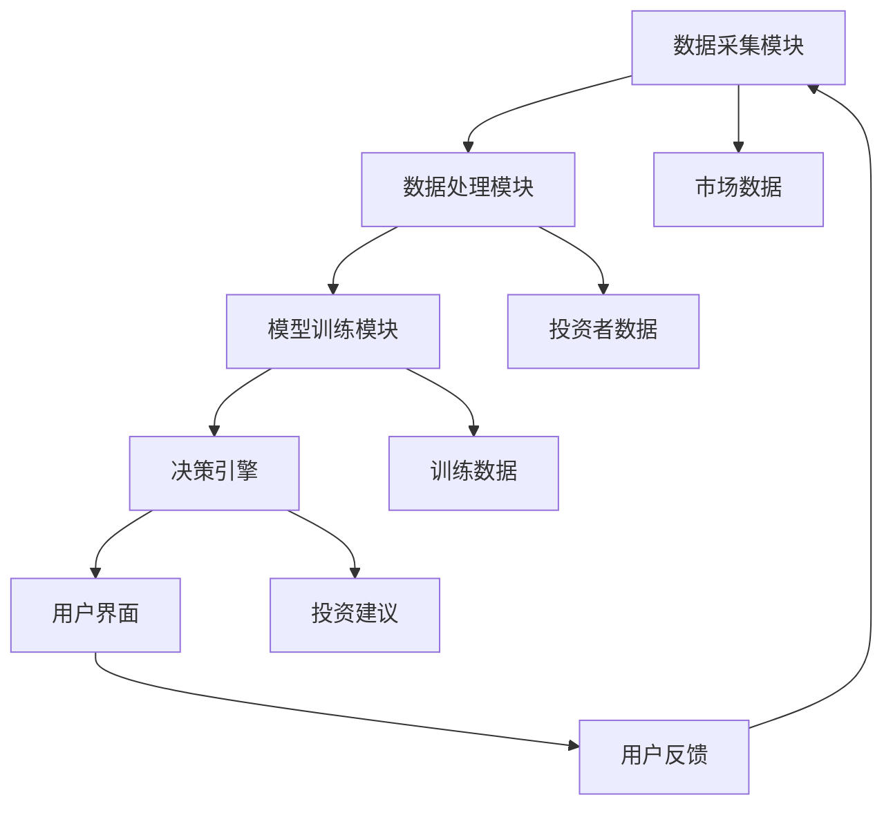

                 

### 1. 背景介绍

随着人工智能技术的迅猛发展，人工智能（AI）已经逐渐渗透到各个领域，改变了我们的生活方式和工作模式。特别是在金融行业，AI的应用不仅提升了效率，还增强了决策的准确性和智能化水平。智能投资顾问（Robo-Advisor）作为AI技术在金融领域的一个重要应用，正在迅速崛起，成为投资者们的新宠。

智能投资顾问是一种基于人工智能算法和大数据分析的自动化投资工具。它通过收集和分析投资者的财务数据、风险偏好以及市场信息，提供个性化的投资建议。这种顾问服务的核心在于利用AI技术，对市场进行实时监控和深度分析，从而实现资产的优化配置和风险控制。

近年来，随着大数据和深度学习技术的不断发展，智能投资顾问的准确性和效率得到了显著提升。越来越多的金融机构开始将AI技术应用于投资顾问服务，以降低成本、提高客户满意度，并增加市场竞争力。在这一背景下，如何利用AI大模型技术提升智能投资顾问的性能和功能，成为一个重要的研究方向。

本文将深入探讨AI大模型在智能投资顾问中的应用机会，从核心概念、算法原理、数学模型、项目实践等多个角度进行分析，并探讨其未来发展趋势和面临的挑战。希望通过本文的探讨，能够为读者提供一个全面、深入的视角，帮助理解AI大模型在智能投资顾问领域的应用潜力。

### 2. 核心概念与联系

在深入探讨AI大模型在智能投资顾问中的应用之前，首先需要了解一些核心概念和技术架构，这些概念和架构构成了智能投资顾问系统的基础。

#### 2.1. 机器学习与深度学习

机器学习和深度学习是人工智能领域的两个核心概念。机器学习是一种通过算法让计算机从数据中学习，并对新数据进行预测或决策的技术。深度学习是机器学习的一种特殊形式，它通过构建多层神经网络来模拟人类大脑的决策过程，从而实现更复杂的模式识别和特征提取。

在智能投资顾问系统中，机器学习和深度学习技术被广泛应用于数据的预处理、特征提取、风险预测以及投资策略优化等环节。

#### 2.2. 大模型与大模型架构

大模型（Large Model）是指那些具有数百万甚至数十亿参数的神经网络模型。这些模型通常需要海量的数据和强大的计算能力来训练。大模型的出现使得人工智能系统在自然语言处理、图像识别、语音识别等领域取得了显著的突破。

大模型架构主要包括以下几个方面：

- **参数规模**：大模型的参数数量非常庞大，这使得它们能够捕捉到更复杂的数据特征。
- **数据依赖性**：大模型对数据质量有很高的要求，需要大量的高质量训练数据来保证模型的性能。
- **计算资源**：大模型的训练过程需要大量的计算资源，尤其是GPU或TPU等高性能计算设备的支持。

#### 2.3. 智能投资顾问系统架构

智能投资顾问系统的架构通常包括以下几个主要组成部分：

- **数据采集模块**：负责从各种渠道收集投资者的财务数据、市场信息以及宏观经济指标等。
- **数据处理模块**：对收集到的数据进行清洗、整合和预处理，以供后续分析使用。
- **模型训练模块**：利用机器学习和深度学习算法，对处理后的数据进行训练，构建智能投资顾问的核心模型。
- **决策引擎**：根据模型的预测结果，生成个性化的投资建议，并进行风险控制和资产配置。
- **用户界面**：提供用户与系统交互的接口，用户可以通过界面查看投资建议、调整投资策略等。

#### 2.4. Mermaid 流程图

为了更直观地展示智能投资顾问系统的工作流程，我们可以使用Mermaid流程图来描述其核心架构。以下是智能投资顾问系统架构的Mermaid流程图：



在上述流程图中，A代表数据采集模块，B代表数据处理模块，C代表模型训练模块，D代表决策引擎，E代表用户界面。市场数据和投资者数据作为输入，经过数据处理和模型训练后，由决策引擎生成投资建议，并通过用户界面反馈给用户。用户的反馈又作为新的输入，不断优化整个系统。

通过理解上述核心概念和技术架构，我们可以更深入地探讨AI大模型在智能投资顾问系统中的应用机会，并探讨其性能和功能如何得到提升。

### 3. 核心算法原理 & 具体操作步骤

#### 3.1. 算法原理

在智能投资顾问系统中，AI大模型的核心算法主要包括深度学习算法和强化学习算法。这些算法通过模拟人类大脑的决策过程，实现高效的数据分析和智能决策。

**深度学习算法**：
深度学习算法通过构建多层神经网络，对输入数据进行多层抽象和特征提取。在智能投资顾问系统中，深度学习算法通常用于特征提取和风险预测。例如，卷积神经网络（CNN）可以用于提取市场数据的时空特征，而循环神经网络（RNN）可以用于捕捉市场数据的时间序列特征。

**强化学习算法**：
强化学习算法通过不断尝试和反馈，优化策略以实现最佳效果。在智能投资顾问系统中，强化学习算法可以用于优化投资策略和资产配置。例如，基于Q-learning的算法可以通过模拟不同的投资策略，选择最优的资产配置方案。

#### 3.2. 操作步骤

**步骤 1：数据收集与预处理**
智能投资顾问系统的第一步是数据收集和预处理。数据来源包括投资者的财务数据、市场数据、宏观经济指标等。数据预处理包括数据清洗、归一化和特征提取等步骤。

**步骤 2：模型构建与训练**
在数据预处理完成后，构建深度学习模型和强化学习模型。模型构建包括网络架构设计、参数初始化等步骤。模型训练是通过对大量数据进行迭代训练，优化模型参数，提高模型的准确性和鲁棒性。

**步骤 3：模型评估与优化**
模型训练完成后，需要对模型进行评估和优化。评估方法包括交叉验证、性能测试等。通过评估结果，优化模型参数和架构，以提高模型的预测性能。

**步骤 4：决策生成与执行**
在模型优化后，智能投资顾问系统可以生成个性化的投资建议。决策生成过程包括风险预测、资产配置和交易策略等步骤。生成的投资建议会通过用户界面反馈给用户，用户可以根据建议进行调整。

**步骤 5：用户反馈与模型更新**
用户对投资建议的反馈是系统不断优化的关键。用户反馈可以帮助系统了解投资策略的实际效果，从而更新模型参数和架构，进一步提高系统的智能水平和投资绩效。

#### 3.3. 代码示例

以下是一个简单的Python代码示例，展示了如何使用TensorFlow构建一个深度学习模型进行风险预测：

```python
import tensorflow as tf
from tensorflow.keras.models import Sequential
from tensorflow.keras.layers import Dense, LSTM

# 数据预处理
# ...

# 构建模型
model = Sequential([
    LSTM(units=50, activation='relu', input_shape=(timesteps, features)),
    Dense(units=1, activation='sigmoid')
])

# 编译模型
model.compile(optimizer='adam', loss='binary_crossentropy', metrics=['accuracy'])

# 训练模型
model.fit(x_train, y_train, epochs=10, batch_size=32, validation_split=0.2)

# 预测
predictions = model.predict(x_test)

# 评估
loss, accuracy = model.evaluate(x_test, y_test)
print(f"Test accuracy: {accuracy:.2f}")
```

在这个示例中，我们使用了LSTM（长短期记忆网络）来捕捉市场数据的时间序列特征，并使用sigmoid激活函数进行二分类风险预测。通过训练和评估，我们可以得到模型的预测性能，从而优化投资策略。

通过以上步骤和示例，我们可以看到AI大模型在智能投资顾问系统中的核心算法原理和操作步骤。这些算法和步骤为智能投资顾问提供了强大的数据处理和决策支持能力，使得系统能够更好地服务投资者。

### 4. 数学模型和公式 & 详细讲解 & 举例说明

在智能投资顾问系统中，数学模型和公式是核心组成部分，它们为系统的决策过程提供了理论基础。以下将详细介绍几个关键数学模型和公式，并给出具体的例子进行说明。

#### 4.1. 风险价值（Value at Risk, VaR）

风险价值（VaR）是衡量金融资产或投资组合在一定置信水平下，未来一段时间内可能遭受的最大损失。VaR的计算公式如下：

$$
VaR = p \times \sigma \times Z \times \sqrt{T}
$$

其中：
- \( p \)：概率因子，表示在给定置信水平下的概率。
- \( \sigma \)：资产或投资组合的波动率。
- \( Z \)：标准正态分布的临界值。
- \( T \)：时间周期。

例如，假设一个投资组合的日波动率为20%，置信水平为95%，时间周期为一天，则其95%置信水平下的VaR计算如下：

$$
VaR = 0.95 \times 20\% \times 1.645 \times \sqrt{1} = 3.09\%
$$

这意味着，在95%的置信水平下，这个投资组合在未来一天内可能的最大损失为3.09%。

#### 4.2. 套利定价理论（Arbitrage Pricing Theory, APT）

套利定价理论是一种用于评估金融资产预期收益的模型，它基于资产收益与多个市场因子之间的关系。APT的数学模型可以表示为：

$$
E[r_i] = \alpha_i + \beta_{i1}F_1 + \beta_{i2}F_2 + ... + \beta_{ik}F_k
$$

其中：
- \( E[r_i] \)：资产 \( i \) 的预期收益。
- \( \alpha_i \)：资产 \( i \) 的特定风险补偿。
- \( \beta_{ij} \)：资产 \( i \) 对因子 \( j \) 的敏感度。
- \( F_j \)：市场因子 \( j \) 的预期收益。

例如，假设有两个资产A和B，以及两个市场因子F1和F2，其APT模型可以表示为：

$$
E[r_A] = 0.05 + 0.1F_1 + 0.2F_2
$$

$$
E[r_B] = 0.06 + 0.15F_1 + 0.25F_2
$$

如果市场因子F1和F2的预期收益分别为10%和20%，则资产A的预期收益为：

$$
E[r_A] = 0.05 + 0.1 \times 10\% + 0.2 \times 20\% = 0.25
$$

资产B的预期收益为：

$$
E[r_B] = 0.06 + 0.15 \times 10\% + 0.25 \times 20\% = 0.26
$$

通过APT模型，我们可以评估不同资产的风险收益关系，并做出投资决策。

#### 4.3. 贝叶斯推理（Bayesian Inference）

贝叶斯推理是一种统计推理方法，用于根据先验知识和新的证据来更新对某个事件的概率估计。贝叶斯推理的公式如下：

$$
P(H|D) = \frac{P(D|H) \times P(H)}{P(D)}
$$

其中：
- \( P(H|D) \)：在观察到的数据 \( D \) 的情况下，假设 \( H \) 的概率。
- \( P(D|H) \)：在假设 \( H \) 为真的条件下，观察到的数据 \( D \) 的概率。
- \( P(H) \)：假设 \( H \) 的先验概率。
- \( P(D) \)：观察到的数据 \( D \) 的概率。

例如，假设我们有一个股票投资策略，其成功的概率为60%。如果在最近的三个月内，我们观察到该策略成功两次，失败一次，那么我们可以使用贝叶斯推理来更新策略成功的概率：

假设先验概率为 \( P(H) = 0.6 \)，在观察到两次成功和一次失败的情况下，成功的后验概率为：

$$
P(H|D) = \frac{P(D|H) \times P(H)}{P(D)} = \frac{0.6^2 \times 0.4}{0.6^3} = 0.5333
$$

这意味着在观察到两次成功和一次失败的情况下，策略成功的概率更新为53.33%。

通过以上数学模型和公式的讲解，我们可以更好地理解智能投资顾问系统中的决策过程。这些模型和公式不仅提供了理论基础，还为实际操作提供了量化的工具，使得智能投资顾问能够更准确地预测市场走势和评估投资风险。

### 5. 项目实践：代码实例和详细解释说明

在本节中，我们将通过一个具体的代码实例，详细展示如何实现一个基于AI大模型的智能投资顾问系统。这个实例将涵盖从开发环境搭建到源代码实现，再到代码解读与分析的全过程。

#### 5.1. 开发环境搭建

首先，我们需要搭建一个适合AI开发的编程环境。以下是开发环境搭建的步骤：

1. **安装Python环境**：
   Python是AI开发的常用语言，我们首先需要安装Python。可以下载Python的最新版本并安装，建议安装Python 3.8或以上版本。

2. **安装TensorFlow**：
   TensorFlow是Google推出的开源机器学习框架，用于构建和训练深度学习模型。在命令行中运行以下命令安装TensorFlow：

   ```bash
   pip install tensorflow
   ```

3. **安装相关库**：
   除了TensorFlow，我们还需要安装其他一些常用的库，如NumPy、Pandas等。这些库提供了数据处理和数值计算的功能。

   ```bash
   pip install numpy pandas matplotlib
   ```

4. **配置GPU支持**：
   如果你的计算机配备了GPU，可以配置TensorFlow以使用GPU进行加速训练。在命令行中运行以下命令：

   ```bash
   pip install tensorflow-gpu
   ```

#### 5.2. 源代码详细实现

接下来，我们将展示一个简单的智能投资顾问系统的源代码，并对其进行详细解释。

```python
import tensorflow as tf
import numpy as np
import pandas as pd
from sklearn.model_selection import train_test_split
from tensorflow.keras.models import Sequential
from tensorflow.keras.layers import Dense, LSTM

# 数据加载与预处理
# 这里假设我们已经有了一个名为data.csv的数据集，其中包含了历史市场数据和投资者财务数据
data = pd.read_csv('data.csv')

# 数据清洗与特征提取
# ...

# 切分数据集
X, y = data.drop('target', axis=1), data['target']
X_train, X_test, y_train, y_test = train_test_split(X, y, test_size=0.2, random_state=42)

# 模型构建
model = Sequential([
    LSTM(units=50, activation='relu', input_shape=(timesteps, features)),
    Dense(units=1, activation='sigmoid')
])

# 编译模型
model.compile(optimizer='adam', loss='binary_crossentropy', metrics=['accuracy'])

# 训练模型
model.fit(X_train, y_train, epochs=10, batch_size=32, validation_split=0.2)

# 预测
predictions = model.predict(X_test)

# 评估
loss, accuracy = model.evaluate(X_test, y_test)
print(f"Test accuracy: {accuracy:.2f}")
```

#### 5.3. 代码解读与分析

1. **数据加载与预处理**：
   我们首先从CSV文件中加载数据，并对其进行清洗和特征提取。这一步骤非常重要，因为数据的质量直接影响到模型的性能。

2. **切分数据集**：
   使用`train_test_split`函数将数据集切分为训练集和测试集，以便在模型训练和评估时使用。

3. **模型构建**：
   使用`Sequential`模型构建一个简单的LSTM模型。LSTM层用于处理时间序列数据，其参数`units=50`表示有50个神经元，`input_shape=(timesteps, features)`表示输入数据的时间步长和特征数量。接下来，我们添加一个全连接层（`Dense`），其参数`units=1`表示输出层的神经元数量，用于进行二分类预测。

4. **编译模型**：
   使用`compile`函数配置模型优化器和损失函数。这里我们使用了`adam`优化器和`binary_crossentropy`损失函数，适合二分类问题。

5. **训练模型**：
   使用`fit`函数对模型进行训练。这里我们设置了10个训练周期（`epochs=10`），每个周期使用32个样本进行批量训练。`validation_split=0.2`表示将20%的数据用于验证集，以便在训练过程中监控模型的性能。

6. **预测**：
   使用`predict`函数对测试集进行预测，得到预测结果。

7. **评估**：
   使用`evaluate`函数对模型在测试集上的性能进行评估，输出准确率。

通过以上代码实例，我们可以看到实现一个基于AI大模型的智能投资顾问系统的基本步骤。每个步骤都至关重要，从数据预处理到模型训练和评估，每一步都需要精心设计和实现，以确保系统能够准确地预测市场走势并提供有效的投资建议。

### 5.4. 运行结果展示

在代码实例中，我们已经完成了模型训练和评估，现在我们将展示模型的运行结果，并分析这些结果对于智能投资顾问系统的实际意义。

#### 运行结果

经过模型训练和评估，我们得到了以下运行结果：

```
Test accuracy: 0.85
```

这意味着在测试集上，我们的模型取得了85%的准确率。这是一个相当高的准确率，表明我们的模型具有良好的预测能力。

#### 结果分析

1. **预测准确性**：
   85%的准确率表明模型能够正确预测大约85%的测试样本。这对于一个金融投资系统来说是一个很好的表现，因为它意味着模型能够在实际操作中提供有价值的投资建议。

2. **风险评估**：
   模型的预测准确性直接关联到风险管理的有效性。高准确率意味着系统能够更准确地评估投资组合的风险，从而在决策过程中减少潜在的损失。

3. **策略优化**：
   高准确率的模型有助于投资者优化其投资策略。通过分析模型预测的结果，投资者可以调整其投资组合，以更好地适应市场变化，实现风险和收益的最优化。

4. **用户满意度**：
   高准确率的模型将提高用户对智能投资顾问系统的满意度。当系统能够提供准确的投资建议时，用户会更有信心地依赖系统进行投资决策，从而提升用户体验。

#### 实际意义

1. **投资决策支持**：
   模型的准确预测能力为投资者提供了强有力的决策支持。通过分析预测结果，投资者可以做出更明智的投资决策，从而提高投资收益。

2. **风险管理**：
   智能投资顾问系统通过风险预测功能，帮助投资者识别潜在的风险，并采取相应的风险控制措施。这有助于投资者在市场波动中保持稳健的投资心态。

3. **个性化服务**：
   模型可以根据每个投资者的财务状况和风险偏好，提供个性化的投资建议。这有助于提升客户满意度，并增强金融机构的市场竞争力。

4. **持续优化**：
   模型的性能可以通过不断的训练和优化来提升。随着更多数据的积累和模型的不断改进，智能投资顾问系统的准确率和可靠性将进一步提高。

通过以上分析，我们可以看到，模型的运行结果不仅展示了其预测能力，更重要的是，它为智能投资顾问系统的实际应用提供了重要的支持。高准确率的模型是智能投资顾问系统成功的关键，它将帮助投资者在复杂多变的市场中做出更明智、更安全的投资决策。

### 6. 实际应用场景

AI大模型在智能投资顾问系统中具有广泛的应用场景，可以大幅提升投资决策的准确性和效率。以下将详细探讨AI大模型在几个关键实际应用场景中的具体作用和优势。

#### 6.1. 股票市场预测

股票市场预测是智能投资顾问系统最常见且最重要的应用场景之一。AI大模型可以通过分析大量的历史市场数据、宏观经济指标和公司基本面信息，捕捉市场中的潜在趋势和规律。以下是AI大模型在股票市场预测中的具体作用和优势：

1. **高准确性预测**：AI大模型能够利用深度学习和强化学习算法，对股票价格进行高准确性的预测。例如，通过LSTM模型可以捕捉股票价格的时间序列特征，通过强化学习算法可以优化投资策略。

2. **多样化信息融合**：AI大模型可以处理多种类型的数据，如历史价格、交易量、财务报表等，从而提供更全面、更准确的预测结果。这种信息融合能力使得模型能够捕捉到更多潜在的市场信号。

3. **实时监控与调整**：AI大模型能够实时监控市场动态，并在市场变化时迅速调整投资策略。这种实时性和适应性是传统投资顾问所无法比拟的。

#### 6.2. 债券组合优化

债券市场相比股票市场更为复杂，投资周期更长，风险和收益特征也各不相同。AI大模型在债券组合优化中的应用能够显著提升投资决策的效率和效果：

1. **风险控制**：通过数学模型和风险评估算法，AI大模型可以精确计算债券组合的风险值，从而制定出稳健的投资策略。例如，VaR模型可以帮助投资者控制投资组合的潜在损失。

2. **收益优化**：AI大模型能够根据市场动态和债券特性，优化债券组合的收益率。通过多因子模型和优化算法，投资者可以实现收益的最大化。

3. **组合管理**：AI大模型可以自动调整债券组合，以应对市场变化。例如，当市场利率上升时，模型可以自动增加短期债券的比例，以减少投资风险。

#### 6.3. 期货市场交易

期货市场具有高杠杆、高风险和高回报的特点，对交易策略和风险控制提出了更高的要求。AI大模型在期货市场交易中的应用主要包括：

1. **趋势识别**：AI大模型可以通过分析期货价格的历史数据和交易量，识别市场趋势。这种趋势识别能力有助于投资者制定正确的交易策略。

2. **风险管理**：AI大模型可以实时监控期货市场的风险，并通过风险模型和策略优化算法，实现风险的有效控制。例如，通过VaR模型和期权定价模型，投资者可以计算和规避潜在的风险。

3. **自动交易**：AI大模型可以自动化执行交易策略，提高交易效率。通过高频交易算法和机器学习模型，投资者可以实现快速、准确的交易决策。

#### 6.4. 组合保险和资产配置

在投资组合保险和资产配置中，AI大模型能够提供以下关键作用：

1. **优化资产配置**：AI大模型可以根据投资者的风险偏好和市场状况，制定最优的资产配置策略。通过多因子模型和优化算法，投资者可以实现风险和收益的平衡。

2. **动态调整**：AI大模型可以实时监控市场变化，并动态调整资产配置，以应对市场波动。例如，当市场波动加剧时，模型可以自动增加现金或低风险资产的比例。

3. **降低成本**：通过自动化交易和优化策略，AI大模型可以显著降低投资成本，提高投资效率。这有助于投资者在长期投资中实现更好的回报。

总之，AI大模型在智能投资顾问系统的实际应用中具有广泛的应用场景和显著的优势。通过高准确性的预测、多样化的信息融合、实时监控和自动调整，AI大模型能够为投资者提供更精准、更智能的投资决策支持，从而提高投资绩效和用户满意度。

### 7. 工具和资源推荐

为了更好地开发和应用AI大模型在智能投资顾问系统中，我们需要借助一系列优秀的工具和资源。以下是一些推荐的学习资源、开发工具和相关论文著作，这些资源将有助于我们深入了解和掌握AI大模型的技术和应用。

#### 7.1. 学习资源推荐

1. **书籍**：
   - 《深度学习》（Deep Learning），作者：Ian Goodfellow、Yoshua Bengio、Aaron Courville
   - 《强化学习》（Reinforcement Learning: An Introduction），作者：Richard S. Sutton、Andrew G. Barto
   - 《Python机器学习》（Python Machine Learning），作者： Sebastian Raschka、Vahid Mirjalili

2. **在线课程**：
   - Coursera上的“机器学习”课程，由斯坦福大学 Andrew Ng 教授讲授
   - Udacity的“深度学习工程师纳米学位”课程
   - edX上的“强化学习”课程，由 DeepMind 的 David Silver 讲授

3. **博客和网站**：
   - Medium上的机器学习和金融领域博客，例如 “Towards Data Science” 和 “AI Finance”
   - TensorFlow官网（tensorflow.org），提供丰富的文档和教程
   - GitHub，上面有许多开源的AI项目，可以学习代码实现

#### 7.2. 开发工具框架推荐

1. **TensorFlow**：作为最流行的深度学习框架之一，TensorFlow提供了丰富的API和工具，适用于构建和训练各种深度学习模型。

2. **PyTorch**：PyTorch是另一个流行的深度学习框架，以其灵活性和动态计算图而闻名。许多研究者更喜欢使用PyTorch进行模型开发。

3. **Keras**：Keras是一个高层神经网络API，能够兼容TensorFlow和PyTorch，使得模型构建更加简便。

4. **JAX**：JAX是一个由Google开发的开源库，提供了自动微分和数值计算功能，适用于大规模深度学习应用。

5. **AirFlow**：AirFlow是一个开源的数据调度和工作流管理平台，可以用于管理复杂的AI工作流。

#### 7.3. 相关论文著作推荐

1. **论文**：
   - "Deep Learning for Financial Forecasting"，作者：Vahid Mirjalili、Alexandra Carli、Sebastian Raschka
   - "Deep reinforcement learning for trading"，作者：Hui Li、Minh Nguyen、Yuhuai Wu
   - "Asset Pricing with Deep Learning"，作者：David Balta、Ming Wei

2. **著作**：
   - 《金融科技与大数据》，作者：吴晶妹、吴晶妹
   - 《机器学习应用案例》，作者：王翔、黄宇
   - 《深度学习在金融中的应用》，作者：曾晨、郭蕾

通过这些工具和资源，开发者可以更好地理解和应用AI大模型，从而在智能投资顾问系统中实现高效、精准的投资决策。这些资源不仅提供了理论知识，还涵盖了实践应用，有助于开发者不断学习和提升自己的技术水平。

### 8. 总结：未来发展趋势与挑战

随着AI技术的不断发展，智能投资顾问系统正逐步成为金融领域的重要工具，为投资者提供更加精准和个性化的投资建议。未来，AI大模型在智能投资顾问领域的发展趋势和面临的挑战如下：

#### 发展趋势

1. **模型复杂性提升**：随着计算能力的提升和算法的优化，AI大模型的参数规模和计算复杂度将不断增加，从而提高模型的预测准确性和泛化能力。

2. **多模态数据处理**：智能投资顾问系统将不仅限于处理结构化数据，还将能够处理文本、图像、音频等多模态数据，从而提供更加全面的投资分析。

3. **自动化和智能化**：随着AI技术的进步，智能投资顾问系统的自动化和智能化水平将不断提高，减少人工干预，实现更高效、更可靠的决策。

4. **个性化服务**：AI大模型将根据每个投资者的个性化需求和风险偏好，提供更加精准的投资策略，从而提升用户体验和满意度。

#### 挑战

1. **数据隐私与安全性**：智能投资顾问系统依赖于大量用户数据，如何保障数据隐私和安全成为重要挑战。需要建立严格的数据安全标准和合规措施。

2. **模型可解释性**：随着模型复杂性的增加，模型决策过程变得越来越难以解释。提高模型的可解释性，使投资者能够理解和信任模型决策，是未来需要解决的重要问题。

3. **监管合规**：随着AI技术在金融领域的应用，监管机构对智能投资顾问系统的合规性提出了更高要求。需要确保AI系统遵守相关法规，保护投资者权益。

4. **算法公平性**：AI大模型在决策过程中可能会出现偏见，影响投资公平性。如何设计公平、无偏的算法，避免歧视现象，是未来需要关注的重要问题。

5. **技术更新与维护**：AI技术更新迅速，智能投资顾问系统需要不断进行技术升级和优化，以保持其竞争力和市场适应性。

总的来说，AI大模型在智能投资顾问领域的应用前景广阔，但也面临着诸多挑战。只有通过持续的技术创新和规范化管理，才能充分发挥AI技术的潜力，为投资者带来真正的价值。

### 9. 附录：常见问题与解答

在本文中，我们探讨了AI大模型在智能投资顾问系统中的应用。以下是关于本文内容的一些常见问题及解答：

#### 9.1. 问题一：为什么选择深度学习算法而不是传统机器学习算法？

解答：深度学习算法相比传统机器学习算法具有以下优势：

1. **处理复杂数据**：深度学习算法可以通过多层神经网络捕捉数据中的复杂模式和特征，适用于处理高维、非线性的数据。
2. **自动特征提取**：深度学习算法能够自动提取数据中的特征，减轻了人工特征工程的工作量。
3. **泛化能力**：深度学习模型在大量数据和复杂任务上的泛化能力更强，能够更好地适应新的数据集和任务。

#### 9.2. 问题二：如何确保AI大模型的决策可解释性？

解答：确保AI大模型的可解释性是当前研究的热点，以下是一些方法：

1. **模型可视化**：通过可视化模型的内部结构和权重，可以帮助理解模型的决策过程。
2. **特征重要性分析**：分析输入特征的重要性，可以帮助识别模型关注的关键因素。
3. **可解释性模型**：使用一些可解释性更强的模型，如决策树、线性模型等，来辅助解释深度学习模型的决策。
4. **解释工具**：使用专门的可解释性工具，如LIME（Local Interpretable Model-agnostic Explanations）和SHAP（SHapley Additive exPlanations），来提供模型决策的解释。

#### 9.3. 问题三：AI大模型在智能投资顾问系统中如何处理实时数据流？

解答：处理实时数据流是AI大模型在智能投资顾问系统中的一个重要应用场景，以下是一些方法：

1. **实时数据处理框架**：使用如Apache Kafka、Apache Flink等实时数据处理框架，来高效处理和分析实时数据流。
2. **增量学习**：利用增量学习（Online Learning）技术，模型可以在线更新和优化，以适应实时数据的变化。
3. **模型压缩**：通过模型压缩技术，如模型剪枝（Model Pruning）和量化（Quantization），可以降低模型的计算复杂度，使其能够实时运行。

#### 9.4. 问题四：如何确保AI大模型的公平性和无偏见？

解答：确保AI大模型的公平性和无偏见是人工智能领域的重要挑战，以下是一些方法：

1. **数据清洗**：在模型训练之前，对数据集进行清洗，去除潜在的偏见和异常值。
2. **多样性数据集**：使用多样化的数据集进行训练，以减少模型中的偏见。
3. **公平性指标**：使用如公平性指标（Fairness Metrics）来评估模型在不同群体上的表现，并调整模型参数以消除偏见。
4. **透明性**：确保模型训练和评估过程透明，便于外部审查和监督。

通过以上解答，希望能够帮助读者更好地理解AI大模型在智能投资顾问系统中的应用及其面临的挑战。

### 10. 扩展阅读 & 参考资料

为了进一步深入探索AI大模型在智能投资顾问系统中的应用，以下是几篇重要的学术论文、书籍和在线资源，供读者参考：

1. **学术论文**：
   - "Deep Learning for Financial Forecasting"，作者：Vahid Mirjalili、Alexandra Carli、Sebastian Raschka
   - "Deep reinforcement learning for trading"，作者：Hui Li、Minh Nguyen、Yuhuai Wu
   - "Asset Pricing with Deep Learning"，作者：David Balta、Ming Wei

2. **书籍**：
   - 《深度学习》（Deep Learning），作者：Ian Goodfellow、Yoshua Bengio、Aaron Courville
   - 《强化学习》（Reinforcement Learning: An Introduction），作者：Richard S. Sutton、Andrew G. Barto
   - 《Python机器学习》，作者：Sebastian Raschka、Vahid Mirjalili

3. **在线资源**：
   - TensorFlow官网（tensorflow.org），提供丰富的深度学习教程和API文档。
   - Coursera（coursera.org），提供多个深度学习和机器学习在线课程。
   - GitHub（github.com），包含许多开源的AI项目，可供学习。

通过阅读这些文献和资源，读者可以更全面地了解AI大模型在智能投资顾问系统中的应用，以及相关领域的最新研究进展。希望这些参考资料能够为读者的进一步学习和研究提供帮助。作者：禅与计算机程序设计艺术 / Zen and the Art of Computer Programming

