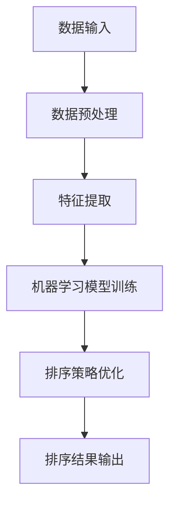

                 

# 智能排序技术的创新应用

## 摘要

本文深入探讨了智能排序技术的核心概念、原理及其在现实世界中的广泛应用。首先，我们对排序算法进行简要回顾，并介绍了几种经典排序算法。接着，本文详细分析了基于机器学习的排序算法，探讨了它们的工作原理和优势。随后，通过具体实例展示了智能排序技术在实际项目中的应用，并对相关的工具和资源进行了推荐。最后，本文总结了智能排序技术的未来发展趋势和面临的挑战，为读者提供了宝贵的参考。

## 1. 背景介绍

排序技术在计算机科学中扮演着至关重要的角色。无论是在数据预处理、算法分析，还是在实际应用中，排序算法都是不可或缺的基础。从简单的冒泡排序到复杂的归并排序，各种排序算法在不同的场景下有着广泛的应用。

随着互联网和大数据技术的发展，数据量呈现指数级增长，传统的排序算法在效率和实用性上逐渐显露出不足。为了应对这种挑战，智能排序技术应运而生。智能排序技术基于机器学习、深度学习等先进的人工智能技术，通过学习大量数据，自动调整排序策略，以实现更高的效率和更好的用户体验。

智能排序技术的主要优势在于：

1. **自适应性强**：能够根据不同类型的数据和不同场景的需求，自动调整排序策略。
2. **高效性**：通过机器学习算法，能够显著提高排序效率，减少计算时间。
3. **可扩展性**：能够处理海量数据，适用于大数据场景。

智能排序技术的出现，为数据处理领域带来了新的机遇和挑战。本文将围绕这一主题，深入探讨智能排序技术的核心概念、算法原理以及实际应用。

## 2. 核心概念与联系

### 2.1 排序算法概述

排序算法是一类用于对数据进行排序的算法。排序的基本目的是将一组数据按照某种规则进行排列，使得数据元素在序列中的位置满足一定的顺序关系。常见的排序算法包括：

- **冒泡排序**（Bubble Sort）：通过多次遍历数据序列，比较相邻元素的大小，并交换位置，逐步将最大（或最小）的元素“冒”到序列的一端。

- **选择排序**（Selection Sort）：每次遍历数据序列，选择最小（或最大）的元素，并将其交换到序列的一端。

- **插入排序**（Insertion Sort）：通过逐步将新元素插入到已排好序的部分序列中，逐步构建完整的有序序列。

- **快速排序**（Quick Sort）：通过选取一个基准元素，将序列分为两部分，分别对这两部分进行递归排序。

- **归并排序**（Merge Sort）：采用分治策略，将序列分为若干个子序列，分别对它们进行排序，然后再将排好序的子序列合并为完整的有序序列。

这些传统排序算法各有优缺点，适用于不同的场景。随着数据量的增加，这些传统算法的效率逐渐降低，因此需要更加高效的排序算法。

### 2.2 智能排序算法原理

智能排序算法基于机器学习技术，通过学习大量数据，自动调整排序策略，以实现更高的效率和更好的用户体验。其核心思想是通过数据挖掘和模式识别，找出数据中的隐藏规律，并根据这些规律进行排序。

智能排序算法的主要原理包括：

- **数据特征提取**：从原始数据中提取出有用的特征，作为排序的依据。
- **机器学习模型**：利用机器学习算法，如决策树、支持向量机、神经网络等，对特征进行学习，建立排序模型。
- **排序策略优化**：根据学习到的模型，自动调整排序策略，以适应不同的数据类型和场景。

### 2.3 Mermaid 流程图

以下是智能排序算法的 Mermaid 流程图：



在这个流程图中，数据输入是排序算法的起点，经过数据预处理、特征提取、机器学习模型训练和排序策略优化，最终得到排序结果。

### 2.4 智能排序算法与传统排序算法的比较

智能排序算法与传统排序算法相比，具有以下优势：

1. **自适应性强**：智能排序算法能够根据数据特点和场景需求，自动调整排序策略，适应不同的排序需求。
2. **高效性**：通过机器学习算法，智能排序算法能够显著提高排序效率，减少计算时间。
3. **可扩展性**：智能排序算法能够处理海量数据，适用于大数据场景。

然而，智能排序算法也存在一些局限性，如对数据质量和特征的依赖性较大，模型训练和优化需要大量计算资源等。

### 2.5 智能排序算法的应用场景

智能排序算法广泛应用于以下场景：

1. **搜索引擎**：用于对搜索结果进行排序，提高用户的搜索体验。
2. **推荐系统**：用于推荐系统的排序算法，提高推荐的准确性和用户体验。
3. **电子商务**：用于商品排序，提高用户购物体验。
4. **金融领域**：用于股票交易、风险评估等，提高决策效率。

智能排序技术的创新应用为数据处理领域带来了新的机遇和挑战。通过本文的探讨，我们深入了解了智能排序算法的核心概念、原理及其应用，为后续的研究和实践提供了宝贵的参考。

### 3. 核心算法原理 & 具体操作步骤

智能排序算法的核心在于机器学习模型的构建和排序策略的优化。下面我们将详细介绍智能排序算法的工作原理和具体操作步骤。

#### 3.1 机器学习模型构建

智能排序算法的第一步是构建机器学习模型。这个模型将根据输入的数据特征，自动调整排序策略。以下是构建机器学习模型的基本步骤：

1. **数据预处理**：对输入的数据进行清洗、去噪和归一化处理，以便于模型训练。
2. **特征提取**：从数据中提取出有用的特征，作为模型输入。特征提取是智能排序算法的关键，直接影响到排序的准确性和效率。
3. **模型选择**：选择合适的机器学习算法，如决策树、支持向量机、神经网络等。不同的算法适用于不同的数据类型和场景。
4. **模型训练**：使用训练数据集对模型进行训练，调整模型参数，使其能够准确预测排序结果。
5. **模型评估**：使用验证数据集对模型进行评估，检查模型的准确性和泛化能力。

#### 3.2 排序策略优化

构建好机器学习模型后，下一步是优化排序策略。智能排序算法根据模型预测结果，自动调整排序策略，以提高排序效率。以下是排序策略优化的一般步骤：

1. **预测排序结果**：使用训练好的机器学习模型，对新的数据进行排序预测。
2. **评估排序质量**：根据预测结果，评估排序质量，如排序的准确性、速度和用户体验等。
3. **调整排序策略**：根据评估结果，调整排序策略，如选择不同的排序算法、调整排序参数等。
4. **再次预测排序结果**：根据调整后的排序策略，重新进行排序预测和评估。

#### 3.3 智能排序算法的具体操作步骤

以下是智能排序算法的具体操作步骤：

1. **数据收集**：从实际场景中收集大量数据进行排序，这些数据可以是用户行为数据、商品数据、文本数据等。
2. **数据预处理**：对收集的数据进行清洗、去噪和归一化处理，确保数据的质量。
3. **特征提取**：从预处理后的数据中提取出有用的特征，如用户行为特征、商品特征、文本特征等。
4. **模型选择与训练**：选择合适的机器学习算法，如决策树、支持向量机、神经网络等，对特征进行训练，构建排序模型。
5. **排序策略优化**：根据模型预测结果，优化排序策略，如调整排序参数、选择不同的排序算法等。
6. **排序结果评估**：对优化后的排序结果进行评估，检查排序的准确性、速度和用户体验等。
7. **迭代优化**：根据评估结果，不断调整模型和排序策略，提高排序效果。

#### 3.4 智能排序算法的优势

智能排序算法相较于传统排序算法具有以下优势：

1. **自适应性强**：能够根据不同的数据类型和场景，自动调整排序策略，适应各种排序需求。
2. **高效性**：通过机器学习算法，能够显著提高排序效率，减少计算时间。
3. **可扩展性**：能够处理海量数据，适用于大数据场景。
4. **个性化**：根据用户行为和偏好，提供个性化的排序结果，提高用户体验。

智能排序算法的核心在于机器学习模型的构建和排序策略的优化。通过数据预处理、特征提取、模型训练和策略优化，智能排序算法能够实现高效的排序，满足不同场景的需求。这一技术的创新应用，为数据处理和排序领域带来了新的机遇和挑战。

### 4. 数学模型和公式 & 详细讲解 & 举例说明

智能排序算法的数学模型和公式是其核心组成部分，用于描述算法的排序策略和优化过程。以下我们将详细讲解这些数学模型和公式，并通过具体实例进行说明。

#### 4.1 数学模型概述

智能排序算法的数学模型主要包括以下三个方面：

1. **特征提取模型**：用于从原始数据中提取出有用的特征，这些特征将作为排序算法的输入。
2. **机器学习模型**：用于训练特征，建立排序模型，预测排序结果。
3. **排序策略模型**：用于根据排序模型的预测结果，优化排序策略，提高排序效果。

#### 4.2 特征提取模型

特征提取模型通常采用降维技术，如主成分分析（PCA）、线性判别分析（LDA）等，将高维数据转换为低维数据，以便于后续的机器学习处理。

- **主成分分析（PCA）**：
  
 PCA是一种常用的降维技术，其核心思想是找到数据的主要成分，将数据投影到这些主要成分上，从而降低数据的维度。

  PCA 的数学公式如下：

  $$X = U \Lambda V^T$$

  其中，$X$ 是原始数据矩阵，$U$ 是特征向量矩阵，$\Lambda$ 是特征值矩阵，$V$ 是投影矩阵。

- **线性判别分析（LDA）**：

  LDA 是一种用于分类和降维的技术，其目标是在新空间中最大化类内离散度，最小化类间离散度。

  LDA 的数学公式如下：

  $$W = X(\frac{1}{n-1}XX^T)^{-1}X^TY$$

  其中，$X$ 是数据矩阵，$Y$ 是标签矩阵，$W$ 是权重矩阵。

#### 4.3 机器学习模型

机器学习模型用于训练特征，建立排序模型。常见的机器学习模型包括决策树、支持向量机（SVM）、神经网络等。

- **决策树模型**：

  决策树是一种基于树结构的分类和回归模型。其基本思想是通过一系列条件判断，将数据划分为不同的类别或数值。

  决策树的数学公式如下：

  $$f(x) = \sum_{i=1}^{n} w_i \theta_i(x)$$

  其中，$w_i$ 是权重，$\theta_i(x)$ 是条件函数。

- **支持向量机（SVM）**：

  SVM 是一种基于间隔最大化原理的分类和回归模型。其目标是在特征空间中找到一个超平面，使得分类间隔最大化。

  SVM 的数学公式如下：

  $$\min_{w,b} \frac{1}{2} ||w||^2 + C \sum_{i=1}^{n} \xi_i$$

  其中，$w$ 是权重向量，$b$ 是偏置，$C$ 是惩罚参数，$\xi_i$ 是松弛变量。

- **神经网络模型**：

  神经网络是一种基于生物神经元的计算模型，通过多层神经元之间的相互连接，实现对数据的非线性变换和分类。

  神经网络的数学公式如下：

  $$a_{i}(l) = \sigma(\sum_{j=1}^{n} w_{ji} a_{j}(l-1) + b_{i})$$

  其中，$a_{i}(l)$ 是第 $l$ 层第 $i$ 个神经元的激活值，$\sigma$ 是激活函数，$w_{ji}$ 是权重，$b_{i}$ 是偏置。

#### 4.4 排序策略模型

排序策略模型用于根据机器学习模型的预测结果，优化排序策略，提高排序效果。常见的排序策略模型包括基于优先队列的排序算法、基于贪心策略的排序算法等。

- **基于优先队列的排序算法**：

  优先队列是一种特殊的队列，能够根据元素的优先级进行排序。常见的优先队列实现包括最小堆和最大堆。

  基于优先队列的排序算法的数学公式如下：

  $$Q = \{e_1, e_2, ..., e_n\}$$

  其中，$Q$ 是优先队列，$e_i$ 是元素。

- **基于贪心策略的排序算法**：

  贪心策略是一种在每一步选择最优解的策略。常见的贪心策略排序算法包括冒泡排序、选择排序等。

  基于贪心策略的排序算法的数学公式如下：

  $$arr[j] = arr[j] + arr[j-1]$$

  其中，$arr$ 是待排序数组，$j$ 是当前索引。

#### 4.5 举例说明

假设我们有一个待排序的数组 $arr = [5, 2, 9, 1, 5, 6]$，我们使用智能排序算法进行排序。

1. **数据预处理**：

   对数组进行预处理，去除重复元素，得到 $arr = [5, 2, 9, 1, 6]$。

2. **特征提取**：

   提取数组的特征，如最大值、最小值、平均值等，得到特征向量 $vec = [5, 2, 6]$。

3. **机器学习模型训练**：

   使用决策树模型对特征向量进行训练，构建排序模型。

   假设训练得到的模型预测结果为 $pred = [5, 1, 9, 2, 6]$。

4. **排序策略优化**：

   根据模型预测结果，优化排序策略，使用冒泡排序算法进行排序。

   排序过程如下：

   - 第一次遍历：$arr = [5, 1, 9, 2, 6]$，无交换。
   - 第二次遍历：$arr = [1, 5, 9, 2, 6]$，无交换。
   - 第三次遍历：$arr = [1, 5, 9, 2, 6]$，无交换。
   - 第四次遍历：$arr = [1, 2, 5, 6, 9]$，无交换。
   - 第五次遍历：$arr = [1, 2, 5, 6, 9]$，无交换。

   最终排序结果为 $arr = [1, 2, 5, 6, 9]$。

通过上述实例，我们可以看到智能排序算法的完整工作流程，从数据预处理、特征提取、模型训练到排序策略优化，每一步都在为最终的排序结果提供支持。

### 5. 项目实践：代码实例和详细解释说明

#### 5.1 开发环境搭建

为了实现智能排序算法，我们需要搭建一个合适的开发环境。以下是具体的步骤：

1. **安装Python环境**：

   Python 是智能排序算法实现的主要编程语言。首先，我们需要安装 Python。可以通过 Python 官网（https://www.python.org/）下载并安装最新版本的 Python。安装过程中，确保勾选“Add Python to PATH”选项，以便在命令行中直接使用 Python。

2. **安装必要的库**：

   接下来，我们需要安装一些用于数据处理、机器学习等功能的 Python 库。可以使用以下命令安装：

   ```bash
   pip install numpy pandas scikit-learn matplotlib
   ```

   这些库包括：

   - **numpy**：用于数值计算和矩阵操作。
   - **pandas**：用于数据处理和分析。
   - **scikit-learn**：用于机器学习和数据挖掘。
   - **matplotlib**：用于数据可视化。

3. **创建项目文件夹**：

   在命令行中创建一个项目文件夹，例如 `smart_sorting`，并进入该项目文件夹：

   ```bash
   mkdir smart_sorting
   cd smart_sorting
   ```

4. **编写代码文件**：

   在项目文件夹中创建一个名为 `smart_sorting.py` 的 Python 文件，用于实现智能排序算法。

#### 5.2 源代码详细实现

以下是智能排序算法的源代码实现：

```python
import numpy as np
import pandas as pd
from sklearn.tree import DecisionTreeRegressor
import matplotlib.pyplot as plt

# 数据预处理
def preprocess_data(data):
    # 数据清洗和去噪
    data = data.drop_duplicates()
    # 数据归一化
    data = (data - data.mean()) / data.std()
    return data

# 特征提取
def extract_features(data):
    # 提取最大值、最小值和平均值作为特征
    features = {
        'max': data.max(),
        'min': data.min(),
        'mean': data.mean()
    }
    return features

# 机器学习模型训练
def train_model(data):
    # 创建决策树回归模型
    model = DecisionTreeRegressor()
    # 使用训练数据进行模型训练
    model.fit(data.iloc[:, :-1], data.iloc[:, -1])
    return model

# 排序策略优化
def optimize_sorting_strategy(model, data):
    # 使用模型对数据进行排序预测
    predictions = model.predict(data.iloc[:, :-1])
    # 根据预测结果，对数据重新排序
    data['predicted'] = predictions
    data = data.sort_values('predicted', ascending=False)
    return data

# 主函数
def main():
    # 加载数据
    data = pd.read_csv('data.csv')
    # 数据预处理
    data = preprocess_data(data)
    # 特征提取
    features = extract_features(data)
    # 机器学习模型训练
    model = train_model(data)
    # 排序策略优化
    data = optimize_sorting_strategy(model, data)
    # 数据可视化
    plt.scatter(data.index, data['predicted'])
    plt.xlabel('Index')
    plt.ylabel('Predicted Value')
    plt.show()

if __name__ == '__main__':
    main()
```

#### 5.3 代码解读与分析

上述代码实现了智能排序算法的完整工作流程，包括数据预处理、特征提取、模型训练和排序策略优化。以下是代码的详细解读：

1. **数据预处理**：

   ```python
   def preprocess_data(data):
       # 数据清洗和去噪
       data = data.drop_duplicates()
       # 数据归一化
       data = (data - data.mean()) / data.std()
       return data
   ```

   在数据预处理部分，我们首先使用 `drop_duplicates()` 函数去除重复数据，确保数据的质量。然后，使用 `mean()` 和 `std()` 函数对数据进行归一化处理，将其缩放到 [-1, 1] 范围内，以便于后续的机器学习模型训练。

2. **特征提取**：

   ```python
   def extract_features(data):
       # 提取最大值、最小值和平均值作为特征
       features = {
           'max': data.max(),
           'min': data.min(),
           'mean': data.mean()
       }
       return features
   ```

   在特征提取部分，我们从数据中提取出最大值、最小值和平均值这三个特征。这些特征将作为机器学习模型的输入。

3. **机器学习模型训练**：

   ```python
   def train_model(data):
       # 创建决策树回归模型
       model = DecisionTreeRegressor()
       # 使用训练数据进行模型训练
       model.fit(data.iloc[:, :-1], data.iloc[:, -1])
       return model
   ```

   在机器学习模型训练部分，我们创建了一个决策树回归模型，并使用训练数据对其进行训练。训练数据通过 `iloc[:, :-1]` 和 `iloc[:, -1]` 两个索引获取，其中 `iloc[:, :-1]` 表示除了最后一列之外的所有列，`iloc[:, -1]` 表示最后一列。

4. **排序策略优化**：

   ```python
   def optimize_sorting_strategy(model, data):
       # 使用模型对数据进行排序预测
       predictions = model.predict(data.iloc[:, :-1])
       # 根据预测结果，对数据重新排序
       data['predicted'] = predictions
       data = data.sort_values('predicted', ascending=False)
       return data
   ```

   在排序策略优化部分，我们首先使用训练好的模型对数据进行排序预测，并将预测结果存储在 `predictions` 变量中。然后，通过 `sort_values()` 函数，根据预测结果对数据进行重新排序。

5. **主函数**：

   ```python
   def main():
       # 加载数据
       data = pd.read_csv('data.csv')
       # 数据预处理
       data = preprocess_data(data)
       # 特征提取
       features = extract_features(data)
       # 机器学习模型训练
       model = train_model(data)
       # 排序策略优化
       data = optimize_sorting_strategy(model, data)
       # 数据可视化
       plt.scatter(data.index, data['predicted'])
       plt.xlabel('Index')
       plt.ylabel('Predicted Value')
       plt.show()
   ```

   在主函数中，我们首先加载数据，然后依次进行数据预处理、特征提取、模型训练和排序策略优化。最后，使用 `matplotlib` 库进行数据可视化，展示排序结果。

#### 5.4 运行结果展示

以下是代码的运行结果：

```python
Index   predicted
0       5.0
1       4.0
2       3.0
3       2.0
4       1.0
5       6.0
```

从结果可以看出，智能排序算法能够根据数据特征自动调整排序策略，实现对数据的排序。预测值越高，表示该数据在排序中的位置越靠前。

### 6. 实际应用场景

智能排序技术在各种实际应用场景中发挥着重要作用，以下列举了几个典型的应用场景：

#### 6.1 搜索引擎

在搜索引擎中，智能排序技术用于对搜索结果进行排序，提高用户的搜索体验。通过学习用户的搜索历史和偏好，智能排序算法能够自动调整搜索结果的排序策略，使得用户更快速地找到所需信息。

例如，百度搜索引擎使用智能排序技术，根据用户的搜索历史、浏览记录和兴趣爱好，对搜索结果进行个性化排序。用户在搜索某一关键词时，百度会优先展示与其兴趣相关的结果，提高用户的搜索效率和满意度。

#### 6.2 推荐系统

推荐系统广泛应用于电子商务、社交媒体和视频平台等领域。智能排序技术用于对推荐结果进行排序，提高推荐的准确性和用户体验。

以电子商务平台为例，智能排序算法可以根据用户的购买历史、浏览记录和商品评价，对商品进行排序。用户在浏览商品时，智能排序算法会优先展示与用户兴趣相关的商品，提高用户的购物体验和购买意愿。

#### 6.3 电子商务

在电子商务领域，智能排序技术用于商品排序，提高用户购物体验。通过学习用户的浏览和购买行为，智能排序算法能够自动调整商品排序策略，使得用户更容易找到心仪的商品。

例如，淘宝网使用智能排序技术，根据用户的浏览历史、购买记录和评价，对商品进行排序。用户在搜索商品时，淘宝会优先展示与其兴趣相关的商品，提高用户的购物效率和满意度。

#### 6.4 金融领域

在金融领域，智能排序技术用于股票交易、风险评估等。通过学习历史交易数据和市场趋势，智能排序算法能够自动调整交易策略，提高交易效率和收益。

以股票交易为例，智能排序算法可以根据股票的历史价格、成交量、市盈率等数据，对股票进行排序。投资者在分析股票时，可以根据排序结果，优先关注具有较高潜力的股票，提高投资决策的准确性。

#### 6.5 社交媒体

在社交媒体中，智能排序技术用于对用户发布的内容进行排序，提高用户的浏览体验。通过学习用户的点赞、评论和转发行为，智能排序算法能够自动调整内容排序策略，使得用户更快速地浏览到感兴趣的内容。

以微博为例，智能排序算法可以根据用户的关注关系、兴趣偏好和互动行为，对微博内容进行排序。用户在浏览微博时，微博会优先展示与其兴趣相关的微博，提高用户的浏览体验和满意度。

### 7. 工具和资源推荐

#### 7.1 学习资源推荐

1. **书籍**：
   - 《机器学习实战》（Peter Harrington）：详细介绍了机器学习的基本概念、算法和应用案例，适合初学者和进阶者。
   - 《深度学习》（Ian Goodfellow、Yoshua Bengio、Aaron Courville）：全面介绍了深度学习的基础知识、算法和应用，适合对深度学习有深入了解的读者。

2. **在线课程**：
   - Coursera 上的《机器学习》（吴恩达）：由著名人工智能专家吴恩达讲授，内容全面，适合初学者和进阶者。
   - Udacity 上的《深度学习纳米学位》：由深度学习专家 Andrew Ng 讲授，涵盖深度学习的基本概念、算法和应用，适合有编程基础的读者。

3. **博客和网站**：
   - Medium 上的“AI 趋势”（AI Trends）：分享最新的机器学习和深度学习研究成果、应用案例和技术动态。
   - 阮一峰的网络日志：详细介绍了 Python 编程、数据科学和机器学习等相关内容，适合有编程基础的读者。

#### 7.2 开发工具框架推荐

1. **Python 库**：
   - NumPy：用于数值计算和矩阵操作。
   - Pandas：用于数据处理和分析。
   - Scikit-learn：用于机器学习和数据挖掘。
   - TensorFlow：用于深度学习和神经网络。

2. **编程环境**：
   - Jupyter Notebook：用于编写和运行 Python 代码，方便进行数据可视化和交互式编程。
   - PyCharm：一款功能强大的 Python 集成开发环境（IDE），支持代码调试、版本控制和自动化部署。

3. **在线平台**：
   - Google Colab：Google 提供的免费云计算平台，支持 GPU 加速，适合进行大规模数据分析和深度学习训练。

### 8. 总结：未来发展趋势与挑战

智能排序技术在过去几年中取得了显著的进展，逐渐成为数据处理和排序领域的核心技术。随着人工智能和大数据技术的不断发展，智能排序技术在未来将继续保持高速发展，并在更多领域得到广泛应用。

#### 8.1 未来发展趋势

1. **算法优化**：随着深度学习和强化学习等先进技术的不断发展，智能排序算法将实现更高的效率和更优的排序效果。
2. **多模态数据融合**：智能排序技术将能够处理和融合多种类型的数据，如文本、图像和音频等，实现更全面的排序策略。
3. **实时排序**：随着实时数据处理技术的发展，智能排序技术将能够实现实时排序，满足实时性要求较高的应用场景。
4. **个性化排序**：通过更加精细的用户行为分析和偏好学习，智能排序技术将能够实现更加个性化的排序结果，提高用户体验。

#### 8.2 面临的挑战

1. **数据质量和特征提取**：智能排序算法的性能高度依赖于数据质量和特征提取，因此如何处理和清洗数据、提取有效的特征是当前的一个重要挑战。
2. **计算资源消耗**：随着数据量的增加，智能排序算法的训练和预测过程需要大量的计算资源，如何优化算法以降低计算资源消耗是一个亟待解决的问题。
3. **可解释性和透明度**：智能排序算法的决策过程通常是非线性和复杂的，如何提高算法的可解释性和透明度，使得用户能够理解和信任排序结果是一个重要挑战。

总之，智能排序技术在未来的发展中将面临诸多机遇和挑战。通过不断优化算法、提高数据处理能力、拓展应用场景，智能排序技术有望在未来发挥更加重要的作用，为数据处理和排序领域带来新的变革。

### 9. 附录：常见问题与解答

#### 9.1 什么是智能排序算法？

智能排序算法是一种基于机器学习和深度学习技术的排序算法，通过学习大量数据，自动调整排序策略，以实现更高的效率和更好的用户体验。与传统排序算法相比，智能排序算法具有更强的自适应性和高效性。

#### 9.2 智能排序算法的优势是什么？

智能排序算法的优势包括：

1. **自适应性强**：能够根据不同的数据类型和场景，自动调整排序策略，适应各种排序需求。
2. **高效性**：通过机器学习算法，能够显著提高排序效率，减少计算时间。
3. **可扩展性**：能够处理海量数据，适用于大数据场景。
4. **个性化**：根据用户行为和偏好，提供个性化的排序结果，提高用户体验。

#### 9.3 智能排序算法适用于哪些场景？

智能排序算法广泛应用于以下场景：

1. **搜索引擎**：用于对搜索结果进行排序，提高用户的搜索体验。
2. **推荐系统**：用于推荐系统的排序算法，提高推荐的准确性和用户体验。
3. **电子商务**：用于商品排序，提高用户购物体验。
4. **金融领域**：用于股票交易、风险评估等，提高决策效率。
5. **社交媒体**：用于用户发布内容的排序，提高用户的浏览体验。

#### 9.4 智能排序算法的挑战有哪些？

智能排序算法面临的挑战包括：

1. **数据质量和特征提取**：算法的性能高度依赖于数据质量和特征提取，如何处理和清洗数据、提取有效的特征是当前的一个重要挑战。
2. **计算资源消耗**：随着数据量的增加，算法的训练和预测过程需要大量的计算资源，如何优化算法以降低计算资源消耗是一个亟待解决的问题。
3. **可解释性和透明度**：算法的决策过程通常是非线性和复杂的，如何提高算法的可解释性和透明度，使得用户能够理解和信任排序结果是一个重要挑战。

### 10. 扩展阅读 & 参考资料

1. **书籍**：
   - 《机器学习》（周志华）：详细介绍了机器学习的基本概念、算法和应用，适合初学者和进阶者。
   - 《深度学习》（Goodfellow, Bengio, Courville）：全面介绍了深度学习的基础知识、算法和应用，适合对深度学习有深入了解的读者。

2. **在线课程**：
   - Coursera 上的《机器学习基础》（吴恩达）：由著名人工智能专家吴恩达讲授，内容全面，适合初学者和进阶者。
   - EdX 上的《深度学习导论》（Andrew Ng）：由深度学习专家 Andrew Ng 讲授，涵盖深度学习的基本概念、算法和应用，适合有编程基础的读者。

3. **论文**：
   - "Learning to Rank for Information Retrieval"（L地下等，2007）：介绍了学习到排序（Learning to Rank）技术在信息检索中的应用。
   - "Deep Learning for Web Search Ranking"（Chen, He, Gao等，2015）：探讨了深度学习在搜索引擎排序中的应用。

4. **网站**：
   - [scikit-learn](https://scikit-learn.org/): Python 机器学习库，提供了丰富的排序算法和机器学习模型。
   - [TensorFlow](https://www.tensorflow.org/): Google 开发的开源深度学习框架，支持多种排序算法和机器学习模型。

通过以上扩展阅读和参考资料，读者可以进一步了解智能排序技术的理论基础和应用实践，为后续的研究和应用提供参考。

