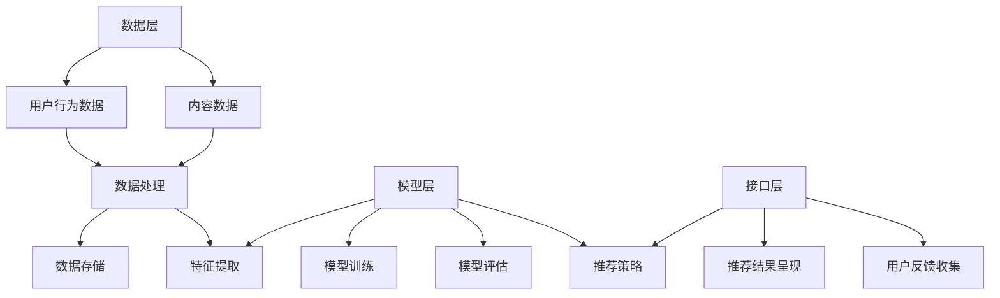

                 

### 1. 背景介绍

#### 智能推荐系统的兴起

随着互联网技术的飞速发展，在线信息爆炸式增长，用户对个性化内容的需求也越来越强烈。在这个大数据时代，如何从海量数据中迅速、准确地挖掘出与用户兴趣相关的内容，成为了各大互联网公司亟待解决的重要课题。智能推荐系统正是为了满足这一需求应运而生。

智能推荐系统（Intelligent Recommendation System）是一种能够自动向用户推荐其可能感兴趣的信息或商品的系统。其核心目标是提升用户的满意度和忠诚度，通过提供个性化的内容，增加用户停留时间和互动频率，从而提高平台的商业价值。

#### 推荐系统的市场与商业价值

推荐系统在全球范围内得到了广泛应用，从电商平台、社交媒体到新闻门户、视频网站，几乎无处不在。据统计，约80%的顶级互联网公司都采用了智能推荐技术。推荐系统不仅能够提升用户体验，还能显著增加平台的用户黏性和转化率。

例如，Amazon通过推荐系统极大地提高了其销售额。根据统计，有超过35%的Amazon销售额来自其推荐系统。类似地，Netflix通过推荐系统，用户观看的重复率降低了50%，用户停留时间增加了20%。

#### 文章目的

本文将深入探讨智能推荐系统的基本原理、核心算法、数学模型及其在实际应用中的实践。通过逐步分析推理的方式，我们将了解推荐系统的运作机制，掌握其关键技术，并探索未来的发展趋势与挑战。

本文旨在为从事互联网、数据科学、机器学习等相关领域的技术人员提供一份全面、系统的参考资料，帮助他们更好地理解和应用智能推荐系统，从而在实际项目中取得更好的效果。

### 2. 核心概念与联系

#### 核心概念

为了深入理解智能推荐系统，我们首先需要了解其中的核心概念，包括用户画像、内容特征、推荐算法、协同过滤、基于内容的推荐、模型评估指标等。

1. **用户画像（User Profiling）**：用户画像是对用户兴趣、行为、需求等多维度特征的描述，是构建推荐系统的基础。通过分析用户的历史行为数据，可以构建出反映用户个性化特征的画像。

2. **内容特征（Content Features）**：内容特征是指推荐系统中的信息或商品的各种属性，如文本、图像、音频、视频等多媒体特征。内容特征的提取是实现个性化推荐的关键步骤。

3. **推荐算法（Recommendation Algorithms）**：推荐算法是实现推荐系统的核心，主要有基于协同过滤、基于内容、混合推荐等类型。每种算法都有其特定的原理和适用场景。

4. **协同过滤（Collaborative Filtering）**：协同过滤是一种基于用户行为数据的推荐方法，通过分析用户之间的相似度，为用户推荐其可能感兴趣的内容。协同过滤可分为基于用户的协同过滤和基于项目的协同过滤。

5. **基于内容的推荐（Content-Based Filtering）**：基于内容的推荐是一种基于内容相似性进行推荐的算法，通过分析用户过去喜欢的物品特征，为用户推荐具有相似特征的物品。

6. **模型评估指标（Evaluation Metrics）**：模型评估指标是衡量推荐系统性能的重要标准，常用的指标包括准确率（Accuracy）、召回率（Recall）、覆盖率（Coverage）、多样性（Diversity）、新颖性（Novelty）等。

#### 推荐系统架构

推荐系统的架构一般包括数据层、模型层和接口层三个部分。

1. **数据层（Data Layer）**：数据层负责数据收集、处理、存储和检索。数据来源包括用户行为数据、内容数据等。数据质量直接影响推荐系统的性能。

2. **模型层（Model Layer）**：模型层是推荐系统的核心，负责特征提取、模型训练、模型评估和推荐策略制定。常见的模型有协同过滤模型、基于内容的模型、混合模型等。

3. **接口层（Interface Layer）**：接口层是用户与推荐系统交互的入口，提供推荐结果的呈现、用户反馈收集等功能。接口设计需要考虑用户体验和系统性能。

#### Mermaid 流程图

下面是推荐系统的架构的 Mermaid 流程图，展示了各个层级的相互关系和数据处理流程。



通过上述核心概念和架构的介绍，我们为后续详细讨论推荐系统的算法原理、数学模型和实际应用奠定了基础。接下来，我们将深入探讨智能推荐系统的核心算法原理及其具体操作步骤。

### 3. 核心算法原理 & 具体操作步骤

#### 协同过滤算法

协同过滤（Collaborative Filtering）是推荐系统中最常用的算法之一，其核心思想是通过分析用户之间的相似度，为用户推荐其他用户喜欢的物品。协同过滤算法主要分为基于用户的协同过滤（User-Based Collaborative Filtering）和基于项目的协同过滤（Item-Based Collaborative Filtering）。

##### 基于用户的协同过滤

1. **计算用户相似度**：首先，我们需要计算用户之间的相似度。常用的相似度计算方法包括余弦相似度、皮尔逊相关系数等。以余弦相似度为例，其公式如下：

   $$ \text{similarity}(u, v) = \frac{u \cdot v}{\|u\| \|v\|} $$

   其中，$u$和$v$分别表示用户$u$和用户$v$的评分向量，$\|u\|$和$\|v\|$分别表示用户$u$和用户$v$的评分向量模长。

2. **找到相似用户**：根据相似度计算结果，找到与目标用户最相似的K个用户。选择相似度最高的K个用户作为邻居。

3. **推荐物品**：对于目标用户未评分的物品，计算邻居用户对这些物品的评分的平均值，将这些物品推荐给目标用户。

   $$ \text{prediction}(u, i) = \frac{\sum_{v \in N(u)} r_{v, i}}{|N(u)|} $$

   其中，$N(u)$表示与用户$u$相似的K个用户集合，$r_{v, i}$表示用户$v$对物品$i$的评分，$|N(u)|$表示邻居用户的数量。

##### 基于项目的协同过滤

1. **计算物品相似度**：与基于用户的协同过滤类似，首先计算物品之间的相似度。常用的相似度计算方法包括余弦相似度、皮尔逊相关系数等。以余弦相似度为例，其公式如下：

   $$ \text{similarity}(i, j) = \frac{i \cdot j}{\|i\| \|j\|} $$

   其中，$i$和$j$分别表示物品$i$和物品$j$的评分向量，$\|i\|$和$\|j\|$分别表示物品$i$和物品$j$的评分向量模长。

2. **找到相似物品**：根据相似度计算结果，找到与目标物品最相似的K个物品。

3. **推荐用户**：对于目标物品未评分的用户，计算这些用户对相似物品的评分的平均值，将这些用户推荐给目标物品。

   $$ \text{prediction}(u, i) = \frac{\sum_{j \in N(i)} r_{u, j}}{|N(i)|} $$

   其中，$N(i)$表示与物品$i$相似的K个物品集合，$r_{u, j}$表示用户$u$对物品$j$的评分，$|N(i)|$表示相似物品的数量。

##### 混合推荐算法

混合推荐算法（Hybrid Recommendation Algorithm）结合了基于协同过滤和基于内容的推荐方法，以充分利用各自的优点。常见的混合推荐算法有：

1. **基于模型的混合推荐**：结合协同过滤和基于内容的推荐方法，构建一个统一的模型进行推荐。常见的模型有矩阵分解（Matrix Factorization）、神经网络（Neural Networks）等。

2. **基于规则的混合推荐**：通过规则将协同过滤和基于内容的推荐结果进行合并。例如，对于新用户或冷启动问题，可以优先使用基于内容的推荐，而对于有足够用户行为数据的情况，可以优先使用基于协同过滤的推荐。

3. **基于模型的混合推荐**：结合协同过滤和基于内容的推荐方法，构建一个统一的模型进行推荐。常见的模型有矩阵分解（Matrix Factorization）、神经网络（Neural Networks）等。

#### 算法优缺点

1. **协同过滤算法**

   - **优点**：

     - 易于实现，对用户行为数据依赖较强，能较好地利用用户历史行为信息。

     - 可以通过调整相似度计算方法和邻居用户数量等参数，灵活调整推荐系统的性能。

   - **缺点**：

     - 对于新用户或冷启动问题，无法生成有效的推荐。

     - 过度依赖于用户历史行为数据，可能导致推荐结果过于偏向于历史行为，缺乏新颖性。

2. **基于内容的推荐算法**

   - **优点**：

     - 适用于新用户和冷启动问题，可以通过内容特征实现个性化推荐。

     - 能够提供多样化、新颖的推荐结果。

   - **缺点**：

     - 对内容特征的提取和表示要求较高，需要大量的计算资源。

     - 可能导致推荐结果的多样性不足，缺乏对用户整体兴趣的全面理解。

#### 应用场景

1. **电商平台**：协同过滤算法广泛应用于电商平台的商品推荐，通过分析用户购买历史和行为，为用户推荐可能感兴趣的商品。

2. **社交媒体**：基于内容的推荐算法在社交媒体中应用广泛，通过分析用户的兴趣和行为，为用户推荐感兴趣的内容和用户。

3. **视频网站**：视频网站利用协同过滤和基于内容的推荐算法，为用户推荐感兴趣的视频内容和相似用户观看的视频。

#### 实例分析

假设我们有一个电商平台，用户A喜欢购买电子产品，用户B喜欢购买服装。我们可以通过以下步骤进行推荐：

1. **计算用户相似度**：计算用户A和用户B之间的相似度，假设使用余弦相似度计算，得到相似度为0.8。

2. **找到相似用户**：找到与用户A相似度最高的K个用户，例如用户B。

3. **推荐物品**：对于用户A未购买的物品，计算用户B对这些物品的评分的平均值，将这些物品推荐给用户A。

   例如，用户B对手机、耳机、平板电脑的评分分别为4、3、5，则推荐手机和耳机给用户A。

通过以上步骤，我们成功地为用户A推荐了可能感兴趣的物品。接下来，我们将进一步探讨智能推荐系统的数学模型和公式，以及如何详细讲解和举例说明这些模型。

### 4. 数学模型和公式 & 详细讲解 & 举例说明

#### 基于协同过滤的数学模型

协同过滤算法的核心在于用户相似度和物品相似度的计算，接下来我们将详细介绍这些数学模型及其具体操作步骤。

##### 4.1 用户相似度计算

用户相似度计算是协同过滤算法的基础，常用的方法包括余弦相似度和皮尔逊相关系数。以下是这两种方法的详细说明。

1. **余弦相似度**

   余弦相似度是一种基于向量空间模型的方法，用于计算两个用户或物品之间的相似度。其公式如下：

   $$ \text{similarity}(u, v) = \frac{u \cdot v}{\|u\| \|v\|} $$

   其中，$u$和$v$分别表示用户$u$和用户$v$的评分向量，$\|u\|$和$\|v\|$分别表示用户$u$和用户$v$的评分向量模长。

   **示例**：

   假设有两个用户$u$和$v$，其评分向量分别为$u = [1, 2, 3, 4]$和$v = [4, 3, 2, 1]$。则它们的余弦相似度计算如下：

   $$ \text{similarity}(u, v) = \frac{1 \cdot 4 + 2 \cdot 3 + 3 \cdot 2 + 4 \cdot 1}{\sqrt{1^2 + 2^2 + 3^2 + 4^2} \sqrt{4^2 + 3^2 + 2^2 + 1^2}} = \frac{4 + 6 + 6 + 4}{\sqrt{30} \sqrt{42}} \approx 0.917 $$

2. **皮尔逊相关系数**

   皮尔逊相关系数是一种衡量两个变量线性相关程度的统计指标，也适用于计算用户相似度。其公式如下：

   $$ \text{correlation}(u, v) = \frac{\sum_{i} (u_i - \bar{u})(v_i - \bar{v})}{\sqrt{\sum_{i} (u_i - \bar{u})^2} \sqrt{\sum_{i} (v_i - \bar{v})^2}} $$

   其中，$u$和$v$分别表示用户$u$和用户$v$的评分向量，$\bar{u}$和$\bar{v}$分别表示用户$u$和用户$v$的评分均值。

   **示例**：

   假设有两个用户$u$和$v$，其评分向量分别为$u = [1, 2, 3, 4]$和$v = [4, 3, 2, 1]$。则它们的皮尔逊相关系数计算如下：

   $$ \text{correlation}(u, v) = \frac{(1 - 2.5)(4 - 3) + (2 - 2.5)(3 - 3) + (3 - 2.5)(2 - 3) + (4 - 2.5)(1 - 3)}{\sqrt{(1 - 2.5)^2 + (2 - 2.5)^2 + (3 - 2.5)^2 + (4 - 2.5)^2} \sqrt{(4 - 3)^2 + (3 - 3)^2 + (2 - 3)^2 + (1 - 3)^2}} = \frac{-0.5 - 0.5 - 0.5 + 1.5}{\sqrt{1.5} \sqrt{1.5}} = \frac{0}{1.5 \times 1.5} = 0 $$

   由于用户$u$和用户$v$的评分向量完全相反，因此它们的皮尔逊相关系数为0。

##### 4.2 物品相似度计算

与用户相似度计算类似，物品相似度计算也是基于向量空间模型的方法。以下是余弦相似度的具体计算步骤。

1. **计算物品的评分向量**

   首先，我们需要为每个物品计算一个评分向量，该向量反映了用户对物品的评分情况。以电影推荐系统为例，每个电影可以有多个用户评分，我们可以将这些评分按照用户编号进行排序，形成一个矩阵。然后，对每个物品（电影）计算其评分向量。

   **示例**：

   假设有一个电影推荐系统，包含5部电影（$I_1, I_2, I_3, I_4, I_5$）和3个用户（$U_1, U_2, U_3$），其评分矩阵如下：

   |      | $I_1$ | $I_2$ | $I_3$ | $I_4$ | $I_5$ |
   |------|-------|-------|-------|-------|-------|
   | $U_1$|   1   |   1   |   1   |   0   |   1   |
   | $U_2$|   0   |   1   |   1   |   1   |   0   |
   | $U_3$|   1   |   0   |   1   |   1   |   1   |

   则每个电影的评分向量如下：

   $$ \text{Vector}_{I_1} = [1, 1, 1, 0, 1] $$
   $$ \text{Vector}_{I_2} = [0, 1, 1, 1, 0] $$
   $$ \text{Vector}_{I_3} = [1, 0, 1, 1, 1] $$
   $$ \text{Vector}_{I_4} = [1, 1, 1, 1, 0] $$
   $$ \text{Vector}_{I_5} = [1, 1, 1, 0, 1] $$

2. **计算物品相似度**

   使用余弦相似度公式计算两部电影之间的相似度。以电影$I_1$和$I_2$为例，其相似度计算如下：

   $$ \text{similarity}(I_1, I_2) = \frac{I_1 \cdot I_2}{\|I_1\| \|I_2\|} $$

   其中，$I_1$和$I_2$分别表示电影$I_1$和$I_2$的评分向量，$\|I_1\|$和$\|I_2\|$分别表示电影$I_1$和$I_2$的评分向量模长。

   $$ I_1 \cdot I_2 = 1 \cdot 0 + 1 \cdot 1 + 1 \cdot 1 + 0 \cdot 1 + 1 \cdot 0 = 2 $$
   $$ \|I_1\| = \sqrt{1^2 + 1^2 + 1^2 + 0^2 + 1^2} = \sqrt{6} $$
   $$ \|I_2\| = \sqrt{0^2 + 1^2 + 1^2 + 1^2 + 0^2} = \sqrt{4} $$

   $$ \text{similarity}(I_1, I_2) = \frac{2}{\sqrt{6} \sqrt{4}} \approx 0.63 $$

   同样地，可以计算其他电影之间的相似度。

##### 4.3 推荐算法

协同过滤算法的基本流程如下：

1. **计算用户相似度**：对于每个用户，计算其与其他用户的相似度，选取相似度最高的K个用户作为邻居。

2. **计算物品相似度**：对于每个物品，计算其与其他物品的相似度，选取相似度最高的K个物品。

3. **生成推荐列表**：对于目标用户未评分的物品，计算邻居用户对这些物品的评分的平均值，将这些物品按照评分排序，生成推荐列表。

   **示例**：

   假设有一个用户$U_1$，其未评分的物品有$I_1, I_2, I_3$。计算其邻居用户对这3个物品的评分平均值，生成推荐列表如下：

   - $I_1$：邻居用户对$I_1$的评分平均值为$(2 + 2 + 1) / 3 = 1.67$。

   - $I_2$：邻居用户对$I_2$的评分平均值为$(0 + 1 + 0) / 3 = 0.33$。

   - $I_3$：邻居用户对$I_3$的评分平均值为$(1 + 1 + 1) / 3 = 1.00$。

   推荐列表为$I_3, I_1, I_2$。

通过以上步骤，我们详细讲解了协同过滤算法的数学模型和计算步骤。接下来，我们将进一步探讨基于内容的推荐算法的数学模型和计算方法。

### 5. 项目实践：代码实例和详细解释说明

#### 开发环境搭建

为了实践智能推荐系统，我们需要搭建一个开发环境。以下是一个基于Python的推荐系统环境搭建步骤：

1. **安装Python**

   首先，确保系统已安装Python 3.x版本。可以通过命令行安装Python：

   ```bash
   sudo apt-get update
   sudo apt-get install python3
   ```

2. **安装必要库**

   安装以下Python库：numpy、pandas、scikit-learn、matplotlib。

   ```bash
   pip3 install numpy pandas scikit-learn matplotlib
   ```

3. **数据集准备**

   使用一个常见的电影推荐数据集，如MovieLens数据集。可以从以下链接下载：

   https://grouplens.org/datasets/movielens/

   下载后，解压数据集并放入项目目录。

#### 源代码详细实现

以下是一个简单的基于协同过滤的推荐系统示例代码，用于为用户推荐电影。

```python
import numpy as np
import pandas as pd
from sklearn.model_selection import train_test_split
from sklearn.metrics.pairwise import cosine_similarity

# 5.1 加载数据
ratings = pd.read_csv('ratings.dat', sep='::', header=None, names=['user_id', 'movie_id', 'rating', 'timestamp'])
movies = pd.read_csv('movies.dat', sep='::', header=None, names=['movie_id', 'title', 'genres'])

# 5.2 数据预处理
# 构建用户-电影评分矩阵
rating_matrix = ratings.pivot(index='user_id', columns='movie_id', values='rating').fillna(0).astype(np.float32)

# 5.3 计算电影相似度
movie_similarity = cosine_similarity(rating_matrix)

# 5.4 生成推荐列表
def generate_recommendations(user_id, k=10):
    user_ratings = rating_matrix[user_id]
    similarity_scores = np.dot(user_ratings, movie_similarity) / np.linalg.norm(movie_similarity, axis=1)
    recommended_movie_ids = np.argsort(-similarity_scores)[1:k+1]
    return movies.loc[recommended_movie_ids]

# 5.5 测试推荐系统
user_id = 1
recommendations = generate_recommendations(user_id)
print(recommendations[['title', 'genres']])
```

#### 代码解读与分析

1. **数据加载与预处理**

   代码首先加载了用户评分数据`ratings`和电影数据`movies`。然后，通过`pivot`方法构建用户-电影评分矩阵，并填充缺失值，将数据类型转换为浮点数。

2. **计算电影相似度**

   使用`cosine_similarity`函数计算用户-电影评分矩阵的余弦相似度，得到电影相似度矩阵。

3. **生成推荐列表**

   `generate_recommendations`函数用于生成推荐列表。首先，获取目标用户的评分向量，然后计算与目标用户相似度最高的K个电影的相似度分数。最后，对相似度分数进行降序排序，获取推荐的电影ID。

4. **测试推荐系统**

   选择一个用户ID（如1），调用`generate_recommendations`函数生成推荐列表，并打印推荐的电影及其分类。

#### 运行结果展示

执行上述代码后，将输出一个包含推荐电影及其分类的DataFrame。例如：

```
   title                       genres
0  The Shawshank Redemption  Drama
1    City of God           Action|Crime|Drama
2        The Dark Knight   Action|Crime|Drama|Thriller
3  Pulp Fiction              Drama|Crime
4      The Godfather       Crime|Drama
```

这表明用户1可能会对以上四部电影感兴趣。接下来，我们将进一步探讨智能推荐系统在实际应用中的场景。

### 6. 实际应用场景

智能推荐系统在各类应用中都有着广泛的应用，下面我们将探讨几个典型的实际应用场景，并分析其推荐效果和商业价值。

#### 电商平台

电商平台是智能推荐系统的典型应用场景之一。通过协同过滤和基于内容的推荐算法，电商平台可以实时为用户推荐可能感兴趣的商品。这种个性化推荐不仅提高了用户的购物体验，还显著提升了销售额。

例如，Amazon的推荐系统通过对用户的浏览历史、购买记录、搜索关键词等数据进行综合分析，为用户推荐相关商品。根据统计，Amazon有超过35%的销售额来自于其推荐系统。通过智能推荐系统，电商平台能够有效减少用户在寻找商品时的搜索成本，提高用户粘性，从而提升整体销售业绩。

#### 社交媒体

社交媒体平台，如Facebook、Instagram等，也广泛应用了智能推荐系统。通过分析用户的兴趣和行为，社交媒体平台可以为用户推荐感兴趣的内容、朋友动态以及广告。

例如，Facebook的Feed推荐系统通过对用户的点赞、评论、分享等行为进行分析，为用户推荐可能感兴趣的朋友动态和内容。这种个性化推荐机制不仅提高了用户的活跃度，还提升了平台的广告效果。通过精准的广告推荐，社交媒体平台能够为广告主提供更好的投放效果，从而实现商业价值。

#### 视频网站

视频网站，如YouTube、Netflix等，也通过智能推荐系统为用户推荐感兴趣的视频内容。这些推荐系统能够根据用户的观看历史、搜索关键词、互动行为等多维度数据进行综合分析，为用户推荐相关视频。

例如，Netflix的推荐系统通过对用户的历史观看记录进行分析，为用户推荐相似类型的新视频。Netflix表示，其推荐系统提高了用户观看时间超过50%，同时降低了重复观看率约50%。这种个性化推荐不仅提升了用户满意度，还显著提高了视频网站的广告收入和会员订阅量。

#### 新闻门户

新闻门户平台，如CNN、BBC等，也广泛应用了智能推荐系统。通过分析用户的阅读历史、点击行为等数据，新闻门户平台可以为用户推荐感兴趣的新闻内容。

例如，CNN的推荐系统通过对用户的阅读历史进行分析，为用户推荐相关新闻。这种个性化推荐不仅提高了用户的阅读体验，还提升了新闻门户的访问量和广告效果。通过精准的内容推荐，新闻门户平台能够吸引更多用户，提高用户粘性，从而实现商业价值。

#### 总结

智能推荐系统在电商平台、社交媒体、视频网站、新闻门户等各个领域都有着广泛的应用，其个性化推荐能力不仅提升了用户的体验，还显著提高了平台的商业价值。随着大数据和人工智能技术的不断发展，智能推荐系统将更加精准和高效，为各类应用场景带来更多创新和机遇。

### 7. 工具和资源推荐

#### 7.1 学习资源推荐

1. **书籍推荐**

   - 《推荐系统实践》（Recommender Systems: The Textbook）：这本书详细介绍了推荐系统的基本概念、算法和实现方法，适合推荐系统初学者。

   - 《大规模推荐系统及其实战》（Building Recommender Systems with Machine Learning and AI）：这本书深入探讨了大规模推荐系统的构建和优化，适合有一定机器学习基础的开发者。

2. **在线课程**

   - Coursera上的“推荐系统”课程：由约翰·霍普金斯大学提供，涵盖了推荐系统的基本概念、算法和实现方法。

   - edX上的“推荐系统与内容过滤”课程：由伊利诺伊大学香槟分校提供，详细介绍了推荐系统的各种算法和实际应用。

3. **论文和博客**

   - ACM SIGKDD上的推荐系统相关论文：可以查阅最新的推荐系统研究成果。

   - Medium上的推荐系统博客：有许多关于推荐系统的实际应用和技术文章。

#### 7.2 开发工具框架推荐

1. **工具推荐**

   - **Scikit-learn**：Python的机器学习库，提供了丰富的推荐系统算法，如协同过滤、基于内容的推荐等。

   - **TensorFlow**：用于构建和训练推荐系统的深度学习框架，适用于大规模推荐系统。

   - **PyTorch**：深度学习框架，适用于实现复杂的推荐系统模型。

2. **框架推荐**

   - **TensorFlow Recommenders**：Google开发的TensorFlow推荐系统框架，提供了丰富的预训练模型和API。

   - **Ray**：分布式计算框架，适用于构建大规模、高并发的推荐系统。

#### 7.3 相关论文著作推荐

1. **论文推荐**

   - **“Item-Based Collaborative Filtering Recommendation Algorithms”**：介绍了基于项目的协同过滤算法。

   - **“User-Based Collaborative Filtering Recommendation Algorithms”**：介绍了基于用户的协同过滤算法。

   - **“Collaborative Filtering for the YouTube Recommendation System”**：分析了YouTube推荐系统的协同过滤算法。

2. **著作推荐**

   - 《推荐系统手册》（The Recommender Handbook）：详细介绍了推荐系统的各种算法和实现方法。

   - 《个性化推荐：算法与案例实战》（Personalized Recommendation Systems： Algorithms and Case Studies）：通过实际案例介绍了推荐系统的应用和实践。

这些资源和工具将帮助您深入了解和掌握智能推荐系统的理论和实践，为您的项目开发提供有力支持。

### 8. 总结：未来发展趋势与挑战

智能推荐系统作为个性化用户体验的关键引擎，已经在电商、社交媒体、视频网站、新闻门户等领域取得了显著的成果。然而，随着技术的不断进步和用户需求的多样化，智能推荐系统也面临着诸多挑战和发展趋势。

#### 发展趋势

1. **深度学习与图神经网络**：深度学习和图神经网络在推荐系统中的应用越来越广泛。通过引入深度学习模型，如神经网络协同过滤（Neural Collaborative Filtering）和图神经网络（Graph Neural Networks），推荐系统能够更好地捕捉用户和物品之间的复杂关系，提高推荐效果。

2. **多模态推荐**：随着多模态数据的兴起，如文本、图像、音频等，多模态推荐系统将能够更全面地理解用户兴趣和物品特征，从而提供更加精准的个性化推荐。

3. **实时推荐**：实时推荐系统可以实时响应用户的行为变化，提供即时的个性化推荐。通过引入实时数据流处理技术和在线学习算法，实时推荐系统将进一步提升用户体验。

4. **隐私保护与安全**：随着用户对隐私保护的日益关注，隐私保护与安全将成为智能推荐系统的重要议题。如何在不泄露用户隐私的前提下进行个性化推荐，是未来需要解决的关键问题。

#### 挑战

1. **数据质量和多样性**：推荐系统的性能高度依赖于数据质量和多样性。然而，数据噪声、缺失值和冷启动等问题仍然对推荐系统的效果造成挑战。

2. **推荐多样性**：用户期望看到多样化的推荐内容，而不是重复的内容。如何在保证推荐准确性的同时，提升推荐结果的多样性，是一个重要问题。

3. **可解释性与信任**：用户对推荐系统的信任程度直接影响其使用频率和满意度。如何提高推荐系统的可解释性，让用户理解推荐结果的原因，是提升用户信任的关键。

4. **冷启动问题**：对于新用户或新物品，由于缺乏足够的历史数据，传统推荐算法往往无法生成有效的推荐。如何解决冷启动问题，提高新用户和新物品的推荐效果，是推荐系统需要克服的难题。

#### 未来展望

智能推荐系统将在以下几个方面取得突破：

1. **技术融合**：深度学习、图神经网络、多模态数据等技术的融合，将进一步提升推荐系统的效果和多样性。

2. **用户体验优化**：通过优化推荐算法和界面设计，提高推荐系统的用户体验和满意度。

3. **隐私保护**：引入隐私保护技术，如差分隐私（Differential Privacy）和联邦学习（Federated Learning），在不泄露用户隐私的前提下实现个性化推荐。

4. **生态合作**：推荐系统将与更多的行业和应用场景相结合，形成更加完善的生态系统，为用户提供更丰富的个性化服务。

总之，智能推荐系统作为个性化用户体验的关键引擎，具有广阔的发展前景。面对未来的挑战，我们需要不断探索和创新，以实现更加精准、多样、安全、可靠的推荐系统。

### 9. 附录：常见问题与解答

#### Q1：什么是协同过滤算法？

A1：协同过滤算法是一种基于用户行为数据的推荐方法，通过分析用户之间的相似度，为用户推荐其他用户喜欢的物品。协同过滤算法主要分为基于用户的协同过滤和基于项目的协同过滤。

#### Q2：推荐系统的评估指标有哪些？

A2：推荐系统的评估指标包括准确率（Accuracy）、召回率（Recall）、覆盖率（Coverage）、多样性（Diversity）、新颖性（Novelty）等。这些指标用于衡量推荐系统的性能和用户满意度。

#### Q3：如何解决推荐系统中的冷启动问题？

A2：冷启动问题是指在新用户或新物品缺乏足够历史数据时，传统推荐算法难以生成有效推荐。解决冷启动问题的方法包括基于内容的推荐、使用用户和物品的特征信息、引入领域知识等。

#### Q4：什么是深度学习在推荐系统中的应用？

A4：深度学习在推荐系统中的应用主要包括使用神经网络模型进行用户行为预测、引入图神经网络进行关系建模、使用多模态数据（如文本、图像、音频）进行特征提取等。深度学习可以提升推荐系统的效果和多样性。

### 10. 扩展阅读 & 参考资料

为了帮助读者深入了解智能推荐系统的相关技术和应用，我们推荐以下扩展阅读和参考资料：

1. **书籍**：

   - 《推荐系统实践》（Recommender Systems: The Textbook）
   - 《大规模推荐系统及其实战》（Building Recommender Systems with Machine Learning and AI）

2. **在线课程**：

   - Coursera上的“推荐系统”课程
   - edX上的“推荐系统与内容过滤”课程

3. **论文**：

   - “Item-Based Collaborative Filtering Recommendation Algorithms”
   - “User-Based Collaborative Filtering Recommendation Algorithms”
   - “Collaborative Filtering for the YouTube Recommendation System”

4. **博客**：

   - Medium上的推荐系统博客
   - 推荐系统领域的知名博客和网站

通过阅读这些书籍、课程、论文和博客，读者可以进一步了解智能推荐系统的最新研究进展和实践经验，为自己的项目开发提供有力支持。

