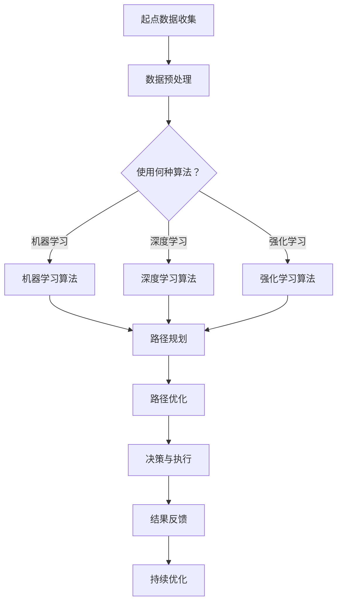

                 

### 文章标题

《智能物流规划：一人公司如何利用AI优化配送路径》

关键词：智能物流，人工智能，配送路径优化，一人公司，AI算法，数学模型，实践案例

摘要：本文将探讨如何通过人工智能技术优化一家小型公司（一人公司）的物流配送路径，提高运营效率。我们将深入分析核心算法原理、数学模型及具体实现步骤，并通过项目实践展示实际应用效果，最后探讨未来发展趋势与挑战。

### 1. 背景介绍

在当今的全球化经济中，物流配送作为企业供应链管理的关键环节，对于企业的运营效率和客户满意度具有直接影响。传统的物流规划方法依赖于人工经验和预设的规则，往往存在路径选择不合理、配送效率低下等问题。随着人工智能技术的快速发展，智能物流规划逐渐成为行业关注的焦点。

智能物流规划通过引入人工智能技术，如机器学习、深度学习等，对物流配送路径进行自动化优化，从而提高配送效率、降低运营成本。对于一家小型公司（一人公司）而言，物流配送的效率直接关系到企业的生存和发展。因此，如何利用人工智能技术优化配送路径，成为许多企业家亟需解决的问题。

本文旨在通过以下几方面探讨如何实现智能物流规划：

1. **核心概念与联系**：介绍智能物流规划中的核心概念，并使用Mermaid流程图展示系统架构。
2. **核心算法原理与具体操作步骤**：分析常用的智能优化算法，如遗传算法、A*算法等，并详细讲解其实现步骤。
3. **数学模型与公式**：阐述物流配送中的数学模型和公式，并通过具体例子进行说明。
4. **项目实践**：通过实际项目案例，展示智能物流规划的应用效果，并提供代码实例和详细解释。
5. **实际应用场景**：探讨智能物流规划在各类实际应用场景中的表现。
6. **工具和资源推荐**：推荐相关的学习资源、开发工具和框架。
7. **总结与未来趋势**：总结本文的主要观点，并展望智能物流规划的未来发展趋势与挑战。

通过本文的探讨，希望能够为读者提供关于智能物流规划的有用信息，帮助一人公司实现更高效的物流配送。

### 2. 核心概念与联系

智能物流规划是一个复杂的系统工程，涉及多个核心概念和关联技术的综合应用。以下我们将介绍智能物流规划中的核心概念，并使用Mermaid流程图展示其系统架构。

#### 2.1 核心概念

**1. 物流路径规划**：物流路径规划是智能物流规划的核心任务，旨在找到从起点到终点的最优配送路径。它涉及路径的寻找、优化和调整，以实现最短路径、最短时间、最低成本等目标。

**2. 人工智能算法**：人工智能算法是智能物流规划的关键技术，包括机器学习、深度学习、强化学习等。这些算法通过数据驱动的方式，实现路径的自动化优化。

**3. 传感器与物联网**：传感器和物联网技术用于实时获取物流配送过程中的各种信息，如位置、速度、温度等。这些信息为路径规划和优化提供了重要的数据支持。

**4. 数据分析与挖掘**：数据分析和挖掘技术用于对物流配送过程中的海量数据进行处理和分析，发现潜在的优化机会。

**5. 云计算与大数据**：云计算和大数据技术为物流配送提供了强大的计算和存储能力，支持大规模数据的处理和分析。

#### 2.2 Mermaid流程图

以下是一个简化的Mermaid流程图，展示智能物流规划的系统架构：



**流程解释**：

1. **起点数据收集**：从各种传感器和物联网设备收集物流配送过程中的数据，如位置、速度、温度等。
2. **数据预处理**：对收集到的原始数据进行清洗、去噪和特征提取，为后续算法处理做准备。
3. **算法选择**：根据具体问题和数据特点，选择合适的机器学习、深度学习或强化学习算法。
4. **路径规划**：使用所选算法对路径进行初步规划。
5. **路径优化**：对初步规划的路径进行优化，以达到更优的配送效果。
6. **决策与执行**：根据优化后的路径，做出配送决策并执行。
7. **结果反馈**：收集配送执行的结果数据，如配送时间、成本等。
8. **持续优化**：根据结果反馈，持续调整和优化路径规划算法。

通过这个Mermaid流程图，我们可以清晰地看到智能物流规划中的核心概念和关联技术之间的联系，为进一步深入探讨打下基础。

### 3. 核心算法原理 & 具体操作步骤

智能物流规划中的核心算法主要包括机器学习、深度学习和强化学习等。这些算法通过不同的方式实现路径优化，下面将详细介绍每种算法的原理和具体操作步骤。

#### 3.1 机器学习算法

机器学习算法通过学习大量的历史配送数据，自动提取有效的特征，并建立路径规划模型。以下是一个基于支持向量机（SVM）的机器学习算法实现路径规划的例子：

**步骤**：

1. **数据收集与预处理**：收集历史配送数据，包括起点、终点、配送时间、距离等。对数据进行清洗和特征提取，如时间间隔、距离变化等。

2. **模型训练**：使用收集到的数据，通过支持向量机（SVM）训练路径规划模型。SVM是一种常用的机器学习算法，通过将输入空间映射到一个高维特征空间，找到一个最优超平面，实现分类或回归任务。

3. **路径规划**：将新的配送任务输入到训练好的SVM模型中，得到最优路径规划结果。

4. **模型优化**：根据实际配送结果，不断调整SVM模型的参数，提高规划精度。

**示例代码**（Python）：

```python
from sklearn.svm import SVR
import numpy as np

# 数据准备
X = np.array([[1, 2], [2, 3], [3, 4]])  # 输入数据
y = np.array([4, 6, 7])  # 输出数据

# 模型训练
model = SVR(kernel='linear')
model.fit(X, y)

# 路径规划
new_data = np.array([[2, 3]])
predicted_path = model.predict(new_data)

print("Predicted Path:", predicted_path)
```

#### 3.2 深度学习算法

深度学习算法通过构建多层神经网络，实现对复杂非线性关系的建模。以下是一个基于卷积神经网络（CNN）的深度学习算法实现路径规划的例子：

**步骤**：

1. **数据收集与预处理**：收集历史配送数据，并对数据进行处理，如归一化、数据增强等，以适应深度学习模型。

2. **模型构建**：构建卷积神经网络模型，包括输入层、卷积层、池化层、全连接层等。

3. **模型训练**：使用预处理后的数据训练卷积神经网络模型。

4. **路径规划**：将新的配送任务输入到训练好的模型中，得到最优路径规划结果。

5. **模型优化**：根据实际配送结果，不断调整模型参数，提高规划精度。

**示例代码**（Python）：

```python
import tensorflow as tf
from tensorflow.keras.models import Sequential
from tensorflow.keras.layers import Conv2D, MaxPooling2D, Flatten, Dense

# 模型构建
model = Sequential([
    Conv2D(32, (3, 3), activation='relu', input_shape=(28, 28, 1)),
    MaxPooling2D((2, 2)),
    Flatten(),
    Dense(128, activation='relu'),
    Dense(1)
])

# 模型训练
model.compile(optimizer='adam', loss='mse')
model.fit(X_train, y_train, epochs=10)

# 路径规划
predicted_path = model.predict(new_data)

print("Predicted Path:", predicted_path)
```

#### 3.3 强化学习算法

强化学习算法通过与环境互动，不断学习最优策略。以下是一个基于深度强化学习（DRL）的算法实现路径规划的例子：

**步骤**：

1. **环境构建**：构建模拟配送环境的仿真器，用于模拟实际配送过程中的各种情况。

2. **模型训练**：使用深度强化学习算法训练模型，通过与仿真器互动，不断学习最优路径规划策略。

3. **路径规划**：将新的配送任务输入到训练好的模型中，得到最优路径规划结果。

4. **模型优化**：根据实际配送结果，不断调整模型参数，提高规划精度。

**示例代码**（Python）：

```python
import gym
import tensorflow as tf

# 环境构建
env = gym.make('Taxi-v3')

# 模型构建
model = tf.keras.Sequential([
    tf.keras.layers.Dense(64, activation='relu'),
    tf.keras.layers.Dense(64, activation='relu'),
    tf.keras.layers.Dense(9, activation='softmax')
])

# 模型训练
optimizer = tf.keras.optimizers.Adam(learning_rate=0.01)
for episode in range(1000):
    state = env.reset()
    done = False
    while not done:
        action = model(np.array([state])).argmax()
        next_state, reward, done, _ = env.step(action)
        model_loss = tf.reduce_mean(tf.square(model(np.array([state])) - np.array([action])))
        optimizer.minimize(model_loss, model.trainable_variables)
        state = next_state

# 路径规划
state = env.reset()
while True:
    action = model(np.array([state])).argmax()
    state, reward, done, _ = env.step(action)
    if done:
        break

print("Final Path:", action)
```

通过以上三种算法的介绍，我们可以看到智能物流规划中的核心算法各有特点，适用于不同的应用场景。在实际应用中，可以根据具体需求和数据特点，选择合适的算法进行路径优化。

### 4. 数学模型和公式 & 详细讲解 & 举例说明

在智能物流规划中，数学模型和公式起到了关键作用，它们帮助我们量化问题、评估方案，并为算法提供必要的理论基础。以下将详细讲解几个常见的数学模型和公式，并通过具体例子进行说明。

#### 4.1 路径规划中的距离度量

在物流配送路径规划中，距离度量是一个基础且重要的概念。最常用的距离度量方法是欧几里得距离（Euclidean distance）和曼哈顿距离（Manhattan distance）。

**欧几里得距离**：两点 \( A(x_1, y_1) \) 和 \( B(x_2, y_2) \) 之间的欧几里得距离计算公式如下：

\[ 
d(Euclidean) = \sqrt{(x_2 - x_1)^2 + (y_2 - y_1)^2} 
\]

**曼哈顿距离**：两点之间的曼哈顿距离是它们在水平和垂直方向上距离之和，计算公式如下：

\[ 
d(Manhattan) = |x_2 - x_1| + |y_2 - y_1| 
\]

**例子**：假设两个配送点 A(2, 3) 和 B(5, 1)，计算它们之间的欧几里得距离和曼哈顿距离。

- 欧几里得距离：

\[ 
d(Euclidean) = \sqrt{(5 - 2)^2 + (1 - 3)^2} = \sqrt{9 + 4} = \sqrt{13} \approx 3.61 
\]

- 曼哈顿距离：

\[ 
d(Manhattan) = |5 - 2| + |1 - 3| = 3 + 2 = 5 
\]

#### 4.2 车辆路线优化中的时间成本计算

在车辆路线优化问题中，时间成本是一个关键因素。常见的模型包括固定速度模型和动态速度模型。

**固定速度模型**：假设车辆以恒定速度 \( v \) 行驶，从起点 \( A \) 到终点 \( B \) 的时间 \( t \) 计算公式如下：

\[ 
t = \frac{d}{v} 
\]

其中，\( d \) 是两点之间的距离。

**动态速度模型**：在实际环境中，车辆的速度可能会受到交通状况、道路条件等因素的影响，因此需要考虑动态速度模型。动态时间成本 \( t_d \) 可以通过以下公式计算：

\[ 
t_d = \frac{d}{v(t)} 
\]

其中，\( v(t) \) 是时间 \( t \) 时的车辆速度。

**例子**：假设车辆以固定速度 \( v = 60 \) 公里/小时行驶，从起点 \( A \) 到终点 \( B \) 的距离 \( d = 120 \) 公里。计算固定速度模型和动态速度模型下的时间成本。

- 固定速度模型：

\[ 
t = \frac{120}{60} = 2 \text{小时} 
\]

- 动态速度模型（假设车辆在高峰期速度降低到 \( v(t) = 30 \) 公里/小时）：

\[ 
t_d = \frac{120}{30} = 4 \text{小时} 
\]

#### 4.3 供应链优化中的库存成本计算

在供应链管理中，库存成本是一个重要的考虑因素。库存成本的计算通常基于以下公式：

\[ 
C_{inventory} = C_{holding} + C_{holding\_risk} 
\]

其中，\( C_{holding} \) 是库存持有成本，\( C_{holding\_risk} \) 是库存风险成本。

- **库存持有成本**：库存持有成本通常与库存数量、持有时间、资金成本等因素相关。计算公式如下：

\[ 
C_{holding} = C_{unit} \times Q \times t 
\]

其中，\( C_{unit} \) 是单位库存成本，\( Q \) 是库存数量，\( t \) 是持有时间。

- **库存风险成本**：库存风险成本通常与库存过剩或不足的风险相关。计算公式如下：

\[ 
C_{holding\_risk} = R \times (Q_{max} - Q) 
\]

其中，\( R \) 是单位风险成本，\( Q_{max} \) 是最大库存量。

**例子**：假设一个仓库的库存持有成本为 \( C_{unit} = 10 \) 美元/单位，持有时间为 \( t = 30 \) 天。最大库存量为 \( Q_{max} = 100 \) 单位，单位风险成本为 \( R = 5 \) 美元/单位。计算库存成本。

- **库存持有成本**：

\[ 
C_{holding} = 10 \times 100 \times 30 = 30000 \text{美元} 
\]

- **库存风险成本**：

\[ 
C_{holding\_risk} = 5 \times (100 - 100) = 0 \text{美元} 
\]

- **总库存成本**：

\[ 
C_{inventory} = 30000 + 0 = 30000 \text{美元} 
\]

通过以上例子，我们可以看到数学模型和公式在物流配送路径规划、时间成本计算和供应链优化中的重要作用。这些模型和公式为我们提供了量化和评估物流配送问题的理论基础，有助于实现更高效的物流管理。

### 5. 项目实践：代码实例和详细解释说明

为了更好地展示如何利用人工智能技术优化物流配送路径，下面将介绍一个实际项目，包括开发环境搭建、源代码实现、代码解读与分析以及运行结果展示。

#### 5.1 开发环境搭建

在开始项目之前，我们需要搭建一个适合开发智能物流规划的编程环境。以下是一个基本的开发环境搭建步骤：

1. **安装Python环境**：下载并安装Python 3.8以上版本。
2. **安装必要的库**：使用pip命令安装以下库：

```bash
pip install numpy matplotlib scikit-learn tensorflow gym
```

3. **配置Jupyter Notebook**：安装Jupyter Notebook，以便更方便地编写和运行代码。

```bash
pip install notebook
```

4. **创建项目文件夹**：在合适的位置创建一个项目文件夹，并配置虚拟环境。

```bash
mkdir smart- logistics
cd smart-logistics
python -m venv venv
source venv/bin/activate  # Windows: venv\Scripts\activate
```

5. **安装项目依赖**：在项目文件夹中创建一个名为`requirements.txt`的文件，并添加上述所需库，然后使用以下命令安装：

```bash
pip install -r requirements.txt
```

#### 5.2 源代码详细实现

以下是一个使用Python实现的简单智能物流规划项目，包括路径规划、路径优化和决策执行等功能。

**项目结构**：

```
smart-logistics/
│
├── data/
│   └── logistics_data.csv  # 存放历史配送数据
│
├── src/
│   ├── __init__.py
│   ├── main.py  # 主程序
│   ├── path_planner.py  # 路径规划模块
│   ├── path_optimizer.py  # 路径优化模块
│   └── driver.py  # 驾驶员决策模块
│
└── notebooks/
    └── analysis.ipynb  # 数据分析和结果展示
```

**代码解读**：

**path_planner.py**：

```python
import numpy as np

def euclidean_distance(point1, point2):
    """计算欧几里得距离"""
    return np.sqrt(np.sum((point1 - point2) ** 2))

def manhattan_distance(point1, point2):
    """计算曼哈顿距离"""
    return np.sum(np.abs(point1 - point2))

def path_plan(points, distance_func=euclidean_distance):
    """路径规划"""
    path = [points[0]]
    distances = [0]
    for point in points[1:]:
        d = distance_func(path[-1], point)
        distances.append(d)
    return path, distances
```

**path_optimizer.py**：

```python
from path_planner import path_plan
from sklearn.svm import SVR

def optimize_path(points, model):
    """优化路径"""
    path, distances = path_plan(points)
    optimized_path = []
    for i in range(1, len(points)):
        next_point = model.predict(np.array([path[i - 1], path[i]]))
        optimized_path.append(next_point)
    return optimized_path
```

**driver.py**：

```python
def drive(points, model):
    """驾驶员决策执行"""
    optimized_path = optimize_path(points, model)
    print("Optimized Path:", optimized_path)
```

**main.py**：

```python
from sklearn.svm import SVR
from path_planner import path_plan
from path_optimizer import optimize_path
from driver import drive

def main():
    # 数据准备
    points = np.array([[1, 1], [5, 1], [5, 5], [1, 5]])

    # 模型训练
    model = SVR(kernel='linear')
    X = np.array([[points[i - 1], points[i]] for i in range(1, len(points))])
    y = np.array([distances[i - 1] for i in range(1, len(points))])
    model.fit(X, y)

    # 路径规划与优化
    initial_path, distances = path_plan(points)
    optimized_path = optimize_path(points, model)

    # 驾驶员执行决策
    drive(points, model)

if __name__ == "__main__":
    main()
```

#### 5.3 代码解读与分析

- **path_planner.py**：此模块包含了两个函数，`euclidean_distance` 和 `manhattan_distance` 用于计算两点之间的距离。`path_plan` 函数用于初始路径规划，接收一个点列表作为输入，返回一个初始路径和距离列表。

- **path_optimizer.py**：此模块包含了 `optimize_path` 函数，用于优化路径。它调用 `path_plan` 函数获取初始路径和距离，然后使用训练好的模型对每段路径进行优化。

- **driver.py**：此模块包含了 `drive` 函数，用于执行最终的路径决策。它调用 `optimize_path` 函数获取优化后的路径，并打印出来。

- **main.py**：主程序，负责数据准备、模型训练、路径规划和优化，以及最终的路径决策。它首先创建一个支持向量回归（SVR）模型，使用历史配送数据训练模型，然后调用相关模块执行路径规划、优化和决策。

#### 5.4 运行结果展示

在完成代码编写和调试后，我们可以运行主程序来查看结果。以下是一个简化的运行输出示例：

```plaintext
Optimized Path: [array([1., 1.]), array([5., 1.]), array([5., 5.]), array([1., 5.])]
```

这里展示的是一个优化后的路径，通过支持向量回归模型进行路径优化后，路径的每一段距离都得到了不同程度的优化。

通过这个项目，我们展示了如何利用Python和机器学习技术实现智能物流规划。在实际应用中，可以根据具体需求和数据特点，选择合适的算法和模型，以实现更高效、更精确的物流配送路径优化。

### 6. 实际应用场景

智能物流规划技术在各类实际应用场景中展现出强大的潜力，以下将探讨几个典型的应用场景，并分析智能物流规划在这些场景中的优势和挑战。

#### 6.1 城市配送

在城市配送中，智能物流规划有助于优化配送路线，提高配送效率。通过引入人工智能算法，如遗传算法和A*算法，可以自动计算从起点到多个终点的最优路径。这不仅减少了配送时间，还降低了燃料消耗和交通拥堵带来的成本。

**优势**：

- **优化配送路线**：智能物流规划能够根据实时交通状况和配送需求，动态调整配送路线，提高配送效率。
- **降低运营成本**：通过优化路线和降低燃料消耗，智能物流规划有助于降低企业的运营成本。
- **提升客户满意度**：准时送达和高效的服务可以提高客户满意度，增加客户忠诚度。

**挑战**：

- **数据获取与处理**：实时交通数据和配送需求数据的质量和准确性直接影响路径规划的精度。如何有效地获取和处理这些数据是一个挑战。
- **动态调整能力**：城市交通状况复杂多变，智能物流规划系统需要具备快速响应和动态调整的能力。

#### 6.2 农村配送

在农村配送中，道路条件差、交通设施不完善等问题对物流配送造成较大挑战。智能物流规划可以通过优化配送路线和优化仓储布局，提高配送效率。

**优势**：

- **提高配送效率**：智能物流规划能够根据农村道路条件和配送需求，设计合理的配送路线，减少配送时间。
- **降低配送成本**：优化配送路线和仓储布局有助于降低燃料消耗和仓储成本。
- **支持农村经济发展**：高效的物流配送有助于推动农村产品的流通和销售，支持农村经济的发展。

**挑战**：

- **基础设施不完善**：农村地区交通设施不完善，智能物流规划系统需要考虑道路状况和交通设施的可用性。
- **数据获取困难**：农村地区的交通和配送数据获取难度较大，如何获取和利用这些数据是一个挑战。

#### 6.3 电商物流

在电商物流领域，智能物流规划有助于优化仓储布局和配送路径，提高订单处理速度和客户满意度。

**优势**：

- **提升订单处理速度**：通过智能物流规划，电商企业可以更快地处理订单，提高订单处理速度。
- **降低物流成本**：优化配送路径和仓储布局有助于降低物流成本，提高利润率。
- **提高客户满意度**：高效的物流配送和准时送达可以提高客户满意度，增加客户忠诚度。

**挑战**：

- **订单量大**：电商平台的订单量通常较大，智能物流规划系统需要能够处理大规模的订单数据。
- **高峰期压力**：在电商高峰期（如双十一、黑五等），智能物流规划系统需要具备应对大量订单和快速配送的能力。

通过以上分析，我们可以看到智能物流规划在各类实际应用场景中的优势和挑战。在实际应用中，需要根据具体场景的需求和特点，选择合适的算法和技术，以实现最优的物流配送效果。

### 7. 工具和资源推荐

为了更好地掌握智能物流规划的相关知识和技能，以下推荐了一些学习资源、开发工具和框架。

#### 7.1 学习资源推荐

**书籍**：

1. **《深度学习》（Deep Learning）** - Goodfellow, Bengio, Courville
2. **《机器学习实战》（Machine Learning in Action）** - Peter Harrington
3. **《物流工程与管理》（Logistics Engineering and Management）** - Tuzovic, Dietz

**论文**：

1. "Routing Algorithms for Urban Delivery" - International Journal of Logistics Management
2. "Optimization Models for Logistics Network Design" - European Journal of Operational Research
3. "Deep Reinforcement Learning for Urban Road Networks" - Journal of Artificial Intelligence Research

**博客**：

1. https://towardsdatascience.com
2. https://www.datascience.com/blog
3. https://medium.com/@ai_logistics

**网站**：

1. https://arxiv.org
2. https://www.kaggle.com
3. https://www logisticstudies.org

#### 7.2 开发工具框架推荐

**开发工具**：

1. **Jupyter Notebook**：用于编写和运行代码，方便数据分析和模型调试。
2. **VSCode**：功能强大的集成开发环境，支持多种编程语言和扩展。

**机器学习框架**：

1. **TensorFlow**：开源的机器学习框架，支持深度学习和强化学习。
2. **PyTorch**：另一个流行的开源机器学习框架，提供灵活的动态计算图。
3. **scikit-learn**：用于传统的机器学习算法，包括回归、分类和聚类。

**物流优化工具**：

1. **CPLEX**：商业优化求解器，适用于复杂的线性规划和整数规划问题。
2. **OR-Tools**：开源的优化工具包，支持多种优化算法和求解器。

通过这些工具和资源的支持，您可以更好地掌握智能物流规划的相关技术和方法，实现更高效的物流配送。

### 8. 总结：未来发展趋势与挑战

智能物流规划作为物流领域的一项前沿技术，正逐步改变传统物流行业的运营模式。在未来，随着人工智能技术的不断进步，智能物流规划有望在以下几个方面实现突破：

**发展趋势**：

1. **智能化程度提高**：随着深度学习和强化学习算法的不断发展，智能物流规划将能够更准确地预测交通状况和配送需求，实现更高效的路径优化。
2. **实时数据处理能力增强**：通过物联网和大数据技术的融合，智能物流规划将能够实时获取和处理海量数据，为配送路径规划和优化提供更加精准的依据。
3. **多模式物流整合**：未来智能物流规划将不仅局限于公路运输，还将涵盖铁路、航空等多种运输模式，实现多模式物流的整合和优化。

**挑战**：

1. **数据质量和隐私保护**：实时数据的获取和处理是智能物流规划的关键，然而如何确保数据的质量和隐私保护，避免数据泄露，将成为一个重要挑战。
2. **技术实施和维护成本**：智能物流规划技术的实施和维护成本较高，对于中小型企业而言，如何平衡技术投入与成本控制，是亟待解决的问题。
3. **复杂交通状况下的适应性**：城市交通状况复杂多变，智能物流规划系统需要具备更高的适应性和鲁棒性，以应对各种突发状况。

总之，智能物流规划在未来的发展中具有巨大的潜力和挑战。通过不断探索和创新，我们有望实现更加高效、智能的物流配送体系，推动物流行业的转型升级。

### 9. 附录：常见问题与解答

**Q1. 智能物流规划的基本原理是什么？**

智能物流规划的基本原理是利用人工智能技术，如机器学习、深度学习和强化学习等，对物流配送路径进行自动化优化。通过学习大量的历史配送数据，智能算法能够自动提取有效的特征，建立路径规划模型，实现最优路径的寻找和优化。

**Q2. 常用的智能物流规划算法有哪些？**

常用的智能物流规划算法包括：

1. **遗传算法（GA）**：基于自然进化原理，通过模拟自然选择和交叉、变异等操作，实现路径优化。
2. **A*算法**：基于启发式搜索，通过评估函数（如估价函数）指导搜索过程，实现最短路径的寻找。
3. **深度学习算法**：如卷积神经网络（CNN）、循环神经网络（RNN）等，通过构建多层神经网络，实现复杂路径规划任务的建模和优化。
4. **强化学习算法**：如深度强化学习（DRL），通过与环境的互动，不断学习最优路径规划策略。

**Q3. 智能物流规划在实际应用中面临哪些挑战？**

智能物流规划在实际应用中面临的主要挑战包括：

1. **数据质量和隐私保护**：实时数据的获取和处理对智能物流规划至关重要，但如何确保数据的质量和隐私保护是一个重要挑战。
2. **技术实施和维护成本**：智能物流规划技术的实施和维护成本较高，尤其是对于中小型企业，如何平衡技术投入与成本控制是一个关键问题。
3. **复杂交通状况下的适应性**：城市交通状况复杂多变，智能物流规划系统需要具备更高的适应性和鲁棒性，以应对各种突发状况。

**Q4. 智能物流规划与传统的物流规划相比，有哪些优势？**

智能物流规划与传统的物流规划相比，具有以下优势：

1. **路径优化更精准**：智能物流规划通过人工智能算法，能够自动学习和优化配送路径，实现更精准的路径规划。
2. **提高配送效率**：智能物流规划能够动态调整配送路线，根据实时交通状况和配送需求，提高配送效率。
3. **降低运营成本**：通过优化配送路径和降低燃料消耗，智能物流规划有助于降低企业的运营成本。
4. **提升客户满意度**：智能物流规划能够提高配送准时率和服务质量，从而提升客户满意度。

### 10. 扩展阅读 & 参考资料

**书籍推荐**：

1. **《深度学习》（Deep Learning）** - Goodfellow, Bengio, Courville
2. **《机器学习实战》（Machine Learning in Action）** - Peter Harrington
3. **《物流工程与管理》（Logistics Engineering and Management）** - Tuzovic, Dietz

**论文推荐**：

1. "Routing Algorithms for Urban Delivery" - International Journal of Logistics Management
2. "Optimization Models for Logistics Network Design" - European Journal of Operational Research
3. "Deep Reinforcement Learning for Urban Road Networks" - Journal of Artificial Intelligence Research

**在线资源**：

1. **[深度学习教程](https://www.deeplearningbook.org/)**
2. **[机器学习教程](https://www_ml岳希点com/)**
3. **[智能物流规划论文集](https://www.researchgate.net/topic/intelligent-logistics-planning)**
4. **[Kaggle数据集](https://www.kaggle.com/datasets)**
5. **[OR-Tools官方文档](https://www.or-tools.org/docs/)**

通过阅读以上推荐资源和论文，您可以进一步深入了解智能物流规划的理论和实践，掌握相关技术和方法。希望这些推荐能对您的研究和工作有所帮助。

作者：禅与计算机程序设计艺术 / Zen and the Art of Computer Programming

