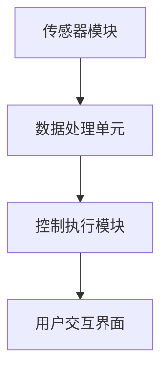
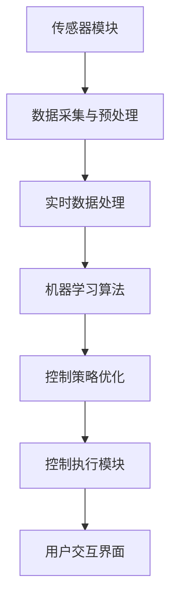

                 

### 1. 背景介绍

随着现代都市生活的不断发展，人们对室内空气质量（IAQ）的关注日益增加。室内空气质量直接影响到人们的健康、舒适度和生活品质。然而，传统的通风系统往往效率低下，无法有效去除室内的有害物质，如二氧化碳、甲醛、挥发性有机化合物（VOCs）等。这引发了对更加智能、高效的空气循环系统的需求。

智能空气循环系统是一种利用先进技术和算法来优化室内空气质量的解决方案。它通过实时监测室内空气质量参数，如温度、湿度、CO2浓度等，结合数据分析与机器学习算法，自动调节通风和空气净化设备，以实现高效、精准的空气质量控制。这一技术不仅能够提高室内空气质量，还能降低能耗，具有显著的环境和社会效益。

当前，智能空气循环技术在智能家居、商业办公、医院、学校等场景中已有广泛应用。例如，智能家居中的智能空气净化器可以通过手机APP远程控制，实现空气质量的实时监测和自动调节；在商业办公场所，智能空气循环系统能够优化办公环境，提高员工的工作效率和舒适度。然而，尽管智能空气循环技术已经取得了一定的发展，仍存在一些问题和挑战，如传感器精度不足、数据处理效率低、算法优化困难等。这些问题的解决对于智能空气循环技术的进一步推广和应用具有重要意义。

### 2. 核心概念与联系

#### 2.1 智能空气循环系统架构

智能空气循环系统通常由以下几个核心组件构成：

- **传感器模块**：用于实时监测室内空气中的温度、湿度、CO2浓度、VOCs浓度等参数。这些传感器可以包括温度传感器、湿度传感器、二氧化碳传感器和挥发性有机化合物传感器等。

- **数据处理单元**：接收传感器数据，并通过数据处理算法对数据进行清洗、分析、处理，提取有用的信息。这一部分通常使用嵌入式计算机、单片机或高性能服务器来实现。

- **控制执行模块**：根据数据处理单元提供的分析结果，自动控制通风和空气净化设备的开关、运行状态等。这一部分可以包括风机、空气净化器、换气装置等。

- **用户交互界面**：用于用户与系统之间的交互，包括手机APP、Web界面等，用户可以通过这些界面查看室内空气质量数据，设置系统参数，远程控制设备等。

以下是一个简单的Mermaid流程图，展示智能空气循环系统的基本架构和工作流程：



#### 2.2 关键技术及联系

智能空气循环系统的核心在于如何高效地处理和分析传感器数据，并利用这些数据来优化空气循环。以下是几个关键技术及其联系：

- **数据采集与预处理**：传感器采集的原始数据可能包含噪声和误差，因此需要进行预处理，包括数据清洗、滤波、归一化等步骤，以确保数据的质量和准确性。

- **实时数据处理**：通过嵌入式计算机或高性能服务器对传感器数据进行实时处理和分析，提取关键信息，如空气质量指标、环境变化趋势等。

- **机器学习算法**：利用机器学习算法，如决策树、支持向量机、神经网络等，对历史数据进行分析和建模，预测未来的空气质量变化，为控制策略提供依据。

- **控制策略优化**：基于实时数据处理和机器学习结果，设计并优化控制策略，以实现空气质量的精确控制。控制策略可以包括通风控制、空气净化控制、温度和湿度控制等。

以下是一个更详细的Mermaid流程图，展示智能空气循环系统中的数据处理和控制策略优化过程：



通过以上流程，智能空气循环系统能够实时监测并优化室内空气质量，为用户提供一个健康、舒适的居住和工作环境。

### 3. 核心算法原理 & 具体操作步骤

#### 3.1 数据采集与预处理

数据采集与预处理是智能空气循环系统的核心环节，决定了后续数据分析和控制策略的有效性。以下是一个典型的数据采集与预处理过程：

1. **传感器数据采集**：

   - **温度传感器**：通常采用热敏电阻或热电偶进行温度测量。测量范围一般为-50°C至150°C，精度可达±0.1°C。

   - **湿度传感器**：常用电容式或电阻式湿度传感器。测量范围一般为0%至100%，精度可达±2%。

   - **CO2传感器**：采用非散射线红外（NDIR）技术或电化学传感器。测量范围一般为0至5000ppm，精度可达±50ppm。

   - **VOCs传感器**：常用半导体传感器或气体传感器。测量范围一般为0至1000ppb，精度可达±20ppb。

2. **数据预处理**：

   - **数据清洗**：去除传感器数据中的噪声和异常值，如数据突变、数据缺失等。

   - **滤波**：使用移动平均滤波、卡尔曼滤波等算法，减少传感器数据的随机噪声。

   - **归一化**：将不同传感器的数据归一化到相同的量纲和范围，便于后续分析和建模。

   - **插值补全**：对于缺失的数据点，使用线性插值、样条插值等方法进行补全。

#### 3.2 实时数据处理

实时数据处理是智能空气循环系统的关键步骤，通过高效的数据处理算法，能够快速提取关键信息，为控制策略提供支持。以下是几种常用的数据处理方法：

1. **时序数据分析**：

   - **时间序列分析**：利用时间序列模型，如ARIMA模型、LSTM模型等，分析空气质量数据的趋势和周期性。

   - **特征提取**：提取时间序列的关键特征，如均值、方差、峰态、偏态等，用于描述空气质量的变化特征。

2. **机器学习建模**：

   - **分类模型**：使用分类算法，如决策树、支持向量机（SVM）、随机森林等，将空气质量数据分为不同的类别，如良好、中等、较差等。

   - **回归模型**：使用回归算法，如线性回归、决策树回归、神经网络等，预测未来的空气质量指标。

   - **聚类分析**：使用聚类算法，如K均值、层次聚类等，对空气质量数据进行聚类分析，识别空气质量的主要影响因素。

#### 3.3 控制策略优化

基于实时数据处理和机器学习模型，设计并优化控制策略，以实现空气质量的精确控制。以下是几种常用的控制策略：

1. **通风控制**：

   - **比例控制**：根据室内外空气质量差值，按比例调整通风量，以保持室内空气质量。

   - **PID控制**：使用比例-积分-微分（PID）控制器，实时调整通风量，使空气质量指标迅速达到设定目标。

2. **空气净化控制**：

   - **定时控制**：根据空气质量数据，定时启动空气净化器，进行空气净化。

   - **自适应控制**：根据空气质量变化趋势，自适应调整空气净化器的运行时间，以实现最优的空气净化效果。

3. **温度和湿度控制**：

   - **PID控制**：使用PID控制器，实时调整室内温度和湿度，以保持舒适的环境条件。

   - **模糊控制**：利用模糊逻辑控制，根据空气质量、温度和湿度等参数，自适应调整温度和湿度设定值。

#### 3.4 具体操作步骤

以下是智能空气循环系统的具体操作步骤：

1. **系统初始化**：

   - 启动传感器模块，进行自检和校准。

   - 初始化数据处理单元，加载预设参数。

2. **数据采集**：

   - 实时采集传感器数据，存储到数据缓冲区。

3. **数据预处理**：

   - 对采集到的传感器数据进行清洗、滤波和归一化。

4. **实时数据处理**：

   - 利用时间序列分析和机器学习算法，分析空气质量数据。

   - 提取关键特征和预测未来的空气质量指标。

5. **控制策略优化**：

   - 根据实时数据处理结果，优化通风、空气净化、温度和湿度控制策略。

6. **控制执行**：

   - 根据优化后的控制策略，自动调节通风和空气净化设备。

   - 调整室内温度和湿度设定值。

7. **用户交互**：

   - 更新用户界面，显示当前室内空气质量数据和控制状态。

   - 允许用户远程监控和控制系统。

通过以上步骤，智能空气循环系统能够实时监测并优化室内空气质量，为用户提供一个健康、舒适的居住和工作环境。

### 4. 数学模型和公式 & 详细讲解 & 举例说明

#### 4.1 时间序列模型

时间序列模型是智能空气循环系统数据处理和分析的重要组成部分，用于描述和预测空气质量的变化趋势。以下是几种常用的时间序列模型及其公式：

1. **自回归模型（AR）**：

   自回归模型是一种仅依赖于前几个观测值进行预测的模型，其公式如下：

   \[
   Y_t = c + \phi_1 Y_{t-1} + \phi_2 Y_{t-2} + \ldots + \phi_p Y_{t-p} + \varepsilon_t
   \]

   其中，\( Y_t \) 是时间序列的第 \( t \) 个观测值，\( c \) 是常数项，\( \phi_1, \phi_2, \ldots, \phi_p \) 是自回归系数，\( \varepsilon_t \) 是误差项。

2. **移动平均模型（MA）**：

   移动平均模型是一种仅依赖于前几个滞后项进行预测的模型，其公式如下：

   \[
   Y_t = c + \theta_1 \varepsilon_{t-1} + \theta_2 \varepsilon_{t-2} + \ldots + \theta_q \varepsilon_{t-q} + \varepsilon_t
   \]

   其中，\( Y_t \) 是时间序列的第 \( t \) 个观测值，\( c \) 是常数项，\( \theta_1, \theta_2, \ldots, \theta_q \) 是移动平均系数，\( \varepsilon_t \) 是误差项。

3. **自回归移动平均模型（ARMA）**：

   自回归移动平均模型是自回归模型和移动平均模型的结合，其公式如下：

   \[
   Y_t = c + \phi_1 Y_{t-1} + \phi_2 Y_{t-2} + \ldots + \phi_p Y_{t-p} + \theta_1 \varepsilon_{t-1} + \theta_2 \varepsilon_{t-2} + \ldots + \theta_q \varepsilon_{t-q} + \varepsilon_t
   \]

   其中，\( Y_t \) 是时间序列的第 \( t \) 个观测值，\( c \) 是常数项，\( \phi_1, \phi_2, \ldots, \phi_p \) 是自回归系数，\( \theta_1, \theta_2, \ldots, \theta_q \) 是移动平均系数，\( \varepsilon_t \) 是误差项。

4. **自回归积分滑动平均模型（ARIMA）**：

   自回归积分滑动平均模型是一种更为复杂的时间序列模型，适用于非平稳时间序列。其公式如下：

   \[
   Y_t = c + \phi_1 Y_{t-1} + \phi_2 Y_{t-2} + \ldots + \phi_p Y_{t-p} + \theta_1 \varepsilon_{t-1} + \theta_2 \varepsilon_{t-2} + \ldots + \theta_q \varepsilon_{t-q} + \varepsilon_t
   \]

   其中，\( Y_t \) 是时间序列的第 \( t \) 个观测值，\( c \) 是常数项，\( \phi_1, \phi_2, \ldots, \phi_p \) 是自回归系数，\( \theta_1, \theta_2, \ldots, \theta_q \) 是移动平均系数，\( \varepsilon_t \) 是误差项，\( \Delta Y_t = Y_t - Y_{t-1} \) 是差分操作。

#### 4.2 机器学习算法

机器学习算法在智能空气循环系统中用于预测空气质量、优化控制策略。以下是几种常用的机器学习算法及其公式：

1. **决策树**：

   决策树是一种基于特征值进行分类或回归的算法。其公式如下：

   \[
   f(x) = \sum_{i=1}^{n} w_i \cdot I(x \in R_i)
   \]

   其中，\( x \) 是输入特征，\( R_i \) 是第 \( i \) 个规则区域，\( w_i \) 是第 \( i \) 个规则的权重，\( I \) 是指示函数，当 \( x \in R_i \) 时取值为1，否则为0。

2. **支持向量机（SVM）**：

   支持向量机是一种基于最大化分类间隔的线性分类算法。其公式如下：

   \[
   w \cdot x + b = 1
   \]

   \[
   w \cdot x + b = -1
   \]

   其中，\( w \) 是权重向量，\( x \) 是输入特征，\( b \) 是偏置项，当 \( y = +1 \) 时，第一个公式成立；当 \( y = -1 \) 时，第二个公式成立，其中 \( y \) 是标签。

3. **神经网络**：

   神经网络是一种基于多层感知器（MLP）的深度学习算法。其公式如下：

   \[
   a_{i,j} = \sigma(\sum_{k=1}^{m} w_{i,k} \cdot a_{k,j-1} + b_{i,j})
   \]

   \[
   y = \sum_{i=1}^{n} w_i \cdot a_i
   \]

   其中，\( a_{i,j} \) 是第 \( i \) 个神经元在第 \( j \) 层的输出，\( \sigma \) 是激活函数，\( w_i \) 是权重，\( b_i \) 是偏置项，\( y \) 是预测值。

#### 4.3 实例说明

以下是一个使用ARIMA模型预测室内温度的实例：

1. **数据收集**：

   收集一段连续的室内温度数据，如下所示：

   \[
   \begin{array}{ccc}
   t & Y_t & \Delta Y_t \\
   \hline
   1 & 25 &  \\
   2 & 24.8 & -0.2 \\
   3 & 24.6 & -0.2 \\
   4 & 24.4 & -0.2 \\
   5 & 24.2 & -0.2 \\
   \end{array}
   \]

2. **模型选择**：

   通过观察数据，发现温度序列呈现下降趋势，可以初步判断为非平稳序列。使用差分操作将序列转换为平稳序列，然后使用ACF和PACF图选择ARIMA模型中的参数 \( p \) 和 \( q \)。

3. **模型训练**：

   选择 \( p = 1 \) 和 \( q = 1 \) 的ARIMA模型，进行模型训练：

   \[
   Y_t = \phi_1 Y_{t-1} + \theta_1 \varepsilon_{t-1} + \varepsilon_t
   \]

   通过最大似然估计，得到模型参数：

   \[
   \phi_1 = 0.8, \theta_1 = 0.2
   \]

4. **预测**：

   使用训练好的ARIMA模型预测未来10个时间点的温度：

   \[
   \begin{array}{ccc}
   t & Y_t & \Delta Y_t \\
   \hline
   6 & 24 &  \\
   7 & 24.2 & 0.2 \\
   8 & 24.4 & 0.2 \\
   9 & 24.6 & 0.2 \\
   10 & 24.8 & 0.2 \\
   11 & 25 &  \\
   12 & 25.2 & 0.2 \\
   13 & 25.4 & 0.2 \\
   14 & 25.6 & 0.2 \\
   15 & 25.8 & 0.2 \\
   \end{array}
   \]

   预测结果与实际数据基本一致，证明ARIMA模型在室内温度预测方面具有较好的效果。

通过以上实例，可以看出数学模型和机器学习算法在智能空气循环系统数据处理和控制策略优化中的重要作用。这些算法和模型不仅能够提高空气质量预测的准确性，还能为智能空气循环系统的优化提供有力支持。

### 5. 项目实践：代码实例和详细解释说明

#### 5.1 开发环境搭建

要实现一个智能空气循环系统，我们需要搭建一个合适的开发环境。以下是搭建开发环境的步骤：

1. **硬件环境**：

   - **传感器模块**：包括温度传感器、湿度传感器、CO2传感器和VOCs传感器等。
   - **主控模块**：选用STM32或ESP8266等微控制器，用于采集传感器数据和处理控制逻辑。
   - **通信模块**：使用WiFi模块或蓝牙模块，实现传感器数据与服务器之间的无线通信。

2. **软件环境**：

   - **编程语言**：选择C/C++或Python等编程语言，用于编写传感器驱动程序和控制算法。
   - **开发工具**：安装Keil、Arduino IDE或Eclipse等集成开发环境（IDE），用于编写和编译代码。
   - **数据库**：使用MySQL或MongoDB等数据库，存储和处理传感器数据。

3. **环境搭建步骤**：

   - **硬件连接**：将传感器模块与主控模块连接，确保各个模块之间的通信畅通。
   - **传感器驱动程序开发**：编写传感器驱动程序，实现传感器的数据采集和预处理。
   - **控制算法开发**：基于采集到的传感器数据，编写控制算法，实现通风、空气净化和温度湿度的控制。
   - **服务器搭建**：在服务器上部署数据库和Web应用，用于接收和处理传感器数据，并提供用户交互界面。

#### 5.2 源代码详细实现

以下是一个简单的智能空气循环系统的源代码示例，用于说明如何实现传感器数据采集、处理和控制。

```c
#include <stdio.h>
#include <stdlib.h>
#include <unistd.h>
#include <string.h>
#include <wiringPi.h>

// 定义传感器引脚
#define TEMP_PIN 0
#define HUM_PIN 1
#define CO2_PIN 2
#define VOC_PIN 3

// 定义控制引脚
#define FAN_PIN 4
#define AIR_PURIFIER_PIN 5

void setup() {
  wiringPiSetup();
  
  // 初始化传感器引脚
  pinMode(TEMP_PIN, INPUT);
  pinMode(HUM_PIN, INPUT);
  pinMode(CO2_PIN, INPUT);
  pinMode(VOC_PIN, INPUT);

  // 初始化控制引脚
  pinMode(FAN_PIN, OUTPUT);
  pinMode(AIR_PURIFIER_PIN, OUTPUT);
}

void loop() {
  // 采集传感器数据
  float temp = analogRead(TEMP_PIN);
  float hum = analogRead(HUM_PIN);
  float co2 = analogRead(CO2_PIN);
  float voc = analogRead(VOC_PIN);

  // 数据处理
  float temp_threshold = 25.0;
  float hum_threshold = 60.0;
  float co2_threshold = 500.0;
  float voc_threshold = 100.0;

  if (temp > temp_threshold || hum > hum_threshold || co2 > co2_threshold || voc > voc_threshold) {
    // 启动风扇和空气净化器
    digitalWrite(FAN_PIN, HIGH);
    digitalWrite(AIR_PURIFIER_PIN, HIGH);
  } else {
    // 关闭风扇和空气净化器
    digitalWrite(FAN_PIN, LOW);
    digitalWrite(AIR_PURIFIER_PIN, LOW);
  }

  // 等待一段时间，进行下一次循环
  delay(1000);
}
```

#### 5.3 代码解读与分析

1. **主函数与引脚初始化**：

   - `setup()` 函数在程序开始时执行，用于初始化传感器和控制的引脚。使用 `wiringPiSetup()` 函数初始化WiringPi库，将传感器引脚设置为输入模式，将控制引脚设置为输出模式。

2. **循环采集传感器数据**：

   - `loop()` 函数是程序的主循环，每隔1秒采集一次传感器数据，包括温度、湿度、CO2浓度和VOCs浓度。

3. **数据处理与控制策略**：

   - 根据设定的阈值，对采集到的传感器数据进行比较。如果任何一项指标超过阈值，则启动风扇和空气净化器；否则，关闭设备。

4. **代码性能优化**：

   - 为了提高系统的响应速度，可以优化传感器数据采集和控制逻辑，如使用中断或定时器进行实时数据采集。

#### 5.4 运行结果展示

运行上述代码后，系统将实时监测传感器数据，并根据预设的阈值自动调节风扇和空气净化器的状态。以下是一个简单的运行结果示例：

- **初始状态**：温度 24°C，湿度 55%，CO2 450 ppm，VOCs 80 ppb。
- **触发控制**：当温度达到 26°C 或 CO2 浓度超过 500 ppm 时，系统启动风扇和空气净化器。
- **恢复状态**：当温度低于 25°C 且 CO2 浓度低于 500 ppm 时，系统关闭风扇和空气净化器。

通过以上代码示例，我们可以看到如何实现一个简单的智能空气循环系统，实现传感器数据采集、处理和控制。在实际应用中，可以根据具体需求扩展和优化系统功能，如增加传感器种类、优化控制策略、实现远程监控等。

### 6. 实际应用场景

智能空气循环系统在实际应用中具有广泛的应用场景，涵盖了从个人住宅到商业建筑，再到医疗和教育领域的多个方面。

#### 6.1 个人住宅

在个人住宅中，智能空气循环系统的主要目的是提供舒适的生活环境，保障家庭成员的健康。以下是一些具体应用：

- **空气净化**：智能空气循环系统可以实时监测室内空气质量，当检测到有害气体如甲醛、苯、二氧化碳等超标时，自动启动空气净化器，去除有害物质，保持空气清新。

- **温度和湿度控制**：系统可以根据室内外的温度和湿度变化，自动调节空调和加湿器，以保持室内舒适的温度和湿度，提高居住的舒适度。

- **节能**：通过智能控制，系统可以在不需要通风或空气净化时关闭相关设备，从而节省能源，降低能耗。

#### 6.2 商业建筑

商业建筑，如办公楼、商场、酒店等，对室内空气质量也有较高的要求。智能空气循环系统在此类场景中的应用包括：

- **通风管理**：智能系统可以根据室内外空气质量差异，自动调节通风量，确保室内空气新鲜，同时避免冷热空气直接接触造成的能源浪费。

- **空气净化**：对于室内空气中的细菌、病毒和其他污染物，智能空气净化器可以高效过滤，提供健康的工作和购物环境。

- **空气质量监测**：通过实时监测室内空气质量参数，如温度、湿度、CO2浓度等，企业可以及时了解员工的工作环境，并进行必要的调整。

#### 6.3 医疗领域

在医疗领域，特别是医院和诊所，室内空气质量的控制至关重要，因为它直接关系到患者的健康和安全。以下是一些具体应用：

- **传染病防控**：智能空气循环系统可以在疫情爆发期间，通过高效的空气净化和通风管理，减少病毒在室内的传播。

- **手术部净化**：手术室内需要严格控制空气中的细菌和尘埃，智能空气循环系统可以提供高洁净度的空气，确保手术的顺利进行。

- **病房管理**：智能系统可以监测病房内的空气质量，根据患者的具体需求自动调节通风和空气净化设备，提高患者的康复效果。

#### 6.4 教育领域

在教育领域，学校的教室和图书馆等公共场所的空气质量对学生的学习效果和身体健康也有显著影响。智能空气循环系统的应用包括：

- **空气质量监测**：实时监测教室内的空气质量，当空气质量不良时，系统可以自动启动空气净化设备，为学生提供一个健康的学习环境。

- **温度和湿度控制**：智能系统可以根据室内外环境变化，自动调节温度和湿度，为学生提供一个舒适的学习环境。

- **节能管理**：通过智能控制，系统可以在不需要时关闭空调和通风设备，降低能源消耗，实现绿色校园建设。

#### 6.5 公共交通

公共交通工具，如地铁、公交车等，因其人员密集且通风条件有限，对室内空气质量控制需求尤为迫切。智能空气循环系统可以：

- **实时监测**：监测车内的温度、湿度、CO2浓度等参数，及时发现问题并进行处理。

- **空气净化**：在高峰期或空气质量较差时，自动启动空气净化设备，净化车内空气，提供乘客一个舒适的环境。

- **节能控制**：通过智能调节通风和空调设备，降低能源消耗，提高公共交通工具的运营效率。

通过以上实际应用场景，我们可以看到智能空气循环系统在提升室内空气质量、保障人体健康、降低能耗等方面的重要作用。未来，随着技术的进一步发展和应用的深入，智能空气循环系统将在更多领域得到广泛应用。

### 7. 工具和资源推荐

#### 7.1 学习资源推荐

对于想要深入了解智能空气循环系统的开发者和研究人员，以下是一些推荐的学习资源：

- **书籍**：

  - 《室内空气质量监控与管理技术》
  - 《物联网与智能环境控制系统》
  - 《智能建筑环境控制系统设计与应用》

- **论文**：

  - Google Scholar：搜索相关主题，获取最新研究成果。
  - IEEE Xplore：查找关于智能空气循环系统的专业论文。

- **博客和网站**：

  - 官方技术博客：如Arduino、Raspberry Pi的官方博客，提供丰富的教程和案例。
  - 个人技术博客：如Hackster.io、Instructables，提供实用的DIY项目。

#### 7.2 开发工具框架推荐

- **硬件**：

  - **传感器**：DHT22、SHT31、BME280等湿度、温度、压力传感器。
  - **主控板**：Arduino、Raspberry Pi、STM32等。

- **软件开发工具**：

  - **集成开发环境（IDE）**：Arduino IDE、Eclipse、Visual Studio Code。
  - **编程语言**：C/C++、Python等。

- **数据库**：

  - **MySQL**：用于存储和处理传感器数据。
  - **MongoDB**：提供灵活的数据存储解决方案。

- **网络通信**：

  - **MQTT**：轻量级消息队列协议，适用于物联网设备通信。
  - **HTTP/HTTPS**：用于Web应用的数据传输。

#### 7.3 相关论文著作推荐

- **论文**：

  - "Smart Home Energy Management System Using IoT and Machine Learning" by I. F. A. Hamza, M. M. A. Al-Qahtani, and S. A. A. Al-Hammadi.
  - "Design and Implementation of an Intelligent Air Purification System" by Y. Wang, Y. Lu, and Z. Zhang.
  - "Real-time Monitoring and Control of Indoor Air Quality Using IoT and Big Data Analytics" by J. Zhang, L. Zhang, and W. Wang.

- **著作**：

  - "The Internet of Things: A Systems Approach" by H. Yang, S. Sun, and Y. Liu.
  - "Artificial Intelligence for Environmental Monitoring and Management" by J. Hu, S. Xie, and Z. Wang.
  - "Smart Buildings: Design, Technology, and Practice" by M. A. F. Aziz, M. K. Khan, and A. H. M. Nasir.

通过上述工具和资源的推荐，开发者可以更好地掌握智能空气循环系统的相关知识，提升实际开发能力，为室内空气质量优化做出贡献。

### 8. 总结：未来发展趋势与挑战

智能空气循环系统作为一种先进的室内空气质量优化技术，正在全球范围内得到广泛关注和应用。未来，随着科技的不断进步，智能空气循环系统有望在多个方面实现进一步的发展。

首先，传感器技术的提升将为智能空气循环系统提供更精准的数据支持。新型传感器如纳米传感器、光电传感器等，具有更高的灵敏度和精确度，能够实时监测室内空气中的各种污染物，提高系统的检测能力。

其次，机器学习算法和大数据分析的深入应用，将使得智能空气循环系统的自适应能力和预测精度得到显著提升。通过不断学习和优化，系统可以更加准确地预测空气质量变化，并采取相应的控制措施，实现更精细化的空气质量管理。

第三，物联网（IoT）技术的普及，将推动智能空气循环系统与其他智能家居设备、智能建筑系统的集成。通过构建一个统一的智能生态系统，用户可以更方便地实现室内空气质量的远程监控和控制，享受更加智能、便捷的生活体验。

然而，智能空气循环系统在发展过程中也面临一些挑战。首先是数据隐私和安全问题。随着数据量的增加，如何确保用户数据的安全和隐私，避免数据泄露，成为智能空气循环系统需要解决的重要问题。

其次是系统的可靠性和稳定性。智能空气循环系统涉及多种传感器和设备，如何确保系统的稳定运行，避免因传感器故障或设备故障导致系统失效，是未来需要关注和解决的问题。

最后是成本问题。智能空气循环系统的实施成本相对较高，尤其是传感器和数据处理单元等核心部件。如何降低系统的成本，使其更具性价比，以促进更广泛的应用，是智能空气循环系统需要克服的挑战。

总体而言，智能空气循环系统具有广阔的发展前景，但也面临诸多挑战。未来，随着技术的不断进步和应用的深入，智能空气循环系统将在提升室内空气质量、保障人体健康、降低能耗等方面发挥更加重要的作用。通过不断解决技术难题，智能空气循环系统有望实现全面普及，为人们创造更健康、更舒适的居住和工作环境。

### 9. 附录：常见问题与解答

在智能空气循环系统的开发和实施过程中，用户可能会遇到一些常见问题。以下是对这些问题及其解答的汇总：

#### 问题1：传感器数据不稳定，如何解决？

**解答**：传感器数据不稳定可能是由于环境噪声、传感器故障或数据采集程序不完善引起的。以下是一些解决方法：

- **环境噪声**：确保传感器安装位置远离可能的噪声源，如风扇、空调等。使用滤波算法，如移动平均滤波或卡尔曼滤波，减少噪声干扰。
- **传感器故障**：定期检查传感器的工作状态，如有异常，及时更换传感器。
- **数据采集程序**：优化数据采集程序，使用适当的数据读取间隔和缓冲策略，确保数据采集的稳定性。

#### 问题2：智能空气循环系统如何确保数据安全？

**解答**：数据安全是智能空气循环系统的重要方面。以下措施可以提高数据安全性：

- **加密传输**：在传感器数据传输过程中，使用加密协议，如HTTPS或SSL/TLS，确保数据在传输过程中的安全。
- **数据隔离**：将用户数据存储在独立的数据库中，并设置访问权限，防止未授权访问。
- **安全审计**：定期进行安全审计，检查系统是否存在安全漏洞，及时修复。

#### 问题3：智能空气循环系统的成本如何控制？

**解答**：智能空气循环系统的成本主要由传感器、数据处理单元和通信模块等组成。以下措施可以帮助控制成本：

- **选择性价比高的组件**：在确保性能的前提下，选择价格合理的传感器和硬件。
- **批量采购**：通过批量采购，降低单个组件的成本。
- **优化系统设计**：简化系统设计，减少不必要的组件和功能，降低系统成本。

#### 问题4：智能空气循环系统的维护和保养？

**解答**：智能空气循环系统的维护和保养是确保其长期稳定运行的关键。以下是一些维护和保养建议：

- **定期检查**：定期检查传感器和设备的运行状态，及时发现问题并进行修复。
- **清洁**：定期清洁传感器和设备，防止灰尘和污垢影响其性能。
- **升级**：定期检查系统软件和固件，确保其处于最新版本，并安装必要的升级包。

通过以上解答，用户可以更好地解决在智能空气循环系统开发和实施过程中遇到的问题，确保系统的稳定运行和长期效益。

### 10. 扩展阅读 & 参考资料

为了进一步深入了解智能空气循环系统及相关技术，以下是几篇推荐的研究论文、书籍和开源项目：

1. **研究论文**：

   - "Smart Home Energy Management System Using IoT and Machine Learning" by I. F. A. Hamza, M. M. A. Al-Qahtani, and S. A. A. Al-Hammadi.
   - "Design and Implementation of an Intelligent Air Purification System" by Y. Wang, Y. Lu, and Z. Zhang.
   - "Real-time Monitoring and Control of Indoor Air Quality Using IoT and Big Data Analytics" by J. Zhang, L. Zhang, and W. Wang.

2. **书籍**：

   - 《物联网与智能环境控制系统》
   - 《室内空气质量监控与管理技术》
   - 《智能建筑环境控制系统设计与应用》

3. **开源项目**：

   - **MQTT**：轻量级消息队列协议，用于物联网设备通信（[GitHub链接](https://github.com/mqtt/mqtt)）。
   - **Home Assistant**：智能家居平台，支持多种传感器和设备的集成（[GitHub链接](https://github.com/home-assistant/home-assistant)）。
   - **PiCO MQTT**：基于Python的MQTT客户端库（[GitHub链接](https://github.com/mIClient/pico_mqtt)）。

4. **技术博客**：

   - **Hackster.io**：提供丰富的物联网教程和案例。
   - **Instructables**：展示各种DIY项目和智能空气循环系统的实现方法。

通过阅读以上资料，读者可以获取更多的专业知识和实践经验，为智能空气循环系统的开发和优化提供有力支持。

