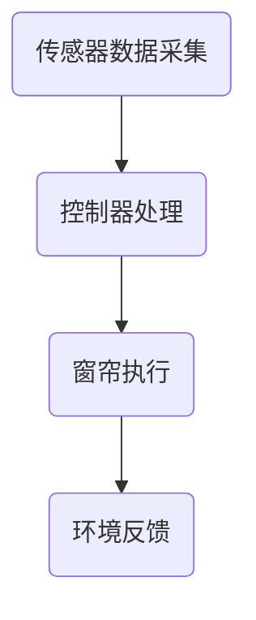

                 

### 文章标题

智能窗帘创业：自动化家居的又一革新

> 关键词：智能窗帘、自动化家居、创业、技术革新

> 摘要：本文将探讨智能窗帘在自动化家居领域的应用及其创业潜力。通过深入分析其核心技术、算法原理、数学模型及实际应用场景，本文旨在为创业者提供有价值的指导，并探讨未来发展趋势与挑战。

### 1. 背景介绍

近年来，随着物联网技术的飞速发展，智能家居逐渐成为家居领域的新趋势。智能窗帘作为智能家居的重要组成部分，不仅能够实现自动开合，提高家居生活的便利性，还可以通过传感器和环境数据进行智能调控，提供更加舒适和节能的居住环境。因此，智能窗帘的创业项目备受瞩目。

目前，智能窗帘市场主要被国内外大型科技公司和创新型创业公司所占据。其中，华为、小米、苹果等科技公司凭借其强大的技术实力和市场影响力，在智能窗帘领域占据了一定的市场份额。同时，一些创业公司如智能家居领域的独角兽公司Nest Labs，也凭借其创新技术和用户体验在市场上取得了显著成绩。

智能窗帘创业项目具有广阔的市场前景，一方面，随着消费者对智能家居的需求不断增加，智能窗帘的市场需求也在逐年上升；另一方面，智能窗帘技术不断进步，价格逐渐亲民，为创业者提供了更多的市场机会。

### 2. 核心概念与联系

#### 2.1 智能窗帘的定义与工作原理

智能窗帘是一种集成了传感器、控制器和执行器的家居设备，通过智能系统实现对窗帘的自动化控制。其基本工作原理如下：

1. **传感器**：智能窗帘通常配备有光线传感器、温度传感器和湿度传感器等，用于实时监测室内外环境变化。

2. **控制器**：控制器是智能窗帘的核心，负责接收传感器数据，并根据预设的算法进行逻辑判断，控制窗帘的开启或关闭。

3. **执行器**：执行器是窗帘的实际操作装置，包括电机、绳索等，根据控制器的指令进行窗帘的开合。

#### 2.2 智能窗帘的架构

智能窗帘的架构主要包括以下几个部分：

1. **硬件层**：包括传感器、控制器和执行器。
2. **软件层**：包括操作系统、应用程序和通信协议。
3. **网络层**：通过Wi-Fi、蓝牙或其他网络协议实现与外部设备的连接。

#### 2.3 Mermaid 流程图

以下是一个简化的智能窗帘系统流程图，用于展示传感器数据采集、控制器处理和窗帘执行的过程。



### 3. 核心算法原理 & 具体操作步骤

智能窗帘的核心算法主要涉及环境数据的采集、处理和控制。以下是一个基本的算法框架，用于说明智能窗帘的控制过程。

#### 3.1 环境数据采集

智能窗帘通过传感器实时采集室内外环境数据，包括光线、温度和湿度等。具体步骤如下：

1. **光线传感器**：测量室内外光照强度，通常使用光敏电阻或光敏二极管。
2. **温度传感器**：测量室内外温度，常用的有热电偶、热敏电阻等。
3. **湿度传感器**：测量室内外湿度，常用的有电容式、电阻式等。

#### 3.2 数据处理

控制器接收到传感器数据后，根据预设的算法进行数据处理，包括数据过滤、分析和决策。具体步骤如下：

1. **数据过滤**：去除传感器数据中的噪声和异常值，确保数据的准确性。
2. **数据分析**：根据环境数据，分析室内外的舒适度，例如光线的明亮度、温度的适宜性等。
3. **决策**：根据分析结果，决定窗帘的开合状态，例如在阳光强烈时关闭窗帘以避免过热，在夜间自动打开窗帘以增加室内光线。

#### 3.3 窗帘控制

根据控制器的决策，执行器进行窗帘的开合操作。具体步骤如下：

1. **电机控制**：使用电机驱动窗帘的开合，根据控制器的指令调整电机的转速和方向。
2. **绳索控制**：通过绳索系统控制窗帘的移动，通常与电机配合使用。

### 4. 数学模型和公式 & 详细讲解 & 举例说明

智能窗帘的算法设计通常需要基于一定的数学模型和公式。以下是一个简单的例子，用于说明如何通过数学模型计算窗帘的最佳开合时间。

#### 4.1 光线舒适度模型

光线舒适度（LC）是衡量室内光线质量的一个重要指标。假设光线舒适度与光照强度（I）和窗帘开启角度（θ）之间存在如下关系：

$$LC = \frac{I^2}{\theta}$$

其中，I为光照强度，θ为窗帘开启角度。

#### 4.2 窗帘最佳开合时间计算

假设我们希望在一个特定时间段内，使室内光线舒适度保持在一个最优范围内。假设最优光线舒适度范围为 $[LC_{\text{min}}, LC_{\text{max}}]$，光照强度为 $I(t)$，窗帘开启角度为 $θ(t)$。我们可以通过以下步骤计算窗帘的最佳开合时间：

1. **光照强度预测**：根据历史数据和当前时间，预测未来一段时间内的光照强度。
2. **窗帘开合策略**：根据光照强度预测结果，调整窗帘开启角度，使光线舒适度保持在最优范围内。
3. **最佳开合时间计算**：通过优化算法，计算窗帘的最佳开合时间。

以下是一个简单的例子：

假设我们希望在一个从早晨7点到晚上10点的时间段内，使室内光线舒适度保持在 $[30, 100]$。假设光照强度随时间的变化如下：

$$I(t) = 10 \sin(\frac{2\pi t}{12}) + 30$$

我们可以通过以下步骤计算窗帘的最佳开合时间：

1. **光照强度预测**：预测从早晨7点到晚上10点的时间段内光照强度的变化。
2. **窗帘开合策略**：根据光照强度预测结果，调整窗帘开启角度，确保光线舒适度在 $[30, 100]$ 范围内。
3. **最佳开合时间计算**：通过优化算法，找到窗帘的最佳开合时间。

具体计算过程如下：

- **光照强度预测**：根据历史数据和当前时间，预测未来一段时间内的光照强度。例如，预测早晨7点的光照强度为 $I(7) = 10 \sin(\frac{2\pi \cdot 7}{12}) + 30 \approx 45$。
- **窗帘开合策略**：根据预测的光照强度，调整窗帘开启角度。例如，为使早晨7点的光线舒适度达到最优，窗帘开启角度应设置为 $θ(7) = \sqrt{\frac{I(7)}{LC_{\text{max}}}} \approx \sqrt{\frac{45}{100}} \approx 0.7$。
- **最佳开合时间计算**：通过优化算法，找到窗帘的最佳开合时间。例如，我们可以使用动态规划算法，找到使得光线舒适度在 $[30, 100]$ 范围内的最佳开合时间。

### 5. 项目实践：代码实例和详细解释说明

在本节中，我们将通过一个简单的智能窗帘项目实例，详细解释智能窗帘的开发过程，包括环境搭建、代码实现、解读和分析以及运行结果展示。

#### 5.1 开发环境搭建

为了开发智能窗帘项目，我们需要准备以下开发环境和工具：

1. **硬件**：智能窗帘控制器（例如Arduino）、传感器（例如光线传感器、温度传感器和湿度传感器）和执行器（例如电机驱动模块）。
2. **软件**：开发环境（例如Arduino IDE）、编程语言（例如C/C++或Python）和仿真工具（例如模拟器或实际硬件）。

#### 5.2 源代码详细实现

以下是一个简单的智能窗帘项目的源代码实现，用于演示窗帘的自动开合控制。

```cpp
// 智能窗帘控制程序
#include <Arduino.h>

// 定义传感器和执行器接口
const int lightSensorPin = A0; // 光线传感器接口
const int motorPin = 9;       // 电机驱动接口

// 初始化传感器和执行器
void setup() {
    pinMode(lightSensorPin, INPUT);
    pinMode(motorPin, OUTPUT);
}

// 主循环函数
void loop() {
    // 读取光线传感器数据
    int lightValue = analogRead(lightSensorPin);

    // 根据光线传感器数据控制窗帘
    if (lightValue < 300) {
        // 光线较弱，关闭窗帘
        analogWrite(motorPin, 255); // 全速关闭窗帘
    } else {
        // 光线较强，打开窗帘
        analogWrite(motorPin, 0);   // 停止窗帘
    }

    // 延时一段时间，等待下一次循环
    delay(1000);
}
```

#### 5.3 代码解读与分析

上述代码实现了一个简单的智能窗帘控制程序，主要功能是根据光线传感器数据控制窗帘的开合。以下是代码的详细解读与分析：

1. **硬件接口定义**：代码首先定义了光线传感器接口和电机驱动接口，分别为A0和9。
2. **传感器和执行器初始化**：在setup()函数中，使用pinMode()函数设置光线传感器接口为输入模式，电机驱动接口为输出模式。
3. **主循环函数**：在loop()函数中，程序持续运行，读取光线传感器数据，并根据光线强度控制窗帘的开合。

#### 5.4 运行结果展示

在实际硬件上运行上述代码，我们可以观察到以下运行结果：

1. **光线较弱时**：当光线传感器检测到光线较弱（小于300），电机驱动会全速关闭窗帘，使窗帘完全闭合。
2. **光线较强时**：当光线传感器检测到光线较强（大于等于300），电机驱动会停止窗帘，使窗帘保持打开状态。

通过实际运行，我们可以验证智能窗帘的控制效果，并根据实际需求进行调整和优化。

### 6. 实际应用场景

智能窗帘在实际应用场景中具有广泛的应用，以下列举一些典型的应用场景：

1. **家庭生活**：智能窗帘可以自动根据室内光线和天气情况调节窗帘开合，提高居住的舒适度。例如，在早晨自动打开窗帘，让阳光洒满房间，提供温暖和明亮的环境。

2. **办公室**：智能窗帘可以自动调节办公室的光线，提供适宜的工作环境。例如，在白天自动关闭窗帘，避免阳光直射，减少眼睛疲劳；在夜间自动打开窗帘，增加室内光线，提高工作效率。

3. **酒店**：智能窗帘可以提供个性化的客房服务。例如，根据客人的需求，自动调节窗帘的开合，为客人提供舒适和私密的空间。

4. **医院**：智能窗帘可以在病房中提供适宜的光线，帮助患者恢复和休息。例如，在白天自动打开窗帘，让阳光洒满病房，提高患者的心情；在夜间自动关闭窗帘，确保患者的休息质量。

5. **商场**：智能窗帘可以调节商场的光线，提供舒适的购物环境。例如，在阳光强烈时自动关闭窗帘，避免阳光直射和眩光；在夜间自动打开窗帘，增加室内光线，提高商场的营业氛围。

### 7. 工具和资源推荐

#### 7.1 学习资源推荐

1. **书籍**：
   - 《智能家居技术与应用》
   - 《智能窗帘系统设计与实现》

2. **论文**：
   - “智能家居系统中的智能窗帘研究”
   - “基于物联网的智能窗帘控制系统设计”

3. **博客和网站**：
   - Arduino官方文档（https://www.arduino.cc/）
   - GitHub（https://github.com/）

#### 7.2 开发工具框架推荐

1. **开发环境**：
   - Arduino IDE
   - PlatformIO

2. **编程语言**：
   - C/C++
   - Python

3. **传感器与执行器**：
   - 光线传感器（例如BH1750）
   - 温度传感器（例如DHT11）
   - 湿度传感器（例如SHT31）
   - 电机驱动模块（例如L298N）

#### 7.3 相关论文著作推荐

1. **论文**：
   - “基于物联网的智能窗帘控制系统设计”
   - “智能家居系统中的智能窗帘研究”

2. **著作**：
   - 《智能家居技术与应用》
   - 《智能窗帘系统设计与实现》

### 8. 总结：未来发展趋势与挑战

智能窗帘作为智能家居领域的重要一环，具有广阔的市场前景和巨大的发展潜力。在未来，智能窗帘将朝着更加智能化、个性化、高效化的方向发展。

#### 发展趋势

1. **智能化**：随着人工智能技术的不断进步，智能窗帘将具备更强的自主学习能力和决策能力，能够根据用户习惯和环境变化进行自适应调节。
2. **个性化**：智能窗帘将更加关注用户的个性化需求，通过个性化设置和定制化服务，提供更加贴合用户需求的解决方案。
3. **高效化**：智能窗帘将采用更加高效的控制算法和硬件设计，提高系统的响应速度和运行效率，为用户提供更加舒适的家居环境。

#### 挑战

1. **技术瓶颈**：智能窗帘的发展面临着技术瓶颈，例如传感器的精度、控制算法的优化、系统的稳定性等。
2. **市场接受度**：智能窗帘的市场接受度尚需提高，消费者对于智能窗帘的认知和接受程度有待进一步提升。
3. **隐私保护**：智能窗帘作为智能家居的一部分，涉及到用户隐私的保护问题，需要采取有效的措施确保用户隐私的安全。

### 9. 附录：常见问题与解答

#### 9.1 智能窗帘如何保证隐私安全？

智能窗帘通过加密通信和数据存储，确保用户隐私的安全。此外，用户可以通过关闭智能窗帘的联网功能，避免个人信息泄露。

#### 9.2 智能窗帘的能耗如何控制？

智能窗帘采用低功耗传感器和控制模块，并采用智能算法优化窗帘的开关时机，从而降低能耗。此外，用户可以根据实际需求，设置窗帘的自动关闭时间，以进一步降低能耗。

#### 9.3 智能窗帘是否需要定期维护？

智能窗帘采用模块化设计，易于维护和升级。用户可以根据实际情况，定期检查传感器和控制模块的工作状态，确保系统的正常运行。

### 10. 扩展阅读 & 参考资料

1. **书籍**：
   - 《智能家居技术与应用》
   - 《智能窗帘系统设计与实现》

2. **论文**：
   - “智能家居系统中的智能窗帘研究”
   - “基于物联网的智能窗帘控制系统设计”

3. **网站**：
   - Arduino官方文档（https://www.arduino.cc/）
   - GitHub（https://github.com/）

4. **在线资源**：
   - 《智能家居技术与应用》官方网站（https://www.smart-homes-technologies.com/）
   - 《智能窗帘系统设计与实现》官方网站（https://www.smart-blinds-systems.com/）

### 作者署名

作者：禅与计算机程序设计艺术 / Zen and the Art of Computer Programming

