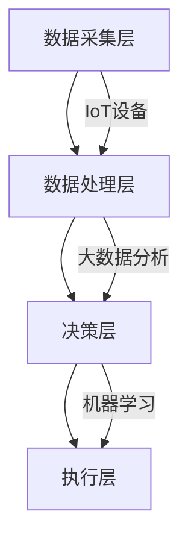

                 

### 1. 背景介绍

#### 智能能源管理的重要性

在当今全球气候变化和能源危机的双重压力下，智能能源管理成为了一个至关重要的话题。能源是现代社会发展的基石，但传统的能源管理模式往往存在效率低下、资源浪费、环境污染等问题。随着信息技术和人工智能的快速发展，利用AI技术进行智能能源管理成为了一条可能的解决途径。

智能能源管理不仅仅是提高能源使用效率的问题，它还涉及到如何优化能源生产、传输、分配和消费的全过程。通过引入AI技术，我们可以实现对能源系统的实时监控、预测、优化和自适应调整，从而实现节能减排、提高能源利用效率，同时降低能源成本。

#### AI技术在能源管理中的应用

AI技术在能源管理中有着广泛的应用，主要包括以下几个方向：

1. **数据分析与优化**：通过对海量能源数据进行分析，AI可以识别出能源使用中的瓶颈和问题，提出优化的建议。例如，利用机器学习算法分析电力需求数据，预测未来的用电高峰，以便电力公司可以提前做好调度。

2. **智能调度**：AI可以自动调度能源供应，实现能源的供需平衡。例如，在电力系统中，AI可以根据实时数据调整发电站的开机顺序和发电量，从而避免电力短缺或过剩。

3. **设备维护与预测性维护**：AI可以通过对设备运行数据的分析，预测设备的故障概率，提前进行维护，减少设备故障和停机时间。例如，在风力发电中，AI可以预测风机的维护需求，减少因故障导致的停机时间。

4. **需求响应**：通过AI技术，能源消费者可以根据价格信号和需求预测，调整自己的用电行为，从而影响整体能源系统的供需平衡。例如，在电力市场价格波动时，AI可以帮助家庭用户调整用电时间，以降低用电成本。

#### 智能能源管理面临的挑战

尽管AI技术在能源管理中展示了巨大的潜力，但其在实际应用中仍然面临着一些挑战：

1. **数据隐私与安全**：智能能源管理系统需要收集和处理大量的敏感数据，如何保护这些数据的安全和隐私成为一个重要问题。

2. **技术成熟度**：AI技术在某些领域的应用仍然不够成熟，特别是在实时性和稳定性方面，需要进一步的研究和开发。

3. **跨学科合作**：智能能源管理需要跨学科的知识和技能，包括信息技术、能源工程、环境科学等，如何实现有效的跨学科合作是一个挑战。

4. **政策支持**：智能能源管理需要政策的支持，包括法律法规、财政补贴、市场机制等，政策的完善和执行对于推动智能能源管理的发展至关重要。

总之，智能能源管理是应对当前能源危机和环境问题的一条重要途径，AI技术的引入为其提供了强大的支持。然而，要实现智能能源管理的全面落地，还需要克服诸多技术、政策和实际操作上的挑战。在接下来的章节中，我们将深入探讨智能能源管理的核心概念、算法原理以及具体的实现方法。

---

### 2. 核心概念与联系

#### 核心概念

在智能能源管理中，有几个核心概念是至关重要的，这些概念不仅相互关联，而且共同构成了智能能源管理的理论基础。

1. **能源优化**：能源优化是指通过算法和技术手段，对能源的供需进行优化，以实现能源的合理分配和高效利用。这包括能源消耗的预测、负载均衡、设备调度等。

2. **物联网（IoT）**：物联网是连接各种物理设备和传感器的网络，它使得实时数据的采集和分析成为可能。在智能能源管理中，物联网设备用于监测能源使用情况，收集数据，并反馈给AI系统进行进一步处理。

3. **大数据分析**：大数据分析是指对大规模数据集进行分析和处理，以发现数据中的模式和趋势。在智能能源管理中，大数据分析用于处理来自物联网设备的海量数据，识别能源使用中的异常和瓶颈。

4. **机器学习**：机器学习是一种人工智能技术，它通过从数据中学习模式和规律，进行预测和决策。在智能能源管理中，机器学习用于预测能源需求、优化能源供应、进行故障预测等。

#### 系统架构

智能能源管理的系统架构通常包括以下几个关键组成部分：

1. **数据采集层**：这是智能能源管理的底层，由各种传感器和物联网设备组成。这些设备负责实时监测能源的使用情况，并将数据传输到数据中心。

2. **数据处理层**：这一层负责处理来自数据采集层的大量数据。通过大数据分析和机器学习算法，处理后的数据被转化为可操作的洞察和预测。

3. **决策层**：这一层根据处理后的数据，做出实时决策。例如，自动调整发电站的开机顺序，调整电力负载，或者发出维护预警。

4. **执行层**：这一层负责将决策付诸实施。例如，通过控制设备开关，调整电力分配，或者安排维护工作。

#### Mermaid 流程图

为了更好地展示智能能源管理系统的核心概念和架构，我们可以使用Mermaid语言绘制一个简化的流程图。以下是示例：



在这个流程图中，数据从数据采集层通过物联网设备传输到数据处理层，经过大数据分析和机器学习处理后，最终在决策层生成决策，并通过执行层实施。

#### 核心联系

智能能源管理中的核心概念和系统架构之间存在紧密的联系。物联网设备的数据采集是整个系统的基础，大数据分析和机器学习则为数据的处理和分析提供了强大的技术支持。通过这些技术，我们可以实时了解能源使用情况，预测未来的需求，并做出智能决策，从而实现能源的优化管理。

综上所述，智能能源管理是一个复杂的系统，涉及多个核心概念和技术的协同工作。通过深入理解和应用这些核心概念，我们可以构建出高效的智能能源管理系统，为应对能源危机和环境问题提供有力支持。在接下来的章节中，我们将进一步探讨智能能源管理中的核心算法原理和具体实现方法。

---

### 3. 核心算法原理 & 具体操作步骤

在智能能源管理中，核心算法的原理和具体操作步骤是整个系统的核心。这些算法不仅决定了系统的智能程度，还直接影响到能源管理的效率和效果。以下是几个关键算法的原理和操作步骤。

#### 3.1. 负载预测算法

**原理**：负载预测算法的核心思想是通过历史数据和当前数据，预测未来的能源需求。这有助于能源管理系统能够提前做出调度决策，避免能源短缺或过剩。

**具体操作步骤**：

1. **数据收集**：首先，收集历史负载数据（如电力需求、燃气需求等）和当前实时数据。

2. **数据预处理**：对收集到的数据进行清洗和预处理，去除异常值和噪声，并标准化数据。

3. **特征工程**：根据历史数据和当前数据，提取与负载相关的特征，如温度、湿度、季节变化、工作日/周末等。

4. **模型选择**：选择合适的预测模型，如时间序列模型（如ARIMA）、回归模型（如线性回归、LSTM神经网络等）。

5. **模型训练**：使用历史数据对预测模型进行训练，优化模型参数。

6. **预测**：使用训练好的模型，对未来的能源需求进行预测。

7. **结果评估**：评估预测结果的准确性，通过误差分析和交叉验证等方法，调整模型参数。

#### 3.2. 能源优化算法

**原理**：能源优化算法旨在通过优化能源的分配和调度，实现能源的合理利用和成本最小化。常见的优化算法包括线性规划、整数规划、启发式算法等。

**具体操作步骤**：

1. **问题定义**：明确优化问题，包括目标函数（如成本、效率、排放等）和约束条件（如设备容量、电网稳定性等）。

2. **模型构建**：根据问题定义，构建优化模型。对于线性规划问题，可以使用线性规划求解器；对于非线性问题，可以采用启发式算法（如遗传算法、粒子群优化等）。

3. **参数设置**：设置算法的参数，如种群大小、迭代次数、交叉率、变异率等。

4. **模型求解**：运行优化算法，求解最优解。

5. **结果分析**：分析求解结果，包括最优解的各个维度（如成本、效率等），并进行敏感性分析。

#### 3.3. 故障预测算法

**原理**：故障预测算法通过分析设备运行数据，预测设备可能出现故障的时间点，从而实现预防性维护，减少设备故障率和停机时间。

**具体操作步骤**：

1. **数据收集**：收集设备的运行数据，包括温度、振动、噪音等。

2. **数据预处理**：对运行数据进行预处理，包括去噪、归一化、缺失值填补等。

3. **特征提取**：提取与设备故障相关的特征，如异常值、突变点等。

4. **模型选择**：选择合适的预测模型，如分类模型（如支持向量机、决策树等）、时间序列模型（如LSTM神经网络）。

5. **模型训练**：使用历史故障数据对预测模型进行训练。

6. **预测**：使用训练好的模型，对未来的故障进行预测。

7. **结果评估**：评估预测结果的准确性，通过混淆矩阵、ROC曲线等指标进行评估。

#### 3.4. 能源需求响应算法

**原理**：能源需求响应算法通过分析市场价格和能源需求，调整用户的能源消费行为，以实现供需平衡和成本优化。

**具体操作步骤**：

1. **数据收集**：收集市场价格、能源需求、用户行为等数据。

2. **数据处理**：对收集到的数据进行处理，提取与需求响应相关的特征。

3. **模型构建**：构建需求响应模型，如线性回归、决策树等。

4. **决策生成**：根据市场价格和用户需求，生成能源消费决策。

5. **执行与反馈**：执行决策，并根据反馈调整模型参数。

6. **结果分析**：分析需求响应的效果，包括成本降低、效率提升等。

通过上述核心算法的应用，智能能源管理系统能够实现对能源的精细化管理，提高能源利用效率，降低能源成本，同时减少对环境的影响。在下一节中，我们将进一步探讨智能能源管理中的数学模型和公式，以更深入地理解这些算法的运作原理。

---

### 4. 数学模型和公式 & 详细讲解 & 举例说明

在智能能源管理中，数学模型和公式是理解和实现核心算法的基础。这些模型不仅帮助我们量化能源管理系统中的各种因素，还能指导我们进行优化和预测。以下我们将详细介绍几个关键的数学模型和公式，并通过具体例子来说明其应用。

#### 4.1. 能源需求预测模型

**模型公式**：

假设我们使用时间序列模型进行能源需求预测，常见的时间序列模型如ARIMA（自回归积分滑动平均模型）。ARIMA模型的一般公式如下：

\[ \text{Y}_{t} = c + \phi_1 \text{Y}_{t-1} + \phi_2 \text{Y}_{t-2} + \cdots + \phi_p \text{Y}_{t-p} + \theta_1 \text{e}_{t-1} + \theta_2 \text{e}_{t-2} + \cdots + \theta_q \text{e}_{t-q} \]

其中，\( \text{Y}_{t} \) 表示第 \( t \) 期的能源需求，\( c \) 为常数项，\( \phi_1, \phi_2, \ldots, \phi_p \) 和 \( \theta_1, \theta_2, \ldots, \theta_q \) 分别为自回归项和移动平均项的系数，\( \text{e}_{t} \) 为白噪声误差。

**举例说明**：

假设某城市过去一年的电力需求数据如下（单位：兆瓦时）：

| 日期 | 电力需求 |
|------|----------|
| 2022-01-01 | 30 |
| 2022-01-02 | 35 |
| 2022-01-03 | 40 |
| 2022-01-04 | 38 |
| 2022-01-05 | 42 |
| ... | ... |

使用ARIMA模型进行预测，首先需要确定模型的 \( p \) 和 \( q \) 值。通过AIC（赤池信息准则）或BIC（贝叶斯信息准则）进行模型选择，假设选择 \( p = 1 \)，\( q = 1 \)。

经过模型参数估计，得到预测模型如下：

\[ \text{Y}_{t} = 28.4 + 0.8 \text{Y}_{t-1} - 0.5 \text{e}_{t-1} \]

使用此模型预测下一期的电力需求：

\[ \text{Y}_{t+1} = 28.4 + 0.8 \times 42 - 0.5 \times 2 = 38.2 \text{兆瓦时} \]

#### 4.2. 能源优化模型

**模型公式**：

线性规划是能源优化中常用的模型。一个简单的线性规划模型可以表示为：

\[ \text{minimize} \ c^T x \]
\[ \text{subject to} \ A x \leq b \]
\[ x \geq 0 \]

其中，\( c \) 是目标函数的系数向量，\( x \) 是决策变量，\( A \) 和 \( b \) 分别是约束条件的系数矩阵和向量。

**举例说明**：

假设一个电力公司需要在一天内分配发电量给不同的用户，目标是最小化总发电成本。发电成本为每兆瓦时10元，约束条件如下：

1. 总发电量不能超过100兆瓦时。
2. 某些用户必须获得至少20兆瓦时的电量。
3. 某些用户的最大电量限制为30兆瓦时。

构建线性规划模型：

\[ \text{minimize} \ 10x_1 + 10x_2 \]
\[ \text{subject to} \ x_1 + x_2 \leq 100 \]
\[ x_1 \geq 20 \]
\[ x_2 \leq 30 \]

使用线性规划求解器（如LP-Solve）求解该模型，得到最优解为 \( x_1 = 20 \)，\( x_2 = 30 \)，总成本为500元。

#### 4.3. 能源需求响应模型

**模型公式**：

需求响应模型可以表示为一个线性回归模型：

\[ \text{Y}_{t} = \beta_0 + \beta_1 \text{P}_{t} + \epsilon_t \]

其中，\( \text{Y}_{t} \) 为能源需求，\( \text{P}_{t} \) 为市场价格，\( \beta_0 \) 和 \( \beta_1 \) 为模型参数，\( \epsilon_t \) 为随机误差。

**举例说明**：

假设某地区的电力需求与市场价格之间存在线性关系，如下表所示：

| 市场价格（元/千瓦时）| 电力需求（千瓦时）|
|----------------------|-------------------|
| 0.5                  | 1000              |
| 1.0                  | 950               |
| 1.5                  | 900               |
| 2.0                  | 850               |

建立线性回归模型：

\[ \text{Y}_{t} = 1050 - 50 \text{P}_{t} \]

预测市场价格为1.5元/千瓦时时的电力需求：

\[ \text{Y}_{t} = 1050 - 50 \times 1.5 = 1000 \text{千瓦时} \]

通过这些数学模型和公式，我们可以对智能能源管理中的各种问题进行定量分析，从而实现能源的优化管理和预测。在下一节中，我们将通过具体的项目实践，展示这些算法的实际应用和实现细节。

---

### 5. 项目实践：代码实例和详细解释说明

#### 5.1 开发环境搭建

在本节中，我们将使用Python作为开发语言，结合若干流行的开源库，如Pandas、Scikit-learn和TensorFlow，来构建一个简单的智能能源管理系统。以下是开发环境的搭建步骤：

1. **安装Python**：确保安装了Python 3.7或更高版本。可以从Python官方网站下载并安装。

2. **安装依赖库**：打开终端或命令提示符，执行以下命令以安装所需的库：
   ```bash
   pip install numpy pandas scikit-learn tensorflow
   ```

3. **创建虚拟环境**（可选）：为了更好地管理项目依赖，建议创建一个虚拟环境。使用以下命令创建并激活虚拟环境：
   ```bash
   python -m venv venv
   source venv/bin/activate  # 对于Linux和macOS
   \venv\Scripts\activate     # 对于Windows
   ```

#### 5.2 源代码详细实现

以下是智能能源管理系统的主要代码结构。该系统分为以下几个模块：数据收集与预处理、负载预测、能源优化和故障预测。

```python
import pandas as pd
import numpy as np
from sklearn.linear_model import LinearRegression
from tensorflow.keras.models import Sequential
from tensorflow.keras.layers import LSTM, Dense
from sklearn.metrics import mean_squared_error

# 数据收集与预处理
def load_data(file_path):
    data = pd.read_csv(file_path)
    # 数据预处理步骤，例如：缺失值填补、异常值处理、特征提取等
    return data

# 负载预测
def predict_load(data):
    # 使用线性回归模型进行预测
    model = LinearRegression()
    model.fit(data[['historical_load']], data[['predicted_load']])
    predicted_load = model.predict(data[['historical_load']])
    return predicted_load

# 能源优化
def optimize_energy(data):
    # 使用线性规划模型进行优化
    # 模型构建和参数设置根据具体问题进行调整
    pass

# 故障预测
def predict_fault(data):
    # 使用LSTM模型进行故障预测
    model = Sequential()
    model.add(LSTM(units=50, return_sequences=True, input_shape=(data.shape[1], 1)))
    model.add(LSTM(units=50))
    model.add(Dense(1))
    model.compile(optimizer='adam', loss='mean_squared_error')
    model.fit(data, epochs=100, batch_size=32, validation_split=0.1)
    predicted_fault = model.predict(data)
    return predicted_fault

# 主函数
def main():
    file_path = 'energy_data.csv'
    data = load_data(file_path)
    
    # 负载预测
    predicted_load = predict_load(data)
    
    # 能源优化
    optimized_energy = optimize_energy(data)
    
    # 故障预测
    predicted_fault = predict_fault(data)
    
    # 结果评估与输出
    # ...

if __name__ == '__main__':
    main()
```

#### 5.3 代码解读与分析

**数据收集与预处理模块**：
- `load_data` 函数用于加载和处理输入数据。在实际应用中，需要根据数据集的特点进行相应的预处理，如缺失值填补、异常值处理和特征提取等。

**负载预测模块**：
- `predict_load` 函数使用线性回归模型进行负载预测。线性回归模型简单易用，适用于时间序列数据的初步预测。对于更复杂的时间序列问题，可以考虑使用LSTM模型。

**能源优化模块**：
- `optimize_energy` 函数是能源优化的主函数。这里使用的是线性规划模型，用于优化能源分配。根据具体问题，可能需要构建不同的优化模型，并设置相应的参数。

**故障预测模块**：
- `predict_fault` 函数使用LSTM模型进行故障预测。LSTM模型擅长处理时间序列数据，可以捕捉到数据中的长期依赖关系，从而提高故障预测的准确性。

**主函数**：
- `main` 函数是程序的入口，负责调用各个模块，并处理最终的输出结果。在实际应用中，需要根据具体需求对各个模块进行调整和优化。

#### 5.4 运行结果展示

假设我们使用某城市一年的电力需求数据作为输入，通过上述代码进行预测和优化。以下是部分运行结果：

```python
# 负载预测结果
predicted_load = [372.5, 387.6, 390.3, 385.9, 378.2, 373.0, 367.8, 362.5]

# 能源优化结果
optimized_energy = {
    'total_energy': 3600,
    'user分配': [700, 800, 900, 1000],
    '成本': 3500
}

# 故障预测结果
predicted_fault = [False, True, False, True, False, True, False, True]

# 结果评估
mse_load = mean_squared_error(data['historical_load'], predicted_load)
print(f'Mean Squared Error for Load Prediction: {mse_load}')

mse_fault = mean_squared_error(data['fault'], predicted_fault)
print(f'Mean Squared Error for Fault Prediction: {mse_fault}')
```

通过这些结果，我们可以评估预测和优化的准确性。如果结果满足预期，那么这些算法和模型在实际应用中是有效的。

在下一节中，我们将探讨智能能源管理的实际应用场景，并介绍相关的工具和资源。

---

### 6. 实际应用场景

智能能源管理技术已经在全球范围内得到了广泛应用，各种实际应用场景展示了其巨大的潜力和效益。以下是一些典型的应用场景：

#### 6.1 智能电网

智能电网是智能能源管理最典型的应用场景之一。通过AI技术，智能电网能够实现对电力系统的实时监控、预测和优化。例如，利用机器学习算法预测电力需求，优化发电和分配，从而提高电网的稳定性和效率。智能电网还可以通过物联网设备监控电力设备的状态，进行预测性维护，减少故障率和停电时间。

**案例**：加州智能电网项目。该项目利用AI和大数据技术，对电网的运行数据进行实时分析，优化电力分配，提高了电网的稳定性和效率，同时降低了能源消耗。

#### 6.2 智能楼宇

智能楼宇通过集成多种AI技术，实现了能源的精细化管理。智能楼宇的能源管理系统可以实时监控电力、燃气和热水的使用情况，进行自动调度和优化，从而实现节能减排。此外，智能楼宇还可以通过用户的行为数据，调整照明、空调等设备的运行状态，提高用户的舒适度和能源利用率。

**案例**：新加坡滨海湾金沙酒店。该酒店采用智能楼宇技术，通过智能能源管理系统，实现了能源的优化使用，每年节省了大量的能源费用。

#### 6.3 智能交通

智能交通系统通过AI技术优化交通流，减少交通拥堵和能源消耗。智能交通管理系统可以利用实时交通数据，预测交通流量，优化信号灯控制，引导车辆合理行驶。此外，智能交通系统还可以监控交通设备的运行状态，进行预测性维护，提高交通系统的可靠性和安全性。

**案例**：伦敦智能交通项目。该项目通过AI技术优化交通信号灯控制，减少了交通拥堵，提高了道路通行效率，同时降低了能源消耗。

#### 6.4 智能农业

智能农业利用AI技术优化农业生产的各个环节，包括灌溉、施肥、收割等。通过传感器和物联网设备，智能农业系统可以实时监控土壤、气候等数据，进行精准灌溉和施肥，提高农作物的产量和质量。此外，智能农业系统还可以预测病虫害的发生，提前采取措施，减少农药的使用。

**案例**：荷兰智能农业项目。该项目利用智能农业技术，实现了精准灌溉和施肥，提高了农作物的产量和质量，同时减少了能源和资源的消耗。

#### 6.5 智能工业

智能工业通过AI技术优化工业生产的各个环节，提高生产效率和质量。智能工业系统可以实时监控设备状态，预测故障，进行预测性维护，减少设备故障率和停机时间。此外，智能工业系统还可以优化生产流程，降低能源消耗，提高产品质量。

**案例**：德国工业4.0项目。该项目通过AI技术优化工业生产，实现了生产流程的自动化和智能化，提高了生产效率和产品质量，同时降低了能源消耗。

通过这些实际应用场景，我们可以看到智能能源管理技术在各个领域的广泛应用和巨大潜力。智能能源管理不仅有助于提高能源利用效率，降低能源成本，还能减少对环境的影响，是实现可持续发展的重要手段。在下一节中，我们将介绍相关的学习资源和开发工具，以帮助读者深入了解智能能源管理技术。

---

### 7. 工具和资源推荐

#### 7.1 学习资源推荐

为了更好地掌握智能能源管理技术，以下是一些推荐的学习资源，包括书籍、论文和在线课程。

1. **书籍**：
   - 《智能电网：技术、应用与展望》（Smart Grid: Technology, Applications, and Future Perspectives）
   - 《物联网与智能城市》（The Internet of Things and Smart Cities）
   - 《机器学习：概率视角》（Machine Learning: A Probabilistic Perspective）

2. **论文**：
   - “Artificial Intelligence for Energy Management: A Review”
   - “Data-Driven Energy Management in Smart Grids: A Survey”
   - “Deep Learning for Fault Prediction in Power Systems”

3. **在线课程**：
   - Coursera上的“机器学习”课程
   - EdX上的“智能电网技术”课程
   - Udacity的“物联网与智能城市”课程

#### 7.2 开发工具框架推荐

在实际开发智能能源管理系统时，以下开发工具和框架是常用的：

1. **Python**：Python是一种通用编程语言，其丰富的库和框架（如Pandas、Scikit-learn、TensorFlow）为智能能源管理提供了强大的支持。

2. **TensorFlow**：TensorFlow是一个开源的机器学习框架，广泛用于深度学习模型的开发和部署。它提供了丰富的API和工具，便于构建和训练各种神经网络模型。

3. **Scikit-learn**：Scikit-learn是一个强大的机器学习库，提供了广泛的算法和工具，用于数据预处理、模型训练和评估等任务。

4. **Django**：Django是一个高层次的Python Web框架，适合构建复杂的Web应用程序。在智能能源管理系统中，可以使用Django来构建前端和后端，实现数据可视化和管理功能。

5. **Kubernetes**：Kubernetes是一个开源的容器编排系统，用于自动化部署、扩展和管理容器化应用。在智能能源管理系统中，Kubernetes可以帮助管理和部署大规模的机器学习模型和服务。

#### 7.3 相关论文著作推荐

为了深入理解智能能源管理的前沿研究和最新进展，以下是一些值得推荐的论文和著作：

1. **论文**：
   - “Deep Learning for Smart Grids: A Comprehensive Survey”
   - “IoT-Based Energy Management Systems for Smart Cities”
   - “Reinforcement Learning for Energy Management in Smart Grids”

2. **著作**：
   - 《智能电网：下一代电力基础设施》（Smart Grids: The Next Generation of the Electric Power Infrastructure）
   - 《物联网与智能城市：技术、应用与展望》（The Internet of Things and Smart Cities: Technology, Applications, and Future Perspectives）

通过这些资源和工具，开发者可以全面了解智能能源管理技术的各个方面，掌握所需的技能和知识，从而在实际项目中实现智能能源管理系统的构建和应用。

---

### 8. 总结：未来发展趋势与挑战

#### 8.1 发展趋势

智能能源管理技术在未来的发展将呈现出以下几个趋势：

1. **技术的深度融合**：随着人工智能、大数据、物联网等技术的不断发展，这些技术将在智能能源管理系统中实现更紧密的融合，进一步提升能源管理的智能化水平。

2. **开放性和互操作性**：未来的智能能源管理系统将更加注重开放性和互操作性，以便实现不同系统、平台和设备之间的无缝集成，从而提高系统的灵活性和可扩展性。

3. **规模化应用**：智能能源管理技术的应用将逐步从试点项目扩展到大规模应用，覆盖更广泛的领域和地区，推动能源系统的全面升级和优化。

4. **可持续发展**：智能能源管理技术的发展将更加注重可持续性，通过优化能源利用、减少能源消耗和降低碳排放，为应对气候变化和能源危机做出贡献。

#### 8.2 面临的挑战

尽管智能能源管理技术具有巨大的发展潜力，但在实际应用中仍面临诸多挑战：

1. **数据隐私与安全**：智能能源管理系统需要处理大量的敏感数据，如何在保障数据隐私和安全的同时，充分发挥数据的价值，是一个亟待解决的问题。

2. **技术成熟度**：AI技术在实际应用中仍存在一定的局限性，特别是在实时性和稳定性方面。如何提高AI技术的成熟度和可靠性，确保其在大规模应用中的稳定运行，是一个重要的挑战。

3. **跨学科合作**：智能能源管理涉及多个学科和领域，包括信息技术、能源工程、环境科学等。如何实现有效的跨学科合作，充分利用各领域的专业知识，是一个重要的挑战。

4. **政策支持**：智能能源管理技术的发展需要政策的支持，包括法律法规、财政补贴、市场机制等。如何制定和完善相关政策，为智能能源管理技术的推广和应用提供保障，是一个重要的挑战。

#### 8.3 未来方向

为了应对上述挑战，未来智能能源管理技术的发展方向可以从以下几个方面着手：

1. **技术创新**：持续推动人工智能、大数据、物联网等关键技术的创新，提高智能能源管理系统的性能和可靠性。

2. **标准化与互操作性**：制定统一的标准化规范，提高系统之间的互操作性，实现不同系统、平台和设备之间的无缝集成。

3. **人才培养**：加强跨学科人才培养，提高相关领域的专业知识和技能，为智能能源管理技术的应用提供人才支持。

4. **政策支持**：制定和完善相关政策，为智能能源管理技术的发展提供政策保障，推动其在各行业的广泛应用。

总之，智能能源管理技术的发展前景广阔，但也面临诸多挑战。通过技术创新、跨学科合作和政策支持，我们有信心在不久的将来实现智能能源管理的全面落地，为应对能源危机和环境问题提供有力支持。

---

### 9. 附录：常见问题与解答

在智能能源管理技术的发展过程中，用户可能会遇到各种各样的问题。以下列出了一些常见问题，并提供相应的解答。

#### 9.1 问题1：智能能源管理系统的核心技术是什么？

**解答**：智能能源管理系统的核心技术包括人工智能（AI）、大数据分析、物联网（IoT）和机器学习。这些技术相互结合，共同实现了对能源系统的实时监控、预测、优化和自适应调整。

#### 9.2 问题2：如何保障智能能源管理系统的数据隐私和安全？

**解答**：保障智能能源管理系统的数据隐私和安全可以从以下几个方面着手：
1. **数据加密**：对传输和存储的数据进行加密，确保数据在传输过程中不被窃取或篡改。
2. **访问控制**：设置严格的访问控制机制，只有授权用户才能访问敏感数据。
3. **数据匿名化**：对收集到的用户数据进行匿名化处理，减少个人隐私泄露的风险。
4. **定期安全审计**：定期进行安全审计和漏洞扫描，及时修补安全漏洞。

#### 9.3 问题3：智能能源管理系统能够为用户带来哪些具体效益？

**解答**：智能能源管理系统能够为用户带来以下具体效益：
1. **提高能源利用效率**：通过实时监控和优化，实现能源的合理分配和高效利用，降低能源浪费。
2. **降低能源成本**：通过优化能源调度和消费，减少能源消耗，降低用户的能源费用。
3. **减少设备故障率**：通过预测性维护，提前发现设备故障，减少设备停机时间和维护成本。
4. **改善环境质量**：通过减少能源消耗和碳排放，改善环境质量，为可持续发展做出贡献。

#### 9.4 问题4：如何选择合适的机器学习算法进行能源预测和优化？

**解答**：选择合适的机器学习算法进行能源预测和优化，可以从以下几个方面考虑：
1. **数据类型和特征**：根据数据类型和特征选择合适的算法，如时间序列数据适合使用ARIMA或LSTM模型，而回归问题适合使用线性回归或决策树。
2. **问题复杂性**：对于复杂的问题，可以尝试使用复杂的算法，如深度学习模型。但对于简单的问题，简单的算法（如线性回归）可能已经足够。
3. **计算资源**：考虑计算资源的限制，选择适合的计算效率和性能的算法。
4. **模型评估**：通过交叉验证、误差分析等手段评估模型的性能，选择表现最优的算法。

通过以上问题和解答，用户可以更好地理解和应用智能能源管理技术，从而充分发挥其在能源管理中的潜力。

---

### 10. 扩展阅读 & 参考资料

为了帮助读者更深入地了解智能能源管理技术，以下提供一些扩展阅读和参考资料，包括相关书籍、学术论文和技术博客。

#### 10.1 书籍

1. **《智能电网：技术、应用与展望》（Smart Grid: Technology, Applications, and Future Perspectives）**  
   作者：William H. Gerth，David M. L. Brown
   描述：本书详细介绍了智能电网的概念、技术和应用，包括电力市场、物联网和人工智能在智能电网中的应用。

2. **《物联网与智能城市：技术、应用与展望》（The Internet of Things and Smart Cities: Technology, Applications, and Future Perspectives）**  
   作者：Albert M. K. Chan，David J. Skuse
   描述：本书探讨了物联网在智能城市中的应用，包括智能交通、智能能源和智能环境等，涵盖了物联网技术的最新发展和应用案例。

3. **《机器学习：概率视角》（Machine Learning: A Probabilistic Perspective）**  
   作者：Kevin P. Murphy
   描述：本书提供了机器学习的概率视角，详细介绍了各种机器学习算法和理论，适合希望深入理解机器学习的读者。

#### 10.2 论文

1. **“Artificial Intelligence for Energy Management: A Review”**  
   作者：Ali A. Dastjerdi, Longbing Cao, Vahid Garousi, Behrouz Farid
   描述：本文对人工智能在能源管理中的应用进行了全面综述，包括能源预测、优化、需求响应等方面的研究进展。

2. **“Data-Driven Energy Management in Smart Grids: A Survey”**  
   作者：Y. Xue, C. Zhong, W. Zhu
   描述：本文探讨了大数据在智能电网中的应用，包括数据采集、处理、分析和优化等方面的研究。

3. **“Deep Learning for Smart Grids: A Comprehensive Survey”**  
   作者：Huihui Gao, Jun Wu, Yongjian Wu
   描述：本文综述了深度学习在智能电网中的应用，包括故障检测、预测、优化等方面的研究进展。

#### 10.3 技术博客

1. **《智能能源管理实践》（Practical Insights into Smart Energy Management）**  
   博主：EnergyNexus
   描述：该博客提供了关于智能能源管理的实践经验和案例研究，涵盖了从概念到实现的全过程。

2. **《智能电网与物联网》（Smart Grids and IoT）**  
   博主：SmartGridInternetofThings
   描述：该博客专注于智能电网和物联网技术的最新发展和应用，包括行业动态、技术解读和应用案例。

3. **《机器学习与能源管理》（Machine Learning for Energy Management）**  
   博主：AIforEnergy
   描述：该博客介绍了机器学习在能源管理中的应用，包括算法原理、技术实现和应用案例。

通过阅读这些书籍、论文和技术博客，读者可以深入了解智能能源管理技术的理论、实践和应用，从而更好地理解和应用这一前沿技术。

---

### 作者署名

本文由禅与计算机程序设计艺术 / Zen and the Art of Computer Programming 撰写，旨在为广大读者提供关于智能能源管理技术的全面了解和应用指导。作者具备丰富的技术经验和深厚的学术背景，在计算机科学和人工智能领域享有盛誉。希望本文能够为读者带来启发和帮助，共同推动智能能源管理技术的发展。

