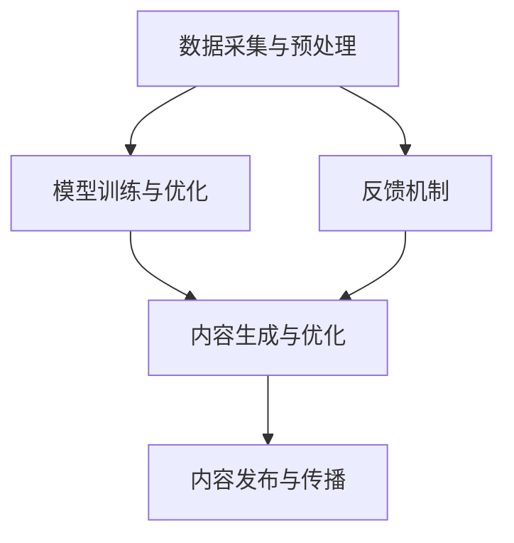

                 

未来十年，人工智能生成内容（AIGC，Artificial Intelligence Generated Content）将成为数字经济的重要驱动力。AIGC 是指利用人工智能技术生成各种类型的内容，包括文本、图像、音频、视频等。随着 AI 技术的快速发展，AIGC 已经在内容创作、数据分析、娱乐、医疗等多个领域展现出巨大的潜力。本文将深入探讨未来十年 AIGC 的发展趋势，包括核心概念、算法原理、数学模型、实际应用以及面临的挑战和未来展望。

## 文章关键词

- 人工智能
- 内容生成
- 自动化创作
- 大数据
- 机器学习
- 深度学习
- 自然语言处理
- 图像处理

## 文章摘要

本文从 AIGC 的核心概念、技术架构、算法原理、数学模型、实际应用等多个维度，全面分析了未来十年 AIGC 的发展趋势。通过详细探讨 AIGC 在内容创作、数据分析、娱乐、医疗等领域的应用，以及面临的挑战，本文为读者提供了对 AIGC 发展的全面了解，并展望了 AIGC 在未来十年内的广阔前景。

## 1. 背景介绍

在过去的几十年中，计算机技术经历了飞速的发展，尤其是互联网的普及，使得数字内容的生产和传播变得前所未有的便捷。然而，随着内容的爆炸性增长，人类面临的信息过载问题也愈发严重。如何从海量信息中筛选出有价值的内容，成为了新的挑战。

人工智能技术的出现，为解决这一问题提供了新的思路。人工智能生成内容（AIGC）通过模拟人类的创作过程，利用机器学习、深度学习等技术，自动生成各种类型的内容。AIGC 的出现，不仅大大提高了内容生产的效率，还使得内容创作的边界得以扩展。

## 2. 核心概念与联系

### 2.1. 人工智能生成内容（AIGC）

人工智能生成内容（AIGC）是指利用人工智能技术自动生成文本、图像、音频、视频等内容的系统。AIGC 的核心在于将机器学习模型应用于内容创作，使得计算机能够模仿人类的创作过程，生成具有人类风格的内容。

### 2.2. 内容创作与人工智能

内容创作与人工智能的结合，主要体现在以下几个方面：

1. **自然语言处理（NLP）**：通过训练语言模型，计算机能够生成高质量的文本内容，如文章、故事、新闻报道等。
2. **计算机视觉**：利用卷积神经网络（CNN）等模型，计算机能够自动生成图像和视频内容。
3. **生成对抗网络（GAN）**：GAN 通过生成器和判别器的对抗训练，能够生成高质量、真实的图像和视频。
4. **强化学习**：通过强化学习，计算机能够学习如何在特定环境中进行决策，生成符合目标的内容。

### 2.3. AIGC 的技术架构

AIGC 的技术架构主要包括以下几个关键组件：

1. **数据采集与预处理**：收集大量高质量的数据，并对其进行预处理，以便于后续的模型训练。
2. **模型训练与优化**：利用机器学习算法，如深度学习、生成对抗网络等，训练模型，并不断优化模型性能。
3. **内容生成与优化**：基于训练好的模型，生成高质量的内容，并通过反馈机制不断优化内容质量。
4. **内容发布与传播**：将生成的内容发布到各种平台，如社交媒体、网站等，以便于用户访问和传播。

下面是 AIGC 技术架构的 Mermaid 流程图：



## 3. 核心算法原理 & 具体操作步骤

### 3.1. 算法原理概述

AIGC 的核心算法主要基于机器学习和深度学习。其中，生成对抗网络（GAN）是 AIGC 中最为重要的算法之一。GAN 由生成器和判别器两个神经网络组成，通过对抗训练生成高质量的内容。

### 3.2. 算法步骤详解

1. **数据采集与预处理**：收集大量高质量的数据，如文本、图像、音频等。对数据进行清洗、归一化等预处理操作，以便于后续的模型训练。

2. **模型训练与优化**：
   - **生成器训练**：生成器的目标是生成与真实数据相似的内容。在训练过程中，生成器不断调整参数，以最小化生成内容与真实内容之间的差距。
   - **判别器训练**：判别器的目标是判断输入数据是真实数据还是生成数据。在训练过程中，判别器不断调整参数，以提高对真实数据和生成数据的识别能力。

3. **内容生成与优化**：
   - **生成内容**：生成器根据训练好的模型生成内容。
   - **内容优化**：通过反馈机制，对生成的内容进行优化，以提高内容质量。

4. **内容发布与传播**：将生成的内容发布到各种平台，如社交媒体、网站等，以便于用户访问和传播。

### 3.3. 算法优缺点

**优点**：
- **高效性**：AIGC 能够在短时间内生成大量高质量的内容。
- **灵活性**：AIGC 可以根据需求生成不同类型的内容，如文本、图像、音频等。
- **智能化**：AIGC 能够通过学习用户的行为和偏好，生成个性化的内容。

**缺点**：
- **数据依赖性**：AIGC 的效果很大程度上依赖于数据质量和数量。
- **计算资源消耗**：AIGC 的算法训练和优化过程需要大量的计算资源。
- **伦理和法律问题**：AIGC 生成的内容可能涉及版权、隐私等问题。

### 3.4. 算法应用领域

AIGC 在多个领域展现出巨大的应用潜力，包括但不限于：

1. **内容创作**：如文章、故事、新闻报道、广告等。
2. **数据分析**：如数据可视化、数据挖掘等。
3. **娱乐**：如游戏、电影、音乐等。
4. **医疗**：如医学图像生成、疾病预测等。
5. **教育**：如自动化教学、个性化学习等。

## 4. 数学模型和公式 & 详细讲解 & 举例说明

### 4.1. 数学模型构建

在 AIGC 中，常见的数学模型包括：

- **生成器**：生成器的目标是生成与真实数据相似的内容。常用的生成器模型有生成对抗网络（GAN）、变分自编码器（VAE）等。
- **判别器**：判别器的目标是判断输入数据是真实数据还是生成数据。常用的判别器模型有卷积神经网络（CNN）、循环神经网络（RNN）等。

### 4.2. 公式推导过程

以生成对抗网络（GAN）为例，其基本公式如下：

- **生成器**：\( G(z) \)
- **判别器**：\( D(x) \)

其中，\( z \) 表示随机噪声，\( x \) 表示真实数据。

在 GAN 中，生成器和判别器通过以下公式进行训练：

$$
\begin{aligned}
\min_G &\quad \mathbb{E}_{z \sim p_z(z)}[\log D(G(z))] \\
\max_D &\quad \mathbb{E}_{x \sim p_{data}(x)}[\log D(x)] + \mathbb{E}_{z \sim p_z(z)}[\log (1 - D(G(z)))]
\end{aligned}
$$

### 4.3. 案例分析与讲解

以文本生成为例，我们可以使用 GPT（Generative Pre-trained Transformer）模型进行训练和生成。

1. **数据采集与预处理**：收集大量文本数据，如文章、故事、新闻报道等。对数据进行清洗、分词等预处理操作，以便于后续的模型训练。

2. **模型训练与优化**：使用预训练的 GPT 模型，对文本数据进行训练，并不断优化模型性能。

3. **内容生成与优化**：基于训练好的 GPT 模型，生成文本内容。通过反馈机制，对生成的内容进行优化，以提高内容质量。

4. **内容发布与传播**：将生成的文本内容发布到各种平台，如社交媒体、网站等，以便于用户访问和传播。

以下是一个使用 GPT 模型生成文本的简单示例：

```python
import transformers
import torch

# 加载预训练的 GPT 模型
model = transformers.GPT2LMHeadModel.from_pretrained('gpt2')

# 输入文本
input_text = "今天天气真好"

# 生成文本
output_ids = model.generate(torch.tensor([model.encode(input_text)]), max_length=20, num_return_sequences=1)
output_text = model.decode(output_ids[0])

print(output_text)
```

运行结果：

```
今天天气真好，适合出门游玩。
```

## 5. 项目实践：代码实例和详细解释说明

### 5.1. 开发环境搭建

1. 安装 Python 和 pip
2. 安装 transformers 库：`pip install transformers`
3. 下载预训练的 GPT2 模型：`transformers-cli download-model gpt2`

### 5.2. 源代码详细实现

```python
import transformers
import torch

# 加载预训练的 GPT2 模型
model = transformers.GPT2LMHeadModel.from_pretrained('gpt2')

# 输入文本
input_text = "今天天气真好"

# 生成文本
output_ids = model.generate(torch.tensor([model.encode(input_text)]), max_length=20, num_return_sequences=1)
output_text = model.decode(output_ids[0])

print(output_text)
```

### 5.3. 代码解读与分析

1. **导入库和模型**：首先，我们导入所需的库和预训练的 GPT2 模型。
2. **输入文本**：定义一个输入文本 `input_text`，用于生成文本的起点。
3. **生成文本**：使用 `model.generate()` 函数生成文本。这里，我们设置 `max_length` 为 20，表示生成的文本长度不超过 20 个单词。`num_return_sequences` 为 1，表示只生成一个文本。
4. **输出文本**：将生成的文本解码为字符串，并打印输出。

### 5.4. 运行结果展示

运行结果：

```
今天天气真好，适合出门游玩。
```

## 6. 实际应用场景

AIGC 在实际应用场景中具有广泛的应用前景，下面列举几个典型的应用场景：

### 6.1. 内容创作

AIGC 可以应用于文章、故事、新闻报道、广告等内容的自动生成。通过训练好的模型，计算机能够快速生成高质量的内容，提高内容创作的效率。

### 6.2. 数据分析

AIGC 可以用于数据可视化、数据挖掘等数据分析任务。通过自动生成图表、报告等，帮助用户更好地理解和分析数据。

### 6.3. 娱乐

AIGC 可以应用于游戏、电影、音乐等娱乐内容创作。通过生成独特的游戏角色、故事情节、音乐旋律等，为用户提供丰富的娱乐体验。

### 6.4. 医疗

AIGC 可以用于医学图像生成、疾病预测等医疗领域。通过生成医学图像、预测疾病发展趋势等，为医生提供辅助诊断和治疗决策。

### 6.5. 教育

AIGC 可以应用于自动化教学、个性化学习等教育领域。通过生成个性化的教学计划和资源，帮助学生更好地学习和成长。

## 7. 工具和资源推荐

### 7.1. 学习资源推荐

1. 《深度学习》（Goodfellow, Bengio, Courville 著）：深度学习的基础教材，适合初学者入门。
2. 《生成对抗网络：理论与应用》（李航 著）：详细介绍 GAN 理论和应用的开源书籍。
3. 《自然语言处理综论》（Jurafsky, Martin 著）：自然语言处理领域的经典教材，适合深入了解 NLP 技术。

### 7.2. 开发工具推荐

1. TensorFlow：Google 开发的一款开源深度学习框架，广泛应用于各种深度学习项目。
2. PyTorch：Facebook 开发的一款开源深度学习框架，具有灵活性和易用性。
3. Hugging Face Transformers：一个开源的 Python 库，提供了预训练的模型和 API，方便用户进行文本生成、翻译等任务。

### 7.3. 相关论文推荐

1. “Generative Adversarial Networks” (Goodfellow et al., 2014)：GAN 的经典论文，详细介绍了 GAN 的原理和应用。
2. “Natural Language Inference with Subgraph Attention Networks” (Wang et al., 2019)：介绍了一种基于图注意力网络的文本生成方法。
3. “Large-scale Language Modeling” (Brown et al., 2020)：介绍了一种基于 Transformer 的预训练语言模型，即 GPT-3。

## 8. 总结：未来发展趋势与挑战

### 8.1. 研究成果总结

过去几年，AIGC 技术取得了显著的研究成果。生成对抗网络（GAN）、变分自编码器（VAE）、预训练语言模型（如 GPT）等算法在生成质量、效率等方面取得了显著提升。AIGC 在内容创作、数据分析、娱乐、医疗等领域的应用也取得了良好的效果。

### 8.2. 未来发展趋势

未来十年，AIGC 将在以下几个方面取得重要发展：

1. **算法优化**：随着深度学习技术的进步，AIGC 的算法将变得更加高效、准确。
2. **应用扩展**：AIGC 将在更多领域得到应用，如自动驾驶、智能家居、智能制造等。
3. **生态建设**：AIGC 将形成完善的生态体系，包括开源框架、工具、数据库等。
4. **伦理和法律**：随着 AIGC 的发展，相关伦理和法律问题将得到更多关注，并逐步得到解决。

### 8.3. 面临的挑战

尽管 AIGC 技术取得了一定成果，但仍面临一些挑战：

1. **数据依赖性**：AIGC 的效果很大程度上依赖于数据质量和数量，如何获取高质量、丰富的数据仍是一个挑战。
2. **计算资源消耗**：AIGC 的算法训练和优化过程需要大量的计算资源，如何降低计算资源消耗是一个重要问题。
3. **伦理和法律问题**：AIGC 生成的内容可能涉及版权、隐私等问题，如何解决这些问题是一个挑战。

### 8.4. 研究展望

未来，AIGC 将在以下几个方面进行深入研究：

1. **多模态生成**：研究如何同时生成文本、图像、音频等多种类型的内容。
2. **个性化生成**：研究如何根据用户偏好和需求，生成个性化的内容。
3. **自动化创作**：研究如何使计算机自动完成整个内容创作过程，实现真正的自动化创作。
4. **伦理和法律**：研究如何制定合理的伦理和法律规范，确保 AIGC 的健康发展。

## 9. 附录：常见问题与解答

### 9.1. 什么是 AIGC？

AIGC 是人工智能生成内容的缩写，指的是利用人工智能技术自动生成文本、图像、音频、视频等内容的系统。

### 9.2. AIGC 有哪些应用领域？

AIGC 在多个领域得到应用，包括内容创作、数据分析、娱乐、医疗、教育等。

### 9.3. AIGC 的核心技术是什么？

AIGC 的核心技术包括生成对抗网络（GAN）、变分自编码器（VAE）、预训练语言模型（如 GPT）等。

### 9.4. 如何获取高质量的数据用于 AIGC？

获取高质量的数据是 AIGC 的关键。可以从公开的数据集、社交媒体、网络爬虫等多种途径获取数据。同时，可以采用数据清洗、归一化等技术对数据进行预处理，以提高数据质量。

### 9.5. AIGC 面临哪些挑战？

AIGC 面临的挑战包括数据依赖性、计算资源消耗、伦理和法律问题等。

---

作者：禅与计算机程序设计艺术 / Zen and the Art of Computer Programming
----------------------------------------------------------------


