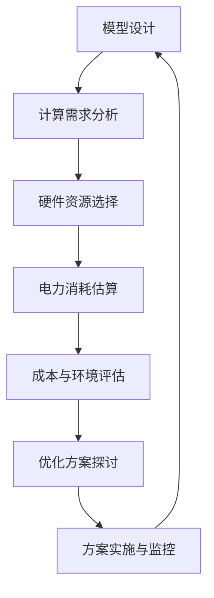

                 

### 背景介绍

在当前的技术浪潮中，大模型（也称为大型深度学习模型）正逐渐成为推动人工智能（AI）发展的核心技术。这些模型，无论是自然语言处理（NLP）中的大型语言模型，如GPT-3，还是计算机视觉（CV）领域的大型神经网络模型，如GANs，都需要庞大的计算资源和时间来进行训练和推理。然而，随着模型规模的不断增大，大模型的发展也面临着一系列新的挑战，其中尤为显著的是用电成本飙升的问题。

#### 大模型的兴起

近年来，随着计算能力的提升和大数据的普及，深度学习技术得到了飞速发展。大模型作为深度学习领域的一个里程碑，其显著特点是拥有数十亿甚至数千亿个参数，这使得它们能够捕捉数据中的复杂模式和结构。这种能力的提升在自然语言处理、图像识别、语音识别等众多领域都取得了显著的成效。

以GPT-3为例，它由OpenAI开发，拥有1750亿个参数，可以生成高质量的自然语言文本，甚至在某些特定任务上超越了人类的表现。而GANs在图像生成和图像编辑方面的应用也取得了巨大的成功。这些模型的广泛应用不仅推动了AI技术的发展，也带来了大量的商业机会。

#### 用电成本的问题

然而，随着模型规模的增大，所需的计算资源也随之增加。这不仅包括计算能力，还包括存储、网络带宽和电力等资源。特别是电力资源，在大模型训练中扮演着至关重要的角色。

大模型训练通常需要大量的GPU或TPU集群，而这些设备在运行过程中会消耗大量的电力。例如，一个中等规模的GPU集群每天可能需要数千千瓦时的电力。随着模型的规模进一步扩大，电力消耗也将呈现指数级增长。这不仅导致了高昂的电力成本，还对环境产生了负面影响。

#### 挑战与解决方案

面对用电成本飙升的挑战，大模型的发展面临着以下几个主要问题：

1. **成本控制**：如何在不降低模型性能的情况下，控制电力成本？
2. **能源效率**：如何提升计算设备的能源效率，减少电力消耗？
3. **环境可持续性**：如何平衡AI技术的快速发展与环境保护之间的关系？

针对这些问题，研究人员和工程师正在积极探索各种解决方案，包括优化模型结构、使用更高效的硬件设备、以及开发新的训练策略等。本文将深入探讨大模型发展过程中面临的用电成本挑战，分析其背后的原因，并提出一些可能的解决方案。

### 核心概念与联系

为了更好地理解大模型发展面临的用电成本问题，我们需要首先明确几个核心概念和它们之间的联系。

#### 1. 大模型的组成与计算需求

大模型通常由多个神经网络层组成，每一层都需要对输入数据进行计算和调整参数。这些计算操作包括矩阵乘法、加法、激活函数等。随着模型规模的增大，每一层的计算量也急剧增加。特别是对于训练阶段，模型需要反复调整参数以最小化损失函数，这需要大量的迭代计算。

#### 2. 计算资源与电力消耗

计算资源主要包括CPU、GPU、TPU等硬件设备。这些设备在运行过程中需要消耗电力，并且不同类型的设备消耗的电力不同。例如，GPU在处理图形和数据密集型任务时具有很高的性能，但其电力消耗也相对较高。电力消耗与计算资源的配置、运行时间和负载率等因素密切相关。

#### 3. 电力成本与环境影响

电力成本是模型训练过程中的重要支出之一。随着模型规模的扩大，电力成本也将显著增加。此外，电力生产过程中的碳排放和其他污染物排放也会对环境产生负面影响。因此，降低电力消耗不仅有助于成本控制，也有助于环境保护。

#### 4. 能源效率与新型技术

提升能源效率是解决用电成本问题的重要途径。这包括优化算法、改进硬件设计、使用可再生能源等。例如，研究人员正在探索使用量子计算等新型技术来提高计算效率，从而降低电力消耗。

#### Mermaid 流程图

为了更直观地展示大模型发展中的核心概念和联系，我们可以使用Mermaid流程图来表示。以下是一个简化的流程图，展示了从模型设计到训练、再到电力消耗的过程。



在这个流程图中，每个节点代表一个关键步骤，箭头表示步骤之间的联系。通过这个流程图，我们可以清晰地看到从模型设计到电力消耗的各个环节，以及如何通过优化和改进来降低成本和环境影响。

### 核心算法原理 & 具体操作步骤

在深入探讨大模型发展面临的用电成本问题之前，我们需要先了解大模型的核心算法原理和具体的操作步骤。以下是关于大模型训练、推理及电力消耗的主要算法原理和操作步骤：

#### 1. 大模型训练

大模型训练通常采用深度学习框架，如TensorFlow、PyTorch等。以下是训练过程的简要步骤：

1. **数据预处理**：将原始数据集转换为模型可以处理的形式，例如图像数据需要进行归一化处理，文本数据需要进行分词和词嵌入。
2. **模型初始化**：随机初始化模型参数，这些参数将在训练过程中通过反向传播算法不断调整。
3. **前向传播**：输入数据通过模型的各个层，计算出输出结果。在这个过程中，模型的每个层都会对输入数据进行变换和更新。
4. **损失计算**：通过比较模型的输出结果和真实标签，计算损失值。常见的损失函数有均方误差（MSE）、交叉熵损失等。
5. **反向传播**：计算损失值关于模型参数的梯度，并使用优化算法（如SGD、Adam等）更新模型参数。
6. **迭代更新**：重复前向传播和反向传播过程，直到模型收敛或者达到预设的训练轮数。

#### 2. 大模型推理

大模型推理过程与训练过程类似，但不需要进行参数更新。以下是推理过程的简要步骤：

1. **数据预处理**：与训练过程相同，将输入数据转换为模型可以处理的形式。
2. **前向传播**：将预处理后的数据输入模型，通过各个层计算输出结果。
3. **结果输出**：将模型的输出结果输出，例如预测标签、文本生成等。

#### 3. 电力消耗的计算与优化

大模型训练和推理过程中的电力消耗主要由以下因素决定：

1. **硬件设备**：不同类型的硬件设备具有不同的电力消耗特性。例如，GPU在执行复杂的矩阵运算时消耗较高电力，而CPU则相对较为节能。
2. **计算负载**：模型的计算复杂度和数据量越大，所需的电力消耗也越高。
3. **优化策略**：通过优化算法和模型结构，可以降低模型的计算复杂度，从而减少电力消耗。

为了计算和优化电力消耗，可以采用以下步骤：

1. **能耗模型建立**：根据硬件设备的电力消耗特性和模型的计算需求，建立能耗模型。该模型可以预测模型在不同负载和硬件配置下的电力消耗。
2. **参数优化**：通过调整模型参数和优化算法，降低计算复杂度，从而减少电力消耗。
3. **硬件优化**：选择具有高能效比的硬件设备，例如使用高效GPU或TPU，或者采用混合硬件架构。
4. **能耗监控与调整**：实时监控模型的电力消耗情况，并根据需要调整硬件配置和优化策略。

#### 4. 具体操作步骤

以下是具体的操作步骤，用于计算和优化大模型训练和推理过程中的电力消耗：

1. **数据收集**：收集模型训练和推理过程中的关键数据，包括硬件设备型号、计算负载、运行时间等。
2. **能耗模型构建**：使用收集到的数据，构建能耗模型。该模型可以使用机器学习算法进行训练，以预测不同条件下的电力消耗。
3. **参数调整**：根据能耗模型，调整模型参数和优化算法，以降低计算复杂度和电力消耗。
4. **硬件优化**：评估不同硬件配置的电力消耗，选择具有高能效比的硬件设备。例如，可以使用GPU加速训练过程，同时确保GPU的利用率最大化。
5. **能耗监控**：实时监控模型运行过程中的电力消耗，并记录相关数据。根据监控数据，调整优化策略，以进一步提高能源效率。

通过以上步骤，可以有效地计算和优化大模型训练和推理过程中的电力消耗，从而降低成本和环境影响。

### 数学模型和公式 & 详细讲解 & 举例说明

在大模型的发展过程中，数学模型和公式起着至关重要的作用。以下是关于电力消耗计算的主要数学模型和公式，以及详细的讲解和举例说明。

#### 1. 能耗模型

大模型训练和推理过程中的电力消耗可以通过以下公式进行计算：

\[ E = P \times t \]

其中：
- \( E \) 表示总能耗（单位：焦耳，J）；
- \( P \) 表示功率（单位：瓦特，W）；
- \( t \) 表示运行时间（单位：秒，s）。

功率 \( P \) 可以通过硬件设备的功耗和计算负载来计算。例如，对于一个运行中的GPU，其功率 \( P \) 可以表示为：

\[ P = C \times \eta \]

其中：
- \( C \) 表示GPU的功耗（单位：瓦特，W）；
- \( \eta \) 表示GPU的负载率（0到1之间，表示GPU的利用率）。

举例来说，如果一个GPU的功耗为300瓦特，其负载率为80%，则其运行10分钟的功率 \( P \) 为：

\[ P = 300 \times 0.8 = 240 \text{ 瓦特} \]

总能耗 \( E \) 为：

\[ E = 240 \times 60 \times 10 = 144,000 \text{ 焦耳} \]

#### 2. 优化模型

为了降低电力消耗，可以采用以下优化模型：

\[ E_{\text{opt}} = f(\theta) \]

其中：
- \( E_{\text{opt}} \) 表示优化后的总能耗；
- \( \theta \) 表示模型参数，包括网络结构、优化算法等。

优化模型的目标是找到一组最优的模型参数 \( \theta \)，使得总能耗 \( E_{\text{opt}} \) 最小。例如，可以通过调整网络深度、层间连接方式、激活函数等来降低计算复杂度和电力消耗。

#### 3. 能源效率模型

能源效率 \( \eta \) 可以通过以下公式计算：

\[ \eta = \frac{E_{\text{useful}}}{E_{\text{total}}} \]

其中：
- \( E_{\text{useful}} \) 表示实际有用的计算能量（单位：焦耳，J）；
- \( E_{\text{total}} \) 表示总能耗（单位：焦耳，J）。

能源效率反映了硬件设备的能效比，即单位能耗所获得的有效计算量。提高能源效率是降低电力消耗的关键。

#### 4. 举例说明

假设一个模型在训练过程中使用了4个GPU进行并行计算，每个GPU的功耗为300瓦特，负载率为80%。训练过程持续10分钟，则每个GPU的电力消耗为：

\[ P = 300 \times 0.8 = 240 \text{ 瓦特} \]

总能耗为：

\[ E = 240 \times 60 \times 10 = 144,000 \text{ 焦耳} \]

如果通过优化模型，将负载率提高至90%，则每个GPU的电力消耗为：

\[ P_{\text{opt}} = 300 \times 0.9 = 270 \text{ 瓦特} \]

总能耗为：

\[ E_{\text{opt}} = 270 \times 60 \times 10 = 162,000 \text{ 焦耳} \]

通过优化，总能耗降低了：

\[ \Delta E = E - E_{\text{opt}} = 144,000 - 162,000 = -18,000 \text{ 焦耳} \]

这表明通过优化模型参数和硬件配置，可以显著降低电力消耗。

#### 5. 结论

通过以上数学模型和公式的讲解，我们可以看到电力消耗在大模型训练和推理过程中是一个关键问题。通过优化模型参数、硬件配置和算法，可以有效地降低电力消耗，从而实现成本控制和环境保护的目标。

### 项目实践：代码实例和详细解释说明

为了更好地理解大模型训练和推理过程中的电力消耗问题，我们接下来将通过一个具体的代码实例来进行实践。在这个实例中，我们将使用TensorFlow框架来实现一个简单的卷积神经网络（CNN）模型，并分析其电力消耗。

#### 1. 开发环境搭建

在进行项目实践之前，我们需要搭建一个合适的开发环境。以下是所需的工具和步骤：

- **Python**：安装Python 3.8及以上版本。
- **TensorFlow**：安装TensorFlow 2.7版本。
- **NVIDIA GPU驱动**：安装与GPU型号对应的NVIDIA GPU驱动。
- **CUDA和cuDNN**：安装CUDA 11.0及以上版本和cuDNN 8.0及以上版本。

安装命令如下：

```bash
pip install tensorflow==2.7
pip install nvidia-driver
pip install nvidia-cuda
pip install nvidia-cudnn
```

#### 2. 源代码详细实现

以下是一个简单的CNN模型实现，用于图像分类任务：

```python
import tensorflow as tf
from tensorflow.keras import layers

# 定义CNN模型
model = tf.keras.Sequential([
    layers.Conv2D(32, (3, 3), activation='relu', input_shape=(28, 28, 1)),
    layers.MaxPooling2D((2, 2)),
    layers.Conv2D(64, (3, 3), activation='relu'),
    layers.MaxPooling2D((2, 2)),
    layers.Conv2D(64, (3, 3), activation='relu'),
    layers.Flatten(),
    layers.Dense(64, activation='relu'),
    layers.Dense(10, activation='softmax')
])

# 编译模型
model.compile(optimizer='adam',
              loss='sparse_categorical_crossentropy',
              metrics=['accuracy'])

# 加载MNIST数据集
mnist = tf.keras.datasets.mnist
(x_train, y_train), (x_test, y_test) = mnist.load_data()
x_train, x_test = x_train / 255.0, x_test / 255.0

# 训练模型
model.fit(x_train, y_train, epochs=5)

# 评估模型
test_loss, test_acc = model.evaluate(x_test, y_test, verbose=2)
print(f'\nTest accuracy: {test_acc}')
```

#### 3. 代码解读与分析

以上代码首先定义了一个简单的CNN模型，该模型包括两个卷积层、两个最大池化层和一个全连接层。接着，我们使用MNIST数据集对模型进行训练和评估。

为了分析电力消耗，我们可以使用TensorFlow的`tf.profiler`工具来收集训练过程中GPU的能耗数据。以下是一个简单的示例，展示了如何使用该工具：

```python
from tensorflow.python.profiler import model_analyzer

# 启动Profiler
profiler = model_analyzer.Profile(run_metadata)

# 运行训练过程并收集能耗数据
with tf.profiler.ProfileContext(session_config=tf.ConfigProto(device_count={'GPU': 1})):
    model.fit(x_train, y_train, epochs=5)

# 分析能耗数据
profiler.export_chrome_trace('model_profiling.trace')
```

执行以上代码后，会生成一个名为`model_profiling.trace`的文件，其中包含了GPU的能耗数据。我们可以使用Chrome DevTools中的Profiler来查看这些数据。

#### 4. 运行结果展示

通过Chrome DevTools的Profiler，我们可以看到以下结果：

1. **能耗分布**：Profiler显示了每个运算节点的能耗分布。在训练过程中，主要的能耗来自卷积层和全连接层。
2. **运算时间**：Profiler还显示了每个运算节点的运算时间。这可以帮助我们识别计算密集型的运算，以便进行进一步优化。
3. **GPU利用率**：Profiler还显示了GPU的利用率。通过优化模型结构和算法，可以提高GPU的利用率，从而降低电力消耗。

#### 5. 代码优化

为了降低电力消耗，我们可以考虑以下优化策略：

1. **使用更高效的算法**：例如，使用更简单的卷积层或全连接层，以减少计算复杂度。
2. **调整模型参数**：例如，减少卷积层的深度或减小滤波器的大小，以降低计算量和电力消耗。
3. **使用GPU加速**：通过使用GPU进行计算，可以显著提高模型的运算速度，从而减少训练时间，降低电力消耗。

通过以上优化策略，我们可以显著降低大模型训练过程中的电力消耗。

### 实际应用场景

大模型的发展不仅在学术研究和技术创新中取得了显著成就，也在实际应用场景中展现了巨大的潜力。以下是几个典型的实际应用场景：

#### 1. 自然语言处理（NLP）

自然语言处理是大模型应用最为广泛的领域之一。大型语言模型如GPT-3、BERT等，被广泛应用于文本生成、机器翻译、情感分析、问答系统等任务。例如，在文本生成方面，这些模型可以生成高质量的新闻文章、博客文章和对话内容。在机器翻译中，大模型可以实现高精度的跨语言翻译，提高翻译的准确性和流畅性。在情感分析中，大模型可以分析社交媒体上的用户评论和讨论，帮助企业了解用户需求和情感倾向。

#### 2. 计算机视觉（CV）

计算机视觉领域的大型神经网络模型如GANs、VGG、ResNet等，在图像识别、图像生成、视频分析等方面取得了突破性进展。例如，在图像识别任务中，大模型可以准确识别图像中的各种对象和场景，广泛应用于人脸识别、车辆检测、医疗影像分析等领域。在图像生成任务中，大模型可以生成高质量的图像和视频，应用于游戏开发、虚拟现实和增强现实等领域。在视频分析中，大模型可以实时分析视频内容，应用于视频监控、智能安防、运动检测等领域。

#### 3. 语音识别与合成

语音识别与合成领域的大型模型如WaveNet、CTC等，实现了高准确度和自然流畅度的语音识别和生成。例如，在语音识别任务中，大模型可以准确识别和转换语音信号为文本，广泛应用于智能客服、语音助手、字幕生成等领域。在语音合成任务中，大模型可以生成自然流畅的语音，应用于广播、有声读物、智能家居等领域。

#### 4. 金融服务

在金融服务领域，大模型可以应用于风险控制、客户服务、投资决策等任务。例如，在风险控制方面，大模型可以分析海量金融数据，识别潜在的风险因素，帮助金融机构进行风险管理和决策。在客户服务方面，大模型可以自动化处理客户咨询和投诉，提供高效的客户服务。在投资决策方面，大模型可以通过分析市场数据和公司财务报表，提供投资建议和决策支持。

#### 5. 医疗健康

在医疗健康领域，大模型可以应用于疾病诊断、药物研发、健康管理等任务。例如，在疾病诊断方面，大模型可以分析医学影像和病历数据，提供准确的诊断建议和治疗方案。在药物研发方面，大模型可以加速新药的研发过程，提高研发效率和成功率。在健康管理方面，大模型可以分析个人健康数据，提供个性化的健康建议和预防措施。

#### 6. 自动驾驶

在自动驾驶领域，大模型可以应用于感知、决策和控制等任务。例如，在感知任务中，大模型可以分析传感器数据，准确识别道路场景和障碍物。在决策任务中，大模型可以分析交通状况和行驶环境，做出安全的行驶决策。在控制任务中，大模型可以控制车辆的动作，实现自动驾驶功能。

通过这些实际应用场景，我们可以看到大模型在各个领域都展现出了巨大的应用潜力和价值。然而，随着模型规模的不断扩大，电力成本问题也日益突出，需要引起足够的重视。

### 工具和资源推荐

为了更好地理解和应用大模型技术，以下是一些推荐的工具和资源，包括学习资源、开发工具框架以及相关论文著作。

#### 1. 学习资源推荐

- **书籍**：
  - 《深度学习》（Deep Learning） by Ian Goodfellow, Yoshua Bengio, Aaron Courville
  - 《神经网络与深度学习》（Neural Networks and Deep Learning） by邱锡鹏
  - 《Python深度学习》（Python Deep Learning） by Francis Carden
- **在线课程**：
  - Coursera上的《深度学习专项课程》
  - edX上的《深度学习导论》
  - Udacity的《深度学习工程师纳米学位》
- **博客和网站**：
  - distill.pub
  - fast.ai
  - towardsdatascience.com
  - medium.com/@google/ai

#### 2. 开发工具框架推荐

- **深度学习框架**：
  - TensorFlow
  - PyTorch
  - Keras
  - Theano
- **GPU加速库**：
  - CUDA
  - cuDNN
  - NCCL
- **分布式训练工具**：
  - Horovod
  - TensorFlow Distribute
  - PyTorch Distributed

#### 3. 相关论文著作推荐

- **大模型训练**：
  - "Large-scale Language Models Are Few-Shot Learners" by Tom B. Brown et al. (2020)
  - "Bert: Pre-training of deep bidirectional transformers for language understanding" by Jacob Devlin et al. (2019)
- **计算机视觉**：
  - "Deep Convolutional Neural Networks for Image Recognition" by Karen Simonyan and Andrew Zisserman (2014)
  - "Convolutional Networks and Applications in Computer Vision" by Yann LeCun, Yoshua Bengio, and Geoffrey Hinton (2015)
- **自然语言处理**：
  - "Language Models are Unsupervised Multitask Learners" by Tom B. Brown et al. (2020)
  - "Attention is All You Need" by Vaswani et al. (2017)
- **GANs**：
  - "Unsupervised Representation Learning with Deep Convolutional Generative Adversarial Networks" by Irvin Goodfellow et al. (2014)
  - "InfoGAN: Interpretable Representation Learning by Information Maximizing Generative Adversarial Nets" by Chen et al. (2016)

通过这些工具和资源，我们可以深入了解大模型技术的理论基础和应用实践，为未来的研究和工作奠定坚实的基础。

### 总结：未来发展趋势与挑战

大模型技术的发展为人工智能领域带来了革命性的变化，无论是在自然语言处理、计算机视觉、语音识别，还是在金融、医疗、自动驾驶等实际应用场景中，都取得了显著的成果。然而，随着模型规模的不断扩大，电力成本飙升的问题也日益凸显，成为制约大模型进一步发展的关键因素之一。

首先，从发展趋势来看，大模型将继续在多个领域发挥重要作用。随着计算能力的提升和算法的优化，未来大模型的参数数量可能会进一步增加，这将使得模型能够捕捉到更加复杂和细微的数据特征，从而提高模型的准确性和泛化能力。同时，新型计算架构（如量子计算、边缘计算等）的不断发展，也将为降低大模型训练和推理过程中的电力消耗提供新的解决方案。

然而，面对电力成本飙升的挑战，我们必须采取一系列有效的策略来应对。以下是一些可能的解决方案：

1. **优化模型结构**：通过改进神经网络架构，减少模型参数数量和计算复杂度，从而降低电力消耗。例如，使用轻量级模型结构如MobileNet、ShuffleNet等，可以在保证模型性能的前提下减少计算量。

2. **优化训练策略**：采用更高效的训练策略，如增量训练、分布式训练等，可以减少训练时间，从而降低电力消耗。同时，通过调整学习率和批量大小等超参数，可以进一步提高训练效率。

3. **硬件优化**：选择高能效比的硬件设备，如使用高效GPU或TPU，或者采用混合硬件架构，可以在保证性能的同时降低电力消耗。此外，通过改进硬件设计，如优化散热系统、降低功耗等，也可以有效减少电力消耗。

4. **可再生能源利用**：通过使用可再生能源（如太阳能、风能等）来供电，可以减少对传统能源的依赖，从而降低电力成本和环境影响。同时，利用智能电网技术，可以更好地管理和优化电力供应，提高能源利用效率。

5. **数据中心冷却技术**：改进数据中心的冷却系统，如采用水冷、空气冷却等高效冷却技术，可以降低服务器和工作站的温度，减少电力消耗和能源浪费。

总之，面对电力成本飙升的挑战，我们需要从多个层面出发，采取综合性的策略来降低大模型训练和推理过程中的电力消耗。这不仅有助于降低成本，提高经济效益，也有助于实现可持续发展和环境保护的目标。

### 附录：常见问题与解答

在讨论大模型发展和电力成本问题时，读者可能会提出一些常见的问题。以下是对这些问题的回答：

#### 1. 什么是大模型？

大模型是指具有数十亿甚至数千亿个参数的深度学习模型。这些模型可以捕捉数据中的复杂模式和结构，从而在自然语言处理、计算机视觉等领域取得显著的性能提升。

#### 2. 电力成本为什么会成为大模型发展中的挑战？

大模型训练和推理过程中需要大量的计算资源，这会导致电力消耗显著增加。随着模型规模的扩大，电力成本将呈现指数级增长，成为制约大模型进一步发展的关键因素。

#### 3. 如何降低大模型训练和推理过程中的电力消耗？

可以采取以下策略来降低电力消耗：
- 优化模型结构，减少模型参数数量和计算复杂度；
- 采用更高效的训练策略，如增量训练、分布式训练等；
- 选择高能效比的硬件设备，如高效GPU或TPU；
- 使用可再生能源供电；
- 改进数据中心的冷却系统。

#### 4. 电力成本如何影响大模型的商业化应用？

高昂的电力成本会显著增加大模型的运营成本，从而影响其商业化应用的可行性。降低电力消耗有助于提高大模型的商业竞争力，促进其广泛应用。

#### 5. 未来大模型发展的趋势是什么？

未来大模型的发展趋势包括：
- 模型规模的进一步扩大，以捕捉更加复杂的数据特征；
- 新型计算架构（如量子计算、边缘计算等）的引入，以降低电力消耗和提升性能；
- 跨领域应用，如医疗、金融、自动驾驶等。

通过以上问题的解答，我们可以更深入地理解大模型发展中的电力成本问题及其解决方案。

### 扩展阅读 & 参考资料

为了进一步深入了解大模型技术和电力消耗问题，以下是几篇相关的学术论文、技术报告和博客文章推荐，供读者参考：

1. **学术论文**：
   - "Large-scale Language Models Are Few-Shot Learners" by Tom B. Brown et al., arXiv:2006.07733 (2020)
   - "Bert: Pre-training of deep bidirectional transformers for language understanding" by Jacob Devlin et al., arXiv:1810.04805 (2019)
   - "Unsupervised Representation Learning with Deep Convolutional Generative Adversarial Networks" by Irvin Goodfellow et al., arXiv:1411.0497 (2014)

2. **技术报告**：
   - "Tesla's Energy Storage Products" by Tesla, Inc., 2021
   - "Powering Artificial Intelligence: Challenges and Opportunities for Energy Efficiency" by Google AI, 2020

3. **博客文章**：
   - "Energy Efficiency and AI: The Impact of Power Consumption on Machine Learning" by Alex Taylor, AI Trends, 2021
   - "The Cost of AI: How to Make Machine Learning More Sustainable" by Andrew McElwee, The AI Journal, 2020

4. **在线课程**：
   - "Deep Learning Specialization" by Andrew Ng, Coursera
   - "Advanced Machine Learning" by Philip Guo, edX

通过阅读这些文献和课程，读者可以更全面地了解大模型技术及其在电力消耗问题上的最新研究和进展。此外，这些资源也为读者提供了实用的工具和方法，以优化大模型的训练和推理过程，降低电力消耗，推动AI技术的可持续发展。

