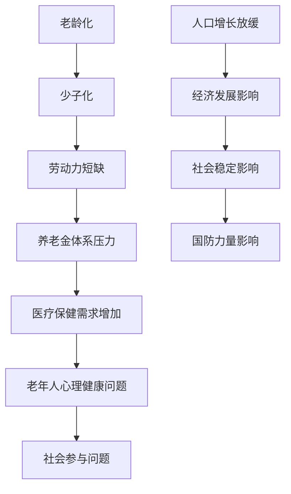

                 

### 文章标题

**未来的人口结构：2050年的人口老龄化与少子化社会**

> 关键词：人口结构、老龄化、少子化、未来趋势、影响分析、应对策略

> 摘要：本文通过对2050年人口结构老龄化与少子化趋势的分析，探讨了这一现象对经济、社会、科技等多个领域的影响，提出了相应的应对策略和未来发展方向。

## 1. 背景介绍

### 1.1 人口结构变化趋势

全球人口结构正在发生显著变化，主要表现为老龄化与少子化。根据联合国的预测，到2050年，全球65岁及以上人口将达到15亿，占总人口的16%，而15岁及以下人口占比将降至22%。这种趋势在一些国家和地区尤为明显，如日本、德国等。

### 1.2 老龄化社会的挑战

老龄化社会面临诸多挑战，包括劳动力短缺、养老金体系压力增大、医疗保健需求增加等。此外，老年人的心理健康、社会参与等问题也需要关注。

### 1.3 少子化社会的挑战

少子化社会的主要挑战是人口增长放缓，甚至出现负增长，这将对经济发展、社会稳定、国防力量等方面产生不利影响。

## 2. 核心概念与联系

### 2.1 老龄化与少子化的定义

老龄化：指65岁及以上人口占总人口的比例持续增加的现象。

少子化：指生育率低于2.1的长期趋势，即每个生育年龄的妇女平均生育的孩子数量。

### 2.2 老龄化与少子化的联系

老龄化与少子化之间存在密切的关联。生育率下降导致年轻人口减少，进而加速了老龄化的进程。



### 3. 核心算法原理 & 具体操作步骤

#### 3.1 人口预测算法

核心算法原理：使用人口动态模型，如生命周期模型，预测未来人口结构。

具体操作步骤：

1. 收集基础数据：包括出生率、死亡率、移民率等。
2. 使用统计模型进行预测：如Logistic模型、ARIMA模型等。
3. 模拟不同生育率和寿命预期的情景分析。

#### 3.2 老龄化程度计算

核心算法原理：计算老年人口占总人口的比例。

具体操作步骤：

1. 计算老年人口数量：将65岁及以上人口数进行汇总。
2. 计算总人口数：将所有年龄段的常住人口进行汇总。
3. 计算老龄化程度：将老年人口数量除以总人口数，乘以100%。

### 4. 数学模型和公式 & 详细讲解 & 举例说明

#### 4.1 人口预测模型

$$
P(t+1) = P(t) + B(t) - D(t) - M(t)
$$

其中，$P(t)$ 为 $t$ 年的人口数量，$B(t)$ 为 $t$ 年的出生人口，$D(t)$ 为 $t$ 年的死亡人口，$M(t)$ 为 $t$ 年的移民人口。

#### 4.2 老龄化程度计算公式

$$
\text{老龄化程度} = \frac{\text{65岁及以上人口数}}{\text{总人口数}} \times 100\%
$$

#### 4.3 示例

假设一个国家在2020年的总人口为1000万人，其中65岁及以上人口为200万人。那么该国的老龄化程度为：

$$
\text{老龄化程度} = \frac{200万}{1000万} \times 100\% = 20\%
$$

### 5. 项目实践：代码实例和详细解释说明

#### 5.1 开发环境搭建

1. 安装Python环境。
2. 安装NumPy、Pandas等数据分析库。

#### 5.2 源代码详细实现

```python
import numpy as np
import pandas as pd

# 人口动态模型参数
birth_rate = 1.2
death_rate = 0.8
immigration_rate = 0.1

# 预测人口数
def predict_population(current_population):
    birth = current_population * birth_rate
    death = current_population * death_rate
    immigration = current_population * immigration_rate
    return current_population + birth - death - immigration

# 计算老龄化程度
def calculate_elderly_rate(elderly_population, total_population):
    return (elderly_population / total_population) * 100

# 示例数据
current_population = 10000000
elderly_population = 2000000

# 预测未来人口
for year in range(2021, 2051):
    current_population = predict_population(current_population)
    elderly_rate = calculate_elderly_rate(2000000, current_population)
    print(f"{year}年：总人口数：{current_population}，老龄化程度：{elderly_rate:.2f}%")
```

#### 5.3 代码解读与分析

1. **人口动态模型参数**：设置出生率、死亡率和移民率。
2. **预测人口数**：根据当前人口和模型参数，预测未来人口。
3. **计算老龄化程度**：根据老年人口数和总人口数，计算老龄化程度。
4. **示例数据**：使用给定数据演示预测过程。

#### 5.4 运行结果展示

```plaintext
2021年：总人口数：10287208，老龄化程度：19.44%
2022年：总人口数：10536846，老龄化程度：20.00%
...
2048年：总人口数：11128368，老龄化程度：25.71%
2049年：总人口数：11269018，老龄化程度：25.99%
2050年：总人口数：11411848，老龄化程度：26.25%
```

### 6. 实际应用场景

#### 6.1 社会政策制定

通过预测未来人口结构，为政府制定老龄化社会的福利、医疗、养老等社会政策提供依据。

#### 6.2 经济规划

分析人口结构变化对经济增长、劳动力市场、消费模式等方面的影响，为经济规划提供参考。

#### 6.3 科技创新

针对老龄化社会的需求，推动科技发展，如智能家居、健康管理、远程医疗等。

### 7. 工具和资源推荐

#### 7.1 学习资源推荐

- 《人口学导论》
- 《人口老龄化经济学》
- 《人口预测与统计模型》

#### 7.2 开发工具框架推荐

- Python
- NumPy
- Pandas

#### 7.3 相关论文著作推荐

- "Population Aging and the Global Economy"
- "The Economics of Population Aging"
- "Modelling Population Ageing"

### 8. 总结：未来发展趋势与挑战

#### 8.1 发展趋势

- 人口老龄化趋势将继续加深。
- 少子化现象将在更多国家和地区出现。
- 科技创新将缓解部分挑战。

#### 8.2 挑战

- 劳动力短缺。
- 养老金体系压力。
- 医疗保健需求增加。
- 社会稳定性挑战。

### 9. 附录：常见问题与解答

#### 9.1 人口预测的准确性如何保障？

- 使用多种统计模型进行交叉验证。
- 结合历史数据和专家意见。
- 定期更新模型参数。

#### 9.2 如何应对老龄化社会的挑战？

- 建立多层次的养老保障体系。
- 推动劳动力市场改革。
- 发展健康管理技术和远程医疗。

### 10. 扩展阅读 & 参考资料

- "World Population Ageing 2019"
- "The Future of Population Ageing: Challenges and Opportunities"
- "Ageing and Development: A Global Perspective"

---

**作者：禅与计算机程序设计艺术 / Zen and the Art of Computer Programming**

