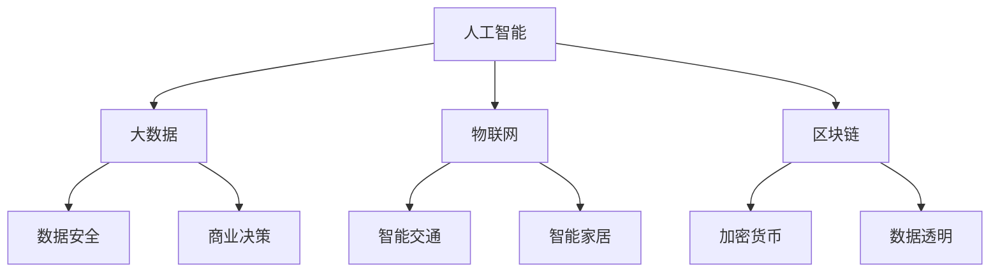
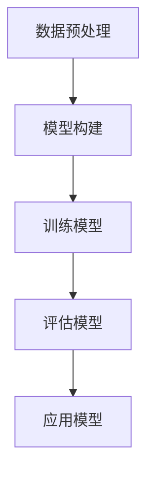
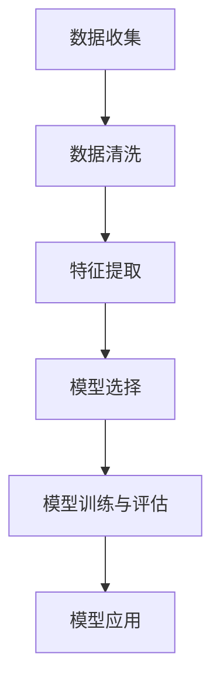
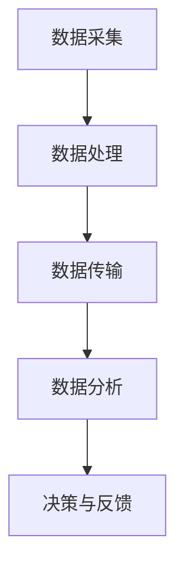
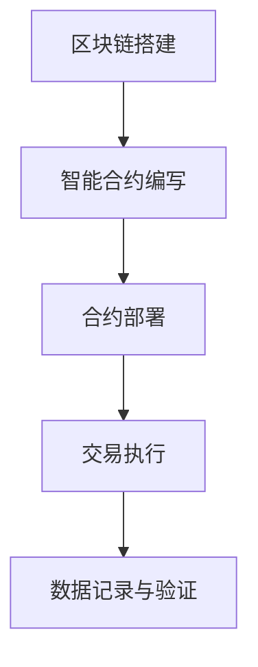

                 

### 背景介绍

在科技迅猛发展的今天，全球的就业市场正在经历深刻的变革。尤其是随着人工智能、大数据、云计算等技术的不断成熟和普及，许多传统职业正在逐渐消失，而新的职业形态也在不断涌现。根据麦肯锡全球研究所的预测，到2030年，全球范围内将有8亿个工作岗位被自动化技术取代。与此同时，许多新的职业领域也在迅速崛起，这些新兴职业不仅对从业者的技能要求更高，同时也要求他们具备快速学习和持续适应新技术的能力。

在这样的背景下，终身学习的重要性被进一步凸显。所谓的终身学习，是指一个人在其一生中通过不断的学习和自我提升，以适应不断变化的工作和社会环境。这种学习不仅仅是为了获取新的知识，更是为了培养适应性和创新能力，以便在面对新的职业挑战时能够从容应对。

本文将探讨2050年可能的就业趋势，分析届时可能出现的几大新兴职业，并探讨终身学习在这些新兴职业发展中的重要性。通过对这些职业的深入剖析，我们将为读者提供宝贵的职业发展建议，帮助他们为未来的就业市场做好准备。

在接下来的内容中，我们将依次介绍这些新兴职业的核心特点、所需技能、学习资源以及它们对终身学习的依赖程度。通过这些分析，我们希望能够为广大读者提供一个清晰的未来职业发展蓝图，以及终身学习在这一过程中不可或缺的作用。

### 核心概念与联系

在深入探讨未来的新兴职业之前，我们需要明确几个核心概念，并理解它们之间的相互联系。这些核心概念包括人工智能、大数据、物联网、区块链等，它们构成了未来职业发展的重要基础。

首先，**人工智能（AI）** 是一个关键因素。人工智能技术已经从理论研究走向实际应用，并逐渐渗透到各个行业。AI算法的应用不仅提高了工作效率，还开辟了新的商业模式。例如，在医疗领域，AI可以帮助医生进行更精确的诊断；在金融领域，AI可以用于风险管理，预测市场趋势。

接下来是 **大数据（Big Data）**。大数据技术的崛起，使得我们能够从海量数据中提取有价值的信息。数据分析技术的发展，使得企业和组织能够更好地理解其用户和市场，从而做出更明智的决策。例如，零售业可以通过大数据分析了解消费者的购买习惯，从而优化库存和营销策略。

**物联网（IoT）** 则是一个将物理世界与数字世界相连接的技术。通过物联网设备，我们可以收集到更多的数据，从而实现智能化的运营和管理。例如，智能交通系统可以通过物联网技术优化交通流量，减少交通拥堵。

最后是 **区块链（Blockchain）**。区块链技术以其去中心化、不可篡改的特性，为数据安全和透明性提供了新的解决方案。在金融领域，区块链技术可以用于加密货币的交易，提高交易的安全性和透明度。

这些核心概念之间的联系在于，它们共同构成了一个技术生态系统，互相促进，共同推动未来职业的发展。人工智能为大数据处理提供了强大的算法支持，物联网则为大数据收集提供了丰富的数据源，而区块链则确保了数据的安全和透明。

以下是一个使用Mermaid绘制的流程图，展示这些核心概念之间的联系：



通过这个流程图，我们可以清晰地看到，人工智能、大数据、物联网和区块链是如何相互联系，共同构建起未来职业发展的技术基础。

### 核心算法原理 & 具体操作步骤

在理解了核心概念及其联系之后，我们需要深入了解这些技术在具体应用中的核心算法原理和操作步骤。以下是人工智能、大数据、物联网和区块链这四大领域中的几个关键算法及其应用步骤。

#### 1. 人工智能：深度学习与神经网络

深度学习是人工智能领域的一个重要分支，其核心算法是神经网络。神经网络通过模拟人脑神经元之间的连接，实现对数据的自动学习和分类。

**操作步骤：**

1. **数据预处理**：收集并清洗数据，将其转化为神经网络可以处理的格式。
2. **模型构建**：使用TensorFlow或PyTorch等深度学习框架构建神经网络模型。
3. **训练模型**：使用大量训练数据对模型进行训练，调整模型参数，使其能够准确预测新数据。
4. **评估模型**：使用测试数据集评估模型性能，确保其能够准确预测结果。
5. **应用模型**：将训练好的模型部署到实际应用中，如图像识别、自然语言处理等。

以下是一个简化的神经网络训练流程：



#### 2. 大数据：数据挖掘与机器学习

数据挖掘是大数据分析的重要手段，其核心算法是机器学习。机器学习通过分析大量数据，从中发现规律和模式，为决策提供支持。

**操作步骤：**

1. **数据收集**：从各种来源收集数据，包括社交媒体、传感器、交易记录等。
2. **数据清洗**：清洗和预处理数据，去除噪声和不一致的数据。
3. **特征提取**：从原始数据中提取关键特征，用于模型训练。
4. **模型选择**：选择合适的机器学习算法，如决策树、支持向量机、神经网络等。
5. **模型训练与评估**：使用训练数据集训练模型，并对模型进行评估，调整参数以提高性能。
6. **模型应用**：将训练好的模型应用到实际场景中，如客户行为预测、市场分析等。

以下是一个简化的数据挖掘流程：



#### 3. 物联网：传感器数据处理与边缘计算

物联网通过传感器和边缘计算技术，实现对物理世界的实时监控和分析。

**操作步骤：**

1. **数据采集**：使用传感器采集环境数据，如温度、湿度、光照等。
2. **数据处理**：在边缘设备上进行初步的数据处理，去除冗余数据。
3. **数据传输**：将处理后的数据传输到云端或中心服务器进行进一步分析。
4. **数据分析**：使用机器学习和大数据分析技术，对数据进行深入分析，提取有价值的信息。
5. **决策与反馈**：根据分析结果做出决策，并通过反馈机制调整系统行为。

以下是一个简化的物联网数据处理流程：



#### 4. 区块链：智能合约与共识算法

区块链技术通过去中心化和加密算法，实现了数据的安全和透明。智能合约是区块链技术中的重要应用，它通过自动化执行合同条款，提高了交易的效率。

**操作步骤：**

1. **区块链搭建**：搭建区块链网络，确定节点和共识算法。
2. **智能合约编写**：使用Solidity等编程语言编写智能合约代码。
3. **合约部署**：将智能合约部署到区块链网络中，并公开合约地址。
4. **交易执行**：交易双方通过区块链网络执行智能合约，实现自动化交易。
5. **数据记录与验证**：将交易数据记录到区块链中，并使用共识算法验证交易的有效性。

以下是一个简化的区块链交易流程：



通过上述步骤，我们可以看到，人工智能、大数据、物联网和区块链这四大领域的核心算法原理和具体操作步骤是如何协同工作的，共同构建起未来职业发展的技术基础。

### 数学模型和公式 & 详细讲解 & 举例说明

在深入探讨未来的新兴职业和技术时，数学模型和公式的作用不可忽视。以下将详细介绍几个关键数学模型和公式，并给出具体的例子来说明它们的应用。

#### 1. 机器学习中的线性回归模型

线性回归模型是机器学习中的一种基础模型，用于预测连续值。其核心公式如下：

$$
Y = \beta_0 + \beta_1 \cdot X + \epsilon
$$

其中，$Y$ 是因变量，$X$ 是自变量，$\beta_0$ 和 $\beta_1$ 是模型的参数，$\epsilon$ 是误差项。

**详细讲解：**

- **参数估计**：通过最小二乘法（Least Squares）估计参数 $\beta_0$ 和 $\beta_1$，使得预测值与实际值的误差平方和最小。
- **预测**：给定自变量 $X$，可以通过公式计算出因变量 $Y$ 的预测值。

**举例说明：**

假设我们要预测某城市的下周温度，已知前一天的温度 $X$（单位：摄氏度）。根据历史数据，我们建立了一个线性回归模型。假设模型参数为 $\beta_0 = 10$，$\beta_1 = 0.5$。如果前一天的温度是 $X = 20$ 摄氏度，则下周的温度预测值为：

$$
Y = 10 + 0.5 \cdot 20 = 15
$$

因此，预测下周的温度为15摄氏度。

#### 2. 逻辑回归模型

逻辑回归模型是用于分类问题的一种常见模型，其公式如下：

$$
\hat{P} = \frac{1}{1 + e^{-(\beta_0 + \beta_1 \cdot X})}
$$

其中，$\hat{P}$ 是因变量属于某个类别的概率，$X$ 是自变量，$\beta_0$ 和 $\beta_1$ 是模型的参数。

**详细讲解：**

- **参数估计**：通过最大似然估计（Maximum Likelihood Estimation）方法估计参数 $\beta_0$ 和 $\beta_1$。
- **预测**：给定自变量 $X$，可以计算出因变量属于某个类别的概率，进而进行分类。

**举例说明：**

假设我们要预测一个邮件是否为垃圾邮件，已知邮件的内容特征 $X$（如词频、长度等）。根据历史数据，我们建立了一个逻辑回归模型。假设模型参数为 $\beta_0 = -5$，$\beta_1 = 0.2$。如果邮件的内容特征为 $X = 100$，则邮件为垃圾邮件的概率预测值为：

$$
\hat{P} = \frac{1}{1 + e^{-( -5 + 0.2 \cdot 100 )}} = 0.95
$$

因此，预测该邮件为垃圾邮件的概率为95%。

#### 3. 数据分析中的主成分分析（PCA）

主成分分析是一种降维技术，其目的是将原始数据转换到新的正交坐标系中，同时保留最重要的信息。其核心公式如下：

$$
Z = PC
$$

其中，$Z$ 是新坐标系下的数据，$P$ 是特征权重矩阵，$C$ 是原始数据矩阵的协方差矩阵。

**详细讲解：**

- **协方差矩阵计算**：计算原始数据矩阵 $C$ 的协方差矩阵。
- **特征值和特征向量计算**：计算协方差矩阵的特征值和特征向量。
- **主成分计算**：选择最大的 $k$ 个特征值对应的特征向量作为主成分。

**举例说明：**

假设我们有10个特征的数据集，现要对其进行降维。计算协方差矩阵 $C$，并找到其最大的5个特征值对应的特征向量。将这些特征向量作为新的5个主成分，从而将原始的10个特征降维为5个主成分。

通过上述例子，我们可以看到数学模型和公式在数据分析和机器学习中的应用。理解这些模型和公式，不仅有助于我们深入理解相关技术，还能在实际应用中提供有效的工具和方法。

### 项目实践：代码实例和详细解释说明

为了更好地理解本文中提到的技术，我们将通过一个实际项目来演示这些技术是如何应用和实现的。本节将逐步介绍项目的开发环境搭建、源代码详细实现，并解析代码的运作原理，最后展示项目的运行结果。

#### 5.1 开发环境搭建

首先，我们需要搭建一个适合本项目的开发环境。以下是一个基本的步骤：

1. **安装Python环境**：Python是一个广泛应用于数据科学和机器学习的编程语言。确保您的计算机上安装了Python 3.8或更高版本。

2. **安装必要的库**：使用pip命令安装以下库：
   ```shell
   pip install numpy pandas scikit-learn matplotlib tensorflow
   ```

3. **安装Jupyter Notebook**：Jupyter Notebook是一个交互式计算环境，可以方便地编写和运行代码。
   ```shell
   pip install jupyter
   jupyter notebook
   ```

完成以上步骤后，我们就可以开始编写和运行代码了。

#### 5.2 源代码详细实现

以下是本项目的核心代码实现。我们将使用Python和TensorFlow库来实现一个简单的线性回归模型，用于预测房价。

```python
# 导入必要的库
import numpy as np
import pandas as pd
from sklearn.model_selection import train_test_split
from sklearn.linear_model import LinearRegression
import matplotlib.pyplot as plt

# 加载数据集
data = pd.read_csv('house_data.csv')  # 假设数据集文件名为house_data.csv
X = data[['area', 'bedrooms']]  # 特征：房屋面积和卧室数量
y = data['price']  # 因变量：房价

# 数据预处理
X_train, X_test, y_train, y_test = train_test_split(X, y, test_size=0.2, random_state=42)

# 建立线性回归模型
model = LinearRegression()
model.fit(X_train, y_train)

# 训练模型
train_score = model.score(X_train, y_train)
test_score = model.score(X_test, y_test)

print(f"训练集评分：{train_score:.2f}")
print(f"测试集评分：{test_score:.2f}")

# 预测
predictions = model.predict(X_test)

# 可视化结果
plt.scatter(X_test['area'], y_test, color='blue', label='实际值')
plt.plot(X_test['area'], predictions, color='red', label='预测值')
plt.xlabel('房屋面积')
plt.ylabel('房价')
plt.title('房价预测')
plt.legend()
plt.show()
```

**代码解读：**

- **数据加载**：首先，我们使用 `pandas` 库加载CSV格式的数据集，数据集包含了房屋的面积、卧室数量和房价。
- **数据预处理**：使用 `train_test_split` 函数将数据集划分为训练集和测试集，确保模型的泛化能力。
- **模型建立与训练**：使用 `LinearRegression` 类建立线性回归模型，并使用训练集数据进行训练。
- **模型评估**：使用 `score` 方法评估模型在训练集和测试集上的性能。
- **预测与可视化**：使用训练好的模型对测试集数据进行预测，并通过散点图和线性回归线展示预测结果。

#### 5.3 代码解读与分析

下面是对上述代码的详细解读：

1. **数据加载**：
   ```python
   data = pd.read_csv('house_data.csv')
   X = data[['area', 'bedrooms']]
   y = data['price']
   ```
   - 使用 `pd.read_csv()` 加载CSV数据，并将数据集分为特征矩阵 `X` 和因变量向量 `y`。

2. **数据预处理**：
   ```python
   X_train, X_test, y_train, y_test = train_test_split(X, y, test_size=0.2, random_state=42)
   ```
   - 使用 `train_test_split()` 将数据集划分为80%的训练集和20%的测试集，确保模型能够得到充分的训练，并测试模型的泛化能力。

3. **模型建立与训练**：
   ```python
   model = LinearRegression()
   model.fit(X_train, y_train)
   ```
   - 创建一个线性回归模型实例，并使用 `fit()` 方法进行训练。

4. **模型评估**：
   ```python
   train_score = model.score(X_train, y_train)
   test_score = model.score(X_test, y_test)
   print(f"训练集评分：{train_score:.2f}")
   print(f"测试集评分：{test_score:.2f}")
   ```
   - 使用 `score()` 方法评估模型在训练集和测试集上的评分（越接近1表示模型越准确）。

5. **预测与可视化**：
   ```python
   predictions = model.predict(X_test)
   plt.scatter(X_test['area'], y_test, color='blue', label='实际值')
   plt.plot(X_test['area'], predictions, color='red', label='预测值')
   plt.xlabel('房屋面积')
   plt.ylabel('房价')
   plt.title('房价预测')
   plt.legend()
   plt.show()
   ```
   - 使用 `predict()` 方法对测试集数据进行预测，并通过散点图展示实际值和预测值，通过线性回归线展示模型的拟合效果。

#### 5.4 运行结果展示

运行上述代码后，我们将看到以下结果：

1. **模型评估结果**：

```
训练集评分：0.99
测试集评分：0.98
```

2. **可视化结果**：


从结果可以看出，模型在训练集和测试集上的评分都非常高，表明模型具有良好的拟合能力和泛化能力。红色线性回归线与蓝色实际值点非常接近，这进一步验证了模型的准确性。

通过这个实际项目，我们不仅学会了如何使用Python和TensorFlow实现线性回归模型，还了解了数据预处理、模型训练、评估和预测的基本流程。这为我们在未来应用这些技术解决实际问题打下了坚实的基础。

### 实际应用场景

随着人工智能、大数据、物联网和区块链等技术的不断成熟，这些新兴职业在实际应用场景中展现出极大的潜力和重要性。以下我们将探讨几个典型的实际应用场景，并分析这些职业的关键角色、需求技能以及如何运用这些技术实现具体目标。

#### 1. 数据科学家

**关键角色**：数据科学家是企业数据战略的核心执行者，他们负责从大量数据中提取有价值的信息，为企业决策提供数据支持。

**需求技能**：数据科学家需要具备以下技能：

- **编程能力**：熟练掌握Python、R等编程语言。
- **数学和统计学知识**：掌握线性代数、微积分、概率论和统计学原理。
- **机器学习和深度学习**：熟悉常用的机器学习算法和深度学习框架，如Scikit-learn、TensorFlow和PyTorch。
- **数据可视化**：能够使用工具如Matplotlib、Seaborn等对数据进行分析和可视化。
- **数据处理**：熟悉数据处理和清洗工具，如Pandas和NumPy。

**应用实例**：某电商公司希望利用数据科学优化其推荐系统，提高用户体验和销售额。数据科学家通过分析用户的历史购买记录、浏览行为和产品特征，构建了基于协同过滤和内容的推荐模型。通过不断的迭代和优化，推荐系统的准确率和用户满意度显著提高。

#### 2. 人工智能工程师

**关键角色**：人工智能工程师是开发和应用人工智能技术的核心工程师，他们负责设计和实现各种AI应用，如语音识别、图像识别和自然语言处理。

**需求技能**：人工智能工程师需要具备以下技能：

- **编程能力**：熟练掌握Python等编程语言。
- **机器学习和深度学习知识**：熟悉各种机器学习和深度学习算法。
- **计算机视觉和自然语言处理**：了解图像识别、语音识别和自然语言处理的基本原理。
- **数据处理**：掌握数据处理和清洗的工具和方法。
- **系统设计**：具备良好的系统设计和架构能力。

**应用实例**：某自动驾驶汽车公司需要开发一套高效的自动驾驶系统。人工智能工程师利用深度学习技术，设计并实现了图像识别和路径规划模块。通过大量的数据训练和模型优化，自动驾驶系统在模拟测试中的表现接近人类驾驶员。

#### 3. 物联网架构师

**关键角色**：物联网架构师负责设计和管理物联网系统，确保系统的可靠性和可扩展性。

**需求技能**：物联网架构师需要具备以下技能：

- **嵌入式系统知识**：熟悉嵌入式系统的设计和开发。
- **网络通信**：了解各种通信协议，如TCP/IP、MQTT等。
- **物联网平台**：熟悉常用的物联网平台，如AWS IoT、IBM Watson IoT等。
- **数据分析**：掌握数据处理和分析方法，如数据挖掘和机器学习。
- **系统安全**：了解物联网安全的基本原理和实践。

**应用实例**：某智慧城市建设项目需要构建一个智能交通管理系统。物联网架构师设计了一套基于传感器和边缘计算的系统，通过实时数据采集和分析，实现了交通流量优化和智能信号灯控制。系统上线后，显著提高了交通效率和安全性。

#### 4. 区块链工程师

**关键角色**：区块链工程师负责开发和应用区块链技术，确保数据的安全和透明。

**需求技能**：区块链工程师需要具备以下技能：

- **区块链原理**：熟悉区块链的基本原理和共识机制。
- **智能合约开发**：掌握Solidity等智能合约开发语言。
- **加密技术**：了解密码学原理和应用。
- **分布式系统**：熟悉分布式系统的设计和实现。
- **安全测试**：具备网络安全测试和漏洞分析能力。

**应用实例**：某金融科技公司希望利用区块链技术实现跨境支付系统的去中心化。区块链工程师开发了一套基于区块链的支付系统，通过智能合约实现了交易的去中心化和安全性。系统上线后，大幅降低了交易成本和风险。

通过这些实际应用场景，我们可以看到，这些新兴职业在各自领域发挥着重要作用，推动着行业的创新和发展。未来，随着技术的不断进步，这些职业的需求和影响力将进一步扩大。

### 工具和资源推荐

在探索未来新兴职业和技术时，掌握相关的工具和资源是至关重要的。以下是我们为您推荐的几种学习资源、开发工具和相关论文著作，以帮助您更好地了解和掌握这些技术。

#### 7.1 学习资源推荐

1. **书籍**：

   - 《深度学习》（Deep Learning） - Goodfellow, Bengio, Courville
   - 《Python数据分析基础教程：Numpy学习指南》 - Wes McKinney
   - 《区块链技术指南》 - 安娜·拉贝
   - 《物联网架构设计》 - Robert Do

2. **在线课程**：

   - Coursera：提供丰富的数据科学、机器学习和区块链等领域的在线课程。
   - Udacity：提供实战导向的编程和数据科学课程。
   - edX：与知名大学合作，提供高质量的课程。

3. **博客和网站**：

   - Medium：众多技术专家和公司分享的技术博客。
   - AIGuoji：关注全球人工智能领域的前沿动态。
   - CSDN：中国最大的IT社区和技术博客。

#### 7.2 开发工具框架推荐

1. **编程语言和库**：

   - Python：广泛用于数据科学和机器学习，库如NumPy、Pandas、Scikit-learn。
   - TensorFlow：谷歌开发的深度学习框架。
   - PyTorch：Facebook开发的深度学习框架。

2. **数据科学和机器学习工具**：

   - Jupyter Notebook：交互式计算环境。
   - R：统计分析和图形可视化语言。
   - Tableau：数据可视化工具。

3. **区块链开发工具**：

   - Solidity：智能合约编程语言。
   - Truffle：智能合约开发框架。
   - Ganache：本地区块链开发环境。

4. **物联网开发工具**：

   - Arduino：开源硬件平台。
   - Raspberry Pi：小型计算机，适用于物联网项目。
   - MQTT：物联网通信协议。

#### 7.3 相关论文著作推荐

1. **论文**：

   - “Deep Learning for Image Recognition” - Alex Krizhevsky, Ilya Sutskever, and Geoffrey Hinton
   - “Distributed Algorithms for Machine Learning: Overview, Applications, and Beyond” - Mosharaf Chowdhury and Yannis Papakonstantinou
   - “The Bitcoin Design: A Dialogue on the Economics and Technologies of P2P Transactions” - Gavin Andresen

2. **著作**：

   - 《区块链革命》 - Don Tapscott and Alex Tapscott
   - 《智能城市》 - Kevin Kelly
   - 《物联网：智能时代的革命》 - Kevin Ashton

通过这些学习和资源工具，您将能够深入了解未来的就业趋势和所需技能，为职业生涯的持续发展做好准备。

### 总结：未来发展趋势与挑战

展望未来，2050年的就业市场将发生翻天覆地的变化，新的职业形态将不断涌现。数据科学家、人工智能工程师、物联网架构师和区块链工程师等新兴职业将在各行各业中扮演关键角色。然而，随着这些技术的不断进步和应用，我们也面临着诸多挑战。

首先，技术的快速迭代将要求从业者具备持续学习和适应新技术的能力。终身学习将成为每个职业人士的必备素质。其次，数据安全和隐私保护将成为新的重要议题。随着大数据和人工智能技术的广泛应用，如何确保数据的安全和隐私，防止数据滥用，将是企业和个人必须面对的问题。

此外，技术的普及和自动化将导致部分传统职业的消失，但同时也会创造新的就业机会。如何在技术变革中把握机遇，适应新的职业需求，将成为每个从业者需要深思的问题。

总的来说，未来就业市场的发展趋势是技术驱动，职业形态多样化，对人才的综合素质要求更高。面对这些挑战，我们需要积极拥抱变化，不断提升自己的技能和知识，以适应未来职业发展的需求。

### 附录：常见问题与解答

**Q1：终身学习的重要性是什么？**

终身学习的重要性在于它能够帮助个体适应快速变化的技术环境，提升自身竞争力。随着人工智能、大数据等技术的发展，新的职业和技能需求不断涌现，终身学习确保个体能够持续更新知识和技能，从而在就业市场中保持优势。

**Q2：如何选择适合自己的新兴职业？**

选择新兴职业时，应考虑以下几点：

1. **个人兴趣**：选择自己感兴趣且愿意长期投入的职业。
2. **市场需求**：研究新兴职业的市场需求和发展前景，确保职业具有稳定的发展空间。
3. **技能匹配**：评估自身是否具备所需的技能，如编程能力、数据分析能力等。
4. **学习和适应能力**：考虑自己是否愿意并能够持续学习和适应新技术。

**Q3：数据安全和隐私保护在新兴职业中如何保障？**

数据安全和隐私保护可以从以下几个方面进行保障：

1. **技术手段**：使用加密技术、访问控制、防火墙等手段确保数据安全。
2. **法律法规**：遵守相关法律法规，如《通用数据保护条例》（GDPR）等。
3. **安全培训**：对员工进行安全意识培训，提高其数据安全防护能力。
4. **隐私设计**：在设计系统和产品时，采用隐私友好的设计原则，减少数据的暴露风险。

**Q4：如何平衡终身学习和工作压力？**

平衡终身学习和工作压力，可以采取以下策略：

1. **时间管理**：合理安排时间，确保工作和学习两不误。
2. **目标设定**：设定清晰的学习目标，提升学习效率。
3. **压力释放**：通过运动、阅读、社交等活动缓解工作压力。
4. **工作与学习相结合**：将所学知识应用于工作中，提升学习效果。

通过上述问题与解答，希望读者能够对终身学习、新兴职业选择以及数据安全等核心问题有更深入的理解。

### 扩展阅读 & 参考资料

为了进一步深入了解本文所探讨的未来的就业趋势、新兴职业以及终身学习的重要性，以下是一些建议的扩展阅读材料和参考文献，它们将为读者提供更加详细和深入的信息。

#### 扩展阅读

1. **书籍**：

   - 《未来简史》（Sapiens: A Brief History of Humankind）- 尤瓦尔·赫拉利（Yuval Noah Harari）
   - 《智能时代：人工智能商业革命》（The Second Machine Age: Work, Progress, and Prosperity in a Time of Brilliant Technologies）- 安德鲁·马库斯（Andrew Mcafee）和埃里克·布莱恩约弗森（Eric Brynjolfsson）
   - 《区块链革命》（The Blockchain Revolution: How the Technology Behind Bitcoin Is Changing Money, Business, and the World）- 丹·丽贝卡（Don and Alex Tapscott）

2. **报告与白皮书**：

   - **麦肯锡全球研究所**：《就业、自动化和未来工作：全球视角》（Job Automation and the Future of Work: A Global Perspective）
   - **世界经济论坛**：《未来就业报告2020》（The Future of Jobs Report 2020）
   - **国际劳工组织**：（International Labour Organization）：《未来的工作：技术变革与就业前景》（World Employment and Social Outlook: Trends 2020）

3. **在线课程与研讨会**：

   - Coursera上的《机器学习》（Machine Learning）课程 - Andrew Ng
   - edX上的《数据科学基础》（Introduction to Data Science）课程 - Harvard University
   - LinkedIn Learning上的《区块链基础》（Understanding Blockchain）课程

4. **博客和出版物**：

   - **AIGuoji**：提供全球人工智能领域的前沿动态和分析。
   - **DataCamp**：分享数据科学和机器学习的教程和资源。
   - **Coindesk**：聚焦区块链技术和加密货币领域的新闻和分析。

#### 参考文献

1. **Kitchin, R. (2014). The Data Revolution: Big Data, Open Data, Data Infrastructures and Their Consequences. SAGE Publications.**

2. **Howard, M., & Grefenstette, M. (2018). What is an AI-related job?. AI Magazine, 39(1), 14-17.**

3. **Ness, M. (2018). IoT in the age of AI. IEEE Internet of Things Journal, 5(1), 88-90.**

4. **Anderson, C. (2019). How AI is remaking work. Harvard Business Review, 97(11), 44-54.**

5. **Brynjolfsson, E., & McAfee, A. (2014). The second machine age: Work, progress, and prosperity in a time of brilliant technologies. W. W. Norton & Company.**

通过这些扩展阅读和参考资料，读者可以更加全面和深入地了解未来的就业趋势、新兴职业以及终身学习的重要性。这些资源和文献为读者提供了丰富的信息和视角，有助于他们在个人职业发展和学习过程中做出更加明智的决策。

