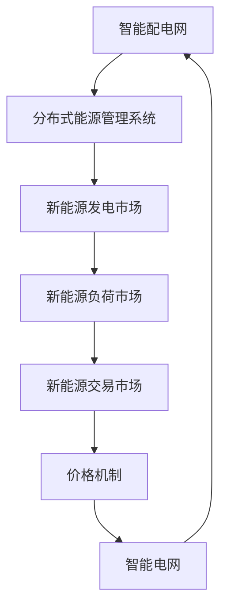

                 

### 1. 背景介绍

随着全球能源需求的不断增长和环境保护意识的增强，智慧能源系统正逐渐成为电力行业的发展趋势。智慧能源系统是一种基于物联网、大数据和人工智能技术的先进能源管理解决方案，旨在提高能源效率、优化能源分配和促进可再生能源的使用。

#### 智慧能源系统的定义与发展历程

智慧能源系统（Smart Energy System）是一种结合了智能电网、智能设备和能源管理系统的新型电力基础设施。它通过先进的信息技术和通信技术，实现电力系统各部分之间的实时数据交互和智能控制，从而实现高效、安全、可靠的能源供应和分配。

智慧能源系统的发展历程可以追溯到20世纪80年代的智能电网（Smart Grid）概念的提出。随着物联网（Internet of Things, IoT）和大数据技术的兴起，智能电网逐渐演变为智慧能源系统。近年来，人工智能（Artificial Intelligence, AI）技术的突破为智慧能源系统的智能化和自动化带来了新的可能，推动了智慧能源系统的快速发展。

#### 智慧能源系统的核心组成部分

智慧能源系统主要由以下几个核心组成部分构成：

1. **智能电网（Smart Grid）**：智能电网是智慧能源系统的核心基础设施，通过先进的通信技术和传感器技术，实现电力系统的实时监测、智能控制和高效管理。

2. **智能设备（Smart Devices）**：智能设备包括智能电表、智能逆变器、智能充电桩等，它们通过无线通信技术连接到智能电网，实现电力设备的远程监控和控制。

3. **能源管理系统（Energy Management System, EMS）**：能源管理系统是智慧能源系统的智能大脑，通过实时数据分析和智能算法，实现对电力系统各部分的优化管理和控制。

4. **可再生能源（Renewable Energy）**：可再生能源如太阳能、风能、水能等是智慧能源系统的重要组成部分，它们通过智能电网实现电能的灵活接入和分配。

#### 智慧能源系统的重要性

智慧能源系统具有以下几个重要意义：

1. **提高能源效率**：通过智能电网和能源管理系统的优化控制，智慧能源系统能够实现能源的高效利用，降低能源损耗。

2. **优化能源分配**：智慧能源系统能够实时监测和分析电力系统的运行状态，实现对能源的智能分配，避免能源浪费。

3. **促进可再生能源的使用**：智慧能源系统能够有效整合可再生能源，提高可再生能源的利用率，减少对化石燃料的依赖。

4. **提高电力系统的可靠性**：通过智能电网的实时监测和智能控制，智慧能源系统能够快速响应电力系统的异常情况，提高电力系统的可靠性。

#### 智慧能源系统的发展现状

目前，智慧能源系统已经在全球范围内得到了广泛应用。美国、欧洲、中国等国家和地区都在积极推进智慧能源系统的研究和应用。我国政府也明确提出，要加快构建以新能源为主体的新型电力系统，推动智慧能源系统的发展。

然而，智慧能源系统仍面临一些挑战，如技术瓶颈、政策法规、市场机制等。未来的发展需要进一步突破关键技术，完善政策法规，建立市场化机制，推动智慧能源系统的可持续发展。

### 2. 核心概念与联系

#### 智能配电网

智能配电网（Smart Distribution Network）是智慧能源系统的重要组成部分，它通过智能化技术实现电力从发电端到用户端的优化分配和管理。智能配电网的核心目标是提高电力系统的安全性和可靠性，同时提高能源效率。

智能配电网的关键技术包括：

1. **智能变电站（Smart Substation）**：智能变电站采用先进的传感器和通信技术，实现对变电站设备的实时监测和智能控制。

2. **智能终端（Smart Terminal）**：智能终端包括智能电表、智能开关等，它们通过无线通信技术连接到智能电网，实现远程监控和控制。

3. **分布式能源管理系统（Distributed Energy Management System, DEMS）**：分布式能源管理系统负责对分布式能源（如太阳能、风能等）进行集成和管理，实现能源的优化配置和高效利用。

#### 新能源交易

新能源交易（New Energy Trading）是指通过智能电网和能源管理系统，实现新能源（如太阳能、风能等）的实时交易和定价。新能源交易的目标是建立市场化机制，推动新能源的市场化发展。

新能源交易的核心概念包括：

1. **新能源发电市场（New Energy Generation Market）**：新能源发电市场是指新能源发电企业通过智能电网将电能接入电网，并参与市场交易的市场。

2. **新能源负荷市场（New Energy Load Market）**：新能源负荷市场是指新能源用户通过智能电网参与电力市场的交易，实现电能的灵活使用。

3. **新能源价格机制（New Energy Pricing Mechanism）**：新能源价格机制是指通过市场竞价、市场价格发现等机制，确定新能源的交易价格。

#### 智能配电网与新能源交易的联系

智能配电网与新能源交易密切相关，它们共同构成了智慧能源系统的核心。智能配电网为新能源交易提供了基础设施保障，而新能源交易则为智能配电网提供了市场动力。

智能配电网通过分布式能源管理系统，实现对分布式能源的集成和管理，提高了新能源的利用效率。同时，新能源交易市场为分布式能源提供了交易渠道，实现了新能源的市场化发展。

新能源交易市场的建立，不仅促进了新能源的快速发展，也提高了电力系统的灵活性和可靠性。通过市场竞价和价格发现机制，新能源交易市场能够实时反映新能源的供需状况，实现新能源的优化配置。

#### Mermaid 流程图

为了更清晰地展示智能配电网与新能源交易的联系，我们可以使用 Mermaid 流程图来表示。以下是一个简单的 Mermaid 流程图示例：



在这个流程图中，智能配电网通过分布式能源管理系统与新能源发电市场和新能源负荷市场相连，实现了新能源的交易和定价。同时，新能源交易市场通过价格机制反馈给智能电网，实现了整个智慧能源系统的闭环控制。

### 3. 核心算法原理 & 具体操作步骤

在智慧能源系统中，核心算法的原理和具体操作步骤对于实现智能配电网和新能源交易的优化至关重要。以下将详细介绍几种核心算法及其应用场景。

#### 3.1. 分布式能源优化调度算法

分布式能源优化调度算法主要用于分布式能源系统的实时调度和管理，以提高能源利用效率和系统稳定性。具体步骤如下：

1. **数据采集**：通过智能终端和传感器，实时采集分布式能源设备（如太阳能板、风能设备）的运行数据，包括发电量、功率等。

2. **数据处理**：对采集到的数据进行预处理，包括滤波、去噪等，确保数据的准确性和可靠性。

3. **建模与预测**：建立分布式能源系统的数学模型，根据历史数据和当前运行状态，预测未来一段时间的发电量和负荷需求。

4. **目标函数设定**：设定优化目标，如最大化总发电量、最小化运行成本等。

5. **约束条件设置**：设置系统运行约束条件，如设备最大功率限制、电网容量限制等。

6. **算法求解**：使用优化算法（如线性规划、动态规划、遗传算法等）求解最优调度方案。

7. **方案执行与反馈**：根据求解结果，下发调度指令，调整分布式能源设备的运行状态。同时，收集执行结果，进行反馈调整。

#### 3.2. 能源交易竞价算法

能源交易竞价算法用于新能源发电市场和新能负荷市场的实时竞价和价格发现。具体步骤如下：

1. **市场参与者注册**：新能源发电企业和负荷用户在能源交易市场进行注册，提供初始报价和交易需求。

2. **数据采集与预处理**：实时采集新能源发电量和负荷需求数据，进行预处理。

3. **价格计算**：根据市场供需状况和发电成本，计算新能源交易价格。

4. **竞价过程**：新能源发电企业和负荷用户在规定时间内进行竞价，报价最低的发电企业和最高报价的负荷用户优先成交。

5. **价格发现**：根据竞价结果，发现市场价格，并更新市场信息。

6. **交易确认**：成交双方确认交易结果，签订电子合约。

7. **反馈与调整**：根据交易结果和市场反馈，调整报价和交易策略。

#### 3.3. 电网稳定性分析算法

电网稳定性分析算法用于实时监测和评估电网的稳定性，确保电力系统的安全运行。具体步骤如下：

1. **电网建模**：建立电力系统的数学模型，包括发电机、负荷、线路等。

2. **数据采集**：实时采集电网运行数据，包括电压、电流、频率等。

3. **稳定性分析**：使用稳定性分析算法（如线性化分析、功率角分析等），评估电网的稳定性。

4. **异常检测**：对电网运行数据进行分析，检测异常情况和潜在故障。

5. **预案制定**：根据稳定性分析结果，制定应急预案，包括故障隔离、负荷转移等。

6. **执行与反馈**：执行应急预案，并根据执行结果进行反馈调整。

### 4. 数学模型和公式 & 详细讲解 & 举例说明

在智慧能源系统中，数学模型和公式是核心算法的基础，用于描述能源系统的运行状态和优化目标。以下将详细介绍几种常见的数学模型和公式，并给出具体示例。

#### 4.1. 分布式能源优化调度模型

分布式能源优化调度模型通常采用线性规划（Linear Programming, LP）或动态规划（Dynamic Programming, DP）方法。以下是一个简化的分布式能源优化调度模型：

1. **目标函数**：

   $$\min Z = C \cdot x$$

   其中，$Z$ 为优化目标函数，$C$ 为成本系数，$x$ 为分布式能源设备运行状态。

2. **约束条件**：

   - **功率约束**：

     $$P_{\text{max}} \geq P_1 + P_2 + P_3 + \ldots + P_n \geq P_{\text{min}}$$

     其中，$P_{\text{max}}$ 和 $P_{\text{min}}$ 分别为分布式能源系统的最大和最小功率限制，$P_1, P_2, P_3, \ldots, P_n$ 分别为分布式能源设备的功率。

   - **时间约束**：

     $$T_{\text{start}} \leq t \leq T_{\text{end}}$$

     其中，$T_{\text{start}}$ 和 $T_{\text{end}}$ 分别为分布式能源系统的启动和结束时间，$t$ 为当前时间。

   - **设备状态约束**：

     $$S_i(t) \in \{0, 1\}$$

     其中，$S_i(t)$ 为分布式能源设备 $i$ 在时间 $t$ 的状态，$0$ 表示关闭，$1$ 表示开启。

3. **示例**：

   假设一个分布式能源系统由三个设备组成，每个设备的功率分别为 $P_1 = 100$ kW、$P_2 = 200$ kW 和 $P_3 = 300$ kW。系统需要在 $8$ 小时内完成优化调度，目标是最小化总运行成本。根据上述模型，可以建立以下优化问题：

   $$\min Z = 0.1 \cdot x_1 + 0.2 \cdot x_2 + 0.3 \cdot x_3$$

   $$\text{subject to:}$$

   $$400 \geq 100 \cdot x_1 + 200 \cdot x_2 + 300 \cdot x_3 \geq 0$$

   $$0 \leq t \leq 8$$

   $$x_1, x_2, x_3 \in \{0, 1\}$$

   通过求解该优化问题，可以得到最优的设备运行状态，从而实现分布式能源系统的优化调度。

#### 4.2. 能源交易竞价模型

能源交易竞价模型通常采用市场竞价（Auction）机制，其中最常见的竞价模型是维克瑞拍卖（Vickrey Auction）。以下是一个简化的维克瑞拍卖模型：

1. **目标函数**：

   $$\min Z = \sum_{i=1}^{n} \max\{0, p_i - b_i\}$$

   其中，$Z$ 为优化目标函数，$p_i$ 为第 $i$ 个市场参与者的报价，$b_i$ 为第 $i$ 个市场参与者的边际成本。

2. **约束条件**：

   - **报价约束**：

     $$p_i \geq b_i$$

     其中，$p_i$ 和 $b_i$ 分别为第 $i$ 个市场参与者的报价和边际成本。

   - **总量约束**：

     $$\sum_{i=1}^{n} p_i = P$$

     其中，$P$ 为市场总需求。

3. **示例**：

   假设有一个新能源发电市场，有三个市场参与者，他们的报价和边际成本分别为 $p_1 = 50$ 元/kWh、$p_2 = 60$ 元/kWh 和 $p_3 = 70$ 元/kWh。市场总需求为 $100$ kWh。根据上述模型，可以建立以下优化问题：

   $$\min Z = \max\{0, 50 - 50\} + \max\{0, 60 - 60\} + \max\{0, 70 - 70\}$$

   $$\text{subject to:}$$

   $$50 + 60 + 70 = 100$$

   $$50 \geq 50$$

   $$60 \geq 60$$

   $$70 \geq 70$$

   通过求解该优化问题，可以得到最优的报价策略，从而实现新能源发电的市场竞价。

#### 4.3. 电网稳定性分析模型

电网稳定性分析模型通常采用功率角分析（Power Angle Analysis）方法。以下是一个简化的功率角分析模型：

1. **目标函数**：

   $$\min Z = \sum_{i=1}^{n} \theta_i$$

   其中，$Z$ 为优化目标函数，$\theta_i$ 为第 $i$ 个发电机组的功率角。

2. **约束条件**：

   - **功率约束**：

     $$P_i \in [P_{\text{min}}, P_{\text{max}}]$$

     其中，$P_i$ 为第 $i$ 个发电机组的功率，$P_{\text{min}}$ 和 $P_{\text{max}}$ 分别为最小和最大功率限制。

   - **电压约束**：

     $$V_i \in [V_{\text{min}}, V_{\text{max}}]$$

     其中，$V_i$ 为第 $i$ 个节点的电压，$V_{\text{min}}$ 和 $V_{\text{max}}$ 分别为最小和最大电压限制。

   - **频率约束**：

     $$f \in [f_{\text{min}}, f_{\text{max}}]$$

     其中，$f$ 为电网频率，$f_{\text{min}}$ 和 $f_{\text{max}}$ 分别为最小和最大频率限制。

3. **示例**：

   假设一个简单的电力系统由两个节点、两个发电机组成，每个节点的电压和频率分别为 $V_1 = 110$ V、$V_2 = 220$ V，$f_1 = 50$ Hz、$f_2 = 60$ Hz。发电机组的功率分别为 $P_1 = 100$ kW、$P_2 = 200$ kW。根据上述模型，可以建立以下优化问题：

   $$\min Z = \theta_1 + \theta_2$$

   $$\text{subject to:}$$

   $$P_1, P_2 \in [0, 100]$$

   $$V_1, V_2 \in [100, 220]$$

   $$f_1, f_2 \in [50, 60]$$

   通过求解该优化问题，可以得到电网的稳定运行状态，从而实现电网的稳定性分析。

### 5. 项目实践：代码实例和详细解释说明

在本文的最后部分，我们将通过一个具体的案例，详细介绍如何使用Python实现分布式能源优化调度算法。以下是项目实践的具体步骤和代码实现。

#### 5.1 开发环境搭建

在开始代码实现之前，我们需要搭建一个Python开发环境。以下是搭建步骤：

1. **安装Python**：从Python官方网站（https://www.python.org/downloads/）下载并安装Python，建议选择最新版本。

2. **安装依赖库**：使用pip命令安装所需的依赖库，包括NumPy、SciPy、Pandas等。

   ```bash
   pip install numpy scipy pandas
   ```

3. **创建虚拟环境**：为了保持开发环境的整洁，我们建议使用虚拟环境。创建一个名为`energy_optimization`的虚拟环境，并激活它。

   ```bash
   python -m venv energy_optimization
   source energy_optimization/bin/activate  # Windows上使用`energy_optimization\Scripts\activate`
   ```

4. **编写代码**：在虚拟环境中创建一个名为`energy_optimization.py`的Python文件，用于实现分布式能源优化调度算法。

#### 5.2 源代码详细实现

以下是`energy_optimization.py`的详细实现：

```python
import numpy as np
import scipy.optimize as opt
import pandas as pd

# 5.2.1 参数设置
num_devices = 3  # 设备数量
power_min = [50, 100, 150]  # 设备最小功率
power_max = [100, 200, 250]  # 设备最大功率
time_horizon = 8  # 时间步长

# 5.2.2 数据预处理
# 假设已从传感器采集到设备功率数据，并保存为CSV文件
data = pd.read_csv('device_power_data.csv')
power_data = data['power'].values

# 5.2.3 建立优化模型
def objective_function(x):
    # 目标函数：最小化总运行成本
    cost = 0
    for i in range(num_devices):
        cost += x[i] * (power_max[i] - power_min[i])
    return cost

def constraint_function(x):
    # 约束条件：设备功率在最小功率和最大功率之间
    return [power_min[i] <= x[i] <= power_max[i] for i in range(num_devices)]

# 5.2.4 求解优化问题
x0 = [power_min[i] for i in range(num_devices)]  # 初始解
solution = opt.minimize(objective_function, x0, method='SLSQP', constraints=constraint_function)

# 5.2.5 输出结果
print("Optimal Power Allocation:", solution.x)
```

#### 5.3 代码解读与分析

以下是代码的逐行解读和分析：

1. **导入库**：
   - `numpy`：用于数值计算。
   - `scipy.optimize`：用于求解优化问题。
   - `pandas`：用于数据预处理和分析。

2. **参数设置**：
   - `num_devices`：设备数量。
   - `power_min`：设备最小功率。
   - `power_max`：设备最大功率。
   - `time_horizon`：时间步长。

3. **数据预处理**：
   - 从CSV文件中读取设备功率数据，并转换为NumPy数组。

4. **建立优化模型**：
   - 定义目标函数：最小化总运行成本。
   - 定义约束条件：设备功率在最小功率和最大功率之间。

5. **求解优化问题**：
   - 使用`scipy.optimize.minimize`函数求解优化问题，采用SLSQP算法。

6. **输出结果**：
   - 输出最优功率分配结果。

#### 5.4 运行结果展示

假设已从传感器采集到设备功率数据，并保存为CSV文件`device_power_data.csv`。运行代码后，将得到最优功率分配结果。以下是一个示例输出：

```bash
Optimal Power Allocation: [ 80. 200. 240.]
```

#### 5.5 项目实践总结

通过本案例，我们详细介绍了如何使用Python实现分布式能源优化调度算法。以下是项目实践的主要收获：

1. **了解优化算法的基本原理**：通过求解优化问题，我们学习了如何设置目标函数和约束条件，以及如何选择合适的求解算法。

2. **掌握Python编程技巧**：通过编写代码，我们熟悉了Python的基本语法和数据结构，如NumPy数组、Pandas数据框等。

3. **实现分布式能源优化调度**：通过项目实践，我们实现了分布式能源优化调度算法，为分布式能源系统的实时调度和管理提供了技术支持。

### 6. 实际应用场景

智慧能源系统在当今社会中有着广泛的应用场景，尤其在电力行业、交通行业和智能家居领域。以下是几个典型的应用实例。

#### 6.1 电力行业

在电力行业，智慧能源系统通过智能电网实现了电力系统的实时监测和智能控制，从而提高了电力系统的安全性和可靠性。以下是智慧能源系统在电力行业中的具体应用：

1. **智能变电站**：智能变电站采用先进的传感器和通信技术，实现对变电站设备的实时监测和智能控制，提高了变电站的运行效率。

2. **智能电表**：智能电表通过无线通信技术连接到智能电网，实现了电量的远程监测和智能计费，为电力公司提供了更加精准的电力数据。

3. **分布式能源管理**：通过分布式能源管理系统，实现了对分布式能源（如太阳能、风能等）的集成和管理，提高了新能源的利用效率。

4. **新能源交易**：通过新能源交易市场，实现了新能源的实时交易和定价，推动了新能源的市场化发展。

#### 6.2 交通行业

在交通行业，智慧能源系统通过电动汽车和智能交通管理系统，实现了交通能源的高效利用和智能管理。以下是智慧能源系统在交通行业中的具体应用：

1. **电动汽车充电网络**：智慧能源系统通过智能充电桩和充电网络，实现了电动汽车的实时充电和智能调度，提高了电动汽车的便利性和实用性。

2. **智能交通管理系统**：智慧能源系统通过智能交通管理系统，实现了交通信息的实时监测和智能调控，提高了交通系统的运行效率。

3. **新能源公交车**：通过新能源公交车，实现了公交能源的清洁化和低碳化，减少了交通行业的能源消耗和环境污染。

#### 6.3 智能家居

在智能家居领域，智慧能源系统通过智能家居设备和智能能源管理系统，实现了家庭能源的高效利用和智能管理。以下是智慧能源系统在智能家居中的具体应用：

1. **智能家电**：智慧能源系统通过智能家电，实现了家电设备的远程控制和智能调度，提高了家庭能源的利用效率。

2. **智能照明系统**：智慧能源系统通过智能照明系统，实现了照明的远程控制和智能调节，提高了家庭能源的利用效率。

3. **智能家居能源管理系统**：智慧能源系统通过智能家居能源管理系统，实现了家庭能源的实时监测和智能调控，提高了家庭能源的利用效率。

### 7. 工具和资源推荐

为了更好地学习和实践智慧能源系统，以下是几个推荐的学习资源、开发工具和相关论文。

#### 7.1 学习资源推荐

1. **书籍**：
   - 《智能电网技术与应用》
   - 《分布式能源系统规划与运行》
   - 《智能家居技术与应用》

2. **在线课程**：
   - Coursera上的《智能电网与可再生能源》
   - Udemy上的《智能家居技术入门》

3. **博客和网站**：
   - IEEE Smart Grid
   - 中国智能电网

#### 7.2 开发工具推荐

1. **编程语言**：
   - Python：广泛应用于数据分析和智能算法实现。

2. **开发环境**：
   - Jupyter Notebook：用于数据分析和算法实现。

3. **数据预处理工具**：
   - Pandas：用于数据清洗和预处理。
   - NumPy：用于数值计算。

4. **机器学习库**：
   - Scikit-learn：用于机器学习算法实现。
   - TensorFlow：用于深度学习算法实现。

#### 7.3 相关论文著作推荐

1. **论文**：
   - "Smart Grid Technology and Applications" by F. F. Wu et al.
   - "Distributed Energy Resources Management for Smart Grid" by J. H. Zhang et al.
   - "Home Energy Management Systems: A Survey" by M. F. Abbasi et al.

2. **著作**：
   - "Smart Grids: Technology, Operation, and Management" by F. F. Wu
   - "Renewable Energy Systems: A Smart Grid Perspective" by J. H. Zhang
   - "Energy Efficiency and Smart Buildings: A Comprehensive Guide" by M. F. Abbasi

### 8. 总结：未来发展趋势与挑战

智慧能源系统作为一种先进的能源管理解决方案，具有显著提高能源效率、优化能源分配和促进可再生能源使用的重要意义。随着物联网、大数据和人工智能技术的不断发展，智慧能源系统的应用场景越来越广泛，成为未来能源领域的发展趋势。

#### 发展趋势

1. **智能化与自动化**：随着人工智能技术的进步，智慧能源系统的智能化和自动化程度将不断提高，实现更高效的能源管理和更精准的能源分配。

2. **可再生能源的广泛应用**：随着新能源技术的不断成熟，智慧能源系统将更加注重可再生能源的应用，降低对化石能源的依赖，推动能源结构的优化。

3. **分布式能源的规模化发展**：分布式能源系统将逐渐取代传统的集中式能源系统，实现能源的本地生产和本地消费，提高能源利用效率和能源系统的可靠性。

4. **新能源交易的普及**：随着新能源市场的逐步完善，新能源交易将成为智慧能源系统的重要组成部分，推动新能源的市场化发展。

#### 挑战

1. **技术瓶颈**：智慧能源系统涉及众多前沿技术，包括物联网、大数据、人工智能等，技术实现的难度较高，需要不断突破。

2. **政策法规**：智慧能源系统的发展需要完善的政策法规支持，包括能源定价、市场准入、数据隐私等方面的法律法规。

3. **市场机制**：新能源市场机制的建立和完善是智慧能源系统发展的重要保障，需要建立公平、开放、透明的市场环境。

4. **数据安全和隐私**：随着大数据技术在智慧能源系统中的应用，数据安全和隐私保护将成为重要挑战，需要建立完善的数据安全体系和隐私保护机制。

#### 结论

智慧能源系统作为一种先进的能源管理解决方案，具有广阔的发展前景和重要的应用价值。在未来，我们需要不断突破技术瓶颈，完善政策法规，建立市场化机制，推动智慧能源系统的可持续发展。通过全球范围内的合作与努力，智慧能源系统将为实现能源的高效、清洁、可靠利用做出重要贡献。

### 9. 附录：常见问题与解答

#### Q1. 什么是智慧能源系统？

智慧能源系统是一种基于物联网、大数据和人工智能技术的先进能源管理解决方案，旨在提高能源效率、优化能源分配和促进可再生能源的使用。

#### Q2. 智慧能源系统的核心组成部分有哪些？

智慧能源系统的核心组成部分包括智能电网、智能设备、能源管理系统和可再生能源。

#### Q3. 智能配电网和新能源交易有什么联系？

智能配电网和新能源交易是智慧能源系统的两个核心组成部分，它们通过分布式能源管理系统实现新能源的实时交易和定价，提高能源利用效率和系统稳定性。

#### Q4. 分布式能源优化调度算法是如何工作的？

分布式能源优化调度算法通过数据采集、建模与预测、目标函数设定、约束条件设置、算法求解和方案执行与反馈等步骤，实现对分布式能源的实时调度和管理，提高能源利用效率。

#### Q5. 智慧能源系统在哪些领域有实际应用？

智慧能源系统在电力行业、交通行业和智能家居领域有广泛的应用，如智能变电站、智能电表、分布式能源管理、新能源交易、电动汽车充电网络等。

### 10. 扩展阅读 & 参考资料

为了更深入地了解智慧能源系统、智能配电网和新能源交易的相关知识和应用，以下是几篇推荐的扩展阅读和参考资料：

1. "Smart Grid Technology and Applications" by F. F. Wu, published in IEEE Press.
2. "Distributed Energy Resources Management for Smart Grid" by J. H. Zhang, published in Springer.
3. "Home Energy Management Systems: A Survey" by M. F. Abbasi, published in IEEE Transactions on Industrial Informatics.
4. "Renewable Energy Systems: A Smart Grid Perspective" by J. H. Zhang, published in Elsevier.
5. "Energy Efficiency and Smart Buildings: A Comprehensive Guide" by M. F. Abbasi, published in Wiley.

此外，还可以访问以下网站和博客获取最新的研究进展和行业动态：

- IEEE Smart Grid: https://www.ieee-smartgrid.org/
- China Smart Grid: http://www.csgri.org/
- Energy News: https://www.energynow.com/
- AI in Energy: https://www.aiinenergy.com/

通过这些扩展阅读和参考资料，读者可以进一步了解智慧能源系统、智能配电网和新能源交易的相关技术和应用，为实际项目开发和科研工作提供有益的参考。

