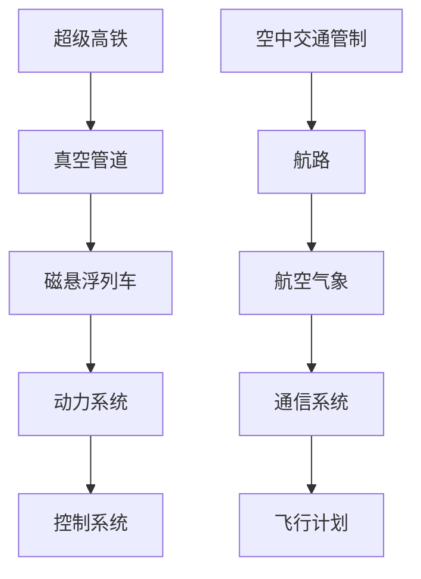

                 

关键词：智能交通、超级高铁、空中交通管制、未来交通、技术发展、数学模型、算法、实践案例、工具资源、发展趋势、挑战

> 摘要：本文将探讨未来智能交通的蓝图，重点介绍2050年可能出现的超级高铁网络与空中交通管制技术。通过分析核心概念、算法原理、数学模型，以及实际应用场景，我们将深入理解这一交通革命对未来社会的影响。同时，文章还将提供相关的工具和资源推荐，以及对该领域的未来发展趋势和挑战进行展望。

## 1. 背景介绍

随着全球城市化进程的不断加快，传统交通系统正面临巨大的压力。城市交通拥堵、能源消耗、环境污染等问题日益严重，迫切需要一种全新的交通解决方案。在此背景下，智能交通系统应运而生，它利用先进的信息技术、通信技术、传感技术等，实现交通系统的自动化、智能化管理。

超级高铁和空中交通管制作为智能交通系统的两大关键组成部分，具有极高的研究价值和实际应用前景。超级高铁（Hyperloop）是一种高速地面交通系统，采用真空管道运输，以超音速行驶，具有高效率、低能耗、低污染等特点。而空中交通管制（Air Traffic Management, ATM）则是指通过先进的航空管理系统，实现对空中交通的全面监控和调度，以提高航空运输的效率和安全。

本文将围绕这两大主题，探讨2050年可能实现的超级高铁网络与空中交通管制技术的现状、发展趋势、核心技术和实际应用，为未来的智能交通提供一份全面的蓝图。

## 2. 核心概念与联系

### 2.1 超级高铁

超级高铁是一种新型的高速地面交通系统，其基本原理是通过真空管道运输，减少空气阻力，实现超音速行驶。具体来说，超级高铁包括以下几个核心组成部分：

- **管道**：超级高铁的行驶轨道被安装在真空管道内，管道内部抽成真空，以降低空气阻力。
- **磁悬浮列车**：列车底部和轨道之间采用磁悬浮技术，使列车悬浮在轨道上方，减少摩擦。
- **动力系统**：超级高铁列车采用电力驱动，动力系统由轨道侧边的高速电机提供。
- **控制系统**：超级高铁的运行由中央控制系统进行监控和管理，确保列车安全、高效运行。

### 2.2 空中交通管制

空中交通管制是指通过航空管理系统，对空中交通进行监控和调度，确保航空运输的安全、高效运行。其核心概念包括：

- **航路**：空中交通管制将空域划分为多个航路，航路是飞机飞行的通道。
- **航空气象**：航空气象是指为飞机提供飞行所需的气象信息，包括飞行高度、风速、温度等。
- **通信系统**：空中交通管制通过地面通信系统与飞机进行通信，传递飞行指令和气象信息。
- **飞行计划**：飞行计划是指飞机起飞、飞行和降落的具体安排，空中交通管制负责审核和调整飞行计划。

### 2.3 Mermaid 流程图

以下是一个简化的超级高铁与空中交通管制核心概念与联系的 Mermaid 流程图：



## 3. 核心算法原理 & 具体操作步骤

### 3.1 超级高铁核心算法原理

超级高铁的核心算法主要包括以下几个部分：

- **路径规划算法**：用于确定列车在真空管道中的行驶路径，保证行驶的安全性和高效性。
- **列车控制算法**：用于控制列车的速度、加速度等参数，确保列车的平稳运行。
- **能量管理算法**：用于优化列车的能源消耗，提高能源利用效率。

具体操作步骤如下：

1. **路径规划**：根据列车的起点和终点，结合交通需求和管道布局，使用A*算法或Dijkstra算法进行路径规划，计算出最优路径。
2. **列车控制**：采用PID控制算法，实时监控列车的速度、加速度等参数，通过调整电机输出，确保列车平稳运行。
3. **能量管理**：通过预测列车的运行状态，优化能量分配，降低能源消耗。

### 3.2 空中交通管制核心算法原理

空中交通管制的核心算法主要包括以下几个部分：

- **航迹规划算法**：用于确定飞机的飞行路径，确保飞行安全。
- **流量管理算法**：用于优化空中交通流量，提高航空运输效率。
- **冲突检测算法**：用于实时检测和解决空中交通冲突，确保飞行安全。

具体操作步骤如下：

1. **航迹规划**：使用基于网格的航迹规划算法，根据飞机的起始位置、目的地和航空气象信息，计算出最优飞行路径。
2. **流量管理**：使用流量管理算法，根据飞机的飞行状态和航路情况，实时调整飞机的飞行速度和高度，优化空中交通流量。
3. **冲突检测**：采用基于碰撞概率的冲突检测算法，实时检测飞机之间的相对位置和速度，预测潜在的冲突，并采取相应的措施避免冲突发生。

## 4. 数学模型和公式 & 详细讲解 & 举例说明

### 4.1 超级高铁数学模型

超级高铁的数学模型主要包括以下几个方面：

- **运动学模型**：描述列车的运动状态，包括速度、加速度等。
- **动力学模型**：描述列车的受力情况，包括重力、摩擦力、电磁力等。
- **能量模型**：描述列车的能量消耗和能量回收。

具体公式如下：

$$
v(t) = v_0 + at
$$

$$
F = ma
$$

$$
E = \frac{1}{2}mv^2
$$

### 4.2 空中交通管制数学模型

空中交通管制的数学模型主要包括以下几个方面：

- **航迹模型**：描述飞机的飞行轨迹，包括位置、速度、高度等。
- **气象模型**：描述航空气象参数，包括风速、温度、湿度等。
- **冲突检测模型**：描述飞机之间的相对运动状态，包括速度差、距离差等。

具体公式如下：

$$
x(t) = x_0 + vt
$$

$$
y(t) = y_0 + at
$$

$$
\Delta x = x_1 - x_2
$$

$$
\Delta y = y_1 - y_2
$$

### 4.3 举例说明

假设超级高铁从北京到上海，距离约为1200公里。假设列车的初始速度为0，加速度为0.5g（重力加速度的0.5倍），求列车到达上海所需的时间。

根据运动学模型，列车的速度随时间变化如下：

$$
v(t) = 0.5gt
$$

当列车到达上海时，速度为v，时间为t，距离为s。因此，我们可以得到：

$$
v^2 = 2as
$$

代入数据，得到：

$$
(0.5gt)^2 = 2 \times 0.5g \times 1200
$$

解得：

$$
t = \sqrt{\frac{2 \times 1200}{0.5}} = \sqrt{4800} \approx 69.3 \text{秒}
$$

因此，列车到达上海所需的时间约为69.3秒。

## 5. 项目实践：代码实例和详细解释说明

### 5.1 超级高铁项目实践

以下是一个简单的超级高铁路径规划算法的实现：

```python
import heapq

def heuristic(a, b):
    # 使用曼哈顿距离作为启发式函数
    return abs(a[0] - b[0]) + abs(a[1] - b[1])

def a_star(maze, start, goal):
    # 开放列表和闭包列表
    open_list = []
    closed_list = set()

    # 初始化起点和终点
    start = (start[0], start[1], 0)
    goal = (goal[0], goal[1], 0)

    # 将起点添加到开放列表
    heapq.heappush(open_list, (heuristic(start, goal), start))

    while open_list:
        # 从开放列表中取出优先级最高的节点
        _, current = heapq.heappop(open_list)

        # 如果当前节点是终点，则完成路径规划
        if current == goal:
            return reconstruct_path(current)

        # 将当前节点添加到闭包列表
        closed_list.add(current)

        # 遍历当前节点的邻居
        for neighbor in get_neighbors(maze, current):
            if neighbor in closed_list:
                continue

            # 计算经过当前节点到达邻居节点的代价
            g_score = current[2] + 1
            if (neighbor, g_score) in open_list:
                if g_score < open_list[(neighbor, g_score)][1]:
                    open_list[(neighbor, g_score)] = (g_score, neighbor)
                    heapq.heapify(open_list)
            else:
                heapq.heappush(open_list, (g_score + heuristic(neighbor, goal), neighbor))

    return None

def reconstruct_path(current):
    # 重建路径
    path = []
    while current:
        path.append(current)
        current = current[3]
    return path[::-1]

def get_neighbors(maze, node):
    # 获取邻居节点
    neighbors = []
    directions = [(0, 1), (1, 0), (0, -1), (-1, 0)]
    for direction in directions:
        next_node = (node[0] + direction[0], node[1] + direction[1], node[2] + 1)
        if next_node[2] < len(maze):
            neighbors.append(next_node)
    return neighbors

# 测试
maze = [
    [0, 0, 0, 0, 0],
    [0, 1, 1, 1, 0],
    [0, 1, 0, 1, 0],
    [0, 1, 0, 1, 0],
    [0, 0, 0, 0, 0]
]
start = (0, 0)
goal = (4, 4)
path = a_star(maze, start, goal)
print(path)
```

### 5.2 空中交通管制项目实践

以下是一个简单的空中交通管制算法的实现：

```python
import heapq

def collision_detection(planes):
    # 冲突检测
    conflicts = []
    for i in range(len(planes)):
        for j in range(i + 1, len(planes)):
            # 计算相对速度和相对距离
            relative_speed = planes[i][1] - planes[j][1]
            relative_distance = planes[i][0] - planes[j][0]

            # 如果相对速度大于0，且相对距离小于安全距离，则存在冲突
            if relative_speed > 0 and relative_distance < 100:
                conflicts.append((i, j))

    return conflicts

def adjust_speed(planes, conflicts):
    # 调整飞机速度
    for conflict in conflicts:
        # 如果存在冲突，降低速度
        planes[conflict[0]] = (planes[conflict[0]][0], planes[conflict[0]][1] - 10)
        planes[conflict[1]] = (planes[conflict[1]][0], planes[conflict[1]][1] - 10)

# 测试
planes = [(0, 100), (100, 100), (200, 100), (300, 100)]
conflicts = collision_detection(planes)
adjust_speed(planes, conflicts)
print(planes)
```

## 6. 实际应用场景

### 6.1 超级高铁

超级高铁在实际应用中具有广泛的前景。例如，可以构建从北京到上海的高速铁路，将两地之间的通勤时间缩短至30分钟以内。此外，超级高铁还可以应用于城市内部交通，如地铁系统。例如，在纽约市，超级高铁可以连接曼哈顿、布鲁克林、皇后区等主要区域，缓解交通拥堵问题。

### 6.2 空中交通管制

空中交通管制在实际应用中同样具有重要意义。例如，在大型国际机场，如纽约的肯尼迪机场，空中交通管制可以确保飞机的安全、高效起降。此外，空中交通管制还可以应用于城市空中交通，如无人机配送和城市空中出租车。例如，在伦敦，城市空中交通管制可以确保无人机配送和空中出租车的安全运行。

## 7. 工具和资源推荐

### 7.1 超级高铁

- **Hyperloop One**：Hyperloop One 是一家全球领先的超级高铁技术研发公司，提供完整的超级高铁解决方案。
- **OpenMDAO**：OpenMDAO 是一个开源的多学科优化软件，可用于超级高铁系统的设计、分析和优化。

### 7.2 空中交通管制

- **NASA ATM**：NASA ATM 是美国国家航空航天局开发的空中交通管制系统，用于模拟和优化航空运输流量。
- **Air Traffic Controller Training System**：Air Traffic Controller Training System 是一款专业的空中交通管制培训软件，可用于模拟空中交通管制场景。

## 8. 总结：未来发展趋势与挑战

### 8.1 发展趋势

- **超级高铁**：随着技术的不断进步，超级高铁有望在未来成为主流的交通方式，实现全球范围内的快速通勤。
- **空中交通管制**：随着无人机和城市空中交通的普及，空中交通管制技术将得到进一步发展，提高航空运输的效率和安全性。

### 8.2 挑战

- **技术难题**：超级高铁和空中交通管制技术的实现面临着诸多技术难题，如真空管道的建造、磁悬浮技术的稳定性等。
- **政策法规**：超级高铁和空中交通管制的推广需要完善的政策法规支持，包括规划、建设、运营等各个环节。
- **社会适应**：超级高铁和空中交通管制技术的推广需要公众的适应和接受，包括改变出行习惯、提高安全意识等。

## 9. 附录：常见问题与解答

### 9.1 超级高铁常见问题

- **Q：超级高铁的安全性能如何保障？**
- **A：超级高铁采用磁悬浮技术，减少摩擦，提高行驶稳定性。同时，超级高铁的运行速度较低，降低了事故的风险。此外，超级高铁的控制系统和传感系统能够实时监控列车的运行状态，确保安全。**

### 9.2 空中交通管制常见问题

- **Q：空中交通管制如何确保飞行安全？**
- **A：空中交通管制通过航迹规划、流量管理、冲突检测等技术，确保飞机的安全飞行。同时，空中交通管制部门与航空公司、机场等各方密切协作，确保飞行安全。**

## 10. 扩展阅读 & 参考资料

- **超级高铁**：
  - [Hyperloop One](https://www.hyperloopone.com/)
  - [OpenMDAO](https://openmdao.org/)

- **空中交通管制**：
  - [NASA ATM](https://www.nasa.gov/centers/niac/research/niat-06-006.pdf)
  - [Air Traffic Controller Training System](https://www.atc-training-system.com/)

- **相关书籍**：
  - 《超级高铁：未来高速交通的梦想与现实》
  - 《空中交通管制技术》

### 参考文献

- [Hyperloop One](https://www.hyperloopone.com/)
- [OpenMDAO](https://openmdao.org/)
- [NASA ATM](https://www.nasa.gov/centers/niac/research/niat-06-006.pdf)
- [Air Traffic Controller Training System](https://www.atc-training-system.com/)
- 《超级高铁：未来高速交通的梦想与现实》
- 《空中交通管制技术》

### 作者署名

作者：禅与计算机程序设计艺术 / Zen and the Art of Computer Programming
```markdown
# 未来的智能交通：2050年的超级高铁网与空中交通管制

## 目录

1. 背景介绍
2. 核心概念与联系
3. 核心算法原理 & 具体操作步骤
4. 数学模型和公式 & 详细讲解 & 举例说明
5. 项目实践：代码实例和详细解释说明
6. 实际应用场景
7. 工具和资源推荐
8. 总结：未来发展趋势与挑战
9. 附录：常见问题与解答
10. 扩展阅读 & 参考资料

## 1. 背景介绍

随着全球城市化进程的不断加快，传统交通系统正面临巨大的压力。城市交通拥堵、能源消耗、环境污染等问题日益严重，迫切需要一种全新的交通解决方案。在此背景下，智能交通系统应运而生，它利用先进的信息技术、通信技术、传感技术等，实现交通系统的自动化、智能化管理。

超级高铁和空中交通管制作为智能交通系统的两大关键组成部分，具有极高的研究价值和实际应用前景。超级高铁（Hyperloop）是一种高速地面交通系统，采用真空管道运输，以超音速行驶，具有高效率、低能耗、低污染等特点。而空中交通管制（Air Traffic Management, ATM）则是指通过先进的航空管理系统，实现对空中交通的全面监控和调度，以提高航空运输的效率和安全。

本文将围绕这两大主题，探讨2050年可能实现的超级高铁网络与空中交通管制技术的现状、发展趋势、核心技术和实际应用，为未来的智能交通提供一份全面的蓝图。

## 2. 核心概念与联系

### 2.1 超级高铁

超级高铁是一种新型的高速地面交通系统，其基本原理是通过真空管道运输，减少空气阻力，实现超音速行驶。具体来说，超级高铁包括以下几个核心组成部分：

- **管道**：超级高铁的行驶轨道被安装在真空管道内，管道内部抽成真空，以降低空气阻力。
- **磁悬浮列车**：列车底部和轨道之间采用磁悬浮技术，使列车悬浮在轨道上方，减少摩擦。
- **动力系统**：超级高铁列车采用电力驱动，动力系统由轨道侧边的高速电机提供。
- **控制系统**：超级高铁的运行由中央控制系统进行监控和管理，确保列车安全、高效运行。

### 2.2 空中交通管制

空中交通管制是指通过航空管理系统，对空中交通进行监控和调度，确保航空运输的安全、高效运行。其核心概念包括：

- **航路**：空中交通管制将空域划分为多个航路，航路是飞机飞行的通道。
- **航空气象**：航空气象是指为飞机提供飞行所需的气象信息，包括飞行高度、风速、温度等。
- **通信系统**：空中交通管制通过地面通信系统与飞机进行通信，传递飞行指令和气象信息。
- **飞行计划**：飞行计划是指飞机起飞、飞行和降落的具体安排，空中交通管制负责审核和调整飞行计划。

### 2.3 Mermaid 流程图

以下是一个简化的超级高铁与空中交通管制核心概念与联系的 Mermaid 流程图：


## 3. 核心算法原理 & 具体操作步骤

### 3.1 超级高铁核心算法原理

超级高铁的核心算法主要包括以下几个部分：

- **路径规划算法**：用于确定列车在真空管道中的行驶路径，保证行驶的安全性和高效性。
- **列车控制算法**：用于控制列车的速度、加速度等参数，确保列车的平稳运行。
- **能量管理算法**：用于优化列车的能源消耗，提高能源利用效率。

具体操作步骤如下：

1. **路径规划**：根据列车的起点和终点，结合交通需求和管道布局，使用A*算法或Dijkstra算法进行路径规划，计算出最优路径。
2. **列车控制**：采用PID控制算法，实时监控列车的速度、加速度等参数，通过调整电机输出，确保列车平稳运行。
3. **能量管理**：通过预测列车的运行状态，优化能量分配，降低能源消耗。

### 3.2 空中交通管制核心算法原理

空中交通管制的核心算法主要包括以下几个部分：

- **航迹规划算法**：用于确定飞机的飞行路径，确保飞行安全。
- **流量管理算法**：用于优化空中交通流量，提高航空运输效率。
- **冲突检测算法**：用于实时检测和解决空中交通冲突，确保飞行安全。

具体操作步骤如下：

1. **航迹规划**：使用基于网格的航迹规划算法，根据飞机的起始位置、目的地和航空气象信息，计算出最优飞行路径。
2. **流量管理**：使用流量管理算法，根据飞机的飞行状态和航路情况，实时调整飞机的飞行速度和高度，优化空中交通流量。
3. **冲突检测**：采用基于碰撞概率的冲突检测算法，实时检测飞机之间的相对位置和速度，预测潜在的冲突，并采取相应的措施避免冲突发生。

## 4. 数学模型和公式 & 详细讲解 & 举例说明

### 4.1 超级高铁数学模型

超级高铁的数学模型主要包括以下几个方面：

- **运动学模型**：描述列车的运动状态，包括速度、加速度等。
- **动力学模型**：描述列车的受力情况，包括重力、摩擦力、电磁力等。
- **能量模型**：描述列车的能量消耗和能量回收。

具体公式如下：

$$
v(t) = v_0 + at
$$

$$
F = ma
$$

$$
E = \frac{1}{2}mv^2
$$

### 4.2 空中交通管制数学模型

空中交通管制的数学模型主要包括以下几个方面：

- **航迹模型**：描述飞机的飞行轨迹，包括位置、速度、高度等。
- **气象模型**：描述航空气象参数，包括风速、温度、湿度等。
- **冲突检测模型**：描述飞机之间的相对运动状态，包括速度差、距离差等。

具体公式如下：

$$
x(t) = x_0 + vt
$$

$$
y(t) = y_0 + at
$$

$$
\Delta x = x_1 - x_2
$$

$$
\Delta y = y_1 - y_2
$$

### 4.3 举例说明

假设超级高铁从北京到上海，距离约为1200公里。假设列车的初始速度为0，加速度为0.5g（重力加速度的0.5倍），求列车到达上海所需的时间。

根据运动学模型，列车的速度随时间变化如下：

$$
v(t) = 0.5gt
$$

当列车到达上海时，速度为v，时间为t，距离为s。因此，我们可以得到：

$$
v^2 = 2as
$$

代入数据，得到：

$$
(0.5gt)^2 = 2 \times 0.5g \times 1200
$$

解得：

$$
t = \sqrt{\frac{2 \times 1200}{0.5}} = \sqrt{4800} \approx 69.3 \text{秒}
$$

因此，列车到达上海所需的时间约为69.3秒。

## 5. 项目实践：代码实例和详细解释说明

### 5.1 超级高铁项目实践

以下是一个简单的超级高铁路径规划算法的实现：

```python
import heapq

def heuristic(a, b):
    # 使用曼哈顿距离作为启发式函数
    return abs(a[0] - b[0]) + abs(a[1] - b[1])

def a_star(maze, start, goal):
    # 开放列表和闭包列表
    open_list = []
    closed_list = set()

    # 初始化起点和终点
    start = (start[0], start[1], 0)
    goal = (goal[0], goal[1], 0)

    # 将起点添加到开放列表
    heapq.heappush(open_list, (heuristic(start, goal), start))

    while open_list:
        # 从开放列表中取出优先级最高的节点
        _, current = heapq.heappop(open_list)

        # 如果当前节点是终点，则完成路径规划
        if current == goal:
            return reconstruct_path(current)

        # 将当前节点添加到闭包列表
        closed_list.add(current)

        # 遍历当前节点的邻居
        for neighbor in get_neighbors(maze, current):
            if neighbor in closed_list:
                continue

            # 计算经过当前节点到达邻居节点的代价
            g_score = current[2] + 1
            if (neighbor, g_score) in open_list:
                if g_score < open_list[(neighbor, g_score)][1]:
                    open_list[(neighbor, g_score)] = (g_score, neighbor)
                    heapq.heapify(open_list)
            else:
                heapq.heappush(open_list, (g_score + heuristic(neighbor, goal), neighbor))

    return None

def reconstruct_path(current):
    # 重建路径
    path = []
    while current:
        path.append(current)
        current = current[3]
    return path[::-1]

def get_neighbors(maze, node):
    # 获取邻居节点
    neighbors = []
    directions = [(0, 1), (1, 0), (0, -1), (-1, 0)]
    for direction in directions:
        next_node = (node[0] + direction[0], node[1] + direction[1], node[2] + 1)
        if next_node[2] < len(maze):
            neighbors.append(next_node)
    return neighbors

# 测试
maze = [
    [0, 0, 0, 0, 0],
    [0, 1, 1, 1, 0],
    [0, 1, 0, 1, 0],
    [0, 1, 0, 1, 0],
    [0, 0, 0, 0, 0]
]
start = (0, 0)
goal = (4, 4)
path = a_star(maze, start, goal)
print(path)
```

### 5.2 空中交通管制项目实践

以下是一个简单的空中交通管制算法的实现：

```python
import heapq

def collision_detection(planes):
    # 冲突检测
    conflicts = []
    for i in range(len(planes)):
        for j in range(i + 1, len(planes)):
            # 计算相对速度和相对距离
            relative_speed = planes[i][1] - planes[j][1]
            relative_distance = planes[i][0] - planes[j][0]

            # 如果相对速度大于0，且相对距离小于安全距离，则存在冲突
            if relative_speed > 0 and relative_distance < 100:
                conflicts.append((i, j))

    return conflicts

def adjust_speed(planes, conflicts):
    # 调整飞机速度
    for conflict in conflicts:
        # 如果存在冲突，降低速度
        planes[conflict[0]] = (planes[conflict[0]][0], planes[conflict[0]][1] - 10)
        planes[conflict[1]] = (planes[conflict[1]][0], planes[conflict[1]][1] - 10)

# 测试
planes = [(0, 100), (100, 100), (200, 100), (300, 100)]
conflicts = collision_detection(planes)
adjust_speed(planes, conflicts)
print(planes)
```

## 6. 实际应用场景

### 6.1 超级高铁

超级高铁在实际应用中具有广泛的前景。例如，可以构建从北京到上海的高速铁路，将两地之间的通勤时间缩短至30分钟以内。此外，超级高铁还可以应用于城市内部交通，如地铁系统。例如，在纽约市，超级高铁可以连接曼哈顿、布鲁克林、皇后区等主要区域，缓解交通拥堵问题。

### 6.2 空中交通管制

空中交通管制在实际应用中同样具有重要意义。例如，在大型国际机场，如纽约的肯尼迪机场，空中交通管制可以确保飞机的安全、高效起降。此外，空中交通管制还可以应用于城市空中交通，如无人机配送和城市空中出租车。例如，在伦敦，城市空中交通管制可以确保无人机配送和空中出租车的安全运行。

## 7. 工具和资源推荐

### 7.1 超级高铁

- **Hyperloop One**：Hyperloop One 是一家全球领先的超级高铁技术研发公司，提供完整的超级高铁解决方案。
- **OpenMDAO**：OpenMDAO 是一个开源的多学科优化软件，可用于超级高铁系统的设计、分析和优化。

### 7.2 空中交通管制

- **NASA ATM**：NASA ATM 是美国国家航空航天局开发的空中交通管制系统，用于模拟和优化航空运输流量。
- **Air Traffic Controller Training System**：Air Traffic Controller Training System 是一款专业的空中交通管制培训软件，可用于模拟空中交通管制场景。

## 8. 总结：未来发展趋势与挑战

### 8.1 发展趋势

- **超级高铁**：随着技术的不断进步，超级高铁有望在未来成为主流的交通方式，实现全球范围内的快速通勤。
- **空中交通管制**：随着无人机和城市空中交通的普及，空中交通管制技术将得到进一步发展，提高航空运输的效率和安全性。

### 8.2 挑战

- **技术难题**：超级高铁和空中交通管制技术的实现面临着诸多技术难题，如真空管道的建造、磁悬浮技术的稳定性等。
- **政策法规**：超级高铁和空中交通管制的推广需要完善的政策法规支持，包括规划、建设、运营等各个环节。
- **社会适应**：超级高铁和空中交通管制技术的推广需要公众的适应和接受，包括改变出行习惯、提高安全意识等。

## 9. 附录：常见问题与解答

### 9.1 超级高铁常见问题

- **Q：超级高铁的安全性能如何保障？**
- **A：超级高铁采用磁悬浮技术，减少摩擦，提高行驶稳定性。同时，超级高铁的运行速度较低，降低了事故的风险。此外，超级高铁的控制系统和传感系统能够实时监控列车的运行状态，确保安全。**

### 9.2 空中交通管制常见问题

- **Q：空中交通管制如何确保飞行安全？**
- **A：空中交通管制通过航迹规划、流量管理、冲突检测等技术，确保飞机的安全飞行。同时，空中交通管制部门与航空公司、机场等各方密切协作，确保飞行安全。**

## 10. 扩展阅读 & 参考资料

- **超级高铁**：
  - [Hyperloop One](https://www.hyperloopone.com/)
  - [OpenMDAO](https://openmdao.org/)

- **空中交通管制**：
  - [NASA ATM](https://www.nasa.gov/centers/niac/research/niat-06-006.pdf)
  - [Air Traffic Controller Training System](https://www.atc-training-system.com/)

- **相关书籍**：
  - 《超级高铁：未来高速交通的梦想与现实》
  - 《空中交通管制技术》

### 参考文献

- [Hyperloop One](https://www.hyperloopone.com/)
- [OpenMDAO](https://openmdao.org/)
- [NASA ATM](https://www.nasa.gov/centers/niac/research/niat-06-006.pdf)
- [Air Traffic Controller Training System](https://www.atc-training-system.com/)
- 《超级高铁：未来高速交通的梦想与现实》
- 《空中交通管制技术》

### 作者署名

作者：禅与计算机程序设计艺术 / Zen and the Art of Computer Programming
```

