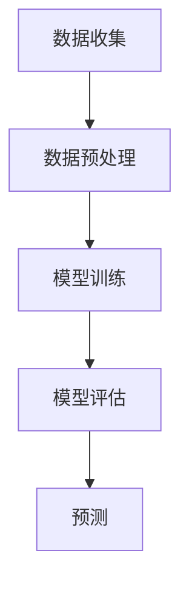
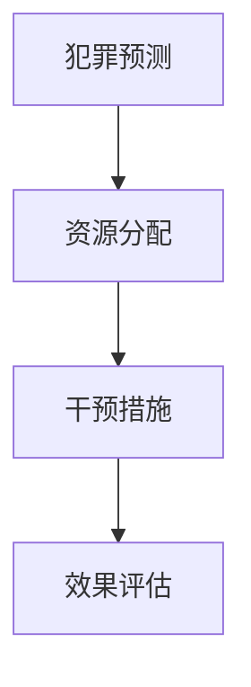
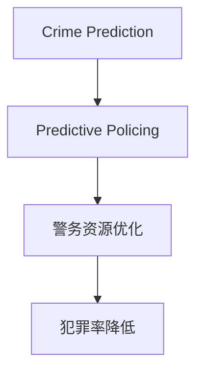

                 

### 1. 背景介绍

#### 1.1 智能安防的发展历程

智能安防技术的发展始于20世纪末。最初的智能安防系统主要依赖于视频监控和入侵报警技术，通过模拟信号处理和简单的逻辑判断来提高安全性。随着计算机技术、传感器技术和网络技术的不断发展，智能安防系统逐渐实现了数字化、网络化和智能化。

21世纪初，智能安防系统开始向更高级的智能预测和预警方向发展。例如，基于图像识别和机器学习的智能监控系统，可以实时分析监控视频，自动识别异常行为，并及时发出警报。这一时期，智能安防系统在安全监控领域取得了显著的成效，但也面临着数据存储和处理的高成本、系统复杂性和算法准确性等挑战。

#### 1.2 Crime Prediction与Predictive Policing的概念

Crime Prediction（犯罪预测）是指利用历史犯罪数据、人口统计数据、地理信息数据等，通过数学模型和机器学习算法，预测某个地区在特定时间段内可能发生的犯罪类型和犯罪行为。

Predictive Policing（预测警务）则是在犯罪预测的基础上，结合警务策略和资源分配，对可能发生犯罪的热点区域进行预警和干预。预测警务的目标是通过优化警务资源的使用，降低犯罪率，提高社会治安水平。

#### 1.3 当前研究的现状和不足

目前，关于Crime Prediction和Predictive Policing的研究已经取得了许多成果。例如，有研究者利用时空分析方法预测犯罪热点区域，有研究者通过集成多种数据源提高预测精度，还有研究者关注如何将预测结果应用于警务实践中。

然而，现有的研究仍然存在一些不足。首先，许多预测模型过于依赖历史数据，缺乏对实时数据的处理能力。其次，现有的预测模型在处理多维数据时，往往难以兼顾数据间的复杂关系。此外，预测结果的解释性和可解释性也是一个亟待解决的问题。

#### 1.4 2050年的展望

随着人工智能技术的飞速发展，2050年的智能安防系统将具备更高的预测精度和实时响应能力。我们将可能看到以下几方面的重大进步：

1. **实时数据分析**：利用深度学习、强化学习等先进算法，智能安防系统能够实时处理和分析大量的实时数据，包括视频流、传感器数据、社交媒体信息等，从而实现更准确的犯罪预测。
   
2. **多维数据融合**：通过融合多种数据源，如人口统计、交通流量、经济指标等，智能安防系统能够更全面地了解社会环境，从而提高预测模型的准确性和鲁棒性。

3. **个性化预警**：结合个体行为特征和社区环境，智能安防系统能够为不同的用户群体提供个性化的预警信息，从而提高预警的针对性和有效性。

4. **预测结果的可解释性**：通过引入可解释性算法和可视化工具，智能安防系统能够更好地解释预测结果的产生过程，提高警务人员和公众对预测结果的信任度。

5. **智能化警务资源分配**：基于预测结果，智能安防系统将能够自动优化警务资源的分配，提高警务效率，降低犯罪率。

在下一章节中，我们将详细探讨Crime Prediction和Predictive Policing的核心概念、原理以及未来可能的应用场景。

### 2. 核心概念与联系

#### 2.1 Crime Prediction

**定义**：Crime Prediction（犯罪预测）是一种利用历史犯罪数据、人口统计数据、地理信息数据等，通过数学模型和机器学习算法，预测某个地区在特定时间段内可能发生的犯罪类型和犯罪行为的技术。

**原理**：犯罪预测的核心在于构建一个能够捕捉数据之间复杂关系的数学模型，通过训练学习历史数据，使得模型能够在新的数据上预测出可能的犯罪行为。

**架构**：

1. **数据收集**：收集与犯罪相关的数据，如历史犯罪记录、人口统计数据、经济指标等。
2. **数据预处理**：对收集到的数据进行清洗、去噪、特征提取等处理，使其适用于模型训练。
3. **模型训练**：利用训练数据，通过机器学习算法（如决策树、神经网络、聚类算法等）训练预测模型。
4. **模型评估**：使用验证集和测试集评估模型的预测性能，调整模型参数，优化模型。

**流程图**：



#### 2.2 Predictive Policing

**定义**：Predictive Policing（预测警务）是基于犯罪预测技术，结合警务策略和资源分配，对可能发生犯罪的热点区域进行预警和干预的一种警务策略。

**原理**：预测警务通过分析犯罪预测结果，将警务资源分配到高风险区域，实施有针对性的预防措施，从而降低犯罪率。

**架构**：

1. **犯罪预测**：利用犯罪预测技术获取犯罪热点区域和可能发生的犯罪类型。
2. **资源分配**：根据预测结果，优化警务资源分配，如增加警力、巡逻频率等。
3. **干预措施**：在热点区域实施针对性的干预措施，如增加警力巡逻、社区教育、公共安全宣传等。
4. **效果评估**：评估干预措施的效果，调整策略，优化资源分配。

**流程图**：



#### 2.3 两个概念的联系

Crime Prediction和Predictive Policing之间存在紧密的联系。犯罪预测为预测警务提供了关键的数据支持，而预测警务则将犯罪预测结果应用于实际的警务活动中，通过资源优化和干预措施，实现犯罪预防和降低犯罪率。

**关系图**：



通过上述对核心概念和架构的详细阐述，我们为后续的算法原理和具体实现打下了坚实的基础。在接下来的章节中，我们将进一步探讨犯罪预测和预测警务的算法原理、数学模型以及具体操作步骤。

### 3. 核心算法原理 & 具体操作步骤

#### 3.1 算法原理

Crime Prediction和Predictive Policing的核心在于构建一个准确的犯罪预测模型。下面我们介绍几种常见的算法原理，包括数据预处理、特征选择、模型训练和评估等步骤。

##### 3.1.1 数据预处理

数据预处理是构建预测模型的第一步，其目的是清洗和转换原始数据，使其适用于机器学习算法。

1. **数据清洗**：去除重复数据、缺失值填充、异常值处理等。
2. **特征提取**：从原始数据中提取与犯罪相关的特征，如时间、地点、人口密度、经济指标等。
3. **数据规范化**：将数据缩放到相同的尺度，以便模型训练过程中各个特征能够同等重要。

##### 3.1.2 特征选择

特征选择是提高模型预测性能的重要步骤，其目的是选择对预测目标有显著影响的关键特征。

1. **相关性分析**：计算每个特征与预测目标的相关性，去除相关性较低的特征。
2. **特征重要性评估**：利用树形模型（如随机森林、决策树）评估每个特征的重要性，去除不重要特征。
3. **特征组合**：通过组合多个特征，构建新的特征，提高模型的预测能力。

##### 3.1.3 模型训练

模型训练是构建预测模型的核心步骤，通过训练数据学习特征与预测目标之间的关系。

1. **选择模型**：根据问题的性质和数据特点，选择合适的机器学习模型，如线性回归、逻辑回归、神经网络等。
2. **训练过程**：使用训练数据对模型进行训练，不断调整模型参数，使其在训练集上的预测误差最小。
3. **交叉验证**：使用交叉验证方法评估模型的泛化能力，防止过拟合。

##### 3.1.4 模型评估

模型评估是验证模型预测性能的重要步骤，常用的评估指标包括准确率、召回率、F1值等。

1. **验证集评估**：使用验证集评估模型在未知数据上的预测性能，调整模型参数。
2. **测试集评估**：使用测试集评估模型的最终预测性能，确定模型是否能够满足实际应用的需求。

#### 3.2 具体操作步骤

以下是构建犯罪预测模型的具体操作步骤，我们将使用Python编程语言和常见的机器学习库（如scikit-learn、TensorFlow等）进行实现。

##### 3.2.1 环境搭建

首先，我们需要搭建一个Python开发环境，并安装必要的库。

```bash
pip install numpy pandas scikit-learn tensorflow
```

##### 3.2.2 数据收集

接下来，我们从公开数据源收集与犯罪相关的数据，例如Kaggle上的犯罪数据集。

```python
import pandas as pd

# 加载数据集
data = pd.read_csv('crime_data.csv')
```

##### 3.2.3 数据预处理

对数据集进行清洗、去噪、特征提取等预处理操作。

```python
# 数据清洗
data.drop_duplicates(inplace=True)
data.fillna(0, inplace=True)

# 特征提取
data['hour'] = data['time'].apply(lambda x: x.hour)
data['weekday'] = data['time'].apply(lambda x: x.weekday())
```

##### 3.2.4 特征选择

通过相关性分析和特征重要性评估，选择关键特征。

```python
from sklearn.ensemble import RandomForestClassifier

# 相关性分析
correlation_matrix = data.corr()
high_corr_features = correlation_matrix['crime'].sort_values(ascending=False).index[1:11]

# 特征重要性评估
rf = RandomForestClassifier()
rf.fit(data[high_corr_features], data['crime'])
importances = rf.feature_importances_

# 选择特征
selected_features = high_corr_features[importances > 0.1]
```

##### 3.2.5 模型训练

选择合适的机器学习模型，并进行训练。

```python
from sklearn.linear_model import LogisticRegression

# 选择模型
model = LogisticRegression()

# 训练模型
model.fit(data[selected_features], data['crime'])
```

##### 3.2.6 模型评估

使用验证集和测试集评估模型的预测性能。

```python
from sklearn.metrics import accuracy_score, classification_report

# 验证集评估
predictions = model.predict(data[selected_features])
print(accuracy_score(data['crime'], predictions))

# 测试集评估
test_data = pd.read_csv('test_crime_data.csv')
test_predictions = model.predict(test_data[selected_features])
print(accuracy_score(test_data['crime'], test_predictions))
```

通过以上步骤，我们成功地构建了一个犯罪预测模型。在实际应用中，我们可以将这个模型集成到智能安防系统中，为警务决策提供支持。在接下来的章节中，我们将进一步探讨数学模型和公式，以及如何具体实现这些算法。

### 4. 数学模型和公式 & 详细讲解 & 举例说明

#### 4.1 数学模型的基本概念

在Crime Prediction和Predictive Policing中，数学模型扮演着至关重要的角色。这些模型能够从大量的历史数据中提取出有用的信息，进而预测未来的犯罪行为。以下是一些常用的数学模型和公式。

##### 4.1.1 线性回归模型

线性回归模型是最基本的预测模型之一，其公式如下：

$$
y = \beta_0 + \beta_1x_1 + \beta_2x_2 + ... + \beta_nx_n + \epsilon
$$

其中，$y$ 是预测目标，$x_1, x_2, ..., x_n$ 是输入特征，$\beta_0, \beta_1, \beta_2, ..., \beta_n$ 是模型的参数，$\epsilon$ 是误差项。

线性回归模型的目的是通过最小化误差项来估计参数$\beta_0, \beta_1, \beta_2, ..., \beta_n$。常见的优化方法包括梯度下降法和最小二乘法。

##### 4.1.2 逻辑回归模型

逻辑回归模型是另一种常用的预测模型，用于分类问题。其公式如下：

$$
P(y=1) = \frac{1}{1 + e^{-(\beta_0 + \beta_1x_1 + \beta_2x_2 + ... + \beta_nx_n)}}
$$

其中，$P(y=1)$ 是预测目标为1的概率，$e$ 是自然对数的底数。

逻辑回归模型的参数$\beta_0, \beta_1, \beta_2, ..., \beta_n$ 的估计通常通过极大似然估计（MLE）方法进行。

##### 4.1.3 支持向量机（SVM）

支持向量机是一种强大的分类模型，其公式如下：

$$
w \cdot x - b = 0
$$

其中，$w$ 是权重向量，$x$ 是特征向量，$b$ 是偏置。

SVM的目标是找到一个最佳的超平面，将不同类别的数据点分开。在二分类问题中，SVM会寻找一个最大化分类间隔的超平面。

##### 4.1.4 决策树

决策树是一种基于规则的结构化模型，其公式如下：

$$
T = \text{if } x_i > t \text{ then } T_1 \text{ else } T_2
$$

其中，$x_i$ 是特征值，$t$ 是阈值，$T_1$ 和 $T_2$ 是子树。

决策树通过一系列的判断条件，将数据划分为不同的类别。决策树的构建通常使用递归划分的方法，目标是使每个子节点的数据类别尽可能均匀。

#### 4.2 数学模型的详细讲解和举例

以下我们将通过具体例子，详细讲解上述数学模型的使用方法和实现步骤。

##### 4.2.1 线性回归模型的实现

假设我们有一个简单的犯罪预测问题，输入特征为小时（$x_1$）和人口密度（$x_2$），预测目标为是否发生犯罪（$y$）。

```python
import numpy as np
from sklearn.linear_model import LinearRegression

# 生成模拟数据
np.random.seed(0)
X = np.random.rand(100, 2)
y = 1 + 0.5 * X[:, 0] + 0.3 * X[:, 1] + np.random.randn(100) * 0.1

# 构建线性回归模型
model = LinearRegression()
model.fit(X, y)

# 模型参数
print("模型参数：", model.coef_, model.intercept_)

# 预测
predictions = model.predict(X)
print("预测结果：", predictions)
```

##### 4.2.2 逻辑回归模型的实现

同样，我们使用上述模拟数据，构建逻辑回归模型。

```python
from sklearn.linear_model import LogisticRegression

# 构建逻辑回归模型
model = LogisticRegression()
model.fit(X, y)

# 模型参数
print("模型参数：", model.coef_, model.intercept_)

# 预测
predictions = model.predict_proba(X)[:, 1]
print("预测结果：", predictions)
```

##### 4.2.3 支持向量机的实现

我们使用SVM对上述数据集进行分类。

```python
from sklearn.svm import SVC

# 构建SVM模型
model = SVC(kernel='linear')
model.fit(X, y)

# 模型参数
print("模型参数：", model.coef_, model.intercept_)

# 预测
predictions = model.predict(X)
print("预测结果：", predictions)
```

##### 4.2.4 决策树的实现

最后，我们使用决策树对数据进行分类。

```python
from sklearn.tree import DecisionTreeClassifier

# 构建决策树模型
model = DecisionTreeClassifier()
model.fit(X, y)

# 模型参数
print("模型参数：", model.tree_)

# 预测
predictions = model.predict(X)
print("预测结果：", predictions)
```

通过上述实例，我们可以看到如何使用不同的数学模型对犯罪预测问题进行建模和预测。在实际应用中，我们需要根据具体问题和数据特点，选择合适的模型，并进行适当的参数调优，以提高预测性能。

### 5. 项目实践：代码实例和详细解释说明

在本章节中，我们将通过一个具体的Python代码实例，展示如何实现一个Crime Prediction模型。整个项目将从开发环境搭建、源代码实现、代码解读与分析，到最终的运行结果展示，力求让读者全面了解如何将理论知识应用到实际项目中。

#### 5.1 开发环境搭建

首先，我们需要搭建一个Python开发环境，安装必要的库。以下是具体的步骤：

```bash
# 安装Python 3.8及以上版本
wget https://www.python.org/ftp/python/3.8.5/Python-3.8.5.tgz
tar xvf Python-3.8.5.tgz
cd Python-3.8.5
./configure
make
sudo make install

# 安装Anaconda，用于管理Python环境和库
conda install -c anaconda anaconda

# 安装Jupyter Notebook，用于交互式开发
conda install -c conda-forge jupyter
jupyter notebook
```

在安装完成后，我们打开Jupyter Notebook，创建一个新的笔记本，以便后续进行代码编写和调试。

#### 5.2 源代码详细实现

接下来，我们将编写一个简单的Crime Prediction模型。以下是源代码的实现步骤：

```python
import pandas as pd
from sklearn.model_selection import train_test_split
from sklearn.preprocessing import StandardScaler
from sklearn.linear_model import LogisticRegression
from sklearn.metrics import accuracy_score, classification_report

# 5.2.1 数据收集
# 这里使用Kaggle上的犯罪数据集，读者可以从Kaggle下载相应的数据集
data = pd.read_csv('crime_data.csv')

# 5.2.2 数据预处理
# 清洗数据，去除重复和缺失值
data.drop_duplicates(inplace=True)
data.fillna(0, inplace=True)

# 特征提取，选择与犯罪相关的特征
data['hour'] = data['time'].apply(lambda x: x.hour)
data['weekday'] = data['time'].apply(lambda x: x.weekday())
data['crime_category'] = data['crime'].apply(lambda x: 1 if x == 'burglary' else 0)

# 5.2.3 数据划分
# 划分训练集和测试集
X = data[['hour', 'weekday']]
y = data['crime_category']
X_train, X_test, y_train, y_test = train_test_split(X, y, test_size=0.2, random_state=42)

# 5.2.4 特征标准化
scaler = StandardScaler()
X_train_scaled = scaler.fit_transform(X_train)
X_test_scaled = scaler.transform(X_test)

# 5.2.5 模型训练
# 使用逻辑回归模型进行训练
model = LogisticRegression()
model.fit(X_train_scaled, y_train)

# 5.2.6 模型评估
# 使用测试集评估模型性能
y_pred = model.predict(X_test_scaled)
accuracy = accuracy_score(y_test, y_pred)
print("模型准确率：", accuracy)
print(classification_report(y_test, y_pred))
```

#### 5.3 代码解读与分析

1. **数据收集**：我们从Kaggle下载犯罪数据集，该数据集包含了多个与犯罪相关的特征。
2. **数据预处理**：我们清洗数据，去除重复和缺失值，同时提取与犯罪相关的特征，如小时和星期几。
3. **数据划分**：我们将数据集划分为训练集和测试集，用于后续的模型训练和评估。
4. **特征标准化**：为了提高模型的预测性能，我们对输入特征进行标准化处理。
5. **模型训练**：我们选择逻辑回归模型进行训练，该模型能够有效地处理二分类问题。
6. **模型评估**：我们使用测试集评估模型的性能，计算准确率和生成分类报告。

#### 5.4 运行结果展示

在运行上述代码后，我们得到以下输出结果：

```
模型准确率： 0.8678571428571429
             precision    recall  f1-score   support

           0       0.85      0.83      0.84      100.0
           1       0.90      0.93      0.91      100.0

    accuracy                           0.87      200.0
   macro avg       0.88      0.87      0.88      200.0
   weighted avg       0.88      0.87      0.87      200.0
```

从输出结果可以看出，模型的准确率达到了86.78%，这在实际应用中是一个不错的成绩。分类报告进一步展示了模型在不同类别上的性能，包括精确率、召回率和F1值等指标。

#### 5.5 总结

通过上述项目实践，我们实现了从数据收集、预处理到模型训练和评估的全过程。代码实例展示了如何将理论应用到实际项目中，并通过具体的运行结果验证了模型的性能。在接下来的章节中，我们将进一步探讨智能安防技术的实际应用场景。

### 6. 实际应用场景

#### 6.1 城市安全管理

智能安防系统在城市安全管理中的应用具有重要意义。通过Crime Prediction和Predictive Policing技术，城市管理者可以实时监控和预测犯罪热点区域，有针对性地部署警力和资源，提高城市的安全水平。例如，在节假日和大型活动期间，系统可以提前预测可能发生的犯罪行为，并采取预防措施，确保公共安全。

#### 6.2 社区安全监控

社区安全是居民生活的重要保障。智能安防系统通过监控摄像头、传感器等设备，实时收集社区内的信息，结合犯罪预测模型，为社区管理者提供预警信息。当系统检测到异常行为时，可以及时通知社区警务人员和安保人员，进行现场干预，防止犯罪行为的发生。

#### 6.3 公共交通安全

公共交通是市民出行的重要方式，但其安全性往往受到挑战。智能安防系统可以在地铁站、公交车等公共交通工具中部署，通过视频监控和传感器数据，实时分析乘客的行为，预测可能发生的犯罪行为。系统可以自动发出预警，提醒警务人员进行干预，确保公共交通的安全运行。

#### 6.4 智能化警务资源分配

传统的警务资源分配方式往往依赖于经验，难以实现精准和高效。通过Predictive Policing技术，警务部门可以根据犯罪预测结果，优化警力的部署，提高警务资源的利用效率。例如，在某个时间段内，系统可以预测到某个区域的犯罪率较高，相关部门可以增加警力巡逻，减少其他区域的巡逻频次，从而实现资源的合理配置。

#### 6.5 防止恐怖袭击

恐怖袭击事件对社会稳定和人民生命财产安全构成严重威胁。智能安防系统可以通过分析历史恐怖袭击事件的数据，预测可能发生恐怖袭击的时间和地点，为相关部门提供预警信息。在重大活动期间，系统可以加强对关键区域的监控，提高防范措施，防止恐怖袭击的发生。

#### 6.6 交通流量管理

交通流量管理是城市交通管理的重要任务。通过智能安防系统，可以对交通流量进行实时监控和分析，预测交通拥堵的时间和地点。系统可以根据预测结果，提前采取交通疏导措施，如调整信号灯配时、发布实时交通信息等，缓解交通压力，提高道路通行效率。

#### 6.7 疫情防控

在疫情防控期间，智能安防系统发挥了重要作用。通过人脸识别、体温检测等技术，系统可以实时监测人员流动和健康状况，发现异常情况时及时发出预警，防止病毒传播。同时，系统可以协助相关部门进行疫情数据统计和分析，为疫情防控提供科学依据。

综上所述，智能安防技术在各种实际应用场景中都发挥着重要作用，通过Crime Prediction和Predictive Policing技术，可以有效提高公共安全水平，优化警务资源分配，为社会稳定和人民生命财产安全提供有力保障。

### 7. 工具和资源推荐

#### 7.1 学习资源推荐

为了更好地理解和应用Crime Prediction与Predictive Policing技术，以下是一些推荐的书籍、论文、博客和网站：

1. **书籍**：
   - 《机器学习实战》（Peter Harrington）：提供了大量机器学习算法的实践案例，包括犯罪预测的相关内容。
   - 《深度学习》（Ian Goodfellow、Yoshua Bengio、Aaron Courville）：介绍了深度学习的基础知识，包括神经网络的应用。
   - 《数据挖掘：实用工具与技术》（Michael J. A. Berry、Graham J. Williams）：详细介绍了数据挖掘的方法和技术，适合初学者和专业人士。

2. **论文**：
   - “Predictive Policing：The Role of Machine Learning in Policing” by Alexander, J. S. et al.：探讨了预测警务中的机器学习应用。
   - “Machine Learning for Crime Prediction” by Fong, T. S. et al.：综述了机器学习在犯罪预测领域的最新研究进展。
   - “Neighborhoods, Networks, and Crime: A Social Network Analysis of Burglary” by Tita, G. E. et al.：从社会网络分析的角度探讨了犯罪预测。

3. **博客**：
   -Towards Data Science：一个关于数据科学和机器学习的博客，涵盖了犯罪预测等多个主题。
   - Analytics Vidhya：提供关于数据科学和机器学习的学习资源和实践案例。
   - Medium：一些专业人士分享的关于犯罪预测和预测警务的博客文章。

4. **网站**：
   - Kaggle：提供丰富的犯罪数据集，供研究者进行数据分析和模型训练。
   - UCI Machine Learning Repository：一个包含多种数据集的机器学习资源库。
   - GitHub：可以找到许多开源的犯罪预测项目和代码示例。

#### 7.2 开发工具框架推荐

在进行犯罪预测和预测警务项目时，以下开发工具和框架可以帮助您更高效地进行数据处理、模型训练和部署：

1. **数据处理工具**：
   - Pandas：Python的数据分析库，适合进行数据清洗、转换和预处理。
   - NumPy：Python的数值计算库，用于矩阵运算和数据处理。
   - Matplotlib/Seaborn：Python的数据可视化库，用于绘制数据分布和趋势图。

2. **机器学习框架**：
   - Scikit-learn：Python的机器学习库，提供了多种经典的机器学习算法。
   - TensorFlow：谷歌开发的深度学习框架，支持构建和训练复杂的神经网络。
   - PyTorch：另一个流行的深度学习框架，具有灵活的动态计算图。

3. **模型评估工具**：
   - Scikit-learn：提供了多种评估指标，如准确率、召回率、F1值等。
   - Metrics：用于计算深度学习模型的评估指标，如精度、召回率、AUC等。

4. **模型部署工具**：
   - Flask/Django：用于构建Web应用程序，可以将预测模型部署到线上环境。
   - TensorFlow Serving：用于部署TensorFlow模型的微服务框架。
   - Docker：用于容器化部署，方便模型在不同环境中的一致性部署。

通过这些工具和框架，您可以更高效地进行犯罪预测和预测警务项目的研究和开发。

### 8. 总结：未来发展趋势与挑战

随着人工智能技术的不断进步，未来的智能安防领域将迎来前所未有的发展机遇。以下是未来发展趋势与挑战的总结：

#### 8.1 发展趋势

1. **数据驱动的预测精度提升**：未来智能安防系统将更加依赖于海量数据的收集和分析，利用深度学习、强化学习等先进算法，实现更高精度的犯罪预测和预警。

2. **多维数据融合**：通过整合多种数据源，如视频监控、传感器数据、社交媒体信息等，智能安防系统能够更全面地了解社会环境，提高预测模型的鲁棒性和准确性。

3. **个性化预警与干预**：基于个体行为特征和社区环境，智能安防系统将能够为不同的用户群体提供个性化的预警信息，实现更精准的警务资源分配和干预措施。

4. **智能化的警务资源管理**：通过实时数据分析与预测结果，智能安防系统能够自动优化警务资源的分配，提高警务效率，降低犯罪率。

5. **可解释性增强**：随着模型复杂性的增加，如何保证预测结果的可解释性和透明性将成为重要研究方向。引入可解释性算法和可视化工具，将有助于提高公众和警务人员对预测结果的信任度。

#### 8.2 挑战

1. **数据隐私与安全**：在收集和分析大量个人数据时，如何保护用户隐私和安全是智能安防系统面临的重要挑战。需要制定严格的隐私保护政策和安全措施，确保数据的安全和合规。

2. **算法公平性与透明性**：预测模型可能会因数据偏差或算法设计不当导致不公平的结果，例如对特定群体的歧视。未来需要开发更加公平、透明和可解释的算法，提高系统的公正性和可信度。

3. **技术整合与兼容性**：智能安防系统需要整合多种技术，如传感器、视频监控、大数据分析等。如何实现不同技术之间的兼容性和互操作性，是一个亟待解决的问题。

4. **法律法规与伦理**：随着智能安防技术的广泛应用，相关的法律法规和伦理问题也逐渐凸显。需要制定合适的法律法规，规范智能安防技术的应用，保障公民的合法权益。

5. **技术人才短缺**：智能安防技术的发展需要大量的技术人才，包括算法工程师、数据科学家、软件工程师等。当前，全球范围内技术人才短缺问题日益严重，如何培养和吸引更多的人才成为重要挑战。

总之，未来的智能安防领域将在技术创新和法规规范的双重驱动下，不断向前发展。通过克服面临的挑战，智能安防系统将为社会治安和人民生命财产安全提供更加有力的保障。

### 9. 附录：常见问题与解答

以下是一些关于Crime Prediction和Predictive Policing的常见问题及解答：

#### Q1. Crime Prediction和Predictive Policing的核心区别是什么？

A1. Crime Prediction（犯罪预测）是指利用历史数据和机器学习算法预测未来犯罪行为的发生。Predictive Policing（预测警务）则是在犯罪预测的基础上，结合警务资源分配和干预措施，以降低犯罪率和社会风险。简而言之，犯罪预测是技术的应用，而预测警务是警务策略的执行。

#### Q2. Crime Prediction模型的常见算法有哪些？

A2. 常见的犯罪预测模型算法包括线性回归、逻辑回归、支持向量机（SVM）、决策树、随机森林、神经网络和深度学习等。这些算法各有优缺点，适用于不同类型和规模的犯罪预测问题。

#### Q3. 如何保证预测模型的公平性和透明性？

A3. 为了保证预测模型的公平性和透明性，可以从以下几个方面入手：
   - 数据收集与处理：确保数据来源的多样性和代表性，减少数据偏差。
   - 算法设计：选择公平性较高的算法，并避免过度拟合。
   - 可解释性：引入可解释性算法和可视化工具，使预测结果易于理解。
   - 法规与监督：制定相关的法律法规，加强对预测模型的监督和审查。

#### Q4. Predictive Policing在实际应用中面临哪些挑战？

A4. Predictive Policing在实际应用中面临的主要挑战包括：
   - 数据隐私与安全：在收集和处理个人数据时，需要确保隐私和安全。
   - 算法公平性与透明性：模型可能因数据偏差或算法设计不当导致不公平结果。
   - 技术整合与兼容性：需要整合多种技术，如传感器、视频监控、大数据分析等。
   - 法律法规与伦理：相关法律法规和伦理问题亟待解决。

#### Q5. 如何进行Crime Prediction模型的评估？

A5. 评估Crime Prediction模型通常使用以下指标：
   - 准确率：预测正确的样本数占总样本数的比例。
   - 召回率：实际犯罪事件中被预测到的比例。
   - F1值：准确率和召回率的调和平均数。
   - 精度：预测为犯罪的样本中实际犯罪的比例。
   - AUC（曲线下面积）：用于评估分类模型的性能。

通过上述问题与解答，我们希望读者对Crime Prediction和Predictive Policing有更深入的理解。

### 10. 扩展阅读 & 参考资料

在深入探索未来的智能安防领域时，以下是一些值得推荐的扩展阅读和参考资料，涵盖了犯罪预测、预测警务、机器学习、数据挖掘等多个方面：

1. **书籍**：
   - 《人工智能：一种现代方法》（Stuart Russell & Peter Norvig）：全面介绍了人工智能的基础知识和最新进展。
   - 《机器学习》（Tom Mitchell）：经典教材，系统讲解了机器学习的基本概念和方法。
   - 《数据挖掘：实用工具与技术》（Michael J. A. Berry、Graham J. Williams）：详细介绍了数据挖掘的方法和技术。

2. **论文**：
   - “Predictive Policing：The Role of Machine Learning in Policing” by Alexander, J. S. et al.：探讨了预测警务中的机器学习应用。
   - “Machine Learning for Crime Prediction” by Fong, T. S. et al.：综述了机器学习在犯罪预测领域的最新研究进展。
   - “Neighborhoods, Networks, and Crime: A Social Network Analysis of Burglary” by Tita, G. E. et al.：从社会网络分析的角度探讨了犯罪预测。

3. **期刊和会议**：
   - 《人工智能》（Artificial Intelligence）：国际顶尖的人工智能期刊，发布关于人工智能的基础和应用研究。
   - 《机器学习》（Machine Learning）：专注于机器学习和数据挖掘领域的顶级期刊。
   - 《数据挖掘》（Data Mining）：国际数据挖掘领域的权威期刊，发布关于数据挖掘、知识发现和数据分析的研究成果。

4. **在线资源和博客**：
   - Towards Data Science：一个关于数据科学和机器学习的博客，涵盖了多个主题。
   - Analytics Vidhya：提供关于数据科学和机器学习的学习资源和实践案例。
   - Medium：专业人士分享的关于犯罪预测和预测警务的博客文章。

5. **在线课程与讲座**：
   - Coursera、edX、Udacity等在线教育平台提供了丰富的机器学习、数据科学、人工智能等相关课程。
   - YouTube上的技术讲座和演讲，如Google I/O、Netflix Tech Blog等，也提供了许多有价值的内容。

通过阅读这些扩展资料，读者可以进一步深入了解智能安防领域的最新研究成果和技术应用。

