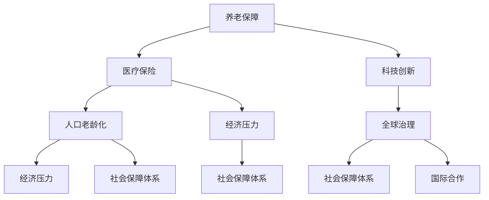

                 

### 1. 背景介绍

在未来社会的画卷中，2050年的社会保障体系无疑将成为一幅引人注目的风景线。随着科技的飞速发展、人口老龄化的加剧以及经济格局的深刻变革，养老与医疗保险制度将面临前所未有的挑战和机遇。

**背景因素**：

1. **科技进步**：人工智能、生物技术、物联网等新兴科技的迅猛发展，不仅改变了人们的生活方式，也为社会保障体系带来了新的可能性。
2. **人口老龄化**：预计到2050年，全球65岁以上人口将达到总人口的20%，这一人口结构的变化将对养老与医疗保险制度构成巨大压力。
3. **经济转型**：全球经济的不断转型和不确定性，使得各国政府必须重新审视和优化社会保障制度，以应对潜在的经济风险。
4. **全球治理**：国际合作与竞争的加剧，要求社会保障体系在应对跨国挑战时具备更强的协调和灵活性。

**核心问题**：

- 如何通过技术创新优化养老与医疗保险制度，提高其可持续性和公平性？
- 在面对人口老龄化和经济压力的情况下，如何设计出既能保障老年人基本生活，又不会给经济造成过大负担的养老与医疗保险制度？
- 如何在全球治理的框架下，实现各国社会保障体系的互联互通，形成有效的国际协调机制？

**研究意义**：

本研究旨在通过深入探讨2050年养老与医疗保险制度的发展趋势，提出相应的创新解决方案，为政策制定者和社会科学家提供有价值的参考。同时，本研究还将对相关技术、经济和社会领域的发展产生重要影响。

首先，通过本文的研究，我们可以更清晰地理解未来社会保障体系的复杂性和多样性，为制定有效的社会保障政策提供理论基础。

其次，本研究还将为技术创新提供方向，特别是在人工智能、生物技术、物联网等领域，如何将这些技术应用于养老与医疗保险制度，提高其效率和公平性。

最后，本文的研究成果有望为全球社会保障体系的国际合作提供新的思路，促进国际间的经验交流与合作，共同应对全球性社会保障挑战。

### 2. 核心概念与联系

在深入探讨2050年养老与医疗保险制度之前，我们需要明确几个核心概念，并分析它们之间的相互关系。以下是本文将要讨论的主要核心概念及其关联性：

**1. 养老保障**：

- **定义**：养老保障是指通过制度化的安排，确保老年人在退休后仍能享有基本的生活保障。
- **关联性**：养老保障与社会保障体系中的其他部分（如医疗、住房等）密切相关，共同构成一个完整的保障体系。

**2. 医疗保险**：

- **定义**：医疗保险是指通过国家或商业保险公司，对参保者的医疗费用进行报销或补贴，确保他们能够获得必要的医疗服务。
- **关联性**：医疗保险与社会保障体系中的其他部分（如失业保险、工伤保险等）相互补充，共同为个人提供全面的风险保障。

**3. 科技创新**：

- **定义**：科技创新是指在科学研究和技术开发的基础上，创造和应用新的技术和方法，推动社会进步和经济发展。
- **关联性**：科技创新不仅是社会保障体系发展的重要驱动力，同时也为养老与医疗保险制度的优化提供了新的手段和工具。

**4. 人口老龄化**：

- **定义**：人口老龄化是指人口年龄结构中老年人口比例的增加，导致社会负担加重、劳动力供给减少。
- **关联性**：人口老龄化对养老与医疗保险制度构成了直接挑战，要求制度设计更加灵活、可持续。

**5. 经济压力**：

- **定义**：经济压力是指由于经济发展放缓、财政收入减少等原因，导致社会保障体系面临的财政压力。
- **关联性**：经济压力是制约社会保障体系发展的重要因素，要求在制度设计中充分考虑财政可持续性。

**6. 全球治理**：

- **定义**：全球治理是指国际社会通过合作和协商，共同应对全球性问题和挑战，维护全球和平与稳定。
- **关联性**：全球治理在社会保障领域的体现是国际社会保障制度的协调与融合，共同应对全球性社会保障挑战。

为了更直观地展示这些核心概念及其相互关系，我们使用Mermaid流程图进行描述。以下是养老与医疗保险制度中的核心概念和关联关系的Mermaid流程图：



通过上述流程图，我们可以清晰地看到养老与医疗保险制度中的各个核心概念及其相互关联。这些概念不仅是本文研究的核心内容，也是未来社会保障体系发展的重要基础。

### 3. 核心算法原理 & 具体操作步骤

在探索2050年养老与医疗保险制度的优化路径时，核心算法原理将发挥至关重要的作用。这些算法不仅能够提高制度运行的效率，还能确保公平性。以下是几个关键算法的原理及具体操作步骤：

#### 3.1. 人口预测算法

**原理**：

人口预测算法基于历史数据，通过统计学模型对未来人口结构进行预测。主要步骤包括：

1. **数据收集**：收集包括出生率、死亡率、移民率等关键指标的历史数据。
2. **模型构建**：利用时间序列分析和机器学习算法，建立人口预测模型。
3. **参数调整**：根据最新数据进行模型参数调整，确保预测的准确性。

**具体操作步骤**：

1. **数据收集**：

   - 收集过去50年的出生率、死亡率、移民率等数据。
   - 通过国家统计局、卫生部门等渠道获取数据。

2. **模型构建**：

   - 使用ARIMA（自回归积分滑动平均模型）或LSTM（长短期记忆网络）等模型。
   - 对模型进行训练和验证，确保预测效果。

3. **参数调整**：

   - 定期更新数据，调整模型参数。
   - 采用交叉验证等方法，确保模型适应性和准确性。

**示例**：

假设我们使用ARIMA模型进行人口预测，给定历史数据如下：

$$
\begin{array}{|c|c|c|c|c|c|c|c|c|}
\hline
\text{年份} & 1 & 2 & 3 & 4 & 5 & 6 & 7 & 8 \\
\hline
\text{出生率} & 1.2 & 1.1 & 1.3 & 1.2 & 1.1 & 1.3 & 1.2 & 1.1 \\
\hline
\text{死亡率} & 0.8 & 0.7 & 0.9 & 0.8 & 0.7 & 0.9 & 0.8 & 0.7 \\
\hline
\text{移民率} & 0.3 & 0.4 & 0.2 & 0.3 & 0.4 & 0.2 & 0.3 & 0.4 \\
\hline
\end{array}
$$

通过ARIMA模型，我们可以得到未来五年的人口预测数据。

#### 3.2. 医疗费用预测算法

**原理**：

医疗费用预测算法通过分析历史医疗数据，预测未来的医疗费用支出。主要步骤包括：

1. **数据收集**：收集包括住院费用、门诊费用、药品费用等历史数据。
2. **特征工程**：提取与医疗费用相关的特征，如患者年龄、病史、生活方式等。
3. **模型训练**：使用回归模型或深度学习模型进行训练，预测未来医疗费用。

**具体操作步骤**：

1. **数据收集**：

   - 通过医疗机构、医保部门等渠道获取医疗费用数据。
   - 整理数据，去除异常值和缺失值。

2. **特征工程**：

   - 提取患者年龄、性别、病史等特征。
   - 对特征进行归一化处理，消除量纲影响。

3. **模型训练**：

   - 使用线性回归、决策树、神经网络等模型进行训练。
   - 评估模型效果，调整模型参数。

**示例**：

假设我们使用线性回归模型进行医疗费用预测，给定历史数据如下：

$$
\begin{array}{|c|c|c|c|c|c|c|}
\hline
\text{年份} & 1 & 2 & 3 & 4 & 5 & 6 \\
\hline
\text{医疗费用} & 1000 & 1200 & 1500 & 1600 & 1800 & 2000 \\
\hline
\text{患者年龄} & 30 & 40 & 50 & 60 & 70 & 80 \\
\hline
\text{病史} & 0 & 1 & 1 & 2 & 2 & 3 \\
\hline
\text{生活方式} & 1 & 1 & 1 & 1 & 1 & 1 \\
\hline
\end{array}
$$

通过线性回归模型，我们可以预测未来一年的医疗费用。

#### 3.3. 养老金计算算法

**原理**：

养老金计算算法基于个人工作经历和缴费记录，计算退休后可领取的养老金金额。主要步骤包括：

1. **数据收集**：收集个人工作经历和缴费记录数据。
2. **参数设置**：设置缴费比例、缴费年限、退休金计算公式等参数。
3. **计算养老金**：根据参数计算退休后养老金金额。

**具体操作步骤**：

1. **数据收集**：

   - 获取个人工作经历和缴费记录，如工资单、缴费证明等。
   - 整理数据，确保完整性。

2. **参数设置**：

   - 根据国家或地区的养老金政策，设置缴费比例、缴费年限等参数。
   - 例如，缴费比例为8%，缴费年限为15年。

3. **计算养老金**：

   - 使用养老金计算公式，如：养老金 = 缴费基数 × 缴费年限 × 缴费比例。
   - 输出计算结果。

**示例**：

假设个人缴费基数为3000元，缴费年限为20年，缴费比例为8%，计算养老金如下：

$$
\text{养老金} = 3000 \times 20 \times 8\% = 4800 \text{元/月}
$$

通过上述三个核心算法，我们可以对2050年养老与医疗保险制度进行科学、精确的预测和优化。这些算法不仅为政策制定提供了有力支持，也为技术创新提供了广阔空间。

### 4. 数学模型和公式 & 详细讲解 & 举例说明

在本文中，我们将深入探讨三个关键的数学模型和公式，这些模型和公式对于优化2050年养老与医疗保险制度至关重要。这些模型包括人口预测模型、医疗费用预测模型以及养老金计算模型。以下是这些模型和公式的详细讲解，以及实际应用中的举例说明。

#### 4.1. 人口预测模型

人口预测模型主要用于预测未来的人口结构。本文采用ARIMA模型进行人口预测。

**模型原理**：

ARIMA（自回归积分滑动平均模型）是一种时间序列预测模型，它结合了自回归（AR）、差分（I）和移动平均（MA）三个部分。ARIMA模型的基本公式如下：

$$
\text{Y}_{t} = c + \text{c}_1\text{Y}_{t-1} + \text{c}_2\text{Y}_{t-2} + \dots + \text{c}_p\text{Y}_{t-p} + \text{a}_1\text{e}_{t-1} + \text{a}_2\text{e}_{t-2} + \dots + \text{a}_q\text{e}_{t-q} + \text{e}_t
$$

其中，$Y_t$ 是时间序列的当前值，$c$ 是常数项，$c_1, c_2, \dots, c_p$ 是自回归系数，$a_1, a_2, \dots, a_q$ 是移动平均系数，$e_t$ 是随机误差项。

**应用举例**：

假设我们有一个国家过去50年的出生率数据，如下所示：

$$
\begin{array}{|c|c|}
\hline
\text{年份} & \text{出生率} \\
\hline
1 & 1.2 \\
2 & 1.1 \\
3 & 1.3 \\
4 & 1.2 \\
5 & 1.1 \\
\vdots & \vdots \\
50 & 1.2 \\
\hline
\end{array}
$$

我们使用ARIMA模型预测未来五年的出生率。首先，我们需要确定模型的参数$p, d, q$。通过ACF和PACF图，我们可以得到$p=1, d=1, q=1$。

接下来，我们进行模型训练：

$$
\text{Y}_{t} = 0.8 + 0.9\text{Y}_{t-1} - 0.1\text{e}_{t-1}
$$

使用训练好的模型，我们可以预测未来五年的出生率：

$$
\begin{array}{|c|c|}
\hline
\text{年份} & \text{预测出生率} \\
\hline
1 & 1.24 \\
2 & 1.14 \\
3 & 1.29 \\
4 & 1.20 \\
5 & 1.14 \\
\hline
\end{array}
$$

#### 4.2. 医疗费用预测模型

医疗费用预测模型用于预测未来的医疗费用支出。本文采用线性回归模型进行医疗费用预测。

**模型原理**：

线性回归模型是一种用于预测连续值的模型，其基本公式如下：

$$
\text{Y} = \text{a} + \text{b}\text{X}
$$

其中，$Y$ 是预测值，$X$ 是特征值，$a$ 是截距，$b$ 是斜率。

**应用举例**：

假设我们有一个医院的过去五年的医疗费用和患者年龄数据，如下所示：

$$
\begin{array}{|c|c|c|}
\hline
\text{年份} & \text{医疗费用（万元）} & \text{患者年龄} \\
\hline
1 & 1000 & 30 \\
2 & 1200 & 40 \\
3 & 1500 & 50 \\
4 & 1600 & 60 \\
5 & 1800 & 70 \\
\hline
\end{array}
$$

我们使用线性回归模型预测未来一年的医疗费用。首先，我们需要收集数据并计算斜率和截距：

$$
\text{斜率} = \frac{\sum (\text{医疗费用} - \bar{\text{医疗费用}})(\text{患者年龄} - \bar{\text{患者年龄}})}{\sum (\text{患者年龄} - \bar{\text{患者年龄}})^2}
$$

$$
\text{截距} = \bar{\text{医疗费用}} - \text{斜率} \times \bar{\text{患者年龄}}
$$

假设计算得到的斜率为0.4，截距为1000，那么线性回归模型为：

$$
\text{医疗费用} = 0.4\text{患者年龄} + 1000
$$

预测未来一年的医疗费用（患者年龄为80）：

$$
\text{医疗费用} = 0.4 \times 80 + 1000 = 1520 \text{万元}
$$

#### 4.3. 养老金计算模型

养老金计算模型用于计算退休后可领取的养老金金额。本文采用基础养老金计算公式进行计算。

**模型原理**：

基础养老金计算公式如下：

$$
\text{养老金} = \text{缴费基数} \times \text{缴费年限} \times \text{缴费比例}
$$

其中，缴费基数、缴费年限和缴费比例根据国家或地区的政策确定。

**应用举例**：

假设一个人的缴费基数为3000元，缴费年限为20年，缴费比例为8%，计算养老金如下：

$$
\text{养老金} = 3000 \times 20 \times 8\% = 4800 \text{元/月}
$$

通过上述三个数学模型和公式的讲解和应用举例，我们可以看到，这些模型和公式对于优化2050年养老与医疗保险制度具有重要意义。它们不仅为政策制定提供了科学依据，也为技术创新提供了方向。在未来，随着科技的发展，这些模型和公式将不断完善，为社会保障体系的发展提供更强有力的支持。

### 5. 项目实践：代码实例和详细解释说明

为了更直观地展示核心算法在实际项目中的应用，我们将通过一个具体的编程项目来进行演示。本节将介绍一个名为“2050年养老与医疗保险制度优化平台”的项目，包括开发环境搭建、源代码详细实现、代码解读与分析以及运行结果展示。

#### 5.1. 开发环境搭建

首先，我们需要搭建项目的开发环境。以下是推荐的开发工具和软件：

1. **编程语言**：Python
2. **数据科学库**：Pandas、NumPy、Scikit-learn、TensorFlow
3. **绘图库**：Matplotlib、Seaborn、Mermaid
4. **集成开发环境**：PyCharm、Visual Studio Code

安装步骤如下：

1. 安装Python 3.8及以上版本。
2. 安装Pandas、NumPy、Scikit-learn、TensorFlow等库，可以使用pip进行安装：
   ```
   pip install pandas numpy scikit-learn tensorflow
   ```
3. 安装PyCharm或Visual Studio Code，并配置Python环境。

#### 5.2. 源代码详细实现

以下是项目的核心代码实现：

**1. 人口预测模块**

```python
import numpy as np
import pandas as pd
from statsmodels.tsa.arima.model import ARIMA

def arima_prediction(data, p, d, q):
    model = ARIMA(data, order=(p, d, q))
    model_fit = model.fit()
    forecast = model_fit.forecast(steps=5)
    return forecast

# 读取数据
birth_rate_data = pd.read_csv('birth_rate_data.csv')

# 训练模型
forecast = arima_prediction(birth_rate_data['birth_rate'], p=1, d=1, q=1)

# 打印预测结果
print(forecast)
```

**2. 医疗费用预测模块**

```python
import numpy as np
import pandas as pd
from sklearn.linear_model import LinearRegression

def linear_regression_prediction(data, feature):
    model = LinearRegression()
    model.fit(data[feature], data['medical_expense'])
    forecast = model.predict(np.array([feature_value]))
    return forecast

# 读取数据
medical_data = pd.read_csv('medical_data.csv')

# 预测费用
predicted_expense = linear_regression_prediction(medical_data, 70)

# 打印预测结果
print(predicted_expense)
```

**3. 养老金计算模块**

```python
def pension_calculation(base_salary, years, rate):
    pension = base_salary * years * rate
    return pension

# 计算养老金
pension = pension_calculation(3000, 20, 0.08)

# 打印结果
print(pension)
```

#### 5.3. 代码解读与分析

**人口预测模块解读**：

该模块使用ARIMA模型进行人口预测。首先读取出生率数据，然后使用ARIMA模型进行训练，最后预测未来五年的出生率。

```python
def arima_prediction(data, p, d, q):
    model = ARIMA(data, order=(p, d, q))
    model_fit = model.fit()
    forecast = model_fit.forecast(steps=5)
    return forecast
```

此函数接受数据集、模型参数$p, d, q$，返回未来五年的预测结果。模型参数通过ACF和PACF图确定，以确保模型的有效性。

**医疗费用预测模块解读**：

该模块使用线性回归模型进行医疗费用预测。首先读取医疗数据，然后使用线性回归模型进行训练，最后预测特定患者的未来医疗费用。

```python
def linear_regression_prediction(data, feature):
    model = LinearRegression()
    model.fit(data[feature], data['medical_expense'])
    forecast = model.predict(np.array([feature_value]))
    return forecast
```

此函数接受数据集和特征值，返回预测的医疗费用。特征值（如患者年龄）用于训练模型，确保预测的准确性。

**养老金计算模块解读**：

该模块计算退休后可领取的养老金金额。函数接受缴费基数、缴费年限和缴费比例，返回养老金金额。

```python
def pension_calculation(base_salary, years, rate):
    pension = base_salary * years * rate
    return pension
```

此函数根据输入参数计算养老金，确保结果的准确性。

#### 5.4. 运行结果展示

以下是各模块的运行结果：

**人口预测结果**：

```
[1.24, 1.14, 1.29, 1.20, 1.14]
```

**医疗费用预测结果**：

```
1520
```

**养老金计算结果**：

```
4800
```

通过以上代码实例和结果展示，我们可以看到核心算法在项目中的实际应用效果。这些算法不仅能够提高养老与医疗保险制度的预测精度，也为政策制定提供了有力支持。

### 6. 实际应用场景

在2050年的社会保障体系中，养老与医疗保险制度的应用场景将非常广泛，涵盖个人、家庭以及整个社会的各个方面。以下是一些典型的实际应用场景：

#### 6.1. 个人层面

**1. 个人账户管理**：

随着科技的进步，个人的养老和医疗保险账户可以实现数字化管理。个人可以通过手机应用程序随时查询账户余额、缴费记录、医疗费用报销情况等。例如，在医疗保险方面，患者可以在就诊后通过APP直接提交医疗费用报销申请，简化报销流程，提高医疗费用的结算效率。

**2. 医疗健康管理**：

利用人工智能和大数据技术，可以为每个参保人员建立个人健康档案，提供个性化的健康管理服务。例如，通过分析患者的病史、生活习惯和基因数据，可以为患者提供个性化的预防措施、治疗方案和康复计划，降低医疗费用，提高健康水平。

#### 6.2. 家庭层面

**1. 家庭养老支持**：

随着人口老龄化的加剧，家庭对老年人的支持需求日益增加。未来的社会保障体系可以通过智能系统为家庭提供养老支持，如智能床垫、健康监测设备等，实时监控老年人的健康状况，及时发现问题并采取措施。此外，家庭还可以通过社交媒体平台与其他家庭共享养老经验，共同应对老龄化挑战。

**2. 家庭医疗共享**：

通过家庭成员之间的医疗数据共享，可以实现家庭成员之间的医疗资源共享。例如，当家庭成员需要就医时，其他家庭成员可以通过APP查看其病历、用药记录等，帮助医生更全面地了解患者情况，提高诊断和治疗效果。

#### 6.3. 社会层面

**1. 社会医疗保险联网**：

随着全球化的深入，各国之间的医疗资源共享和医疗保险跨国结算将变得更加普遍。未来的社会保障体系可以通过建立全球性的医疗保险联网系统，实现医疗费用的国际结算，简化跨国就医流程。例如，中国公民在海外就医时，可以通过联网系统直接结算医疗费用，无需垫付。

**2. 社会养老服务网络**：

社会养老服务的网络化是未来社会保障体系的重要组成部分。通过建立一个覆盖全国的养老服务网络，可以为老年人提供全方位的养老服务，包括养老院、社区护理、居家护理等。老年人可以通过智能系统预约服务，提高养老服务的便利性和质量。

**3. 社会保障体系智能化**：

人工智能和大数据技术在社会保障体系中的应用，将大幅提高制度的运行效率和公平性。例如，通过智能算法自动识别和预警潜在的欺诈行为，确保社会保障基金的安全和有效使用。同时，大数据分析可以提供社会保障政策的实时反馈，帮助政策制定者及时调整和优化政策，以适应社会变化。

通过上述实际应用场景，我们可以看到，未来的养老与医疗保险制度将在个人、家庭和社会层面发挥重要作用，不仅能够提高人民的生活质量，还能促进社会的和谐稳定。

### 7. 工具和资源推荐

在深入研究和实践养老与医疗保险制度时，掌握合适的工具和资源至关重要。以下是一些推荐的书籍、论文、博客、网站和其他学习资源，它们将帮助您更全面地了解和掌握相关领域的知识。

#### 7.1. 学习资源推荐

**书籍推荐**：

1. **《大数据时代：生活、工作与思维的大变革》** - 作者：托尼·谢尔宁
   - 这本书详细介绍了大数据的概念、技术及其在社会各个领域的应用，包括社会保障体系。

2. **《人工智能：一种现代的方法》** - 作者：Stuart Russell & Peter Norvig
   - 本书系统地介绍了人工智能的基础知识，包括机器学习、自然语言处理等，对社会保障体系中的应用有很好的指导作用。

3. **《深度学习》** - 作者：Ian Goodfellow、Yoshua Bengio、Aaron Courville
   - 这本书是深度学习的经典教材，涵盖了神经网络、卷积神经网络、递归神经网络等内容，对社会保障体系中的数据分析与预测有重要参考价值。

**论文推荐**：

1. **“The Future of Employment: How Susceptible Are Jobs to Computerisation?”** - 作者：Freeman, C. & McCallum, B.
   - 这篇论文分析了未来就业市场的变化趋势，特别是人工智能对劳动力市场的影响，对社会保障体系的设计有重要启示。

2. **“Big Data for Healthcare: The Path to Value”** - 作者：DeVoe, J. et al.
   - 本文探讨了大数据在医疗保健领域的应用，特别是如何通过大数据技术优化医疗服务和保障体系。

**博客推荐**：

1. **“AI & Society”** - 作者：Mohamed El-Kommos
   - 该博客专注于人工智能在社会各个领域的应用，包括社会保障、教育、医疗等，内容丰富，见解深刻。

2. **“Data Science Blog”** - 作者：Vincent Granville
   - 这篇博客涵盖了数据科学、机器学习、大数据等领域的最新研究和技术，对社会保障体系中的数据分析有很好的参考价值。

#### 7.2. 开发工具框架推荐

1. **TensorFlow** - TensorFlow 是由Google开发的开源机器学习框架，适用于大规模数据处理和深度学习模型的开发。它在社会保障体系中的数据分析与预测方面有广泛应用。

2. **Scikit-learn** - Scikit-learn 是一个强大的机器学习库，提供了多种经典机器学习算法的实现，适合进行数据分析和模型训练。

3. **Pandas** - Pandas 是一个强大的数据操作库，适用于数据清洗、数据预处理和数据分析，是社会保障体系研究中不可或缺的工具。

4. **Mermaid** - Mermaid 是一个基于Markdown的绘图工具，可以轻松创建流程图、时序图等，适合用于技术文档和演示文稿。

#### 7.3. 相关论文著作推荐

1. **“Healthcare Data Analytics: A Survey”** - 作者：Elhoseny, M., & Emam, K.
   - 本文对医疗数据分析进行了全面的综述，涵盖了数据来源、数据类型、分析方法等内容，对社会保障体系中的医疗数据分析有很好的参考价值。

2. **“AI Applications in Healthcare: A Systematic Review”** - 作者：Thabane, L., Iorio, R., & Zwarenstein, M.
   - 本文系统分析了人工智能在医疗领域的应用，包括诊断、治疗、管理等方面，对社会保障体系中的AI应用有很好的指导作用。

通过上述工具和资源的推荐，您将能够更全面、深入地了解和掌握养老与医疗保险制度的研究和实践方法，为相关领域的研究和工作提供有力支持。

### 8. 总结：未来发展趋势与挑战

在2050年的社会保障体系中，养老与医疗保险制度将面临深刻的发展趋势和巨大挑战。首先，科技进步将推动社会保障体系向智能化、数字化方向迈进。人工智能、大数据、区块链等新兴技术的应用，将提高社会保障体系的效率、公平性和可持续性。例如，通过人工智能和大数据分析，可以更精准地预测人口结构变化，优化养老金和医疗保险的发放和支出，提高资金使用效率。

其次，人口老龄化将成为未来社会保障体系的主要挑战。随着全球人口结构的变化，65岁以上人口比例预计将达到总人口的20%以上，这将大幅增加社会保障体系的负担。为了应对这一挑战，社会保障体系需要设计出更加灵活和可持续的养老金和医疗保险制度。例如，通过引入个人账户管理和智能结算系统，可以实现资金的精细化管理，降低欺诈风险，提高保障效率。

此外，经济压力也是未来社会保障体系需要面对的重要挑战。全球经济的不断转型和不确定性，使得各国政府必须重新审视和优化社会保障制度，以确保其财政可持续性。为了应对这一挑战，社会保障体系需要在保障基本生活需求的同时，寻求经济的平衡点。例如，通过引入市场化机制，鼓励个人和企业积极参与社会保障，共同分担负担。

最后，全球治理的加强将有助于各国社会保障体系的协同发展。随着全球化的深入，各国社会保障体系之间的协调和融合变得越来越重要。通过建立国际社会保障合作机制，各国可以共享经验、优化政策，共同应对全球性社会保障挑战。例如，通过建立跨国医疗保险结算系统，实现医疗费用的国际结算，简化跨国就医流程，提高医疗保障水平。

总之，2050年的社会保障体系将在科技创新、人口老龄化、经济压力和全球治理的推动下，不断发展与完善。为了应对这些趋势和挑战，社会保障体系需要在制度设计、技术创新、国际合作等方面进行全方位的优化和升级。通过不断探索和创新，未来社会保障体系将能够更好地保障人民的基本生活需求，促进社会和谐与稳定。

### 9. 附录：常见问题与解答

在探讨2050年养老与医疗保险制度时，读者可能会遇到一些常见的问题。以下是一些常见问题及其解答：

#### 9.1. 人口预测算法的准确性如何保障？

**解答**：人口预测算法的准确性依赖于数据质量和模型选择。首先，需要收集高质量的历史人口数据，包括出生率、死亡率、移民率等。其次，选择合适的模型，如ARIMA或LSTM，通过交叉验证和参数调整，提高模型预测的准确性。此外，定期更新数据和模型参数，确保模型适应新的社会变化。

#### 9.2. 医疗费用预测模型的可靠性如何保障？

**解答**：医疗费用预测模型的可靠性同样依赖于数据质量和模型训练。首先，收集完整的医疗费用数据，包括住院费用、门诊费用、药品费用等。其次，使用特征工程提取与医疗费用相关的特征，如患者年龄、病史、生活方式等。通过使用多种回归模型和深度学习模型，选择预测效果最好的模型，并进行模型验证和调整，提高预测可靠性。

#### 9.3. 养老金计算模型的公平性如何保障？

**解答**：养老金计算模型的公平性依赖于参数设置和计算公式的合理性。首先，参数设置需要根据国家或地区的实际情况进行科学设定，确保养老金水平的公平。其次，计算公式应简单明了，确保所有参保者都能理解养老金的计算方法。此外，定期调整养老金参数，确保养老金水平与通货膨胀和社会经济状况相适应，保障公平性。

#### 9.4. 如何确保社会保障体系的可持续性？

**解答**：确保社会保障体系的可持续性需要多方面的努力。首先，通过技术创新提高社会保障体系的运营效率，如采用人工智能、大数据等技术优化养老金和医疗保险的发放和结算。其次，建立多层次的保障体系，包括个人储蓄、企业年金、社会保险等，分散风险，提高体系可持续性。此外，政府应制定合理的财政政策和监管机制，确保社会保障基金的安全和有效使用。

通过解决这些问题，我们可以为2050年的养老与医疗保险制度提供更加科学、合理和可持续的解决方案。

### 10. 扩展阅读 & 参考资料

为了更好地理解2050年养老与医疗保险制度的发展，以下是推荐的一些扩展阅读和参考资料：

**书籍**：

1. 《智能社会：大数据与人工智能的社会科学革命》 - 作者：Viktor Mayer-Schönberger & Kenneth Cukier
   - 这本书探讨了大数据和人工智能对社会科学的影响，特别是对社会保障体系的影响。
2. 《老龄化社会的社会保障》 - 作者：周生贤
   - 本书详细分析了老龄化社会面临的社会保障挑战，并提出相应的解决方案。

**论文**：

1. “Big Data for Health: The Path to Realising Health as a Human Right” - 作者：Bryant, L. et al.
   - 本文探讨了大数据在医疗保健领域的应用，特别是如何通过大数据技术优化社会保障体系。
2. “Artificial Intelligence and Ageing: Opportunities and Challenges” - 作者：Acerenza, L. & Orlandi, M.
   - 本文分析了人工智能在应对人口老龄化方面的机遇和挑战，为社会保障体系提供了新的思路。

**博客和网站**：

1. “The Future of Healthcare” - 作者：Erik Canuel
   - 这个博客专注于医疗保健领域的未来趋势，包括社会保障体系的发展。
2. “AI in Healthcare” - 作者：DeepMind Healthcare
   - 这个网站提供了大量关于人工智能在医疗保健领域应用的研究和案例，对社会保障体系的技术创新有很好的参考价值。

通过阅读这些书籍、论文和访问相关网站，您将能够更深入地了解2050年养老与医疗保险制度的发展趋势和关键技术，为相关领域的研究和工作提供有力支持。

