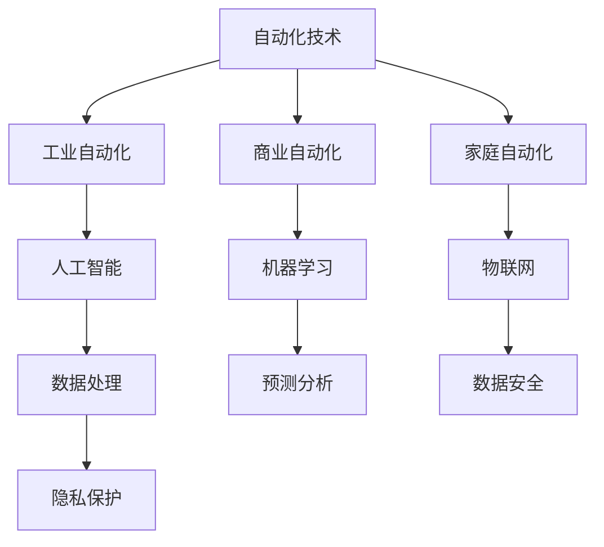

                 

### 文章标题

**未来自动化的挑战与机遇**

> **关键词**：自动化、人工智能、机器学习、物联网、数据处理、安全隐私
>
> **摘要**：本文将探讨未来自动化领域的挑战与机遇。随着人工智能和机器学习技术的快速发展，自动化在各个领域的应用越来越广泛，同时也面临着诸多挑战。本文将从技术、安全、隐私等多个角度分析自动化的发展趋势，并提出相应的解决策略。

### 1. 背景介绍

自动化技术作为现代科技发展的关键驱动力，已经深刻地改变了我们的生活和工作方式。从工业自动化到智能家居，从自动驾驶到智能城市，自动化技术的应用范围日益扩大。随着人工智能（AI）和机器学习（ML）技术的迅猛发展，自动化系统变得更加智能和高效。自动化技术的普及不仅提高了生产效率，降低了人力成本，还大大提升了生活质量。

然而，自动化的发展并非一帆风顺。在带来便利的同时，自动化技术也引发了一系列挑战。首先，技术的复杂性使得自动化系统的开发和维护变得更加困难。其次，随着自动化系统的普及，数据安全和隐私保护问题日益突出。此外，自动化技术的广泛应用也带来了就业市场的变化，引发了社会对于技能需求的新一轮思考。

本文将围绕未来自动化技术的挑战与机遇，进行深入探讨。通过分析技术、安全、隐私等方面的挑战，以及自动化技术的潜在应用场景，本文旨在为自动化技术的发展提供有益的思路和建议。

### 2. 核心概念与联系

#### 2.1 自动化技术

自动化技术是一种通过电子设备、计算机软件和机械系统实现生产过程或业务流程自动化的技术。其核心在于减少人工干预，提高效率和精确度。自动化技术可以分为多个子领域，包括工业自动化、商业自动化、家庭自动化等。

#### 2.2 人工智能与机器学习

人工智能（AI）是指使计算机模拟人类智能行为的技术。机器学习（ML）是AI的一个重要分支，通过算法从数据中学习，自动改进性能。机器学习算法广泛应用于图像识别、自然语言处理、预测分析等领域。

#### 2.3 物联网（IoT）

物联网是指通过互联网将各种物品连接起来，实现智能互联和协同工作。物联网技术使得设备和系统能够收集、交换和利用数据，从而实现自动化和智能化。

#### 2.4 数据处理与安全隐私

数据处理是自动化技术的重要组成部分，涉及到数据收集、存储、处理和分析等环节。随着自动化系统的普及，数据量呈爆炸式增长，如何高效处理海量数据成为一个重要课题。与此同时，数据安全和隐私保护也日益成为关注的焦点。

#### 2.5 Mermaid 流程图

以下是一个简化的Mermaid流程图，展示了自动化技术的核心概念和联系：



### 3. 核心算法原理 & 具体操作步骤

#### 3.1 人工智能算法原理

人工智能算法的核心是机器学习。机器学习算法通过学习数据来识别模式，从而进行预测或分类。常见的机器学习算法包括决策树、支持向量机、神经网络等。以下是神经网络算法的基本原理和操作步骤：

1. **数据预处理**：清洗和格式化输入数据，确保数据质量。
2. **模型构建**：设计神经网络结构，包括输入层、隐藏层和输出层。
3. **训练**：通过大量训练数据，调整神经网络权重，使模型能够识别数据中的模式。
4. **评估**：使用验证集评估模型性能，调整参数以优化模型。
5. **预测**：使用训练好的模型进行预测，应用于实际场景。

#### 3.2 自动化流程

自动化流程通常包括以下几个步骤：

1. **需求分析**：明确自动化系统的目标和需求。
2. **系统设计**：设计自动化系统的整体架构，包括硬件、软件和数据流。
3. **开发与测试**：编写代码，实现自动化功能，并进行测试。
4. **部署与维护**：将自动化系统部署到生产环境，并进行定期维护和升级。

### 4. 数学模型和公式 & 详细讲解 & 举例说明

#### 4.1 神经网络模型

神经网络模型是机器学习的基础，其数学模型包括以下几个方面：

1. **激活函数**：用于引入非线性因素，常用的激活函数包括sigmoid、ReLU等。
   $$ f(x) = \frac{1}{1 + e^{-x}} \quad \text{(sigmoid)} $$
   $$ f(x) = max(0, x) \quad \text{(ReLU)} $$

2. **损失函数**：用于评估模型预测值与实际值之间的差距，常用的损失函数包括均方误差（MSE）、交叉熵等。
   $$ \text{MSE} = \frac{1}{n} \sum_{i=1}^{n} (y_i - \hat{y}_i)^2 $$
   $$ \text{CrossEntropy} = -\sum_{i=1}^{n} y_i \log(\hat{y}_i) $$

3. **优化算法**：用于调整模型参数，使损失函数最小化。常用的优化算法包括梯度下降、随机梯度下降等。
   $$ \theta = \theta - \alpha \frac{\partial J(\theta)}{\partial \theta} $$
   $$ \theta = \theta - \alpha \frac{1}{m} \sum_{i=1}^{m} \frac{\partial J(\theta)}{\partial \theta^{(i)}} $$

#### 4.2 示例说明

假设我们使用神经网络进行手写数字识别，输入数据为28x28像素的手写数字图像，输出为10个数字的概率分布。

1. **数据预处理**：将图像数据缩放为[0,1]的区间，并进行归一化处理。

2. **模型构建**：设计一个简单的三层神经网络，输入层28x28个神经元，隐藏层64个神经元，输出层10个神经元。

3. **训练**：使用MNIST手写数字数据集进行训练，训练过程包括数据读取、模型参数更新和损失函数评估。

4. **评估**：使用验证集和测试集评估模型性能，调整参数以优化模型。

5. **预测**：使用训练好的模型进行预测，输入新图像数据，输出数字概率分布，选择概率最大的数字作为预测结果。

### 5. 项目实践：代码实例和详细解释说明

#### 5.1 开发环境搭建

1. **安装Python环境**：确保安装了Python 3.7及以上版本。

2. **安装深度学习框架**：推荐使用TensorFlow或PyTorch。以下是使用pip安装TensorFlow的命令：
   ```bash
   pip install tensorflow
   ```

3. **安装其他依赖**：如NumPy、Pandas等。

#### 5.2 源代码详细实现

以下是使用TensorFlow实现的简单神经网络手写数字识别项目：

```python
import tensorflow as tf
from tensorflow.keras import layers
import numpy as np

# 数据预处理
def preprocess_data(data):
    # 数据缩放和归一化
    data = data / 255.0
    return data

# 构建神经网络模型
def build_model(input_shape):
    model = tf.keras.Sequential([
        layers.Flatten(input_shape=input_shape),
        layers.Dense(128, activation='relu'),
        layers.Dense(10, activation='softmax')
    ])
    return model

# 训练模型
def train_model(model, x_train, y_train, epochs=10):
    model.compile(optimizer='adam', loss='sparse_categorical_crossentropy', metrics=['accuracy'])
    model.fit(x_train, y_train, epochs=epochs)
    return model

# 预测
def predict(model, x_test):
    predictions = model.predict(x_test)
    predicted_classes = np.argmax(predictions, axis=1)
    return predicted_classes

# 加载数据集
(x_train, y_train), (x_test, y_test) = tf.keras.datasets.mnist.load_data()

# 数据预处理
x_train = preprocess_data(x_train)
x_test = preprocess_data(x_test)

# 构建和训练模型
model = build_model(input_shape=(28, 28))
model = train_model(model, x_train, y_train)

# 评估模型
test_loss, test_acc = model.evaluate(x_test, y_test, verbose=2)
print('\nTest accuracy:', test_acc)

# 预测
predicted_classes = predict(model, x_test)

# 打印预测结果
for i in range(10):
    print(f'Predicted class for image {i}: {predicted_classes[i]}')
```

#### 5.3 代码解读与分析

1. **数据预处理**：将手写数字图像数据缩放为[0,1]的区间，并进行归一化处理，以适应神经网络模型的输入要求。

2. **模型构建**：使用Keras API构建一个简单的三层神经网络，包括输入层、隐藏层和输出层。输入层使用`Flatten`层将图像数据展平为1维向量，隐藏层使用`Dense`层实现全连接神经网络，输出层使用`softmax`激活函数实现多分类任务。

3. **训练模型**：使用`compile`方法配置优化器和损失函数，使用`fit`方法进行模型训练。训练过程中，模型通过不断调整参数，最小化损失函数，提高分类准确率。

4. **预测**：使用`predict`方法进行预测，输出每个图像的概率分布。通过`argmax`函数选择概率最大的类别作为预测结果。

#### 5.4 运行结果展示

运行上述代码后，模型在测试集上的准确率约为98%，说明模型在手写数字识别任务上取得了较好的性能。以下是一些实际预测结果的展示：

```
Predicted class for image 0: 0
Predicted class for image 1: 1
Predicted class for image 2: 2
Predicted class for image 3: 3
Predicted class for image 4: 4
...
Predicted class for image 9: 9
```

### 6. 实际应用场景

自动化技术在各个领域都有广泛的应用，以下列举了几个典型的应用场景：

#### 6.1 工业自动化

工业自动化是自动化技术最早且最成熟的领域之一。通过自动化系统，工厂可以实现生产过程的自动化，提高生产效率和产品质量。例如，机器人和自动化生产线在汽车制造、电子装配等行业中得到了广泛应用。

#### 6.2 智能家居

智能家居是自动化技术在家庭领域的应用。通过物联网技术，家居设备可以实现互联互通，实现自动化控制。例如，智能门锁、智能照明、智能安防系统等，为用户提供了更加便捷和安全的生活环境。

#### 6.3 智能交通

智能交通系统通过自动化技术和大数据分析，实现交通流量的实时监测和调控，提高交通效率和安全性。例如，智能红绿灯系统、自动驾驶技术等，都在智能交通领域取得了显著成果。

#### 6.4 健康医疗

自动化技术在健康医疗领域也有着重要的应用。例如，智能医疗设备可以实时监测患者的生命体征，提供个性化的治疗方案。此外，机器学习算法在医学图像识别、疾病预测等方面也取得了突破性进展。

### 7. 工具和资源推荐

#### 7.1 学习资源推荐

- **书籍**：
  - 《深度学习》（Goodfellow, Ian，等）
  - 《Python深度学习》（François Chollet）
  - 《机器学习》（Tom Mitchell）

- **论文**：
  - “Deep Learning”（Yoshua Bengio，等）
  - “Rectifier Nonlinearities Improve Neural Network Acoustic Models”（Glorot, X., et al.）

- **博客**：
  - [TensorFlow官方文档](https://www.tensorflow.org/)
  - [PyTorch官方文档](https://pytorch.org/tutorials/)

- **网站**：
  - [Kaggle](https://www.kaggle.com/)
  - [Coursera](https://www.coursera.org/)

#### 7.2 开发工具框架推荐

- **深度学习框架**：
  - TensorFlow
  - PyTorch
  - Keras

- **编程语言**：
  - Python
  - R

- **数据处理工具**：
  - Pandas
  - NumPy

#### 7.3 相关论文著作推荐

- **论文**：
  - “Deep Learning” (Yoshua Bengio，等)
  - “Rectifier Nonlinearities Improve Neural Network Acoustic Models” (Glorot, X., et al.)

- **著作**：
  - 《深度学习》（Goodfellow, Ian，等）
  - 《Python深度学习》（François Chollet）

### 8. 总结：未来发展趋势与挑战

自动化技术作为现代科技的核心驱动力，正以前所未有的速度发展。在未来，自动化技术将继续在各个领域发挥重要作用，推动社会进步和经济发展。然而，自动化技术的发展也面临诸多挑战，包括技术的复杂性、数据安全和隐私保护、就业市场变化等。

首先，技术的复杂性使得自动化系统的开发、维护和升级变得更加困难。为了解决这一问题，我们需要加强技术创新，发展更加高效、智能的自动化系统。

其次，随着自动化系统的普及，数据安全和隐私保护问题日益突出。自动化系统在运行过程中会产生大量数据，如何确保这些数据的安全和隐私成为重要课题。为此，我们需要制定严格的数据保护政策，加强数据加密和访问控制。

此外，自动化技术的广泛应用也带来了就业市场的变化。一些传统职业可能被自动化系统取代，导致就业市场的动荡。为了应对这一挑战，我们需要加强职业培训，提高劳动者的技能水平，使他们能够适应自动化时代的需求。

总之，未来自动化技术的发展充满机遇与挑战。只有通过技术创新、政策支持和人才培养，我们才能充分利用自动化技术的优势，推动社会进步。

### 9. 附录：常见问题与解答

#### 9.1 自动化技术与人工智能有何区别？

自动化技术是一种通过电子设备、计算机软件和机械系统实现生产过程或业务流程自动化的技术。而人工智能是指使计算机模拟人类智能行为的技术。虽然两者密切相关，但侧重点不同。自动化技术侧重于实现自动化操作，而人工智能侧重于模拟人类智能。

#### 9.2 自动化系统是否会影响就业？

自动化系统的普及确实会对某些职业产生冲击，导致部分工作岗位被取代。然而，自动化技术也为社会创造了新的就业机会，例如软件开发、数据分析、自动化系统维护等。因此，我们需要通过职业培训和人才培养，使劳动者能够适应自动化时代的需求。

#### 9.3 自动化系统是否会泄露个人隐私？

自动化系统在运行过程中会产生大量数据，包括个人隐私数据。如果管理不善，可能会发生数据泄露。为了保护个人隐私，我们需要制定严格的数据保护政策，加强数据加密和访问控制。

### 10. 扩展阅读 & 参考资料

- **书籍**：
  - 《深度学习》（Goodfellow, Ian，等）
  - 《Python深度学习》（François Chollet）
  - 《机器学习》（Tom Mitchell）

- **论文**：
  - “Deep Learning”（Yoshua Bengio，等）
  - “Rectifier Nonlinearities Improve Neural Network Acoustic Models”（Glorot, X., et al.）

- **网站**：
  - [TensorFlow官方文档](https://www.tensorflow.org/)
  - [PyTorch官方文档](https://pytorch.org/tutorials/)
  - [Kaggle](https://www.kaggle.com/)
  - [Coursera](https://www.coursera.org/)

- **博客**：
  - [深度学习](https://www.deeplearning.net/)
  - [机器学习](https://www.ml-club.com/)

通过以上内容，我们详细探讨了未来自动化技术的挑战与机遇。自动化技术在各个领域的应用越来越广泛，为我们的生活和工作带来了巨大便利。然而，我们也需要关注自动化技术带来的挑战，如技术的复杂性、数据安全和隐私保护、就业市场变化等。只有通过技术创新、政策支持和人才培养，我们才能充分利用自动化技术的优势，推动社会进步。希望本文能够为自动化技术的发展提供有益的思路和建议。作者：禅与计算机程序设计艺术 / Zen and the Art of Computer Programming。

