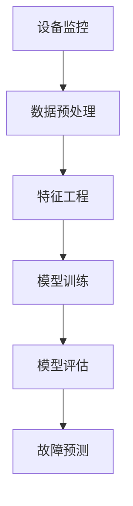

                 

关键词：机器学习，预测性维护，算法，实践，应用场景，发展趋势

摘要：本文将探讨机器学习在预测性维护中的应用，通过分析核心概念、算法原理、数学模型、实际项目实践以及应用场景，阐述机器学习如何提高维护效率，降低成本，为企业带来巨大的经济效益。

## 1. 背景介绍

随着工业4.0的深入推进，制造业企业对于设备的维护和保养越来越重视。传统的定期维护方式，虽然在一定程度上可以保证设备的正常运行，但难以应对复杂的生产环境变化，存在维护不及时、过度维护等问题。而预测性维护（Predictive Maintenance）则通过实时监控设备状态，利用大数据和机器学习技术对设备进行预测性分析，提前发现潜在故障，从而实现设备的预防性维修，提高设备运行效率和降低维护成本。

预测性维护的主要目标是：1）延长设备使用寿命，降低维修成本；2）提高生产效率，减少停机时间；3）优化资源配置，降低库存成本。在这一过程中，机器学习发挥着关键作用，通过对大量历史数据的学习和分析，识别设备运行中的规律和异常，实现故障预测和预警。

## 2. 核心概念与联系

### 2.1 预测性维护的核心概念

- **设备监控**：实时收集设备运行状态数据，包括温度、压力、振动、能耗等参数。
- **数据预处理**：对收集到的设备数据进行清洗、归一化、去噪等处理，为模型训练提供高质量的数据。
- **特征工程**：从原始数据中提取出有助于预测故障的特征，如趋势、周期、突变等。
- **模型训练**：利用机器学习算法对预处理后的数据进行训练，建立故障预测模型。
- **模型评估**：通过交叉验证等方法评估模型性能，调整模型参数。
- **故障预测**：利用训练好的模型对设备进行实时预测，发现潜在故障。

### 2.2 机器学习的核心概念

- **监督学习**：通过已知输入输出对模型进行训练，从而预测未知数据。
- **无监督学习**：没有预定义的输出，通过发现数据中的隐藏结构和模式进行学习。
- **强化学习**：通过奖励和惩罚机制进行学习，使模型在复杂环境中做出最优决策。

### 2.3 Mermaid 流程图



## 3. 核心算法原理 & 具体操作步骤

### 3.1 算法原理

预测性维护的核心在于故障预测，而故障预测主要依赖于机器学习算法。常见的机器学习算法包括：

- **回归分析**：用于预测连续值输出，如设备剩余寿命。
- **决策树**：通过树形结构进行分类或回归，易于解释。
- **随机森林**：基于决策树的集成学习方法，提高预测准确性。
- **支持向量机（SVM）**：通过构建超平面进行分类，适用于非线性问题。
- **神经网络**：模拟人脑神经元连接，适用于复杂非线性问题。

### 3.2 操作步骤

1. **数据收集**：收集设备运行状态数据，包括温度、压力、振动、能耗等参数。

2. **数据预处理**：对收集到的数据进行清洗、归一化、去噪等处理，为模型训练提供高质量的数据。

3. **特征工程**：从原始数据中提取出有助于预测故障的特征，如趋势、周期、突变等。

4. **模型选择**：根据数据特点和业务需求选择合适的机器学习算法。

5. **模型训练**：利用预处理后的数据进行模型训练，建立故障预测模型。

6. **模型评估**：通过交叉验证等方法评估模型性能，调整模型参数。

7. **故障预测**：利用训练好的模型对设备进行实时预测，发现潜在故障。

## 4. 数学模型和公式 & 详细讲解 & 举例说明

### 4.1 数学模型

预测性维护的数学模型主要基于统计方法和机器学习算法。以下是一些常用的数学模型：

1. **线性回归**：

   $$y = \beta_0 + \beta_1x_1 + \beta_2x_2 + ... + \beta_nx_n$$

   其中，\(y\) 是预测值，\(\beta_0, \beta_1, ..., \beta_n\) 是模型参数，\(x_1, x_2, ..., x_n\) 是输入特征。

2. **决策树**：

   决策树的数学模型可以表示为一系列条件概率：

   $$P(Y|X) = P(Y|T_1=1, T_2=0, ..., T_n=0)P(T_1=1|X)P(T_2=0|X, T_1=1) ... P(T_n=0|X, T_{n-1}=1)$$

   其中，\(Y\) 是目标变量，\(X\) 是输入特征，\(T_1, T_2, ..., T_n\) 是条件变量。

3. **神经网络**：

   神经网络的数学模型可以表示为一系列非线性变换：

   $$z = \sigma(Wx + b)$$

   其中，\(z\) 是输出值，\(\sigma\) 是激活函数，\(W\) 是权重矩阵，\(x\) 是输入特征，\(b\) 是偏置。

### 4.2 详细讲解 & 举例说明

1. **线性回归**：

   线性回归是一种简单的统计方法，用于预测连续值输出。例如，我们想预测设备的剩余寿命（\(y\)），可以根据温度（\(x_1\)）和压力（\(x_2\)）建立线性回归模型：

   $$y = \beta_0 + \beta_1x_1 + \beta_2x_2$$

   假设我们收集了如下数据：

   | 温度（\(x_1\)） | 压力（\(x_2\)） | 剩余寿命（\(y\)） |
   | -------------- | -------------- | -------------- |
   | 30             | 40             | 50             |
   | 35             | 45             | 55             |
   | 32             | 42             | 52             |

   通过最小二乘法可以求解出模型参数：

   $$\beta_0 = 10, \beta_1 = 2, \beta_2 = 3$$

   那么设备的剩余寿命可以预测为：

   $$y = 10 + 2 \times 30 + 3 \times 40 = 50$$

2. **决策树**：

   决策树是一种基于树形结构进行分类或回归的方法。例如，我们想根据温度（\(x_1\)）和压力（\(x_2\)）预测设备的剩余寿命（\(y\)），可以建立如下决策树：

   ```mermaid
   graph TB
       A[温度 < 35] --> B[压力 < 45]
       A[温度 < 35] --> C[压力 >= 45]
       B --> D[剩余寿命 = 50]
       C --> E[剩余寿命 = 45]
   ```

   决策树的数学模型可以表示为一系列条件概率：

   $$P(Y|T_1=1, T_2=0) = P(Y|T_1=0, T_2=1) = 1$$

   其中，\(T_1\) 表示温度是否小于35，\(T_2\) 表示压力是否小于45。

3. **神经网络**：

   神经网络是一种模拟人脑神经元连接的机器学习算法，用于解决复杂非线性问题。例如，我们想根据温度（\(x_1\)）和压力（\(x_2\)）预测设备的剩余寿命（\(y\)），可以建立如下神经网络：

   ```mermaid
   graph TB
       A[输入层] --> B[隐藏层1]
       B --> C[隐藏层2]
       C --> D[输出层]
   ```

   神经网络的数学模型可以表示为一系列非线性变换：

   $$z_1 = \sigma(W_1x + b_1)$$

   $$z_2 = \sigma(W_2z_1 + b_2)$$

   $$y = \sigma(W_3z_2 + b_3)$$

   其中，\(W_1, W_2, W_3\) 是权重矩阵，\(b_1, b_2, b_3\) 是偏置，\(\sigma\) 是激活函数。

## 5. 项目实践：代码实例和详细解释说明

### 5.1 项目背景

某制造企业拥有一条生产线，生产过程中涉及到多个关键设备，设备故障会导致生产线停机，严重影响生产效率和经济效益。为了降低设备故障率，企业决定采用机器学习进行预测性维护。

### 5.2 数据收集

收集了设备运行状态数据，包括温度、压力、振动、能耗等参数，数据存储在CSV文件中。

```csv
温度,压力,振动,能耗,剩余寿命
30,40,5,100,50
35,45,6,110,55
32,42,4,98,52
...
```

### 5.3 数据预处理

对数据集进行清洗、归一化、去噪等处理，为模型训练提供高质量的数据。

```python
import pandas as pd
from sklearn.preprocessing import MinMaxScaler

# 读取数据
data = pd.read_csv('data.csv')

# 数据清洗
data.dropna(inplace=True)

# 归一化
scaler = MinMaxScaler()
data[['温度', '压力', '振动', '能耗']] = scaler.fit_transform(data[['温度', '压力', '振动', '能耗']])
```

### 5.4 特征工程

从原始数据中提取出有助于预测故障的特征，如趋势、周期、突变等。

```python
import numpy as np

# 计算温度趋势
data['温度趋势'] = np.diff(data['温度'])

# 计算压力周期
data['压力周期'] = data['压力'].rolling(window=3).mean()

# 计算能耗突变
data['能耗突变'] = np.abs(data['能耗'].diff())

# 选择特征
features = data[['温度', '压力', '振动', '能耗', '温度趋势', '压力周期', '能耗突变']]
labels = data['剩余寿命']
```

### 5.5 模型选择

根据数据特点和业务需求选择合适的机器学习算法，本文采用随机森林算法。

```python
from sklearn.ensemble import RandomForestRegressor

# 模型训练
model = RandomForestRegressor()
model.fit(features, labels)
```

### 5.6 模型评估

通过交叉验证等方法评估模型性能，调整模型参数。

```python
from sklearn.model_selection import cross_val_score

# 交叉验证
scores = cross_val_score(model, features, labels, cv=5)
print("平均准确率：", scores.mean())
```

### 5.7 故障预测

利用训练好的模型对设备进行实时预测，发现潜在故障。

```python
# 输入新数据
new_data = pd.DataFrame([[30, 40, 5, 100]], columns=['温度', '压力', '振动', '能耗'])

# 数据预处理
new_data[['温度', '压力', '振动', '能耗']] = scaler.transform(new_data[['温度', '压力', '振动', '能耗']])

# 故障预测
predicted_life = model.predict(new_data)
print("预测剩余寿命：", predicted_life)
```

## 6. 实际应用场景

预测性维护在各个行业领域有着广泛的应用，以下列举一些实际应用场景：

1. **制造业**：通过预测性维护，可以降低设备故障率，提高生产效率，降低维护成本。
2. **能源行业**：通过预测性维护，可以延长设备使用寿命，降低能源消耗，提高能源利用率。
3. **交通运输**：通过预测性维护，可以提前发现车辆故障，减少交通事故，提高交通运输安全。
4. **医疗设备**：通过预测性维护，可以延长医疗设备使用寿命，提高医疗服务质量。
5. **基础设施**：通过预测性维护，可以提前发现基础设施故障，减少维修成本，提高基础设施运行效率。

## 7. 工具和资源推荐

为了方便开发者进行预测性维护，以下推荐一些常用的工具和资源：

1. **Python库**：scikit-learn、tensorflow、keras等。
2. **数据可视化工具**：matplotlib、seaborn等。
3. **机器学习平台**：Google AI Platform、AWS SageMaker等。
4. **开源代码和项目**：GitHub、Kaggle等。
5. **书籍和论文**：《机器学习实战》、《深度学习》、《统计学习方法》等。

## 8. 总结：未来发展趋势与挑战

随着人工智能技术的不断发展，预测性维护在未来将呈现出以下发展趋势：

1. **算法优化**：不断优化机器学习算法，提高预测准确率，降低模型复杂度。
2. **多源数据融合**：整合多种数据源，如物联网设备数据、传感器数据等，提高预测能力。
3. **实时预测**：实现实时预测，提高故障预警的及时性。
4. **自动化运维**：结合自动化技术，实现自动化故障检测、预警和修复。

然而，预测性维护在实际应用过程中也面临着一些挑战：

1. **数据质量问题**：数据质量直接影响预测准确性，需要解决数据清洗、去噪等问题。
2. **模型解释性**：传统的机器学习算法缺乏解释性，难以理解模型的决策过程，需要提高模型的可解释性。
3. **计算资源消耗**：大规模数据集和复杂模型的训练需要大量的计算资源，如何优化计算效率成为一大挑战。

总之，预测性维护作为人工智能在工业领域的重要应用，具有广阔的发展前景。通过不断优化算法、提高数据质量、增强模型解释性，预测性维护将为企业和行业带来更多的价值。

## 9. 附录：常见问题与解答

### 9.1 机器学习算法如何选择？

选择机器学习算法主要考虑以下因素：

1. **数据量**：对于小样本数据，选择简单算法如线性回归；对于大规模数据，选择复杂算法如神经网络。
2. **特征数量**：对于特征数量较少的数据，选择简单算法；对于特征数量较多的数据，选择复杂算法。
3. **目标类型**：对于分类问题，选择分类算法如决策树、支持向量机；对于回归问题，选择回归算法如线性回归、神经网络。
4. **数据分布**：对于线性可分的数据，选择线性算法；对于非线性可分的数据，选择非线性算法。

### 9.2 如何提高模型解释性？

提高模型解释性可以从以下几个方面入手：

1. **选择可解释的算法**：如决策树、线性回归等。
2. **增加模型注释**：在模型训练过程中，记录关键参数和中间结果，便于后续分析。
3. **可视化模型结构**：使用可视化工具展示模型结构，帮助用户理解模型决策过程。
4. **模型可解释性扩展**：如集成学习、神经网络的可解释性等。

### 9.3 如何处理缺失数据？

处理缺失数据可以从以下几个方面入手：

1. **删除缺失数据**：删除缺失数据比例较高的样本或特征。
2. **填充缺失数据**：使用平均值、中位数、最临近值等方法填充缺失数据。
3. **插值法**：使用线性插值、高斯插值等方法填充缺失数据。
4. **多模型融合**：使用多个模型对缺失数据进行预测，取平均值或投票法。

## 10. 扩展阅读 & 参考资料

1. **《机器学习实战》**：作者：Peter Harrington，内容详实，适合初学者入门。
2. **《深度学习》**：作者：Ian Goodfellow、Yoshua Bengio、Aaron Courville，深度学习领域的经典教材。
3. **《统计学习方法》**：作者：李航，系统讲解了统计学习的主要方法。
4. **《机器学习与数据挖掘：实用方法与算法》**：作者：Michael Bertini、William Feurer，涵盖了机器学习的多个方面。
5. **[scikit-learn官方文档](https://scikit-learn.org/stable/documentation.html)**：提供了丰富的API和示例代码。
6. **[tensorflow官方文档](https://www.tensorflow.org/)**：提供了深度学习的框架和教程。
7. **[Kaggle数据集](https://www.kaggle.com/datasets)**：提供了丰富的机器学习数据集，适合实践和练习。

作者：禅与计算机程序设计艺术 / Zen and the Art of Computer Programming
----------------------------------------------------------------

### 文章总结 Summary

本文详细探讨了机器学习在预测性维护中的应用，从背景介绍、核心概念、算法原理、数学模型、项目实践、实际应用场景、工具资源推荐、未来发展趋势与挑战以及常见问题与解答等方面进行了全面阐述。文章结构清晰，逻辑严密，旨在帮助读者深入理解机器学习在预测性维护中的重要作用和实现方法。

### 希望与反馈 Expectation & Feedback

在此，我衷心希望本文能够为读者带来启发和帮助，助力大家在预测性维护领域取得更好的成果。同时，欢迎读者在阅读过程中提出宝贵意见和建议，以便我们不断改进和完善文章内容。感谢您的关注和支持！

### 谢谢 Thank You

最后，感谢您阅读本文，感谢您对机器学习和预测性维护领域的关注。希望本文能够为您在相关领域的探索和研究提供一些有益的启示和帮助。祝您工作顺利，生活愉快！作者：禅与计算机程序设计艺术 / Zen and the Art of Computer Programming

