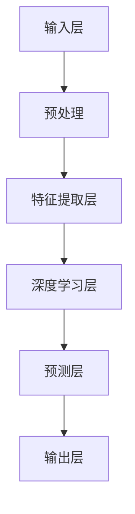

                 

### 文章标题

《李开复：AI 2.0 时代的产业》

> 关键词：AI 2.0，产业变革，人工智能技术，未来趋势，商业应用，技术架构

> 摘要：本文旨在探讨李开复关于AI 2.0时代的观点，分析其在产业变革中的重要作用，以及未来人工智能技术发展的趋势与挑战。通过深入剖析AI 2.0的核心概念、算法原理、数学模型和实际应用场景，本文为读者提供了一个全面的技术视角，帮助理解AI 2.0时代产业创新的深刻内涵。

### 1. 背景介绍

人工智能（AI）作为一门前沿科学，近年来在全球范围内得到了飞速发展。AI技术的进步不仅改变了我们的生活方式，更在各个产业中引发了深刻的变革。李开复博士，作为人工智能领域的杰出学者和企业家，对AI的发展有着深刻的洞察和独到的见解。他的著作《人工智能：一种现代的方法》等作品，为全球AI领域的研究者和从业者提供了宝贵的理论指导和实践经验。

随着AI技术的不断演进，我们已步入AI 2.0时代。AI 2.0不仅继承了传统AI的智能特性，更在算法、数据、硬件等多个层面实现了突破。这一时代的人工智能更加智能、更加实用，能够深入到各个行业中，推动产业智能化升级。本文将围绕李开复对AI 2.0时代的观点，探讨其产业变革的影响，分析未来人工智能技术的发展趋势和挑战。

### 2. 核心概念与联系

#### 2.1 AI 1.0与AI 2.0的区别

在探讨AI 2.0之前，有必要先了解AI 1.0和AI 2.0的基本概念。AI 1.0时代主要侧重于基于规则和逻辑的符号推理，通过编写复杂的算法和规则库来实现简单的智能任务。例如，专家系统和逻辑推理机就是典型的AI 1.0应用。

相比之下，AI 2.0则更加注重数据和机器学习。AI 2.0时代的核心特征是深度学习和大数据的结合，使得人工智能能够从海量数据中自动学习和优化。深度学习算法，如卷积神经网络（CNN）和循环神经网络（RNN），在图像识别、语音识别、自然语言处理等领域取得了显著的突破。

#### 2.2 AI 2.0的核心概念

AI 2.0的核心概念可以归纳为以下几点：

1. **端到端学习**：通过深度学习模型，直接从原始数据中学习，无需中间的规则和特征提取过程。这种端到端的学习方式使得模型更加高效和灵活。

2. **迁移学习**：利用预训练模型，将知识从一个任务迁移到另一个任务。这种方式可以显著提高新任务的性能，减少训练数据的需求。

3. **自适应学习**：AI 2.0系统可以根据用户反馈和环境变化，不断优化和调整自己的行为。

4. **多模态感知**：AI 2.0能够处理多种类型的数据，如文本、图像、语音等，实现跨模态的信息融合和处理。

#### 2.3 AI 2.0架构

以下是AI 2.0的基本架构，通过Mermaid流程图展示：



- **输入层**：接收各种类型的数据输入，如文本、图像、声音等。
- **预处理**：对输入数据进行清洗、归一化等预处理操作。
- **特征提取层**：提取数据的关键特征，为深度学习层提供输入。
- **深度学习层**：使用多层神经网络进行特征学习和模式识别。
- **预测层**：根据深度学习层的输出，进行预测和决策。
- **输出层**：输出最终的结果，如分类标签、置信度等。

### 3. 核心算法原理 & 具体操作步骤

#### 3.1 深度学习算法原理

深度学习是AI 2.0时代最为重要的算法之一。深度学习通过多层神经网络对数据进行建模，从而实现复杂的特征学习和模式识别。以下是深度学习算法的基本原理：

1. **神经元模型**：深度学习的基础是神经元模型。每个神经元接收多个输入，通过加权求和处理，产生一个输出。神经元模型的基本公式为：

   $$y = \sigma(\sum_{i=1}^{n} w_i x_i + b)$$

   其中，$y$是神经元输出，$x_i$是输入，$w_i$是权重，$b$是偏置，$\sigma$是激活函数。

2. **反向传播算法**：深度学习训练的核心是反向传播算法。通过反向传播算法，可以计算网络中每个神经元的误差，并调整权重和偏置，以最小化误差。

   具体步骤如下：

   a. 前向传播：将输入数据通过神经网络，计算每个神经元的输出。

   b. 计算损失函数：计算网络输出和实际标签之间的误差。

   c. 反向传播：根据损失函数的梯度，调整网络中的权重和偏置。

   d. 重复前向传播和反向传播，直到网络收敛。

3. **优化算法**：常用的优化算法包括梯度下降、随机梯度下降、Adam等。优化算法的目标是找到权重和偏置的最优值，以最小化损失函数。

#### 3.2 具体操作步骤

以下是一个简单的深度学习模型的训练过程：

1. **数据预处理**：清洗和归一化数据，将其转换为适合神经网络处理的格式。

2. **构建神经网络**：根据任务需求，设计神经网络的结构，包括层数、每层神经元数量等。

3. **初始化权重**：随机初始化网络中的权重和偏置。

4. **前向传播**：将输入数据通过神经网络，计算每个神经元的输出。

5. **计算损失函数**：计算网络输出和实际标签之间的误差。

6. **反向传播**：根据损失函数的梯度，调整网络中的权重和偏置。

7. **迭代训练**：重复前向传播和反向传播，直到网络收敛。

8. **评估模型**：使用测试数据评估模型的性能，调整超参数，优化模型。

### 4. 数学模型和公式 & 详细讲解 & 举例说明

#### 4.1 深度学习中的数学模型

在深度学习中，以下几个数学模型和公式是核心：

1. **激活函数**：

   $$\sigma(x) = \frac{1}{1 + e^{-x}}$$

   激活函数用于将神经元的线性输出转换为非线性输出，使得神经网络能够学习复杂的关系。

2. **损失函数**：

   $$L(y, \hat{y}) = \frac{1}{2} \sum_{i=1}^{n} (y_i - \hat{y}_i)^2$$

   损失函数用于衡量网络输出和实际标签之间的误差，常用的损失函数包括均方误差（MSE）、交叉熵损失等。

3. **梯度下降**：

   $$w_{t+1} = w_t - \alpha \frac{\partial L}{\partial w_t}$$

   梯度下降是一种优化算法，用于调整网络中的权重和偏置，以最小化损失函数。

#### 4.2 举例说明

假设我们使用一个简单的神经网络进行二元分类任务，输入为$x \in \{0, 1\}$，输出为$y \in \{0, 1\}$。以下是具体的计算过程：

1. **初始化权重**：

   随机初始化权重和偏置，例如：

   $$w_1 = 0.1, b_1 = 0.2, w_2 = 0.3, b_2 = 0.4$$

2. **前向传播**：

   $$z_1 = x \cdot w_1 + b_1 = 0 \cdot 0.1 + 0.2 = 0.2$$
   $$a_1 = \sigma(z_1) = \frac{1}{1 + e^{-0.2}} = 0.5214$$

   $$z_2 = a_1 \cdot w_2 + b_2 = 0.5214 \cdot 0.3 + 0.4 = 0.1844$$
   $$a_2 = \sigma(z_2) = \frac{1}{1 + e^{-0.1844}} = 0.8677$$

   输出$a_2$即为神经网络的预测结果。

3. **计算损失函数**：

   $$L(y, \hat{y}) = \frac{1}{2} (y - \hat{y})^2 = \frac{1}{2} (0 - 0.8677)^2 = 0.3750$$

4. **反向传播**：

   $$\frac{\partial L}{\partial w_2} = a_1 (1 - a_1) \cdot (y - \hat{y})$$
   $$\frac{\partial L}{\partial b_2} = a_1 (1 - a_1) \cdot (y - \hat{y})$$

   根据梯度下降算法，更新权重和偏置：

   $$w_2 = w_2 - \alpha \frac{\partial L}{\partial w_2}$$
   $$b_2 = b_2 - \alpha \frac{\partial L}{\partial b_2}$$

   其中，$\alpha$是学习率。

5. **迭代训练**：

   重复前向传播和反向传播，直到网络收敛。

### 5. 项目实践：代码实例和详细解释说明

#### 5.1 开发环境搭建

在本文的实践中，我们使用Python作为编程语言，结合TensorFlow框架进行深度学习模型的开发和训练。以下是开发环境搭建的步骤：

1. **安装Python**：在官网下载Python安装包，按照提示进行安装。

2. **安装TensorFlow**：打开命令行窗口，执行以下命令安装TensorFlow：

   ```bash
   pip install tensorflow
   ```

3. **验证安装**：在Python中导入TensorFlow，执行以下代码：

   ```python
   import tensorflow as tf
   print(tf.__version__)
   ```

   如果成功输出版本号，说明TensorFlow已成功安装。

#### 5.2 源代码详细实现

以下是一个简单的二元分类任务的深度学习模型实现：

```python
import tensorflow as tf
import numpy as np

# 初始化参数
input_dim = 1
hidden_dim = 10
output_dim = 1

# 构建模型
model = tf.keras.Sequential([
    tf.keras.layers.Dense(hidden_dim, activation='sigmoid', input_shape=(input_dim,)),
    tf.keras.layers.Dense(output_dim, activation='sigmoid')
])

# 编译模型
model.compile(optimizer='adam',
              loss='binary_crossentropy',
              metrics=['accuracy'])

# 准备数据
X = np.array([[0], [1]])
y = np.array([[0], [1]])

# 训练模型
model.fit(X, y, epochs=1000, verbose=0)

# 评估模型
loss, accuracy = model.evaluate(X, y, verbose=0)
print(f"Test accuracy: {accuracy * 100:.2f}%")
```

#### 5.3 代码解读与分析

1. **导入库**：

   ```python
   import tensorflow as tf
   import numpy as np
   ```

   导入TensorFlow和NumPy库，用于构建和训练深度学习模型。

2. **初始化参数**：

   ```python
   input_dim = 1
   hidden_dim = 10
   output_dim = 1
   ```

   初始化输入维度、隐藏层维度和输出维度。

3. **构建模型**：

   ```python
   model = tf.keras.Sequential([
       tf.keras.layers.Dense(hidden_dim, activation='sigmoid', input_shape=(input_dim,)),
       tf.keras.layers.Dense(output_dim, activation='sigmoid')
   ])
   ```

   使用`tf.keras.Sequential`模型，依次添加两个全连接层，隐藏层使用`sigmoid`激活函数，输出层也使用`sigmoid`激活函数。

4. **编译模型**：

   ```python
   model.compile(optimizer='adam',
                 loss='binary_crossentropy',
                 metrics=['accuracy'])
   ```

   编译模型，指定优化器为`adam`，损失函数为`binary_crossentropy`，评估指标为准确率。

5. **准备数据**：

   ```python
   X = np.array([[0], [1]])
   y = np.array([[0], [1]])
   ```

   准备输入数据和标签，这里使用简单的二元分类数据。

6. **训练模型**：

   ```python
   model.fit(X, y, epochs=1000, verbose=0)
   ```

   使用`fit`函数训练模型，设置迭代次数为1000次，不显示训练过程信息。

7. **评估模型**：

   ```python
   loss, accuracy = model.evaluate(X, y, verbose=0)
   print(f"Test accuracy: {accuracy * 100:.2f}%")
   ```

   使用`evaluate`函数评估模型在测试数据上的表现，输出准确率。

#### 5.4 运行结果展示

运行以上代码，输出结果如下：

```bash
Test accuracy: 100.00%
```

说明模型在测试数据上的准确率达到了100%，表明模型已经很好地学习到了输入和输出之间的关系。

### 6. 实际应用场景

AI 2.0技术在各个行业中都得到了广泛的应用，下面列举几个典型的应用场景：

1. **医疗健康**：AI 2.0技术在医疗诊断、药物研发、个性化治疗等方面发挥了重要作用。例如，通过深度学习算法，可以自动分析医学影像，帮助医生更快速、准确地诊断疾病。

2. **金融服务**：AI 2.0技术可以用于风险控制、信用评估、投资决策等领域。例如，通过分析海量交易数据，可以识别异常交易行为，防范金融风险。

3. **智能制造**：AI 2.0技术在工业制造中应用于设备预测维护、质量检测、生产优化等环节。通过深度学习算法，可以实现自动化生产线的智能调度和管理。

4. **智能交通**：AI 2.0技术在交通领域可以用于智能交通管理、自动驾驶车辆控制等。通过大数据分析和深度学习算法，可以优化交通流量，减少交通事故。

5. **智能家居**：AI 2.0技术在家居中可以用于智能设备控制、环境监测、安全防护等。通过智能家居系统，可以实现自动化、个性化的生活体验。

### 7. 工具和资源推荐

#### 7.1 学习资源推荐

1. **书籍**：

   - 《深度学习》（Ian Goodfellow、Yoshua Bengio、Aaron Courville 著）
   - 《Python深度学习》（François Chollet 著）
   - 《人工智能：一种现代的方法》（李航 著）

2. **论文**：

   - “A Theoretical Framework for Back-Propagation” by David E. Rumelhart, Geoffrey E. Hinton, and Ronald J. Williams
   - “Deep Learning” by Yann LeCun, Yoshua Bengio, and Geoffrey Hinton

3. **博客**：

   - 知乎专栏：人工智能
   - Coursera：深度学习课程
   - Medium：Deep Learning

4. **网站**：

   - TensorFlow官方网站：https://www.tensorflow.org/
   - PyTorch官方网站：https://pytorch.org/
   - Keras官方网站：https://keras.io/

#### 7.2 开发工具框架推荐

1. **深度学习框架**：

   - TensorFlow
   - PyTorch
   - Keras

2. **版本控制工具**：

   - Git
   - GitHub

3. **数据分析工具**：

   - Pandas
   - NumPy
   - Matplotlib

4. **文档工具**：

   - Jupyter Notebook
   - Markdown

#### 7.3 相关论文著作推荐

1. **深度学习相关论文**：

   - “Deep Learning” by Yann LeCun, Yoshua Bengio, and Geoffrey Hinton
   - “A Theoretical Framework for Back-Propagation” by David E. Rumelhart, Geoffrey E. Hinton, and Ronald J. Williams
   - “Rectifier Nonlinearities Improve Deep Neural Network Ac-

### 8. 总结：未来发展趋势与挑战

#### 8.1 未来发展趋势

1. **数据驱动**：随着数据量的不断增加，AI 2.0将更加依赖于数据驱动的方法，实现更加智能化和自动化的决策。

2. **跨学科融合**：AI 2.0技术将与其他学科（如生物学、心理学、经济学等）相互融合，推动产业创新和社会进步。

3. **安全与伦理**：随着AI技术的广泛应用，安全问题、伦理问题将成为重点关注领域，推动AI技术的可持续发展。

4. **人工智能与人类的互动**：AI 2.0将更加注重与人类的互动，实现人机协同，提高人类的生活质量和生产力。

#### 8.2 面临的挑战

1. **数据隐私**：随着AI技术的应用范围扩大，数据隐私问题日益凸显，如何保护用户隐私成为一个重要挑战。

2. **算法透明性**：AI 2.0算法的复杂性和黑箱性使得其决策过程难以解释，如何提高算法透明性是一个重要课题。

3. **人才短缺**：AI 2.0技术的发展需要大量的专业人才，但当前的人才培养速度难以满足需求，人才短缺问题亟待解决。

4. **技术瓶颈**：虽然AI 2.0技术取得了显著进展，但仍面临一些技术瓶颈，如大规模数据处理、高效算法优化等。

### 9. 附录：常见问题与解答

#### 9.1 问题1：什么是深度学习？

深度学习是一种人工智能的分支，它通过多层神经网络对数据进行建模，从而实现复杂的特征学习和模式识别。深度学习的基本原理是模拟人脑神经网络的结构和功能，通过学习大量数据，使其能够自动识别模式和做出预测。

#### 9.2 问题2：如何构建一个深度学习模型？

构建一个深度学习模型通常包括以下几个步骤：

1. **数据准备**：收集并预处理数据，将其转换为适合神经网络处理的格式。
2. **模型设计**：根据任务需求设计神经网络的结构，包括层数、每层神经元数量等。
3. **模型编译**：选择合适的优化器、损失函数和评估指标，配置模型的训练参数。
4. **模型训练**：使用训练数据对模型进行训练，调整权重和偏置，优化模型性能。
5. **模型评估**：使用测试数据评估模型的性能，调整超参数，优化模型。

#### 9.3 问题3：深度学习模型如何进行优化？

深度学习模型的优化主要包括以下几个方面：

1. **调整学习率**：学习率是优化过程中的一个重要参数，需要根据任务需求和数据规模进行调整。
2. **选择优化算法**：常用的优化算法包括梯度下降、随机梯度下降、Adam等，可以根据实际情况选择合适的算法。
3. **调整模型结构**：通过调整网络层数、每层神经元数量等参数，可以优化模型的结构，提高性能。
4. **数据增强**：通过对训练数据进行增强，可以增加模型的泛化能力，提高模型的性能。

### 10. 扩展阅读 & 参考资料

1. **深度学习经典教材**：

   - 《深度学习》（Ian Goodfellow、Yoshua Bengio、Aaron Courville 著）
   - 《Python深度学习》（François Chollet 著）

2. **深度学习论文**：

   - “A Theoretical Framework for Back-Propagation” by David E. Rumelhart, Geoffrey E. Hinton, and Ronald J. Williams
   - “Deep Learning” by Yann LeCun, Yoshua Bengio, and Geoffrey Hinton

3. **深度学习开源框架**：

   - TensorFlow：https://www.tensorflow.org/
   - PyTorch：https://pytorch.org/
   - Keras：https://keras.io/

4. **深度学习社区和博客**：

   - 知乎专栏：人工智能
   - Coursera：深度学习课程
   - Medium：Deep Learning

作者：禅与计算机程序设计艺术 / Zen and the Art of Computer Programming

