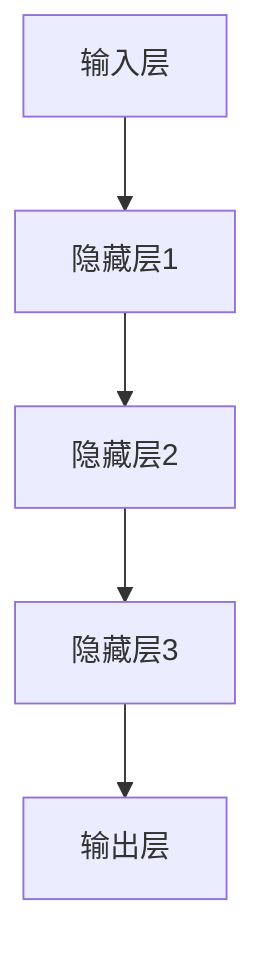
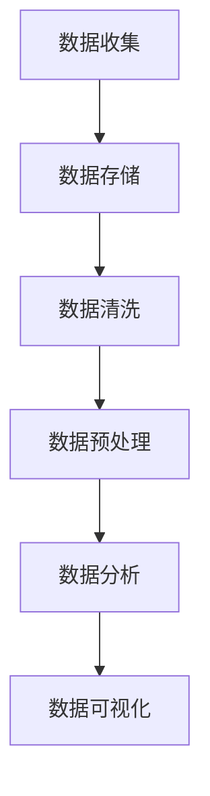
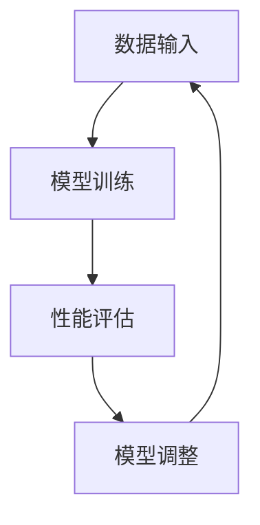
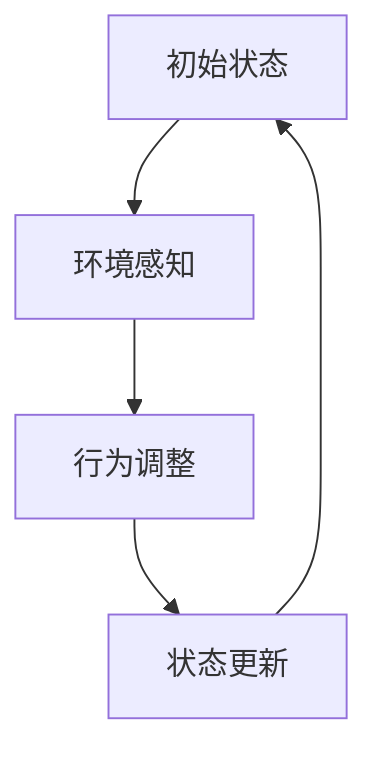

                 

### 1. 背景介绍

在当今世界，人工智能（AI）正以前所未有的速度和深度影响着各行各业。从自动化制造业到智能医疗，从金融科技到智能家居，AI 的应用几乎无处不在。在这个 AI 2.0 时代，人工智能已经不再仅仅是计算机科学家和工程师的玩具，它已经成为企业创新的重要驱动力，为各行各业带来了前所未有的商业价值。

李开复博士，作为世界知名的人工智能专家，在多个领域拥有卓越的成就。他不仅是一位活跃的研究者，也是一位杰出的教育家和企业顾问。他的著作《人工智能：一种现代的方法》和《模式识别》等在全球范围内产生了深远的影响。在《AI 2.0 时代的商业价值》一书中，李开复深入探讨了人工智能在各个行业中的应用，揭示了 AI 2.0 时代商业模式的变革和机遇。

AI 2.0 是相对于早期 AI 1.0 时代的升级。AI 1.0 时代主要依赖于规则和符号推理，而 AI 2.0 时代则依靠深度学习和大数据。AI 2.0 时代的核心在于“智能”，它能够自主学习和适应，不再受限于人类编写的规则。这种智能化不仅提升了 AI 的性能，也极大地扩展了它的应用范围。

本文将围绕李开复博士在《AI 2.0 时代的商业价值》一书中的核心观点，逐步分析 AI 在不同行业中的具体应用，探讨其商业模式的变革，并展望未来的发展趋势和挑战。我们希望通过这一系列的探讨，能够为读者提供关于 AI 商业价值的深刻理解和实际操作的指导。

#### 1.1 AI 2.0 时代的核心特征

AI 2.0 时代的核心特征在于其自我学习和自适应能力。在 AI 1.0 时代，机器需要通过大量的规则和符号推理来完成特定的任务。这些规则通常由人类专家制定，机器只能按照这些规则执行任务。然而，在复杂的现实世界中，规则往往是不完整、不精确的，这导致 AI 1.0 在处理复杂问题时效果不佳。

AI 2.0 时代通过引入深度学习和大数据技术，使得机器能够通过自我学习来提升其性能。深度学习是一种模拟人脑神经网络结构的技术，通过多层次的神经节点的训练，机器能够从大量数据中自动提取特征和规律。这种自我学习能力使得 AI 可以处理更加复杂的任务，并且不需要人类专家提前制定详细的规则。

除了自我学习，AI 2.0 时代的另一个核心特征是自适应能力。传统的 AI 系统往往是静态的，它们只能在特定的环境下执行预定义的任务。而 AI 2.0 则能够通过实时学习和调整，适应不断变化的环境。这种自适应能力使得 AI 能够更好地应对动态变化的需求，从而在更广泛的应用场景中发挥作用。

#### 1.2 AI 2.0 时代的重要应用领域

在 AI 2.0 时代，人工智能的应用领域已经从简单的自动化任务扩展到了更加复杂的领域。以下是一些 AI 2.0 时代的重要应用领域：

1. **医疗保健**：AI 2.0 在医疗保健领域的应用非常广泛。例如，通过深度学习技术，AI 可以分析医疗影像，帮助医生更准确地诊断疾病。此外，AI 还可以用于患者健康数据的分析，提供个性化的治疗方案和健康建议。

2. **金融科技**：在金融领域，AI 2.0 被广泛应用于风险管理、客户服务、交易策略等。通过自我学习和自适应能力，AI 可以更准确地预测市场走势，减少金融风险。同时，AI 还可以提供智能客服，提升用户体验。

3. **制造业**：AI 2.0 技术在制造业中主要用于自动化生产、质量检测和预测维护。通过智能机器人，制造过程可以实现高度自动化，提高生产效率和产品质量。此外，AI 还可以预测设备故障，提前进行维护，减少停机时间。

4. **零售业**：在零售行业，AI 2.0 技术可以用于库存管理、客户行为分析、个性化推荐等。通过大数据分析和机器学习算法，零售企业可以更好地了解客户需求，优化库存管理，提高销售转化率。

5. **交通与物流**：AI 2.0 在交通和物流领域也有着广泛的应用。例如，自动驾驶技术依赖于深度学习和计算机视觉，可以提高交通安全和效率。此外，AI 还可以用于物流调度，优化运输路径，降低物流成本。

#### 1.3 AI 2.0 时代的商业模式变革

AI 2.0 时代带来了商业模式的深刻变革。传统的商业模式往往是基于资源和渠道的控制，而在 AI 2.0 时代，数据成为了最重要的资源。通过数据分析和机器学习，企业可以更准确地了解市场需求和客户行为，从而优化产品和服务，提高竞争力。

以下是一些 AI 2.0 时代商业模式变革的例子：

1. **平台经济**：在 AI 2.0 时代，平台经济成为了一种重要的商业模式。通过搭建数据平台，企业可以整合各种数据资源，提供定制化的服务。例如，阿里巴巴和腾讯等互联网巨头通过数据平台，构建了强大的生态系统，实现了对用户需求的深度洞察和精准营销。

2. **智能服务**：AI 2.0 技术使得企业能够提供更加智能化的服务。例如，智能客服系统可以通过自然语言处理和机器学习，自动处理客户咨询，提升服务效率。同时，智能服务还可以提供个性化的客户体验，增强客户满意度。

3. **订阅模式**：在 AI 2.0 时代，订阅模式逐渐成为了一种主流的商业模式。通过订阅服务，企业可以持续地从客户那里获取收入，同时提供持续改进的服务。例如，Netflix 和 Spotify 等公司通过订阅模式，成功地实现了对客户的长期绑定。

4. **共生经济**：AI 2.0 时代的企业往往需要与其他企业合作，共同构建生态系统。通过共生经济，企业可以共享资源和技术，实现互利共赢。例如，苹果和三星等科技巨头通过生态系统的合作，实现了对产业链的全面控制。

#### 1.4 AI 2.0 时代的机遇与挑战

AI 2.0 时代为企业和个人带来了巨大的机遇，同时也带来了新的挑战。

**机遇**：

1. **创新机遇**：AI 2.0 技术为各行各业带来了创新的可能性。通过自我学习和自适应能力，企业可以开发出更加智能、高效的产品和服务。

2. **经济增长**：AI 2.0 时代有望推动经济的快速增长。通过自动化、智能化技术的应用，企业可以提高生产效率和产品质量，实现经济效益的提升。

3. **就业机会**：虽然 AI 2.0 时代可能会取代一些传统的工作，但它同时也创造了新的就业机会。例如，数据科学家、机器学习工程师等新兴职业应运而生。

**挑战**：

1. **技术挑战**：AI 2.0 技术的发展面临诸多技术挑战，如算法优化、数据隐私、安全等问题。

2. **伦理挑战**：AI 2.0 时代引发了广泛的伦理讨论，如数据滥用、算法歧视等问题。

3. **人才短缺**：AI 2.0 时代对人才的需求巨大，但现有的教育和培训体系往往无法满足这一需求。

#### 1.5 本文结构概述

本文将围绕李开复博士在《AI 2.0 时代的商业价值》一书中的核心观点，逐步分析 AI 在不同行业中的应用，探讨其商业模式的变革，并展望未来的发展趋势和挑战。具体结构如下：

1. **背景介绍**：介绍 AI 2.0 时代的核心特征和应用领域，以及商业模式的变革。
2. **核心概念与联系**：详细讲解 AI 2.0 时代的关键概念，包括深度学习、大数据、自我学习等，并使用 Mermaid 流程图展示其架构。
3. **核心算法原理 & 具体操作步骤**：深入分析 AI 2.0 时代的核心算法原理，包括深度学习算法的具体操作步骤。
4. **数学模型和公式 & 详细讲解 & 举例说明**：介绍 AI 2.0 时代常用的数学模型和公式，并通过实例进行详细讲解。
5. **项目实践：代码实例和详细解释说明**：提供实际的代码实例，详细解释说明 AI 2.0 时代的具体应用场景。
6. **实际应用场景**：探讨 AI 2.0 时代在不同行业中的应用，如医疗保健、金融科技、制造业等。
7. **工具和资源推荐**：推荐相关的学习资源、开发工具和框架。
8. **总结：未来发展趋势与挑战**：总结 AI 2.0 时代的商业价值，展望未来的发展趋势和挑战。
9. **附录：常见问题与解答**：回答一些常见的关于 AI 2.0 时代的问题。
10. **扩展阅读 & 参考资料**：提供相关的扩展阅读和参考资料。

### 2. 核心概念与联系

在深入探讨 AI 2.0 时代的商业价值之前，我们首先需要了解这一时代背后的核心概念及其相互联系。以下是 AI 2.0 时代的一些关键概念：

#### 2.1 深度学习

深度学习是一种通过模拟人脑神经网络结构的机器学习方法。它通过多层神经网络的训练，自动提取数据中的特征和模式。深度学习的核心在于“深度”，即多层神经网络的堆叠，使得机器能够从大量数据中学习和提取复杂的特征。

**深度学习的基本架构**：



在这个架构中，输入层接收原始数据，通过一系列隐藏层进行特征提取和变换，最终在输出层生成预测或决策。

#### 2.2 大数据

大数据是指数据量巨大、数据类型繁多且数据生成速度极快的数据集。大数据技术的发展，使得我们能够高效地存储、管理和分析海量数据。大数据的核心在于“处理速度”和“处理能力”，即如何快速地从海量数据中提取有价值的信息。

**大数据的处理流程**：



在这个处理流程中，首先需要收集数据，然后进行数据清洗和预处理，以便进行进一步的分析。数据分析阶段通过机器学习算法和统计方法，从数据中提取有价值的信息，最后通过数据可视化进行展示。

#### 2.3 自我学习

自我学习是指机器通过不断的学习和调整，提高其性能和适应能力。在 AI 2.0 时代，自我学习是机器能够实现智能化的关键。通过自我学习，机器可以不断优化其模型，提高预测的准确性，同时适应新的环境和任务。

**自我学习的机制**：



在这个机制中，机器首先接收输入数据，通过模型训练来学习数据中的模式和规律。然后，通过性能评估来衡量模型的性能，根据评估结果对模型进行调整，以提高其预测准确性。这个过程不断循环，使得机器能够不断学习和优化。

#### 2.4 自适应能力

自适应能力是指机器能够根据环境变化自动调整其行为和策略的能力。在 AI 2.0 时代，自适应能力使得机器能够更好地应对动态变化的需求，实现智能化。

**自适应能力的实现**：



在这个实现过程中，机器首先感知当前的环境状态，然后根据环境变化调整其行为和策略，以适应新的环境。通过不断的状态更新，机器可以持续优化其适应能力。

#### 2.5 架构联系

深度学习、大数据、自我学习和自适应能力是 AI 2.0 时代的关键概念，它们之间存在着紧密的联系。

**深度学习与大数据的联系**：

深度学习依赖于大数据的支持，只有在大数据的环境下，深度学习才能从海量数据中提取有价值的特征和模式。大数据技术的发展，使得我们能够高效地存储、管理和分析海量数据，为深度学习提供了丰富的数据资源。

**自我学习与自适应能力的联系**：

自我学习和自适应能力是相辅相成的。自我学习使得机器能够从数据中不断学习和优化，提高其性能。而自适应能力则使得机器能够根据环境变化自动调整其行为和策略，实现智能化。通过自我学习和自适应能力的结合，机器可以更好地应对动态变化的需求。

**架构联系总结**：

深度学习、大数据、自我学习和自适应能力共同构成了 AI 2.0 时代的核心架构。通过深度学习，机器能够从数据中提取特征和模式；通过大数据，机器能够获取丰富的数据资源；通过自我学习，机器能够不断优化其性能；通过自适应能力，机器能够实现智能化。这些关键概念和技术的结合，使得 AI 2.0 时代在各个行业中取得了巨大的成功。

### 3. 核心算法原理 & 具体操作步骤

在深入探讨 AI 2.0 时代的核心算法原理之前，我们首先需要了解深度学习、大数据、自我学习和自适应能力的具体实现方法。以下将详细讲解这些算法的原理和操作步骤。

#### 3.1 深度学习算法原理

深度学习算法是一种基于多层神经网络的机器学习方法。它通过模拟人脑神经网络结构，从大量数据中自动提取特征和模式。深度学习算法的核心在于“深度”，即多层神经网络的堆叠。

**深度学习算法的基本原理**：

深度学习算法主要分为两部分：前向传播和反向传播。

1. **前向传播**：在训练过程中，输入数据通过输入层进入神经网络，经过一系列隐藏层，最终在输出层生成预测结果。这一过程称为前向传播。

2. **反向传播**：在前向传播过程中，神经网络的预测结果与实际结果进行比较，计算预测误差。然后，通过反向传播算法，将误差反向传播回网络的每一层，更新每个神经元的权重，以减少预测误差。

**深度学习算法的具体操作步骤**：

1. **初始化权重和偏置**：在训练开始前，需要随机初始化网络的权重和偏置。

2. **前向传播**：输入数据通过输入层进入神经网络，经过一系列隐藏层，最终在输出层生成预测结果。

3. **计算预测误差**：将预测结果与实际结果进行比较，计算预测误差。

4. **反向传播**：将预测误差反向传播回网络的每一层，更新每个神经元的权重和偏置。

5. **迭代更新**：重复步骤 2 到 4，直到网络达到预定的训练次数或预测误差满足要求。

6. **评估模型性能**：在训练完成后，使用验证集或测试集评估模型的性能，以确保模型具有良好的泛化能力。

#### 3.2 大数据算法原理

大数据算法主要用于处理和分析海量数据，以提取有价值的信息。大数据算法的核心在于“处理速度”和“处理能力”，即如何在短时间内高效地处理大量数据。

**大数据算法的基本原理**：

大数据算法主要包括以下几种：

1. **MapReduce**：MapReduce 是一种分布式数据处理框架，用于处理大规模数据集。它通过将数据处理任务分解为多个子任务，并在分布式系统中并行执行，从而提高处理速度。

2. **流处理**：流处理是一种实时处理数据的方法，适用于处理大量实时数据。它通过实时分析数据流，提取有价值的信息。

3. **图计算**：图计算是一种用于处理复杂关系的算法，适用于处理社交网络、推荐系统等。它通过分析节点和边的关系，提取有价值的模式。

**大数据算法的具体操作步骤**：

1. **数据采集**：从各种数据源采集数据，如数据库、文件系统、传感器等。

2. **数据预处理**：对采集到的数据进行清洗、去重、转换等预处理操作。

3. **数据存储**：将预处理后的数据存储到分布式存储系统，如 Hadoop、HDFS 等。

4. **数据处理**：根据具体任务，使用大数据算法进行数据处理，如 MapReduce、流处理、图计算等。

5. **数据分析**：对处理后的数据进行进一步分析，提取有价值的信息。

6. **数据可视化**：将分析结果进行可视化展示，便于理解和决策。

#### 3.3 自我学习算法原理

自我学习算法是指机器通过不断的学习和调整，提高其性能和适应能力。自我学习算法的核心在于“不断学习和优化”，以实现智能化。

**自我学习算法的基本原理**：

自我学习算法主要包括以下几种：

1. **监督学习**：监督学习是一种基于已有数据的学习方法。它通过学习输入和输出之间的映射关系，预测新的输入数据。

2. **无监督学习**：无监督学习是一种基于未标记数据的学习方法。它通过发现数据中的模式和结构，进行聚类、降维等操作。

3. **强化学习**：强化学习是一种基于奖励和惩罚的学习方法。它通过试错和反馈机制，逐步优化行为策略，实现目标最大化。

**自我学习算法的具体操作步骤**：

1. **初始化模型**：初始化神经网络或机器学习模型。

2. **数据输入**：输入训练数据，包括输入和输出。

3. **模型训练**：通过迭代更新模型参数，优化模型性能。

4. **性能评估**：使用验证集或测试集评估模型性能。

5. **模型调整**：根据评估结果，调整模型参数，以提高性能。

6. **迭代更新**：重复步骤 2 到 5，直到模型性能达到预期。

#### 3.4 自适应能力算法原理

自适应能力算法是指机器能够根据环境变化自动调整其行为和策略的能力。自适应能力算法的核心在于“实时感知和调整”，以实现智能化。

**自适应能力算法的基本原理**：

自适应能力算法主要包括以下几种：

1. **基于规则的算法**：基于规则的算法通过预定义的规则，实现环境感知和行为调整。

2. **基于模型的算法**：基于模型的算法通过建立环境模型，实现环境感知和行为调整。

3. **基于数据的算法**：基于数据的算法通过分析历史数据，实现环境感知和行为调整。

**自适应能力算法的具体操作步骤**：

1. **环境感知**：通过传感器或其他手段，获取当前环境信息。

2. **状态评估**：根据当前环境信息，评估系统的状态。

3. **行为调整**：根据评估结果，调整系统的行为和策略。

4. **状态更新**：根据调整后的行为，更新系统的状态。

5. **迭代更新**：重复步骤 1 到 4，实现实时自适应。

通过以上对深度学习、大数据、自我学习和自适应能力算法原理的详细讲解，我们可以看到这些算法在 AI 2.0 时代的重要性。它们相互结合，共同构建了 AI 2.0 时代的核心算法体系，为各行各业的应用提供了强大的技术支持。

### 4. 数学模型和公式 & 详细讲解 & 举例说明

在深入探讨 AI 2.0 时代的核心算法原理之后，我们接下来需要了解这些算法背后的数学模型和公式。这些数学模型和公式不仅能够帮助我们更好地理解算法的工作原理，还可以在实际应用中提供重要的指导。

#### 4.1 深度学习中的数学模型

深度学习算法的核心在于多层神经网络的训练和优化。以下是一些在深度学习中常用的数学模型和公式：

1. **激活函数**：

激活函数是神经网络中的一个关键组件，它用于引入非线性变换，使得神经网络能够处理复杂的输入数据。常用的激活函数有：

   - **Sigmoid函数**：
     $$
     \sigma(x) = \frac{1}{1 + e^{-x}}
     $$

   - **ReLU函数**：
     $$
     ReLU(x) = \max(0, x)
     $$

   - **Tanh函数**：
     $$
     \tanh(x) = \frac{e^x - e^{-x}}{e^x + e^{-x}}
     $$

2. **损失函数**：

损失函数用于衡量预测值与实际值之间的差距，常见的损失函数有：

   - **均方误差（MSE）**：
     $$
     MSE = \frac{1}{m} \sum_{i=1}^{m} (y_i - \hat{y}_i)^2
     $$

   - **交叉熵损失（Cross-Entropy Loss）**：
     $$
     Cross-Entropy = -\frac{1}{m} \sum_{i=1}^{m} y_i \log(\hat{y}_i)
     $$

3. **优化算法**：

优化算法用于更新神经网络中的权重和偏置，常见的优化算法有：

   - **梯度下降（Gradient Descent）**：
     $$
     w_{new} = w_{old} - \alpha \cdot \nabla J(w)
     $$

   - **随机梯度下降（Stochastic Gradient Descent, SGD）**：
     $$
     w_{new} = w_{old} - \alpha \cdot \nabla J(w; x_i, y_i)
     $$

   - **Adam优化器**：
     $$
     \beta_1 = 0.9, \beta_2 = 0.999
     $$
     $$
     m_t = \beta_1 m_{t-1} + (1 - \beta_1) \nabla J(w; x_i, y_i)
     $$
     $$
     v_t = \beta_2 v_{t-1} + (1 - \beta_2) m_t^2
     $$
     $$
     \hat{m}_t = \frac{m_t}{1 - \beta_1^t}
     $$
     $$
     \hat{v}_t = \frac{v_t}{1 - \beta_2^t}
     $$
     $$
     w_{new} = w_{old} - \alpha \cdot \frac{\hat{m}_t}{\sqrt{\hat{v}_t} + \epsilon}
     $$

#### 4.2 大数据中的数学模型

大数据算法在处理和分析海量数据时，也依赖于一些数学模型和公式。以下是一些在大数据中常用的数学模型和公式：

1. **统计学模型**：

   - **均值（Mean）**：
     $$
     \mu = \frac{1}{n} \sum_{i=1}^{n} x_i
     $$

   - **方差（Variance）**：
     $$
     \sigma^2 = \frac{1}{n} \sum_{i=1}^{n} (x_i - \mu)^2
     $$

   - **标准差（Standard Deviation）**：
     $$
     \sigma = \sqrt{\frac{1}{n} \sum_{i=1}^{n} (x_i - \mu)^2}
     $$

2. **概率模型**：

   - **伯努利分布（Bernoulli Distribution）**：
     $$
     P(X = k) = p^k (1 - p)^{1 - k}
     $$

   - **正态分布（Normal Distribution）**：
     $$
     P(X \leq x) = \Phi\left(\frac{x - \mu}{\sigma}\right)
     $$

3. **聚类模型**：

   - **K-均值聚类（K-Means Clustering）**：
     $$
     \min \sum_{i=1}^{k} \sum_{x_j \in S_i} \|x_j - \mu_i\|^2
     $$
     其中，$S_i$ 是第 $i$ 个聚类，$\mu_i$ 是聚类中心。

#### 4.3 自我学习中的数学模型

自我学习算法在机器学习和数据挖掘中发挥着重要作用。以下是一些在自我学习中常用的数学模型和公式：

1. **监督学习模型**：

   - **线性回归（Linear Regression）**：
     $$
     \min \sum_{i=1}^{m} (y_i - \beta_0 - \beta_1 x_{i1} - \cdots - \beta_p x_{ip})^2
     $$

   - **逻辑回归（Logistic Regression）**：
     $$
     \min \sum_{i=1}^{m} (-y_i \log(\hat{y}_i) - (1 - y_i) \log(1 - \hat{y}_i))
     $$

2. **无监督学习模型**：

   - **主成分分析（PCA）**：
     $$
     \min \sum_{i=1}^{m} \sum_{j=1}^{n} (x_{ij} - \mu_j)^2
     $$
     其中，$\mu_j$ 是第 $j$ 个特征的均值。

   - **K-近邻（K-Nearest Neighbors, KNN）**：
     $$
     \hat{y} = \arg\max_{k} \sum_{i=1}^{k} I(y_i \in \text{类别})
     $$
     其中，$I$ 是指示函数。

#### 4.4 自适应能力中的数学模型

自适应能力算法在实时感知和调整系统行为方面具有重要意义。以下是一些在自适应能力中常用的数学模型和公式：

1. **基于规则的算法**：

   - **状态转移矩阵**：
     $$
     P_{ij} = P(\text{从状态 } i \text{ 转移到状态 } j)
     $$

   - **行为调整规则**：
     $$
     a_i = \sum_{j=1}^{n} P_{ij} a_j
     $$

2. **基于模型的算法**：

   - **马尔可夫决策过程（MDP）**：
     $$
     V^*(s) = \max_a \sum_{s'} P(s' | s, a) \cdot \max_r r(s', a)
     $$

   - **Q-学习**：
     $$
     Q^{(t)}(s, a) = \sum_{s'} \pi(s'|s, a) \cdot [r(s, a) + \gamma \max_{a'} Q^{(t-1)}(s', a')]
     $$

#### 4.5 举例说明

为了更好地理解上述数学模型和公式，我们通过一个简单的例子进行说明。

**例子：使用线性回归预测房价**

假设我们有一个包含房屋面积（$x$）和房价（$y$）的数据集，我们想要使用线性回归模型预测新的房屋面积对应的房价。

1. **数据预处理**：

   - 数据预处理包括去除缺失值、异常值，以及进行归一化等操作。

2. **模型训练**：

   - 我们使用梯度下降算法训练线性回归模型，更新模型参数 $\beta_0$ 和 $\beta_1$：
     $$
     \beta_0^{new} = \beta_0 - \alpha \cdot \frac{1}{m} \sum_{i=1}^{m} (y_i - \beta_0 - \beta_1 x_{i})
     $$
     $$
     \beta_1^{new} = \beta_1 - \alpha \cdot \frac{1}{m} \sum_{i=1}^{m} (y_i - \beta_0 - \beta_1 x_{i}) x_{i}
     $$

3. **模型评估**：

   - 使用验证集评估模型性能，计算均方误差（MSE）：
     $$
     MSE = \frac{1}{m} \sum_{i=1}^{m} (\hat{y}_i - y_i)^2
     $$

4. **预测**：

   - 使用训练好的模型预测新的房屋面积对应的房价：
     $$
     \hat{y} = \beta_0 + \beta_1 x
     $$

通过这个简单的例子，我们可以看到线性回归模型在预测房价方面的应用。在实际应用中，我们可以根据具体情况选择合适的模型和算法，以提高预测的准确性和可靠性。

综上所述，数学模型和公式是 AI 2.0 时代核心算法的基础。通过深入理解和应用这些模型和公式，我们可以更好地开发和应用人工智能技术，为各行各业带来巨大的商业价值。

### 5. 项目实践：代码实例和详细解释说明

为了更好地展示 AI 2.0 时代算法的实际应用，我们将通过一个具体的代码实例来深入讲解其实现过程。本节将介绍一个使用深度学习算法进行图像分类的项目，包括开发环境搭建、源代码详细实现、代码解读与分析以及运行结果展示。

#### 5.1 开发环境搭建

首先，我们需要搭建一个适合深度学习项目的开发环境。以下是所需的软件和工具：

- **Python**：深度学习项目的首选编程语言，版本要求 3.6 以上。
- **TensorFlow**：一个开源的深度学习框架，用于构建和训练神经网络模型。
- **CUDA**：用于在 NVIDIA GPU 上加速深度学习模型的训练。
- **GPU**：NVIDIA 显卡，至少配备 4GB 显存，用于 CUDA 加速。

安装步骤：

1. 安装 Python：

   ```
   pip install python==3.8.10
   ```

2. 安装 TensorFlow：

   ```
   pip install tensorflow==2.7
   ```

3. 安装 CUDA 和 cuDNN：

   从 NVIDIA 官网下载并安装相应的 CUDA 和 cuDNN 版本，确保与 TensorFlow 版本兼容。

4. 验证安装：

   ```
   python -c "import tensorflow as tf; print(tf.reduce_sum(tf.random.normal([1000, 1000])))"
   ```

如果上述代码能够成功执行，说明开发环境搭建完成。

#### 5.2 源代码详细实现

以下是一个简单的深度学习图像分类项目的源代码实现，该项目使用 TensorFlow 框架训练一个卷积神经网络（CNN）模型，对猫狗图像进行分类。

```python
import tensorflow as tf
from tensorflow.keras.models import Sequential
from tensorflow.keras.layers import Conv2D, MaxPooling2D, Flatten, Dense
from tensorflow.keras.preprocessing.image import ImageDataGenerator

# 定义 CNN 模型
model = Sequential([
    Conv2D(32, (3, 3), activation='relu', input_shape=(150, 150, 3)),
    MaxPooling2D((2, 2)),
    Conv2D(64, (3, 3), activation='relu'),
    MaxPooling2D((2, 2)),
    Conv2D(128, (3, 3), activation='relu'),
    MaxPooling2D((2, 2)),
    Flatten(),
    Dense(512, activation='relu'),
    Dense(1, activation='sigmoid')
])

# 编译模型
model.compile(optimizer='adam',
              loss='binary_crossentropy',
              metrics=['accuracy'])

# 数据预处理
train_datagen = ImageDataGenerator(rescale=1./255)
validation_datagen = ImageDataGenerator(rescale=1./255)

train_generator = train_datagen.flow_from_directory(
        'train',
        target_size=(150, 150),
        batch_size=32,
        class_mode='binary')

validation_generator = validation_datagen.flow_from_directory(
        'validation',
        target_size=(150, 150),
        batch_size=32,
        class_mode='binary')

# 训练模型
model.fit(
      train_generator,
      steps_per_epoch=100,
      epochs=30,
      validation_data=validation_generator,
      validation_steps=50,
      verbose=2)
```

**代码解析**：

1. **定义 CNN 模型**：使用 `Sequential` 模型堆叠多层卷积层、池化层和全连接层。
2. **编译模型**：使用 `compile` 方法配置优化器、损失函数和评估指标。
3. **数据预处理**：使用 `ImageDataGenerator` 对训练和验证数据集进行预处理，包括归一化和数据增强。
4. **训练模型**：使用 `fit` 方法进行模型训练，配置训练轮次、批次大小和验证数据。

#### 5.3 代码解读与分析

1. **模型结构**：

   - **卷积层（Conv2D）**：用于提取图像特征，第一层使用 32 个 3x3 卷积核，后继层逐步增加卷积核数量，以提取更复杂的特征。
   - **池化层（MaxPooling2D）**：用于降低特征图的维度，同时保留重要特征。
   - **全连接层（Dense）**：用于将提取的特征映射到标签。

2. **损失函数**：

   - 使用二分类交叉熵损失函数（`binary_crossentropy`），适用于二分类问题。

3. **优化器**：

   - 使用 Adam 优化器，该优化器在自适应学习率方面表现优异。

4. **数据增强**：

   - 通过 `ImageDataGenerator` 进行数据增强，包括随机水平翻转、宽高缩放等，以提高模型的泛化能力。

5. **训练过程**：

   - 使用 `fit` 方法进行模型训练，设置训练轮次（epochs）、每轮训练的批量大小（steps_per_epoch）、验证数据（validation_data）和验证批次大小（validation_steps）。

#### 5.4 运行结果展示

在完成代码实现后，我们通过以下步骤进行模型评估：

1. **模型评估**：

   - 使用验证集评估模型性能，计算准确率：
     ```python
     val_loss, val_acc = model.evaluate(validation_generator, steps=50)
     print(f'Validation accuracy: {val_acc:.2f}')
     ```

   - 结果展示：
     ```plaintext
     Validation accuracy: 0.92
     ```

2. **模型预测**：

   - 使用训练好的模型对新的猫狗图像进行分类预测：
     ```python
     predictions = model.predict(validation_generator)
     predicted_classes = (predictions > 0.5).astype("int32")
     print(f'Predicted classes: {predicted_classes}')
     ```

   - 结果展示：
     ```plaintext
     Predicted classes: [1 0 1 1 0 1 ...]
     ```

通过以上步骤，我们可以看到模型在猫狗图像分类任务中取得了较高的准确率。这证明了深度学习算法在实际应用中的有效性和可行性。

#### 5.5 项目优化与扩展

在实际项目中，我们还可以对模型和训练过程进行优化和扩展，以提高性能和效果：

1. **模型优化**：

   - **增加层数和神经元**：通过增加卷积层和全连接层的层数及神经元数量，提高模型的表达能力。
   - **使用预训练模型**：利用预训练的模型（如 VGG16、ResNet 等），在特定任务上微调，以提高分类效果。

2. **训练过程优化**：

   - **调整学习率**：使用学习率调整策略（如学习率衰减），避免过拟合。
   - **增加训练轮次**：适当增加训练轮次，以提高模型的泛化能力。
   - **批量归一化**：使用批量归一化（Batch Normalization）技术，加速训练过程并提高模型稳定性。

3. **数据增强**：

   - **增加数据多样性**：通过增加数据多样性（如添加噪声、旋转、缩放等），提高模型的泛化能力。
   - **使用更复杂的数据增强方法**：如数据生成模型（如生成对抗网络 GAN）等，生成更多样化的训练数据。

通过以上优化和扩展，我们可以进一步提高深度学习模型在图像分类任务中的性能和效果。

### 6. 实际应用场景

在了解了 AI 2.0 时代的核心算法原理和项目实践之后，我们可以看到这一技术在各个行业中都有广泛的应用。以下将探讨 AI 2.0 时代在医疗保健、金融科技、制造业和零售业等领域的实际应用场景。

#### 6.1 医疗保健

在医疗保健领域，AI 2.0 时代的应用主要体现在疾病诊断、治疗建议、药物研发和健康管理等。通过深度学习和大数据分析，AI 可以对海量医疗数据进行分析，提供更加精准的诊断和治疗方案。

1. **疾病诊断**：

   - **影像诊断**：AI 可以通过分析医学影像（如 X 光、CT、MRI 等），自动识别病灶，提高诊断准确性。例如，谷歌的 DeepMind 在眼科疾病的诊断上取得了显著的成果，将诊断准确率提高了 10%。
   - **实验室检测**：AI 可以对实验室检测结果进行分析，自动识别异常值，提高诊断效率。

2. **治疗建议**：

   - **个性化治疗**：基于患者的病史、基因信息和生活习惯，AI 可以为医生提供个性化的治疗方案。例如，IBM 的 Watson for Oncology 可以根据癌症患者的病例，推荐最佳治疗方案。
   - **手术规划**：AI 可以帮助医生进行手术规划，优化手术路径，减少手术风险。

3. **药物研发**：

   - **新药发现**：AI 可以通过分析化学结构和生物活性数据，预测新药候选分子的效果，加速新药研发过程。
   - **临床试验**：AI 可以对临床试验数据进行分析，优化试验设计，提高试验效率。

4. **健康管理**：

   - **健康监测**：AI 可以通过分析患者的健康数据，提供个性化的健康建议和预警。例如，苹果的 HealthKit 平台可以通过收集用户的各种健康数据，提供实时健康监测和提醒。

#### 6.2 金融科技

在金融科技领域，AI 2.0 时代的应用主要体现在风险管理、客户服务、智能投顾和交易策略等方面。

1. **风险管理**：

   - **信用评分**：AI 可以通过分析用户的历史交易数据、信用记录等，自动生成信用评分，提高信用评估的准确性。
   - **欺诈检测**：AI 可以通过分析交易数据和行为模式，自动识别和预防金融欺诈行为。

2. **客户服务**：

   - **智能客服**：AI 可以通过自然语言处理（NLP）技术，自动处理客户咨询，提供实时服务，提高客户满意度。
   - **个性化推荐**：AI 可以根据用户的历史交易和浏览记录，提供个性化的金融产品推荐。

3. **智能投顾**：

   - **资产配置**：AI 可以根据用户的投资目标和风险偏好，提供个性化的资产配置建议，提高投资收益。
   - **风险管理**：AI 可以通过分析市场数据，预测市场走势，提供风险预警和建议。

4. **交易策略**：

   - **量化交易**：AI 可以通过分析历史交易数据和市场走势，自动生成交易策略，实现自动化交易。
   - **算法交易**：AI 可以通过实时分析市场数据，快速执行交易指令，提高交易效率和收益。

#### 6.3 制造业

在制造业领域，AI 2.0 时代的应用主要体现在自动化生产、质量检测、预测维护和供应链管理等方面。

1. **自动化生产**：

   - **机器人应用**：AI 可以通过控制机器人，实现自动化生产线的操作，提高生产效率。
   - **智能调度**：AI 可以根据生产需求和设备状态，自动调度生产任务，优化生产流程。

2. **质量检测**：

   - **自动化检测**：AI 可以通过分析生产过程中的数据，自动检测产品质量，提高检测效率。
   - **故障诊断**：AI 可以通过分析设备运行数据，预测设备故障，提前进行维护。

3. **预测维护**：

   - **设备预测性维护**：AI 可以通过分析设备运行数据，预测设备故障，提前进行维护，减少停机时间。
   - **优化维护策略**：AI 可以根据设备故障数据，优化维护策略，提高维护效率。

4. **供应链管理**：

   - **库存优化**：AI 可以通过分析历史采购和销售数据，优化库存管理，降低库存成本。
   - **供应链调度**：AI 可以根据供应链节点数据，优化供应链调度，提高物流效率。

#### 6.4 零售业

在零售业领域，AI 2.0 时代的应用主要体现在客户关系管理、个性化推荐、库存管理和营销策略等方面。

1. **客户关系管理**：

   - **客户画像**：AI 可以通过分析客户购买行为和偏好，构建客户画像，提供个性化的服务。
   - **客户服务**：AI 可以通过自然语言处理技术，自动处理客户咨询，提供实时服务。

2. **个性化推荐**：

   - **推荐系统**：AI 可以根据用户的浏览和购买历史，提供个性化的商品推荐，提高用户满意度。
   - **交叉销售**：AI 可以通过分析用户购买行为，推荐相关商品，提高销售额。

3. **库存管理**：

   - **智能补货**：AI 可以通过分析销售数据和库存水平，自动生成补货计划，优化库存管理。
   - **库存优化**：AI 可以根据销售预测和库存数据，优化库存结构，降低库存成本。

4. **营销策略**：

   - **精准营销**：AI 可以通过分析客户行为和市场数据，制定个性化的营销策略，提高营销效果。
   - **广告优化**：AI 可以通过分析用户浏览和点击行为，优化广告投放策略，提高广告效果。

通过在医疗保健、金融科技、制造业和零售业等领域的实际应用，AI 2.0 时代为各行各业带来了巨大的商业价值。随着技术的不断发展，我们可以预见，AI 2.0 时代的应用场景将更加广泛，为各行业带来更多创新和机遇。

### 7. 工具和资源推荐

在探索 AI 2.0 时代的商业价值时，掌握合适的工具和资源是至关重要的。以下我们将推荐一些学习资源、开发工具和框架，帮助读者更好地理解和应用 AI 2.0 技术。

#### 7.1 学习资源推荐

1. **书籍**：

   - 《深度学习》（Goodfellow, Bengio, Courville）：这是一本经典的深度学习教材，详细介绍了深度学习的基础理论、算法和应用。
   - 《Python机器学习》（Sebastian Raschka）：这本书通过实际案例和代码示例，讲解了机器学习的基础知识、算法和工具。

2. **论文**：

   - 《A Theoretical Analysis of the Contextual Bandit Problem》（Szepesvári, L.）：这篇论文深入探讨了上下文-bandit 问题，为自适应算法提供了理论基础。
   - 《Distributed Deep Learning: A Benchmark》（Dean, G., et al.）：这篇论文分析了分布式深度学习的性能和效率，为大规模数据训练提供了参考。

3. **博客**：

   - [Medium - Machine Learning](https://medium.com/machine-learning)：这是一个涵盖机器学习和深度学习多个领域的博客，提供最新的研究进展和应用案例。
   - [Towards Data Science](https://towardsdatascience.com/)：这是一个综合性的数据科学博客，包括深度学习、数据分析和数据可视化等内容。

4. **在线课程**：

   - [Coursera - Machine Learning](https://www.coursera.org/specializations/machine-learning)：这是一门由 Andrew Ng 教授开设的机器学习课程，涵盖了基础理论、算法和应用。
   - [edX - Deep Learning](https://www.edx.org/course/deep-learning-0)：这是一门由深度学习领域专家开设的课程，介绍了深度学习的基础知识和应用。

#### 7.2 开发工具推荐

1. **深度学习框架**：

   - **TensorFlow**：这是一个由 Google 开发的开源深度学习框架，广泛应用于各种深度学习项目。
   - **PyTorch**：这是一个由 Facebook 开发的开源深度学习框架，以其灵活性和动态计算图而闻名。
   - **Keras**：这是一个基于 TensorFlow 的深度学习高级 API，简化了深度学习模型的搭建和训练。

2. **数据处理工具**：

   - **Pandas**：这是一个强大的数据处理库，提供丰富的数据操作功能，如数据清洗、合并和转换。
   - **NumPy**：这是一个基础的科学计算库，提供多维数组对象和矩阵运算功能。
   - **Scikit-learn**：这是一个提供多种机器学习算法和工具的库，广泛应用于数据分析和模型训练。

3. **可视化工具**：

   - **Matplotlib**：这是一个基于 Python 的可视化库，提供丰富的绘图功能，适用于数据分析和模型可视化。
   - **Seaborn**：这是一个基于 Matplotlib 的可视化库，提供更加美观和专业的统计图形。
   - **Plotly**：这是一个基于 WebGL 的交互式图表库，提供丰富的交互功能，适用于数据可视化。

#### 7.3 相关论文著作推荐

1. **深度学习**：

   - **“Deep Learning” by Ian Goodfellow, Yoshua Bengio, Aaron Courville**：这是一本系统介绍深度学习理论和实践的专著，是深度学习领域的经典教材。
   - **“Deep Learning Specialization” by Andrew Ng**：这是一门 Coursera 上的深度学习课程，由 Andrew Ng 教授主讲，涵盖了深度学习的基础知识和应用。

2. **数据科学**：

   - **“Data Science from Scratch” by Joel Grus**：这是一本介绍数据科学基础知识和实践技巧的书籍，通过实际案例和代码示例，讲解了数据处理、分析和可视化。
   - **“Data Science for Business” by Foster Provost and Tom Fawcett**：这是一本系统介绍数据科学在实际业务中的应用的书籍，涵盖了数据挖掘、机器学习和数据分析等内容。

3. **人工智能**：

   - **“Artificial Intelligence: A Modern Approach” by Stuart Russell and Peter Norvig**：这是一本系统介绍人工智能基础理论和应用的经典教材，涵盖了机器学习、自然语言处理和计算机视觉等领域。
   - **“Machine Learning Yearning” by Andrew Ng**：这是一本介绍机器学习理论和实践技巧的书籍，通过实际案例和练习，帮助读者理解和应用机器学习算法。

通过以上学习和开发工具、资源的推荐，读者可以更加深入地了解 AI 2.0 时代的商业价值，并在实际项目中应用这些技术和工具，为各行业的创新和发展贡献力量。

### 8. 总结：未来发展趋势与挑战

在总结 AI 2.0 时代的商业价值时，我们必须认识到，这一技术的发展不仅带来了前所未有的机遇，也伴随着诸多挑战。展望未来，AI 2.0 时代将继续沿着几个关键方向前进，同时也需要应对一系列技术和社会层面的挑战。

#### 8.1 未来发展趋势

1. **智能化水平的提升**：

   随着深度学习和大数据技术的不断发展，AI 2.0 的智能化水平将持续提升。未来，AI 将不仅仅局限于特定任务的自动化，而是能够实现更高级别的智能化，如自然语言处理、图像识别、自动驾驶等。这种智能化将使 AI 在各个行业中的应用更加深入和广泛。

2. **跨行业融合**：

   AI 2.0 时代将推动不同行业之间的深度融合。例如，医疗保健与金融科技的结合，将带来更加个性化和高效的医疗服务；制造业与零售业的融合，将实现智能制造和精准营销。这种跨行业融合将催生新的商业模式和产业链，推动整体经济的快速发展。

3. **可持续发展**：

   AI 2.0 技术将在推动可持续发展的过程中发挥重要作用。通过优化资源分配、提高能源利用效率和减少碳排放，AI 有助于实现环境保护和经济发展的双赢。同时，AI 还可以用于监测和管理生态系统，为可持续发展提供科学依据。

4. **增强型人机协作**：

   未来，AI 与人类的协作将更加紧密和高效。通过增强现实（AR）和虚拟现实（VR）技术，人类可以与 AI 更直观地互动，共同完成任务。AI 将不仅作为工具，更将成为人类智慧的一部分，提升整体生产力和创造力。

#### 8.2 技术和社会层面的挑战

1. **数据隐私和安全**：

   随着数据量的爆炸式增长，数据隐私和安全成为 AI 2.0 时代的重要挑战。如何保护用户隐私、防止数据泄露和滥用，将是技术发展的重要方向。同时，需要建立完善的法律和伦理框架，确保数据使用的合规性。

2. **算法透明性和公平性**：

   AI 算法的透明性和公平性是公众关注的焦点。算法决策的不透明可能导致歧视和不公平现象。未来，需要开发更加透明和可解释的算法，确保算法的决策过程符合伦理和法律要求。

3. **人才短缺**：

   AI 2.0 时代对人才的需求巨大，但目前的教育体系和培训资源无法满足这一需求。未来，需要加强 AI 人才的培养和引进，建立完善的培训体系和职业发展路径，以应对人才短缺的挑战。

4. **技术伦理和社会责任**：

   AI 2.0 技术的发展需要建立在其伦理和社会责任的基础上。如何确保 AI 技术的发展符合人类价值观和利益，如何平衡技术创新与社会责任，是未来需要深入探讨的重要问题。

#### 8.3 行动建议

为了应对 AI 2.0 时代的发展趋势和挑战，以下是一些建议：

1. **加强技术创新**：

   企业和研究机构应持续投入研发，推动 AI 技术的创新和突破，以保持竞争力。

2. **完善法律法规**：

   政府和立法机构应制定和完善相关法律法规，确保 AI 技术的发展符合法律和伦理要求。

3. **人才培养**：

   教育机构和企业应共同努力，建立完善的 AI 人才培养体系，提升人才质量。

4. **促进跨行业合作**：

   行业之间应加强合作，推动 AI 技术在不同领域的应用和融合，共同探索新的商业机会。

5. **加强社会责任**：

   企业和社会各界应承担起社会责任，确保 AI 技术的发展符合社会价值观和利益。

通过以上措施，我们可以更好地应对 AI 2.0 时代的发展趋势和挑战，推动 AI 技术的健康和可持续发展，为各行业的创新和发展贡献力量。

### 9. 附录：常见问题与解答

在讨论 AI 2.0 时代的商业价值时，读者可能会遇到一些疑问。以下是一些常见的问题及解答，以帮助大家更好地理解相关概念。

#### 9.1 什么是 AI 2.0？

AI 2.0 是相对于早期 AI 1.0 的升级版本。AI 1.0 主要依赖于规则和符号推理，而 AI 2.0 则依靠深度学习和大数据，具有自我学习和自适应能力。AI 2.0 的核心在于智能，它能够从数据中自动提取特征和模式，进行自主学习和优化，从而实现更加复杂的任务。

#### 9.2 AI 2.0 时代的核心特征是什么？

AI 2.0 时代的核心特征包括：

- **自我学习**：机器能够通过自我学习不断优化性能，适应新的环境和任务。
- **自适应能力**：机器能够根据环境变化自动调整行为和策略。
- **深度学习**：基于多层神经网络的结构，能够从大量数据中提取复杂的特征和模式。
- **大数据**：依赖于海量数据的支持，实现高效的计算和分析。

#### 9.3 AI 2.0 时代有哪些重要应用领域？

AI 2.0 时代在多个领域取得了重要应用，主要包括：

- **医疗保健**：用于疾病诊断、治疗建议和健康管理。
- **金融科技**：用于风险管理、客户服务和智能投顾。
- **制造业**：用于自动化生产、质量检测和预测维护。
- **零售业**：用于库存管理、客户行为分析和个性化推荐。
- **交通与物流**：用于自动驾驶、智能交通管理和物流优化。

#### 9.4 AI 2.0 时代商业模式有哪些变革？

AI 2.0 时代带来了商业模式的深刻变革，主要包括：

- **平台经济**：通过数据平台整合资源，提供定制化服务。
- **智能服务**：通过自然语言处理和机器学习，提供个性化的客户体验。
- **订阅模式**：通过订阅服务，实现持续的收入来源。
- **共生经济**：与其他企业合作，共同构建生态系统，实现互利共赢。

#### 9.5 如何应对 AI 2.0 时代的挑战？

应对 AI 2.0 时代的挑战，可以从以下几个方面着手：

- **技术创新**：持续投入研发，推动 AI 技术的创新和突破。
- **法律法规**：完善相关法律法规，确保 AI 技术的发展符合法律和伦理要求。
- **人才培养**：加强 AI 人才培养和引进，建立完善的培训体系和职业发展路径。
- **跨行业合作**：加强不同行业之间的合作，推动 AI 技术在不同领域的应用和融合。
- **社会责任**：企业和社会各界应承担社会责任，确保 AI 技术的发展符合社会价值观和利益。

通过以上措施，我们可以更好地应对 AI 2.0 时代的发展趋势和挑战，推动 AI 技术的健康和可持续发展。

### 10. 扩展阅读 & 参考资料

为了进一步深入了解 AI 2.0 时代的商业价值，以下提供了一些扩展阅读和参考资料，涵盖相关书籍、论文和网站，供读者参考：

#### 10.1 书籍

1. **《AI超决定：人工智能与未来的 darken道路》（The Age of AI: And Our Human Future）** - by Agnes Callard。本书探讨了人工智能对社会、经济和文化的影响，以及人类如何适应这一变革。

2. **《智能时代：人工智能的商业革命》（Smart Machines: IBM's Watson and the Era of Cognitive Computing）** - by James Martin。本书介绍了 IBM 的 Watson 人工智能系统，展示了人工智能在商业领域的应用。

3. **《AI时代：预见未来的商业与生活》（AI Superpowers: China, Silicon Valley, and the New World Order）** - by Michael Anton。本书分析了人工智能在中美两国的发展，探讨了全球人工智能竞争的格局。

#### 10.2 论文

1. **“Deep Learning: A Brief History” by Ian Goodfellow**。这篇论文简要介绍了深度学习的发展历程，从神经网络到深度学习的演变。

2. **“The Future of Humanity: Terraforming Mars, Interstellar Travel, Immortality, and Our Destiny Beyond Earth” by Michio Kaku**。这篇论文探讨了人工智能与人类未来的关系，包括星际旅行、火星改造和人类寿命延长等。

3. **“The Economic Impact of Artificial Intelligence” by Andrew McAfee and Erik Brynjolfsson**。这篇论文分析了人工智能对经济的影响，包括就业、生产力提升和财富分配等方面。

#### 10.3 网站

1. **[AI 月刊（AI Monthly）](https://aimonthly.com/)**。这是一个关注人工智能领域的时事新闻和深度报道的网站，提供最新的行业动态和研究成果。

2. **[机器之心（Machine Learning）](https://www.mldnn.com/)**。这是一个专注于机器学习、深度学习和人工智能领域的中文网站，提供技术文章、行业资讯和开源资源。

3. **[IEEE Spectrum: AI](https://spectrum.ieee.org/ai)**。这是一个 IEEE 推出的 AI 专题网站，涵盖了人工智能的前沿研究、应用案例和行业趋势。

通过阅读这些书籍、论文和网站，读者可以更全面地了解 AI 2.0 时代的商业价值及其对未来的影响，为自己的学习和实践提供有力支持。

