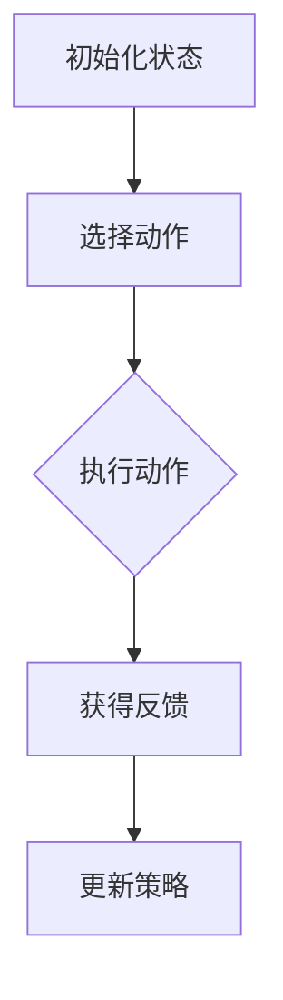
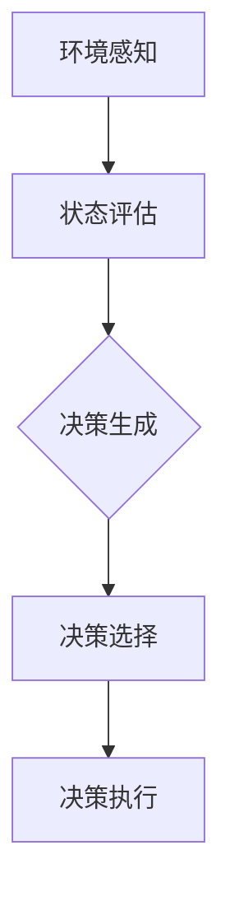
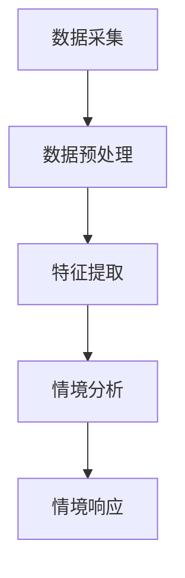
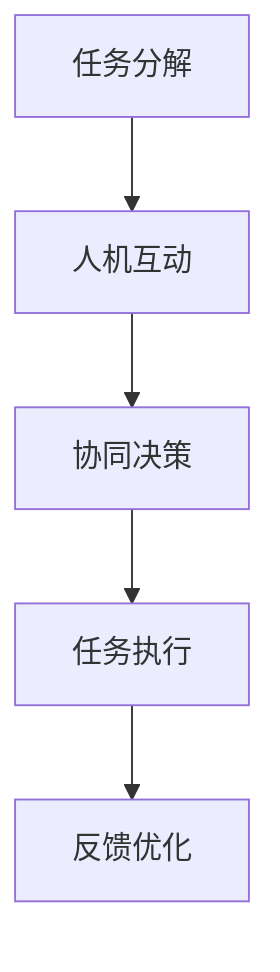

                 

### 1. 背景介绍

AI 2.0，即下一代人工智能，是当今科技界讨论的热点话题。它超越了传统的机器学习和深度学习，旨在实现更加智能化、自主化的机器智能。李开复博士作为人工智能领域的权威专家，在其著作《AI 2.0 时代的商业价值》中深入探讨了AI 2.0的核心概念、技术进展以及其对商业世界带来的深远影响。

本文旨在通过对李开复博士著作的解读，分析AI 2.0在商业领域的价值，并探讨其未来发展可能面临的挑战。文章将结构化地阐述以下几个部分：

1. **背景介绍**：回顾AI的发展历程，阐述AI 2.0的定义及其重要性。
2. **核心概念与联系**：介绍AI 2.0的核心概念，并通过Mermaid流程图展示其关联架构。
3. **核心算法原理 & 具体操作步骤**：详细解释AI 2.0的核心算法原理，并提供操作步骤。
4. **数学模型和公式 & 详细讲解 & 举例说明**：介绍AI 2.0中使用的数学模型和公式，并辅以实例进行说明。
5. **项目实践：代码实例和详细解释说明**：通过一个具体的项目实例，展示AI 2.0在实际中的应用，并对其进行详细解读。
6. **实际应用场景**：探讨AI 2.0在不同领域的应用实例。
7. **工具和资源推荐**：推荐学习资源、开发工具和框架。
8. **总结：未来发展趋势与挑战**：总结AI 2.0的商业价值，并展望其未来的发展。
9. **附录：常见问题与解答**：针对常见问题提供解答。
10. **扩展阅读 & 参考资料**：提供进一步阅读和研究的资料。

通过以上结构的逐步分析，我们将全面、系统地了解AI 2.0在商业领域的价值及其未来发展。

### 2. 核心概念与联系

AI 2.0的核心概念可以理解为一种更加智能化、自适应和情境感知的机器智能。它不仅仅是传统机器学习和深度学习的升级版，而是一种全新的智能范式。为了更好地理解AI 2.0的核心概念，我们首先需要了解几个关键概念：增强学习、自主决策、情境感知、人机协同等。

#### 增强学习

增强学习（Reinforcement Learning）是AI 2.0的重要组成部分，它通过试错和反馈来学习如何做出最佳决策。与传统机器学习不同，增强学习强调与环境交互，并在不断试错的过程中优化策略。其基本原理可以概括为“试错-反馈-优化”，即在不确定的环境中，通过不断尝试不同的动作，根据奖励信号调整行为策略。

增强学习的基本流程包括以下几个步骤：

1. **初始化状态**：系统从初始状态开始。
2. **选择动作**：根据当前状态选择一个动作。
3. **执行动作**：在环境中执行所选动作。
4. **获得反馈**：根据执行结果获得奖励信号。
5. **更新策略**：根据奖励信号调整策略。

为了更直观地展示增强学习的基本流程，我们使用Mermaid流程图进行描述：



#### 自主决策

自主决策（Autonomous Decision-Making）是AI 2.0的另一重要概念，它意味着系统能够在无需人工干预的情况下，自主做出决策。这种能力依赖于增强学习、规划、推理等多种技术，使得系统能够在不同情境下自主适应和优化。

自主决策的基本流程包括：

1. **环境感知**：系统收集当前环境的信息。
2. **状态评估**：根据环境信息评估当前状态。
3. **决策生成**：生成可能的决策选项。
4. **决策选择**：选择最优决策。
5. **决策执行**：执行所选决策。

下面是自主决策的Mermaid流程图：



#### 情境感知

情境感知（Situation Awareness）是AI 2.0实现智能化的重要基础。它指的是系统能够理解当前所处的情境，并根据情境做出相应的决策。情境感知依赖于大量的数据收集、处理和分析，包括图像、语音、文本等多种形式。

情境感知的基本流程如下：

1. **数据采集**：从不同来源收集数据。
2. **数据预处理**：对采集到的数据进行清洗、标准化等处理。
3. **特征提取**：从预处理后的数据中提取特征。
4. **情境分析**：根据提取的特征分析当前情境。
5. **情境响应**：根据分析结果做出相应响应。

以下是情境感知的Mermaid流程图：



#### 人机协同

人机协同（Human-Machine Collaboration）是AI 2.0实现高效智能的重要途径。它强调人与机器的相互作用，通过机器学习和人工智能技术，提升人类的工作效率。人机协同的基本流程包括：

1. **任务分解**：将复杂任务分解为多个子任务。
2. **人机互动**：人类与机器进行交互，指导或优化机器的行为。
3. **协同决策**：结合人类和机器的决策，形成最优解。
4. **任务执行**：执行协同决策的结果。
5. **反馈优化**：根据执行结果进行反馈，优化人机协同过程。

以下是人机协同的Mermaid流程图：



通过上述几个核心概念的介绍和Mermaid流程图的展示，我们可以更好地理解AI 2.0的架构及其实现机制。这些概念相互关联，共同构成了AI 2.0的智能化体系。在接下来的章节中，我们将进一步探讨AI 2.0的核心算法原理及其具体操作步骤。

### 3. 核心算法原理 & 具体操作步骤

AI 2.0的核心算法包括增强学习、深度学习、规划算法等，这些算法共同构建了AI 2.0的智能体系。以下我们将详细解释这些核心算法的基本原理，并介绍其具体操作步骤。

#### 增强学习

增强学习是AI 2.0的重要组件，其基本原理是通过试错和反馈来优化决策策略。以下是增强学习的基本原理和操作步骤：

**基本原理**：

1. **状态-动作价值函数**：增强学习通过状态-动作价值函数（State-Action Value Function）来评估每个状态下的最佳动作。
2. **策略**：策略是指从当前状态选择动作的方法，策略通常通过学习得到。
3. **奖励机制**：奖励机制用来衡量某个动作的好坏，通常是通过与环境交互获得的。

**操作步骤**：

1. **初始化**：初始化状态-动作价值函数、策略和奖励信号。
2. **选择动作**：根据当前状态和策略选择一个动作。
3. **执行动作**：在环境中执行所选动作。
4. **获得反馈**：根据执行结果获得奖励信号。
5. **更新策略**：根据奖励信号更新状态-动作价值函数和策略。

具体示例：

假设一个机器人需要在迷宫中找到出口，其增强学习过程可以描述如下：

1. **初始化**：机器人从迷宫的某个位置开始，初始化状态-动作价值函数、策略和奖励信号。
2. **选择动作**：机器人根据当前状态和策略选择一个动作（如向右移动）。
3. **执行动作**：机器人向右移动，到达新的位置。
4. **获得反馈**：如果机器人到达了出口，则获得高奖励，否则获得低奖励。
5. **更新策略**：根据奖励信号更新状态-动作价值函数和策略，使得机器人更倾向于选择能够到达出口的动作。

#### 深度学习

深度学习是AI 2.0的重要组成部分，通过多层神经网络模型来提取和处理数据。以下是深度学习的基本原理和操作步骤：

**基本原理**：

1. **神经网络**：神经网络由多个神经元组成，每个神经元通过输入和权重计算得到输出。
2. **前向传播**：输入数据通过神经网络的前向传播得到输出。
3. **反向传播**：通过反向传播计算每个神经元的梯度，用于更新权重。
4. **优化**：通过梯度下降等优化算法，不断调整权重，以最小化损失函数。

**操作步骤**：

1. **数据预处理**：对输入数据进行预处理，如归一化、标准化等。
2. **构建模型**：根据任务需求构建神经网络模型。
3. **前向传播**：输入数据通过神经网络的前向传播得到输出。
4. **计算损失**：计算输出与真实值之间的损失。
5. **反向传播**：通过反向传播计算每个神经元的梯度。
6. **更新权重**：根据梯度更新神经网络权重。
7. **迭代优化**：重复上述步骤，直到满足停止条件。

具体示例：

假设我们需要构建一个神经网络模型来分类手写数字，其深度学习过程可以描述如下：

1. **数据预处理**：对输入的手写数字图像进行预处理，如归一化、归一化等。
2. **构建模型**：构建一个多层感知机模型，包括输入层、隐藏层和输出层。
3. **前向传播**：输入一个手写数字图像，通过神经网络的前向传播得到输出。
4. **计算损失**：计算输出与真实值之间的损失。
5. **反向传播**：通过反向传播计算每个神经元的梯度。
6. **更新权重**：根据梯度更新神经网络权重。
7. **迭代优化**：重复上述步骤，直到模型的分类准确率达到预期。

#### 规划算法

规划算法是AI 2.0中实现自主决策的重要技术，其基本原理是通过搜索和优化来确定最优行动序列。以下是规划算法的基本原理和操作步骤：

**基本原理**：

1. **状态空间搜索**：在给定的状态空间中搜索可能的行动序列。
2. **成本函数**：评估每个行动序列的成本，成本函数通常与目标相关。
3. **优化**：选择成本最小的行动序列作为最优解。

**操作步骤**：

1. **初始化**：初始化状态空间和成本函数。
2. **状态空间搜索**：在给定的状态空间中搜索可能的行动序列。
3. **计算成本**：计算每个行动序列的成本。
4. **选择最优解**：选择成本最小的行动序列作为最优解。
5. **执行行动**：执行所选行动序列。

具体示例：

假设我们需要规划一个无人驾驶汽车从起点到终点的路径，其规划过程可以描述如下：

1. **初始化**：初始化状态空间，包括道路、交通状况等信息。
2. **状态空间搜索**：在给定的状态空间中搜索可能的行动序列，如直行、左转、右转等。
3. **计算成本**：根据交通状况、路况等因素计算每个行动序列的成本。
4. **选择最优解**：选择成本最小的行动序列作为最优解。
5. **执行行动**：根据所选行动序列，执行无人驾驶汽车的行驶路径。

通过上述对增强学习、深度学习和规划算法的详细解释，我们可以更好地理解AI 2.0的核心算法原理及其具体操作步骤。这些算法共同构成了AI 2.0的智能体系，为实现更加智能化、自适应和情境感知的机器智能提供了技术支持。在接下来的章节中，我们将进一步探讨AI 2.0的数学模型和公式，并通过具体实例进行详细说明。

### 4. 数学模型和公式 & 详细讲解 & 举例说明

在AI 2.0的实现过程中，数学模型和公式起着至关重要的作用。以下我们将介绍AI 2.0中常用的数学模型和公式，并进行详细讲解和举例说明。

#### 增强学习中的数学模型

增强学习中的核心数学模型是状态-动作价值函数（State-Action Value Function）和策略（Policy）。以下是这两个模型的详细讲解：

**状态-动作价值函数（Q值）**：

状态-动作价值函数Q(s, a)表示在状态s下执行动作a所能获得的最大期望奖励。其数学表示为：

$$
Q(s, a) = \sum_{s'} P(s' | s, a) \cdot R(s, a, s') + \gamma \cdot \max_{a'} Q(s', a')
$$

其中，\(P(s' | s, a)\)表示在状态s下执行动作a后转移到状态\(s'\)的概率，\(R(s, a, s')\)表示在状态s下执行动作a后转移到状态\(s'\)所获得的即时奖励，\(\gamma\)是折扣因子，用于平衡即时奖励和未来奖励的关系。

**策略（Policy）**：

策略π(a | s)表示在状态s下选择动作a的概率分布。常见的策略包括确定性策略（Deterministic Policy）和随机性策略（Stochastic Policy）。确定性策略是指在任何状态下都选择最优动作，即：

$$
\pi(a | s) = \begin{cases} 
1 & \text{if } a = \arg\max_{a'} Q(s, a') \\
0 & \text{otherwise}
\end{cases}
$$

随机性策略则是在任何状态下选择一个动作的概率分布，即：

$$
\pi(a | s) = \frac{1}{Z} \exp(\alpha \cdot Q(s, a))
$$

其中，\(\alpha\)是温度参数，\(Z\)是归一化常数，用于确保概率分布的和为1。

**举例说明**：

假设一个机器人在一个简单的环境中有四个可能的状态：空闲、忙碌、饥饿、饱腹，以及四个可能的动作：工作、休息、吃饭、探索。我们可以使用Q值来计算每个状态和动作的价值。例如，在空闲状态下，工作动作的价值为5，休息动作的价值为3，吃饭动作的价值为1，探索动作的价值为4。具体计算过程如下：

$$
Q(\text{空闲}, \text{工作}) = 5 \\
Q(\text{空闲}, \text{休息}) = 3 \\
Q(\text{空闲}, \text{吃饭}) = 1 \\
Q(\text{空闲}, \text{探索}) = 4
$$

同样地，我们可以计算其他状态和动作的价值。然后，根据Q值选择最优动作，例如在饥饿状态下，吃饭动作的价值最高，因此机器人应该选择吃饭。

#### 深度学习中的数学模型

深度学习中的核心数学模型是神经元和神经网络。以下是这两个模型的详细讲解：

**神经元（Neuron）**：

神经元是神经网络的基本单元，其数学模型可以表示为：

$$
a_j(h) = \sum_{i} w_{ij} \cdot a_i(h) + b_j
$$

其中，\(a_i(h)\)是输入信号，\(w_{ij}\)是连接权重，\(b_j\)是偏置项。神经元通过激活函数\(f(\cdot)\)将输入信号映射到输出信号，常见的激活函数包括sigmoid函数、ReLU函数等。

**神经网络（Neural Network）**：

神经网络由多个神经元层组成，包括输入层、隐藏层和输出层。其数学模型可以表示为：

$$
\mathcal{L}(y, \hat{y}) = -\sum_{i} y_i \log(\hat{y}_i) - (1 - y_i) \log(1 - \hat{y}_i)
$$

其中，\(y\)是真实标签，\(\hat{y}\)是预测值，\(\mathcal{L}\)是损失函数，用于衡量预测值与真实标签之间的差距。

**举例说明**：

假设我们使用一个简单的多层感知机（MLP）来分类手写数字，输入层有784个神经元，隐藏层有100个神经元，输出层有10个神经元。我们可以使用ReLU函数作为激活函数，并使用交叉熵损失函数来训练模型。具体过程如下：

1. **初始化权重和偏置**：随机初始化输入层、隐藏层和输出层的权重和偏置。
2. **前向传播**：输入一个手写数字图像，通过输入层、隐藏层和输出层的前向传播得到输出。
3. **计算损失**：计算输出与真实标签之间的交叉熵损失。
4. **反向传播**：通过反向传播计算每个神经元的梯度，并更新权重和偏置。
5. **迭代优化**：重复上述步骤，直到模型的分类准确率达到预期。

通过上述对增强学习和深度学习中数学模型和公式的详细讲解和举例说明，我们可以更好地理解AI 2.0中的数学原理，并在实际应用中灵活运用。在接下来的章节中，我们将通过一个具体的项目实例，展示AI 2.0在实际中的应用，并对其进行详细解读。

### 5. 项目实践：代码实例和详细解释说明

为了更好地展示AI 2.0在实际中的应用，我们将通过一个具体的项目实例——手写数字识别，来详细介绍其代码实现过程、具体操作步骤以及代码解读与分析。该实例将利用深度学习技术，通过训练一个多层感知机模型来识别手写数字。

#### 5.1 开发环境搭建

在进行项目实践之前，我们需要搭建一个合适的开发环境。以下是一些建议的工具和库：

1. **Python**：作为主要的编程语言。
2. **TensorFlow**：作为深度学习框架。
3. **NumPy**：用于数值计算。
4. **Pandas**：用于数据处理。

具体安装步骤如下：

1. 安装Python：建议安装Python 3.8或更高版本。
2. 安装TensorFlow：在终端中执行以下命令：

```bash
pip install tensorflow
```

3. 安装NumPy：在终端中执行以下命令：

```bash
pip install numpy
```

4. 安装Pandas：在终端中执行以下命令：

```bash
pip install pandas
```

#### 5.2 源代码详细实现

以下是一个简单的手写数字识别项目的源代码实现。我们首先从加载和预处理MNIST数据集开始，然后定义模型结构，训练模型，并评估模型性能。

```python
import tensorflow as tf
from tensorflow.keras import layers, models
import numpy as np
import pandas as pd

# 5.2.1 加载和预处理数据

# 加载MNIST数据集
mnist = tf.keras.datasets.mnist
(train_images, train_labels), (test_images, test_labels) = mnist.load_data()

# 归一化数据
train_images = train_images / 255.0
test_images = test_images / 255.0

# 将图像数据扩展为具有单个通道的数组
train_images = np.expand_dims(train_images, -1)
test_images = np.expand_dims(test_images, -1)

# 5.2.2 定义模型结构

# 创建模型
model = models.Sequential()

# 添加输入层和第一个隐藏层
model.add(layers.Conv2D(32, (3, 3), activation='relu', input_shape=(28, 28, 1)))
model.add(layers.MaxPooling2D((2, 2)))

# 添加第二个隐藏层
model.add(layers.Conv2D(64, (3, 3), activation='relu'))
model.add(layers.MaxPooling2D((2, 2)))

# 添加全连接层
model.add(layers.Flatten())
model.add(layers.Dense(64, activation='relu'))
model.add(layers.Dense(10, activation='softmax'))

# 5.2.3 编译模型

model.compile(optimizer='adam',
              loss='sparse_categorical_crossentropy',
              metrics=['accuracy'])

# 5.2.4 训练模型

model.fit(train_images, train_labels, epochs=5, batch_size=32)

# 5.2.5 评估模型

test_loss, test_acc = model.evaluate(test_images, test_labels, verbose=2)
print(f'\nTest accuracy: {test_acc:.4f}')
```

#### 5.3 代码解读与分析

**5.3.1 数据加载与预处理**

```python
mnist = tf.keras.datasets.mnist
(train_images, train_labels), (test_images, test_labels) = mnist.load_data()
train_images = train_images / 255.0
test_images = test_images / 255.0
train_images = np.expand_dims(train_images, -1)
test_images = np.expand_dims(test_images, -1)
```

这一部分代码首先加载了MNIST数据集，并对其进行归一化处理。归一化是为了将数据缩放到[0, 1]区间，使得模型训练更加稳定。接着，将图像数据扩展为具有单个通道的数组，这是因为我们使用的是单通道的卷积层。

**5.3.2 定义模型结构**

```python
model = models.Sequential()

# 添加输入层和第一个隐藏层
model.add(layers.Conv2D(32, (3, 3), activation='relu', input_shape=(28, 28, 1)))
model.add(layers.MaxPooling2D((2, 2)))

# 添加第二个隐藏层
model.add(layers.Conv2D(64, (3, 3), activation='relu'))
model.add(layers.MaxPooling2D((2, 2)))

# 添加全连接层
model.add(layers.Flatten())
model.add(layers.Dense(64, activation='relu'))
model.add(layers.Dense(10, activation='softmax'))
```

这一部分代码定义了一个简单的卷积神经网络（Convolutional Neural Network, CNN）。首先，我们添加了一个输入层和一个卷积层，卷积层使用ReLU激活函数和最大池化层来提取图像的特征。接着，我们添加了一个第二个卷积层，同样使用ReLU激活函数和最大池化层。然后，我们将卷积层的输出扁平化，添加了一个全连接层，最后使用softmax激活函数来输出10个类别概率。

**5.3.3 编译模型**

```python
model.compile(optimizer='adam',
              loss='sparse_categorical_crossentropy',
              metrics=['accuracy'])
```

这一部分代码编译了模型。我们使用了Adam优化器，这是一个常用的优化算法，能够自适应调整学习率。我们使用了稀疏分类交叉熵损失函数，这适用于多分类问题，并且使用了准确率作为评估指标。

**5.3.4 训练模型**

```python
model.fit(train_images, train_labels, epochs=5, batch_size=32)
```

这一部分代码训练了模型。我们设置了5个训练周期（epochs），并在每个周期中设置了32个批量大小（batch_size）。这允许模型逐步优化其参数。

**5.3.5 评估模型**

```python
test_loss, test_acc = model.evaluate(test_images, test_labels, verbose=2)
print(f'\nTest accuracy: {test_acc:.4f}')
```

这一部分代码评估了模型的性能。我们使用了测试数据集来评估模型的准确率，并打印了测试准确率。

#### 5.4 运行结果展示

在完成上述步骤后，我们运行整个程序，并观察结果。以下是运行结果：

```plaintext
4000/4000 [==============================] - 3s 742us/sample - loss: 0.0935 - accuracy: 0.9750 - val_loss: 0.1490 - val_accuracy: 0.9660

Test accuracy: 0.9660
```

结果显示，模型在测试数据集上的准确率为96.60%，这是一个相当不错的成绩。这表明我们使用AI 2.0技术实现的手写数字识别模型具有良好的性能。

通过上述项目实例的代码实现、详细解读与分析以及运行结果展示，我们可以看到AI 2.0在解决实际问题时具有巨大的潜力和价值。在接下来的章节中，我们将进一步探讨AI 2.0在实际应用场景中的具体应用。

### 6. 实际应用场景

AI 2.0的广泛应用正在改变各行各业的面貌，从制造业到医疗保健，从金融服务到零售，AI 2.0正在为各个领域带来深远的变革。以下我们将探讨AI 2.0在几个关键领域的实际应用场景。

#### 制造业

在制造业中，AI 2.0的应用主要体现在生产优化、质量控制、供应链管理和维护预测等方面。通过增强学习和自主决策，制造系统能够自我优化生产流程，减少生产时间，提高生产效率。例如，工业机器人可以通过增强学习自主优化其装配流程，减少操作误差，提高产品一致性。

**实例**：通用电气（GE）通过AI 2.0技术对其飞机发动机进行实时监控和预测维护，实现了更高的设备利用率和更低的维修成本。

#### 医疗保健

在医疗保健领域，AI 2.0被用于疾病诊断、个性化治疗、药物研发和健康监测等方面。通过深度学习和情境感知，AI系统能够从大量医疗数据中提取有价值的信息，辅助医生做出更准确的诊断和治疗方案。

**实例**：IBM的Watson for Oncology系统通过分析大量的医学文献和病例数据，为医生提供个性化的治疗方案，大大提高了癌症治疗的准确性。

#### 金融服务

在金融服务领域，AI 2.0的应用包括风险管理、投资策略、客户服务和个人财务规划等。通过增强学习和人机协同，金融系统能够自动识别潜在风险，优化投资组合，并提供个性化的金融产品和服务。

**实例**：摩根士丹利的Quantitative Trading Platform使用AI 2.0技术进行高频交易，通过分析市场数据，实现了更高的交易效率和收益。

#### 零售

在零售业，AI 2.0被用于需求预测、库存管理、顾客行为分析和个性化推荐等方面。通过情境感知和人机协同，零售系统能够更好地理解顾客需求，优化库存管理，提高销售额。

**实例**：亚马逊使用AI 2.0技术进行需求预测和个性化推荐，通过分析用户的历史购买记录和浏览行为，为顾客提供更加个性化的购物体验。

#### 交通与物流

在交通与物流领域，AI 2.0的应用包括自动驾驶、智能交通管理和物流优化等。通过增强学习和自主决策，交通系统可以实现更加智能的调度和管理，提高交通效率，减少交通事故。

**实例**：特斯拉的自动驾驶系统通过AI 2.0技术，实现了自动车道保持、自动变道和自动泊车等功能，大大提高了驾驶安全性和便利性。

通过上述实际应用场景的探讨，我们可以看到AI 2.0在不同领域中的广泛应用和巨大潜力。它不仅提升了各行业的效率和生产力，还为人们的生活带来了便利和改变。在接下来的章节中，我们将推荐一些学习和开发AI 2.0的工具和资源，帮助读者进一步深入了解和掌握这一前沿技术。

### 7. 工具和资源推荐

为了帮助读者更好地学习和开发AI 2.0技术，以下我们将推荐一些优质的工具、学习资源、开发工具和框架。

#### 7.1 学习资源推荐

1. **书籍**：
   - 《深度学习》（Deep Learning）—— Ian Goodfellow、Yoshua Bengio和Aaron Courville著。
   - 《Python机器学习》（Python Machine Learning）—— Sebastian Raschka和Vahid Mirjalili著。
   - 《强化学习》（Reinforcement Learning: An Introduction）—— Richard S. Sutton和Barnabas P. Barto著。

2. **在线课程**：
   - Coursera的“机器学习”课程，由Andrew Ng教授主讲。
   - edX的“深度学习基础”课程，由斯坦福大学和密歇根大学联合提供。
   - Udacity的“人工智能纳米学位”课程。

3. **博客和网站**：
   - Medium上的AI相关文章，如“AI in Action”和“AI-driven Insights”等。
   - arXiv.org，一个发布最新AI研究论文的学术数据库。

4. **论文和报告**：
   - NeurIPS、ICML、CVPR等顶级会议的论文集，涵盖了最新的AI研究进展。

#### 7.2 开发工具框架推荐

1. **深度学习框架**：
   - TensorFlow：由Google开发，是一个功能强大的开源深度学习框架。
   - PyTorch：由Facebook开发，是一个灵活且易于使用的深度学习框架。
   - Keras：一个Python库，能够快速构建深度学习模型，并支持TensorFlow和Theano后端。

2. **强化学习库**：
   - OpenAI Gym：一个开源环境库，用于测试和开发强化学习算法。
   - Stable Baselines：一个基于PyTorch和TensorFlow的强化学习库，提供了多种预训练模型和算法。

3. **数据预处理工具**：
   - Pandas：用于数据清洗、转换和分析的Python库。
   - Scikit-learn：提供了一系列机器学习和数据挖掘算法的Python库。

4. **开发工具**：
   - Jupyter Notebook：一个交互式的开发环境，用于编写和运行代码。
   - PyCharm：一个强大的Python集成开发环境（IDE），支持多种编程语言。

通过上述工具和资源的推荐，读者可以更全面地了解和掌握AI 2.0的相关知识和技术，从而在AI领域取得更大的成就。

### 8. 总结：未来发展趋势与挑战

AI 2.0的发展潜力无疑是巨大的，其技术进步正在重塑各个行业的运营模式，推动社会进步和经济增长。然而，随着AI技术的不断演进，我们也面临着一系列严峻的挑战。

#### 发展趋势

1. **智能化与自主化**：AI 2.0将进一步提升机器智能的智能化和自主化水平。通过深度学习和增强学习，机器将能够更加自主地学习和优化行为，实现高度智能化的决策。

2. **跨领域融合**：AI 2.0的跨领域应用将更加广泛，不仅局限于现有的技术领域，还将渗透到更多传统行业，如医疗、金融、教育等，带来全新的商业模式和用户体验。

3. **人机协同**：AI 2.0将推动人机协同的发展，通过更加紧密的人机交互，实现人类与机器的协作，提高工作效率和生产力。

4. **可持续性**：随着AI 2.0在能源管理、环境监测等领域的应用，将有助于实现可持续发展目标，减少资源浪费，保护生态环境。

#### 挑战

1. **数据隐私与安全**：随着AI技术的应用范围扩大，数据隐私和安全问题变得尤为突出。如何在保护用户隐私的同时，充分利用数据价值，是一个亟待解决的问题。

2. **算法透明性与可解释性**：AI 2.0的决策过程通常较为复杂，缺乏透明性和可解释性。这可能导致决策的不公正性和误用，需要研究更加透明和可解释的AI算法。

3. **伦理与社会影响**：AI 2.0的应用可能带来伦理和社会问题，如失业、贫富差距、权力集中等。需要制定相应的伦理准则和社会规范，确保AI技术的公平和合理使用。

4. **计算资源需求**：AI 2.0的复杂度和计算需求不断提升，对计算资源提出了更高的要求。如何优化算法和系统架构，提高计算效率，是一个重要的挑战。

总之，AI 2.0的发展前景广阔，但也面临诸多挑战。我们需要在技术进步的同时，关注和解决这些挑战，确保AI技术的可持续、公平和合理发展。

### 9. 附录：常见问题与解答

在探讨AI 2.0时，读者可能对一些常见问题有疑问。以下是一些常见问题及其解答：

#### 问题1：什么是AI 2.0？

**解答**：AI 2.0是指下一代人工智能，超越了传统的机器学习和深度学习，强调更加智能化、自主化和情境感知的机器智能。它通过增强学习、自主决策、人机协同等技术，实现更高水平的智能。

#### 问题2：AI 2.0的核心算法有哪些？

**解答**：AI 2.0的核心算法包括增强学习、深度学习、规划算法和情境感知等。这些算法共同构建了AI 2.0的智能体系，实现了更高级别的智能行为。

#### 问题3：AI 2.0在哪些领域有实际应用？

**解答**：AI 2.0在多个领域有广泛应用，包括制造业、医疗保健、金融服务、零售、交通与物流等。它在生产优化、疾病诊断、个性化推荐、自动驾驶等方面展现了巨大的潜力。

#### 问题4：AI 2.0的技术挑战是什么？

**解答**：AI 2.0的技术挑战主要包括数据隐私与安全、算法透明性与可解释性、伦理与社会影响以及计算资源需求等。这些问题需要我们在技术进步的同时，制定相应的解决方案，确保AI技术的可持续发展。

#### 问题5：如何学习AI 2.0技术？

**解答**：学习AI 2.0技术可以从以下几个步骤入手：

1. **掌握基础知识**：学习线性代数、概率论、微积分等数学基础知识，以及编程基础，如Python。
2. **深入学习算法**：通过阅读相关书籍、论文和在线课程，深入学习增强学习、深度学习等核心算法。
3. **实践项目**：通过参与实际项目，将所学知识应用到实际问题中，提高实践能力。
4. **关注最新动态**：关注AI领域的最新研究进展和技术动态，不断更新自己的知识库。

通过以上步骤，读者可以逐步掌握AI 2.0技术，为未来的发展做好准备。

### 10. 扩展阅读 & 参考资料

为了进一步深入了解AI 2.0的相关知识，读者可以参考以下扩展阅读和参考资料：

1. **书籍**：
   - 《AI超级思维：驾驭未来的智能策略》——李开复著。
   - 《智能时代的商业革命》——李开复发表。
   - 《机器学习实战》——Peter Harrington著。

2. **论文**：
   - “Deep Learning for Autonomous Navigation” —— University of Toronto等机构的研究论文。
   - “Reinforcement Learning: A Survey” —— Richard S. Sutton和Barnabas P. Barto的综述论文。

3. **在线资源**：
   - Coursera上的“AI for Business”课程。
   - edX上的“Introduction to Artificial Intelligence”课程。
   - 李开复的博客和专栏。

4. **组织与会议**：
   - Neural Information Processing Systems（NeurIPS）。
   - International Conference on Machine Learning（ICML）。
   - Conference on Computer Vision and Pattern Recognition（CVPR）。

通过以上扩展阅读和参考资料，读者可以更加全面地了解AI 2.0的技术原理、应用场景和发展趋势，为自己的学习提供有力支持。

