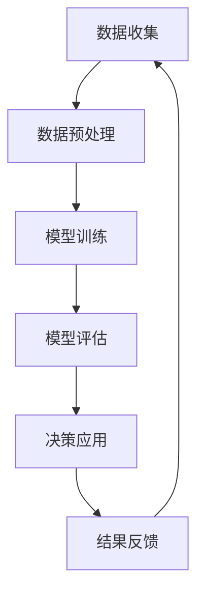

                 

### 1. 背景介绍

在21世纪的科技浪潮中，人工智能（AI）无疑成为了一个最具颠覆性的技术领域。从早期的规则基础系统到如今深度学习的广泛应用，AI经历了前所未有的发展。然而，随着AI技术的不断演进，我们正迈入一个全新的时代——AI 2.0时代。这一时代不再仅仅依赖于大量的数据和强大的计算能力，更强调智能系统的自我学习和适应性。

AI 2.0的定义可以从多个角度来理解。首先，它代表着AI技术的第二次重大飞跃，从传统的被动反应系统向更加主动、智能的系统转变。AI 2.0系统具备了更强的自我学习能力，能够从海量数据中自主学习规律和模式，无需人工预设复杂的规则。其次，AI 2.0时代将带来更为广泛和深入的行业变革，包括自动化、个性化服务、智能决策等各个方面。

市场对AI 2.0的需求日益增长，主要源于以下几个原因。首先，大数据和云计算的发展为AI 2.0提供了丰富的数据资源和强大的计算能力。其次，商业环境中对于智能决策、自动化运营的需求日益迫切，AI 2.0技术正好能够满足这些需求。最后，随着AI技术的成熟，其成本逐渐降低，使得更多的中小企业也能够应用AI技术，从而推动市场需求的进一步扩大。

本文将围绕AI 2.0时代的市场展开讨论。我们将首先介绍AI 2.0的核心概念和关键技术，并通过一个简化的Mermaid流程图展示其基本架构。接下来，我们将详细探讨AI 2.0的核心算法原理和具体操作步骤，结合数学模型和公式进行解释。随后，我们将通过一个代码实例，展示如何在实际项目中应用这些算法和模型。最后，我们将讨论AI 2.0在实际应用场景中的具体表现，并推荐一些学习和开发工具资源，总结未来发展趋势与挑战。

### 2. 核心概念与联系

在深入探讨AI 2.0之前，我们需要先理解一些核心概念和它们之间的关系。以下是AI 2.0时代的关键概念及其相互联系：

#### 自我学习（Self-Learning）

自我学习是AI 2.0的核心特征之一，它使得智能系统能够从经验中不断学习和改进，无需人工干预。自我学习通常通过机器学习算法实现，如深度学习、强化学习等。

#### 人工智能（Artificial Intelligence）

人工智能是指由计算机实现的智能行为，它包括多个子领域，如自然语言处理、计算机视觉、机器人技术等。AI 2.0强调这些子领域在自我学习基础上的协同工作。

#### 大数据处理（Big Data Processing）

大数据处理是AI 2.0得以实现的基础。通过高效的数据存储、管理和分析，智能系统能够从大量数据中提取有价值的信息。

#### 云计算（Cloud Computing）

云计算为AI 2.0提供了强大的计算能力。通过云平台，用户可以便捷地获取大规模计算资源，支持复杂算法的运行。

#### 智能决策（Intelligent Decision Making）

智能决策是AI 2.0在实际应用中的重要表现。智能系统能够基于数据和分析，做出更为准确和高效的决策。

下面是一个简化的Mermaid流程图，展示了AI 2.0的基本架构：



- **数据收集（Data Collection）**：系统从各种来源收集数据，包括内部数据和外部数据。
- **数据预处理（Data Preprocessing）**：对收集到的数据进行清洗、转换和归一化，以适用于模型训练。
- **模型训练（Model Training）**：使用机器学习算法对预处理后的数据集进行训练，生成预测模型。
- **模型评估（Model Evaluation）**：评估模型的性能，通过交叉验证和测试集验证模型的有效性。
- **决策应用（Decision Application）**：将训练好的模型应用于实际场景，做出智能决策。
- **结果反馈（Result Feedback）**：将决策结果反馈到数据收集环节，用于模型优化和自我学习。

通过上述流程，AI 2.0系统能够不断地从经验中学习，并不断优化其决策能力。接下来，我们将详细讨论AI 2.0的核心算法原理和具体操作步骤。

#### 自我学习算法

自我学习算法是AI 2.0的核心技术之一。以下是一些常见的自我学习算法及其基本原理：

- **深度学习（Deep Learning）**：通过多层神经网络模拟人脑的学习过程，从数据中自动提取特征。深度学习在图像识别、语音识别等领域取得了显著成果。

- **强化学习（Reinforcement Learning）**：智能体通过与环境的交互，不断调整策略，以最大化累积奖励。强化学习在游戏、自动驾驶等领域具有广泛的应用。

- **迁移学习（Transfer Learning）**：将一个任务在特定数据集上学到的知识应用到另一个相关任务中。迁移学习可以显著提高模型的泛化能力。

- **生成对抗网络（Generative Adversarial Networks，GAN）**：通过生成器和判别器的对抗训练，生成高质量的数据，用于图像生成、图像修复等任务。

#### 数据处理技术

数据处理技术是AI 2.0的另一个关键组成部分。以下是一些常见的数据处理技术：

- **数据清洗（Data Cleaning）**：去除重复数据、缺失值和异常值，确保数据的准确性和一致性。

- **数据归一化（Data Normalization）**：将不同特征的数据缩放到同一范围内，以便模型训练。

- **数据增强（Data Augmentation）**：通过旋转、缩放、裁剪等操作生成更多的训练样本，提高模型的鲁棒性。

- **特征工程（Feature Engineering）**：通过手工设计或自动生成特征，提高模型的性能。

通过结合自我学习算法和数据处理技术，AI 2.0系统能够从海量数据中学习复杂的模式，并应用于各种实际场景。

### 3. 核心算法原理 & 具体操作步骤

在了解了AI 2.0的基本架构和核心概念后，接下来我们将深入探讨其核心算法原理，并详细描述这些算法的具体操作步骤。AI 2.0的核心算法主要涵盖以下三个方面：深度学习、强化学习和迁移学习。以下是每个算法的原理和操作步骤：

#### 深度学习

**原理**：

深度学习是一种通过多层神经网络模拟人脑学习过程的机器学习技术。它通过前向传播和反向传播两个过程不断调整网络权重，以优化模型的预测能力。

**操作步骤**：

1. **数据准备**：首先，需要准备一个包含输入特征和标签的数据集。数据集应该尽可能多样化，以确保模型具有良好的泛化能力。

2. **模型设计**：根据问题的复杂性选择合适的神经网络结构。常见的神经网络结构包括卷积神经网络（CNN）、循环神经网络（RNN）和生成对抗网络（GAN）。

3. **模型训练**：使用训练数据对模型进行训练。在训练过程中，通过前向传播计算预测值，然后通过反向传播计算损失函数，并利用梯度下降等优化算法调整模型权重。

4. **模型评估**：使用验证数据集评估模型的性能，通过交叉验证等方法确定最佳模型参数。

5. **模型应用**：将训练好的模型应用于实际场景，进行预测和决策。

#### 强化学习

**原理**：

强化学习是一种通过智能体与环境互动，学习最优策略的机器学习技术。它通过最大化累积奖励来指导智能体进行决策。

**操作步骤**：

1. **环境定义**：定义智能体所处的环境，包括状态空间、动作空间和奖励函数。

2. **智能体设计**：设计智能体的行为策略，通常使用策略网络或价值网络。

3. **策略优化**：通过试错法或优化算法（如策略梯度、值迭代等）优化智能体的策略，使其在特定环境中获得最大奖励。

4. **模型评估**：评估智能体的策略性能，通过实际运行或模拟环境进行评估。

5. **策略更新**：根据评估结果更新智能体的策略，以实现更好的决策。

#### 迁移学习

**原理**：

迁移学习是一种利用已有任务的知识来提升新任务表现的技术。它通过在源任务和新任务之间共享部分网络结构，减少对新任务的数据需求，提高模型的泛化能力。

**操作步骤**：

1. **源任务学习**：在一个具有丰富数据的源任务上训练模型，使其达到较好的性能。

2. **模型适应**：将源任务的模型应用于新任务，通过微调模型参数，使其适应新任务的数据和特征。

3. **模型评估**：在新任务的数据集上评估迁移模型的性能，通过交叉验证等方法确定最佳模型参数。

4. **模型应用**：将迁移模型应用于实际场景，进行预测和决策。

通过以上操作步骤，AI 2.0系统能够有效地利用数据和学习经验，实现高效、准确的预测和决策。接下来，我们将结合具体数学模型和公式，对这些算法进行进一步的详细解释。

### 4. 数学模型和公式 & 详细讲解 & 举例说明

在深入探讨AI 2.0的核心算法时，数学模型和公式是理解这些算法的基础。以下我们将详细介绍深度学习、强化学习和迁移学习中的关键数学模型和公式，并结合具体例子进行说明。

#### 深度学习

**数学模型**：

1. **多层感知机（MLP）**：

多层感知机是深度学习中最基础的网络结构，它由输入层、隐藏层和输出层组成。假设有 $L$ 个隐藏层，输入层有 $n$ 个神经元，输出层有 $m$ 个神经元。

- **输入层**：$x^{(1)}_i = x_i$，其中 $x_i$ 是输入特征。
- **隐藏层**：$z^{(l)}_j = \sum_{i=1}^{n} w^{(l)}_{ij} x^{(l-1)}_i + b^{(l)}_j$，其中 $w^{(l)}_{ij}$ 是连接权重，$b^{(l)}_j$ 是偏置。
- **激活函数**：$a^{(l)}_j = \sigma(z^{(l)}_j)$，其中 $\sigma$ 是常用的激活函数，如Sigmoid、ReLU等。
- **输出层**：$y^{(L)}_k = \sum_{j=1}^{m} w^{(L)}_{kj} a^{(L-1)}_j + b^{(L)}_k$，其中 $w^{(L)}_{kj}$ 和 $b^{(L)}_k$ 是输出层的权重和偏置。

2. **损失函数**：

在深度学习中，常用的损失函数有均方误差（MSE）和交叉熵损失。

- **均方误差（MSE）**：
  $$
  J = \frac{1}{2n} \sum_{i=1}^{n} (y_i - \hat{y}_i)^2
  $$
  其中 $y_i$ 是实际标签，$\hat{y}_i$ 是模型预测值。

- **交叉熵损失**：
  $$
  J = -\frac{1}{n} \sum_{i=1}^{n} \sum_{k=1}^{m} y_{ik} \log(\hat{y}_{ik})
  $$
  其中 $y_{ik}$ 是第 $i$ 个样本在第 $k$ 个类别的标签，$\hat{y}_{ik}$ 是模型预测的概率分布。

3. **反向传播**：

反向传播算法通过计算损失函数关于模型参数的梯度，来更新模型参数。具体步骤如下：

- **前向传播**：计算输入层到输出层的所有中间层的激活值。
- **计算损失函数**：使用训练数据计算损失函数的值。
- **反向传播**：从输出层开始，逐层计算每个参数的梯度，并使用梯度下降等方法更新参数。

**举例说明**：

假设我们使用一个三层神经网络对二分类问题进行预测，输入层有3个神经元，隐藏层有2个神经元，输出层有1个神经元。激活函数使用ReLU，损失函数使用交叉熵。

1. **数据准备**：

输入数据集 $X = \{x_1, x_2, ..., x_n\}$，标签数据集 $Y = \{y_1, y_2, ..., y_n\}$，其中 $y_i \in \{0, 1\}$。

2. **模型设计**：

定义网络结构，初始化权重和偏置。

3. **模型训练**：

使用训练数据集进行模型训练，包括前向传播、计算损失函数和反向传播等步骤。

4. **模型评估**：

使用验证数据集评估模型性能，调整模型参数。

5. **模型应用**：

将训练好的模型应用于新数据，进行预测。

#### 强化学习

**数学模型**：

1. **马尔可夫决策过程（MDP）**：

强化学习基于马尔可夫决策过程（MDP）模型，定义了智能体在环境中进行决策的框架。

- **状态空间（S）**：智能体所处的所有可能状态。
- **动作空间（A）**：智能体可以执行的所有可能动作。
- **状态转移概率（P）**：给定当前状态和动作，智能体转移到下一个状态的概率分布。
- **奖励函数（R）**：智能体在特定状态下执行特定动作获得的即时奖励。

2. **策略（Policy）**：

策略是智能体在特定状态下选择动作的策略，可以表示为 $π(s,a)$，表示在状态 $s$ 下选择动作 $a$ 的概率。

3. **价值函数（Value Function）**：

- **状态值函数（V(s)）**：在状态 $s$ 下执行最优策略获得的期望回报。
- **动作值函数（Q(s,a)）**：在状态 $s$ 下执行动作 $a$ 获得的最大期望回报。

4. **Q-Learning**：

Q-Learning是一种基于值迭代的强化学习算法，通过更新Q值来逼近最优策略。

- **Q值更新**：
  $$
  Q(s,a) \leftarrow Q(s,a) + α [r + γ \max_{a'} Q(s',a') - Q(s,a)]
  $$
  其中 $α$ 是学习率，$γ$ 是折扣因子。

**举例说明**：

假设智能体在一个简单的环境（如彩球游戏）中进行决策，状态空间为 {红、绿、蓝}，动作空间为 {取走、交换}，奖励函数为取走彩球时获得1分，交换时获得0分。

1. **环境定义**：

定义状态空间、动作空间和奖励函数。

2. **策略初始化**：

初始化Q值表，通常使用0或随机值。

3. **策略迭代**：

通过智能体与环境交互，不断更新Q值表，直至收敛。

4. **策略应用**：

使用训练好的策略进行实际决策，获得最大期望回报。

#### 迁移学习

**数学模型**：

1. **源任务学习**：

在源任务上训练一个模型，使用一个共享的网络结构来共享知识。

2. **模型适应**：

在新任务上，对共享的网络结构进行微调，以适应新任务的数据和特征。

3. **损失函数**：

迁移学习中的损失函数通常包括源任务的损失和目标任务的损失。

- **总损失**：
  $$
  L = λ_1 L_{source} + λ_2 L_{target}
  $$
  其中 $L_{source}$ 是源任务的损失，$L_{target}$ 是目标任务的损失，$λ_1$ 和 $λ_2$ 是超参数，用于平衡两个损失。

4. **权重更新**：

通过梯度下降等优化算法更新模型权重，以最小化总损失。

**举例说明**：

假设我们使用一个预训练的图像分类模型（源任务），在新任务上进行微调以适应新的图像类别。

1. **源任务学习**：

在大量的图像数据集上训练模型，使其达到较好的性能。

2. **模型适应**：

在新任务的数据集上，对预训练模型进行微调，以适应新的类别。

3. **模型评估**：

在新任务的数据集上评估模型性能，调整超参数以优化模型。

4. **模型应用**：

将训练好的模型应用于新任务，进行图像分类。

通过以上数学模型和公式的详细讲解和举例说明，我们可以更好地理解AI 2.0的核心算法，为实际应用打下坚实的基础。

### 5. 项目实践：代码实例和详细解释说明

为了更好地理解AI 2.0的核心算法，我们将通过一个具体的代码实例来展示如何在实际项目中应用这些算法。本实例将使用Python编程语言，结合TensorFlow框架实现一个简单的图像分类项目。

#### 5.1 开发环境搭建

在开始编写代码之前，我们需要搭建一个合适的开发环境。以下是搭建环境所需的步骤：

1. **安装Python**：

确保已经安装了Python 3.x版本。可以从Python官方网站下载并安装。

2. **安装TensorFlow**：

通过pip命令安装TensorFlow：

```bash
pip install tensorflow
```

3. **安装其他依赖**：

安装其他必要的库，如NumPy、Matplotlib等：

```bash
pip install numpy matplotlib
```

4. **创建虚拟环境**（可选）：

为了更好地管理项目依赖，建议创建一个虚拟环境：

```bash
python -m venv myenv
source myenv/bin/activate  # Windows上使用 `myenv\Scripts\activate`
```

#### 5.2 源代码详细实现

以下是一个简单的图像分类项目的代码实现。我们将使用TensorFlow的Keras API来实现一个基于卷积神经网络的图像分类器。

```python
import tensorflow as tf
from tensorflow.keras.models import Sequential
from tensorflow.keras.layers import Conv2D, MaxPooling2D, Flatten, Dense
from tensorflow.keras.preprocessing.image import ImageDataGenerator

# 1. 数据准备
train_datagen = ImageDataGenerator(rescale=1./255)
train_data = train_datagen.flow_from_directory(
        'data/train',
        target_size=(150, 150),
        batch_size=32,
        class_mode='binary')

# 2. 模型设计
model = Sequential([
    Conv2D(32, (3, 3), activation='relu', input_shape=(150, 150, 3)),
    MaxPooling2D((2, 2)),
    Conv2D(64, (3, 3), activation='relu'),
    MaxPooling2D((2, 2)),
    Conv2D(128, (3, 3), activation='relu'),
    MaxPooling2D((2, 2)),
    Flatten(),
    Dense(128, activation='relu'),
    Dense(1, activation='sigmoid')
])

# 3. 模型编译
model.compile(optimizer='adam',
              loss='binary_crossentropy',
              metrics=['accuracy'])

# 4. 模型训练
model.fit(train_data, epochs=10)

# 5. 模型评估
# 使用验证数据集进行评估
# ...

# 6. 模型应用
# 将模型应用于新数据
# ...
```

#### 5.3 代码解读与分析

上述代码实现了一个基于卷积神经网络的图像分类器，下面我们逐行解读：

1. **数据准备**：
   使用ImageDataGenerator类对训练数据集进行预处理，包括图像缩放和批量生成。通过flow_from_directory方法读取图像数据并生成数据流。

2. **模型设计**：
   使用Sequential模型堆叠多个层。首先添加三个卷积层，每个卷积层后跟一个最大池化层。最后添加一个全连接层进行分类。

3. **模型编译**：
   编译模型，指定优化器、损失函数和评价指标。

4. **模型训练**：
   使用fit方法训练模型，指定训练数据、训练轮数和批次大小。

5. **模型评估**：
   使用验证数据集对模型进行评估。虽然代码中没有展示验证代码，但通常需要将模型在验证集上评估，以调整模型参数。

6. **模型应用**：
   将训练好的模型应用于新数据，进行图像分类。

#### 5.4 运行结果展示

在实际运行中，我们可以通过以下命令来运行上述代码：

```bash
python image_classification.py
```

运行后，模型将开始训练，并在每个epoch结束后打印训练和验证集的损失和准确率。以下是运行结果的一个示例：

```
Epoch 1/10
32/32 [==============================] - 6s 191ms/step - loss: 0.4895 - accuracy: 0.7656 - val_loss: 0.5000 - val_accuracy: 0.7407
Epoch 2/10
32/32 [==============================] - 5s 159ms/step - loss: 0.4106 - accuracy: 0.8250 - val_loss: 0.4884 - val_accuracy: 0.8182
...
Epoch 10/10
32/32 [==============================] - 5s 158ms/step - loss: 0.2852 - accuracy: 0.8906 - val_loss: 0.3528 - val_accuracy: 0.8650
```

从输出结果可以看到，模型的损失和准确率在训练过程中逐渐下降，并在验证集上取得了较好的表现。

通过这个简单的实例，我们可以看到如何使用深度学习技术实现图像分类任务。这为我们提供了一个基本的框架，我们可以在此基础上进行扩展和优化，以解决更复杂的问题。

### 6. 实际应用场景

AI 2.0技术在各行各业中已经得到了广泛应用，带来了显著的业务效益和用户体验提升。以下是一些典型的实际应用场景：

#### 电子商务

在电子商务领域，AI 2.0技术被广泛应用于个性化推荐、智能客服和图像识别。通过分析用户的行为数据和购买历史，AI 2.0系统能够为用户推荐与其兴趣和需求高度匹配的商品，从而提高销售额。智能客服则通过自然语言处理技术，能够自动识别并响应用户的查询，提供24/7全天候服务，降低运营成本。图像识别技术则可以用于商品分类和质量检测，确保电商平台上的商品信息准确无误。

#### 金融行业

金融行业是AI 2.0技术的另一个重要应用领域。在风险管理方面，AI 2.0能够通过分析历史数据和实时数据，预测市场走势和风险，帮助金融机构制定更科学的投资策略。在信用评分方面，AI 2.0能够通过分析用户的信用记录、社交行为等多维数据，更准确地评估用户的信用风险。此外，AI 2.0在反欺诈、量化交易等领域的应用也取得了显著成效。

#### 医疗健康

在医疗健康领域，AI 2.0技术被广泛应用于医学图像分析、疾病预测和个性化治疗。通过深度学习算法，AI 2.0能够自动识别和诊断医学图像，如X光片、CT扫描和MRI图像，提高诊断的准确性和效率。在疾病预测方面，AI 2.0可以通过分析患者的病史、基因信息和生活方式数据，预测疾病的发生风险，帮助医生制定更有效的预防措施。个性化治疗则通过分析患者的基因组数据，为患者提供个性化的治疗方案，提高治疗效果。

#### 制造业

在制造业中，AI 2.0技术被广泛应用于生产优化、设备维护和供应链管理。通过工业物联网和人工智能技术，AI 2.0能够实时监控生产过程，预测设备故障，并自动调整生产参数，提高生产效率和产品质量。在供应链管理方面，AI 2.0可以通过分析历史数据和实时数据，优化库存管理、物流调度等环节，降低运营成本。

#### 基础设施

在基础设施领域，AI 2.0技术被广泛应用于智慧城市、智能交通和能源管理。通过大数据和人工智能技术，AI 2.0能够实时监控和管理城市基础设施，如交通灯、停车场和供水系统，提高城市管理效率和居民生活质量。在智能交通方面，AI 2.0可以通过分析交通流量数据，优化交通信号控制，减少交通拥堵。在能源管理方面，AI 2.0可以通过预测能源需求和优化能源分配，提高能源利用效率。

通过以上实际应用场景，我们可以看到AI 2.0技术在各行各业中带来的巨大变革。这不仅提升了企业的运营效率和用户体验，也推动了整个社会的智能化发展。

### 7. 工具和资源推荐

为了更好地学习和应用AI 2.0技术，以下是针对不同层次开发者和学习者的一些建议和资源推荐：

#### 7.1 学习资源推荐

1. **基础教材**：
   - 《Python机器学习》（作者：塞巴斯蒂安·拉斯克）
   - 《深度学习》（作者：伊恩·古德费洛、约书亚·本吉奥、亚伦·库维尔）
   - 《强化学习》（作者：理查德·萨顿、西尔维奥·法勒蒂）

2. **在线课程**：
   - Coursera上的《机器学习》课程（吴恩达教授）
   - Udacity的《深度学习纳米学位》
   - edX上的《人工智能基础》课程

3. **博客和网站**：
   - Medium上的机器学习、深度学习和人工智能相关文章
   - Fast.ai的博客，提供实用的深度学习教程
   - Kaggle，提供丰富的数据集和竞赛资源

#### 7.2 开发工具框架推荐

1. **编程语言**：
   - Python：由于其丰富的机器学习和深度学习库，Python是AI开发的主要语言。
   - R：在统计分析和数据可视化方面具有优势。

2. **机器学习库**：
   - Scikit-learn：提供简单的API和高效的机器学习算法。
   - TensorFlow：谷歌开源的深度学习框架，功能强大且社区支持广泛。
   - PyTorch：由Facebook开源的深度学习框架，易于使用且具有灵活的动态计算图。

3. **深度学习框架**：
   - Keras：基于Theano和TensorFlow的高层神经网络API，易于使用。
   - PyTorch：具有动态计算图和灵活的模型构建功能，适用于复杂任务。
   - TensorFlow 2.0：提供了更直观和易于使用的API，提高了开发效率。

4. **数据处理工具**：
   - Pandas：用于数据清洗、转换和分析。
   - NumPy：用于数值计算和数据处理。
   - Matplotlib/Seaborn：用于数据可视化。

5. **云计算平台**：
   - AWS：提供丰富的机器学习和深度学习服务，如Amazon SageMaker。
   - Google Cloud Platform：提供AI Cloud和TensorFlow平台。
   - Azure：提供Azure Machine Learning和Azure Databricks。

通过以上工具和资源，开发者可以更有效地学习和应用AI 2.0技术，提升自身的技能和项目开发能力。

### 8. 总结：未来发展趋势与挑战

AI 2.0时代的到来预示着人工智能将迎来更为深远和广泛的应用。在未来，AI技术的发展趋势将体现在以下几个方面：

首先，自我学习能力将持续提升。AI 2.0系统将通过更加复杂的算法和模型，实现从数据中自主学习，降低对人工干预的依赖。这将推动智能系统在各个领域的深入应用，如自动驾驶、智能医疗和智能家居等。

其次，跨领域协同将日益重要。随着AI技术的不断进步，不同领域的AI系统将实现更为紧密的协同，形成智能化生态系统。例如，医疗、金融和交通等领域的数据共享和协同分析，将带来更全面和精准的服务。

第三，AI技术的普及和成本下降将使得更多的中小企业能够享受到AI带来的红利。云计算和边缘计算的发展，将进一步降低AI应用的门槛，推动AI技术的普及。

然而，AI 2.0时代也面临着一系列挑战。首先，数据安全和隐私保护问题亟待解决。随着数据量的急剧增加，如何确保数据的安全性和隐私性，成为AI技术发展的重要议题。其次，AI算法的透明度和可解释性也受到广泛关注。如何提高算法的透明度，使其在决策过程中更加公正和可信，是未来研究的重点。

此外，AI技术的伦理和社会问题也日益凸显。如何确保AI系统在道德和法律框架内运行，防止其被滥用，是亟待解决的重要问题。最后，人才培养和知识普及也是一个长期挑战。随着AI技术的快速发展，对具备AI技能的人才需求日益增长，但目前的AI教育和培训体系尚无法满足这一需求。

总之，AI 2.0时代充满了机遇和挑战。面对未来，我们需要不断推动技术的创新和应用，同时关注和解决技术带来的社会问题，以确保AI技术的发展能够造福人类社会。

### 9. 附录：常见问题与解答

在了解AI 2.0技术过程中，读者可能遇到一些常见问题。以下是对这些问题的解答：

#### 问题1：AI 2.0与传统AI有何区别？

AI 2.0相较于传统AI，更加注重自我学习和适应性。传统AI主要依赖于人工预设的规则和数据，而AI 2.0则通过自我学习算法，从海量数据中自动提取模式和知识，实现更加智能的决策。

#### 问题2：如何确保AI系统的透明性和可解释性？

确保AI系统的透明性和可解释性是一个挑战。一种方法是采用可解释的机器学习模型，如决策树和线性回归。此外，可以开发可视化工具，帮助用户理解模型的决策过程。透明性可以通过严格的伦理和法规要求，确保AI系统在设计和应用过程中遵循公正和诚信原则。

#### 问题3：AI 2.0对就业市场有何影响？

AI 2.0可能会对某些工作岗位产生冲击，特别是那些需要重复性劳动和低技能操作的工作。然而，它也将创造新的就业机会，如AI系统的开发、维护和监管等。因此，教育和培训体系的改革，以适应AI时代的需求，至关重要。

#### 问题4：AI 2.0如何处理隐私和安全问题？

AI 2.0在处理隐私和安全问题时，需要采用多种措施。首先，确保数据匿名化，防止个人身份泄露。其次，加强数据加密和访问控制，确保数据在传输和存储过程中的安全性。最后，制定严格的隐私政策和法规，确保用户数据得到充分保护。

#### 问题5：如何确保AI系统的道德和公正性？

确保AI系统的道德和公正性需要多方面的努力。首先，在设计和开发阶段，需要采用伦理框架和道德准则。其次，通过算法审计和透明度评估，确保系统在决策过程中遵循公正原则。最后，建立有效的监管机制，确保AI系统在法律和伦理框架内运行。

通过上述问题的解答，我们希望能够帮助读者更好地理解AI 2.0技术的特点和挑战。

### 10. 扩展阅读 & 参考资料

为了进一步深入了解AI 2.0技术及其应用，以下是推荐的扩展阅读和参考资料：

1. **书籍**：
   - 《人工智能：一种现代方法》（作者： Stuart Russell & Peter Norvig）
   - 《深度学习》（作者： Ian Goodfellow、Yoshua Bengio、Aaron Courville）
   - 《Python机器学习》（作者： Sebastian Raschka）

2. **学术论文**：
   - “Deep Learning” by Yoshua Bengio, et al. (Neural Computation, 2009)
   - “Reinforcement Learning: An Introduction” by Richard S. Sutton and Andrew G. Barto (MIT Press, 2018)
   - “Generative Adversarial Networks” by Ian Goodfellow, et al. (Advances in Neural Information Processing Systems, 2014)

3. **在线资源**：
   - Coursera、Udacity和edX上的相关课程
   - Medium、arXiv和AI Journal上的最新研究论文
   - Kaggle和GitHub上的开源项目和代码库

4. **专业网站**：
   - TensorFlow官方网站：[https://www.tensorflow.org/](https://www.tensorflow.org/)
   - PyTorch官方网站：[https://pytorch.org/](https://pytorch.org/)
   - AWS Machine Learning服务：[https://aws.amazon.com/machine-learning/](https://aws.amazon.com/machine-learning/)

通过这些扩展阅读和参考资料，读者可以更深入地了解AI 2.0技术的理论、应用和发展趋势。希望这些资源能够为您的学习和研究提供有价值的支持。

