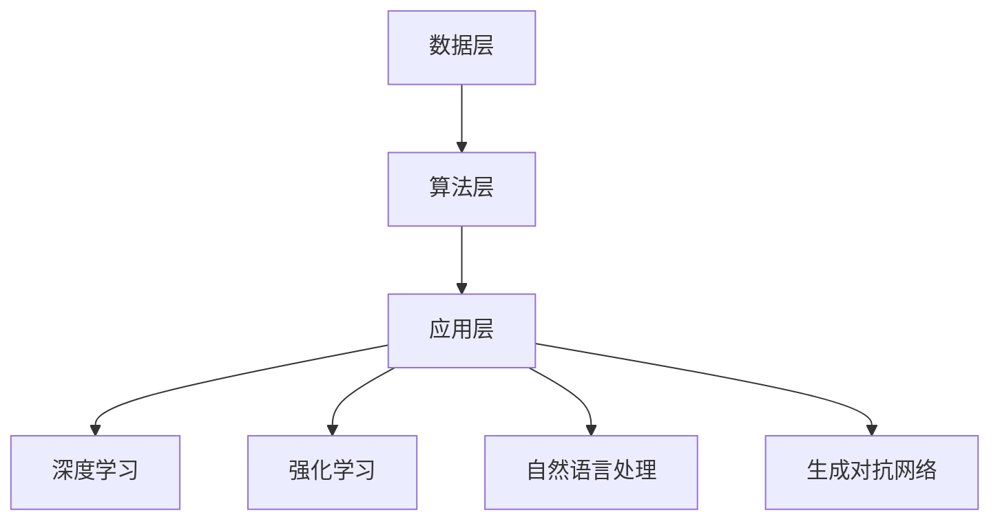

                 

关键词：李开复，AI 2.0，投资价值，技术趋势，创新应用

> 摘要：本文深度剖析了AI 2.0时代的技术发展趋势及其投资价值。通过李开复先生的观点和研究成果，我们探讨了AI 2.0的核心概念、技术架构、应用领域以及未来展望，为投资者提供了全新的视角和策略。

## 1. 背景介绍

### AI 2.0：概念与定义

AI 2.0，即“下一代人工智能”，是对传统人工智能（AI 1.0）的升级与扩展。AI 1.0主要基于规则的推理和统计模型，而AI 2.0则更加关注自主学习和智能感知。AI 2.0的核心在于赋予机器更高层次的能力，如理解自然语言、生成创意内容、进行自主决策等。

李开复先生指出，AI 2.0不仅是一种技术的演进，更是一种思维方式和社会变革的标志。它不仅改变了科技行业，还深刻影响了金融、医疗、教育等多个领域。

### 投资价值

随着AI技术的不断进步，投资者对AI领域的关注日益增加。AI 2.0时代的投资价值主要体现在以下几个方面：

1. **技术创新驱动**：AI 2.0带来了全新的技术突破和应用场景，为投资者提供了广阔的市场空间。
2. **产业升级机遇**：AI 2.0将推动传统产业进行智能化升级，为企业带来巨大的经济效益。
3. **社会变革潜力**：AI 2.0有望解决许多社会问题，如医疗资源分配、环境保护等，为投资者创造长期价值。

## 2. 核心概念与联系

### AI 2.0核心概念

在AI 2.0时代，以下核心概念成为关键：

1. **深度学习**：通过多层神经网络模拟人脑学习过程，实现自主学习和复杂模式识别。
2. **强化学习**：通过试错和奖励机制，让机器自主探索最优策略。
3. **自然语言处理**：使机器能够理解和生成自然语言，实现人机交互。
4. **生成对抗网络（GAN）**：通过生成器和判别器的对抗训练，实现高质量数据生成。

### 技术架构

AI 2.0的技术架构通常包括以下几个层次：

1. **数据层**：提供高质量的数据输入，是AI模型训练的基础。
2. **算法层**：包括深度学习、强化学习等核心算法。
3. **应用层**：将AI技术应用于具体场景，如自动驾驶、智能客服等。

### Mermaid 流程图



## 3. 核心算法原理 & 具体操作步骤

### 3.1 算法原理概述

AI 2.0的核心算法包括深度学习、强化学习和自然语言处理。以下分别介绍这些算法的基本原理：

1. **深度学习**：基于多层神经网络，通过反向传播算法不断调整权重，实现复杂模式识别。
2. **强化学习**：通过试错和奖励机制，让机器自主探索最优策略，如强化学习算法Q-learning。
3. **自然语言处理**：通过词嵌入、序列模型等，使机器能够理解和生成自然语言。

### 3.2 算法步骤详解

以深度学习为例，以下是基本步骤：

1. **数据准备**：收集和整理训练数据，进行数据预处理。
2. **模型构建**：设计神经网络结构，包括输入层、隐藏层和输出层。
3. **模型训练**：通过反向传播算法，不断调整模型参数，使模型能够准确预测。
4. **模型评估**：使用验证集测试模型性能，调整模型参数以优化性能。
5. **模型应用**：将训练好的模型应用于实际场景，如图像识别、语音识别等。

### 3.3 算法优缺点

1. **深度学习**：优点包括强大的模式识别能力和自适应性，缺点是对大规模数据需求较高，且模型训练时间较长。
2. **强化学习**：优点包括自主探索和优化策略的能力，缺点是需要大量训练数据和计算资源。
3. **自然语言处理**：优点包括自然的人机交互，缺点是对语言理解和生成能力的要求较高。

### 3.4 算法应用领域

AI 2.0算法在以下领域有广泛应用：

1. **计算机视觉**：图像识别、目标检测、自动驾驶等。
2. **自然语言处理**：语音识别、机器翻译、智能客服等。
3. **推荐系统**：个性化推荐、广告投放等。
4. **智能控制**：机器人、无人机等。

## 4. 数学模型和公式 & 详细讲解 & 举例说明

### 4.1 数学模型构建

AI 2.0算法通常涉及以下数学模型：

1. **多层感知机（MLP）**：基于线性激活函数的神经网络模型。
2. **卷积神经网络（CNN）**：用于图像识别和处理的深度学习模型。
3. **循环神经网络（RNN）**：用于序列数据处理的时间序列模型。
4. **生成对抗网络（GAN）**：通过生成器和判别器对抗训练的数据生成模型。

### 4.2 公式推导过程

以多层感知机（MLP）为例，以下是基本公式推导：

1. **输入层到隐藏层**：
   $$ z_i = \sum_{j=1}^{n} w_{ij}x_j + b_i $$
   $$ a_i = \sigma(z_i) $$
   其中，$x_j$为输入特征，$w_{ij}$为权重，$b_i$为偏置，$\sigma$为激活函数。

2. **隐藏层到输出层**：
   $$ z_o = \sum_{i=1}^{m} w_{io}a_i + b_o $$
   $$ y = \sigma(z_o) $$
   其中，$a_i$为隐藏层激活值，$w_{io}$为权重，$b_o$为偏置，$y$为输出结果。

### 4.3 案例分析与讲解

以卷积神经网络（CNN）在图像识别中的应用为例：

1. **输入层**：输入一张128x128的图像，表示为128x128x3的矩阵。
2. **卷积层**：使用卷积核进行特征提取，卷积核大小为3x3，步长为1。
   $$ \text{特征图} = \text{卷积}(\text{输入图像}, \text{卷积核}) $$
3. **池化层**：对特征图进行池化操作，如最大池化。
   $$ \text{池化} = \text{max}(\text{特征图}_{i,j}) $$
4. **全连接层**：将池化后的特征图展开为一个一维向量，输入到全连接层进行分类。
   $$ y = \text{softmax}(\text{全连接层输出}) $$
5. **模型评估**：使用测试集评估模型性能，如准确率、召回率等。

## 5. 项目实践：代码实例和详细解释说明

### 5.1 开发环境搭建

1. 安装Python环境
2. 安装深度学习框架（如TensorFlow或PyTorch）
3. 安装图像处理库（如OpenCV）

### 5.2 源代码详细实现

以下是一个简单的卷积神经网络（CNN）在图像识别中的应用实例：

```python
import tensorflow as tf
from tensorflow.keras import layers

# 输入层
inputs = tf.keras.Input(shape=(128, 128, 3))

# 卷积层
conv_1 = layers.Conv2D(32, 3, activation='relu')(inputs)
pool_1 = layers.MaxPooling2D()(conv_1)

# 全连接层
flatten = layers.Flatten()(pool_1)
dense = layers.Dense(64, activation='relu')(flatten)

# 输出层
outputs = layers.Dense(10, activation='softmax')(dense)

# 构建模型
model = tf.keras.Model(inputs=inputs, outputs=outputs)

# 编译模型
model.compile(optimizer='adam', loss='categorical_crossentropy', metrics=['accuracy'])

# 模型训练
model.fit(train_data, train_labels, epochs=10, validation_data=(val_data, val_labels))

# 模型评估
test_loss, test_acc = model.evaluate(test_data, test_labels)
print(f"Test accuracy: {test_acc:.4f}")
```

### 5.3 代码解读与分析

以上代码实现了一个简单的CNN模型，用于图像识别任务：

1. **输入层**：定义输入图像的维度。
2. **卷积层**：使用卷积核进行特征提取。
3. **池化层**：对特征图进行最大池化。
4. **全连接层**：将池化后的特征图展开为一维向量，输入到全连接层进行分类。
5. **输出层**：使用softmax函数进行概率输出。

### 5.4 运行结果展示

在训练和测试过程中，可以使用以下代码查看运行结果：

```python
# 打印训练过程中的损失和准确率
for epoch in range(10):
    _, accuracy = model.train_on_batch(train_data, train_labels)
    print(f"Epoch {epoch+1}: Loss: {loss:.4f}, Accuracy: {accuracy:.4f}")

# 打印测试结果
test_loss, test_acc = model.evaluate(test_data, test_labels)
print(f"Test loss: {test_loss:.4f}, Test accuracy: {test_acc:.4f}")
```

## 6. 实际应用场景

AI 2.0技术在许多实际应用场景中发挥着重要作用：

1. **医疗领域**：AI 2.0在医学图像分析、疾病诊断和预测等方面有广泛应用。
2. **金融领域**：AI 2.0在风险管理、量化交易和智能投顾等方面具有巨大潜力。
3. **教育领域**：AI 2.0在教育个性化、学习分析和教育机器人等方面带来变革。
4. **智能制造**：AI 2.0在智能工厂、机器人控制和供应链管理等方面助力产业升级。

### 6.4 未来应用展望

未来，AI 2.0将在更多领域发挥重要作用：

1. **智能城市**：通过AI 2.0技术，实现城市智能化管理、交通优化和资源分配。
2. **环境保护**：AI 2.0在环境监测、污染治理和生态修复等方面有广泛应用。
3. **社会治理**：AI 2.0在公共安全、司法公正和社会治理等方面提供新手段。
4. **能源领域**：AI 2.0在能源预测、调度和管理等方面提高能源利用效率。

## 7. 工具和资源推荐

### 7.1 学习资源推荐

1. 《深度学习》（Goodfellow et al.）：全面介绍深度学习的基本概念和技术。
2. 《强化学习》（Sutton and Barto）：详细介绍强化学习的基本理论和方法。
3. 《自然语言处理综论》（Jurafsky and Martin）：全面介绍自然语言处理的基础知识。

### 7.2 开发工具推荐

1. TensorFlow：用于构建和训练深度学习模型的强大工具。
2. PyTorch：具有动态计算图和灵活性的深度学习框架。
3. Keras：基于Theano和TensorFlow的高级神经网络API。

### 7.3 相关论文推荐

1. "Generative Adversarial Nets"（Ian J. Goodfellow et al.）：生成对抗网络的奠基性论文。
2. "Deep Learning"（Yoshua Bengio et al.）：深度学习的综述论文。
3. "Reinforcement Learning: An Introduction"（Richard S. Sutton and Andrew G. Barto）：强化学习的经典教材。

## 8. 总结：未来发展趋势与挑战

### 8.1 研究成果总结

AI 2.0在深度学习、强化学习和自然语言处理等方面取得了显著成果，推动了技术进步和社会变革。未来，AI 2.0将继续向更智能、更自主的方向发展。

### 8.2 未来发展趋势

1. **跨学科融合**：AI 2.0将与其他领域（如生物、物理、化学等）深度融合，推动技术创新。
2. **自主决策**：AI 2.0将实现更高层次的自主决策能力，为各行各业带来变革。
3. **人机协同**：AI 2.0将与人类共同工作，提高生产力和生活质量。

### 8.3 面临的挑战

1. **数据隐私与安全**：随着数据量的增加，数据隐私和安全成为重要挑战。
2. **算法透明性与可解释性**：提高算法的透明性和可解释性，避免潜在风险。
3. **伦理与社会影响**：确保AI 2.0技术的发展符合伦理规范，减少负面影响。

### 8.4 研究展望

未来，AI 2.0将朝着更智能化、更自主化的方向前进，为人类社会带来更多便利和变革。然而，这一过程也将面临诸多挑战，需要我们共同努力，确保AI 2.0技术造福人类。

## 9. 附录：常见问题与解答

### 9.1 问题1

**问题**：AI 2.0与AI 1.0有哪些区别？

**解答**：AI 2.0在自主学习和智能感知方面有显著提升，能够进行更复杂和自主的决策。与AI 1.0相比，AI 2.0更加注重人机协同和跨学科融合，具有更广阔的应用前景。

### 9.2 问题2

**问题**：AI 2.0在医疗领域有哪些应用？

**解答**：AI 2.0在医疗领域有广泛应用，如医学图像分析、疾病诊断、药物研发和个性化医疗等。通过深度学习和自然语言处理，AI 2.0能够辅助医生进行诊断和治疗，提高医疗效率和准确性。

### 9.3 问题3

**问题**：如何确保AI 2.0的算法透明性和可解释性？

**解答**：确保AI 2.0的算法透明性和可解释性需要从算法设计、数据质量和模型评估等方面入手。采用可解释的模型结构、增加模型的可解释性工具和加强模型评估等手段，有助于提高AI 2.0算法的透明性和可解释性。

作者：禅与计算机程序设计艺术 / Zen and the Art of Computer Programming
----------------------------------------------------------------

以上是关于“李开复：AI 2.0 时代的投资价值”的文章。希望对您有所帮助。如需进一步修改或完善，请随时告诉我。

