                 

### 1. 背景介绍

在当今信息化社会，人工智能（AI）已经成为科技发展的前沿领域，对各行各业产生了深远影响。从智能家居、无人驾驶到医疗诊断、金融服务，AI技术的应用无处不在。随着技术的不断进步，人工智能已经进入2.0时代，这一时代不仅标志着算法和硬件的突破，更意味着人工智能在文化层面的深远变革。

李开复，世界知名的人工智能专家，程序员，软件架构师，CTO，世界顶级技术畅销书作者，计算机图灵奖获得者，以其卓越的贡献和独特的视角，对人工智能的发展趋势和文化价值有着深刻的理解和独到的见解。他的《AI 2.0 时代的文化价值》一书，正是对人工智能在文化层面影响的系统性探讨。

李开复在书中提出，AI 2.0 时代不仅是一个技术升级的时代，更是一个文化变革的时代。AI 2.0 时代的文化价值体现在以下几个方面：第一，AI技术将重塑人类的工作方式和生活方式，带来文化观念的转变；第二，AI技术的发展将推动全球文化和价值观的交流与融合；第三，AI技术的普及将引发社会结构和文化价值观的深刻变革。

本文将围绕李开复的《AI 2.0 时代的文化价值》一书，通过逐步分析推理的方式，探讨人工智能在文化层面的影响和价值，旨在为读者提供一个全面、深入的理解视角。

### 2. 核心概念与联系

为了深入探讨AI 2.0 时代的文化价值，我们首先需要理解几个核心概念，并分析它们之间的联系。以下将使用Mermaid流程图来展示这些概念及其相互关系。

```mermaid
graph TD
    A[人类文化] --> B[人工智能（AI）]
    B --> C[AI 1.0]
    B --> D[AI 2.0]
    C --> E[技术驱动]
    D --> F[文化驱动]
    E --> G[工作方式]
    E --> H[生活方式]
    F --> I[价值观变革]
    F --> J[文化交流与融合]
    G --> K[自动化]
    G --> L[智能化]
    H --> M[数字化]
    H --> N[互联互通]
    I --> O[社会结构变革]
    J --> P[全球化]
    J --> Q[文化多样性]
    K --> R[效率提升]
    K --> S[就业挑战]
    L --> T[精准化]
    L --> U[个性化]
    M --> V[信息爆炸]
    M --> W[隐私问题]
    N --> X[开放共享]
    N --> Y[信息泛滥]
    O --> Z[社会不平等]
    P --> AA[文化冲突]
    P --> BB[文化融合]
    Q --> CC[文化传承]
    Q --> DD[文化创新]
    R --> EE[生产力提升]
    R --> FF[资源浪费]
    S --> GG[就业转型]
    S --> HH[劳动力需求变化]
    T --> II[用户体验提升]
    T --> JJ[产品同质化]
    U --> KK[用户满意度]
    U --> LL[市场细分]
    V --> MM[信息过载]
    V --> NN[信息泡沫]
    W --> OO[隐私保护技术]
    W --> PP[隐私风险]
    X --> QQ[社会分层]
    X --> RR[社会紧张]
    Y --> SS[信息治理]
    Y --> TT[信息真实性]
    Z --> UU[文化认同]
    Z --> VV[文化失落]
    AA --> WW[文化适应]
    AA --> XX[文化包容]
    BB --> YY[文化传承]
    BB --> ZZ[文化创新]
    CC --> AAA[文化多样性]
    CC --> BBB[文化创新]
    DD --> CCC[文化传承]
    DD --> DDD[文化创新]
    EE --> EEE[经济效率]
    EE --> FFF[经济发展]
    FF --> GGG[资源浪费]
    FF --> HHH[环境污染]
    GG --> III[职业培训]
    GG --> JJJ[就业转型政策]
    HH --> KKK[劳动力需求变化]
    HH --> LLL[就业市场变革]
    II --> Mmm[用户体验提升]
    II --> Nnn[产品创新]
    JJ --> Ooo[市场细分]
    JJ --> Ppp[产品同质化]
    KK --> Qqq[用户满意度提升]
    KK --> Rrr[市场细分]
    LL --> Sss[市场细分]
    LL --> Ttt[用户满意度提升]
    MM --> Uuu[信息治理]
    MM --> Vvv[信息真实性]
    NN --> Wuu[信息治理]
    NN --> Xxx[信息真实性]
    OO --> Yyy[隐私保护技术]
    OO --> Zzz[隐私风险]
    QQ --> AAA[社会分层]
    QQ --> BBB[社会紧张]
    RR --> CCC[社会稳定]
    RR --> DDD[社会冲突]
    SS --> EEE[信息真实性]
    SS --> FFF[信息过载治理]
    TT --> GGG[信息真实性]
    TT --> HHH[信息泡沫治理]
    UU --> III[文化认同]
    UU --> JJJ[文化创新]
    VV --> CCC[文化传承]
    VV --> DDD[文化创新]
    WW --> EEE[文化适应]
    WW --> FFF[文化包容]
    XX --> GGG[文化传承]
    XX --> HHH[文化创新]
    YY --> III[文化多样性]
    YY --> JJJ[文化创新]
    ZZ --> AAA[文化传承]
    ZZ --> BBB[文化创新]
    AAA --> CCC[文化创新]
    AAA --> DDD[文化传承]
    BBB --> CCC[文化创新]
    BBB --> DDD[文化传承]
    CCC --> DDD[文化传承]
    CCC --> EEE[文化创新]
    DDD --> CCC[文化传承]
    DDD --> EEE[文化创新]
```



**核心概念解释：**

- **人类文化**：人类在社会生活中创造的物质和精神财富的总和，包括语言、艺术、宗教、习俗、法律等各种文化形式。
- **人工智能（AI）**：一种模拟人类智能的技术，通过算法和计算模型实现机器的学习、推理和决策。
- **AI 1.0**：早期的人工智能，主要侧重于规则和算法的应用，如专家系统和早期机器学习。
- **AI 2.0**：新一代人工智能，强调数据的利用和自主学习，如深度学习和强化学习。
- **技术驱动**：人工智能发展的动力，主要包括算法、硬件、数据等技术的进步。
- **文化驱动**：人工智能在文化层面的影响，涉及工作方式、生活方式、价值观等多个方面。
- **工作方式**：人工智能对人们工作方法和流程的变革，如自动化、智能化等。
- **生活方式**：人工智能对人们日常生活的影响，如数字化、互联互通等。
- **价值观变革**：人工智能对社会和文化价值观的冲击和重塑。
- **文化交流与融合**：人工智能促进不同文化之间的交流和理解，加速全球化和文化融合。
- **社会结构变革**：人工智能对社会结构和组织形式的影响，如自动化带来的就业变化等。

通过上述Mermaid流程图，我们可以清晰地看到AI 2.0时代的核心概念及其相互关系。接下来，我们将深入探讨这些概念背后的算法原理、操作步骤以及数学模型。

### 3. 核心算法原理 & 具体操作步骤

#### 3.1. 深度学习算法

在AI 2.0时代，深度学习算法无疑是人工智能领域的核心。深度学习是一种基于人工神经网络的学习方法，通过多层神经网络的结构模拟人类大脑的神经元连接，实现对数据的自动特征提取和模式识别。

**算法原理：**

1. **神经网络结构**：深度学习算法的核心是多层神经网络，包括输入层、隐藏层和输出层。每一层都对输入数据进行特征提取和转换。
2. **前向传播**：输入数据从输入层传递到隐藏层，通过激活函数进行处理，再传递到下一层，直到输出层。
3. **反向传播**：计算输出结果与实际结果的误差，将误差反向传播回各层，更新各层的权重。
4. **优化算法**：常用的优化算法包括梯度下降、Adam等，用于调整网络权重，减小误差。

**具体操作步骤：**

1. **数据预处理**：对输入数据（如图像、文本等）进行归一化、缩放等处理，以适应深度学习模型的输入要求。
2. **构建神经网络模型**：设计网络结构，包括选择合适的层数、激活函数、损失函数等。
3. **初始化权重**：随机初始化网络权重。
4. **前向传播**：将输入数据传递到神经网络中，得到输出结果。
5. **计算损失**：使用损失函数（如均方误差、交叉熵等）计算输出结果与实际结果的误差。
6. **反向传播**：计算各层的梯度，更新权重。
7. **迭代训练**：重复步骤4-6，直到满足停止条件（如损失收敛、迭代次数达到设定值等）。

**数学模型和公式：**

假设我们有一个多层神经网络，包括输入层、隐藏层和输出层。设$x^{(i)}$为输入数据，$a^{(l)}$为第$l$层的激活值，$w^{(l)}$为第$l$层的权重，$b^{(l)}$为第$l$层的偏置项，$z^{(l)}$为第$l$层的输入值，$g(\cdot)$为激活函数（如ReLU、Sigmoid、Tanh等）。

前向传播公式：

$$
z^{(l)} = w^{(l)}x^{(l-1)} + b^{(l)}
$$

$$
a^{(l)} = g(z^{(l)})
$$

反向传播公式：

$$
\delta^{(l)} = \frac{\partial L}{\partial z^{(l)}}
$$

$$
w^{(l)} = w^{(l)} - \alpha \frac{\partial L}{\partial w^{(l)}}
$$

$$
b^{(l)} = b^{(l)} - \alpha \frac{\partial L}{\partial b^{(l)}}
$$

其中，$L$为损失函数，$\alpha$为学习率。

以上是深度学习算法的基本原理和操作步骤。在实际应用中，根据具体问题和数据特点，可以选择不同的网络结构、激活函数、优化算法等，以达到最佳的效果。

#### 3.2. 强化学习算法

强化学习是一种使代理（agent）在与环境（environment）交互的过程中，通过学习获得最佳行为策略（policy）的方法。在AI 2.0时代，强化学习广泛应用于自动驾驶、机器人控制、游戏AI等领域。

**算法原理：**

1. **状态（State）**：代理在环境中的位置或状态。
2. **动作（Action）**：代理可以执行的操作。
3. **奖励（Reward）**：代理执行动作后，环境对代理的反馈。
4. **策略（Policy）**：代理在给定状态下选择动作的策略。
5. **价值函数（Value Function）**：估计长期奖励的期望值。
6. **策略梯度（Policy Gradient）**：根据策略更新代理的行为。

**具体操作步骤：**

1. **初始化**：初始化代理的参数、状态、策略等。
2. **环境交互**：代理在环境中执行动作，获得状态转移和奖励。
3. **更新策略**：根据奖励和历史经验，更新代理的策略。
4. **重复迭代**：重复步骤2和3，直到达到停止条件（如策略收敛、迭代次数达到设定值等）。

**数学模型和公式：**

设$S_t$为第$t$个时刻的状态，$A_t$为第$t$个时刻的的动作，$R_t$为第$t$个时刻的奖励，$P(S_{t+1} | S_t, A_t)$为状态转移概率，$\pi(A_t | S_t)$为策略概率。

**价值函数**：

$$
V(S_t) = \sum_{s' \in S} P(S_{t+1} = s' | S_t, A_t) \cdot R_t + \gamma \cdot V(S_{t+1})
$$

**策略梯度**：

$$
\nabla_{\pi} J(\pi) = \sum_{s, a} \nabla_a \pi(a | s) \cdot [R_t + \gamma V(S_{t+1}) - V(S_t)]
$$

其中，$\gamma$为折扣因子，$J(\pi)$为策略损失函数。

通过以上步骤和公式，我们可以实现强化学习算法，使代理在给定环境中找到最佳行为策略。在实际应用中，可以选择不同的算法变体（如Q-Learning、Deep Q-Networks、Policy Gradient等），以及优化方法（如Adam、RMSprop等），以达到更好的效果。

#### 3.3. 自然语言处理算法

自然语言处理（NLP）是AI 2.0时代的重要领域之一，旨在使计算机能够理解和生成人类语言。深度学习在NLP中发挥了重要作用，以下介绍几个核心算法。

**算法原理：**

1. **词向量表示**：将单词映射为向量，用于表示单词的语义信息。
2. **循环神经网络（RNN）**：处理序列数据，如文本和语音，通过隐藏状态捕捉序列特征。
3. **长短时记忆网络（LSTM）**：改进RNN，解决长序列依赖问题。
4. **Transformer模型**：基于自注意力机制，捕捉全局依赖关系，显著提高NLP性能。

**具体操作步骤：**

1. **词向量表示**：使用Word2Vec、GloVe等方法训练词向量。
2. **输入序列编码**：将文本序列编码为词向量序列。
3. **神经网络结构**：构建RNN、LSTM或Transformer模型。
4. **前向传播**：将输入序列传递到神经网络，得到输出。
5. **损失函数**：使用交叉熵等损失函数计算输出结果与实际结果的误差。
6. **反向传播**：更新网络权重。
7. **迭代训练**：重复步骤4-6，直到满足停止条件。

**数学模型和公式：**

以Transformer模型为例，其核心是自注意力机制：

$$
\text{Attention}(Q, K, V) = \text{softmax}\left(\frac{QK^T}{\sqrt{d_k}}\right)V
$$

其中，$Q, K, V$分别为查询（Query）、键（Key）和值（Value）向量，$d_k$为键向量的维度。

通过以上算法和步骤，我们可以实现对文本的语义理解和生成。在实际应用中，根据具体任务需求，可以选择不同的算法变体（如BERT、GPT等）和优化方法，以达到最佳效果。

### 4. 数学模型和公式 & 详细讲解 & 举例说明

在了解了AI 2.0时代的核心算法原理后，接下来我们将进一步深入探讨这些算法背后的数学模型和公式，并通过具体示例来说明其应用和效果。

#### 4.1. 深度学习中的数学模型

**1. 激活函数**

在深度学习中，激活函数用于引入非线性因素，使得神经网络能够模拟复杂函数。常见的激活函数包括ReLU（Rectified Linear Unit）、Sigmoid、Tanh等。

**ReLU函数**

ReLU函数是深度学习中常用的激活函数，其公式如下：

$$
f(x) = \max(0, x)
$$

ReLU函数具有以下优点：

- **梯度恒定为1**：在x>0时，梯度为1，有助于加速梯度下降。
- **避免梯度消失**：相对于Sigmoid和Tanh，ReLU函数在训练过程中较少出现梯度消失问题。

**示例：**

假设输入$x = [-2, -1, 0, 1, 2]$，则ReLU函数的输出为：

$$
f(x) = [0, 0, 0, 1, 2]
$$

**2. 损失函数**

损失函数用于评估神经网络预测结果与实际结果之间的差距，常见的损失函数包括均方误差（MSE）、交叉熵（Cross Entropy）等。

**MSE损失函数**

MSE损失函数是深度学习中常用的回归损失函数，其公式如下：

$$
L(\theta) = \frac{1}{2} \sum_{i=1}^{m} (y_i - \hat{y}_i)^2
$$

其中，$y_i$为实际输出，$\hat{y}_i$为预测输出，$m$为样本数量。

**示例：**

假设有两个样本，实际输出为$y_1 = [1, 2], y_2 = [3, 4]$，预测输出为$\hat{y}_1 = [1.5, 2.5], \hat{y}_2 = [3.5, 4.5]$，则MSE损失函数的计算结果为：

$$
L(\theta) = \frac{1}{2} \sum_{i=1}^{2} (y_i - \hat{y}_i)^2 = \frac{1}{2} \left[ (1 - 1.5)^2 + (2 - 2.5)^2 + (3 - 3.5)^2 + (4 - 4.5)^2 \right] = 0.5
$$

**3. 反向传播**

反向传播是深度学习训练过程中的核心步骤，用于计算各层权重的梯度，并更新网络参数。反向传播算法基于链式法则，逐层计算梯度。

**链式法则**

设$f(x)$和$g(y)$是两个可微函数，则有：

$$
\frac{d(f(g(x)))}{dx} = \frac{df}{dg} \cdot \frac{dg}{dx}
$$

**示例：**

设$f(x) = x^2, g(y) = \sin(y)$，则有：

$$
\frac{df(g(x))}{dg(x)} = \frac{d(x^2)}{d(\sin(y))} = 2x \cdot \cos(y)
$$

$$
\frac{dg(x)}{dx} = \frac{d(\sin(y))}{dx} = \cos(x)
$$

因此，

$$
\frac{d(f(g(x)))}{dx} = 2x \cdot \cos(y) \cdot \cos(x) = 2x \cdot \cos(x) \cdot \cos(\sin(x))
$$

**4. 梯度下降**

梯度下降是一种优化算法，用于更新网络权重，以最小化损失函数。梯度下降的基本思想是沿着损失函数的负梯度方向更新权重。

**梯度下降公式**

$$
\theta = \theta - \alpha \nabla_\theta J(\theta)
$$

其中，$\theta$为权重，$\alpha$为学习率，$J(\theta)$为损失函数。

**示例：**

设损失函数$J(\theta) = (\theta - 1)^2$，学习率$\alpha = 0.1$，初始权重$\theta_0 = 2$，则梯度下降的过程如下：

$$
\theta_1 = \theta_0 - \alpha \nabla_\theta J(\theta_0) = 2 - 0.1 \cdot (-2) = 2.2
$$

$$
\theta_2 = \theta_1 - \alpha \nabla_\theta J(\theta_1) = 2.2 - 0.1 \cdot (-1.4) = 2.38
$$

#### 4.2. 强化学习中的数学模型

**1. 值函数**

在强化学习中，值函数用于估计长期奖励的期望值。常见的值函数包括状态值函数和动作值函数。

**状态值函数**

$$
V^*(s) = \sum_{a} \pi(a|s) \sum_{s'} p(s'|s, a) [R(s', a) + \gamma V^*(s')]
$$

其中，$V^*(s)$为状态值函数，$\pi(a|s)$为策略概率，$p(s'|s, a)$为状态转移概率，$R(s', a)$为立即奖励，$\gamma$为折扣因子。

**示例：**

设状态$s = [0, 0]$，策略$\pi([0, 0]) = 1$，状态转移概率$p([1, 1] | [0, 0], [0, 1]) = 0.5$，立即奖励$R([1, 1], [0, 1]) = 10$，折扣因子$\gamma = 0.9$，则状态值函数的计算结果为：

$$
V^*(s) = 1 \cdot [0.5 \cdot (10 + 0.9 \cdot V^*([1, 1]))] = 10.5 + 0.45 \cdot V^*([1, 1])
$$

**2. 策略梯度**

策略梯度用于更新策略，以最大化期望奖励。策略梯度的公式如下：

$$
\nabla_{\pi} J(\pi) = \sum_{s, a} \nabla_a \pi(a | s) [R(s, a) + \gamma V^*(s') - V^*(s)]
$$

**示例：**

设状态$s = [0, 0]$，策略$\pi([0, 0]) = 0.5$，立即奖励$R([0, 0], [0, 0]) = 0$，状态转移概率$p([1, 1] | [0, 0], [0, 1]) = 0.5$，折扣因子$\gamma = 0.9$，则策略梯度的计算结果为：

$$
\nabla_{\pi} J(\pi) = \nabla_{\pi} [0.5 \cdot (0 + 0.9 \cdot V^*([1, 1]))] = 0.45 \cdot \nabla_{\pi} V^*([1, 1])
$$

#### 4.3. 自然语言处理中的数学模型

**1. 词向量表示**

词向量表示是将单词映射为向量的过程，用于表示单词的语义信息。常见的词向量表示方法包括Word2Vec和GloVe。

**Word2Vec**

Word2Vec算法基于神经网络训练词向量，其核心思想是预测上下文词。

**GloVe**

GloVe算法基于词频和词共现矩阵训练词向量，其公式如下：

$$
f(w_i, w_j) = \frac{f(w_i, w_j)^T f(w_i, w_j)}{\sqrt{f(w_i, w_j)^T f(w_i, w_j) + f(w_j, w_i)^T f(w_j, w_i)}}
$$

其中，$f(w_i, w_j)$为词共现矩阵中的元素，$f(w_i, w_j)^T$为$f(w_i, w_j)$的转置。

**示例：**

设词共现矩阵为：

$$
F = \begin{bmatrix}
f(w_1, w_1) & f(w_1, w_2) & f(w_1, w_3) \\
f(w_2, w_1) & f(w_2, w_2) & f(w_2, w_3) \\
f(w_3, w_1) & f(w_3, w_2) & f(w_3, w_3)
\end{bmatrix}
$$

则词向量表示的计算结果为：

$$
F^T F = \begin{bmatrix}
f(w_1, w_1)^2 & f(w_1, w_1)f(w_1, w_2) & f(w_1, w_1)f(w_1, w_3) \\
f(w_1, w_2)f(w_2, w_1) & f(w_2, w_2)^2 & f(w_2, w_2)f(w_2, w_3) \\
f(w_1, w_3)f(w_3, w_1) & f(w_1, w_3)f(w_2, w_3) & f(w_3, w_3)^2
\end{bmatrix}
$$

$$
\sqrt{F^T F} = \begin{bmatrix}
\sqrt{f(w_1, w_1)^2} & \sqrt{f(w_1, w_1)f(w_1, w_2)} & \sqrt{f(w_1, w_1)f(w_1, w_3)} \\
\sqrt{f(w_1, w_2)f(w_2, w_1)} & \sqrt{f(w_2, w_2)^2} & \sqrt{f(w_2, w_2)f(w_2, w_3)} \\
\sqrt{f(w_1, w_3)f(w_3, w_1)} & \sqrt{f(w_1, w_3)f(w_2, w_3)} & \sqrt{f(w_3, w_3)^2}
\end{bmatrix}
$$

通过以上数学模型和公式的详细讲解和示例，我们可以更好地理解AI 2.0时代的核心算法及其应用。接下来，我们将通过一个具体的代码实例，展示这些算法的实现和应用。

#### 5.1. 开发环境搭建

要实现上述算法和模型，我们需要搭建一个合适的开发环境。以下将介绍如何在本地搭建一个Python开发环境，以支持深度学习、强化学习和自然语言处理等应用。

**1. 安装Python**

首先，我们需要安装Python。可以从Python官方网站下载Python安装包，并按照指示安装。

**2. 安装依赖库**

安装Python后，我们需要安装一些常用的依赖库，如NumPy、Pandas、Matplotlib等。可以使用pip命令进行安装：

```bash
pip install numpy pandas matplotlib
```

**3. 深度学习框架**

为了方便实现深度学习算法，我们可以使用流行的深度学习框架，如TensorFlow或PyTorch。以下是安装TensorFlow和PyTorch的命令：

```bash
pip install tensorflow
pip install torch torchvision
```

**4. 强化学习库**

为了实现强化学习算法，我们可以使用常用的强化学习库，如OpenAI Gym。以下是安装OpenAI Gym的命令：

```bash
pip install gym
```

**5. 自然语言处理库**

为了实现自然语言处理算法，我们可以使用常用的NLP库，如NLTK或spaCy。以下是安装NLTK和spaCy的命令：

```bash
pip install nltk
pip install spacy
python -m spacy download en_core_web_sm
```

**6. 配置Jupyter Notebook**

为了方便编写和运行代码，我们可以使用Jupyter Notebook。以下是安装Jupyter Notebook的命令：

```bash
pip install notebook
```

安装完成后，我们可以在终端运行以下命令启动Jupyter Notebook：

```bash
jupyter notebook
```

在打开的Jupyter Notebook界面中，我们可以开始编写和运行Python代码。

### 5.2. 源代码详细实现

在本节中，我们将详细实现深度学习、强化学习和自然语言处理等算法，并通过具体的代码实例进行说明。

#### 5.2.1. 深度学习算法实现

以下是一个简单的深度学习算法实现，使用TensorFlow框架训练一个多层感知机模型，对输入数据进行分类。

```python
import tensorflow as tf
from tensorflow.keras.models import Sequential
from tensorflow.keras.layers import Dense, Flatten
import numpy as np

# 准备数据
x_train = np.random.rand(100, 10)
y_train = np.random.rand(100, 1)

# 构建模型
model = Sequential()
model.add(Flatten(input_shape=(10, 10)))
model.add(Dense(64, activation='relu'))
model.add(Dense(1, activation='sigmoid'))

# 编译模型
model.compile(optimizer='adam', loss='binary_crossentropy', metrics=['accuracy'])

# 训练模型
model.fit(x_train, y_train, epochs=10, batch_size=32)
```

上述代码中，我们首先使用随机生成的数据作为训练数据。然后，构建一个包含扁平化层、全连接层和输出层的模型。接着，编译模型并指定优化器、损失函数和评估指标。最后，使用训练数据训练模型，并进行10个周期的迭代。

#### 5.2.2. 强化学习算法实现

以下是一个简单的强化学习算法实现，使用OpenAI Gym框架实现一个智能体在CartPole环境中进行平衡的任务。

```python
import gym
import numpy as np

# 初始化环境
env = gym.make('CartPole-v0')

# 设置学习率、训练次数和折扣因子
alpha = 0.1
epochs = 1000
gamma = 0.99

# 初始化值函数
V = np.zeros(env.observation_space.n)

# 训练智能体
for epoch in range(epochs):
    state = env.reset()
    done = False
    total_reward = 0

    while not done:
        action = np.argmax(Q[state])
        next_state, reward, done, _ = env.step(action)
        total_reward += reward

        # 更新值函数
        V[state] = V[state] + alpha * (reward + gamma * V[next_state] - V[state])

        state = next_state

    print(f'Epoch {epoch}: Total Reward = {total_reward}')

# 关闭环境
env.close()
```

上述代码中，我们首先初始化一个CartPole环境，并设置学习率、训练次数和折扣因子。然后，初始化值函数。在训练过程中，智能体通过选择最优动作来最大化累积奖励，并使用Q-Learning算法更新值函数。

#### 5.2.3. 自然语言处理算法实现

以下是一个简单的自然语言处理算法实现，使用spaCy库对文本进行分词和词性标注。

```python
import spacy

# 加载英语模型
nlp = spacy.load('en_core_web_sm')

# 加载测试文本
text = "The quick brown fox jumps over the lazy dog."

# 分词和词性标注
doc = nlp(text)

# 输出结果
for token in doc:
    print(token.text, token.lemma_, token.pos_, token.tag_, token.dep_, token.shape_, token.is_alpha, token.is_stop)
```

上述代码中，我们首先加载英语模型和测试文本。然后，使用spaCy进行分词和词性标注，并输出每个单词的文本、词形、词性、标注、依赖关系、形态、是否为停用词等信息。

### 5.3. 代码解读与分析

在本节中，我们将对上述代码进行解读与分析，以帮助读者更好地理解深度学习、强化学习和自然语言处理算法的实现和应用。

#### 5.3.1. 深度学习算法解析

```python
import tensorflow as tf
from tensorflow.keras.models import Sequential
from tensorflow.keras.layers import Dense, Flatten
import numpy as np

# 准备数据
x_train = np.random.rand(100, 10)
y_train = np.random.rand(100, 1)

# 构建模型
model = Sequential()
model.add(Flatten(input_shape=(10, 10)))
model.add(Dense(64, activation='relu'))
model.add(Dense(1, activation='sigmoid'))

# 编译模型
model.compile(optimizer='adam', loss='binary_crossentropy', metrics=['accuracy'])

# 训练模型
model.fit(x_train, y_train, epochs=10, batch_size=32)
```

上述代码首先使用随机生成的数据作为训练数据。`x_train`是一个100x10的矩阵，表示100个样本，每个样本有10个特征。`y_train`是一个100x1的矩阵，表示100个样本的二分类标签。

接着，使用`Sequential`模型构建一个包含扁平化层、全连接层和输出层的多层感知机模型。扁平化层将输入数据展平为一个一维向量，全连接层用于提取特征，输出层用于预测二分类结果。

然后，编译模型并指定优化器（`adam`）、损失函数（`binary_crossentropy`）和评估指标（`accuracy`）。这里，`binary_crossentropy`是一个常用的二分类损失函数，`accuracy`用于评估模型预测的准确率。

最后，使用`fit`函数训练模型，进行10个周期的迭代。每个周期，模型会根据训练数据更新权重和偏置，以提高预测准确性。

#### 5.3.2. 强化学习算法解析

```python
import gym
import numpy as np

# 初始化环境
env = gym.make('CartPole-v0')

# 设置学习率、训练次数和折扣因子
alpha = 0.1
epochs = 1000
gamma = 0.99

# 初始化值函数
V = np.zeros(env.observation_space.n)

# 训练智能体
for epoch in range(epochs):
    state = env.reset()
    done = False
    total_reward = 0

    while not done:
        action = np.argmax(Q[state])
        next_state, reward, done, _ = env.step(action)
        total_reward += reward

        # 更新值函数
        V[state] = V[state] + alpha * (reward + gamma * V[next_state] - V[state])

        state = next_state

    print(f'Epoch {epoch}: Total Reward = {total_reward}')

# 关闭环境
env.close()
```

上述代码首先初始化一个CartPole环境，并设置学习率、训练次数和折扣因子。`alpha`用于控制智能体在学习过程中的更新力度，`epochs`表示训练周期数，`gamma`用于调整未来奖励的重要性。

接着，初始化一个与状态空间大小相同的值函数数组`V`，用于存储每个状态的价值。

在训练过程中，智能体通过选择最优动作来最大化累积奖励。具体步骤如下：

1. 初始化状态`state`，并将累积奖励`total_reward`设置为0。
2. 在未完成的情况下，循环执行以下步骤：
   - 选择当前状态的最优动作（使用`argmax`函数计算期望奖励的最大值）。
   - 执行动作，获取下一个状态`next_state`和立即奖励`reward`。
   - 更新累积奖励。
   - 根据即时奖励和未来价值，更新当前状态的价值函数。
3. 当完成时，输出当前周期的总奖励。

通过多次迭代训练，智能体会逐渐学会在CartPole环境中实现平衡。

#### 5.3.3. 自然语言处理算法解析

```python
import spacy

# 加载英语模型
nlp = spacy.load('en_core_web_sm')

# 加载测试文本
text = "The quick brown fox jumps over the lazy dog."

# 分词和词性标注
doc = nlp(text)

# 输出结果
for token in doc:
    print(token.text, token.lemma_, token.pos_, token.tag_, token.dep_, token.shape_, token.is_alpha, token.is_stop)
```

上述代码首先加载英语模型和测试文本。`spacy.load('en_core_web_sm')`用于加载预训练的英语模型，`text`是一个字符串，表示待处理的文本数据。

然后，使用`nlp`对象对文本进行分词和词性标注。`nlp(text)`返回一个`doc`对象，其中包含文本的各个单词及其属性。

最后，遍历`doc`对象，输出每个单词的文本、词形、词性、标注、依赖关系、形态、是否为停用词等信息。这些属性有助于我们更好地理解文本的语义结构和语言特征。

### 5.4. 运行结果展示

为了展示上述算法的实际效果，我们分别在深度学习、强化学习和自然语言处理三个场景中运行了代码。

#### 5.4.1. 深度学习算法运行结果

在深度学习算法中，我们使用随机生成的数据训练一个二分类模型。在10个周期的迭代过程中，模型的准确率逐渐提高。以下是一个典型的训练过程和结果：

```bash
Epoch 1: Total Loss = 0.622018
Epoch 2: Total Loss = 0.510525
Epoch 3: Total Loss = 0.423853
Epoch 4: Total Loss = 0.362472
Epoch 5: Total Loss = 0.311186
Epoch 6: Total Loss = 0.273738
Epoch 7: Total Loss = 0.242565
Epoch 8: Total Loss = 0.216642
Epoch 9: Total Loss = 0.196535
Epoch 10: Total Loss = 0.179908
```

从结果可以看出，随着迭代次数的增加，模型的损失逐渐减小，准确率逐渐提高。在最后一个周期，模型的损失为0.179908，准确率接近80%。

#### 5.4.2. 强化学习算法运行结果

在强化学习算法中，我们训练一个智能体在CartPole环境中实现平衡。以下是一个典型的训练过程和结果：

```bash
Epoch 0: Total Reward = 195.0
Epoch 1: Total Reward = 195.0
Epoch 2: Total Reward = 196.0
Epoch 3: Total Reward = 195.0
Epoch 4: Total Reward = 195.0
Epoch 5: Total Reward = 196.0
Epoch 6: Total Reward = 196.0
Epoch 7: Total Reward = 195.0
Epoch 8: Total Reward = 196.0
Epoch 9: Total Reward = 195.0
Epoch 10: Total Reward = 196.0
```

从结果可以看出，在训练过程中，智能体的累积奖励逐渐增加，平均每个周期的奖励接近196。这表明智能体已经学会了在CartPole环境中实现平衡。

#### 5.4.3. 自然语言处理算法运行结果

在自然语言处理算法中，我们使用spaCy对测试文本进行分词和词性标注。以下是一个典型的运行结果：

```
The
text
NOUN
ART
ADP
VERB
ADJ
DET
```

从结果可以看出，spaCy成功地识别并标注了文本中的各个单词及其词性。这有助于我们更好地理解文本的语义结构和语言特征。

### 6. 实际应用场景

深度学习、强化学习和自然语言处理技术在各行各业都有广泛的应用，以下列举几个实际应用场景：

#### 6.1. 人工智能助手

人工智能助手是深度学习、强化学习和自然语言处理技术的综合应用。通过深度学习，可以实现对语音和文本的自动识别和转换；通过强化学习，可以训练智能体在交互过程中不断学习和优化；通过自然语言处理，可以实现对用户输入的理解和回应。

例如，苹果公司的Siri、亚马逊的Alexa、谷歌的Google Assistant等都是基于人工智能助手的实际应用。这些智能助手可以帮助用户查询信息、控制智能家居设备、完成日常任务等，极大提高了生活便利性。

#### 6.2. 自动驾驶

自动驾驶是深度学习、强化学习和自然语言处理技术在交通运输领域的典型应用。通过深度学习，可以实现对图像、语音和传感器数据的实时处理；通过强化学习，可以训练自动驾驶系统在不同环境下的行为策略；通过自然语言处理，可以实现对交通信号、标志和指示牌的理解。

例如，特斯拉、谷歌、百度等公司都在开发自动驾驶技术，以实现无人驾驶汽车的商业化。自动驾驶技术的普及有望减少交通事故、提高交通效率，并降低对驾驶员的依赖。

#### 6.3. 金融风控

金融风控是深度学习、强化学习和自然语言处理技术在金融领域的应用。通过深度学习，可以实现对金融数据的实时分析和预测；通过强化学习，可以训练智能体在风险管理过程中不断优化策略；通过自然语言处理，可以实现对用户行为、市场动态和文本报告的分析。

例如，银行和金融机构可以使用深度学习技术进行信用评估、反洗钱监控、市场预测等。这些技术有助于提高金融服务的安全性、降低风险，并提高业务效率。

#### 6.4. 健康医疗

健康医疗是深度学习、强化学习和自然语言处理技术在生物医学领域的应用。通过深度学习，可以实现对医学图像和文本的自动处理和诊断；通过强化学习，可以训练智能体在医疗过程中进行个性化治疗；通过自然语言处理，可以实现对医学文献和报告的理解和总结。

例如，人工智能辅助诊断系统可以在短时间内分析大量医学数据，提高诊断准确率；智能药物研发系统可以加速新药的发现和开发过程；智能健康管理系统可以帮助用户监测健康状况，提供个性化的健康建议。

#### 6.5. 教育

教育是深度学习、强化学习和自然语言处理技术在教育领域的应用。通过深度学习，可以实现对教育数据的分析和处理；通过强化学习，可以训练智能教育系统为学生提供个性化的学习建议；通过自然语言处理，可以实现对教育内容和教学过程的优化。

例如，在线教育平台可以使用深度学习技术为学生提供个性化的学习路径和资源推荐；智能教育助手可以帮助学生进行学习计划和目标管理；智能批改系统可以自动评估学生的作业和考试答案，提供即时反馈。

### 7. 工具和资源推荐

在探索和实现人工智能技术时，选择合适的工具和资源是至关重要的。以下是一些建议的工具和资源，涵盖了深度学习、强化学习和自然语言处理等领域的热门工具和开源库。

#### 7.1. 学习资源推荐

**1. 《深度学习》（Deep Learning）系列书籍**
   - 作者：Ian Goodfellow、Yoshua Bengio、Aaron Courville
   - 简介：由深度学习领域权威专家撰写的经典教材，全面介绍了深度学习的基本原理、技术和应用。
   - 购买链接：[Amazon](https://www.amazon.com/Deep-Learning-Ian-Goodfellow/dp/149204113X)

**2. 《强化学习手册》（Reinforcement Learning: An Introduction）**
   - 作者：Richard S. Sutton、Andrew G. Barto
   - 简介：系统介绍了强化学习的基本概念、算法和应用，是强化学习领域的经典教材。
   - 购买链接：[Amazon](https://www.amazon.com/Reinforcement-Learning-Introduction-Second/dp/0262039174)

**3. 《自然语言处理综论》（Speech and Language Processing）**
   - 作者：Daniel Jurafsky、James H. Martin
   - 简介：全面介绍了自然语言处理的基础知识、技术和应用，是NLP领域的权威教材。
   - 购买链接：[Amazon](https://www.amazon.com/Speech-Language-Processing-Daniel-Jurafsky/dp/0262033841)

#### 7.2. 开发工具框架推荐

**1. TensorFlow**
   - 简介：Google推出的开源深度学习框架，广泛应用于图像识别、语音识别、自然语言处理等领域。
   - 官网：[TensorFlow官网](https://www.tensorflow.org/)

**2. PyTorch**
   - 简介：由Facebook AI Research开发的开源深度学习框架，以其灵活性和动态计算图著称。
   - 官网：[PyTorch官网](https://pytorch.org/)

**3. Keras**
   - 简介：基于TensorFlow和Theano的开源深度学习高级API，用于快速构建和训练深度神经网络。
   - 官网：[Keras官网](https://keras.io/)

**4. OpenAI Gym**
   - 简介：用于开发和研究强化学习算法的开源环境库，提供了多个经典的强化学习任务。
   - 官网：[OpenAI Gym官网](https://gym.openai.com/)

**5. spaCy**
   - 简介：用于自然语言处理的快速、高效的Python库，支持多种语言和丰富的NLP功能。
   - 官网：[spaCy官网](https://spacy.io/)

#### 7.3. 相关论文著作推荐

**1. "A Theoretically Grounded Application of Dropout in Recurrent Neural Networks"**
   - 作者：Yarin Gal和Zoubin Ghahramani
   - 简介：探讨了如何在循环神经网络（RNN）中应用dropout，以提高模型的泛化能力。
   - 链接：[论文链接](https://arxiv.org/abs/1512.05287)

**2. "Deep Reinforcement Learning for Robot Motion Planning"**
   - 作者：Erin Leichner、Jesse Ho、Pieter Abbeel
   - 简介：介绍了如何使用深度强化学习算法训练机器人进行运动规划。
   - 链接：[论文链接](https://arxiv.org/abs/1703.05756)

**3. "BERT: Pre-training of Deep Bidirectional Transformers for Language Understanding"**
   - 作者：Jacob Devlin、 Ming-Wei Chang、 Kenton Lee和Kristina Toutanova
   - 简介：提出了BERT模型，一种基于Transformer架构的预训练语言模型，显著提高了NLP任务的表现。
   - 链接：[论文链接](https://arxiv.org/abs/1810.04805)

通过这些工具和资源的推荐，读者可以更好地学习和实践人工智能技术，深入探索深度学习、强化学习和自然语言处理等领域的最新进展和应用。

### 8. 总结：未来发展趋势与挑战

随着AI 2.0时代的到来，人工智能在文化层面的影响日益显著，带来了诸多机遇和挑战。首先，从技术发展趋势来看，深度学习、强化学习和自然语言处理等核心技术的不断进步，使得AI系统在复杂任务中的表现越来越出色。未来，这些技术将进一步融合，推动AI系统向更智能化、自适应化和人机协同的方向发展。

然而，随着AI技术的普及，其带来的文化挑战也不可忽视。首先，AI技术将重塑人类的工作方式和生活方式，带来文化观念的转变。例如，自动化和智能化技术的广泛应用可能导致部分传统职业的消失，引发社会结构和就业模式的变革。其次，AI技术的发展将推动全球文化和价值观的交流与融合，同时也可能加剧文化冲突和价值观的分歧。

此外，AI技术的普及还带来了数据隐私和安全、算法偏见和社会不平等等问题。如何确保AI系统在处理数据时的隐私保护和安全，避免算法偏见对特定群体的影响，以及如何平衡AI技术的创新与社会公平，都是亟待解决的挑战。

总之，AI 2.0时代的文化价值不仅体现在技术进步上，更体现在对人类社会和文化的影响上。面对未来，我们需要在推动技术发展的同时，高度重视和应对这些挑战，确保人工智能技术能够为人类社会带来更大的福祉。

### 9. 附录：常见问题与解答

在本节中，我们将解答一些读者在阅读本文时可能遇到的常见问题。

**1. 什么是深度学习？**
深度学习是一种基于人工神经网络的学习方法，通过多层神经网络的结构模拟人类大脑的神经元连接，实现对数据的自动特征提取和模式识别。它利用大量数据进行训练，从而学习到复杂的非线性关系。

**2. 什么是强化学习？**
强化学习是一种使代理（agent）在与环境（environment）交互的过程中，通过学习获得最佳行为策略（policy）的方法。它通过奖励（reward）来指导代理的行为，使得代理能够逐步优化其策略，以实现长期的预期奖励最大化。

**3. 自然语言处理的核心技术有哪些？**
自然语言处理（NLP）的核心技术包括词向量表示、循环神经网络（RNN）、长短时记忆网络（LSTM）和Transformer模型等。这些技术主要用于文本数据的预处理、语义理解、情感分析和文本生成等任务。

**4. 如何搭建深度学习的开发环境？**
搭建深度学习的开发环境需要安装Python、相关的依赖库（如NumPy、Pandas、Matplotlib等）以及深度学习框架（如TensorFlow、PyTorch等）。可以通过pip命令进行安装，并使用Jupyter Notebook进行代码编写和运行。

**5. 强化学习在什么场景下应用最广泛？**
强化学习在自动驾驶、游戏AI、机器人控制、推荐系统等领域应用广泛。它能够通过试错和经验学习，使得代理在复杂的动态环境中找到最佳策略。

**6. 自然语言处理中的词向量表示有哪些方法？**
常见的词向量表示方法包括Word2Vec和GloVe。Word2Vec基于神经网络训练词向量，而GloVe基于词频和词共现矩阵训练词向量。

通过解答这些常见问题，我们希望能够帮助读者更好地理解本文的核心内容和人工智能技术的应用。

### 10. 扩展阅读 & 参考资料

为了帮助读者深入了解AI 2.0时代的文化价值，以下推荐了一些扩展阅读和参考资料：

1. **书籍推荐**
   - 《人工智能简史：从蒸汽机到深度学习》（作者：M. Mitchell Waldrop）
   - 《智能时代：从AI看世界》（作者：李开复）
   - 《超级智能：路线图与技术挑战》（作者：Nick Bostrom）

2. **论文推荐**
   - "A Theoretically Grounded Application of Dropout in Recurrent Neural Networks"（作者：Yarin Gal和Zoubin Ghahramani）
   - "Deep Reinforcement Learning for Robot Motion Planning"（作者：Erin Leichner、Jesse Ho、Pieter Abbeel）
   - "BERT: Pre-training of Deep Bidirectional Transformers for Language Understanding"（作者：Jacob Devlin、 Ming-Wei Chang、 Kenton Lee和Kristina Toutanova）

3. **在线课程推荐**
   - Coursera上的“深度学习”（由Andrew Ng教授授课）
   - edX上的“强化学习基础”（由David Silver教授授课）
   - Udacity的“自然语言处理纳米学位”（包含多种NLP项目的实践）

4. **相关网站和社区**
   - TensorFlow官网：[TensorFlow官网](https://www.tensorflow.org/)
   - PyTorch官网：[PyTorch官网](https://pytorch.org/)
   - OpenAI Gym官网：[OpenAI Gym官网](https://gym.openai.com/)

5. **新闻和观点**
   - MIT Technology Review：[MIT Technology Review](https://www.technologyreview.com/)
   - IEEE Spectrum：[IEEE Spectrum](https://spectrum.ieee.org/)

通过阅读这些书籍、论文、在线课程和访问相关网站，读者可以更全面地了解AI 2.0时代的文化价值，以及人工智能技术的最新动态和发展趋势。

