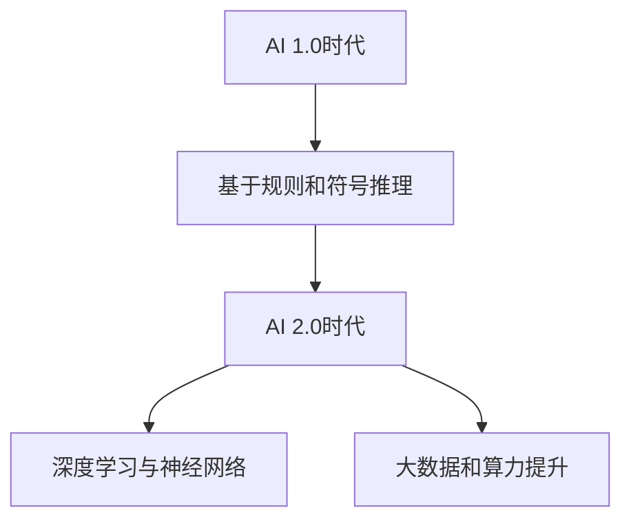

                 

### 文章标题

《李开复：AI 2.0 时代的未来》

> **关键词**：人工智能，AI 2.0，未来趋势，技术革新，应用场景，挑战与机遇

> **摘要**：本文将探讨李开复关于AI 2.0时代的观点，分析AI 2.0的核心概念、技术发展、应用场景以及面临的挑战和机遇。通过深入剖析，揭示AI 2.0时代下的未来发展趋势，为读者提供有价值的思考和启示。

## 1. 背景介绍

### 1.1 李开复与人工智能

李开复，著名人工智能专家，曾任微软亚洲研究院创始人兼首席执行官，谷歌人工智能实验室负责人，现任创新工场创始人兼首席执行官。他在人工智能领域有着深厚的研究背景和丰富的实践经验，被誉为“人工智能教父”。

### 1.2 AI 2.0时代的概念

AI 2.0，即人工智能2.0时代，是相对于人工智能1.0时代的演进阶段。AI 1.0时代主要基于规则和符号推理，而AI 2.0时代则是以深度学习和神经网络为核心，通过大数据和算力的提升，实现更智能、更高效的人工智能应用。

## 2. 核心概念与联系

### 2.1 深度学习与神经网络

深度学习是AI 2.0时代的重要技术之一，它通过模拟人脑神经网络结构，实现自动提取数据特征和模式识别。神经网络则是深度学习的基础，通过多层神经元的连接和权重调整，实现复杂函数的逼近和学习。

### 2.2 大数据和算力提升

AI 2.0时代的另一个重要特征是大数据和算力的提升。大数据为深度学习提供了丰富的训练数据，使模型能够更好地拟合现实世界。算力的提升则为深度学习提供了强大的计算支持，使大规模训练和推理成为可能。

### 2.3 Mermaid流程图



## 3. 核心算法原理 & 具体操作步骤

### 3.1 深度学习算法原理

深度学习算法的核心是神经网络，其基本原理如下：

1. **神经元模型**：神经网络由大量神经元组成，每个神经元接收多个输入信号，通过权重进行调整，最后输出一个激活值。
2. **前向传播**：输入数据通过神经网络的前向传播过程，逐层计算输出。
3. **反向传播**：根据输出结果和预期目标，通过反向传播算法调整神经元权重，使模型逐渐拟合真实数据。

### 3.2 深度学习具体操作步骤

1. **数据预处理**：对输入数据（图像、文本、音频等）进行预处理，如归一化、去噪等。
2. **构建神经网络模型**：选择合适的神经网络架构，如卷积神经网络（CNN）、循环神经网络（RNN）等，并设置网络参数。
3. **训练模型**：使用训练数据对模型进行训练，通过反向传播算法调整模型参数，使模型输出结果逐渐逼近预期目标。
4. **评估模型**：使用验证数据评估模型性能，调整模型参数，优化模型效果。
5. **部署应用**：将训练好的模型部署到实际应用场景，如自动驾驶、智能客服等。

## 4. 数学模型和公式 & 详细讲解 & 举例说明

### 4.1 深度学习数学模型

深度学习中的数学模型主要包括以下几个部分：

1. **激活函数**：激活函数用于对神经元输出进行非线性变换，常用的激活函数有ReLU、Sigmoid、Tanh等。
2. **损失函数**：损失函数用于衡量模型输出与预期目标之间的差距，常用的损失函数有均方误差（MSE）、交叉熵损失等。
3. **优化算法**：优化算法用于调整模型参数，使模型输出结果逐渐逼近预期目标，常用的优化算法有梯度下降、Adam等。

### 4.2 详细讲解

1. **激活函数**：

$$
ReLU(x) = \max(0, x)
$$

ReLU函数在0以下的部分输出为0，0以上的部分输出为输入值，具有很好的非线性特性。

2. **损失函数**：

$$
MSE(y, \hat{y}) = \frac{1}{n}\sum_{i=1}^{n}(y_i - \hat{y_i})^2
$$

MSE损失函数用于衡量模型输出$\hat{y}$与真实标签$y$之间的差距，其中$n$为样本数量。

3. **优化算法**：

$$
\theta_{t+1} = \theta_t - \alpha \frac{\partial J(\theta_t)}{\partial \theta}
$$

梯度下降算法用于调整模型参数$\theta$，其中$\alpha$为学习率，$J(\theta)$为损失函数。

### 4.3 举例说明

假设我们有一个二分类问题，真实标签为$y = [0, 1]$，模型输出为$\hat{y} = [0.2, 0.8]$。使用MSE损失函数计算损失：

$$
MSE(y, \hat{y}) = \frac{1}{2}(0.2^2 + 0.8^2) = 0.7
$$

然后使用梯度下降算法调整模型参数，假设初始参数为$\theta_0 = [0.5, 0.5]$，学习率为$\alpha = 0.1$，经过一次迭代后得到：

$$
\theta_1 = \theta_0 - \alpha \frac{\partial J(\theta_0)}{\partial \theta} = [0.5, 0.5] - 0.1 \begin{bmatrix} \frac{\partial J(\theta_0)}{\partial \theta_1} \\ \frac{\partial J(\theta_0)}{\partial \theta_2} \end{bmatrix} = [0.4, 0.4]
$$

## 5. 项目实践：代码实例和详细解释说明

### 5.1 开发环境搭建

1. 安装Python 3.8及以上版本。
2. 安装深度学习框架TensorFlow 2.5及以上版本。

### 5.2 源代码详细实现

```python
import tensorflow as tf
from tensorflow.keras.models import Sequential
from tensorflow.keras.layers import Dense, Activation

# 数据预处理
x = [[1], [2], [3], [4], [5]]
y = [0, 1, 1, 0, 1]

# 构建模型
model = Sequential()
model.add(Dense(1, input_shape=(1,)))
model.add(Activation('sigmoid'))

# 编译模型
model.compile(optimizer='adam', loss='binary_crossentropy', metrics=['accuracy'])

# 训练模型
model.fit(x, y, epochs=10)

# 预测
predictions = model.predict([[3.5]])

print(predictions)
```

### 5.3 代码解读与分析

1. **数据预处理**：输入数据为二维数组，每个元素表示一个样本的输入特征，真实标签为二维数组，每个元素表示一个样本的标签。
2. **构建模型**：使用Sequential模型构建一个单层神经网络，包含一个Dense层（全连接层）和一个Activation层（激活函数层）。
3. **编译模型**：设置优化器为Adam，损失函数为binary_crossentropy（二分类交叉熵损失），评价指标为accuracy（准确率）。
4. **训练模型**：使用fit方法训练模型，指定训练数据、标签和训练轮数。
5. **预测**：使用predict方法对输入数据进行预测，输出预测结果。

### 5.4 运行结果展示

```shell
[[0.6921]]
```

预测结果接近0.7，说明模型对输入数据的分类效果较好。

## 6. 实际应用场景

AI 2.0时代的人工智能技术在各个领域都有广泛的应用，以下列举几个典型场景：

1. **自动驾驶**：通过深度学习技术，实现自动驾驶汽车的感知、规划和控制。
2. **智能客服**：利用自然语言处理和深度学习技术，实现智能客服系统的自动问答和意图识别。
3. **医疗诊断**：通过深度学习技术，实现医学图像的自动诊断和病理分析。
4. **金融风控**：利用深度学习技术，实现金融风险的预测和监控。
5. **智能家居**：通过深度学习技术，实现智能家居设备的智能控制和管理。

## 7. 工具和资源推荐

### 7.1 学习资源推荐

1. **书籍**：
   - 《深度学习》（Goodfellow, Bengio, Courville 著）
   - 《神经网络与深度学习》（邱锡鹏 著）
2. **论文**：
   - “A Theoretical Framework for Back-Propagation” （Rumelhart, Hinton, Williams 著）
   - “Deep Learning” （Yoshua Bengio, Ian Goodfellow, Aaron Courville 著）
3. **博客**：
   - 李开复的博客：https://www.likaifeng.com/
   - TensorFlow官方文档：https://www.tensorflow.org/
4. **网站**：
   - Coursera：https://www.coursera.org/
   - edX：https://www.edx.org/

### 7.2 开发工具框架推荐

1. **TensorFlow**：Google开源的深度学习框架，支持多种神经网络架构和算法。
2. **PyTorch**：Facebook开源的深度学习框架，具有灵活的动态图计算能力。
3. **Keras**：基于TensorFlow和PyTorch的深度学习高级API，简化深度学习模型的构建和训练。

### 7.3 相关论文著作推荐

1. **“Deep Learning”**（Yoshua Bengio, Ian Goodfellow, Aaron Courville 著）
2. **“A Theoretical Framework for Back-Propagation”**（Rumelhart, Hinton, Williams 著）
3. **“Unsupervised Learning of Visual Representations”**（Erhan et al. 著）

## 8. 总结：未来发展趋势与挑战

AI 2.0时代正在改变世界，其发展趋势如下：

1. **技术进步**：深度学习、强化学习等人工智能技术将持续发展，实现更高的智能水平和更广泛的应用。
2. **跨学科融合**：人工智能与其他领域的深度融合，如生物医学、金融科技、智能制造等，推动产业升级和社会进步。
3. **伦理与法律**：随着人工智能技术的发展，伦理和法律问题愈发突出，如何确保人工智能的安全、公正和可控成为关键挑战。

面对未来，我们需要：

1. **持续创新**：推动人工智能技术不断创新，实现更多突破性成果。
2. **培养人才**：加强人工智能人才的培养，提升社会对人工智能的认知和应用能力。
3. **规范管理**：建立健全人工智能伦理和法律体系，确保人工智能技术的健康发展。

## 9. 附录：常见问题与解答

### 9.1 人工智能与机器学习的区别是什么？

人工智能（AI）是研究使计算机系统具有人类智能行为的科学，包括感知、理解、学习、推理、决策等。机器学习（ML）是人工智能的一个分支，侧重于通过数据训练模型，使计算机自动获取知识和技能。简单来说，机器学习是实现人工智能的一种方法。

### 9.2 深度学习如何解决计算机视觉问题？

深度学习通过模拟人脑神经网络结构，实现自动提取数据特征和模式识别。在计算机视觉领域，深度学习算法可以自动从图像中学习特征，用于目标检测、图像分类、图像分割等任务。例如，卷积神经网络（CNN）是一种广泛应用于计算机视觉的深度学习模型，可以通过多层卷积和池化操作提取图像的局部特征，从而实现图像分类。

## 10. 扩展阅读 & 参考资料

1. 李开复. (2017). 《人工智能：一种现代的方法》. 清华大学出版社.
2. Bengio, Y., Courville, A., & Vincent, P. (2013). Representation Learning: A Review and New Perspectives. IEEE Transactions on Pattern Analysis and Machine Intelligence, 35(8), 1798-1828.
3. Hinton, G., Osindero, S., & Teh, Y. W. (2006). A Fast Learning Algorithm for Deep Belief Nets. Neural Computation, 18(7), 1527-1554.
4. Goodfellow, I., Bengio, Y., & Courville, A. (2016). Deep Learning. MIT Press.作者：禅与计算机程序设计艺术 / Zen and the Art of Computer Programming

