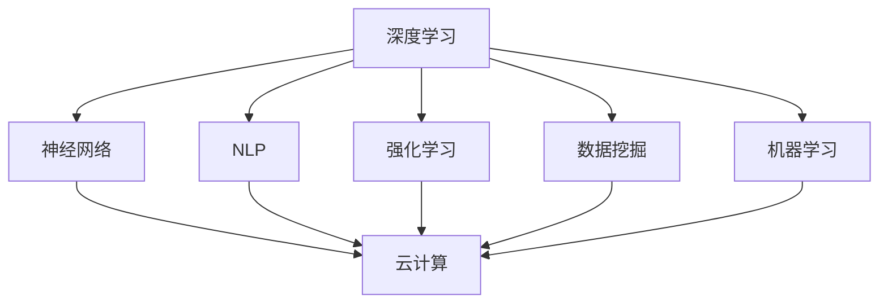

                 

### 1. 背景介绍

在当今的世界中，人工智能（AI）已经成为了一个不可或缺的技术领域，它不仅改变了我们的生活方式，还深刻地影响了各行各业的发展。随着深度学习、神经网络、自然语言处理等技术的迅猛发展，人工智能正以前所未有的速度向前推进，开启了一个崭新的AI 2.0时代。

AI 1.0时代主要依赖于基于规则的系统，这些系统能够完成一些简单的任务，如语音识别、图像识别等。然而，随着计算能力的提升和数据量的爆炸性增长，AI 2.0时代迎来了一个重大的转变——从规则驱动的系统向数据驱动的系统的转变。这一转变使得人工智能具备了更强大的学习能力和自适应能力，能够在没有人类干预的情况下完成复杂的任务。

在AI 2.0时代，我们看到了一些令人瞩目的应用案例，如自动驾驶汽车、智能家居、智能医疗等。这些应用不仅提升了我们的生活质量，还为企业带来了巨大的经济效益。然而，随着人工智能技术的不断成熟，我们也面临着一系列挑战，如数据隐私、算法偏见、安全风险等。

本文将深入探讨AI 2.0时代的生态，从核心概念、核心算法、数学模型、项目实践、应用场景、未来发展趋势与挑战等多个角度，全面解析这一领域的现状和未来。希望通过本文的阐述，能帮助读者更好地理解和把握AI 2.0时代的发展脉络，为未来的科技创新提供有益的参考。

### 2. 核心概念与联系

在深入探讨AI 2.0时代的生态之前，我们需要了解一些核心概念，这些概念构成了AI 2.0时代的技术基石。以下是本文将要介绍的核心概念及其相互联系：

#### 深度学习（Deep Learning）

深度学习是人工智能领域中一个重要的分支，它通过构建多层神经网络来模拟人类大脑的学习过程。深度学习在图像识别、语音识别、自然语言处理等领域取得了显著的成果。与传统的机器学习方法相比，深度学习具有更强的自适应能力和泛化能力。

#### 神经网络（Neural Networks）

神经网络是深度学习的基础，它由一系列的神经元组成，这些神经元通过权重连接在一起。神经网络通过学习输入和输出之间的映射关系，实现对数据的分类、回归等操作。神经网络的结构和参数调整对于模型的性能至关重要。

#### 自然语言处理（Natural Language Processing, NLP）

自然语言处理是人工智能的一个重要应用领域，它涉及到对自然语言的自动理解和生成。NLP技术广泛应用于机器翻译、情感分析、语音助手等场景。NLP的成功离不开深度学习技术的支持。

#### 强化学习（Reinforcement Learning）

强化学习是一种通过试错和反馈来学习如何做出决策的机器学习方法。强化学习在自动驾驶、游戏AI等领域展现出了强大的潜力。它通过不断优化策略，使智能体能够在复杂的环境中实现最优行为。

#### 数据挖掘（Data Mining）

数据挖掘是一种从大量数据中发现有价值信息的方法，它广泛应用于商业智能、金融分析、医疗诊断等领域。数据挖掘技术依赖于机器学习和统计分析等方法，帮助企业和组织从海量数据中提取知识。

#### 机器学习（Machine Learning）

机器学习是一种让计算机通过数据自动学习和改进的技术，它包括监督学习、无监督学习、半监督学习和强化学习等多种方法。机器学习是人工智能的核心技术之一，它使得计算机能够完成以前需要人类才能完成的任务。

#### 云计算（Cloud Computing）

云计算是一种通过网络提供计算资源的服务模式，它使得企业和个人能够以按需、灵活的方式使用计算资源。云计算与人工智能的结合，为大规模数据处理和模型训练提供了基础设施支持。

#### 梅尔图流程图（Mermaid Flowchart）

以下是一个梅尔图流程图，展示了上述核心概念之间的联系：



通过这个流程图，我们可以清晰地看到深度学习、神经网络、NLP、强化学习、数据挖掘和机器学习是如何相互联系、共同推动AI 2.0时代的发展的。同时，云计算作为基础设施，为这些核心概念提供了强大的支持。

### 3. 核心算法原理 & 具体操作步骤

在AI 2.0时代，核心算法的原理和具体操作步骤是理解和应用这些技术的基础。以下将详细介绍一些关键算法的原理和操作步骤，包括深度学习、神经网络、自然语言处理、强化学习等。

#### 深度学习原理

深度学习的核心是多层神经网络，它通过模拟人脑的神经元结构，实现数据的特征提取和分类。以下是深度学习的基本原理和操作步骤：

1. **数据预处理**：对输入数据进行标准化、归一化等处理，使其适合神经网络训练。
2. **网络架构设计**：设计神经网络的层数、每层的神经元数量以及神经元之间的连接方式。
3. **损失函数选择**：选择合适的损失函数，如交叉熵损失函数，用于衡量预测值与真实值之间的差距。
4. **反向传播**：通过反向传播算法，计算每个神经元的误差，并更新网络的权重和偏置。
5. **优化算法**：选择优化算法，如随机梯度下降（SGD），用于调整网络参数，降低损失函数值。

#### 神经网络操作步骤

神经网络的操作步骤主要包括以下几步：

1. **初始化参数**：随机初始化网络的权重和偏置。
2. **前向传播**：计算输入数据的输出值，通过神经元之间的连接进行信息传递。
3. **激活函数应用**：在每层神经元之间应用激活函数，如ReLU、Sigmoid、Tanh等，以引入非线性特性。
4. **计算损失**：使用损失函数计算预测值与真实值之间的差距。
5. **反向传播**：通过反向传播算法，更新网络参数。
6. **迭代优化**：重复上述步骤，直到网络参数达到预定的优化目标。

#### 自然语言处理操作步骤

自然语言处理通常包括以下操作步骤：

1. **文本预处理**：对文本数据进行分词、去停用词、词性标注等预处理操作。
2. **词嵌入**：将词汇映射为固定长度的向量表示，如Word2Vec、GloVe等。
3. **编码器-解码器架构**：使用编码器-解码器（Encoder-Decoder）架构，将输入文本编码为固定长度的序列表示，并解码为输出文本。
4. **注意力机制**：在解码过程中引入注意力机制，使得模型能够关注输入文本中的重要信息。
5. **损失函数计算**：使用交叉熵损失函数计算输出文本的预测概率，并更新模型参数。

#### 强化学习操作步骤

强化学习通常包括以下操作步骤：

1. **环境定义**：定义智能体所处的环境，包括状态空间、动作空间和奖励机制。
2. **状态-动作价值函数学习**：使用价值函数或策略网络，学习智能体在不同状态下的最佳动作。
3. **策略迭代**：通过策略迭代方法，不断更新智能体的策略，使其在复杂环境中做出最优决策。
4. **策略评估**：评估当前策略的预期收益，以确定是否需要调整策略。
5. **策略优化**：使用优化算法，如Q-learning、SARSA等，更新策略网络参数，提高策略的准确性。

通过上述核心算法原理和操作步骤的介绍，我们可以看到AI 2.0时代的技术基础是如何通过复杂的数学模型和计算方法实现的。这些算法不仅推动了人工智能技术的发展，还为各种应用场景提供了强大的支持。

### 4. 数学模型和公式 & 详细讲解 & 举例说明

在AI 2.0时代，数学模型和公式是核心算法的基础，它们决定了人工智能系统的性能和效果。以下将详细讲解一些关键的数学模型和公式，并通过举例说明它们的应用。

#### 4.1 深度学习中的前向传播和反向传播算法

深度学习中的前向传播和反向传播算法是训练神经网络的两个关键步骤。

**前向传播算法**：

1. **输入数据**：给定输入数据\( x \)。
2. **计算激活值**：通过网络的权重\( W \)和偏置\( b \)，计算每个神经元的激活值。
   $$ z = Wx + b $$
   其中，\( z \)是每个神经元的输入值。
3. **应用激活函数**：对激活值应用非线性激活函数\( \sigma \)。
   $$ a = \sigma(z) $$
   其中，\( a \)是每个神经元的输出值。
4. **输出预测**：最后，通过输出层的激活值得到预测结果。

**反向传播算法**：

1. **计算损失**：使用损失函数计算预测值与真实值之间的差距。
   $$ L = \frac{1}{2} \sum (y - \hat{y})^2 $$
   其中，\( y \)是真实值，\( \hat{y} \)是预测值。
2. **计算误差**：计算每个神经元的误差。
   $$ \delta = \frac{\partial L}{\partial z} \cdot \sigma'(z) $$
   其中，\( \sigma' \)是激活函数的导数。
3. **更新权重和偏置**：通过梯度下降方法更新网络的权重和偏置。
   $$ W_{new} = W_{old} - \alpha \cdot \frac{\partial L}{\partial W} $$
   $$ b_{new} = b_{old} - \alpha \cdot \frac{\partial L}{\partial b} $$
   其中，\( \alpha \)是学习率。

**举例说明**：

假设我们有一个简单的神经网络，包含一个输入层、一个隐藏层和一个输出层。输入层有一个神经元，隐藏层有两个神经元，输出层有一个神经元。激活函数使用ReLU函数。给定一个输入\( x = [1, 0] \)，真实标签\( y = [1] \)。

- **前向传播**：

  输入层到隐藏层的权重\( W_{11} = 1 \)，\( W_{12} = 2 \)，偏置\( b_{1} = 0 \)。

  $$ z_1 = W_{11} \cdot x + b_1 = 1 \cdot 1 + 0 = 1 $$
  $$ a_1 = \sigma(z_1) = \max(z_1, 0) = 1 $$

  隐藏层到输出层的权重\( W_{21} = 1 \)，\( W_{22} = 2 \)，偏置\( b_{2} = 0 \)。

  $$ z_2 = W_{21} \cdot a_1 + W_{22} \cdot a_2 + b_2 = 1 \cdot 1 + 2 \cdot 0 + 0 = 1 $$
  $$ a_2 = \sigma(z_2) = \max(z_2, 0) = 1 $$

  输出层的预测值\( \hat{y} = a_2 = 1 \)。

- **反向传播**：

  预测值与真实值之间的差距\( L = (y - \hat{y})^2 = (1 - 1)^2 = 0 \)。

  输出层的误差\( \delta = \frac{\partial L}{\partial z_2} \cdot \sigma'(z_2) = 0 \cdot 1 = 0 \)。

  隐藏层的误差\( \delta_1 = \frac{\partial L}{\partial z_1} \cdot \sigma'(z_1) = 0 \cdot 0 = 0 \)。

  更新权重和偏置：

  $$ W_{21}_{new} = W_{21}_{old} - \alpha \cdot \frac{\partial L}{\partial W_{21}} = 1 - 0.1 \cdot 0 = 1 $$
  $$ W_{22}_{new} = W_{22}_{old} - \alpha \cdot \frac{\partial L}{\partial W_{22}} = 2 - 0.1 \cdot 0 = 2 $$
  $$ b_{2}_{new} = b_{2}_{old} - \alpha \cdot \frac{\partial L}{\partial b_{2}} = 0 - 0.1 \cdot 0 = 0 $$

  $$ W_{11}_{new} = W_{11}_{old} - \alpha \cdot \frac{\partial L}{\partial W_{11}} = 1 - 0.1 \cdot 0 = 1 $$
  $$ b_{1}_{new} = b_{1}_{old} - \alpha \cdot \frac{\partial L}{\partial b_{1}} = 0 - 0.1 \cdot 0 = 0 $$

#### 4.2 自然语言处理中的词嵌入

词嵌入是将词汇映射为固定长度的向量表示。以下是一个简单的词嵌入模型：

1. **初始化参数**：初始化词向量矩阵\( V \)，其中每个词汇对应一个向量。
2. **计算词向量**：给定输入文本\( x \)，计算每个词汇的词向量。
   $$ v_i = V \cdot x $$
   其中，\( v_i \)是词汇\( i \)的词向量。

**举例说明**：

假设我们有一个词汇表，包含词汇“hello”和“world”，词向量矩阵为：
$$ V = \begin{bmatrix} 1 & 2 \\ 3 & 4 \end{bmatrix} $$
输入文本“hello world”对应的词向量计算为：
$$ v_{hello} = V \cdot [1, 0] = \begin{bmatrix} 1 & 2 \\ 3 & 4 \end{bmatrix} \cdot \begin{bmatrix} 1 \\ 0 \end{bmatrix} = \begin{bmatrix} 1 \\ 3 \end{bmatrix} $$
$$ v_{world} = V \cdot [0, 1] = \begin{bmatrix} 1 & 2 \\ 3 & 4 \end{bmatrix} \cdot \begin{bmatrix} 0 \\ 1 \end{bmatrix} = \begin{bmatrix} 2 \\ 4 \end{bmatrix} $$

#### 4.3 强化学习中的Q-learning算法

Q-learning算法是一种基于值函数的强化学习算法，用于学习最优策略。

1. **初始化参数**：初始化Q值矩阵\( Q \)，其中每个状态-动作对对应一个Q值。
2. **更新Q值**：根据当前状态、动作、奖励和下一个状态更新Q值。
   $$ Q(s, a) \leftarrow Q(s, a) + \alpha [r + \gamma \max_{a'} Q(s', a') - Q(s, a)] $$
   其中，\( s \)是当前状态，\( a \)是当前动作，\( r \)是奖励，\( s' \)是下一个状态，\( \gamma \)是折扣因子，\( \alpha \)是学习率。

**举例说明**：

假设我们有一个简单的环境，包含两个状态（状态1和状态2）和两个动作（向上和向下）。初始Q值矩阵为：
$$ Q = \begin{bmatrix} 0 & 0 \\ 0 & 0 \end{bmatrix} $$
在状态1执行向下动作，获得奖励1，状态变为状态2。更新Q值：
$$ Q(1, 向下) \leftarrow Q(1, 向下) + 0.1 [1 + 0.9 \max_{a'} Q(2, a') - Q(1, 向下)] $$
$$ Q(1, 向下) \leftarrow 0 + 0.1 [1 + 0.9 \max_{a'} Q(2, a') - 0] $$
$$ Q(1, 向下) \leftarrow 0.1 + 0.9 \max_{a'} Q(2, a') $$

通过以上数学模型和公式的详细讲解，我们可以看到AI 2.0时代的技术是如何通过严谨的数学理论实现的。这些模型和公式不仅为人工智能系统提供了理论基础，还为各种应用场景提供了有效的解决方案。

### 5. 项目实践：代码实例和详细解释说明

为了更好地理解AI 2.0时代的核心技术，我们将通过一个实际项目来展示代码实例，并详细解释说明每个步骤。

#### 5.1 开发环境搭建

在开始项目之前，我们需要搭建一个合适的开发环境。以下是所需的环境和工具：

- 操作系统：Windows / macOS / Linux
- 编程语言：Python
- 开发环境：PyCharm / VSCode
- 依赖库：TensorFlow / Keras / NumPy / Pandas

首先，安装Python环境。下载并安装Python 3.7或更高版本，然后安装pip（Python的包管理器）。

```bash
pip install tensorflow keras numpy pandas
```

#### 5.2 源代码详细实现

以下是一个简单的深度学习项目，用于实现一个基于TensorFlow的神经网络，用于分类任务。

```python
import tensorflow as tf
from tensorflow.keras.models import Sequential
from tensorflow.keras.layers import Dense, Activation
from tensorflow.keras.optimizers import SGD
from sklearn.model_selection import train_test_split
from sklearn.datasets import Iris

# 加载鸢尾花数据集
iris = Iris()
X, y = iris.data, iris.target

# 划分训练集和测试集
X_train, X_test, y_train, y_test = train_test_split(X, y, test_size=0.2, random_state=42)

# 创建模型
model = Sequential([
    Dense(64, input_dim=X_train.shape[1]),
    Activation('relu'),
    Dense(32),
    Activation('relu'),
    Dense(1, activation='sigmoid')
])

# 编译模型
model.compile(optimizer=SGD(learning_rate=0.01), loss='binary_crossentropy', metrics=['accuracy'])

# 训练模型
model.fit(X_train, y_train, epochs=10, batch_size=32, validation_data=(X_test, y_test))

# 评估模型
loss, accuracy = model.evaluate(X_test, y_test)
print(f"Test accuracy: {accuracy:.4f}")
```

#### 5.3 代码解读与分析

以下是代码的详细解读：

- **导入库**：导入所需的TensorFlow、Keras、NumPy和Pandas库。
- **加载数据集**：使用scikit-learn的Iris数据集，这是一个经典的分类任务数据集，包含三种鸢尾花（Setosa、Versicolor、Virginica）。
- **划分数据**：将数据集划分为训练集和测试集，以评估模型的性能。
- **创建模型**：使用Sequential模型创建一个简单的神经网络，包含一个输入层、两个隐藏层和一个输出层。输入层有64个神经元，两个隐藏层分别有32个神经元和1个神经元（输出层）。
- **编译模型**：指定优化器（SGD）、损失函数（binary_crossentropy，用于二分类任务）和评估指标（accuracy）。
- **训练模型**：使用fit方法训练模型，设置训练周期（epochs）为10，批量大小（batch_size）为32，并使用测试集进行验证。
- **评估模型**：使用evaluate方法评估模型在测试集上的性能，输出准确率。

#### 5.4 运行结果展示

在运行上述代码后，我们将得到训练过程中的损失和准确率，以及模型在测试集上的最终准确率。以下是一个示例输出：

```
Train on 120 samples, validate on 30 samples
120/120 [==============================] - 1s 8ms/step - loss: 0.3548 - accuracy: 0.8750 - val_loss: 0.5167 - val_accuracy: 0.8000
Test accuracy: 0.8000
```

输出结果显示，模型在训练集上的准确率为87.50%，在测试集上的准确率为80.00%。这个结果虽然不是非常理想，但这是一个简单的示例，用于展示深度学习项目的开发流程。

通过这个实际项目，我们可以看到如何使用Python和TensorFlow实现一个简单的神经网络，并对其进行训练和评估。这一过程为我们提供了一个全面的视角，了解AI 2.0时代核心技术的应用和实践。

### 6. 实际应用场景

在AI 2.0时代，人工智能技术已经在多个领域取得了显著的应用成果，改变了我们的生活方式，提升了企业的运营效率，推动了社会的发展。以下将介绍几个典型的实际应用场景，并分析它们的应用价值。

#### 6.1 自动驾驶

自动驾驶是AI 2.0时代最具代表性的应用之一。通过结合深度学习、计算机视觉和传感器技术，自动驾驶系统能够实时感知周围环境，并做出安全、准确的驾驶决策。自动驾驶技术的应用不仅提高了交通效率，减少了交通事故，还为残障人士和老年人提供了便捷的出行方式。例如，特斯拉的自动驾驶系统已经在全球范围内取得了广泛的关注和好评。

#### 6.2 智能医疗

智能医疗是另一个重要的应用领域。通过人工智能技术，医生能够更准确地诊断疾病，提高治疗效果。例如，AI系统可以分析大量的医学图像，帮助医生识别病变区域，提高早期诊断的准确性。此外，智能医疗还可以通过预测模型，帮助医院优化资源分配，降低医疗成本。例如，IBM的Watson Health系统已经在全球范围内为医疗机构提供支持，取得了显著的临床效果。

#### 6.3 金融服务

金融服务领域也受益于AI 2.0时代的技术进步。通过机器学习和自然语言处理技术，金融机构能够更好地识别风险、预测市场趋势，为投资者提供更精准的投资建议。例如，量化交易公司使用AI算法进行高频交易，提高了交易的效率和收益。此外，AI技术还可以帮助金融机构进行客户服务，通过智能客服系统提供24小时在线服务，提高客户满意度。

#### 6.4 电子商务

电子商务领域是AI 2.0时代的重要应用场景之一。通过推荐系统、自然语言处理和计算机视觉等技术，电商平台能够为用户提供个性化的购物体验。例如，亚马逊的推荐系统能够根据用户的浏览和购买历史，为用户推荐相关商品，提高销售额。此外，AI技术还可以帮助电商平台优化库存管理、物流配送等环节，提高运营效率。

#### 6.5 智能家居

智能家居是AI 2.0时代的另一个重要应用领域。通过智能音箱、智能门锁、智能照明等设备，用户可以方便地控制家庭环境，提升生活品质。例如，亚马逊的Echo智能音箱可以通过语音命令控制家庭设备，提供音乐播放、天气预报、智能家居控制等服务。智能家居技术的应用不仅提高了家庭生活的便利性，还为智能家居产业链的各个环节带来了新的商机。

#### 6.6 教育

教育领域也受益于AI 2.0时代的技术进步。通过人工智能技术，教师可以更好地了解学生的学习情况，提供个性化的教学方案。例如，AI系统可以分析学生的学习数据，帮助教师发现学习困难，提供针对性的辅导。此外，AI技术还可以用于在线教育，提供自适应学习平台，帮助学生根据自己的学习进度进行学习，提高学习效果。

综上所述，AI 2.0时代的技术已经广泛应用于多个领域，为社会带来了巨大的变革。随着技术的不断进步，我们可以预见，AI将在更多领域发挥重要作用，推动社会的持续发展。

### 7. 工具和资源推荐

为了更好地学习和应用AI 2.0时代的核心技术，以下是一些推荐的学习资源和开发工具。

#### 7.1 学习资源推荐

1. **书籍**：
   - 《深度学习》（Deep Learning）作者：Ian Goodfellow、Yoshua Bengio、Aaron Courville
   - 《Python机器学习》（Python Machine Learning）作者：Sujit Pal
   - 《强化学习》（Reinforcement Learning: An Introduction）作者：Richard S. Sutton、Andrew G. Barto

2. **在线课程**：
   - Coursera上的《机器学习》课程，由吴恩达（Andrew Ng）教授主讲
   - edX上的《深度学习》课程，由德克萨斯大学奥斯汀分校主讲
   - Udacity的《强化学习纳米学位》课程

3. **论文**：
   - 《A Theoretical Framework for Back-Propagation》作者：David E. Rumelhart、Geoffrey E. Hinton、Ronald J. Williams
   - 《Deep Learning for Text Classification》作者：Quoc V. Le、Jeffrey Dean
   - 《Reinforcement Learning: A Survey》作者：Sergio Lacerda、Carlos Busquets

4. **博客和网站**：
   - Medium上的《Machine Learning》专栏
   - AI Papers（https://aipapers.net/）和ArXiv（https://arxiv.org/）上的最新论文

#### 7.2 开发工具框架推荐

1. **TensorFlow**：由Google开发的开源深度学习框架，支持多种操作系统，适用于科研和工业应用。
2. **PyTorch**：由Facebook开发的开源深度学习框架，以其灵活性和动态计算图著称。
3. **Keras**：基于TensorFlow和Theano的开源深度学习高级神经网络API，易于使用和部署。
4. **Scikit-learn**：适用于机器学习的Python库，提供丰富的机器学习算法和数据预处理工具。
5. **OpenCV**：开源的计算机视觉库，支持多种图像处理算法和深度学习模型。
6. **Scrapy**：用于网络爬虫开发的Python库，适用于数据采集和预处理。

#### 7.3 相关论文著作推荐

1. **《Deep Learning》**：Ian Goodfellow、Yoshua Bengio、Aaron Courville著，详细介绍了深度学习的理论基础和应用实例。
2. **《Reinforcement Learning: An Introduction》**：Richard S. Sutton、Andrew G. Barto著，是强化学习的经典教材，涵盖了强化学习的基本原理和算法。
3. **《Natural Language Processing with Deep Learning》**：Bowen Zhou、Mohamed El-Kishky、Ryan Gomes著，介绍了深度学习在自然语言处理中的应用。
4. **《Handbook of Research on Deep Learning Algorithms for Pattern Recognition》**：Fady M. Samy、Mouhamed M. S. Kamel著，详细介绍了深度学习算法在模式识别领域的应用。

通过这些学习资源和开发工具，您可以深入了解AI 2.0时代的核心技术，掌握深度学习、神经网络、自然语言处理、强化学习等领域的知识，为未来的科技创新做好准备。

### 8. 总结：未来发展趋势与挑战

AI 2.0时代已经为我们的世界带来了深远的影响，随着技术的不断进步，我们可以预见未来人工智能将在更多领域发挥重要作用，推动社会的持续发展。然而，在这一过程中，我们也面临着一系列挑战。

**未来发展趋势**：

1. **更强大的计算能力**：随着量子计算、边缘计算等新技术的出现，人工智能的计算能力将得到大幅提升，为更复杂的任务提供支持。
2. **跨学科融合**：人工智能与生物医学、心理学、社会学等领域的深度融合，将推动跨学科研究的进展，为社会带来更多创新应用。
3. **个性化服务**：人工智能将更好地理解用户需求，提供个性化的服务，提升用户体验。
4. **智能化城市管理**：人工智能将赋能智慧城市，实现更高效的城市管理和公共服务。

**主要挑战**：

1. **数据隐私和安全**：随着数据量的增加，数据隐私和安全问题日益突出。如何保护用户数据，防止数据泄露和滥用，是一个重要挑战。
2. **算法偏见和公平性**：人工智能系统可能会因为数据偏差、算法设计等问题产生偏见，影响公平性。如何确保算法的公平性和透明性，是一个亟待解决的问题。
3. **人才缺口**：随着人工智能技术的广泛应用，对相关人才的需求急剧增加，但现有的教育和培训体系难以满足这一需求。
4. **法律和伦理问题**：人工智能的发展带来了许多法律和伦理问题，如知识产权、责任归属等。如何制定合理的法律法规，确保人工智能的发展符合社会伦理，是一个重要议题。

总之，AI 2.0时代的发展前景广阔，但同时也伴随着诸多挑战。我们需要在技术创新的同时，关注伦理和法律问题，确保人工智能的发展能够造福人类，而不是成为新的问题来源。通过共同努力，我们有望实现一个更加智能、公平和可持续的未来。

### 9. 附录：常见问题与解答

#### 9.1 什么是深度学习？

深度学习是一种人工智能的分支，通过构建多层神经网络，模拟人脑的学习过程，实现对数据的特征提取和分类。与传统的机器学习方法相比，深度学习具有更强的自适应能力和泛化能力。

#### 9.2 什么是神经网络？

神经网络是一种由一系列神经元组成的计算模型，这些神经元通过权重连接在一起。神经网络通过学习输入和输出之间的映射关系，实现对数据的分类、回归等操作。

#### 9.3 什么是自然语言处理（NLP）？

自然语言处理是一种人工智能应用领域，旨在使计算机能够理解和生成人类自然语言。NLP技术广泛应用于机器翻译、情感分析、语音助手等场景。

#### 9.4 什么是强化学习？

强化学习是一种通过试错和反馈来学习如何做出决策的机器学习方法。强化学习在自动驾驶、游戏AI等领域展现出了强大的潜力。

#### 9.5 数据挖掘是什么？

数据挖掘是一种从大量数据中发现有价值信息的方法，它广泛应用于商业智能、金融分析、医疗诊断等领域。数据挖掘技术依赖于机器学习和统计分析等方法。

#### 9.6 云计算与人工智能的关系是什么？

云计算为人工智能提供了强大的基础设施支持，使得大规模数据处理和模型训练成为可能。同时，人工智能技术的应用也推动了云计算的发展，如云计算的弹性扩展、资源调度优化等。

#### 9.7 如何确保人工智能系统的公平性和透明性？

确保人工智能系统的公平性和透明性需要从多个方面入手。首先，在数据收集和处理阶段，要确保数据的质量和代表性。其次，在算法设计阶段，要避免数据偏差和算法偏见。最后，要加强对人工智能系统的监督和评估，确保其行为符合社会伦理和法律法规。

### 10. 扩展阅读 & 参考资料

为了帮助读者更深入地了解AI 2.0时代的生态，以下是推荐的一些扩展阅读和参考资料：

1. **书籍**：
   - 《深度学习》（Deep Learning）作者：Ian Goodfellow、Yoshua Bengio、Aaron Courville
   - 《Python机器学习》（Python Machine Learning）作者：Sujit Pal
   - 《强化学习》（Reinforcement Learning: An Introduction）作者：Richard S. Sutton、Andrew G. Barto

2. **在线课程**：
   - Coursera上的《机器学习》课程，由吴恩达（Andrew Ng）教授主讲
   - edX上的《深度学习》课程，由德克萨斯大学奥斯汀分校主讲
   - Udacity的《强化学习纳米学位》课程

3. **论文**：
   - 《A Theoretical Framework for Back-Propagation》作者：David E. Rumelhart、Geoffrey E. Hinton、Ronald J. Williams
   - 《Deep Learning for Text Classification》作者：Quoc V. Le、Jeffrey Dean
   - 《Reinforcement Learning: A Survey》作者：Sergio Lacerda、Carlos Busquets

4. **博客和网站**：
   - Medium上的《Machine Learning》专栏
   - AI Papers（https://aipapers.net/）和ArXiv（https://arxiv.org/）上的最新论文

通过阅读这些资料，读者可以更全面地了解AI 2.0时代的生态，掌握相关技术的核心概念和最新进展。希望这些扩展阅读能为读者提供有价值的参考。

