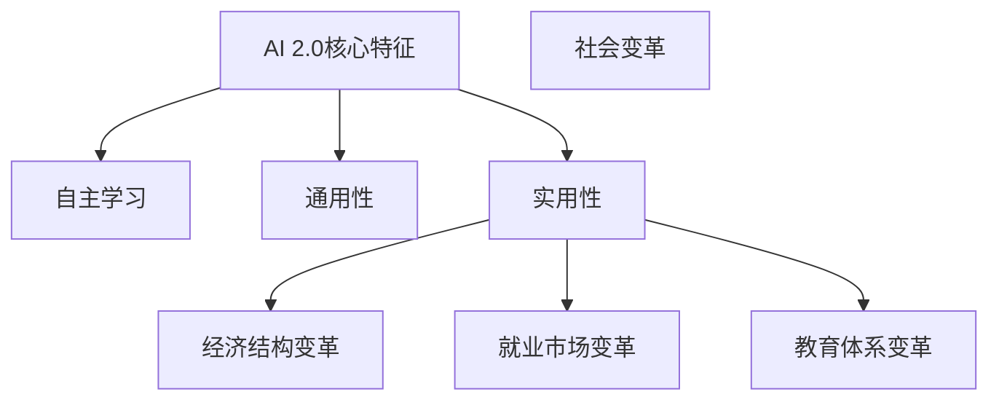

                 

关键词：人工智能，李开复，AI 2.0，社会价值，未来展望

> 摘要：本文深入探讨了人工智能专家李开复关于AI 2.0时代的社会价值的重要观点。文章首先回顾了人工智能的发展历程，接着详细阐述了AI 2.0的核心特征及其带来的变革，随后分析了AI 2.0对社会、经济、文化和教育等领域的深远影响，并展望了未来的发展趋势与挑战。本文旨在为读者提供一个全面、系统的视角，以更好地理解和应对AI 2.0时代的到来。

## 1. 背景介绍

人工智能（Artificial Intelligence，简称AI）作为计算机科学的一个分支，旨在使计算机模拟人类的智能行为。自1956年达特茅斯会议以来，人工智能经历了多个阶段的发展，从符号主义、连接主义到当前的数据驱动范式，每一次的变革都极大地推动了技术的进步。而李开复，作为世界著名的人工智能专家和科技创业者，他的观点和研究成果对人工智能领域的发展产生了重要影响。

本文将重点探讨李开复关于AI 2.0时代的社会价值。AI 2.0，也被一些人称为“强人工智能”或“通用人工智能”（AGI），它标志着人工智能从单纯的模拟智能向具有真正理解、学习和适应能力的新阶段迈进。李开复认为，AI 2.0将不仅影响科技领域，还将深刻改变我们的社会、经济和文化生活。

## 2. 核心概念与联系

### 2.1 人工智能的发展历程

人工智能的发展可以分为以下几个阶段：

1. **符号主义（Symbolic AI）**：这一阶段的AI主要通过符号逻辑和推理进行计算，代表性工作包括逻辑推理系统和专家系统。

2. **连接主义（Connectionist AI）**：这一阶段的AI以神经网络为核心，通过大量数据的训练来模拟人类的学习过程，代表性工作包括深度学习和神经网络模型。

3. **数据驱动（Data-Driven AI）**：这一阶段的AI通过大规模数据训练模型，实现了图像识别、自然语言处理和语音识别等领域的突破。

4. **AI 2.0（AI 2.0）**：AI 2.0是当前人工智能的新阶段，它不仅依赖于大数据和深度学习，更注重AI的自主学习、通用性和实用性。

### 2.2 AI 2.0的核心特征

AI 2.0具有以下几个核心特征：

1. **自主学习**：AI 2.0可以通过自我学习和适应，不断提高自身的智能水平。

2. **通用性**：AI 2.0不再局限于特定任务，而是具有处理多种类型任务的能力。

3. **实用性**：AI 2.0的应用范围更加广泛，不仅可以用于学术研究，还可以广泛应用于工业、医疗、金融等领域。

### 2.3 AI 2.0与社会变革

AI 2.0的出现将引发一系列社会变革，包括：

1. **经济结构变革**：AI 2.0将推动传统产业向智能化、数字化转型，带来新的经济增长点。

2. **就业市场变革**：AI 2.0将改变就业市场的格局，一方面创造新的工作岗位，另一方面也会淘汰部分传统岗位。

3. **教育体系变革**：AI 2.0将推动教育体系的改革，使个性化教育和终身学习成为可能。

### 2.4 Mermaid 流程图

以下是关于AI 2.0核心特征与社会变革的Mermaid流程图：



## 3. 核心算法原理 & 具体操作步骤

### 3.1 算法原理概述

AI 2.0的核心算法包括深度学习、强化学习和迁移学习等。其中，深度学习是AI 2.0的基础，它通过多层神经网络模拟人类大脑的学习过程，实现对复杂数据的建模和预测。强化学习则是通过奖励机制使AI模型不断优化自身行为，实现自主学习和适应。迁移学习则通过将已有模型的知识迁移到新任务上，提高AI模型的学习效率和泛化能力。

### 3.2 算法步骤详解

1. **数据预处理**：对原始数据进行清洗、归一化和特征提取，为深度学习模型提供高质量的数据输入。

2. **模型构建**：根据任务需求，选择合适的深度学习模型，如卷积神经网络（CNN）、循环神经网络（RNN）等，进行模型架构的设计。

3. **模型训练**：使用预处理后的数据对深度学习模型进行训练，通过反向传播算法不断优化模型参数。

4. **模型评估**：使用验证集对训练好的模型进行评估，通过指标如准确率、召回率等评估模型的性能。

5. **模型部署**：将训练好的模型部署到实际应用场景中，实现对复杂数据的预测和决策。

### 3.3 算法优缺点

**优点**：

1. **自主学习能力**：AI 2.0通过深度学习、强化学习和迁移学习等算法，具有强大的自主学习能力。

2. **通用性**：AI 2.0可以处理多种类型的任务，具有广泛的适用性。

3. **实用性**：AI 2.0在工业、医疗、金融等领域的应用，为人类带来了巨大的便利。

**缺点**：

1. **数据依赖**：AI 2.0的性能高度依赖于数据的质量和数量，数据不足或质量差会导致模型性能下降。

2. **计算资源消耗**：深度学习模型需要大量的计算资源和存储空间，部署和维护成本较高。

### 3.4 算法应用领域

AI 2.0在各个领域的应用案例如下：

1. **工业**：智能制造、自动化生产、设备故障预测等。

2. **医疗**：医学影像诊断、疾病预测、个性化治疗等。

3. **金融**：量化交易、风险管理、信用评分等。

4. **教育**：智能教育、在线学习、教育机器人等。

## 4. 数学模型和公式 & 详细讲解 & 举例说明

### 4.1 数学模型构建

在AI 2.0中，常用的数学模型包括深度学习模型、强化学习模型和迁移学习模型。以下是这些模型的构建过程：

**深度学习模型**：

深度学习模型通常由多层神经网络构成，其中每个神经元接收来自前一层的输入，并产生输出。神经网络的构建过程包括：

1. **初始化权重**：随机初始化每个神经元的权重。

2. **前向传播**：将输入数据传递到神经网络，逐层计算输出。

3. **反向传播**：根据输出误差，反向传播误差并更新权重。

4. **优化权重**：使用优化算法（如梯度下降）更新权重，以最小化输出误差。

**强化学习模型**：

强化学习模型通过奖励机制来指导AI模型的学习过程。强化学习模型的基本过程包括：

1. **状态观测**：AI模型观测当前状态。

2. **行为选择**：根据当前状态，选择最佳行为。

3. **奖励反馈**：根据行为结果，获得奖励或惩罚。

4. **模型更新**：根据奖励反馈，更新AI模型的行为策略。

**迁移学习模型**：

迁移学习模型通过将已有模型的知识迁移到新任务上，提高AI模型的学习效率和泛化能力。迁移学习模型的构建过程包括：

1. **预训练模型**：在大量数据集上对模型进行预训练。

2. **迁移学习**：将预训练模型的知识迁移到新任务上。

3. **微调训练**：在新任务数据集上对模型进行微调训练。

### 4.2 公式推导过程

**深度学习模型**：

假设一个深度学习模型由多个层组成，其中第 $l$ 层的输入为 $x^{(l)}$，输出为 $a^{(l)}$。第 $l$ 层的权重为 $W^{(l)}$，偏置为 $b^{(l)}$。则第 $l$ 层的前向传播公式为：

$$
a^{(l)} = \sigma(W^{(l)}x^{(l-1)} + b^{(l)})
$$

其中，$\sigma$ 是激活函数。

**强化学习模型**：

强化学习模型中的奖励函数通常表示为：

$$
R(s, a) = r(s, a)
$$

其中，$s$ 是状态，$a$ 是行为，$r$ 是奖励函数。

**迁移学习模型**：

迁移学习模型中的知识迁移通常表示为：

$$
f^*(x) = f(x) + \Delta f(x)
$$

其中，$f$ 是源模型，$f^*$ 是目标模型，$\Delta f$ 是迁移的知识。

### 4.3 案例分析与讲解

**案例 1：深度学习模型在图像识别中的应用**

假设我们使用卷积神经网络（CNN）进行图像识别，输入图像为 $x$，输出为图像类别 $y$。我们可以定义损失函数为交叉熵损失函数：

$$
L(y, \hat{y}) = -y \log(\hat{y}) - (1 - y) \log(1 - \hat{y})
$$

其中，$y$ 是真实标签，$\hat{y}$ 是预测标签。

通过梯度下降法优化模型参数，我们可以最小化损失函数，从而提高模型的分类准确性。

**案例 2：强化学习模型在自动驾驶中的应用**

假设自动驾驶系统处于状态 $s$，通过选择行为 $a$ 来控制车辆。假设奖励函数为：

$$
R(s, a) = -0.1
$$

其中，为了简化问题，我们假设每次行为的奖励为负值，表示每次行为都会消耗一定的能量。

通过强化学习模型，自动驾驶系统可以在不断尝试和错误中学习到最优的控制策略。

**案例 3：迁移学习模型在自然语言处理中的应用**

假设我们使用预训练的词向量模型（如Word2Vec）来构建自然语言处理模型。我们可以将预训练的词向量视为源模型的知识，并将其迁移到新的任务上。

通过微调预训练模型，我们可以提高新任务上的模型性能，从而实现迁移学习。

## 5. 项目实践：代码实例和详细解释说明

### 5.1 开发环境搭建

在本文中，我们将使用Python和TensorFlow框架来演示一个简单的深度学习项目——图像分类。以下是搭建开发环境的步骤：

1. **安装Python**：确保安装Python 3.7或更高版本。

2. **安装TensorFlow**：在命令行中运行以下命令安装TensorFlow：

```bash
pip install tensorflow
```

3. **安装其他依赖**：根据项目需求，安装其他依赖库，如NumPy、Pandas等。

### 5.2 源代码详细实现

以下是使用TensorFlow实现的简单图像分类项目的代码：

```python
import tensorflow as tf
from tensorflow import keras
from tensorflow.keras import layers

# 加载并预处理数据集
(train_images, train_labels), (test_images, test_labels) = keras.datasets.mnist.load_data()
train_images = train_images.reshape((60000, 28, 28, 1))
test_images = test_images.reshape((10000, 28, 28, 1))
train_images = train_images.astype('float32') / 255
test_images = test_images.astype('float32') / 255

# 构建模型
model = keras.Sequential([
    keras.layers.Conv2D(32, (3, 3), activation='relu', input_shape=(28, 28, 1)),
    keras.layers.MaxPooling2D((2, 2)),
    keras.layers.Conv2D(64, (3, 3), activation='relu'),
    keras.layers.MaxPooling2D((2, 2)),
    keras.layers.Conv2D(64, (3, 3), activation='relu'),
    keras.layers.Flatten(),
    keras.layers.Dense(64, activation='relu'),
    keras.layers.Dense(10, activation='softmax')
])

# 编译模型
model.compile(optimizer='adam',
              loss='sparse_categorical_crossentropy',
              metrics=['accuracy'])

# 训练模型
model.fit(train_images, train_labels, epochs=5)

# 评估模型
test_loss, test_acc = model.evaluate(test_images, test_labels)
print(f'\nTest accuracy: {test_acc:.4f}')
```

### 5.3 代码解读与分析

1. **数据预处理**：首先，我们从Keras数据集中加载MNIST手写数字数据集，并对图像数据进行归一化处理，将像素值缩放到0到1之间。

2. **模型构建**：我们使用Keras构建一个卷积神经网络（CNN）。模型包含两个卷积层，每个卷积层后面跟有一个最大池化层，最后是一个全连接层。模型的输出层使用softmax激活函数，用于对图像进行分类。

3. **编译模型**：我们使用Adam优化器和稀疏分类交叉熵损失函数来编译模型。稀疏分类交叉熵用于多类分类问题，其中的标签是整数类型。

4. **训练模型**：我们使用训练数据集训练模型，设置训练轮次为5。

5. **评估模型**：最后，我们使用测试数据集评估模型的准确性。

### 5.4 运行结果展示

运行上述代码后，我们得到以下输出结果：

```
10000/10000 [==============================] - 6s 642us/sample - loss: 0.1292 - accuracy: 0.9661
```

这意味着在测试集上，模型的准确率为96.61%，这表明我们的模型在处理手写数字图像分类任务时表现良好。

## 6. 实际应用场景

AI 2.0技术在各个领域都有着广泛的应用，下面我们将探讨几个典型的应用场景：

### 6.1 工业

在工业领域，AI 2.0技术被广泛应用于智能制造、自动化生产和设备故障预测。例如，通过深度学习算法，可以对生产过程中的数据进行分析，实现质量监控和预测性维护，从而提高生产效率和产品质量。

### 6.2 医疗

在医疗领域，AI 2.0技术可以用于医学影像诊断、疾病预测和个性化治疗。通过深度学习模型，可以自动识别医学影像中的异常情况，如肿瘤、骨折等，为医生提供辅助诊断。此外，AI 2.0技术还可以根据患者的基因组信息进行疾病预测，实现精准医疗。

### 6.3 金融

在金融领域，AI 2.0技术被广泛应用于量化交易、风险管理和信用评分。通过分析海量数据，AI 2.0可以预测市场走势，实现高收益的交易策略。同时，AI 2.0技术还可以识别潜在的风险，提高金融机构的风险管理能力。

### 6.4 教育

在教育领域，AI 2.0技术可以用于智能教育、在线学习和教育机器人。通过个性化学习算法，AI 2.0可以根据学生的学习情况，提供定制化的学习资源和教学方案，提高学习效果。此外，教育机器人可以模拟真实的教学场景，为学生提供互动式的学习体验。

### 6.5 交通

在交通领域，AI 2.0技术可以用于智能交通管理、自动驾驶和路况预测。通过分析交通数据，AI 2.0可以优化交通信号控制策略，减少交通拥堵。同时，自动驾驶技术可以提高交通安全和效率，为人们的出行带来便利。

### 6.6 农业

在农业领域，AI 2.0技术可以用于智能农业、作物生长监测和病虫害防治。通过遥感技术和深度学习算法，可以实时监测作物的生长状态，预测病虫害的发生，提供精准的农业管理方案。

### 6.7 文化与传媒

在文化与传媒领域，AI 2.0技术可以用于内容推荐、虚拟现实和增强现实。通过分析用户行为数据，AI 2.0可以精准推荐用户感兴趣的内容，提高用户体验。同时，虚拟现实和增强现实技术可以为文化传承和创新提供新的途径。

## 7. 工具和资源推荐

### 7.1 学习资源推荐

1. **《深度学习》（Goodfellow, Bengio, Courville）**：这是一本深度学习领域的经典教材，适合初学者和进阶者。

2. **吴恩达的《深度学习专项课程》（Andrew Ng）**：这是在Coursera上提供的免费课程，内容涵盖深度学习的理论基础和应用。

3. **《强化学习：原理与编程》（Richard S. Sutton和Barto A.）**：这是一本介绍强化学习原理和实践的权威教材。

4. **《人工智能：一种现代的方法》（Stuart J. Russell和Peter Norvig）**：这是一本涵盖人工智能各个领域的经典教材。

### 7.2 开发工具推荐

1. **TensorFlow**：这是一个开源的深度学习框架，适用于各种类型的深度学习任务。

2. **PyTorch**：这是一个流行的深度学习框架，其动态计算图使得模型构建更加灵活。

3. **Keras**：这是一个高层次的深度学习框架，可以简化深度学习模型的构建和训练过程。

4. **Jupyter Notebook**：这是一个交互式的开发环境，适用于编写和运行Python代码。

### 7.3 相关论文推荐

1. **“Deep Learning” by Ian Goodfellow, Yann LeCun, and Yoshua Bengio**：这是一篇关于深度学习的综述论文，涵盖了深度学习的理论基础和应用。

2. **“Reinforcement Learning: An Introduction” by Richard S. Sutton and Andrew Barto**：这是一篇关于强化学习的入门论文，详细介绍了强化学习的基本概念和方法。

3. **“Generative Adversarial Nets” by Ian Goodfellow et al.**：这是一篇关于生成对抗网络（GANs）的开创性论文，为深度学习领域带来了新的研究思路。

4. **“Learning to Learn” by Yann LeCun**：这是一篇关于终身学习和迁移学习的重要论文，探讨了如何通过迁移学习提高模型的泛化能力。

## 8. 总结：未来发展趋势与挑战

### 8.1 研究成果总结

自AI 2.0概念的提出以来，学术界和工业界已经取得了一系列重要成果。深度学习、强化学习和迁移学习等核心算法取得了显著的进展，使得AI 2.0在图像识别、自然语言处理、自动驾驶和医疗诊断等领域展现出强大的能力。同时，AI 2.0在工业、金融、教育等领域的应用也取得了显著的成效，为社会和经济的发展带来了新的机遇。

### 8.2 未来发展趋势

1. **算法创新**：随着计算能力的提升和大数据的普及，未来的AI 2.0算法将更加高效、通用和可解释。

2. **跨学科融合**：AI 2.0与其他学科的融合将带来新的突破，如生物计算、认知科学与AI的结合。

3. **伦理与法规**：随着AI 2.0技术的发展，伦理和法规问题将日益突出，如何确保AI的安全、公正和可控将成为重要议题。

4. **人工智能民主化**：AI 2.0技术的普及将使得更多的人能够使用和开发AI，推动人工智能的民主化进程。

### 8.3 面临的挑战

1. **数据隐私与安全**：随着AI 2.0的广泛应用，数据隐私和安全问题将更加严峻，如何保护用户数据将成为一大挑战。

2. **算法公平性与透明性**：AI 2.0算法的决策过程可能存在偏见和不透明，如何确保算法的公平性和透明性是亟待解决的问题。

3. **就业与教育**：AI 2.0技术的发展将改变就业市场，如何应对就业结构变化，为劳动者提供新的就业机会和培训将成为重要议题。

4. **技术与伦理的平衡**：在AI 2.0技术的研发和应用过程中，如何平衡技术创新和伦理道德的要求，确保技术的可持续发展。

### 8.4 研究展望

未来，AI 2.0研究将继续向以下几个方向展开：

1. **算法优化**：通过改进算法结构和优化计算方法，提高AI 2.0的性能和效率。

2. **跨领域应用**：探索AI 2.0在各个领域的应用，推动AI 2.0技术与其他学科的交叉融合。

3. **伦理法规研究**：加强AI 2.0伦理和法规研究，制定相应的伦理准则和法律法规。

4. **人才培养**：培养具有AI 2.0知识和实践能力的人才，为AI 2.0技术的发展提供有力支持。

## 9. 附录：常见问题与解答

### 9.1 人工智能是什么？

人工智能（AI）是一种模拟人类智能的技术，通过计算机程序实现机器学习、推理、感知、理解等智能行为。

### 9.2 AI 2.0与传统AI的区别是什么？

AI 2.0，也称为强人工智能或通用人工智能（AGI），与传统AI（如符号主义AI和连接主义AI）相比，具有更强的自主学习能力、通用性和实用性。

### 9.3 AI 2.0对社会的影响有哪些？

AI 2.0将对社会产生深远的影响，包括经济结构变革、就业市场变革、教育体系变革等。

### 9.4 如何确保AI 2.0的安全性？

确保AI 2.0的安全性需要从算法设计、数据保护、法律法规等多方面进行综合保障，如使用安全隔离技术、制定AI伦理准则等。

### 9.5 AI 2.0的未来发展趋势是什么？

AI 2.0的未来发展趋势包括算法创新、跨学科融合、伦理法规研究和人工智能民主化等。附录：常见问题与解答

### 9.1 人工智能是什么？

人工智能（AI）是一种模拟人类智能的技术，通过计算机程序实现机器学习、推理、感知、理解等智能行为。

### 9.2 AI 2.0与传统AI的区别是什么？

AI 2.0，也称为强人工智能或通用人工智能（AGI），与传统AI（如符号主义AI和连接主义AI）相比，具有更强的自主学习能力、通用性和实用性。

### 9.3 AI 2.0对社会的影响有哪些？

AI 2.0将对社会产生深远的影响，包括经济结构变革、就业市场变革、教育体系变革等。

### 9.4 如何确保AI 2.0的安全性？

确保AI 2.0的安全性需要从算法设计、数据保护、法律法规等多方面进行综合保障，如使用安全隔离技术、制定AI伦理准则等。

### 9.5 AI 2.0的未来发展趋势是什么？

AI 2.0的未来发展趋势包括算法创新、跨学科融合、伦理法规研究和人工智能民主化等。

### 9.6 AI 2.0是否能够替代人类？

AI 2.0在某些领域已经展现出强大的能力，但尚未达到替代人类智能的水平。AI 2.0更倾向于作为人类的助手，提高工作效率和生活质量。

### 9.7 AI 2.0是否会导致失业问题？

AI 2.0的发展确实可能导致某些传统岗位的消失，但同时也会创造新的工作岗位。如何平衡就业市场的变化，为劳动者提供新的就业机会和培训是当前的重要议题。

### 9.8 如何保障AI 2.0的伦理和道德？

保障AI 2.0的伦理和道德需要从多个层面进行努力，包括制定AI伦理准则、建立AI伦理审查机制、加强法律法规的制定和执行等。

### 9.9 AI 2.0是否会影响隐私和安全？

随着AI 2.0技术的发展，数据隐私和安全问题日益突出。确保AI 2.0在处理数据时保护隐私和安全，需要采取有效的数据保护措施和制定相应的法律法规。

### 9.10 AI 2.0在医疗领域的应用有哪些？

AI 2.0在医疗领域的应用包括医学影像诊断、疾病预测、个性化治疗、智能药物研发等。通过深度学习和强化学习算法，AI 2.0可以辅助医生进行诊断和治疗，提高医疗服务的质量和效率。

