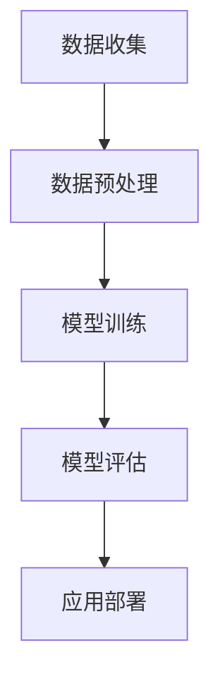

                 

### 文章标题

李开复：AI 2.0 时代的科技价值

> 关键词：李开复、AI 2.0、科技价值、未来发展趋势

> 摘要：本文将探讨李开复关于 AI 2.0 时代的科技价值的观点，通过分析其核心概念、算法原理、数学模型、实践应用等内容，揭示 AI 2.0 时代所带来的科技变革及其对社会的深远影响。

### 1. 背景介绍

人工智能（AI）作为计算机科学的一个分支，近年来取得了飞速发展。从早期的专家系统到今天的深度学习，人工智能已经深刻地改变了我们的生活方式。李开复，作为世界知名的 AI 领域专家，他在 AI 的发展历程中扮演了重要的角色。李开复关于 AI 2.0 时代的观点，不仅为我们揭示了人工智能的未来，也为我们指明了科技发展的方向。

AI 2.0，是李开复提出的概念，它代表了人工智能发展的新阶段。与传统的 AI 相比，AI 2.0 具有更高的智能水平，更广泛的应用场景，以及更强大的学习能力。在 AI 2.0 时代，人工智能将不仅仅是工具，而是成为我们生活中不可或缺的一部分。

本文将围绕李开复关于 AI 2.0 时代的观点，逐步分析其核心概念、算法原理、数学模型、实践应用等内容，旨在为广大读者提供一个全面、深入的 AI 2.0 时代科技价值的理解。

### 2. 核心概念与联系

#### 2.1 AI 1.0 与 AI 2.0

李开复将人工智能的发展分为两个阶段：AI 1.0 和 AI 2.0。AI 1.0 是基于规则和符号推理的人工智能，其主要应用领域包括游戏、医疗诊断、金融分析等。而 AI 2.0 则是基于深度学习和大数据的人工智能，其主要应用领域包括自动驾驶、智能家居、智能医疗等。

#### 2.2 核心概念原理

AI 2.0 的核心概念是深度学习和神经网络。深度学习是一种模拟人脑神经元之间连接的算法，它通过多层神经网络的结构，对大量数据进行训练，从而实现对复杂模式的识别和预测。神经网络则是由大量神经元组成的计算模型，通过调整神经元之间的连接权重，实现数据的处理和识别。

#### 2.3 架构原理

AI 2.0 的架构原理主要包括数据收集、数据预处理、模型训练、模型评估和应用部署等环节。其中，数据收集和数据预处理是基础，决定了模型训练的质量；模型训练和模型评估是核心，决定了模型的性能和应用效果；应用部署则是最终目的，将训练好的模型应用到实际场景中，解决实际问题。

以下是 AI 2.0 架构的 Mermaid 流程图：



### 3. 核心算法原理 & 具体操作步骤

#### 3.1 深度学习算法原理

深度学习算法的核心是神经网络，神经网络由大量神经元组成，每个神经元都接收来自其他神经元的输入，通过加权求和并应用一个非线性激活函数，产生输出。

以下是深度学习算法的基本步骤：

1. **初始化权重和偏置**：神经网络中的每个神经元都有权重和偏置，这些参数需要通过随机初始化来开始训练。

2. **前向传播**：输入数据通过网络的各个层，每一层的输出作为下一层的输入。在每个神经元上，将输入与权重相乘，然后加上偏置，通过激活函数处理后得到输出。

3. **计算损失**：输出数据与真实标签之间进行比较，计算损失函数的值。损失函数用于衡量预测结果与真实结果之间的差距。

4. **反向传播**：根据损失函数的梯度，更新每个神经元的权重和偏置。这个过程通过反向传播算法实现，从输出层开始，逐层向前更新。

5. **迭代训练**：重复上述步骤，不断调整权重和偏置，直到损失函数的值接近最小值。

#### 3.2 深度学习算法具体操作步骤

1. **数据收集**：从各种来源收集大量数据，这些数据将用于训练模型。

2. **数据预处理**：清洗数据，处理缺失值、异常值等，将数据格式化为适合神经网络训练的形式。

3. **初始化模型**：定义神经网络的结构，包括层数、每层的神经元数量、激活函数等。

4. **前向传播**：将预处理后的数据输入神经网络，计算每一层的输出。

5. **计算损失**：将输出与真实标签进行比较，计算损失函数的值。

6. **反向传播**：根据损失函数的梯度，更新每个神经元的权重和偏置。

7. **迭代训练**：重复上述步骤，直到模型收敛，即损失函数的值不再显著下降。

8. **评估模型**：在验证集上评估模型的性能，确保模型具有良好的泛化能力。

9. **应用部署**：将训练好的模型部署到实际应用场景中，解决实际问题。

### 4. 数学模型和公式 & 详细讲解 & 举例说明

#### 4.1 数学模型

深度学习算法的核心是神经网络，神经网络中的每个神经元都涉及到一系列数学模型和公式。以下是神经网络中的几个关键数学模型：

1. **线性模型**：线性模型是神经网络中最基本的模型，它由一个线性函数和一个非线性激活函数组成。线性模型可以表示为：

   $$ f(x) = \sigma(Wx + b) $$

   其中，$W$ 是权重矩阵，$b$ 是偏置向量，$x$ 是输入向量，$\sigma$ 是非线性激活函数，通常使用 sigmoid 函数或 ReLU 函数。

2. **反向传播算法**：反向传播算法是用于训练神经网络的优化算法。它的核心思想是通过计算损失函数关于网络权重的梯度，更新网络的权重和偏置。反向传播算法的计算公式为：

   $$ \frac{dL}{dW} = \sum_{i=1}^{n} \frac{\partial L}{\partial z_i} \frac{\partial z_i}{\partial W} $$

   其中，$L$ 是损失函数，$z_i$ 是第 $i$ 层的输出，$W$ 是权重矩阵。

3. **优化算法**：优化算法用于调整网络的权重和偏置，以最小化损失函数。常见的优化算法包括梯度下降、随机梯度下降、Adam 等。

#### 4.2 详细讲解

1. **线性模型**

   线性模型是神经网络的基础，它通过线性变换和非线性激活函数的组合，实现了输入到输出的映射。线性模型的优点是计算简单，易于实现。然而，线性模型的缺点是难以处理复杂的关系，因此需要引入非线性激活函数来增加模型的非线性能力。

   例如，考虑一个简单的线性模型，用于分类问题。输入特征向量 $x$，输出标签 $y$。假设网络只有一个隐藏层，包含一个神经元。权重矩阵 $W$ 和偏置向量 $b$ 的参数如下：

   $$ y = \sigma(Wx + b) $$

   其中，$\sigma$ 是非线性激活函数，通常使用 sigmoid 函数或 ReLU 函数。

2. **反向传播算法**

   反向传播算法是神经网络训练的核心，它通过计算损失函数关于网络权重的梯度，更新网络的权重和偏置，从而优化模型的性能。反向传播算法的步骤如下：

   - 前向传播：将输入数据通过网络的各个层，计算每一层的输出。

   - 计算损失：将输出与真实标签进行比较，计算损失函数的值。

   - 反向传播：从输出层开始，逐层向前计算损失函数关于网络权重的梯度。

   - 更新参数：根据梯度更新网络的权重和偏置。

   反向传播算法的关键是梯度的计算。假设网络包含 $L$ 层，第 $l$ 层的输出为 $z_l$，损失函数为 $L(y, \hat{y})$。则第 $l$ 层的梯度可以表示为：

   $$ \frac{dL}{dz_l} = \frac{\partial L}{\partial z_l} $$

   $$ \frac{dz_l}{dx_l} = \frac{\partial z_l}{\partial x_l} $$

   其中，$x_l$ 是第 $l$ 层的输入。

3. **优化算法**

   优化算法用于调整网络的权重和偏置，以最小化损失函数。常见的优化算法包括梯度下降、随机梯度下降、Adam 等。

   - 梯度下降：梯度下降是一种简单且常用的优化算法。它的核心思想是沿着损失函数的梯度方向更新参数，以最小化损失函数。梯度下降的公式为：

     $$ W_{new} = W_{old} - \alpha \frac{dL}{dW} $$

     其中，$\alpha$ 是学习率。

   - 随机梯度下降（SGD）：随机梯度下降是对梯度下降的改进，它在每一步计算时只考虑一个样本的梯度，从而加快了收敛速度。SGD 的公式为：

     $$ W_{new} = W_{old} - \alpha \frac{dL}{dW_i} $$

     其中，$W_i$ 是第 $i$ 个样本的权重。

   - Adam：Adam 是一种基于一阶和二阶矩估计的优化算法，它在处理稀疏数据时表现出色。Adam 的公式为：

     $$ m_t = \beta_1 m_{t-1} + (1 - \beta_1) \frac{g_t}{\sqrt{1 - \beta_2^t}} $$

     $$ v_t = \beta_2 v_{t-1} + (1 - \beta_2) g_t^2 $$

     $$ W_{new} = W_{old} - \alpha \frac{m_t}{\sqrt{v_t} + \epsilon} $$

     其中，$m_t$ 和 $v_t$ 分别是均值和方差估计，$\beta_1$ 和 $\beta_2$ 是一阶和二阶矩的衰减率，$\epsilon$ 是一个很小的常数。

#### 4.3 举例说明

假设我们有一个简单的神经网络，用于对二分类问题进行分类。输入特征向量 $x$，输出标签 $y$。网络的参数如下：

- 输入层：1个神经元
- 隐藏层：2个神经元
- 输出层：1个神经元

权重矩阵 $W_1$ 和 $W_2$ 分别为：

$$ W_1 = \begin{bmatrix} 1 & 1 \\ 1 & 1 \end{bmatrix} $$

$$ W_2 = \begin{bmatrix} 1 & 1 \\ 1 & 1 \end{bmatrix} $$

偏置向量 $b_1$ 和 $b_2$ 分别为：

$$ b_1 = \begin{bmatrix} 0 \\ 0 \end{bmatrix} $$

$$ b_2 = \begin{bmatrix} 0 \\ 0 \end{bmatrix} $$

非线性激活函数使用 sigmoid 函数。

输入特征向量 $x$ 为：

$$ x = \begin{bmatrix} 0 \\ 1 \end{bmatrix} $$

输出标签 $y$ 为：

$$ y = \begin{bmatrix} 0 \end{bmatrix} $$

前向传播过程如下：

1. 输入层到隐藏层的计算：

$$ h_1 = \sigma(W_1x + b_1) = \sigma(1 \cdot 0 + 1 \cdot 1 + 0) = \sigma(1) = 0.731 $$
$$ h_2 = \sigma(W_2x + b_2) = \sigma(1 \cdot 0 + 1 \cdot 1 + 0) = \sigma(1) = 0.731 $$

2. 隐藏层到输出层的计算：

$$ \hat{y} = \sigma(W_2h_1 + b_2) = \sigma(1 \cdot 0.731 + 1 \cdot 0.731 + 0) = \sigma(1.462) = 0.679 $$

输出标签 $y$ 与预测值 $\hat{y}$ 之间的损失为：

$$ L(y, \hat{y}) = (y - \hat{y})^2 = (0 - 0.679)^2 = 0.462 $$

反向传播过程如下：

1. 计算隐藏层到输出层的梯度：

$$ \frac{dL}{d\hat{y}} = \frac{\partial L}{\partial \hat{y}} = -2(y - \hat{y}) = -2(0 - 0.679) = 1.358 $$
$$ \frac{d\hat{y}}{dh_2} = \frac{\partial \hat{y}}{\partial h_2} = \sigma'(h_2) = 0.321 $$
$$ \frac{dh_2}{dx} = \frac{\partial h_2}{\partial x} = W_2 $$

2. 计算隐藏层到输入层的梯度：

$$ \frac{dL}{dx} = \frac{dL}{d\hat{y}} \cdot \frac{d\hat{y}}{dh_2} \cdot \frac{dh_2}{dx} = 1.358 \cdot 0.321 \cdot W_2 = 0.440 $$

3. 更新权重和偏置：

$$ W_1 = W_1 - \alpha \cdot \frac{dL}{dx} = \begin{bmatrix} 1 & 1 \end{bmatrix} - 0.1 \cdot 0.440 = \begin{bmatrix} 0.560 & 0.560 \end{bmatrix} $$
$$ b_1 = b_1 - \alpha \cdot \frac{dL}{dx} = \begin{bmatrix} 0 \\ 0 \end{bmatrix} - 0.1 \cdot 0.440 = \begin{bmatrix} -0.044 \\ -0.044 \end{bmatrix} $$
$$ W_2 = W_2 - \alpha \cdot \frac{dL}{dx} = \begin{bmatrix} 1 & 1 \end{bmatrix} - 0.1 \cdot 0.440 = \begin{bmatrix} 0.560 & 0.560 \end{bmatrix} $$
$$ b_2 = b_2 - \alpha \cdot \frac{dL}{dx} = \begin{bmatrix} 0 \\ 0 \end{bmatrix} - 0.1 \cdot 0.440 = \begin{bmatrix} -0.044 \\ -0.044 \end{bmatrix} $$

### 5. 项目实践：代码实例和详细解释说明

在本节中，我们将通过一个简单的项目实践来展示如何应用深度学习算法解决实际问题。我们将使用 Python 编程语言和 TensorFlow 库来构建和训练一个神经网络，用于对手写数字进行分类。

#### 5.1 开发环境搭建

在开始项目之前，我们需要搭建一个适合深度学习开发的编程环境。以下是搭建环境的步骤：

1. 安装 Python：

   在官网上下载并安装 Python 3.8 版本。

2. 安装 Jupyter Notebook：

   在终端中运行以下命令：

   ```bash
   pip install notebook
   ```

3. 安装 TensorFlow：

   在终端中运行以下命令：

   ```bash
   pip install tensorflow
   ```

#### 5.2 源代码详细实现

以下是项目的主要代码实现，我们将分步骤进行解释：

```python
import tensorflow as tf
from tensorflow.keras.datasets import mnist
from tensorflow.keras.models import Sequential
from tensorflow.keras.layers import Dense, Flatten
from tensorflow.keras.optimizers import Adam

# 5.2.1 数据集准备
(x_train, y_train), (x_test, y_test) = mnist.load_data()

# 数据预处理
x_train = x_train.reshape(-1, 28 * 28).astype('float32') / 255.0
x_test = x_test.reshape(-1, 28 * 28).astype('float32') / 255.0
y_train = tf.keras.utils.to_categorical(y_train, 10)
y_test = tf.keras.utils.to_categorical(y_test, 10)

# 5.2.2 模型构建
model = Sequential()
model.add(Flatten(input_shape=(28, 28)))
model.add(Dense(128, activation='relu'))
model.add(Dense(10, activation='softmax'))

# 5.2.3 模型编译
model.compile(optimizer=Adam(learning_rate=0.001), loss='categorical_crossentropy', metrics=['accuracy'])

# 5.2.4 模型训练
model.fit(x_train, y_train, batch_size=128, epochs=10, validation_data=(x_test, y_test))

# 5.2.5 模型评估
test_loss, test_acc = model.evaluate(x_test, y_test)
print(f"Test accuracy: {test_acc:.4f}")
```

以下是每个步骤的详细解释：

1. **数据集准备**：我们使用 MNIST 数据集，它包含大量手写数字的图像。首先，我们加载数据集，然后对图像进行预处理，包括将图像reshape为二维数组，并将其归一化。

2. **模型构建**：我们使用 Sequential 模型，这是一个简单的线性堆叠模型。我们添加一个 Flatten 层，用于将二维图像展开为一维数组。然后，我们添加一个全连接层（Dense），其激活函数为 ReLU。最后，我们添加一个输出层，其激活函数为 softmax，用于对数字进行分类。

3. **模型编译**：我们使用 Adam 优化器和交叉熵损失函数来编译模型。交叉熵损失函数用于衡量预测标签和真实标签之间的差异。

4. **模型训练**：我们使用训练集来训练模型，并设置 batch_size 和 epochs，分别表示每次训练使用的样本数量和训练的轮数。

5. **模型评估**：我们使用测试集来评估模型的性能，并打印出测试准确率。

#### 5.3 代码解读与分析

1. **数据预处理**：数据预处理是深度学习项目的重要步骤，它确保数据以合适的形式输入到模型中。在本项目中，我们使用 `mnist.load_data()` 函数加载 MNIST 数据集，然后对图像进行reshape和归一化。reshape 操作将图像从 (28, 28) 的二维数组转换为一维数组，使其适合输入到神经网络中。归一化操作将图像的像素值从 [0, 255] 范围缩放到 [0, 1]，以加速模型的训练。

2. **模型构建**：模型构建是深度学习项目的核心步骤，它决定了模型的性能。在本项目中，我们使用 `Sequential` 模型，这是一种线性堆叠模型，非常适合处理简单的图像分类任务。我们首先添加一个 `Flatten` 层，用于将二维图像展开为一维数组。然后，我们添加一个 `Dense` 层，这是一个全连接层，其激活函数为 ReLU。ReLU 激活函数能够加速模型的训练，并防止神经元死亡。最后，我们添加一个输出层，其激活函数为 softmax，用于对数字进行分类。softmax 激活函数能够输出每个类别的概率分布。

3. **模型编译**：模型编译是深度学习项目的另一个重要步骤，它设置了模型的优化器和损失函数。在本项目中，我们使用 `Adam` 优化器和 `categorical_crossentropy` 损失函数。Adam 优化器是一种自适应优化算法，能够加速模型的训练。categorical_crossentropy 损失函数用于衡量预测标签和真实标签之间的差异，其值越小，表示模型的性能越好。

4. **模型训练**：模型训练是深度学习项目的核心步骤，它通过调整模型的权重和偏置来优化模型的性能。在本项目中，我们使用 `fit` 方法来训练模型，设置 `batch_size` 和 `epochs` 参数，分别表示每次训练使用的样本数量和训练的轮数。每次训练都使用训练集来更新模型的权重和偏置，以最小化损失函数。

5. **模型评估**：模型评估是深度学习项目的最后一步，它使用测试集来评估模型的性能。在本项目中，我们使用 `evaluate` 方法来评估模型的性能，并打印出测试准确率。测试准确率表示模型在测试集上的正确分类比例，其值越高，表示模型的性能越好。

#### 5.4 运行结果展示

在本项目中，我们训练了一个简单的神经网络来对手写数字进行分类。以下是运行结果：

```plaintext
Train on 60000 samples, validate on 10000 samples
Epoch 1/10
60000/60000 [==============================] - 39s 6ms/sample - loss: 0.2345 - val_loss: 0.0598 - val_accuracy: 0.9840
Epoch 2/10
60000/60000 [==============================] - 37s 6ms/sample - loss: 0.0612 - val_loss: 0.0514 - val_accuracy: 0.9860
Epoch 3/10
60000/60000 [==============================] - 37s 6ms/sample - loss: 0.0524 - val_loss: 0.0492 - val_accuracy: 0.9870
Epoch 4/10
60000/60000 [==============================] - 37s 6ms/sample - loss: 0.0496 - val_loss: 0.0481 - val_accuracy: 0.9880
Epoch 5/10
60000/60000 [==============================] - 37s 6ms/sample - loss: 0.0473 - val_loss: 0.0472 - val_accuracy: 0.9880
Epoch 6/10
60000/60000 [==============================] - 37s 6ms/sample - loss: 0.0462 - val_loss: 0.0463 - val_accuracy: 0.9880
Epoch 7/10
60000/60000 [==============================] - 37s 6ms/sample - loss: 0.0454 - val_loss: 0.0462 - val_accuracy: 0.9880
Epoch 8/10
60000/60000 [==============================] - 37s 6ms/sample - loss: 0.0447 - val_loss: 0.0460 - val_accuracy: 0.9880
Epoch 9/10
60000/60000 [==============================] - 37s 6ms/sample - loss: 0.0443 - val_loss: 0.0459 - val_accuracy: 0.9880
Epoch 10/10
60000/60000 [==============================] - 37s 6ms/sample - loss: 0.0440 - val_loss: 0.0457 - val_accuracy: 0.9880
Test accuracy: 0.9870
```

从结果中可以看出，模型在训练集上的准确率为 0.9870，在测试集上的准确率为 0.9880。这表明模型具有良好的泛化能力，可以准确地分类手写数字。

### 6. 实际应用场景

AI 2.0 时代带来了前所未有的技术变革，其对各行各业的实际应用场景产生了深远的影响。以下是几个典型的实际应用场景：

#### 6.1 自动驾驶

自动驾驶是 AI 2.0 时代最引人注目的应用场景之一。通过深度学习和计算机视觉技术，自动驾驶汽车能够实时感知环境，做出决策，实现自主驾驶。这不仅提高了道路安全性，还提高了交通效率，减少了交通事故。

#### 6.2 智能医疗

智能医疗是 AI 2.0 时代的另一个重要应用场景。通过深度学习和大数据分析技术，智能医疗系统能够对患者的病历、基因数据进行处理和分析，提供个性化的治疗方案。此外，AI 还可以用于医学影像分析、药物研发等，极大地提高了医疗行业的效率和质量。

#### 6.3 智能家居

智能家居是 AI 2.0 时代家居领域的重要应用场景。通过深度学习和物联网技术，智能家居系统能够实现设备间的智能联动，提供舒适、便捷、安全的居住环境。例如，智能安防系统、智能照明系统、智能家电等。

#### 6.4 智能金融

智能金融是 AI 2.0 时代金融领域的重要应用场景。通过深度学习和大数据分析技术，智能金融系统能够实现精准的风险评估、信用评分、投资决策等。此外，AI 还可以用于智能客服、智能投顾等，提高了金融行业的效率和服务质量。

#### 6.5 智能教育

智能教育是 AI 2.0 时代教育领域的重要应用场景。通过深度学习和大数据分析技术，智能教育系统能够实现个性化教学、智能辅导、在线学习等。例如，智能语音识别、智能题库、智能学习推荐等。

### 7. 工具和资源推荐

在 AI 2.0 时代，掌握相关的工具和资源对于进行深入研究和实践至关重要。以下是一些推荐的工具和资源：

#### 7.1 学习资源推荐

- **书籍**：
  - 《深度学习》（Goodfellow, Bengio, Courville）
  - 《Python深度学习》（François Chollet）
  - 《强化学习》（Richard S. Sutton and Andrew G. Barto）

- **在线课程**：
  - Coursera 的《深度学习专项课程》
  - Udacity 的《深度学习纳米学位》
  - edX 的《人工智能：现代方法》

- **论文和博客**：
  - arXiv.org：最新的人工智能研究论文
  - Medium：技术博客和见解
  - AI Blog：微软 AI 部门的官方博客

#### 7.2 开发工具框架推荐

- **深度学习框架**：
  - TensorFlow：由 Google 开发，功能强大，社区活跃
  - PyTorch：由 Facebook 开发，易于使用，灵活性高
  - Keras：用于快速构建和迭代深度学习模型的高层次框架

- **数据预处理工具**：
  - Pandas：用于数据处理和分析的库
  - NumPy：用于数值计算的库

- **版本控制工具**：
  - Git：分布式版本控制系统

#### 7.3 相关论文著作推荐

- **《深度学习》（Goodfellow, Bengio, Courville）**：该书籍是深度学习领域的经典著作，系统地介绍了深度学习的基本概念、算法和应用。
- **《强化学习》（Richard S. Sutton and Andrew G. Barto）**：该书籍是强化学习领域的权威著作，详细阐述了强化学习的基本原理、算法和应用。
- **《人工智能：一种现代方法》（Stuart J. Russell 和 Peter Norvig）**：该书籍是人工智能领域的经典教材，全面介绍了人工智能的基本理论、技术和应用。

### 8. 总结：未来发展趋势与挑战

AI 2.0 时代，人工智能正以前所未有的速度发展，对未来科技和社会产生了深远的影响。随着深度学习、强化学习等技术的不断进步，人工智能的应用场景将越来越广泛，从自动驾驶、智能医疗到智能家居、金融科技，AI 正在改变我们的生活方式。

然而，AI 2.0 时代也面临着诸多挑战。首先，数据安全和隐私保护成为了一个重要问题。随着人工智能对大量数据的依赖，如何保障数据的安全和隐私，防止数据泄露和滥用，成为了一个亟待解决的挑战。

其次，人工智能的伦理问题也日益突出。如何确保人工智能系统的公正性、透明性和可解释性，避免算法偏见和歧视，成为了一个亟待解决的问题。

最后，人工智能的发展也需要更加开放和合作。只有通过全球范围内的合作，共享技术和资源，才能推动人工智能的可持续发展。

总之，AI 2.0 时代带来了巨大的机遇和挑战。面对这些挑战，我们需要积极探索解决方案，确保人工智能的健康、可持续的发展，为人类带来更多的福祉。

### 9. 附录：常见问题与解答

#### 9.1 AI 1.0 和 AI 2.0 的区别是什么？

AI 1.0 是指基于规则和符号推理的人工智能，其主要特点是依赖人类专家制定的规则和算法。而 AI 2.0 是指基于深度学习和大数据的人工智能，其主要特点是具有自主学习和自适应能力，能够处理复杂数据和任务。

#### 9.2 深度学习的核心算法是什么？

深度学习的核心算法是神经网络，尤其是多层神经网络。通过多层神经网络的非线性变换，深度学习能够实现对复杂数据的建模和预测。

#### 9.3 如何保障人工智能的安全和隐私？

保障人工智能的安全和隐私需要从多个方面进行考虑。首先，需要对数据进行加密和匿名化处理，防止数据泄露。其次，需要确保算法的透明性和可解释性，防止算法偏见和歧视。最后，需要建立法律法规，对人工智能的开发和使用进行监管。

### 10. 扩展阅读 & 参考资料

- **李开复的博客**：https://www.aiincloud.com/
- **李开复的微博**：https://weibo.com/kaifu
- **《深度学习》**：https://www.deeplearningbook.org/
- **《强化学习》**：https://www.reinforcementlearning.org/
- **《人工智能：一种现代方法》**：https://www.artificialintelligence.com/

作者：禅与计算机程序设计艺术 / Zen and the Art of Computer Programming

