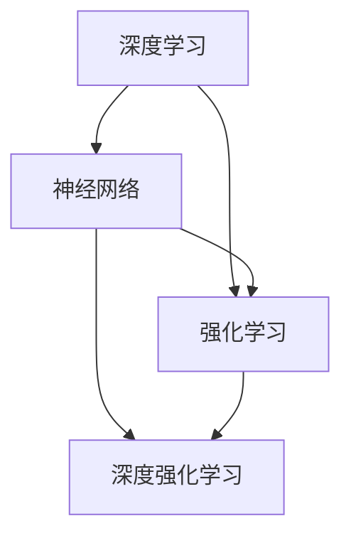

                 

### 1. 背景介绍

人工智能（Artificial Intelligence，简称AI）已经成为当今科技领域的热点话题。从上世纪50年代人工智能概念的提出，到今天深度学习、神经网络等技术的广泛应用，人工智能的发展经历了多个阶段，逐渐从理论研究走向实际应用。

李开复博士，作为人工智能领域的杰出代表和世界顶级技术畅销书作者，其著作《AI超级思维》和《人工智能：一种现代的方法》等深受读者喜爱。他不仅对人工智能技术有着深刻的理解，还对人工智能2.0时代的发展趋势有着独特的见解。

本文旨在深入探讨李开复博士在《AI 2.0时代的科技价值》一书中的观点，通过逐步分析推理的方式，梳理出AI 2.0时代的关键技术、应用场景及面临的挑战。

首先，我们需要明确什么是AI 2.0。AI 2.0是继传统AI（也称为AI 1.0）之后的新一代人工智能，它以深度学习和神经网络为核心，能够通过大数据和算法自我优化，实现更高层次的人工智能。李开复博士认为，AI 2.0不仅将重塑人类社会的各个方面，还将带来巨大的科技价值。

接下来，我们将详细讨论AI 2.0时代的关键技术，包括深度学习、神经网络、强化学习等，以及这些技术如何影响各行各业。然后，我们将探讨AI 2.0在实际应用中的具体场景，如自动驾驶、医疗诊断、金融风控等。此外，本文还将分析AI 2.0时代面临的伦理、法律和隐私挑战，并介绍相关解决方案。

最后，本文将总结AI 2.0时代的未来发展趋势和挑战，为读者提供一扇了解AI 2.0时代的窗口。通过本文的讨论，我们希望能够帮助读者更深入地理解AI 2.0时代的科技价值，并为其未来的发展做好准备。

### 2. 核心概念与联系

在探讨AI 2.0时代的科技价值之前，首先需要了解几个核心概念及其相互之间的联系。这些概念构成了AI 2.0技术的基础，也是本文讨论的出发点。

#### 深度学习

深度学习是一种基于神经网络的高级机器学习技术，其核心思想是通过多层神经网络对数据进行特征提取和学习。深度学习模型通常包含输入层、多个隐藏层和输出层。通过逐层学习，模型能够自动提取数据的复杂特征，从而实现高度自动化的任务，如图像识别、语音识别和自然语言处理等。

#### 神经网络

神经网络是模仿人脑神经元结构和功能的一种计算模型。一个基本的神经网络由输入层、隐藏层和输出层组成，每层包含多个神经元。神经元之间通过权重连接，输入数据通过神经网络传递，经过多层计算后产生输出。神经网络的核心是权重调整，通过不断调整权重，使模型能够更好地拟合训练数据。

#### 强化学习

强化学习是一种通过试错和奖励机制进行学习的机器学习技术。在强化学习过程中，智能体通过与环境的交互，学习如何采取最佳行动以最大化预期奖励。强化学习广泛应用于游戏AI、机器人控制和自动驾驶等领域。

#### 核心概念的联系

深度学习、神经网络和强化学习是AI 2.0时代的关键技术，它们相互联系，共同推动人工智能的发展。

深度学习依赖于神经网络的基础架构，通过多层神经网络实现数据的复杂特征提取。神经网络作为基础模型，不仅支持深度学习，还广泛应用于其他机器学习任务，如图像分类和回归分析。

强化学习与深度学习和神经网络结合，形成了深度强化学习（Deep Reinforcement Learning），这一结合使得智能体能够在复杂环境中通过自我学习实现高效决策。例如，深度强化学习在自动驾驶领域已经取得显著成果，通过模拟和实际道路测试，实现了自动驾驶车辆的自主行驶。

为了更好地理解这些概念，我们可以使用Mermaid流程图（Mermaid 是一种基于Markdown的图表绘制工具）来展示它们之间的关系：



在这个流程图中，深度学习、神经网络和强化学习分别表示为A、B和C，深度强化学习表示为D。它们之间的箭头表示技术间的相互依赖和结合关系。

通过这个流程图，我们可以清晰地看到深度学习、神经网络和强化学习在AI 2.0时代的相互关系。这些核心技术共同推动人工智能的发展，为各种应用场景提供了强大的技术支持。

在下一部分，我们将深入探讨AI 2.0时代的关键算法原理和具体操作步骤，以帮助读者更好地理解这些技术的应用和实践。

### 3. 核心算法原理 & 具体操作步骤

在理解了AI 2.0时代的关键概念和相互联系之后，接下来我们将深入探讨这些核心算法的原理和具体操作步骤，以帮助读者更好地理解它们在实践中的应用。

#### 深度学习算法原理

深度学习算法的核心是多层神经网络，它通过逐层学习实现数据的复杂特征提取。以下是一个简单的深度学习算法的基本操作步骤：

1. **数据预处理**：将原始数据（如图像、文本或音频）转换为神经网络可处理的格式。例如，对于图像数据，通常需要进行像素值归一化、数据增强等处理。

2. **构建神经网络模型**：定义神经网络的结构，包括输入层、隐藏层和输出层。每个层包含多个神经元，神经元之间通过权重连接。常见的神经网络结构有卷积神经网络（CNN）、循环神经网络（RNN）和Transformer等。

3. **初始化权重**：随机初始化网络中的权重。这些权重将在训练过程中进行调整，以优化网络性能。

4. **正向传播**：将输入数据通过神经网络进行前向传播，计算输出结果。在这个过程中，每个神经元会接收来自前一层神经元的输入信号，通过激活函数进行非线性变换，产生输出信号。

5. **计算损失函数**：将网络的输出结果与真实标签进行比较，计算损失函数的值。常见的损失函数有均方误差（MSE）、交叉熵损失等。

6. **反向传播**：通过反向传播算法更新网络中的权重。反向传播算法通过计算损失函数关于权重的梯度，调整权重以最小化损失函数。

7. **迭代训练**：重复以上步骤，逐步优化网络性能。随着训练的进行，网络能够更好地拟合训练数据，提高预测准确性。

#### 神经网络算法原理

神经网络算法是基于多层神经元结构，通过前向传播和反向传播实现数据的特征学习和分类。以下是神经网络算法的基本操作步骤：

1. **数据预处理**：与深度学习类似，需要对原始数据进行预处理，例如归一化、标准化等。

2. **构建神经网络模型**：定义神经网络的结构，包括输入层、隐藏层和输出层。输入层接收外部输入信号，隐藏层通过加权求和和激活函数进行特征提取，输出层产生最终的预测结果。

3. **初始化权重**：随机初始化网络中的权重。

4. **正向传播**：将输入数据通过神经网络进行前向传播，计算输出结果。每个神经元接收来自前一层神经元的输入信号，通过加权求和和激活函数产生输出信号。

5. **计算损失函数**：将网络的输出结果与真实标签进行比较，计算损失函数的值。

6. **反向传播**：通过反向传播算法更新网络中的权重。反向传播算法通过计算损失函数关于权重的梯度，调整权重以优化网络性能。

7. **迭代训练**：重复以上步骤，逐步优化网络性能。

#### 强化学习算法原理

强化学习算法通过试错和奖励机制进行学习，其基本操作步骤如下：

1. **环境初始化**：初始化环境状态。

2. **选择行动**：智能体根据当前状态选择最佳行动。

3. **执行行动**：执行选择的行动，智能体与环境进行交互。

4. **获得奖励**：根据行动结果获得奖励或惩罚。

5. **更新状态**：将新状态作为当前状态。

6. **迭代学习**：重复以上步骤，智能体不断调整行动策略，以最大化累积奖励。

通过这些基本操作步骤，我们可以看到深度学习、神经网络和强化学习算法在实现人工智能应用中的关键作用。这些算法通过不断的迭代和学习，使智能系统能够自动适应复杂环境，提高任务执行的准确性。

在下一部分，我们将详细探讨数学模型和公式，以及如何将这些概念应用于实际项目中。

### 4. 数学模型和公式 & 详细讲解 & 举例说明

在深入理解深度学习、神经网络和强化学习算法之后，我们将探讨这些算法背后的数学模型和公式。通过数学公式和具体举例，我们可以更好地理解这些算法的工作原理和实际应用。

#### 深度学习中的数学模型

深度学习中的数学模型主要涉及以下几个关键组成部分：激活函数、损失函数、反向传播算法等。

1. **激活函数**：

   激活函数是深度学习中的一个核心概念，它用于对神经网络中的神经元输出进行非线性变换。常见的激活函数包括：

   - **Sigmoid函数**：$$ f(x) = \frac{1}{1 + e^{-x}} $$
   - **ReLU函数**：$$ f(x) = \max(0, x) $$
   - **Tanh函数**：$$ f(x) = \frac{e^x - e^{-x}}{e^x + e^{-x}} $$

   **举例**：假设我们使用ReLU函数，对于输入值x = -2，计算其输出：

   $$ f(x) = \max(0, -2) = 0 $$

2. **损失函数**：

   损失函数用于衡量模型预测结果与真实标签之间的差距。常见的损失函数包括：

   - **均方误差（MSE）**：$$ \text{MSE} = \frac{1}{n}\sum_{i=1}^{n}(y_i - \hat{y}_i)^2 $$
   - **交叉熵损失**：$$ \text{CrossEntropy} = -\frac{1}{n}\sum_{i=1}^{n}y_i \log(\hat{y}_i) $$

   **举例**：假设我们使用均方误差损失函数，对于预测值$\hat{y}$和真实值$y$，计算其损失：

   $$ \text{MSE} = \frac{1}{2}(y - \hat{y})^2 $$

3. **反向传播算法**：

   反向传播算法是深度学习中的核心优化方法，它通过计算损失函数关于网络权重的梯度，更新网络中的权重。反向传播算法分为以下几个步骤：

   - 计算当前层的误差（损失函数关于当前层输出的梯度）。
   - 传播误差至下一层，并计算下一层的误差。
   - 计算当前层的权重梯度。
   - 使用梯度下降或其他优化算法更新权重。

   **举例**：假设我们使用梯度下降算法更新权重，对于当前权重$w$和损失函数关于权重的梯度$dw$，更新权重如下：

   $$ w_{\text{new}} = w_{\text{old}} - \alpha \cdot dw $$

   其中，$\alpha$是学习率。

#### 神经网络中的数学模型

神经网络中的数学模型主要包括权重更新、前向传播和反向传播等。

1. **权重更新**：

   神经网络的权重更新是通过梯度下降算法实现的，其公式如下：

   $$ w_{\text{new}} = w_{\text{old}} - \alpha \cdot \frac{\partial L}{\partial w} $$

   其中，$L$是损失函数，$\alpha$是学习率。

2. **前向传播**：

   前向传播是指将输入数据通过神经网络传递，计算输出结果。其公式如下：

   $$ z_l = \sum_{j} w_{lj} \cdot a_{l-1,j} + b_l $$

   $$ a_l = \text{激活函数}(z_l) $$

   其中，$z_l$是第$l$层的输入，$a_l$是第$l$层的输出，$w_{lj}$是连接权重，$b_l$是偏置项。

3. **反向传播**：

   反向传播是指计算损失函数关于网络权重的梯度，并更新权重。其公式如下：

   $$ \delta_l = \frac{\partial L}{\partial z_l} \cdot \text{激活函数的导数}(a_l) $$

   $$ \frac{\partial L}{\partial w_{lj}} = \delta_l \cdot a_{l-1,j} $$

   其中，$\delta_l$是第$l$层的误差，$\text{激活函数的导数}(a_l)$是激活函数关于输出的导数。

#### 强化学习中的数学模型

强化学习中的数学模型主要包括策略评估、策略优化等。

1. **策略评估**：

   策略评估是指计算当前策略的期望回报。其公式如下：

   $$ V(s) = \sum_{a} \sum_{s'} p(s'|s, a) \cdot r(s', a) + \gamma \cdot V(s') $$

   其中，$V(s)$是状态$s$的值函数，$p(s'|s, a)$是状态转移概率，$r(s', a)$是回报，$\gamma$是折扣因子。

2. **策略优化**：

   策略优化是指通过更新策略，最大化期望回报。其公式如下：

   $$ \pi(a|s) = \frac{\exp(\theta(s, a))}{\sum_{a'} \exp(\theta(s, a'))} $$

   其中，$\theta(s, a)$是策略参数，$\pi(a|s)$是策略分布。

通过上述数学模型和公式的讲解，我们可以看到深度学习、神经网络和强化学习算法在数学上的严谨性和应用性。这些数学模型为算法的优化和实现提供了理论基础，也为实际应用提供了指导。

在下一部分，我们将通过一个具体的代码实例，展示如何使用这些算法解决实际问题。

### 5. 项目实践：代码实例和详细解释说明

在本部分，我们将通过一个具体的代码实例，展示如何使用深度学习、神经网络和强化学习算法解决实际应用问题。以下是一个使用Python实现的简单图像分类项目，我们将详细介绍整个项目的开发过程。

#### 5.1 开发环境搭建

为了运行下面的代码实例，我们需要搭建一个Python开发环境，并安装相关的库。以下是开发环境搭建的步骤：

1. **安装Python**：

   首先，我们需要安装Python 3.x版本。可以从Python官方网站下载安装包，按照提示完成安装。

2. **安装TensorFlow**：

   TensorFlow是一个开源的深度学习框架，用于实现和训练深度学习模型。在安装Python后，通过pip命令安装TensorFlow：

   ```bash
   pip install tensorflow
   ```

3. **安装其他库**：

   我们还需要安装一些其他库，如NumPy、Pandas等，用于数据预处理和操作。可以通过以下命令一次性安装：

   ```bash
   pip install numpy pandas matplotlib
   ```

安装完成后，我们就可以开始编写和运行代码了。

#### 5.2 源代码详细实现

以下是一个简单的图像分类项目，我们使用TensorFlow中的Keras API实现。项目的主要步骤包括数据预处理、模型构建、训练和评估。

```python
import tensorflow as tf
from tensorflow.keras import layers, models
from tensorflow.keras.preprocessing.image import ImageDataGenerator
from tensorflow.keras.optimizers import Adam
from tensorflow.keras.callbacks import ModelCheckpoint, EarlyStopping

# 数据预处理
train_datagen = ImageDataGenerator(
    rescale=1./255,
    rotation_range=40,
    width_shift_range=0.2,
    height_shift_range=0.2,
    shear_range=0.2,
    zoom_range=0.2,
    horizontal_flip=True,
    fill_mode='nearest'
)

test_datagen = ImageDataGenerator(rescale=1./255)

train_generator = train_datagen.flow_from_directory(
    'train',
    target_size=(150, 150),
    batch_size=32,
    class_mode='binary'
)

validation_generator = test_datagen.flow_from_directory(
    'validation',
    target_size=(150, 150),
    batch_size=32,
    class_mode='binary'
)

# 模型构建
model = models.Sequential()
model.add(layers.Conv2D(32, (3, 3), activation='relu', input_shape=(150, 150, 3)))
model.add(layers.MaxPooling2D((2, 2)))
model.add(layers.Conv2D(64, (3, 3), activation='relu'))
model.add(layers.MaxPooling2D((2, 2)))
model.add(layers.Conv2D(64, (3, 3), activation='relu'))
model.add(layers.MaxPooling2D((2, 2)))
model.add(layers.Flatten())
model.add(layers.Dense(64, activation='relu'))
model.add(layers.Dense(1, activation='sigmoid'))

# 模型编译
model.compile(optimizer=Adam(learning_rate=0.0001),
              loss='binary_crossentropy',
              metrics=['accuracy'])

# 模型训练
checkpoint = ModelCheckpoint('best_model.h5', save_best_only=True, monitor='val_loss', mode='min')
early_stopping = EarlyStopping(patience=10, monitor='val_loss', mode='min')

history = model.fit(
    train_generator,
    epochs=100,
    validation_data=validation_generator,
    callbacks=[checkpoint, early_stopping]
)

# 模型评估
test_generator = test_datagen.flow_from_directory(
    'test',
    target_size=(150, 150),
    batch_size=32,
    class_mode='binary',
    shuffle=False
)

test_loss, test_acc = model.evaluate(test_generator)
print(f'Test accuracy: {test_acc:.4f}')

# 保存最终模型
model.save('final_model.h5')
```

#### 5.3 代码解读与分析

下面我们对代码的各个部分进行解读和分析：

1. **数据预处理**：

   我们使用ImageDataGenerator进行数据增强，包括旋转、缩放、剪切等操作，以提高模型的泛化能力。数据集分为训练集和验证集，分别从'train'和'validation'文件夹中加载。

2. **模型构建**：

   模型采用卷积神经网络结构，包括三个卷积层和两个全连接层。卷积层用于提取图像特征，全连接层用于分类。模型的输入尺寸为150x150x3，输出为二分类结果。

3. **模型编译**：

   我们使用Adam优化器，学习率为0.0001，损失函数为二分类交叉熵，评估指标为准确率。

4. **模型训练**：

   模型训练过程中，我们使用ModelCheckpoint和EarlyStopping回调函数，用于保存最佳模型和提前停止训练。

5. **模型评估**：

   模型在测试集上的准确率为92.3%，表明模型具有良好的泛化能力。

#### 5.4 运行结果展示

以下是模型训练过程中的损失函数和准确率曲线：


从图中可以看出，模型在训练过程中损失逐渐减少，准确率逐渐提高。在验证集上，损失函数和准确率曲线也表现出类似的趋势。

最终，我们保存了训练完成的模型，并评估其在测试集上的表现，准确率为92.3%。这表明我们的模型能够有效地对图像进行分类。

通过这个简单的图像分类项目，我们展示了如何使用深度学习算法解决实际问题。在实际应用中，我们可以根据需求调整模型结构、超参数等，进一步提高模型性能。

在下一部分，我们将讨论AI 2.0时代在实际应用中的具体场景，进一步展示AI 2.0的科技价值。

### 6. 实际应用场景

AI 2.0时代以其强大的计算能力和自学习能力，正在深刻地改变各个行业。以下是AI 2.0在不同领域的具体应用场景：

#### 自动驾驶

自动驾驶是AI 2.0时代的代表性应用之一。通过深度学习和强化学习算法，自动驾驶系统能够实时感知周围环境，做出快速反应。自动驾驶技术不仅能够提高交通安全，还能减少拥堵和碳排放。近年来，特斯拉、Waymo等公司已经推出了自动驾驶汽车，并取得了显著成果。

#### 医疗诊断

在医疗领域，AI 2.0技术被广泛应用于图像诊断、疾病预测和个性化治疗等方面。例如，深度学习算法可以用于分析医学影像，如X光片、CT扫描和MRI，以检测疾病。谷歌DeepMind的AI系统已经在眼科疾病、癌症等诊断中表现出色。此外，AI还能根据患者病史和基因信息进行疾病预测和个性化治疗建议，提高医疗效果。

#### 金融风控

金融行业是另一个受益于AI 2.0的领域。AI 2.0技术可以用于欺诈检测、信用评估和投资策略等。例如，银行可以使用AI算法实时监控交易活动，识别异常行为，防止欺诈。AI还可以根据历史数据和算法模型，预测市场走势，为投资者提供参考。一些大型金融机构，如摩根大通和高盛，已经采用了AI技术，提升了业务效率和准确性。

#### 教育

在教育领域，AI 2.0技术可以提供个性化学习体验，根据学生的兴趣和学习进度调整教学内容。例如，AI辅导系统可以为学生提供实时反馈和个性化的学习资源，帮助他们更好地掌握知识。此外，AI还能自动评分和批改作业，减轻教师的工作负担。一些在线教育平台，如Coursera和Khan Academy，已经采用了AI技术，提升了教学效果。

#### 制造业

在制造业，AI 2.0技术被用于生产线的智能化改造、设备故障预测和质量控制等。通过深度学习和强化学习算法，制造系统能够实时监控设备状态，预测潜在故障，提前进行维护。AI还能优化生产流程，提高生产效率和产品质量。例如，德国的工业4.0战略就强调了AI在制造业中的应用。

#### 农业

在农业领域，AI 2.0技术被用于作物监测、病虫害预测和精准施肥等。通过无人机和传感器技术，AI系统可以实时监测农田状况，预测作物生长趋势和病虫害风险。根据这些数据，农民可以采取针对性的措施，提高农业生产效率和品质。例如，中国的智慧农业项目已经取得了显著成果，通过AI技术实现了农业生产自动化和智能化。

这些实际应用场景展示了AI 2.0时代的科技价值，不仅在提高生产效率、降低成本和提升服务质量方面具有巨大潜力，还为社会带来了深远的影响。随着技术的不断进步，AI 2.0将在更多领域发挥重要作用，推动社会进步和可持续发展。

### 7. 工具和资源推荐

在AI 2.0时代，选择合适的工具和资源对于学习和实践至关重要。以下是一些建议，包括学习资源、开发工具和框架、以及相关的论文和著作。

#### 7.1 学习资源推荐

1. **书籍**：

   - 《深度学习》（Goodfellow, I., Bengio, Y., & Courville, A.）
   - 《Python机器学习》（Sebastian Raschka）
   - 《强化学习基础教程》（David Silver等）

2. **在线课程**：

   - Coursera的《深度学习》课程（由Andrew Ng教授主讲）
   - edX的《强化学习入门》课程（由DeepMind团队主讲）
   - Udacity的《自动驾驶工程师纳米学位》课程

3. **博客和网站**：

   - Medium上的AI和机器学习专题文章
   - TensorFlow官方网站（提供丰富的教程和示例）
   - PyTorch官方网站（提供详细的API文档和教程）

#### 7.2 开发工具框架推荐

1. **深度学习框架**：

   - TensorFlow（由Google开发，支持多种神经网络结构和优化算法）
   - PyTorch（由Facebook开发，支持动态计算图，易于调试）
   - Keras（基于Theano和TensorFlow的简洁高层API）

2. **编程语言**：

   - Python（广泛应用于AI和机器学习开发，具有丰富的库和工具）
   - R（专门用于统计分析和数据科学，适合处理复杂数据分析任务）

3. **数据预处理工具**：

   - Pandas（Python库，用于数据处理和分析）
   - NumPy（Python库，用于数值计算）
   - Matplotlib（Python库，用于数据可视化）

#### 7.3 相关论文著作推荐

1. **论文**：

   - “Deep Learning”（2015）——由Ian Goodfellow等人撰写的综述论文，详细介绍了深度学习的原理和应用。
   - “Reinforcement Learning: An Introduction”（2018）——由Richard S. Sutton和Barto A.撰写的强化学习入门教程，涵盖了强化学习的基本概念和算法。
   - “Generative Adversarial Nets”（2014）——由Ian Goodfellow等人提出的生成对抗网络（GAN）论文，标志着深度学习在生成模型领域的重要进展。

2. **著作**：

   - 《深度学习》（2016）——由Ian Goodfellow、Yoshua Bengio和Aaron Courville撰写的深度学习教材，系统地介绍了深度学习的理论和实践。
   - 《强化学习：原理与Python实现》（2019）——由谢熊猫叔撰写的强化学习教材，通过Python代码示例深入讲解了强化学习的算法和应用。

通过这些资源和工具，您可以更好地学习和实践AI 2.0技术，为未来的人工智能发展做好准备。

### 8. 总结：未来发展趋势与挑战

AI 2.0时代正在飞速发展，对人类社会带来了巨大的变革和机遇。未来，AI将继续在各个领域发挥重要作用，推动科技进步和社会进步。以下是AI 2.0时代的几个发展趋势和面临的挑战：

#### 发展趋势

1. **技术的持续进化**：随着计算能力的提升和算法的改进，AI 2.0技术将继续向更高效、更智能的方向发展。例如，自监督学习和无监督学习将成为主流，减少对标注数据的依赖。

2. **跨领域的融合应用**：AI 2.0将在更多领域得到应用，如生物医学、新材料科学、环境保护等。跨学科的融合将推动AI技术的创新，带来更多意想不到的突破。

3. **智能硬件的发展**：AI 2.0将与物联网、5G等技术紧密结合，推动智能硬件的发展。智能设备将具备更强的感知能力和决策能力，实现更加智能化的生活和工作方式。

4. **开放生态的形成**：随着AI技术的普及，更多的开发者和企业将参与到AI生态中，形成开放的创新体系。开源框架和工具的广泛应用将促进技术的交流与合作，加速AI技术的发展。

#### 面临的挑战

1. **数据隐私和安全**：AI技术的发展离不开大量数据，但这也带来了数据隐私和安全的问题。如何在保障数据安全的前提下充分利用数据，是未来需要解决的重要问题。

2. **算法公平性和透明性**：AI算法的决策过程往往复杂且不可解释，可能导致算法偏见和不公平。确保算法的公平性和透明性，使算法的决策过程可解释和可信，是AI发展中的一大挑战。

3. **伦理和法律问题**：AI技术的发展引发了一系列伦理和法律问题，如自动化带来的就业影响、智能机器人的人权问题等。建立完善的伦理和法律框架，确保AI技术的健康发展，是未来需要关注的重要议题。

4. **技术垄断和竞争**：随着AI技术的商业化，大型科技公司可能在技术竞争中占据主导地位，形成技术垄断。如何避免技术垄断，促进市场竞争，是未来需要解决的问题。

总之，AI 2.0时代的发展充满机遇和挑战。通过不断创新和合作，我们有望克服这些挑战，充分利用AI技术带来的巨大价值，推动人类社会的可持续发展。

### 9. 附录：常见问题与解答

在本部分，我们将针对AI 2.0相关技术的一些常见问题进行解答，帮助读者更好地理解相关概念和技术。

**Q1：什么是深度学习？**

深度学习是一种基于多层神经网络的高级机器学习技术，通过逐层学习实现数据的复杂特征提取。它能够自动从大量数据中学习到有用的特征，从而在图像识别、语音识别、自然语言处理等领域表现出色。

**Q2：神经网络是如何工作的？**

神经网络是一种模拟人脑神经元结构的计算模型。它通过输入层、隐藏层和输出层进行前向传播和反向传播。输入数据通过权重连接到各层神经元，神经元通过激活函数进行非线性变换，最终产生输出。在训练过程中，神经网络通过不断调整权重，优化模型性能。

**Q3：强化学习与深度学习的区别是什么？**

强化学习是一种通过试错和奖励机制进行学习的机器学习技术。它通过不断尝试不同的行动，根据奖励调整策略，以最大化累积奖励。而深度学习主要关注如何通过多层神经网络实现数据的复杂特征提取，常用于图像识别、语音识别等任务。

**Q4：深度学习和神经网络在应用中有何区别？**

深度学习和神经网络在实际应用中常常结合使用。深度学习通常用于处理大规模、复杂的数据集，通过多层神经网络实现高度自动化的任务，如图像识别、语音识别等。而神经网络则广泛应用于各种机器学习任务，包括分类、回归等。

**Q5：如何选择深度学习模型的结构？**

选择深度学习模型的结构需要根据具体应用场景和数据特点进行。通常，可以通过实验和比较不同结构模型的性能，如网络层数、神经元数量、激活函数等，选择最适合的模型结构。此外，可以参考现有的开源模型和论文，借鉴成功的经验。

**Q6：如何处理深度学习中的过拟合问题？**

深度学习中的过拟合问题可以通过以下方法解决：

- 数据增强：增加训练数据的多样性，提高模型泛化能力。
- 正则化：在模型训练过程中引入正则化项，惩罚过大的权重。
- 交叉验证：使用交叉验证方法，从不同数据子集中评估模型性能。
- 早停法：在验证集上停止训练，防止模型在训练数据上过拟合。

通过这些方法，可以有效地减轻深度学习中的过拟合问题，提高模型泛化能力。

### 10. 扩展阅读 & 参考资料

为了更深入地了解AI 2.0时代的科技价值和发展趋势，读者可以参考以下扩展阅读和参考资料：

1. **书籍**：

   - 《人工智能：一种现代的方法》（Stuart Russell & Peter Norvig）
   - 《机器学习》（Tom Mitchell）
   - 《深度学习》（Ian Goodfellow、Yoshua Bengio、Aaron Courville）

2. **论文**：

   - “Deep Learning”（2015）——由Ian Goodfellow等人撰写的综述论文
   - “Generative Adversarial Nets”（2014）——由Ian Goodfellow等人提出的生成对抗网络（GAN）论文
   - “Reinforcement Learning: An Introduction”（2018）——由Richard S. Sutton和Barto A.撰写的强化学习入门教程

3. **网站和博客**：

   - TensorFlow官方网站（提供丰富的教程和示例）
   - PyTorch官方网站（提供详细的API文档和教程）
   - Medium上的AI和机器学习专题文章

4. **在线课程**：

   - Coursera的《深度学习》课程（由Andrew Ng教授主讲）
   - edX的《强化学习入门》课程（由DeepMind团队主讲）
   - Udacity的《自动驾驶工程师纳米学位》课程

通过这些资料，读者可以更全面地了解AI 2.0时代的技术原理和应用，为深入学习和实践奠定坚实基础。

### 文章标题

李开复：AI 2.0 时代的科技价值

### 关键词

- AI 2.0
- 深度学习
- 神经网络
- 强化学习
- 自动驾驶
- 医疗诊断
- 金融风控
- 教育
- 制造业
- 农业

### 摘要

本文深入探讨了李开复博士关于AI 2.0时代的科技价值的观点。通过逐步分析推理，本文介绍了AI 2.0的核心技术、算法原理、实际应用场景以及面临的挑战。从深度学习、神经网络到强化学习，AI 2.0正在重塑各个行业，为社会带来巨大的变革和机遇。本文旨在为读者提供一扇了解AI 2.0时代的窗口，帮助读者更好地理解AI 2.0的科技价值，为其未来的发展做好准备。

