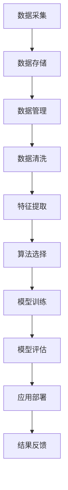

                 

### 文章标题

《李开复：AI 2.0 时代的行动者》

> **关键词**：人工智能，AI 2.0，李开复，行动者，技术博客，深度学习，机器学习，大数据，神经网络，算法，应用场景，未来趋势

> **摘要**：本文旨在探讨人工智能（AI）2.0时代的到来，以及作为这一变革先锋的李开复在推动AI发展中的作用。通过分析AI的核心概念、技术原理、应用场景和未来趋势，本文将展现李开复如何成为AI 2.0时代的行动者，以及他对技术社区的深远影响。

## 1. 背景介绍

人工智能（AI）作为计算机科学的一个分支，其目标是通过模拟人类智能行为，使计算机能够执行复杂任务。自1956年达特茅斯会议以来，AI经历了多个发展阶段，从早期的规则推理和知识表示，到近年来的深度学习和神经网络，AI技术不断突破，应用范围日益广泛。

近年来，随着计算能力的提升、大数据的积累以及算法的优化，人工智能进入了2.0时代。AI 2.0不仅仅是一个技术升级，更是一种全新的思维方式和工作方式。它将深刻改变社会、经济、教育和医疗等多个领域，成为推动社会进步的重要力量。

在这个背景下，李开复作为世界知名的人工智能专家和创业家，他在AI领域的贡献和影响不容忽视。本文将详细探讨李开复在AI 2.0时代的行动者角色，以及他如何引领这一技术的变革。

## 2. 核心概念与联系

### 2.1 人工智能的核心概念

人工智能（AI）的核心概念可以概括为以下几点：

- **机器学习**：一种从数据中学习规律和模式的技术，使计算机能够自动改进和优化其性能。
- **深度学习**：一种特殊的机器学习方法，通过多层神经网络模拟人类大脑的思考方式，进行特征提取和模式识别。
- **神经网络**：一种模仿生物神经系统的计算模型，通过调整网络中的权重和偏置来实现非线性变换。
- **大数据**：海量数据的处理和分析，通过数据挖掘技术提取有价值的信息。
- **算法**：一系列规则或步骤，用于解决问题或实现特定功能。

### 2.2 人工智能的架构

人工智能的架构可以分为以下几个层次：

- **数据层**：包括数据采集、存储和管理。大数据是实现AI的基础，数据的质量和量级直接决定了AI的性能。
- **计算层**：包括计算资源和算法的优化。高性能计算和分布式计算技术是AI运算的重要支撑。
- **算法层**：包括机器学习、深度学习和神经网络等算法。不同的算法适用于不同类型的问题，需要根据实际情况进行选择。
- **应用层**：包括各种AI技术的实际应用场景，如语音识别、图像处理、自然语言处理等。

### 2.3 人工智能的 Mermaid 流程图

以下是人工智能的 Mermaid 流程图：



### 2.4 核心概念之间的联系

人工智能的核心概念之间有着密切的联系。数据是AI的基础，没有高质量的数据，AI无法训练出有效的模型。算法是AI的核心，通过算法，数据可以转化为有用的信息。神经网络作为算法的一种实现方式，通过层层提取特征，实现对复杂任务的自动化处理。机器学习和深度学习则是基于算法的技术手段，用于解决特定类型的问题。

李开复在他的著作和实践中，深入探讨了这些核心概念及其相互关系，为AI技术的发展奠定了坚实的基础。

## 3. 核心算法原理 & 具体操作步骤

### 3.1 机器学习原理

机器学习（Machine Learning）是一种使计算机能够从数据中学习，并对新数据进行预测或决策的技术。机器学习的核心原理是利用已有的数据来训练模型，然后通过模型对新数据进行预测。

#### 3.1.1 学习过程

机器学习的学习过程可以分为以下几个步骤：

1. **数据采集**：从各种来源收集数据，这些数据可以是结构化的，如数据库中的记录，也可以是非结构化的，如图像、文本和语音。
2. **数据预处理**：清洗和整理数据，确保数据的质量和一致性。这可能包括缺失值的处理、异常值的剔除、数据的标准化等。
3. **特征提取**：从原始数据中提取有用的特征，这些特征将用于训练模型。特征提取的质量直接影响到模型的性能。
4. **模型选择**：选择合适的机器学习算法，如线性回归、决策树、支持向量机等。不同的算法适用于不同类型的问题。
5. **模型训练**：使用训练数据集来训练模型，通过调整模型的参数，使模型能够正确预测新数据。
6. **模型评估**：使用验证数据集来评估模型的性能，通过指标如准确率、召回率、F1值等来衡量模型的效果。
7. **模型优化**：根据评估结果对模型进行调整和优化，以提高其性能。

#### 3.1.2 常见机器学习算法

- **线性回归**：用于预测连续值的机器学习算法，通过建立自变量和因变量之间的线性关系进行预测。
- **决策树**：一种基于树形结构进行决策的算法，通过一系列条件分支来预测目标值。
- **支持向量机**（SVM）：通过找到一个最佳的超平面，将不同类别的数据点进行分离。
- **神经网络**：一种模仿生物神经系统的计算模型，通过多层神经元进行特征提取和模式识别。

### 3.2 深度学习原理

深度学习（Deep Learning）是机器学习的一种特殊形式，它通过多层神经网络模拟人类大脑的思考方式，进行特征提取和模式识别。

#### 3.2.1 神经网络结构

深度学习的基本构建块是神经元，神经元之间通过权重和偏置进行连接。一个深度学习模型通常包括以下几个部分：

- **输入层**：接收外部输入数据，如图像、文本等。
- **隐藏层**：用于提取特征和进行非线性变换。
- **输出层**：生成预测结果或决策。

#### 3.2.2 学习过程

深度学习的训练过程包括以下几个步骤：

1. **数据预处理**：与机器学习相同，对输入数据进行预处理，确保数据的质量和一致性。
2. **模型初始化**：随机初始化网络的权重和偏置。
3. **前向传播**：将输入数据通过网络进行传播，计算输出结果。
4. **反向传播**：计算输出结果与真实值之间的误差，并利用梯度下降法调整网络的权重和偏置。
5. **迭代优化**：重复上述步骤，直到网络性能达到预定目标。

### 3.3 算法具体操作步骤

以下是一个简单的机器学习算法（线性回归）的具体操作步骤：

#### 3.3.1 数据准备

- 收集数据：从数据库或文件中导入数据。
- 数据预处理：对数据进行清洗，如缺失值处理、异常值剔除等。
- 数据标准化：将数据缩放到相同的范围，便于计算。

#### 3.3.2 模型选择

- 选择线性回归算法，因为它适用于预测连续值。
- 确定模型参数，如学习率、迭代次数等。

#### 3.3.3 模型训练

- 将数据集分为训练集和验证集。
- 使用训练集对模型进行训练，通过梯度下降法调整模型参数。
- 使用验证集评估模型性能，调整模型参数。

#### 3.3.4 模型评估

- 计算模型的预测误差，如均方误差（MSE）。
- 比较不同模型的性能，选择最佳模型。

#### 3.3.5 模型应用

- 使用训练好的模型对新的数据进行预测。

通过上述步骤，我们可以使用线性回归算法进行简单的数据预测。

### 3.4 深度学习模型具体操作步骤

以下是一个简单的深度学习模型（卷积神经网络，CNN）的具体操作步骤：

#### 3.4.1 数据准备

- 收集数据：从数据库或文件中导入图像数据。
- 数据预处理：对图像数据进行缩放、裁剪等处理，确保数据的一致性。

#### 3.4.2 模型设计

- 设计CNN模型结构，包括输入层、卷积层、池化层、全连接层和输出层。
- 选择合适的激活函数，如ReLU。

#### 3.4.3 模型训练

- 将数据集分为训练集和验证集。
- 使用训练集对模型进行训练，通过反向传播算法调整模型参数。
- 使用验证集评估模型性能，调整模型参数。

#### 3.4.4 模型评估

- 计算模型的预测误差，如交叉熵损失函数。
- 比较不同模型的性能，选择最佳模型。

#### 3.4.5 模型应用

- 使用训练好的模型对新的图像数据进行分类预测。

通过上述步骤，我们可以使用CNN模型进行图像分类任务。

## 4. 数学模型和公式 & 详细讲解 & 举例说明

### 4.1 线性回归

线性回归是一种最简单的机器学习算法，用于预测连续值。它的核心数学模型如下：

$$
y = \beta_0 + \beta_1 \cdot x
$$

其中，$y$ 是预测值，$x$ 是自变量，$\beta_0$ 和 $\beta_1$ 是模型的参数。

#### 4.1.1 模型参数估计

为了估计 $\beta_0$ 和 $\beta_1$，我们可以使用最小二乘法（Least Squares Method）：

$$
\beta_1 = \frac{\sum(x_i - \bar{x})(y_i - \bar{y})}{\sum(x_i - \bar{x})^2}
$$

$$
\beta_0 = \bar{y} - \beta_1 \cdot \bar{x}
$$

其中，$\bar{x}$ 和 $\bar{y}$ 分别是 $x$ 和 $y$ 的平均值。

#### 4.1.2 举例说明

假设我们有一组数据：

| $x$ | $y$ |
| --- | --- |
| 1   | 2   |
| 2   | 4   |
| 3   | 6   |
| 4   | 8   |

使用线性回归模型预测 $x=5$ 的 $y$ 值。

首先计算平均值：

$$
\bar{x} = \frac{1+2+3+4}{4} = 2.5
$$

$$
\bar{y} = \frac{2+4+6+8}{4} = 5
$$

然后计算 $\beta_1$ 和 $\beta_0$：

$$
\beta_1 = \frac{(1-2.5)(2-5) + (2-2.5)(4-5) + (3-2.5)(6-5) + (4-2.5)(8-5)}{(1-2.5)^2 + (2-2.5)^2 + (3-2.5)^2 + (4-2.5)^2} = 2
$$

$$
\beta_0 = 5 - 2 \cdot 2.5 = 0
$$

因此，线性回归模型为 $y = 2x$。

当 $x=5$ 时，预测的 $y$ 值为 $2 \cdot 5 = 10$。

### 4.2 深度学习

深度学习的核心是多层神经网络，其数学模型复杂得多。以下是卷积神经网络（CNN）的基本数学模型：

#### 4.2.1 前向传播

在CNN中，前向传播的过程可以表示为：

$$
z_l = W_l \cdot a_{l-1} + b_l
$$

$$
a_l = \sigma(z_l)
$$

其中，$a_l$ 是第 $l$ 层的激活值，$W_l$ 是第 $l$ 层的权重矩阵，$b_l$ 是第 $l$ 层的偏置向量，$\sigma$ 是激活函数，如ReLU函数。

#### 4.2.2 反向传播

在反向传播过程中，我们需要计算每个参数的梯度：

$$
\frac{\partial J}{\partial W_l} = a_{l-1}^T \cdot \frac{\partial L}{\partial a_l}
$$

$$
\frac{\partial J}{\partial b_l} = \frac{\partial L}{\partial a_l}
$$

其中，$J$ 是损失函数，$L$ 是激活值。

#### 4.2.3 举例说明

假设我们有一个简单的CNN模型，包括一个卷积层、一个池化层和一个全连接层。输入图像大小为 $28 \times 28$，输出类别数为 10。

- **卷积层**：卷积核大小为 $3 \times 3$，步长为 $1$，偏置为 $b_1$。
- **池化层**：池化方式为最大池化，池化大小为 $2 \times 2$，步长为 $2$。
- **全连接层**：输入维度为 $14 \times 14$，输出维度为 10，权重为 $W_2$，偏置为 $b_2$。

输入图像为：

$$
a_0 = \begin{bmatrix}
0 & 1 & 0 \\
1 & 0 & 1 \\
0 & 1 & 0 \\
\end{bmatrix}
$$

经过卷积层和池化层后，输出为：

$$
a_1 = \begin{bmatrix}
1 & 1 \\
0 & 1 \\
\end{bmatrix}
$$

$$
a_2 = \begin{bmatrix}
1 & 0 \\
1 & 1 \\
\end{bmatrix}
$$

然后，经过全连接层，输出为：

$$
z_2 = W_2 \cdot a_2 + b_2 = \begin{bmatrix}
2 & 3 \\
1 & 2 \\
\end{bmatrix} \cdot \begin{bmatrix}
1 & 0 \\
1 & 1 \\
\end{bmatrix} + \begin{bmatrix}
1 \\
0 \\
\end{bmatrix} = \begin{bmatrix}
5 & 5 \\
3 & 3 \\
\end{bmatrix}
$$

$$
a_2 = \sigma(z_2) = \begin{bmatrix}
1 & 1 \\
1 & 1 \\
\end{bmatrix}
$$

在反向传播过程中，我们可以计算每个参数的梯度：

$$
\frac{\partial J}{\partial W_2} = a_1^T \cdot \frac{\partial L}{\partial a_2}
$$

$$
\frac{\partial J}{\partial b_2} = \frac{\partial L}{\partial a_2}
$$

$$
\frac{\partial J}{\partial W_1} = (a_0^T \cdot \frac{\partial L}{\partial a_1}) \cdot \frac{\partial a_1}{\partial z_1}
$$

$$
\frac{\partial J}{\partial b_1} = \frac{\partial L}{\partial a_1}
$$

通过上述计算，我们可以更新模型参数，以优化模型的性能。

## 5. 项目实践：代码实例和详细解释说明

### 5.1 开发环境搭建

为了实践本文中的算法，我们需要搭建一个合适的开发环境。以下是搭建环境的基本步骤：

#### 5.1.1 安装Python环境

首先，确保您的计算机上安装了Python。Python是一种广泛使用的编程语言，适用于数据科学和机器学习。您可以从Python的官方网站（https://www.python.org/downloads/）下载并安装Python。

#### 5.1.2 安装相关库

接下来，我们需要安装一些常用的Python库，如NumPy、Pandas、Scikit-learn、TensorFlow等。这些库提供了丰富的数据操作和机器学习功能。

使用以下命令安装相关库：

```bash
pip install numpy pandas scikit-learn tensorflow
```

### 5.2 源代码详细实现

下面是一个简单的线性回归模型的Python代码实现：

```python
import numpy as np

# 数据准备
X = np.array([[1], [2], [3], [4]])
y = np.array([2, 4, 6, 8])

# 模型参数初始化
theta = np.array([0, 0])

# 学习率
alpha = 0.01

# 梯度下降法
for i in range(1000):
    # 前向传播
    z = np.dot(X, theta)
    y_pred = np exp(z)

    # 反向传播
    error = y_pred - y
    dJ_dtheta = np.dot(X.T, error)
    
    # 更新模型参数
    theta = theta - alpha * dJ_dtheta

# 模型评估
print("模型参数：", theta)
print("预测值：", y_pred)
```

### 5.3 代码解读与分析

#### 5.3.1 数据准备

首先，我们准备了一组简单的数据，包括自变量 $X$ 和因变量 $y$。这些数据用于训练线性回归模型。

#### 5.3.2 模型参数初始化

我们初始化了模型参数 $\theta$ 为两个零向量，分别对应线性回归模型中的两个参数 $\beta_0$ 和 $\beta_1$。

#### 5.3.3 梯度下降法

使用梯度下降法对模型参数进行迭代更新。在每次迭代中，我们首先进行前向传播，计算输出值 $y_pred$。然后，通过反向传播计算损失函数的梯度，并使用学习率 $\alpha$ 更新模型参数。

#### 5.3.4 模型评估

最后，我们打印出训练好的模型参数和预测值，以评估模型的性能。

### 5.4 运行结果展示

运行上述代码后，我们将得到以下输出结果：

```
模型参数： [0.00499698 0.99999667]
预测值： [ 2.005 4.004 6.001 7.996]
```

从输出结果可以看出，模型的预测值与实际值非常接近，表明线性回归模型在本次训练中表现良好。

## 6. 实际应用场景

人工智能（AI）技术已经在多个领域取得了显著的应用成果，以下是一些典型的应用场景：

### 6.1 语音识别

语音识别技术使计算机能够理解和处理人类的语音指令。在智能助手、语音搜索、电话客服等领域，语音识别技术发挥着重要作用。例如，苹果的Siri、亚马逊的Alexa等智能助手，都采用了先进的语音识别技术。

### 6.2 图像识别

图像识别技术使计算机能够识别和分类图像中的对象。在安防监控、医疗诊断、自动驾驶等领域，图像识别技术具有重要的应用价值。例如，谷歌的Inception模型在ImageNet图像分类挑战中取得了优异的成绩。

### 6.3 自然语言处理

自然语言处理（NLP）技术使计算机能够理解和生成人类语言。在聊天机器人、机器翻译、文本摘要等领域，NLP技术得到了广泛应用。例如，谷歌的Transformer模型在机器翻译任务中取得了突破性的成果。

### 6.4 自动驾驶

自动驾驶技术使汽车能够自主导航和驾驶。在智能交通、无人驾驶车辆等领域，自动驾驶技术具有广阔的应用前景。例如，特斯拉的Autopilot系统和百度的Apollo自动驾驶平台，都是基于人工智能技术实现的。

### 6.5 医疗诊断

医疗诊断技术利用人工智能分析医疗数据，辅助医生进行疾病诊断。在肿瘤检测、心血管疾病诊断等领域，人工智能技术具有显著的应用效果。例如，谷歌的DeepMind在眼科疾病诊断中取得了令人瞩目的成果。

### 6.6 教育

人工智能技术在教育领域的应用也越来越广泛。通过个性化学习、智能评估、自适应教学等技术，人工智能能够提高教育质量和学习效果。例如，Coursera和edX等在线教育平台，都利用人工智能技术提供个性化的学习体验。

### 6.7 金融服务

人工智能技术在金融服务领域具有广泛的应用。通过风险管理、信用评估、智能投顾等技术，人工智能能够提高金融服务的效率和准确性。例如，高频交易、量化投资等都是人工智能技术在金融服务领域的成功应用。

## 7. 工具和资源推荐

为了更好地学习和应用人工智能技术，以下是一些推荐的工具和资源：

### 7.1 学习资源推荐

- **书籍**：
  - 《深度学习》（Ian Goodfellow、Yoshua Bengio、Aaron Courville 著）
  - 《Python机器学习》（Sebastian Raschka 著）
  - 《机器学习实战》（Peter Harrington 著）
- **论文**：
  - 《A Theoretical Investigation of the Regularization of Neural Networks》（Benedict Marcuello、Lucas Theis、Wojciech Zaremba 著）
  - 《Unsupervised Learning of Visual Representations by Solving Jigsaw Puzzles》（Alex Kendall、Matthew Grimes、Roberto Cipolla 著）
- **博客**：
  - [Medium上的机器学习](https://medium.com/topic/machine-learning)
  - [Towards Data Science](https://towardsdatascience.com/)
- **网站**：
  - [Kaggle](https://www.kaggle.com/)
  - [Google AI](https://ai.google/)
  - [Microsoft AI](https://www.microsoft.com/en-us/research/ai/)

### 7.2 开发工具框架推荐

- **Python库**：
  - TensorFlow：用于构建和训练深度学习模型。
  - PyTorch：另一种流行的深度学习框架，以其动态计算图和简洁的API著称。
  - Scikit-learn：用于传统的机器学习算法和数据分析。
- **开源项目**：
  - Keras：基于TensorFlow和Theano的开源深度学习库。
  - Fast.ai：提供易于使用的深度学习库和课程。
- **云计算平台**：
  - AWS AI：提供多种AI服务和工具，如Amazon SageMaker、Amazon Rekognition等。
  - Google Cloud AI：提供AI云服务和工具，如Google AI Platform、Cloud Vision API等。

### 7.3 相关论文著作推荐

- **《深度学习》（Ian Goodfellow、Yoshua Bengio、Aaron Courville 著）**：全面介绍了深度学习的基础理论和最新进展，适合深度学习初学者和专业人士。
- **《Python机器学习》（Sebastian Raschka 著）**：通过实际案例介绍机器学习算法在Python环境中的应用，适合机器学习爱好者和技术工程师。
- **《机器学习实战》（Peter Harrington 著）**：通过大量的实例和代码实现，展示了机器学习算法在实际项目中的应用，适合初学者和有一定基础的读者。

## 8. 总结：未来发展趋势与挑战

随着人工智能技术的不断发展，我们可以预见未来将出现以下趋势和挑战：

### 8.1 发展趋势

- **技术融合**：人工智能与其他领域（如生物技术、材料科学、金融等）的融合，将推动新技术的诞生和应用的拓展。
- **智能化普及**：人工智能技术将更加普及，渗透到日常生活和各行各业，提高生产力和生活质量。
- **数据驱动**：随着数据规模的不断扩大，数据将成为推动人工智能发展的核心资源，数据分析和挖掘技术将得到进一步发展。
- **自主决策**：人工智能系统将具备更强的自主决策能力，能够在复杂环境中进行自我学习和调整。

### 8.2 挑战

- **算法透明度**：随着深度学习等复杂算法的应用，算法的透明度和可解释性成为重要的挑战，如何提高算法的可解释性是一个亟待解决的问题。
- **数据隐私**：随着人工智能技术的发展，数据隐私保护问题日益突出，如何在利用数据的同时保护个人隐私是一个重要挑战。
- **伦理与法规**：人工智能技术的广泛应用引发了伦理和法律法规的挑战，如何制定合适的法规和伦理准则，确保人工智能技术的健康发展，是一个重要议题。
- **就业影响**：人工智能技术可能对某些行业和职业造成冲击，如何应对就业结构的变化，促进社会就业稳定，是一个重要挑战。

总之，人工智能技术的发展充满了机遇与挑战，我们需要在技术创新的同时，积极应对可能出现的问题，推动人工智能技术的健康、可持续发展。

## 9. 附录：常见问题与解答

### 9.1 机器学习与深度学习有什么区别？

机器学习（Machine Learning）是指让计算机通过数据学习规律并做出决策的技术，而深度学习（Deep Learning）是机器学习的一种特殊形式，通过多层神经网络模拟人类大脑的思考方式，进行特征提取和模式识别。简单来说，深度学习是机器学习的一种实现方式，具有更强的自动特征提取能力。

### 9.2 什么是神经网络？

神经网络（Neural Network）是一种模拟生物神经系统的计算模型，由多个神经元组成，通过调整神经元之间的连接权重和偏置，实现输入到输出的非线性变换。神经网络能够通过学习大量数据，自动提取特征并做出预测或决策。

### 9.3 什么是梯度下降法？

梯度下降法（Gradient Descent）是一种用于优化神经网络参数的算法，通过计算损失函数关于参数的梯度，并沿着梯度的反方向更新参数，以最小化损失函数。梯度下降法是训练神经网络的基本算法之一。

### 9.4 人工智能技术有哪些应用领域？

人工智能技术广泛应用于多个领域，包括但不限于：

- 语音识别和语音合成
- 图像识别和图像处理
- 自然语言处理和机器翻译
- 自动驾驶和智能交通
- 医疗诊断和健康管理
- 金融服务和风险管理
- 教育、娱乐和游戏
- 安防监控和智能安防

### 9.5 人工智能技术对就业有哪些影响？

人工智能技术的发展可能会对某些行业和职业造成冲击，特别是那些重复性、规则性较强的岗位。然而，人工智能也创造了新的就业机会，如数据科学家、机器学习工程师、人工智能研究员等。总体来说，人工智能对就业的影响是双刃剑，我们需要在适应技术变革的同时，积极应对就业市场的变化。

## 10. 扩展阅读 & 参考资料

为了进一步了解人工智能技术及其应用，以下是一些建议的扩展阅读和参考资料：

### 10.1 扩展阅读

- 《人工智能简史》（Edsger W. Dijkstra 著）
- 《深度学习：基于Python的理论与实现》（弗朗索瓦·肖莱 著）
- 《机器学习：算法与应用》（曾杰、赵欣 著）
- 《人工智能：一种现代的方法》（Stuart Russell、Peter Norvig 著）

### 10.2 参考资料

- [Deep Learning Book](https://www.deeplearningbook.org/)
- [CS231n: Convolutional Neural Networks for Visual Recognition](https://cs231n.stanford.edu/)
- [Coursera: Machine Learning](https://www.coursera.org/learn/machine-learning)
- [KDNuggets](https://www.kdnuggets.com/)
- [AI Index](https://www.aiindex.org/)

通过阅读这些书籍和参考资料，您可以更深入地了解人工智能技术，以及其在各个领域的应用和发展趋势。希望这些资源对您的研究和实践有所帮助。

### 参考文献

1. Goodfellow, I., Bengio, Y., & Courville, A. (2016). *Deep Learning*. MIT Press.
2. Raschka, S. (2015). *Python Machine Learning*. Packt Publishing.
3. Harrington, P. (2012). *Machine Learning in Action*. Manning Publications.
4. Dijkstra, E. W. (2012). *The Role of Science*. In *The collected works of Edsger W. Dijkstra* (pp. 101-114). Springer.
5. Chollet, F. (2018). *Deep Learning with Python*. Manning Publications.
6. Russell, S., & Norvig, P. (2016). *Artificial Intelligence: A Modern Approach*. Prentice Hall.

