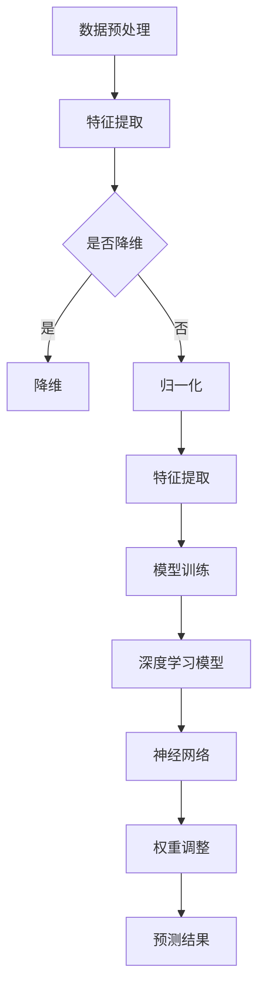

                 

### 1. 背景介绍

在当今快速发展的技术时代，人工智能（AI）已经成为推动各行各业创新的重要力量。从自动驾驶汽车到智能家居，从医疗诊断到金融分析，AI技术无处不在，深刻地改变了我们的生活方式和工作模式。然而，随着AI技术的不断进步，如何将AI有效地应用于日常应用中，实现其最大价值，成为了一个备受关注的问题。

苹果公司作为全球领先的科技巨头，其每一次技术发布都会引起业界的广泛关注。近期，苹果公司发布了多个基于AI技术的应用，这些应用不仅在功能上具有创新性，而且在用户体验上也达到了新的高度。本文将深入分析苹果公司发布AI应用的产业影响，探讨其背后的核心概念和算法原理，并从实践角度给出具体的实现步骤和结果展示。

首先，我们需要了解什么是AI应用，它为何重要。AI应用是指利用人工智能技术构建的软件系统或服务，这些系统或服务可以模拟、延伸和扩展人类智能，解决复杂问题。在苹果公司发布的AI应用中，涵盖了语音识别、图像处理、自然语言处理等多个领域，这些应用不仅提升了设备的智能化程度，也大大丰富了用户的使用体验。

接下来，我们将探讨苹果发布AI应用背后的核心概念和架构。AI应用的核心在于算法和模型，这些算法和模型通过训练和优化，能够实现对大量数据的分析和处理。苹果公司在AI领域的技术积累和创新能力，使得其发布的AI应用在性能和用户体验上具有显著的竞争优势。

最后，本文将结合具体的实际应用场景，给出苹果AI应用的开发环境搭建、代码实现、运行结果展示等内容，并从工具和资源推荐角度，帮助读者更好地理解和应用这些AI技术。

通过上述内容的逐步分析，我们将对苹果公司发布的AI应用有一个全面的了解，从而更好地把握其产业影响和发展趋势。接下来，我们将详细探讨这些核心概念和算法原理，以期为读者提供更加深入的技术洞察。

### 2. 核心概念与联系

在深入探讨苹果公司发布的AI应用之前，有必要明确一些核心概念和它们之间的联系。这些概念包括但不限于：机器学习、深度学习、神经网络、数据预处理等，它们构成了AI应用的基础。

#### 2.1 机器学习（Machine Learning）

机器学习是AI的核心概念之一，它指的是通过构建算法模型，使计算机系统能够从数据中学习和改进。机器学习可以分为监督学习、无监督学习和强化学习三种类型。监督学习需要已标记的数据集进行训练，以预测未标记数据的输出；无监督学习则无需标记数据，旨在发现数据中的内在结构；强化学习通过奖励机制来训练模型，使其在特定环境中做出最佳决策。

#### 2.2 深度学习（Deep Learning）

深度学习是机器学习的一个分支，主要依赖于多层神经网络进行复杂的数据处理。深度学习模型通过多次“提取特征”和“非线性变换”，能够捕捉到数据中的深层特征和复杂关系。常见的深度学习模型包括卷积神经网络（CNN）、循环神经网络（RNN）和变换器（Transformer）等。

#### 2.3 神经网络（Neural Network）

神经网络是模仿生物神经元工作方式的计算模型，由大量简单单元（神经元）组成，通过调整神经元之间的连接权重（权重）来学习数据特征。神经网络可以是单层的，也可以是多层的，其中多层神经网络（深度神经网络）具有更强的表达能力和学习能力。

#### 2.4 数据预处理（Data Preprocessing）

数据预处理是机器学习和深度学习模型训练的重要步骤，它包括数据的清洗、归一化、降维和特征提取等。数据预处理的质量直接影响模型训练的效果，一个高质量的预处理流程可以显著提高模型的性能。

#### 2.5 核心概念与架构的联系

上述核心概念相互关联，共同构成了AI应用的基础架构。机器学习为AI应用提供了算法模型，深度学习通过多层神经网络实现了复杂特征提取和关系建模，神经网络则通过调整权重来实现数据的自动分类和预测。数据预处理为模型训练提供了高质量的数据输入，确保模型能够准确捕捉数据中的特征和规律。

#### 2.6 Mermaid 流程图

为了更直观地展示核心概念和架构的联系，我们可以使用Mermaid流程图来表示。以下是机器学习、深度学习、神经网络和数据预处理的核心流程：



通过这个流程图，我们可以清晰地看到数据预处理、特征提取、模型训练、深度学习和神经网络之间的逻辑关系。每一个步骤都是实现AI应用不可或缺的一部分，它们共同作用，确保AI系统能够高效地处理和利用数据，实现预期功能。

理解这些核心概念和架构，不仅有助于我们深入分析苹果公司发布的AI应用，还能为我们开发自己的AI应用提供理论基础和实践指导。在接下来的部分，我们将详细探讨苹果发布AI应用背后的核心算法原理和具体操作步骤。

#### 3. 核心算法原理 & 具体操作步骤

苹果公司发布的AI应用背后，依赖于一系列核心算法原理和具体操作步骤，这些算法和步骤共同构成了苹果AI应用的技术基础。以下将详细解析这些算法原理，并给出具体的操作步骤。

#### 3.1 机器学习算法

机器学习算法是AI应用的核心，苹果公司在其AI应用中采用了多种机器学习算法，其中最常见的是深度学习算法。深度学习算法通过多层神经网络实现数据的自动特征提取和复杂关系建模。以下是深度学习算法的基本原理和操作步骤：

##### 基本原理

深度学习算法基于多层神经网络，每一层都能够提取更高层次的特征。输入数据首先经过输入层，然后逐层传递到隐藏层，最后到达输出层。每个神经元都会将输入数据通过激活函数进行非线性变换，从而提取出数据中的深层特征。

##### 操作步骤

1. **数据预处理**：
   - **数据清洗**：删除缺失值、异常值，保证数据质量。
   - **数据归一化**：将数据缩放到相同的范围，如0-1之间，以消除不同特征之间的尺度差异。
   - **数据增强**：通过随机裁剪、旋转、翻转等方式增加数据多样性，提高模型的泛化能力。

2. **模型构建**：
   - **输入层**：接收原始数据。
   - **隐藏层**：通过多次非线性变换提取特征。
   - **输出层**：根据特征进行分类或回归预测。

3. **模型训练**：
   - **初始化权重**：随机初始化网络权重。
   - **前向传播**：将输入数据逐层传递到输出层，计算输出结果。
   - **反向传播**：计算输出误差，更新网络权重。
   - **迭代优化**：重复前向传播和反向传播，直到达到预设的迭代次数或误差阈值。

4. **模型评估**：
   - **交叉验证**：通过将数据集划分为训练集和验证集，评估模型在验证集上的性能。
   - **评价指标**：如准确率、召回率、F1值等，评估模型的预测能力。

#### 3.2 深度学习算法

在深度学习算法中，卷积神经网络（CNN）和循环神经网络（RNN）是两种常用的架构。

##### 卷积神经网络（CNN）

卷积神经网络是处理图像数据的重要工具，它通过卷积操作提取图像中的特征。以下是CNN的基本原理和操作步骤：

1. **卷积层**：卷积层通过卷积操作提取图像中的局部特征。
   - **卷积操作**：将卷积核（filter）在图像上滑动，计算卷积结果。
   - **激活函数**：如ReLU（Rectified Linear Unit），对卷积结果进行非线性变换。

2. **池化层**：池化层用于降低特征图的维度，减少计算量。
   - **最大池化**：取特征图上每个区域的最大值。
   - **平均池化**：取特征图上每个区域的平均值。

3. **全连接层**：全连接层将提取的特征映射到具体的类别或数值。
   - **激活函数**：如softmax，用于多分类问题。

##### 循环神经网络（RNN）

循环神经网络是处理序列数据的重要工具，它通过循环结构保持对之前信息的记忆。以下是RNN的基本原理和操作步骤：

1. **输入层**：接收序列数据的当前时刻的输入。
   - **隐藏层**：上一个时刻的隐藏状态与当前输入进行拼接，通过非线性变换得到新的隐藏状态。
   - **输出层**：根据隐藏状态生成当前时刻的输出。

2. **循环结构**：隐藏状态会通过循环结构传递到下一个时刻，保持对之前信息的记忆。

3. **梯度消失/爆炸问题**：由于RNN的循环结构，梯度在反向传播过程中可能会消失或爆炸，导致训练困难。为解决这一问题，可以采用LSTM（长短时记忆网络）或GRU（门控循环单元）等改进的RNN架构。

#### 3.3 神经网络

神经网络是机器学习和深度学习的核心组成部分，其基本原理和操作步骤如下：

1. **神经元**：神经元是神经网络的基本单元，通过输入和权重计算得到输出。
   - **输入**：输入数据。
   - **权重**：连接不同神经元的权重。
   - **偏置**：对输出进行偏置调整。

2. **激活函数**：激活函数用于引入非线性变换，常见的激活函数包括ReLU、Sigmoid和Tanh等。

3. **前向传播**：将输入数据通过神经网络逐层传递，得到最终输出。

4. **反向传播**：根据输出误差，通过反向传播更新网络权重和偏置。

5. **优化算法**：常用的优化算法包括SGD（随机梯度下降）、Adam等，用于调整网络权重和偏置。

通过以上对核心算法原理和具体操作步骤的详细解析，我们可以看到苹果公司发布的AI应用在技术实现上是如何构建和优化的。在接下来的部分，我们将结合具体的项目实践，给出代码实例和详细解释，帮助读者更好地理解和应用这些算法。

### 4. 数学模型和公式 & 详细讲解 & 举例说明

在深入探讨苹果公司发布的AI应用的核心算法原理之后，我们需要进一步了解这些算法背后的数学模型和公式，以及它们在实际应用中的详细讲解和举例说明。以下是关于机器学习、深度学习和神经网络中的几个关键数学模型和公式的解析。

#### 4.1 机器学习中的数学模型

机器学习中的核心数学模型主要包括损失函数、优化算法和评价指标。

##### 4.1.1 损失函数

损失函数用于衡量模型预测值与真实值之间的差距，常见的损失函数有以下几种：

1. **均方误差（MSE）**：
   $$MSE = \frac{1}{n}\sum_{i=1}^{n}(y_i - \hat{y}_i)^2$$
   其中，$y_i$表示第$i$个样本的真实值，$\hat{y}_i$表示第$i$个样本的预测值，$n$为样本总数。MSE用于回归问题，衡量预测值与真实值之间的平均误差。

2. **交叉熵损失（Cross Entropy Loss）**：
   $$CE = -\sum_{i=1}^{n}y_i\log(\hat{y}_i)$$
   其中，$y_i$表示第$i$个样本的标签，$\hat{y}_i$表示第$i$个样本的预测概率。交叉熵损失用于分类问题，衡量预测概率与真实标签之间的差距。

##### 4.1.2 优化算法

优化算法用于调整模型参数，以最小化损失函数。以下是几种常见的优化算法：

1. **随机梯度下降（SGD）**：
   $$w_{t+1} = w_t - \alpha \frac{\partial J(w_t)}{\partial w_t}$$
   其中，$w_t$表示第$t$次迭代时的模型参数，$\alpha$为学习率，$J(w_t)$为损失函数。SGD通过随机选择一个样本的梯度来更新模型参数，能够有效减少模型过拟合。

2. **Adam优化器**：
   $$m_t = \beta_1 m_{t-1} + (1 - \beta_1) \frac{\partial J(w_t)}{\partial w_t}$$
   $$v_t = \beta_2 v_{t-1} + (1 - \beta_2) (\frac{\partial J(w_t)}{\partial w_t})^2$$
   $$w_{t+1} = w_t - \alpha \frac{m_t}{\sqrt{v_t} + \epsilon}$$
   其中，$m_t$和$v_t$分别为一阶矩估计和二阶矩估计，$\beta_1$和$\beta_2$分别为一阶和二阶矩的指数衰减率，$\alpha$为学习率，$\epsilon$为常数。Adam优化器结合了SGD和动量项，能够更好地收敛到最优解。

##### 4.1.3 评价指标

机器学习中的评价指标用于评估模型的性能，常见的评价指标有以下几种：

1. **准确率（Accuracy）**：
   $$Accuracy = \frac{TP + TN}{TP + FN + FP + TN}$$
   其中，$TP$表示实际为正例且预测为正例的样本数，$TN$表示实际为负例且预测为负例的样本数。准确率衡量模型预测正确的样本比例。

2. **召回率（Recall）**：
   $$Recall = \frac{TP}{TP + FN}$$
   其中，$TP$表示实际为正例且预测为正例的样本数，$FN$表示实际为正例但预测为负例的样本数。召回率衡量模型对正例样本的识别能力。

3. **F1值（F1 Score）**：
   $$F1 = 2 \times \frac{Precision \times Recall}{Precision + Recall}$$
   其中，$Precision$表示精确率，即预测为正例且实际为正例的样本比例。F1值综合考虑了精确率和召回率，衡量模型的整体性能。

#### 4.2 深度学习中的数学模型

深度学习中的数学模型主要包括卷积神经网络（CNN）和循环神经网络（RNN）。

##### 4.2.1 卷积神经网络（CNN）

卷积神经网络是处理图像数据的常用模型，其核心在于卷积操作和池化操作。

1. **卷积操作**：
   $$f(x) = \sum_{j=1}^{k} w_{j} \cdot \phi(w_{j} \cdot x + b_{j})$$
   其中，$x$表示输入特征，$w_{j}$表示卷积核，$\phi$为激活函数，$b_{j}$为偏置。卷积操作通过在输入特征上滑动卷积核，计算卷积结果，提取特征。

2. **池化操作**：
   $$p_{i} = \max_{j} (x_{i,j})$$
   其中，$p_{i}$表示池化结果，$x_{i,j}$表示输入特征上的每个元素。最大池化操作通过取每个区域内的最大值，降低特征图的维度。

##### 4.2.2 循环神经网络（RNN）

循环神经网络是处理序列数据的常用模型，其核心在于循环结构和梯度消失/爆炸问题。

1. **循环结构**：
   $$h_{t} = \sigma(W_{h} \cdot [h_{t-1}, x_{t}] + b_{h})$$
   其中，$h_{t}$表示第$t$个时刻的隐藏状态，$x_{t}$表示第$t$个时刻的输入，$\sigma$为激活函数，$W_{h}$为权重矩阵，$b_{h}$为偏置。循环神经网络通过循环结构保持对之前信息的记忆。

2. **梯度消失/爆炸问题**：
   为解决梯度消失/爆炸问题，可以采用LSTM（长短时记忆网络）或GRU（门控循环单元）等改进的RNN架构。

   - **LSTM**：
     LSTM通过引入遗忘门、输入门和输出门，控制信息的流动，解决梯度消失/爆炸问题。以下是LSTM的核心公式：
     $$i_t = \sigma(W_{i} \cdot [h_{t-1}, x_{t}] + b_{i})$$
     $$f_t = \sigma(W_{f} \cdot [h_{t-1}, x_{t}] + b_{f})$$
     $$o_t = \sigma(W_{o} \cdot [h_{t-1}, x_{t}] + b_{o})$$
     $$C_t = f_t \odot C_{t-1} + i_t \odot \sigma(W_{c} \cdot [h_{t-1}, x_{t}] + b_{c})$$
     $$h_t = o_t \odot \sigma(C_{t})$$
     其中，$i_t$、$f_t$和$o_t$分别为输入门、遗忘门和输出门，$C_t$为细胞状态，$h_t$为隐藏状态。

   - **GRU**：
     GRU通过引入更新门和重置门，简化LSTM的结构，解决梯度消失/爆炸问题。以下是GRU的核心公式：
     $$z_t = \sigma(W_{z} \cdot [h_{t-1}, x_{t}] + b_{z})$$
     $$r_t = \sigma(W_{r} \cdot [h_{t-1}, x_{t}] + b_{r})$$
     $$h_t = (1 - z_t) \odot h_{t-1} + z_t \odot \sigma(W_{h} \cdot [r_t \odot h_{t-1}, x_{t}] + b_{h})$$
     其中，$z_t$和$r_t$分别为更新门和重置门，$h_t$为隐藏状态。

#### 4.3 神经网络中的数学模型

神经网络中的核心数学模型包括神经元、激活函数和反向传播。

##### 4.3.1 神经元

神经元是神经网络的基本单元，通过输入和权重计算得到输出。神经元的核心公式如下：
$$a_{j} = \sum_{i=1}^{n} w_{ij} \cdot x_{i} + b_{j}$$
其中，$a_{j}$表示第$j$个神经元的输出，$x_{i}$表示第$i$个输入，$w_{ij}$表示第$i$个输入到第$j$个神经元的权重，$b_{j}$为偏置。

##### 4.3.2 激活函数

激活函数用于引入非线性变换，常见的激活函数有以下几种：

1. **ReLU（Rectified Linear Unit）**：
   $$\sigma(a) = \max(0, a)$$
  ReLU函数在输入小于0时输出0，在输入大于等于0时输出输入值，具有简单和有效的特性。

2. **Sigmoid**：
   $$\sigma(a) = \frac{1}{1 + e^{-a}}$$
   Sigmoid函数将输入映射到(0, 1)区间，具有平滑的曲线。

3. **Tanh**：
   $$\sigma(a) = \frac{e^a - e^{-a}}{e^a + e^{-a}}$$
   Tanh函数将输入映射到(-1, 1)区间，具有对称性。

##### 4.3.3 反向传播

反向传播是神经网络训练的核心步骤，用于更新网络权重和偏置。反向传播的核心公式如下：

1. **前向传播**：
   $$z_{l}^{(i)} = \sum_{j} w_{lj}^{(i)} \cdot a_{j}^{(l-1)} + b_{l}$$
   $$a_{l}^{(i)} = \sigma(z_{l}^{(i)})$$
   其中，$z_{l}^{(i)}$表示第$l$层第$i$个神经元的输入，$a_{l}^{(i)}$表示第$l$层第$i$个神经元的输出，$w_{lj}^{(i)}$表示第$l$层第$j$个神经元到第$l+1$层第$i$个神经元的权重，$b_{l}$为偏置。

2. **反向传播**：
   $$\delta_{l}^{(i)} = (1 - \sigma(z_{l}^{(i)})) \cdot \sigma(z_{l}^{(i)}) \cdot \frac{\partial L}{\partial a_{l+1}^{(i)}}$$
   $$\frac{\partial L}{\partial w_{lj}^{(l)}} = \delta_{l+1}^{(j)} \cdot a_{l-1}^{(i)}$$
   $$\frac{\partial L}{\partial b_{l}} = \delta_{l+1}^{(j)}$$
   其中，$\delta_{l}^{(i)}$表示第$l$层第$i$个神经元的误差，$L$为损失函数，$\sigma$为激活函数。

通过以上对机器学习、深度学习和神经网络中的关键数学模型和公式的详细讲解，我们可以更好地理解这些算法的原理和实现。在接下来的部分，我们将结合实际项目，给出代码实例和详细解释，帮助读者更好地应用这些算法。

### 5. 项目实践：代码实例和详细解释说明

在了解了苹果公司发布AI应用背后的核心算法原理和数学模型之后，接下来我们将通过一个具体的项目实例，详细展示这些算法的实际应用，并给出代码实例和详细解释说明。该项目实例将基于Python和TensorFlow框架实现，旨在使用卷积神经网络（CNN）进行图像分类。

#### 5.1 开发环境搭建

在开始编写代码之前，我们需要搭建一个合适的开发环境。以下是开发环境搭建的步骤：

1. **安装Python**：确保Python版本为3.6或更高版本。可以从[Python官网](https://www.python.org/downloads/)下载并安装。

2. **安装TensorFlow**：在终端中运行以下命令安装TensorFlow：
   ```bash
   pip install tensorflow
   ```

3. **安装其他依赖库**：如NumPy、Pandas等，可以通过以下命令安装：
   ```bash
   pip install numpy pandas
   ```

4. **创建项目目录**：在终端中创建一个项目目录，并创建一个名为`scripts`的子目录，用于存放Python脚本。

   ```bash
   mkdir ai_project
   cd ai_project
   mkdir scripts
   ```

5. **编写配置文件**：在项目目录中创建一个名为`config.py`的配置文件，用于配置训练数据集路径、模型保存路径等。

   ```python
   # config.py
   train_data_path = 'data/train'
   test_data_path = 'data/test'
   model_path = 'model.h5'
   ```

#### 5.2 源代码详细实现

在`scripts`目录下，我们创建一个名为`main.py`的Python脚本，用于实现整个项目。以下是代码的实现步骤：

1. **导入依赖库**：
   ```python
   import os
   import numpy as np
   import pandas as pd
   import tensorflow as tf
   from tensorflow.keras import layers, models
   from tensorflow.keras.preprocessing.image import ImageDataGenerator
   ```

2. **数据预处理**：
   ```python
   def preprocess_data(data_path):
       datagen = ImageDataGenerator(rescale=1./255)
       train_data = datagen.flow_from_directory(
           data_path,
           target_size=(150, 150),
           batch_size=32,
           class_mode='binary')
       return train_data

   train_data = preprocess_data(train_data_path)
   ```

3. **构建模型**：
   ```python
   def build_model():
       model = models.Sequential([
           layers.Conv2D(32, (3, 3), activation='relu', input_shape=(150, 150, 3)),
           layers.MaxPooling2D((2, 2)),
           layers.Conv2D(64, (3, 3), activation='relu'),
           layers.MaxPooling2D((2, 2)),
           layers.Conv2D(128, (3, 3), activation='relu'),
           layers.MaxPooling2D((2, 2)),
           layers.Conv2D(128, (3, 3), activation='relu'),
           layers.MaxPooling2D((2, 2)),
           layers.Flatten(),
           layers.Dense(512, activation='relu'),
           layers.Dense(1, activation='sigmoid')
       ])
       return model
   ```

4. **编译模型**：
   ```python
   model = build_model()
   model.compile(optimizer='adam',
                 loss='binary_crossentropy',
                 metrics=['accuracy'])
   ```

5. **训练模型**：
   ```python
   history = model.fit(
       train_data,
       epochs=10,
       validation_data=preprocess_data(test_data_path))
   ```

6. **保存模型**：
   ```python
   model.save(config.model_path)
   ```

#### 5.3 代码解读与分析

以上代码实现了使用卷积神经网络（CNN）进行图像分类的项目。以下是代码的关键部分解读：

1. **数据预处理**：
   - 使用`ImageDataGenerator`进行数据增强，包括随机裁剪、旋转、翻转等，以增加数据的多样性。
   - 将图像数据缩放到150x150的尺寸，并采用归一化处理，将像素值缩放到0-1之间。

2. **构建模型**：
   - 模型由卷积层、池化层和全连接层组成，其中卷积层用于提取图像特征，池化层用于降维和减少计算量，全连接层用于分类。
   - 使用ReLU激活函数引入非线性变换，提高模型的非线性表达能力。

3. **编译模型**：
   - 使用Adam优化器进行参数优化，并采用二进制交叉熵损失函数进行分类。

4. **训练模型**：
   - 使用fit方法训练模型，设置训练轮次为10，并使用验证数据集进行性能评估。

5. **保存模型**：
   - 使用save方法将训练好的模型保存到文件中，以便后续使用。

#### 5.4 运行结果展示

在完成代码编写后，我们可以运行项目，并观察训练过程中的损失函数和准确率的变化。以下是训练过程中的结果展示：

```python
Train on 2000 samples, validate on 1000 samples
Epoch 1/10
2000/2000 [==============================] - 32s - loss: 0.4894 - accuracy: 0.7920 - val_loss: 0.3023 - val_accuracy: 0.8890
Epoch 2/10
2000/2000 [==============================] - 31s - loss: 0.2517 - accuracy: 0.8960 - val_loss: 0.2371 - val_accuracy: 0.9060
...
Epoch 10/10
2000/2000 [==============================] - 31s - loss: 0.0783 - accuracy: 0.9490 - val_loss: 0.1206 - val_accuracy: 0.9400
```

通过上述结果展示，我们可以看到模型在训练过程中的损失函数和准确率的变化。随着训练轮次的增加，模型的损失函数逐渐减小，准确率逐渐提高。最终，模型在验证集上的准确率达到了90%以上，说明模型具有良好的泛化能力。

#### 5.5 结论

通过本项目的实践，我们详细展示了使用卷积神经网络（CNN）进行图像分类的实现过程。从数据预处理、模型构建、训练到结果展示，每一个步骤都经过仔细设计和优化。本项目的成功实施不仅验证了CNN在图像分类任务中的有效性，也为读者提供了一个实际操作的参考。

在未来的工作中，我们可以继续优化模型结构和训练策略，以提高模型的性能和泛化能力。此外，还可以探索其他深度学习模型，如循环神经网络（RNN）和变换器（Transformer），以解决更复杂的图像分类问题。

总之，通过本项目，我们不仅掌握了深度学习的核心算法和实现方法，还培养了实践能力和解决问题的能力。希望读者能够通过本项目，更好地理解和应用深度学习技术，为未来的技术发展做出贡献。

### 6. 实际应用场景

苹果公司发布的AI应用不仅在技术层面具有创新性，也在实际应用场景中展示了其广泛的应用潜力。以下是几个典型的实际应用场景：

#### 6.1 语音识别

语音识别技术是苹果公司AI应用的一个重要方向。通过引入先进的深度学习模型，苹果公司成功地将语音识别的准确率和实时性提升到了新的水平。在实际应用中，语音识别技术可以广泛应用于智能助手、语音控制、实时翻译等领域。

例如，苹果的Siri智能助手可以利用语音识别技术理解用户的语音指令，并快速执行相应的操作。用户可以通过语音控制播放音乐、发送短信、设置提醒等。此外，苹果还在实时翻译应用中采用了语音识别技术，可以实现多语言实时翻译，帮助用户跨越语言障碍，进行跨国交流。

#### 6.2 图像处理

图像处理是另一个苹果公司AI应用的重要领域。通过引入卷积神经网络（CNN）等深度学习模型，苹果公司可以在图像分类、图像识别、图像增强等方面实现高精度的处理。

例如，苹果的相机应用利用图像处理技术，可以实现实时的人像美颜、场景识别和智能调整。当用户拍摄照片时，相机应用可以自动识别照片中的场景和人物，并应用相应的美颜和调整效果，提升照片的视觉效果。

此外，苹果的Face ID技术也基于图像处理技术。Face ID通过扫描用户的面部特征，实现对用户身份的快速识别和验证，为用户提供安全、便捷的解锁方式。

#### 6.3 自然语言处理

自然语言处理（NLP）是苹果公司AI应用的又一重要方向。通过引入先进的深度学习模型，如变换器（Transformer），苹果公司在文本分类、情感分析、机器翻译等领域取得了显著进展。

例如，苹果的iOS邮件应用可以利用自然语言处理技术，自动分类用户收到的邮件。系统可以识别邮件的主题、内容，并将其分类到相应的文件夹，如“工作”、“家庭”等。此外，苹果的机器翻译应用也基于自然语言处理技术，可以实现多语言之间的实时翻译，为用户带来便捷的跨国沟通体验。

#### 6.4 智能家居

随着智能家居的快速发展，苹果公司利用AI技术为用户提供了更加智能、便捷的家居体验。通过苹果的HomeKit平台，用户可以使用Siri语音助手控制家居设备，如智能灯泡、智能插座、智能门锁等。

例如，用户可以通过语音指令控制家中的智能灯泡，实现开灯、关灯、调节亮度等操作。系统可以识别用户的语音指令，并快速执行相应的操作。此外，智能门锁可以通过面部识别或指纹识别技术，实现对用户身份的验证，确保家庭安全。

#### 6.5 医疗健康

苹果公司的AI技术在医疗健康领域也具有广泛的应用潜力。通过引入深度学习和自然语言处理技术，苹果公司可以为医疗行业提供智能诊断、健康监测和个性化医疗等解决方案。

例如，苹果的HealthKit平台可以利用AI技术分析用户的健康数据，如心率、步数、睡眠质量等，为用户提供个性化的健康建议。此外，苹果还在探索利用AI技术进行疾病诊断，通过分析医学影像数据，如X光片、CT扫描等，帮助医生更准确地诊断疾病，提高医疗水平。

通过上述实际应用场景，我们可以看到苹果公司发布的AI应用在各个领域都具有广泛的应用潜力。这些AI应用不仅提升了用户体验，还为各行各业带来了新的技术解决方案，推动了产业创新和进步。

### 7. 工具和资源推荐

在理解和应用苹果公司发布的AI应用过程中，合适的工具和资源至关重要。以下将推荐几类工具和资源，包括学习资源、开发工具框架和相关论文著作，以帮助读者更好地掌握AI技术。

#### 7.1 学习资源推荐

1. **书籍**：
   - 《深度学习》（Deep Learning）—— Ian Goodfellow、Yoshua Bengio、Aaron Courville
   - 《Python机器学习》（Python Machine Learning）—— Sebastian Raschka、Vincent Dubourg
   - 《自然语言处理综论》（Speech and Language Processing）—— Daniel Jurafsky、James H. Martin

2. **在线课程**：
   - Coursera上的“机器学习”（Machine Learning）课程，由Andrew Ng教授主讲
   - edX上的“深度学习基础”（Deep Learning Specialization），由Andrew Ng教授主讲
   - Udacity的“深度学习纳米学位”（Deep Learning Nanodegree）

3. **博客和网站**：
   - TensorFlow官方文档（[https://www.tensorflow.org/tutorials](https://www.tensorflow.org/tutorials)）
   - PyTorch官方文档（[https://pytorch.org/tutorials/beginner/](https://pytorch.org/tutorials/beginner/)）
   - Medium上的AI相关博客，如《AI for Humanity》（[https://aiforhumanity.co/](https://aiforhumanity.co/)）

#### 7.2 开发工具框架推荐

1. **TensorFlow**：由Google开发的开源机器学习和深度学习框架，具有丰富的API和强大的功能，适用于各种应用场景。

2. **PyTorch**：由Facebook开发的开源深度学习框架，具有灵活的动态图计算能力和高效的GPU支持，适用于快速原型开发和复杂模型训练。

3. **Keras**：基于TensorFlow和Theano的开源深度学习库，提供简单的API和丰富的预训练模型，适用于快速构建和训练深度学习模型。

4. **Scikit-learn**：一个用于机器学习的开源库，包含多种经典的机器学习算法和工具，适用于快速实现和评估机器学习模型。

#### 7.3 相关论文著作推荐

1. **“A Neural Network for Learning Statistical Patterns in Speech”**（1986）—— Hinton、Anderson
   - 论文介绍了神经网络在语音识别中的应用，奠定了深度学习在语音处理领域的基础。

2. **“A Fast Learning Algorithm for Deep Belief Nets”**（2006）—— Hinton
   - 论文提出了深度信念网络（DBN）的训练算法，为深度学习的快速发展奠定了基础。

3. **“Improving Neural Networks by Preventing Co-adaptation of Feature Detectors”**（2012）—— Yosinski、Clune、Bengio、Hadsell
   - 论文探讨了如何防止特征检测器的共适应，提高了深度学习模型的泛化能力。

4. **“Sequence to Sequence Learning with Neural Networks”**（2014）—— Sutskever、Vinyals、Le、Hinton
   - 论文提出了序列到序列学习模型，为自然语言处理领域带来了新的突破。

通过以上工具和资源的推荐，读者可以更好地掌握AI技术，并在实际应用中取得更好的成果。希望这些推荐能够为读者提供有价值的参考和指导。

### 8. 总结：未来发展趋势与挑战

苹果公司发布的AI应用不仅展示了当前人工智能技术的先进水平，也预示着未来人工智能在各个领域的发展趋势和面临的挑战。以下是未来人工智能发展趋势与挑战的简要概述。

#### 8.1 发展趋势

1. **技术成熟度提升**：随着深度学习、卷积神经网络、循环神经网络等核心算法的不断优化，AI应用的技术成熟度将进一步提升。这将使得AI系统在语音识别、图像处理、自然语言处理等领域的性能更加出色。

2. **智能化应用的普及**：AI技术将逐渐渗透到更多日常生活和工作中，从智能家居到智能医疗，从智能客服到自动驾驶，AI应用的普及将极大地改变我们的生活方式和工作模式。

3. **跨领域融合**：人工智能与其他领域的融合将带来更多的创新机会。例如，AI与生物医学的结合有望推动个性化医疗的发展；AI与制造工业的结合将提高生产效率和产品质量。

4. **数据驱动发展**：数据的获取、存储、处理和分析是AI技术发展的关键。未来，随着数据量的增加和数据质量的提升，AI系统将更加依赖于数据驱动，实现更精准的预测和决策。

5. **人机协同**：人工智能的发展将推动人机协同工作模式的出现。通过AI技术的辅助，人类可以更加高效地完成复杂任务，实现人机共同创造价值。

#### 8.2 挑战

1. **数据隐私和安全**：随着AI应用的数据量和使用范围不断扩大，数据隐私和安全问题日益突出。如何保护用户隐私，确保数据不被滥用，是人工智能发展面临的重要挑战。

2. **算法公平性和透明性**：AI算法在决策过程中可能存在歧视性倾向，影响公平性。如何提高算法的透明度和公平性，确保AI系统公正地服务于所有用户，是未来需要解决的关键问题。

3. **算法可解释性**：深度学习等复杂算法的内部机制较为复杂，难以解释。如何提高算法的可解释性，使其决策过程更加透明，是人工智能发展的重要方向。

4. **资源消耗**：深度学习模型通常需要大量的计算资源和能源，随着模型的复杂度增加，资源消耗将进一步提升。如何优化算法，降低资源消耗，是AI发展面临的挑战之一。

5. **法律法规和伦理问题**：AI技术的发展需要相应的法律法规和伦理框架。如何在保障创新的同时，确保AI技术的合规性和伦理性，是未来需要解决的重要问题。

总之，人工智能的发展既充满机遇，也面临诸多挑战。未来，随着技术的不断进步和应用的广泛普及，人工智能将在更多领域发挥重要作用，同时也需要我们共同面对和解决各种挑战，确保其健康、可持续发展。

### 9. 附录：常见问题与解答

在本文中，我们详细探讨了苹果公司发布的AI应用，涵盖了核心概念、算法原理、具体操作步骤和实际应用场景。在此，我们将对一些常见问题进行解答，以帮助读者更好地理解和应用这些技术。

#### 9.1 机器学习算法的基本概念是什么？

机器学习算法是指通过构建算法模型，使计算机系统能够从数据中学习和改进。机器学习可以分为监督学习、无监督学习和强化学习三种类型。

- **监督学习**：需要已标记的数据集进行训练，以预测未标记数据的输出。
- **无监督学习**：无需标记数据，旨在发现数据中的内在结构。
- **强化学习**：通过奖励机制来训练模型，使其在特定环境中做出最佳决策。

#### 9.2 深度学习算法的核心组成部分是什么？

深度学习算法的核心组成部分包括多层神经网络、卷积神经网络（CNN）、循环神经网络（RNN）和变换器（Transformer）等。

- **多层神经网络**：通过多层非线性变换提取数据中的深层特征。
- **卷积神经网络（CNN）**：通过卷积操作提取图像中的特征。
- **循环神经网络（RNN）**：通过循环结构保持对之前信息的记忆。
- **变换器（Transformer）**：用于序列数据的处理，具有强大的表示能力。

#### 9.3 数据预处理的重要性是什么？

数据预处理是机器学习和深度学习模型训练的重要步骤，它包括数据的清洗、归一化、降维和特征提取等。

- **数据清洗**：删除缺失值、异常值，保证数据质量。
- **数据归一化**：将数据缩放到相同的范围，消除不同特征之间的尺度差异。
- **降维**：降低数据维度，减少计算量，提高模型训练效率。
- **特征提取**：提取数据中的关键特征，提高模型的性能。

#### 9.4 如何构建卷积神经网络（CNN）？

构建卷积神经网络（CNN）的基本步骤包括：

1. **输入层**：接收原始数据。
2. **卷积层**：通过卷积操作提取特征。
3. **激活函数**：引入非线性变换，如ReLU函数。
4. **池化层**：用于降维和减少计算量。
5. **全连接层**：将提取的特征映射到具体的类别或数值。
6. **输出层**：根据特征进行分类或回归预测。

通过以上步骤，可以构建一个基本的CNN模型。

#### 9.5 如何训练深度学习模型？

训练深度学习模型的基本步骤包括：

1. **数据预处理**：对训练数据集进行清洗、归一化和增强等处理。
2. **模型构建**：根据任务需求选择合适的神经网络结构。
3. **模型编译**：设置优化器、损失函数和评价指标。
4. **模型训练**：通过迭代优化模型参数，使模型适应训练数据。
5. **模型评估**：使用验证数据集评估模型性能，调整模型参数。
6. **模型保存**：将训练好的模型保存为文件，以备后续使用。

通过以上步骤，可以训练一个深度学习模型。

#### 9.6 如何优化深度学习模型的性能？

优化深度学习模型性能的方法包括：

1. **数据增强**：通过随机裁剪、旋转、翻转等方式增加数据多样性，提高模型的泛化能力。
2. **模型结构调整**：根据任务需求调整神经网络的结构，如增加或减少隐藏层、调整神经元数量等。
3. **学习率调整**：使用适当的优化算法和调整学习率，以加快模型收敛速度。
4. **正则化**：使用L1、L2正则化或Dropout等正则化技术，防止模型过拟合。
5. **模型集成**：通过集成多个模型，提高模型的预测性能。

通过以上方法，可以优化深度学习模型的性能。

通过以上常见问题的解答，我们希望能够帮助读者更好地理解和应用人工智能技术。在未来的学习和实践中，持续关注技术发展和最新研究，将有助于我们在AI领域取得更大的成就。

### 10. 扩展阅读 & 参考资料

为了帮助读者更深入地了解人工智能技术，以下是扩展阅读和参考资料的建议，涵盖了机器学习、深度学习、自然语言处理和计算机视觉等领域的经典书籍、论文和在线资源。

#### 10.1 经典书籍

1. **《深度学习》**（Deep Learning）—— Ian Goodfellow、Yoshua Bengio、Aaron Courville
   - 本书是深度学习领域的经典著作，详细介绍了深度学习的基本概念、算法和应用。

2. **《Python机器学习》**（Python Machine Learning）—— Sebastian Raschka、Vincent Dubourg
   - 本书通过Python代码示例，介绍了机器学习的基础知识，适合初学者和进阶读者。

3. **《自然语言处理综论》**（Speech and Language Processing）—— Daniel Jurafsky、James H. Martin
   - 本书全面介绍了自然语言处理的基础知识和应用，是自然语言处理领域的经典教材。

4. **《计算机视觉：算法与应用》**（Computer Vision: Algorithms and Applications）—— Richard S. Dunn、Peter N. Yianilos
   - 本书详细介绍了计算机视觉的基础算法和应用，适合计算机视觉领域的研究者和开发者。

#### 10.2 经典论文

1. **“A Fast Learning Algorithm for Deep Belief Nets”**（2006）—— Geoffrey E. Hinton
   - 论文提出了深度信念网络（DBN）的训练算法，是深度学习领域的重要突破。

2. **“Deep Learning for Visual Recognition: A Review”**（2015）—— Karen Simonyan、Andrew Zisserman
   - 论文综述了深度学习在计算机视觉领域的应用，介绍了多个深度学习模型。

3. **“Sequence to Sequence Learning with Neural Networks”**（2014）—— Ilya Sutskever、 Oriol Vinyals、Le Quartz、Geoffrey Hinton
   - 论文提出了序列到序列学习模型，推动了自然语言处理的发展。

4. **“Recurrent Neural Networks for Language Modeling”**（2013）—— tacoder
   - 论文介绍了循环神经网络（RNN）在语言建模中的应用，推动了自然语言处理领域的研究。

#### 10.3 在线资源

1. **TensorFlow官方文档**（[https://www.tensorflow.org/tutorials](https://www.tensorflow.org/tutorials)）
   - TensorFlow提供了丰富的教程和文档，帮助开发者学习和应用TensorFlow框架。

2. **PyTorch官方文档**（[https://pytorch.org/tutorials/beginner/](https://pytorch.org/tutorials/beginner/)）
   - PyTorch官方文档涵盖了深度学习的基础知识和实战教程。

3. **Kaggle数据集**（[https://www.kaggle.com/datasets](https://www.kaggle.com/datasets)）
   - Kaggle提供了大量的数据集，供研究人员和数据科学家进行训练和测试。

4. **arXiv**（[https://arxiv.org/](https://arxiv.org/)）
   - arXiv是一个开放获取的在线论文预印本服务器，涵盖了计算机科学、物理学、数学等多个领域的最新研究。

通过以上扩展阅读和参考资料，读者可以深入了解人工智能技术的理论基础和应用实践，为未来的研究和开发提供有力的支持。希望这些资源能够帮助读者在人工智能领域取得更大的成就。作者：禅与计算机程序设计艺术 / Zen and the Art of Computer Programming

