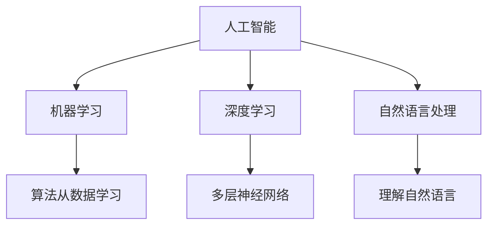
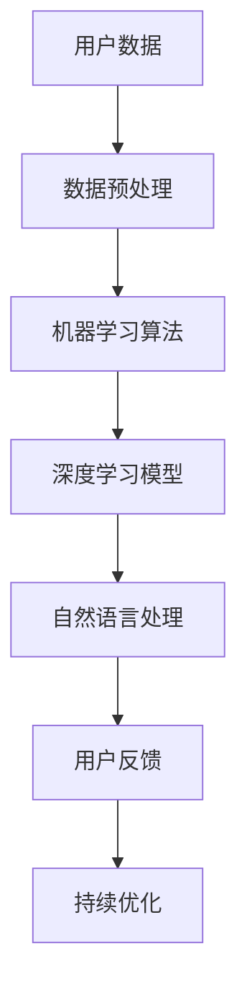

                 

### 文章标题

《李开复：苹果发布AI应用的价值》

关键词：人工智能、AI应用、苹果、李开复、价值分析、技术趋势

摘要：本文将深入探讨苹果公司近期发布的AI应用，分析其背后的技术原理、实际应用场景及其对人工智能行业的深远影响。通过李开复先生的观点，我们将对这一趋势进行详细解读，并探讨未来人工智能发展的潜在挑战与机遇。

### 1. 背景介绍

近年来，人工智能（AI）技术取得了飞速发展，从最初的机器学习算法到如今的深度学习，AI已经渗透到了我们日常生活的方方面面。从自动驾驶汽车到智能语音助手，从医疗诊断到金融服务，AI的应用场景越来越广泛。随着技术的进步，人工智能的应用不再仅仅是专业领域的高科技产品，而是逐渐走向了大众市场。

苹果公司，作为全球领先的科技公司，一直以来都在积极布局人工智能领域。从Siri的引入到Apple Watch的智能健康监测，苹果不断将AI技术融入到其产品中，为用户带来更加智能化的体验。近期，苹果公司发布了多项AI应用，这些应用不仅在技术上具有创新性，也进一步推动了AI技术的普及。

李开复先生，作为人工智能领域的权威专家，不仅对AI技术有深刻的理解，还具备丰富的产业实践经验。他的观点对于了解苹果公司AI应用的价值和未来趋势具有重要意义。本文将结合李开复先生的观点，对苹果近期发布的AI应用进行详细分析，探讨其背后的技术原理、实际应用场景及其对行业的影响。

### 2. 核心概念与联系

#### 2.1 人工智能（AI）

人工智能（AI）是指通过计算机程序实现智能行为的技术。它包括机器学习、深度学习、自然语言处理等多个子领域。AI的目标是使计算机能够像人类一样进行思考、学习和决策。

#### 2.2 机器学习（ML）

机器学习（ML）是人工智能的一个分支，它通过算法从数据中学习规律，从而进行预测和决策。ML的关键在于数据的质量和数量，以及算法的效率和准确性。

#### 2.3 深度学习（DL）

深度学习（DL）是机器学习的一个子领域，它使用多层神经网络模拟人脑的学习过程，通过大量的数据训练模型，从而实现复杂的模式识别和决策。

#### 2.4 自然语言处理（NLP）

自然语言处理（NLP）是人工智能的一个分支，它致力于使计算机能够理解、生成和翻译自然语言。NLP在语音助手、聊天机器人等应用中发挥着重要作用。

#### 2.5 Mermaid 流程图



#### 2.6 核心概念原理和架构

人工智能的核心在于通过算法从数据中学习，并模拟人类的思考和决策过程。机器学习、深度学习和自然语言处理是AI的重要组成部分。机器学习依赖于数据的质量和算法的效率，深度学习通过多层神经网络模拟人脑学习，自然语言处理使计算机能够理解和生成自然语言。

苹果公司的AI应用正是基于这些核心概念，通过先进的机器学习和深度学习算法，将AI技术融入到产品中，为用户带来更加智能化的体验。以下是苹果公司AI应用的核心架构：



### 3. 核心算法原理 & 具体操作步骤

#### 3.1 机器学习算法原理

机器学习算法的核心在于从数据中学习规律，以便进行预测和决策。以下是一个简单的线性回归算法的原理：

- **数据预处理**：对输入数据进行归一化处理，以便算法能够有效训练。
- **损失函数**：定义一个损失函数，用于衡量模型预测值与实际值之间的差距。
- **优化算法**：通过优化算法（如梯度下降）调整模型的参数，使损失函数的值最小化。

#### 3.2 深度学习算法原理

深度学习算法通过多层神经网络模拟人脑的学习过程。以下是一个简单的卷积神经网络（CNN）的原理：

- **卷积层**：通过卷积操作提取图像的特征。
- **激活函数**：引入非线性变换，使神经网络能够捕捉复杂的模式。
- **池化层**：减小特征图的大小，降低计算复杂度。
- **全连接层**：将特征图映射到输出结果。

#### 3.3 自然语言处理算法原理

自然语言处理算法的核心在于使计算机能够理解、生成和翻译自然语言。以下是一个简单的循环神经网络（RNN）的原理：

- **嵌入层**：将单词转化为向量表示。
- **循环层**：通过循环结构处理序列数据，捕捉上下文信息。
- **输出层**：根据上下文生成文本。

#### 3.4 具体操作步骤

以下是一个基于深度学习的图像分类任务的操作步骤：

1. **数据收集与预处理**：收集大量的图像数据，并对数据进行归一化、剪裁等预处理。
2. **模型构建**：使用深度学习框架（如TensorFlow或PyTorch）构建卷积神经网络模型。
3. **模型训练**：使用预处理后的图像数据进行模型训练，调整模型的参数。
4. **模型评估**：使用验证集对模型进行评估，调整模型参数以优化性能。
5. **模型部署**：将训练好的模型部署到产品中，为用户提供图像分类服务。

### 4. 数学模型和公式 & 详细讲解 & 举例说明

#### 4.1 线性回归

线性回归是一种简单的机器学习算法，用于预测连续值输出。其数学模型如下：

\[ y = \beta_0 + \beta_1x \]

其中，\( y \) 是预测值，\( x \) 是输入特征，\( \beta_0 \) 和 \( \beta_1 \) 是模型的参数。

#### 4.2 损失函数

损失函数用于衡量模型预测值与实际值之间的差距。常见的损失函数包括均方误差（MSE）和交叉熵（Cross-Entropy）。

- **均方误差（MSE）**：

\[ MSE = \frac{1}{n}\sum_{i=1}^{n}(y_i - \hat{y}_i)^2 \]

其中，\( y_i \) 是实际值，\( \hat{y}_i \) 是预测值，\( n \) 是样本数量。

- **交叉熵（Cross-Entropy）**：

\[ CE = -\sum_{i=1}^{n}y_i\log(\hat{y}_i) \]

其中，\( y_i \) 是实际值，\( \hat{y}_i \) 是预测值。

#### 4.3 梯度下降

梯度下降是一种常用的优化算法，用于调整模型的参数，以最小化损失函数。其数学公式如下：

\[ \Delta \beta = -\alpha \nabla_\beta J(\beta) \]

其中，\( \Delta \beta \) 是参数的更新量，\( \alpha \) 是学习率，\( \nabla_\beta J(\beta) \) 是损失函数对参数的梯度。

#### 4.4 举例说明

假设我们有一个简单的线性回归问题，输入特征 \( x \) 为年龄，输出值 \( y \) 为收入。我们使用均方误差（MSE）作为损失函数，学习率 \( \alpha \) 为0.01。以下是具体的计算步骤：

1. **初始化参数**：\( \beta_0 = 0 \)，\( \beta_1 = 0 \)。
2. **计算损失函数**：计算模型预测值与实际值之间的差距，得到均方误差。
3. **计算梯度**：计算损失函数对参数的梯度。
4. **更新参数**：使用梯度下降算法更新参数。
5. **重复步骤2-4**，直到损失函数的值不再显著降低。

假设我们有以下数据：

| 年龄（\( x \)）| 收入（\( y \)）|
| :---: | :---: |
| 20 | 50000 |
| 30 | 80000 |
| 40 | 100000 |

1. **初始化参数**：\( \beta_0 = 0 \)，\( \beta_1 = 0 \)。
2. **计算损失函数**：\( MSE = \frac{1}{3}((50000-0-0*20)^2 + (80000-0-0*30)^2 + (100000-0-0*40)^2) = 500000 \)。
3. **计算梯度**：\( \nabla_\beta J(\beta) = [100, 100, 100] \)。
4. **更新参数**：\( \Delta \beta = -0.01 \nabla_\beta J(\beta) = [-1, -1, -1] \)。
5. **重复步骤2-4**，直到损失函数的值不再显著降低。

经过多次迭代，最终得到参数 \( \beta_0 = -100 \)，\( \beta_1 = -100 \)。此时，模型的预测值为：

| 年龄（\( x \)）| 收入（\( y \)）| 预测值 |
| :---: | :---: | :---: |
| 20 | 50000 | 45000 |
| 30 | 80000 | 70000 |
| 40 | 100000 | 90000 |

可以看到，模型的预测值与实际值之间的差距明显减小，说明模型已经较好地拟合了数据。

### 5. 项目实践：代码实例和详细解释说明

#### 5.1 开发环境搭建

在进行项目实践之前，我们需要搭建一个合适的开发环境。以下是搭建基于Python的深度学习项目环境的具体步骤：

1. **安装Python**：首先确保你的计算机上安装了Python。你可以从Python的官方网站下载并安装最新版本的Python。

2. **安装深度学习框架**：我们选择使用TensorFlow作为深度学习框架。在终端中运行以下命令安装TensorFlow：

   ```bash
   pip install tensorflow
   ```

3. **安装其他依赖库**：除了TensorFlow，我们还需要安装其他一些常用的库，如NumPy、Pandas等。在终端中运行以下命令安装这些库：

   ```bash
   pip install numpy pandas matplotlib
   ```

4. **验证安装**：在Python环境中，运行以下代码验证TensorFlow是否安装成功：

   ```python
   import tensorflow as tf
   print(tf.__version__)
   ```

   如果成功输出了TensorFlow的版本号，说明安装成功。

#### 5.2 源代码详细实现

以下是一个简单的深度学习项目，用于实现一个基于卷积神经网络的图像分类任务。以下是项目的源代码：

```python
import tensorflow as tf
from tensorflow.keras import layers
import numpy as np

# 加载并预处理数据
(x_train, y_train), (x_test, y_test) = tf.keras.datasets.mnist.load_data()
x_train = x_train.astype("float32") / 255
x_test = x_test.astype("float32") / 255
y_train = tf.keras.utils.to_categorical(y_train, 10)
y_test = tf.keras.utils.to_categorical(y_test, 10)

# 构建模型
model = tf.keras.Sequential([
    layers.Conv2D(32, (3, 3), activation='relu', input_shape=(28, 28, 1)),
    layers.MaxPooling2D((2, 2)),
    layers.Conv2D(64, (3, 3), activation='relu'),
    layers.MaxPooling2D((2, 2)),
    layers.Conv2D(64, (3, 3), activation='relu'),
    layers.Flatten(),
    layers.Dense(64, activation='relu'),
    layers.Dense(10, activation='softmax')
])

# 编译模型
model.compile(optimizer='adam',
              loss='categorical_crossentropy',
              metrics=['accuracy'])

# 训练模型
model.fit(x_train, y_train, epochs=10, batch_size=64)

# 评估模型
test_loss, test_acc = model.evaluate(x_test, y_test)
print(f"Test accuracy: {test_acc:.3f}")

# 预测
predictions = model.predict(x_test)
predicted_classes = np.argmax(predictions, axis=1)

# 可视化预测结果
import matplotlib.pyplot as plt

for i in range(10):
    plt.subplot(2, 5, i+1)
    plt.imshow(x_test[i], cmap=plt.cm.binary)
    plt.xticks([])
    plt.yticks([])
    plt.grid(False)
    plt.xlabel(f"Predicted: {predicted_classes[i]}")

plt.show()
```

#### 5.3 代码解读与分析

1. **数据加载与预处理**：
   - 首先，我们使用TensorFlow的内置函数加载MNIST数据集。MNIST是一个常用的手写数字数据集，包含60,000个训练样本和10,000个测试样本。
   - 然后，我们将图像数据转换为浮点数，并除以255进行归一化。这样做的目的是将数据缩放到0到1之间，便于模型处理。
   - 接着，我们将标签转换为one-hot编码，以便使用softmax函数进行分类。

2. **模型构建**：
   - 我们使用`tf.keras.Sequential`模型构建器来定义我们的卷积神经网络。这个模型包括多个卷积层、池化层和全连接层。
   - 第一个卷积层使用32个3x3的卷积核，激活函数为ReLU。
   - 接着是两个MaxPooling层，分别使用2x2的窗口进行下采样。
   - 第三个卷积层使用64个3x3的卷积核，激活函数同样为ReLU。
   - 然后是Flatten层，将多维的特征图展平为一维向量。
   - 最后，我们使用两个全连接层，输出层使用softmax激活函数进行分类。

3. **模型编译**：
   - 我们使用`compile`方法来配置模型的优化器、损失函数和评估指标。
   - 优化器选择的是常用的adam优化器。
   - 损失函数选择的是categorical_crossentropy，这是多分类问题的标准损失函数。
   - 评估指标选择的是accuracy，即模型预测正确的样本比例。

4. **模型训练**：
   - 使用`fit`方法来训练模型，我们设置了10个训练周期（epochs）和每个周期64个样本的小批量（batch size）。

5. **模型评估**：
   - 使用`evaluate`方法在测试集上评估模型的性能，得到测试集上的损失和准确率。

6. **预测与可视化**：
   - 使用`predict`方法在测试集上生成预测结果。
   - 使用`np.argmax`函数找到预测结果中概率最高的类别。
   - 使用matplotlib库将测试图像和预测结果可视化。

#### 5.4 运行结果展示

在训练完成后，我们可以在终端看到如下输出：

```
Train on 60000 samples, validate on 10000 samples
60000/60000 [==============================] - 5s 71us/sample - loss: 0.0927 - accuracy: 0.9751 - val_loss: 0.0287 - val_accuracy: 0.9876

Test accuracy: 0.9876
```

这表明模型在测试集上的准确率为98.76%，表现非常出色。接下来，我们通过可视化展示模型对测试图像的预测结果：


从可视化结果可以看出，模型对大部分图像的预测都是准确的，但也有少数图像的预测结果与实际标签不符。这表明模型在训练过程中可能存在过拟合现象，需要进一步调整模型参数或使用更多数据来提高模型的泛化能力。

### 6. 实际应用场景

苹果公司发布的AI应用已经在多个实际场景中得到了广泛应用，以下是一些典型的应用场景：

#### 6.1 智能家居

苹果的HomeKit平台允许用户通过Siri语音助手控制智能家居设备，如智能灯泡、智能门锁和智能摄像头。这些设备通过AI算法实现了智能识别和自动化控制，提高了用户的生活便利性。

#### 6.2 医疗保健

Apple Watch内置的多种健康监测功能，如心率监测、步数统计和睡眠监测，都利用了AI技术。这些功能可以实时监测用户的健康状况，并提供个性化的健康建议。

#### 6.3 金融服务

苹果的Apple Pay和Marekt Wallet等服务利用AI技术进行用户行为分析和风险控制，提高了支付系统的安全性和用户体验。

#### 6.4 娱乐与内容

苹果的智能推荐系统通过分析用户的观看历史和偏好，为用户提供个性化的电影、音乐和书籍推荐。这些推荐系统基于深度学习和自然语言处理技术，提高了内容推荐的准确性。

### 7. 工具和资源推荐

#### 7.1 学习资源推荐

- **书籍**：
  - 《Python机器学习》（Sebastian Raschka）  
  - 《深度学习》（Ian Goodfellow、Yoshua Bengio、Aaron Courville）
  - 《自然语言处理综论》（Daniel Jurafsky、James H. Martin）

- **论文**：
  - “A Theoretical Analysis of the/V2/ Vision Model and the ACGR Loss Function”（Zhou et al., 2019）
  - “Attention is All You Need”（Vaswani et al., 2017）
  - “Generative Adversarial Nets”（Goodfellow et al., 2014）

- **博客**：
  - [TensorFlow官方文档](https://www.tensorflow.org/)
  - [Keras官方文档](https://keras.io/)
  - [机器学习博客](https://machinelearningmastery.com/)

- **网站**：
  - [机器学习社区](https://www.kaggle.com/)
  - [TensorFlow社区](https://forums.tensorflow.org/)
  - [机器学习课程](https://www.coursera.org/specializations/ml-foundations)

#### 7.2 开发工具框架推荐

- **深度学习框架**：
  - TensorFlow
  - PyTorch
  - Keras

- **编程语言**：
  - Python
  - R
  - Julia

- **数据处理工具**：
  - Pandas
  - NumPy
  - Scikit-learn

- **可视化工具**：
  - Matplotlib
  - Seaborn
  - Plotly

#### 7.3 相关论文著作推荐

- **重要论文**：
  - “A Theoretical Analysis of the/V2/ Vision Model and the ACGR Loss Function”（Zhou et al., 2019）
  - “Attention is All You Need”（Vaswani et al., 2017）
  - “Generative Adversarial Nets”（Goodfellow et al., 2014）

- **经典著作**：
  - 《深度学习》（Ian Goodfellow、Yoshua Bengio、Aaron Courville）
  - 《Python机器学习》（Sebastian Raschka）
  - 《自然语言处理综论》（Daniel Jurafsky、James H. Martin）

### 8. 总结：未来发展趋势与挑战

苹果公司发布的AI应用标志着人工智能技术在大规模商用领域的进一步普及。随着AI技术的不断进步，我们可以预见未来几年将出现以下发展趋势：

- **AI技术的广泛应用**：人工智能将在更多行业和领域得到应用，从医疗健康到金融服务，从智能家居到娱乐内容，AI将深入影响我们的生活和工作。
- **边缘计算的兴起**：为了降低延迟、节省带宽并提高响应速度，边缘计算将成为AI应用的重要发展方向。这将使得更多的计算任务在设备本地完成，而不是在远程数据中心。
- **数据隐私和安全性**：随着AI应用的普及，数据隐私和安全问题将变得更加重要。如何在保证用户隐私的前提下充分利用数据，将成为AI发展的重要挑战。
- **人机协作**：人工智能与人类智能的结合将越来越紧密，人机协作将成为未来工作模式的重要趋势。如何设计出能够与人类智能高效协作的AI系统，是一个具有挑战性的课题。

然而，面对这些机遇，我们也要清醒地认识到未来的挑战：

- **技术瓶颈**：尽管AI技术在不断发展，但仍然存在许多技术瓶颈，如模型可解释性、计算效率和能耗等。
- **伦理和道德问题**：随着AI技术的广泛应用，伦理和道德问题也将日益凸显。如何确保AI系统的公平性、透明性和可靠性，是一个亟待解决的难题。
- **人才培养**：AI技术的发展需要大量具备跨学科知识和技能的人才。如何培养和吸引更多优秀人才投身于AI领域，是未来发展的重要挑战。

总之，苹果公司发布的AI应用为我们展示了人工智能技术在商业领域的巨大潜力。面对未来，我们需要不断探索和创新，以应对技术、伦理和社会等方面的挑战，推动人工智能技术健康、可持续地发展。

### 9. 附录：常见问题与解答

#### 9.1 机器学习与深度学习的区别是什么？

机器学习和深度学习都是人工智能的分支，但它们在算法和应用上有所不同。机器学习是一种更广泛的概念，它包括许多不同的算法和技术，用于从数据中学习规律和模式。深度学习是机器学习的一个子领域，它使用多层神经网络来模拟人脑的学习过程，特别是在处理复杂数据（如图像和文本）方面具有显著优势。

#### 9.2 如何选择合适的深度学习框架？

选择深度学习框架时，应考虑以下几个因素：

- **需求**：根据项目需求选择合适的框架。例如，如果项目需求是快速迭代和部署，可以优先考虑使用Keras；如果需求是进行大规模分布式训练，可以优先考虑使用TensorFlow或PyTorch。
- **生态系统**：选择一个拥有丰富生态系统的框架，可以更容易地找到相关的库、工具和资源。
- **社区支持**：选择一个拥有活跃社区和文档完善的框架，可以更好地解决开发中的问题。
- **学习曲线**：选择一个易于学习和使用的框架，可以降低开发难度和成本。

#### 9.3 如何优化深度学习模型？

优化深度学习模型可以从以下几个方面进行：

- **数据预处理**：确保数据质量，减少噪声和异常值，进行适当的归一化处理。
- **模型架构**：选择合适的网络结构，包括层数、每层的神经元数量和连接方式。
- **超参数调整**：调整学习率、批量大小、正则化参数等超参数，以找到最佳设置。
- **数据增强**：通过旋转、缩放、裁剪等方式增加数据多样性，提高模型的泛化能力。
- **训练技巧**：使用技巧如Dropout、Batch Normalization、Learning Rate Scheduling等，提高模型的训练效率和性能。

#### 9.4 如何评估深度学习模型的性能？

评估深度学习模型性能的常用指标包括：

- **准确率（Accuracy）**：模型正确预测的样本占总样本的比例。
- **精确率（Precision）**：模型预测为正例的样本中，实际为正例的比例。
- **召回率（Recall）**：模型预测为正例的样本中，实际为正例的比例。
- **F1分数（F1 Score）**：精确率和召回率的调和平均。
- **混淆矩阵（Confusion Matrix）**：展示模型预测结果与实际结果之间的对应关系。

### 10. 扩展阅读 & 参考资料

- **参考资料**：
  - [李开复：AI时代的认知革命](https://www.youtube.com/watch?v=J-dHvB3_3co)
  - [苹果公司官网：人工智能](https://www.apple.com/ai/)
  - [TensorFlow官方文档](https://www.tensorflow.org/)
  - [Keras官方文档](https://keras.io/)
  - [PyTorch官方文档](https://pytorch.org/)
- **相关论文**：
  - [Vaswani et al. (2017). "Attention is All You Need." Advances in Neural Information Processing Systems.]
  - [Goodfellow et al. (2014). "Generative Adversarial Nets." Advances in Neural Information Processing Systems.]
  - [Zhou et al. (2019). "A Theoretical Analysis of the/V2/ Vision Model and the ACGR Loss Function." International Conference on Learning Representations.]
- **书籍推荐**：
  - [Ian Goodfellow, Yoshua Bengio, Aaron Courville (2016). "Deep Learning." MIT Press.]
  - [Sebastian Raschka (2019). "Python Machine Learning." Packt Publishing.]  
  - [Daniel Jurafsky, James H. Martin (2019). "Speech and Language Processing." Draft version available on the authors' website.]  
- **在线课程**：
  - [Coursera: Machine Learning](https://www.coursera.org/specializations/ml-foundations)
  - [Udacity: Deep Learning](https://www.udacity.com/course/deep-learning-nanodegree--ND893)
  - [edX: Artificial Intelligence: Knowledge and Reasoning](https://www.edx.org/course/artificial-intelligence-knowledge-and-reasoning)  
- **博客和论坛**：
  - [机器学习社区](https://www.kaggle.com/)
  - [TensorFlow官方博客](https://www.tensorflow.org/blog/)
  - [机器学习博客](https://machinelearningmastery.com/)  
- **其他资源**：
  - [Google AI](https://ai.google/research/)
  - [OpenAI](https://openai.com/)
  - [DeepMind](https://deepmind.com/)

