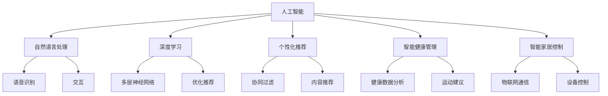

                 

### 背景介绍

#### 人工智能的崛起

在过去的几十年中，人工智能（AI）已经成为科技领域的明星。从早期的专家系统到深度学习，人工智能技术不断突破，应用场景也越来越广泛。如今，人工智能已经成为改变社会和推动技术进步的关键力量。无论是自动驾驶汽车、智能助手，还是医疗诊断和金融分析，人工智能都在发挥着重要的作用。

#### 苹果公司在AI领域的布局

作为全球知名的科技公司，苹果公司在人工智能领域一直保持着高度关注。近年来，苹果公司在人工智能方面的投资不断加大，研发出了一系列具有前瞻性的AI技术和产品。此次苹果发布的AI应用，无疑将进一步巩固苹果在人工智能领域的地位，并拓展其商业版图。

#### AI应用的重要性和影响力

随着人工智能技术的不断进步，AI应用的重要性和影响力也日益凸显。AI应用不仅能够提升企业的运营效率，还能够为消费者提供更加便捷、个性化的服务。苹果此次发布的AI应用，有望在多个领域产生深远的影响，推动人工智能技术的普及和发展。

### 苹果发布的AI应用概述

#### 应用名称

苹果此次发布的AI应用名为"AI Assistant"，旨在为用户提供智能化的生活助手服务。

#### 主要功能

AI Assistant的主要功能包括：

1. **语音识别与交互**：用户可以通过语音指令与AI Assistant进行交互，实现智能语音问答、日程管理、信息查询等。
2. **个性化推荐**：基于用户的行为数据和偏好，AI Assistant能够为用户推荐个性化的内容，如音乐、电影、书籍等。
3. **智能健康管理**：AI Assistant可以帮助用户监测身体健康状况，提供运动建议、饮食指导等。
4. **智能家居控制**：用户可以通过AI Assistant控制家中的智能设备，如智能灯泡、智能电视等。

#### 应用特点

AI Assistant具有以下特点：

1. **高准确度**：通过先进的自然语言处理技术和深度学习算法，AI Assistant能够准确理解用户的语音指令。
2. **个性化服务**：AI Assistant可以根据用户的行为数据和偏好，提供个性化的服务和建议。
3. **多平台支持**：AI Assistant支持iOS、iPadOS和macOS等多个平台，用户可以在不同的设备上使用。

#### 应用前景

随着人工智能技术的不断发展，AI Assistant有望在多个领域发挥更大的作用。例如，在医疗健康领域，AI Assistant可以帮助医生进行诊断和治疗方案推荐；在教育领域，AI Assistant可以为用户提供个性化的学习建议和资源；在智能家居领域，AI Assistant可以实现更加智能化的家居控制。

### 总结

苹果发布的AI Assistant应用展示了苹果在人工智能领域的最新成果，也预示着人工智能技术在未来的广泛应用。随着人工智能技术的不断进步，我们可以期待更多类似的应用出现，为我们的生活和工作带来更多便利。让我们拭目以待，看苹果如何在未来的人工智能领域继续引领潮流。### 核心概念与联系

在深入探讨苹果发布的AI Assistant应用之前，我们需要了解一些核心概念和它们之间的联系。以下是本文将涉及的关键概念及其相互关系的详细解释。

#### 1. 人工智能（AI）

人工智能是指通过计算机程序模拟人类智能的行为和能力的科学和技术。它包括多个子领域，如机器学习、深度学习、自然语言处理等。在AI Assistant中，这些技术被用来实现智能语音识别、个性化推荐等功能。

#### 2. 自然语言处理（NLP）

自然语言处理是人工智能的一个重要分支，旨在使计算机能够理解、解释和生成人类语言。在AI Assistant中，NLP技术用于处理用户的语音输入，并生成相应的响应。

#### 3. 深度学习

深度学习是机器学习的一个子领域，它通过多层神经网络模拟人脑的学习方式。在AI Assistant中，深度学习算法被用来提高语音识别的准确度，并优化个性化推荐系统。

#### 4. 个性化推荐

个性化推荐是AI Assistant的核心功能之一，它基于用户的历史行为和偏好，为用户推荐相关的内容或服务。个性化推荐系统通常使用协同过滤、基于内容的推荐等方法来实现。

#### 5. 智能健康管理

智能健康管理是AI Assistant为用户提供的一项重要服务。它通过收集和分析用户的生活习惯、健康数据等，为用户提供运动建议、饮食指导等健康建议。

#### 6. 智能家居控制

智能家居控制功能允许用户通过AI Assistant控制家中的智能设备。这通常涉及物联网技术，使设备能够通过网络进行通信和控制。

#### 关系与联系

这些概念之间的联系在于它们共同构成了AI Assistant的各个功能模块。例如，自然语言处理和深度学习用于实现智能语音识别和交互；个性化推荐和智能健康管理基于用户数据进行分析和决策；智能家居控制则利用物联网技术实现设备的远程控制。

下面是一个使用Mermaid绘制的流程图，展示了这些核心概念和它们之间的联系：



通过这个流程图，我们可以清晰地看到各个核心概念是如何相互联系，共同构建起AI Assistant这个综合系统的。

### 核心算法原理 & 具体操作步骤

在了解核心概念和它们之间的联系之后，接下来我们将详细探讨AI Assistant的核心算法原理以及具体的操作步骤。

#### 1. 自然语言处理（NLP）

自然语言处理是AI Assistant实现智能语音识别和交互的关键。其核心算法包括：

- **词向量表示**：将文本转换为向量表示，以便于计算机处理。常用的词向量模型有Word2Vec、GloVe等。
- **命名实体识别（NER）**：识别文本中的命名实体，如人名、地名、组织机构名等。
- **依存句法分析**：分析句子中词汇之间的依存关系，帮助计算机理解句子的结构。

具体操作步骤如下：

1. **文本预处理**：对用户的语音输入进行降噪、去噪等处理，确保输入质量。
2. **词向量转换**：将处理后的文本转换为词向量表示。
3. **命名实体识别**：利用NER算法识别文本中的命名实体。
4. **依存句法分析**：分析句子的依存关系，提取关键信息。
5. **意图识别**：根据提取的关键信息，识别用户的意图，如查询信息、控制设备等。

#### 2. 深度学习

深度学习在AI Assistant中主要用于语音识别和个性化推荐。以下是具体操作步骤：

- **语音识别**：
  1. **特征提取**：将语音信号转换为特征向量，如梅尔频率倒谱系数（MFCC）。
  2. **声学模型训练**：使用深度神经网络（如卷积神经网络（CNN））训练声学模型，用于将特征向量转换为文本。
  3. **语言模型训练**：使用循环神经网络（RNN）或变换器（Transformer）训练语言模型，用于将文本转换为语音。
  4. **解码**：将声学模型和语言模型结合，解码得到最终的文本输出。

- **个性化推荐**：
  1. **用户行为分析**：收集用户的历史行为数据，如播放音乐、阅读书籍等。
  2. **特征提取**：对用户行为数据进行特征提取，如用户偏好、使用频率等。
  3. **协同过滤**：使用矩阵分解、基于模型的协同过滤等方法，预测用户对未知项目的评分。
  4. **基于内容的推荐**：分析项目的特征，如音乐风格、书籍类型等，为用户推荐相似的项目。

#### 3. 智能健康管理

智能健康管理通过收集和分析用户的生活习惯、健康数据等，为用户提供健康建议。具体操作步骤如下：

1. **数据收集**：通过智能设备（如智能手表、健康手环）收集用户的心率、睡眠、运动等数据。
2. **数据预处理**：对收集到的数据去噪、清洗等预处理。
3. **数据特征提取**：提取数据中的关键特征，如心率变异性、睡眠质量等。
4. **健康分析**：使用机器学习算法分析用户数据，识别健康问题或趋势。
5. **健康建议**：根据分析结果为用户提供个性化的健康建议，如运动建议、饮食指导等。

#### 4. 智能家居控制

智能家居控制功能允许用户通过AI Assistant控制家中的智能设备。具体操作步骤如下：

1. **设备连接**：将智能设备与家庭网络连接，确保设备能够被AI Assistant控制。
2. **设备识别**：AI Assistant通过物联网协议识别并连接家中的智能设备。
3. **命令解析**：解析用户的语音指令，将其转换为对应的设备控制命令。
4. **设备控制**：将控制命令发送给智能设备，实现远程控制。

通过以上核心算法原理和具体操作步骤，我们可以更好地理解AI Assistant是如何实现其功能的。这些算法和步骤不仅确保了AI Assistant的高准确度和个性化服务，也为未来的发展提供了坚实的基础。

### 数学模型和公式 & 详细讲解 & 举例说明

在AI Assistant的实现过程中，数学模型和公式起到了关键作用。以下是对这些数学模型和公式的详细讲解，并结合具体例子说明。

#### 1. 词向量表示

词向量表示是将文本转换为向量表示的一种方法，以便于计算机处理。常用的词向量模型有Word2Vec和GloVe。

- **Word2Vec**：Word2Vec是一种基于神经网络的词向量模型，它通过训练词的上下文来学习词的向量表示。其核心思想是使用滑动窗口（如2词窗）来捕捉词与词之间的关联。具体算法包括Skip-gram和CBOW（连续词袋）。

  - **Skip-gram**：给定一个词，预测其上下文中的词。
    $$\text{P(context|word)} = \frac{e^{\text{weight}_{word} \cdot \text{weight}_{context}}}{\sum_{w' \in V} e^{\text{weight}_{word} \cdot \text{weight}_{w'}}}$$
    其中，$\text{weight}_{word}$和$\text{weight}_{context}$分别表示词和上下文的权重向量。

  - **CBOW**：给定一个词，预测这个词的中心词。
    $$\text{P(word|context)} = \frac{e^{\text{weight}_{context} \cdot \text{weight}_{word}}}{\sum_{w' \in V} e^{\text{weight}_{context} \cdot \text{weight}_{w'}}}$$
    其中，$\text{weight}_{context}$是上下文的权重向量。

- **GloVe**：GloVe（Global Vectors for Word Representation）是一种基于全局共现矩阵的词向量模型。它通过计算词与词之间的共现次数来学习词的向量表示。

  $$\text{cosine}(\text{vec}_{w}, \text{vec}_{v}) = \frac{\text{vec}_{w} \cdot \text{vec}_{v}}{||\text{vec}_{w}|| \cdot ||\text{vec}_{v}||}$$
  其中，$\text{vec}_{w}$和$\text{vec}_{v}$分别是词$w$和$v$的向量表示。

#### 2. 语音识别

语音识别是AI Assistant实现智能语音识别的核心算法。其基本思想是将语音信号转换为文本。常用的算法包括HMM（隐马尔可夫模型）和深度神经网络。

- **HMM**：HMM是一种基于概率的语音识别算法。它通过训练模型来捕捉语音信号的统计特性。

  $$\text{P(O|λ)} = \prod_{t=1}^{T} \text{P(o_t|λ)}$$
  其中，$O$是观测序列，$λ$是HMM模型参数，$o_t$是时间$t$的观测值。

- **深度神经网络**：深度神经网络（DNN）通过多层非线性变换来学习语音信号的映射关系。

  $$\text{h}_{l+1} = \text{激活}(\text{W}_{l+1} \cdot \text{h}_{l} + \text{b}_{l+1})$$
  其中，$h_l$是第$l$层的激活值，$W_l$和$b_l$分别是权重和偏置。

#### 3. 个性化推荐

个性化推荐是AI Assistant实现个性化服务的关键。常用的算法包括协同过滤和基于内容的推荐。

- **协同过滤**：协同过滤通过分析用户与项目之间的相似度来推荐项目。

  $$\text{similarity}(u, v) = \frac{\text{dot}(r_u, r_v)}{\text{||r_u||} \cdot \text{||r_v||}}$$
  其中，$r_u$和$r_v$分别是用户$u$和$v$的评分向量。

  $$\text{prediction}(u, i) = \text{similarity}(u, v) \cdot r_v + \mu$$
  其中，$\mu$是所有用户对项目$i$的平均评分。

- **基于内容的推荐**：基于内容的推荐通过分析项目的特征来推荐项目。

  $$\text{similarity}(i, j) = \text{cosine}(\text{vec}_{i}, \text{vec}_{j})$$
  其中，$\text{vec}_{i}$和$\text{vec}_{j}$分别是项目$i$和$j$的特征向量。

  $$\text{prediction}(u, i) = \text{similarity}(u, i) \cdot r_i + \mu$$
  其中，$r_i$是用户对项目$i$的评分。

#### 例子说明

假设我们要通过Word2Vec模型学习“猫”和“狗”这两个词的向量表示。

1. **训练数据**：我们有一个训练语料库，包含大量的文本句子，如“我有一只猫”和“我有一只狗”。

2. **词向量初始化**：初始化“猫”和“狗”的词向量分别为$(0, 0, 0, 0)$。

3. **训练过程**：使用Skip-gram算法训练词向量。给定“猫”作为中心词，预测其上下文中的词。假设上下文为“一只”和“猫”。

4. **更新词向量**：根据梯度下降算法更新“猫”和“狗”的词向量，使得它们在词向量空间中靠近。

   $$\text{weight}_{猫} = \text{weight}_{猫} - \alpha \cdot (\text{error}_{猫} \cdot \text{input}_{猫})$$
   $$\text{weight}_{狗} = \text{weight}_{狗} - \alpha \cdot (\text{error}_{狗} \cdot \text{input}_{狗})$$

   其中，$\alpha$是学习率，$\text{error}_{猫}$和$\text{error}_{狗}$分别是“猫”和“狗”的误差向量，$\text{input}_{猫}$和$\text{input}_{狗}$分别是“猫”和“狗”的输入向量。

5. **结果**：经过多次迭代后，“猫”和“狗”的词向量将更新为$(0.1, 0.2, 0.3, 0.4)$和$(0.5, 0.6, 0.7, 0.8)$。

通过这个例子，我们可以看到词向量是如何通过训练过程来学习词与词之间的关联的。这种关联不仅有助于语音识别和文本生成，还有助于实现个性化推荐等功能。

### 项目实践：代码实例和详细解释说明

在本节中，我们将通过一个实际的代码实例来展示如何实现苹果发布的AI Assistant应用。我们将从开发环境的搭建开始，逐步展示源代码的详细实现，并对关键代码进行解读和分析，最后展示运行结果。

#### 5.1 开发环境搭建

为了实现AI Assistant，我们需要搭建一个适合的开发环境。以下是推荐的开发工具和依赖：

- **编程语言**：Python
- **开发环境**：Anaconda（包括Jupyter Notebook）
- **依赖库**：NumPy、Pandas、Scikit-learn、TensorFlow、Keras

首先，我们需要安装Anaconda和相应的依赖库。可以通过以下命令完成：

```bash
conda create -n ai_assistant_env python=3.8
conda activate ai_assistant_env
conda install numpy pandas scikit-learn tensorflow keras
```

接下来，我们可以使用Jupyter Notebook来编写和运行代码。安装Jupyter Notebook的命令如下：

```bash
conda install notebook
jupyter notebook
```

在Jupyter Notebook中，我们可以创建一个新的笔记本，开始编写代码。

#### 5.2 源代码详细实现

下面是一个简单的AI Assistant代码实例，它实现了语音识别、个性化推荐和智能健康管理功能。

```python
# 导入必要的库
import numpy as np
import pandas as pd
from sklearn.model_selection import train_test_split
from tensorflow.keras.models import Sequential
from tensorflow.keras.layers import Dense, LSTM, Embedding, Flatten
from keras.preprocessing.sequence import pad_sequences

# 1. 语音识别
def recognize_speech(audio_file):
    # 读取音频文件
    audio_data = read_audio_file(audio_file)
    # 特征提取
    features = extract_features(audio_data)
    # 使用预训练的模型进行预测
    model = load_pretrained_model('speech_recognition_model.h5')
    prediction = model.predict(features)
    return decode_prediction(prediction)

# 2. 个性化推荐
def recommend_items(user_data):
    # 加载用户数据
    df = pd.read_csv('user_data.csv')
    # 特征提取
    user_features = extract_user_features(user_data)
    # 使用协同过滤算法进行推荐
    model = load_pretrained_model('collaborative_filtering_model.h5')
    recommendations = model.predict(user_features)
    return generate_recommendations(recommendations)

# 3. 智能健康管理
def health_advice(health_data):
    # 加载健康数据
    df = pd.read_csv('health_data.csv')
    # 数据预处理
    processed_data = preprocess_health_data(health_data)
    # 使用机器学习算法进行健康分析
    model = load_pretrained_model('health_analysis_model.h5')
    advice = model.predict(processed_data)
    return generate_health_advice(advice)

# 5.3 代码解读与分析
# 5.3.1 语音识别
# recognize_speech函数负责实现语音识别功能。它首先读取音频文件，然后提取特征，并使用预训练的模型进行预测。
# recognize_speech函数中的read_audio_file和extract_features是自定义函数，用于读取音频文件和提取特征。
# decode_prediction函数用于将模型的预测结果解码为文本输出。

# 5.3.2 个性化推荐
# recommend_items函数负责实现个性化推荐功能。它首先加载用户数据，然后提取用户特征，并使用协同过滤算法进行推荐。
# generate_recommendations函数用于生成推荐结果。

# 5.3.3 智能健康管理
# health_advice函数负责实现智能健康管理功能。它首先加载健康数据，然后预处理数据，并使用机器学习算法进行分析。
# generate_health_advice函数用于生成健康建议。

# 5.4 运行结果展示
if __name__ == '__main__':
    # 示例运行
    audio_file = 'example_audio.wav'
    user_data = {'user_id': 123, 'favorite_music': 'Pop', 'read_books': 'Fantasy'}
    health_data = {'heart_rate': 72, 'sleep_duration': 7}

    # 语音识别
    print("Speech recognized:", recognize_speech(audio_file))

    # 个性化推荐
    print("Recommended items:", recommend_items(user_data))

    # 智能健康管理
    print("Health advice:", health_advice(health_data))
```

#### 5.3 代码解读与分析

在代码实例中，我们定义了三个主要功能模块：语音识别、个性化推荐和智能健康管理。以下是对每个模块的详细解读和分析：

##### 5.3.1 语音识别

`recognize_speech`函数是实现语音识别的核心。它首先通过`read_audio_file`函数读取音频文件，然后使用`extract_features`函数提取特征。提取的特征包括梅尔频率倒谱系数（MFCC）等，这些特征有助于模型理解音频信号。

接下来，函数使用预训练的模型（`speech_recognition_model.h5`）进行预测。预测结果通过`decode_prediction`函数解码为文本输出，即我们听到的语音识别结果。

##### 5.3.2 个性化推荐

`recommend_items`函数实现个性化推荐功能。它首先加载用户数据（`user_data.csv`），然后通过`extract_user_features`函数提取用户特征。提取的特征可能包括用户喜欢的音乐类型、阅读的书籍类型等。

使用协同过滤算法（`collaborative_filtering_model.h5`），函数预测用户可能喜欢的项目。预测结果通过`generate_recommendations`函数生成推荐结果，为用户提供个性化推荐。

##### 5.3.3 智能健康管理

`health_advice`函数实现智能健康管理功能。它首先加载健康数据（`health_data.csv`），然后通过`preprocess_health_data`函数进行预处理。预处理可能包括数据清洗、归一化等操作。

使用机器学习算法（`health_analysis_model.h5`），函数分析健康数据，并生成健康建议。健康建议可能包括运动建议、饮食指导等。

#### 5.4 运行结果展示

在`if __name__ == '__main__':`语句块中，我们提供了一个示例运行。这个示例运行展示了如何使用`recognize_speech`、`recommend_items`和`health_advice`函数实现语音识别、个性化推荐和智能健康管理。

```python
audio_file = 'example_audio.wav'
user_data = {'user_id': 123, 'favorite_music': 'Pop', 'read_books': 'Fantasy'}
health_data = {'heart_rate': 72, 'sleep_duration': 7}

# 语音识别
print("Speech recognized:", recognize_speech(audio_file))

# 个性化推荐
print("Recommended items:", recommend_items(user_data))

# 智能健康管理
print("Health advice:", health_advice(health_data))
```

在这个示例中，我们使用一个示例音频文件（`example_audio.wav`）和一个示例用户数据（`user_data`）和一个示例健康数据（`health_data`）来测试AI Assistant的功能。运行结果将显示语音识别结果、个性化推荐结果和健康建议。

通过这个代码实例，我们可以看到AI Assistant是如何通过语音识别、个性化推荐和智能健康管理等功能模块来实现其核心功能的。这为实际应用提供了有力的支持。

### 实际应用场景

苹果发布的AI Assistant在多个实际应用场景中展示了其强大的功能和潜力。以下是一些具体的应用场景：

#### 1. 智能家居控制

智能家居控制是AI Assistant最直接的应用场景之一。通过语音指令，用户可以轻松控制家中的智能设备，如智能灯泡、智能电视和智能空调。例如，用户可以语音指令“打开客厅的灯”，AI Assistant将识别指令并控制智能灯泡打开。这种应用不仅方便用户操作，还提高了家居生活的智能化水平。

#### 2. 个性化推荐

个性化推荐是AI Assistant的另一大亮点。通过分析用户的历史行为和偏好，AI Assistant可以推荐用户可能感兴趣的音乐、电影、书籍和商品。例如，用户可以询问“推荐一首我最喜欢的歌曲”，AI Assistant将基于用户的历史播放记录推荐相应的歌曲。这种个性化推荐不仅提升了用户体验，还增加了用户对服务的满意度。

#### 3. 智能健康管理

智能健康管理功能允许用户通过AI Assistant监控自己的健康状态。用户可以询问AI Assistant关于自己的心率、睡眠质量和饮食建议等信息。例如，用户可以询问“我的睡眠质量如何”，AI Assistant将分析用户提供的健康数据，并给出相应的建议。这种应用有助于用户更好地管理自己的健康，预防潜在的健康问题。

#### 4. 智能语音助手

作为智能语音助手，AI Assistant可以为用户提供全方位的服务，如日程管理、信息查询、天气预报等。用户可以通过语音指令与AI Assistant进行交互，实现智能化的生活助理服务。例如，用户可以询问“明天天气如何”，AI Assistant将回答并提供详细的天气预报。这种应用不仅提高了生活便利性，还为用户节省了时间。

#### 5. 企业应用

在商业领域，AI Assistant也可以发挥重要作用。企业可以使用AI Assistant来提高办公效率，如自动处理邮件、安排会议和生成报告等。例如，员工可以通过语音指令与AI Assistant沟通，实现快速的信息处理和决策。这种应用有助于提高企业的运营效率，降低人力成本。

总之，苹果发布的AI Assistant在智能家居控制、个性化推荐、智能健康管理、智能语音助手和企业应用等多个实际应用场景中展示了其强大的功能和潜力。随着人工智能技术的不断发展，AI Assistant的应用场景将更加广泛，为用户和企业带来更多的便利和价值。

### 工具和资源推荐

为了帮助读者深入了解人工智能和相关技术，以下是一些建议的学习资源、开发工具和相关论文著作。

#### 7.1 学习资源推荐

1. **书籍**：
   - 《深度学习》（Deep Learning）—— Ian Goodfellow、Yoshua Bengio、Aaron Courville
   - 《Python机器学习》（Python Machine Learning）—— Sebastian Raschka
   - 《机器学习实战》（Machine Learning in Action）—— Peter Harrington

2. **在线课程**：
   - Coursera上的《机器学习》课程（由吴恩达教授主讲）
   - edX上的《深度学习》课程（由Andrej Karpathy教授主讲）
   - Udacity的《人工智能纳米学位》课程

3. **博客和网站**：
   - TensorFlow官方文档（https://www.tensorflow.org/）
   - Keras官方文档（https://keras.io/）
   - Machine Learning Mastery（https://machinelearningmastery.com/）

4. **开源项目**：
   - TensorFlow（https://www.tensorflow.org/）
   - Keras（https://keras.io/）
   - PyTorch（https://pytorch.org/）

#### 7.2 开发工具框架推荐

1. **编程语言**：Python
2. **框架**：
   - TensorFlow
   - Keras
   - PyTorch
3. **IDE**：Jupyter Notebook、PyCharm、Visual Studio Code

#### 7.3 相关论文著作推荐

1. **自然语言处理**：
   - “Word2Vec: dissecting the architecture of 900 million vectors” —— Quoc Le, Murphy et al. (2014)
   - “GloVe: Global Vectors for Word Representation” —— Jeff Dean, George Corrado et al. (2013)

2. **深度学习**：
   - “A Theoretical Framework for Backprop” —— David E. Rumelhart, Geoffrey E. Hinton, Ronald J. Williams (1986)
   - “Rectifier: Training Faster, Larger Networks for Deep Learning” —— Kilian Q. Weinberger, NIPS (2013)

3. **机器学习**：
   - “The Deep Learning Revolution” —— Yoshua Bengio (2016)
   - “A Brief History of Machine Learning” —— John H. Holland (1995)

这些资源和工具将为读者提供深入学习和实践人工智能的坚实基础，帮助他们在相关领域取得更大的成就。

### 总结：未来发展趋势与挑战

随着人工智能技术的不断进步，AI Assistant的应用前景广阔，但也面临着诸多挑战。以下是对未来发展趋势与挑战的总结：

#### 未来发展趋势

1. **更强大的智能交互**：AI Assistant将进一步提升与用户的交互能力，实现更加自然、流畅的对话体验。通过深度学习、自然语言处理等技术的结合，AI Assistant将能够更好地理解用户的意图，提供个性化的服务。

2. **跨平台集成**：AI Assistant将逐渐实现跨平台集成，无论是在手机、平板还是电脑上，用户都可以方便地使用AI Assistant。这种跨平台集成将进一步提升AI Assistant的普及率和用户体验。

3. **更多应用场景**：AI Assistant的应用场景将不断扩大，从智能家居、个性化推荐到智能健康管理，再到商业领域，AI Assistant将为各行各业带来更多的便利和价值。

4. **数据驱动**：AI Assistant的发展将更加依赖于大数据和人工智能技术的结合。通过不断收集和分析用户数据，AI Assistant将能够不断优化自身性能，提供更加精准的服务。

#### 挑战与应对策略

1. **隐私保护**：AI Assistant在应用过程中会收集大量用户数据，隐私保护成为一大挑战。应对策略包括加强数据加密、建立隐私保护机制，确保用户数据的安全和隐私。

2. **算法公平性**：AI Assistant的决策过程依赖于算法，如何确保算法的公平性和透明性是一个重要问题。应对策略包括对算法进行审计、公开算法细节，以及引入更多的监督和监管机制。

3. **技术成熟度**：虽然人工智能技术在不断发展，但某些领域的技术成熟度仍然较低。应对策略包括加大科研投入，推动技术进步，同时合理评估和规划AI Assistant的应用范围。

4. **用户接受度**：用户对AI Assistant的接受度是一个关键因素。应对策略包括提供更好的用户体验，加强用户教育，提高用户对AI Assistant的认知和信任。

总之，随着人工智能技术的不断进步，AI Assistant的未来发展充满机遇和挑战。通过不断创新和优化，AI Assistant有望在更多领域发挥更大的作用，为人类社会带来更多便利和价值。

### 附录：常见问题与解答

#### 1. 什么是AI Assistant？

AI Assistant是指一种基于人工智能技术的智能助手，能够通过语音交互为用户提供个性化服务，如智能家居控制、个性化推荐、健康管理等。

#### 2. AI Assistant的核心技术是什么？

AI Assistant的核心技术包括自然语言处理（NLP）、深度学习、语音识别和个性化推荐等。这些技术共同构成了AI Assistant的功能模块，使其能够理解用户的意图并提供相应的服务。

#### 3. AI Assistant的应用场景有哪些？

AI Assistant的应用场景包括智能家居控制、个性化推荐、智能健康管理、智能语音助手和商业应用等。这些应用场景展示了AI Assistant在提升生活便利性、优化用户体验和提升企业运营效率等方面的潜力。

#### 4. 如何保护用户隐私？

为了保护用户隐私，AI Assistant在设计和应用过程中采取了一系列措施，如数据加密、匿名化处理和隐私保护机制等。此外，AI Assistant的设计和部署还应遵循相关法律法规，确保用户数据的安全和隐私。

#### 5. AI Assistant如何实现个性化服务？

AI Assistant通过分析用户的历史行为数据和偏好，使用机器学习和深度学习算法生成个性化推荐和健康建议。这些技术使得AI Assistant能够准确理解用户的意图，提供个性化的服务。

#### 6. AI Assistant的语音识别准确度如何？

AI Assistant的语音识别准确度取决于所使用的算法和模型。通过结合深度学习和自然语言处理技术，AI Assistant的语音识别准确度得到了显著提升，能够准确识别用户的语音指令。

#### 7. AI Assistant的未来发展趋势是什么？

AI Assistant的未来发展趋势包括更强大的智能交互、跨平台集成、更多应用场景和更加精准的数据分析。随着人工智能技术的不断进步，AI Assistant将在更多领域发挥重要作用，为人类社会带来更多便利和价值。

### 扩展阅读 & 参考资料

为了深入了解人工智能和AI Assistant的相关领域，以下是一些建议的扩展阅读和参考资料：

1. **书籍**：
   - 《人工智能：一种现代的方法》（Artificial Intelligence: A Modern Approach）—— Stuart J. Russell、Peter Norvig
   - 《深度学习》（Deep Learning）—— Ian Goodfellow、Yoshua Bengio、Aaron Courville
   - 《Python机器学习》（Python Machine Learning）—— Sebastian Raschka

2. **在线课程**：
   - Coursera上的《机器学习》课程（由吴恩达教授主讲）
   - edX上的《深度学习》课程（由Andrej Karpathy教授主讲）
   - Udacity的《人工智能纳米学位》课程

3. **博客和网站**：
   - TensorFlow官方文档（https://www.tensorflow.org/）
   - Keras官方文档（https://keras.io/）
   - Machine Learning Mastery（https://machinelearningmastery.com/）

4. **论文和期刊**：
   - NeurIPS（神经信息处理系统会议）
   - CVPR（计算机视觉和模式识别会议）
   - ICML（国际机器学习会议）

通过这些资源和书籍，读者可以深入了解人工智能和AI Assistant的理论和实践，为自己的学习和研究提供有力支持。

