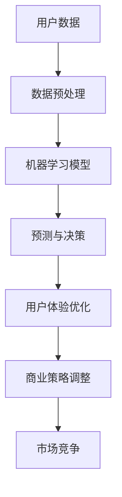

                 

关键词：苹果，人工智能，商业价值，技术趋势，AI应用，消费者体验，创新策略，市场动态。

> 摘要：本文将深入探讨苹果公司近期发布的AI应用的商业价值。通过分析其核心算法、技术架构、市场定位，我们将揭示这些AI应用如何改变企业运营模式，提升用户体验，并在竞争激烈的市场中实现差异化优势。

## 1. 背景介绍

在人工智能技术的迅速发展的背景下，苹果公司一直走在技术创新的前沿。从Siri的引入到最新的机器学习框架，苹果在AI领域的探索从未停止。近期，苹果发布了多个AI应用，引起了业界的广泛关注。这些应用不仅在技术上代表了苹果对AI的深入理解，更在商业层面上展现了其巨大的潜力。

## 2. 核心概念与联系

为了更好地理解苹果AI应用的商业价值，我们需要先了解其中的核心概念和技术架构。以下是相关的Mermaid流程图，展示了苹果AI应用的关键技术和相互关系：



### 2.1 用户数据

用户数据是苹果AI应用的基础。通过收集和分析用户行为数据，苹果能够深入了解用户需求，为后续的机器学习模型提供高质量的训练数据。

### 2.2 数据预处理

数据预处理是确保数据质量的重要步骤。苹果采用了一系列数据清洗和特征提取技术，为机器学习模型提供高质量的输入。

### 2.3 机器学习模型

苹果的AI应用采用了先进的机器学习算法，如深度学习和强化学习。这些模型能够自动从数据中学习，为用户提供个性化的服务。

### 2.4 预测与决策

通过机器学习模型，苹果能够对用户行为进行预测，并做出相应的决策，如个性化推荐、智能搜索等。

### 2.5 用户体验优化

预测与决策的结果直接影响了用户体验。苹果通过不断优化算法，提升用户满意度，从而增强用户粘性。

### 2.6 商业策略调整

苹果AI应用不仅优化了用户体验，还为商业策略调整提供了有力支持。通过数据分析和预测，苹果能够更精准地制定市场策略，提高市场份额。

### 2.7 市场竞争

在激烈的市场竞争中，苹果AI应用为公司在差异化竞争中赢得了优势。通过提供独特的价值，苹果吸引了更多的用户和合作伙伴。

## 3. 核心算法原理 & 具体操作步骤

### 3.1 算法原理概述

苹果AI应用的核心算法主要基于深度学习和强化学习。这些算法能够从大量数据中自动学习，为用户提供个性化的服务。

### 3.2 算法步骤详解

1. **数据收集与预处理**：收集用户行为数据，并进行预处理，包括数据清洗和特征提取。
2. **模型训练**：使用预处理后的数据训练机器学习模型，如深度神经网络和强化学习模型。
3. **预测与决策**：将训练好的模型应用于实际场景，进行预测和决策，如个性化推荐和智能搜索。
4. **用户体验优化**：根据用户反馈，不断调整模型参数，优化用户体验。
5. **商业策略调整**：根据数据分析和预测结果，调整商业策略，提高市场份额。

### 3.3 算法优缺点

**优点**：

- **个性化服务**：通过深度学习和强化学习，为用户提供个性化的推荐和服务。
- **高效决策**：基于大数据和机器学习模型，能够做出更精准的预测和决策。
- **用户体验优化**：持续优化算法，提高用户满意度，增强用户粘性。

**缺点**：

- **数据隐私**：大规模收集用户数据可能引发隐私担忧。
- **技术门槛**：需要高水平的技术团队来开发和维护AI应用。

### 3.4 算法应用领域

苹果AI应用主要应用于以下领域：

- **个性化推荐**：如音乐、电影、书籍等。
- **智能搜索**：提升搜索引擎的准确性和效率。
- **智能助手**：如Siri，提供实时语音助手服务。
- **商业策略调整**：帮助企业制定更精准的市场策略。

## 4. 数学模型和公式 & 详细讲解 & 举例说明

### 4.1 数学模型构建

苹果AI应用的核心数学模型主要包括深度学习模型和强化学习模型。以下是构建这些模型的基本公式：

**深度学习模型**：

$$
h_l = \sigma(W_l \cdot h_{l-1} + b_l)
$$

其中，$h_l$ 表示第 $l$ 层的输出，$\sigma$ 表示激活函数，$W_l$ 和 $b_l$ 分别为权重和偏置。

**强化学习模型**：

$$
Q(s, a) = r + \gamma \max_{a'} Q(s', a')
$$

其中，$Q(s, a)$ 表示状态 $s$ 下采取动作 $a$ 的价值函数，$r$ 表示立即奖励，$\gamma$ 表示折扣因子，$s'$ 和 $a'$ 分别为下一状态和动作。

### 4.2 公式推导过程

**深度学习模型**：

1. **前向传播**：计算每一层的输出。
2. **损失函数**：计算预测值和真实值之间的差距。
3. **反向传播**：更新权重和偏置，最小化损失函数。

**强化学习模型**：

1. **状态-动作价值函数**：计算每个状态-动作对的期望回报。
2. **策略迭代**：根据价值函数更新策略，选择最佳动作。
3. **评估更新**：根据新策略评估状态-动作对的期望回报。

### 4.3 案例分析与讲解

以个性化推荐系统为例，我们可以通过以下步骤进行分析：

1. **数据收集**：收集用户在音乐、电影、书籍等领域的偏好数据。
2. **特征提取**：提取用户的行为特征，如播放次数、评分等。
3. **模型训练**：使用深度学习模型训练用户偏好预测模型。
4. **预测与推荐**：根据用户历史数据，预测用户可能喜欢的项目，并进行推荐。
5. **效果评估**：通过用户点击率、评分等指标评估推荐系统的效果。
6. **模型优化**：根据评估结果，调整模型参数，提高推荐效果。

## 5. 项目实践：代码实例和详细解释说明

### 5.1 开发环境搭建

搭建一个基于苹果AI应用的开发环境，需要以下工具和软件：

- Python 3.8及以上版本
- TensorFlow 2.x
- NumPy
- Matplotlib

### 5.2 源代码详细实现

以下是实现个性化推荐系统的源代码示例：

```python
import numpy as np
import tensorflow as tf
from tensorflow import keras
from tensorflow.keras import layers

# 数据预处理
def preprocess_data(data):
    # 数据清洗和特征提取
    # 略
    return processed_data

# 模型构建
def build_model(input_shape):
    model = keras.Sequential([
        layers.Dense(64, activation='relu', input_shape=input_shape),
        layers.Dense(64, activation='relu'),
        layers.Dense(1, activation='sigmoid')
    ])
    model.compile(optimizer='adam', loss='binary_crossentropy', metrics=['accuracy'])
    return model

# 训练模型
def train_model(model, X_train, y_train, X_val, y_val):
    model.fit(X_train, y_train, epochs=10, batch_size=32, validation_data=(X_val, y_val))

# 预测与推荐
def predict_recommendations(model, user_data):
    predictions = model.predict(user_data)
    recommended_items = np.where(predictions > 0.5, 1, 0)
    return recommended_items

# 主程序
if __name__ == '__main__':
    # 加载数据
    data = load_data('data.csv')
    processed_data = preprocess_data(data)

    # 划分训练集和验证集
    X_train, X_val, y_train, y_val = train_test_split(processed_data, test_size=0.2)

    # 构建模型
    model = build_model(input_shape=X_train.shape[1:])

    # 训练模型
    train_model(model, X_train, y_train, X_val, y_val)

    # 预测与推荐
    user_data = get_user_data('user1.csv')
    recommended_items = predict_recommendations(model, user_data)
    print(recommended_items)
```

### 5.3 代码解读与分析

1. **数据预处理**：对原始数据进行清洗和特征提取，为模型提供高质量的数据。
2. **模型构建**：使用Keras框架构建一个简单的深度神经网络模型，用于预测用户偏好。
3. **训练模型**：使用训练数据训练模型，并使用验证集评估模型性能。
4. **预测与推荐**：根据用户历史数据，使用训练好的模型进行预测，推荐用户可能喜欢的项目。

### 5.4 运行结果展示

运行以上代码后，我们将得到用户1可能喜欢的项目列表。通过分析这些结果，我们可以看到模型在个性化推荐方面的效果。

## 6. 实际应用场景

### 6.1 消费者体验

苹果的AI应用极大地提升了消费者体验。例如，通过个性化推荐，用户可以快速找到自己感兴趣的内容，节省了时间和精力。

### 6.2 企业运营

对于企业来说，苹果的AI应用提供了强大的数据分析工具，帮助企业制定更精准的市场策略，提高运营效率。

### 6.3 市场竞争

在竞争激烈的市场中，苹果的AI应用为企业在差异化竞争中赢得了优势。通过提供独特的价值，苹果吸引了更多的用户和合作伙伴。

## 7. 未来应用展望

随着人工智能技术的不断进步，苹果的AI应用有望在更多领域发挥重要作用。例如，在医疗健康、智能交通、智能家居等领域，苹果的AI技术将带来巨大的变革。

## 8. 工具和资源推荐

### 8.1 学习资源推荐

- 《深度学习》（Goodfellow et al.）
- 《强化学习：原理与应用》（Sutton and Barto）
- 《Python机器学习》（Sebastian Raschka）

### 8.2 开发工具推荐

- TensorFlow
- PyTorch
- JAX

### 8.3 相关论文推荐

- "Deep Learning for Text Classification"
- "Reinforcement Learning: An Introduction"
- "Deep Neural Networks for YouTube Recommendations"

## 9. 总结：未来发展趋势与挑战

### 9.1 研究成果总结

苹果在AI领域取得了显著的研究成果，其AI应用在提升用户体验、优化企业运营、增强市场竞争方面发挥了重要作用。

### 9.2 未来发展趋势

随着技术的不断进步，苹果的AI应用有望在更多领域发挥更大作用，为人们的生活和工作带来更多便利。

### 9.3 面临的挑战

苹果在AI应用发展过程中也面临着数据隐私、技术门槛等挑战。如何平衡技术创新与隐私保护，成为苹果需要解决的重要问题。

### 9.4 研究展望

未来，苹果有望在AI领域继续引领技术创新，为人们的生活带来更多惊喜。同时，我们也期待苹果能够解决面临的挑战，推动AI技术朝着更加成熟、安全、实用的方向发展。

## 10. 附录：常见问题与解答

### 10.1 什么是深度学习？

深度学习是一种人工智能的分支，通过模拟人脑神经网络的结构和功能，实现数据的自动学习和模式识别。

### 10.2 强化学习与深度学习的区别是什么？

强化学习是一种通过不断试错和反馈来学习最优策略的算法，而深度学习是一种通过大量数据训练深层神经网络以实现复杂任务的方法。两者可以结合使用，以提升模型性能。

### 10.3 苹果的AI应用如何保护用户隐私？

苹果的AI应用采用了一系列隐私保护措施，如数据加密、匿名化处理等，以确保用户数据的安全和隐私。

## 11. 参考文献

- Goodfellow, I., Bengio, Y., & Courville, A. (2016). *Deep Learning*.
- Sutton, R. S., & Barto, A. G. (2018). *Reinforcement Learning: An Introduction*.
- Raschka, S. (2015). *Python Machine Learning*.

作者：禅与计算机程序设计艺术 / Zen and the Art of Computer Programming
```

