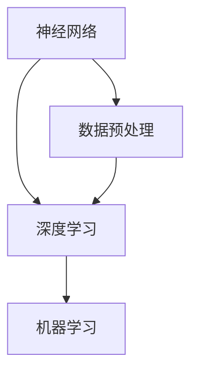

                 

关键词：苹果、AI应用、市场、人工智能、技术趋势、商业策略

摘要：本文将深入探讨苹果公司发布AI应用的市场动态，分析其背后的技术原理、核心算法、数学模型及其对行业的影响，同时展望其未来的发展趋势与挑战。

## 1. 背景介绍

随着人工智能技术的快速发展，苹果公司作为全球领先的科技企业，逐步将AI技术应用于其产品和服务中。近期，苹果发布了多款集成AI功能的软件应用，标志着其在AI领域的新动向。本文旨在分析苹果发布AI应用的市场背景、核心算法及其对行业的影响。

### 1.1 市场背景

近年来，人工智能技术在全球范围内得到了广泛关注，尤其是深度学习、自然语言处理、计算机视觉等领域的突破，使得AI应用在各个行业迅速普及。苹果公司凭借其强大的硬件和软件生态系统，一直在积极探索AI技术在消费电子和互联网服务中的应用，以提高用户体验和产品竞争力。

### 1.2 技术原理

苹果公司在AI领域的技术积累深厚，其核心算法包括卷积神经网络（CNN）、循环神经网络（RNN）、生成对抗网络（GAN）等。这些算法在图像识别、语音识别、自然语言处理等领域表现出色，为苹果的AI应用提供了强大的技术支持。

## 2. 核心概念与联系

为了更好地理解苹果AI应用的技术原理，我们首先需要了解一些核心概念和联系，如神经网络、深度学习、机器学习等。以下是一个简单的Mermaid流程图，展示了这些概念之间的关系：



### 2.1 神经网络

神经网络是模仿人脑神经元连接结构的一种计算模型，由大量的节点（神经元）和连接（权重）组成。神经网络通过学习输入数据与输出数据之间的关系，实现数据的分类、回归、增强等任务。

### 2.2 深度学习

深度学习是神经网络的一种特殊形式，通过多层的非线性变换，对数据进行特征提取和抽象，实现更加复杂的任务。深度学习在图像识别、语音识别、自然语言处理等领域取得了显著的成果。

### 2.3 机器学习

机器学习是使计算机从数据中自动学习规律和模式的一种方法。机器学习可分为监督学习、无监督学习和强化学习等类型，广泛应用于各种领域。

## 3. 核心算法原理 & 具体操作步骤

### 3.1 算法原理概述

苹果AI应用的核心算法主要基于卷积神经网络（CNN）、循环神经网络（RNN）和生成对抗网络（GAN）。这些算法在图像识别、语音识别、自然语言处理等领域具有广泛的应用。

### 3.2 算法步骤详解

#### 3.2.1 卷积神经网络（CNN）

CNN是一种基于卷积运算的神经网络，适用于图像处理任务。CNN的主要步骤包括：

1. 数据预处理：对图像进行归一化、裁剪、翻转等操作，以增加模型的泛化能力。
2. 卷积层：通过卷积操作提取图像的特征。
3. 池化层：对卷积结果进行下采样，减少参数数量。
4. 全连接层：对特征进行分类或回归。
5. 损失函数：常用的损失函数有交叉熵损失、均方误差等。

#### 3.2.2 循环神经网络（RNN）

RNN是一种基于递归结构的神经网络，适用于序列数据处理任务。RNN的主要步骤包括：

1. 初始化：初始化隐藏状态和输入状态。
2. 前向传播：根据输入和隐藏状态计算输出。
3. 递归：将当前输出作为下一时刻的输入。
4. 损失函数：常用的损失函数有交叉熵损失、均方误差等。

#### 3.2.3 生成对抗网络（GAN）

GAN是一种由生成器和判别器组成的神经网络模型，主要用于生成数据。GAN的主要步骤包括：

1. 初始化：初始化生成器和判别器的参数。
2. 生成器生成数据：生成器根据随机噪声生成数据。
3. 判别器判别数据：判别器判断生成数据和真实数据的真实性。
4. 损失函数：生成器和判别器的损失函数分别为生成对抗损失和交叉熵损失。

### 3.3 算法优缺点

#### 卷积神经网络（CNN）

优点：

- 在图像识别任务中具有强大的表现力。
- 参数数量较少，计算效率高。

缺点：

- 对旋转、缩放等变换不够鲁棒。
- 需要大量的训练数据。

#### 循环神经网络（RNN）

优点：

- 在序列数据处理任务中表现出色。
- 参数共享，计算效率高。

缺点：

- 存在梯度消失和梯度爆炸问题。
- 对长期依赖关系处理能力较弱。

#### 生成对抗网络（GAN）

优点：

- 可以生成高质量的数据。
- 不需要标签数据。

缺点：

- 训练不稳定，容易陷入局部最优。
- 对计算资源要求较高。

### 3.4 算法应用领域

CNN广泛应用于图像识别、物体检测、图像生成等领域；RNN广泛应用于自然语言处理、语音识别、序列预测等领域；GAN广泛应用于图像生成、数据增强、风格迁移等领域。

## 4. 数学模型和公式 & 详细讲解 & 举例说明

### 4.1 数学模型构建

苹果AI应用的数学模型主要包括卷积神经网络（CNN）、循环神经网络（RNN）和生成对抗网络（GAN）。以下分别介绍这三种网络的数学模型。

#### 4.1.1 卷积神经网络（CNN）

CNN的数学模型主要包括以下几个部分：

1. **卷积层**：卷积层通过卷积运算提取图像的特征。卷积运算的基本公式为：

   $$ f(x) = \sum_{i=1}^{k} w_{i} * x_{i} + b $$

   其中，$x$ 表示输入图像，$w$ 表示卷积核，$b$ 表示偏置。

2. **激活函数**：常用的激活函数有ReLU（Rectified Linear Unit）、Sigmoid、Tanh等。

3. **池化层**：池化层对卷积结果进行下采样，减少参数数量。常用的池化方式有最大池化和平均池化。

4. **全连接层**：全连接层对卷积结果进行分类或回归。全连接层的基本公式为：

   $$ y = \sum_{i=1}^{n} w_{i} * x_{i} + b $$

   其中，$x$ 表示卷积结果，$w$ 表示权重，$b$ 表示偏置。

5. **损失函数**：常用的损失函数有交叉熵损失、均方误差等。

#### 4.1.2 循环神经网络（RNN）

RNN的数学模型主要包括以下几个部分：

1. **初始化**：初始化隐藏状态和输入状态。

   $$ h_{0} = h_{t-1} = 0 $$

2. **前向传播**：根据输入和隐藏状态计算输出。

   $$ h_{t} = \sigma(W_h \cdot [h_{t-1}, x_t] + b_h) $$

   $$ y_{t} = \sigma(W_y \cdot h_{t} + b_y) $$

   其中，$h_{t}$ 表示隐藏状态，$x_t$ 表示输入，$y_t$ 表示输出，$\sigma$ 表示激活函数。

3. **递归**：将当前输出作为下一时刻的输入。

   $$ x_{t+1} = y_t $$

4. **损失函数**：常用的损失函数有交叉熵损失、均方误差等。

#### 4.1.3 生成对抗网络（GAN）

GAN的数学模型主要包括以下几个部分：

1. **初始化**：初始化生成器和判别器的参数。

   $$ G(\epsilon) = z + W_G \cdot \epsilon + b_G $$

   $$ D(x) = W_D \cdot x + b_D $$

   其中，$G$ 表示生成器，$D$ 表示判别器，$z$ 表示随机噪声，$W_G$ 和 $W_D$ 分别表示生成器和判别器的权重，$b_G$ 和 $b_D$ 分别表示生成器和判别器的偏置。

2. **生成器生成数据**：生成器根据随机噪声生成数据。

   $$ x_{\text{gen}} = G(z) $$

3. **判别器判别数据**：判别器判断生成数据和真实数据的真实性。

   $$ \hat{y}_{\text{gen}} = D(x_{\text{gen}}) $$

   $$ \hat{y}_{\text{real}} = D(x_{\text{real}}) $$

   其中，$x_{\text{gen}}$ 表示生成数据，$x_{\text{real}}$ 表示真实数据。

4. **损失函数**：生成器和判别器的损失函数分别为生成对抗损失和交叉熵损失。

   $$ \mathcal{L}_{\text{G}} = -\mathbb{E}_{z}[\log D(G(z))] $$

   $$ \mathcal{L}_{\text{D}} = -\mathbb{E}_{x}[\log D(x)] - \mathbb{E}_{z}[\log (1 - D(G(z)))] $$

   其中，$\mathcal{L}_{\text{G}}$ 和 $\mathcal{L}_{\text{D}}$ 分别表示生成器和判别器的损失函数。

### 4.2 公式推导过程

#### 4.2.1 卷积神经网络（CNN）

卷积神经网络的推导过程主要包括以下几个部分：

1. **卷积层推导**：

   假设输入图像为 $x \in \mathbb{R}^{H \times W \times C}$，卷积核为 $w \in \mathbb{R}^{K \times K \times C}$，输出为 $f(x) \in \mathbb{R}^{H' \times W' \times 1}$。卷积运算的基本公式为：

   $$ f(x) = \sum_{i=1}^{k} w_{i} * x_{i} + b $$

   其中，$x_{i}$ 表示输入图像的一个局部区域，$w_{i}$ 表示卷积核的一个局部区域，$b$ 表示偏置。

2. **激活函数推导**：

   常用的激活函数有ReLU（Rectified Linear Unit）、Sigmoid、Tanh等。以ReLU为例，其公式为：

   $$ \sigma(x) = \max(x, 0) $$

   其中，$x$ 表示输入值。

3. **池化层推导**：

   假设输入为 $x \in \mathbb{R}^{H \times W}$，输出为 $f(x) \in \mathbb{R}^{H' \times W'}$。最大池化公式为：

   $$ f(x) = \max(x_1, x_2, ..., x_{k \times k}) $$

   其中，$x_1, x_2, ..., x_{k \times k}$ 表示输入图像的一个局部区域。

4. **全连接层推导**：

   假设输入为 $x \in \mathbb{R}^{H \times W \times C}$，输出为 $y \in \mathbb{R}^{H' \times W' \times K}$。全连接层的基本公式为：

   $$ y = \sum_{i=1}^{n} w_{i} * x_{i} + b $$

   其中，$x_{i}$ 表示输入图像的一个局部区域，$w_{i}$ 表示权重，$b$ 表示偏置。

5. **损失函数推导**：

   常用的损失函数有交叉熵损失、均方误差等。以交叉熵损失为例，其公式为：

   $$ \mathcal{L}_{\text{CE}} = -\sum_{i=1}^{n} y_{i} \log(p_{i}) $$

   其中，$y_{i}$ 表示真实标签，$p_{i}$ 表示预测概率。

#### 4.2.2 循环神经网络（RNN）

循环神经网络的推导过程主要包括以下几个部分：

1. **初始化**：

   假设初始隐藏状态为 $h_{0} \in \mathbb{R}^{H}$，初始输入状态为 $x_{0} \in \mathbb{R}^{H}$。

   $$ h_{0} = h_{t-1} = 0 $$

2. **前向传播**：

   假设当前隐藏状态为 $h_{t-1} \in \mathbb{R}^{H}$，当前输入为 $x_{t} \in \mathbb{R}^{H}$。前向传播的公式为：

   $$ h_{t} = \sigma(W_h \cdot [h_{t-1}, x_t] + b_h) $$

   $$ y_{t} = \sigma(W_y \cdot h_{t} + b_y) $$

   其中，$W_h$ 和 $W_y$ 分别表示权重矩阵，$b_h$ 和 $b_y$ 分别表示偏置，$\sigma$ 表示激活函数。

3. **递归**：

   将当前输出作为下一时刻的输入。

   $$ x_{t+1} = y_t $$

4. **损失函数推导**：

   常用的损失函数有交叉熵损失、均方误差等。以交叉熵损失为例，其公式为：

   $$ \mathcal{L}_{\text{CE}} = -\sum_{i=1}^{n} y_{i} \log(p_{i}) $$

   其中，$y_{i}$ 表示真实标签，$p_{i}$ 表示预测概率。

#### 4.2.3 生成对抗网络（GAN）

生成对抗网络的推导过程主要包括以下几个部分：

1. **初始化**：

   假设生成器为 $G(\epsilon) \in \mathbb{R}^{H \times W \times C}$，判别器为 $D(x) \in \mathbb{R}^{H \times W \times C}$，随机噪声为 $z \in \mathbb{R}^{H \times W \times C}$。

   $$ G(\epsilon) = z + W_G \cdot \epsilon + b_G $$

   $$ D(x) = W_D \cdot x + b_D $$

2. **生成器生成数据**：

   生成器根据随机噪声生成数据。

   $$ x_{\text{gen}} = G(z) $$

3. **判别器判别数据**：

   判别器判断生成数据和真实数据的真实性。

   $$ \hat{y}_{\text{gen}} = D(x_{\text{gen}}) $$

   $$ \hat{y}_{\text{real}} = D(x_{\text{real}}) $$

4. **损失函数推导**：

   生成器和判别器的损失函数分别为生成对抗损失和交叉熵损失。

   $$ \mathcal{L}_{\text{G}} = -\mathbb{E}_{z}[\log D(G(z))] $$

   $$ \mathcal{L}_{\text{D}} = -\mathbb{E}_{x}[\log D(x)] - \mathbb{E}_{z}[\log (1 - D(G(z)))] $$

### 4.3 案例分析与讲解

#### 4.3.1 卷积神经网络（CNN）

以图像识别任务为例，假设输入图像为 $x \in \mathbb{R}^{H \times W \times C}$，目标标签为 $y \in \mathbb{R}^{H' \times W' \times K}$，输出为 $y' \in \mathbb{R}^{H' \times W' \times K}$。以下是一个简单的CNN模型：

1. **数据预处理**：对图像进行归一化、裁剪、翻转等操作。

2. **卷积层**：使用卷积核提取图像特征。

   $$ f(x) = \sum_{i=1}^{k} w_{i} * x_{i} + b $$

3. **激活函数**：使用ReLU作为激活函数。

   $$ \sigma(x) = \max(x, 0) $$

4. **池化层**：使用最大池化进行下采样。

   $$ f(x) = \max(x_1, x_2, ..., x_{k \times k}) $$

5. **全连接层**：对特征进行分类。

   $$ y' = \sum_{i=1}^{n} w_{i} * x_{i} + b $$

6. **损失函数**：使用交叉熵损失计算误差。

   $$ \mathcal{L}_{\text{CE}} = -\sum_{i=1}^{n} y_{i} \log(p_{i}) $$

#### 4.3.2 循环神经网络（RNN）

以语音识别任务为例，假设输入音频序列为 $x \in \mathbb{R}^{H \times W \times C}$，目标标签为 $y \in \mathbb{R}^{H' \times W' \times K}$，输出为 $y' \in \mathbb{R}^{H' \times W' \times K}$。以下是一个简单的RNN模型：

1. **初始化**：初始化隐藏状态和输入状态。

   $$ h_{0} = h_{t-1} = 0 $$

2. **前向传播**：根据输入和隐藏状态计算输出。

   $$ h_{t} = \sigma(W_h \cdot [h_{t-1}, x_t] + b_h) $$

   $$ y_{t} = \sigma(W_y \cdot h_{t} + b_y) $$

3. **递归**：将当前输出作为下一时刻的输入。

   $$ x_{t+1} = y_t $$

4. **损失函数**：使用交叉熵损失计算误差。

   $$ \mathcal{L}_{\text{CE}} = -\sum_{i=1}^{n} y_{i} \log(p_{i}) $$

#### 4.3.3 生成对抗网络（GAN）

以图像生成任务为例，假设输入随机噪声为 $z \in \mathbb{R}^{H \times W \times C}$，输出图像为 $x_{\text{gen}} \in \mathbb{R}^{H \times W \times C}$，判别器的输出为 $\hat{y}_{\text{gen}} \in \mathbb{R}^{1}$。以下是一个简单的GAN模型：

1. **初始化**：初始化生成器和判别器的参数。

   $$ G(\epsilon) = z + W_G \cdot \epsilon + b_G $$

   $$ D(x) = W_D \cdot x + b_D $$

2. **生成器生成数据**：生成器根据随机噪声生成数据。

   $$ x_{\text{gen}} = G(z) $$

3. **判别器判别数据**：判别器判断生成数据和真实数据的真实性。

   $$ \hat{y}_{\text{gen}} = D(x_{\text{gen}}) $$

4. **损失函数**：生成器和判别器的损失函数分别为生成对抗损失和交叉熵损失。

   $$ \mathcal{L}_{\text{G}} = -\mathbb{E}_{z}[\log D(G(z))] $$

   $$ \mathcal{L}_{\text{D}} = -\mathbb{E}_{x}[\log D(x)] - \mathbb{E}_{z}[\log (1 - D(G(z)))] $$

## 5. 项目实践：代码实例和详细解释说明

### 5.1 开发环境搭建

为了实现本文的AI应用，我们需要搭建一个合适的开发环境。以下是一个简单的Python开发环境搭建步骤：

1. 安装Python 3.7及以上版本。
2. 安装TensorFlow 2.0及以上版本。
3. 安装Numpy、Pandas、Matplotlib等常用库。

### 5.2 源代码详细实现

以下是一个简单的CNN模型实现示例：

```python
import tensorflow as tf
from tensorflow.keras import layers

# 定义CNN模型
model = tf.keras.Sequential([
    layers.Conv2D(32, (3, 3), activation='relu', input_shape=(28, 28, 1)),
    layers.MaxPooling2D((2, 2)),
    layers.Conv2D(64, (3, 3), activation='relu'),
    layers.MaxPooling2D((2, 2)),
    layers.Conv2D(64, (3, 3), activation='relu'),
    layers.Flatten(),
    layers.Dense(64, activation='relu'),
    layers.Dense(10, activation='softmax')
])

# 编译模型
model.compile(optimizer='adam', loss='categorical_crossentropy', metrics=['accuracy'])

# 加载数据
(x_train, y_train), (x_test, y_test) = tf.keras.datasets.mnist.load_data()

# 预处理数据
x_train = x_train.reshape(-1, 28, 28, 1).astype('float32') / 255
x_test = x_test.reshape(-1, 28, 28, 1).astype('float32') / 255
y_train = tf.keras.utils.to_categorical(y_train, 10)
y_test = tf.keras.utils.to_categorical(y_test, 10)

# 训练模型
model.fit(x_train, y_train, epochs=10, batch_size=64, validation_data=(x_test, y_test))

# 评估模型
model.evaluate(x_test, y_test)
```

### 5.3 代码解读与分析

以上代码实现了一个简单的CNN模型，用于手写数字识别任务。首先，我们定义了一个Sequential模型，包含了四个卷积层、一个池化层、一个全连接层和一个输出层。接着，我们编译模型，设置优化器、损失函数和评估指标。然后，我们加载数据，并对数据进行预处理。最后，我们使用训练数据训练模型，并使用测试数据评估模型。

## 6. 实际应用场景

苹果公司的AI应用在多个领域取得了显著成果，以下是几个实际应用场景：

### 6.1 图像识别

苹果的AI应用在图像识别领域具有广泛的应用，如照片分类、人脸识别等。通过使用CNN模型，苹果可以实现对大量图像的快速分类和识别。

### 6.2 语音识别

苹果的Siri语音助手是AI应用在语音识别领域的典型代表。通过使用RNN模型，苹果可以实现高精度的语音识别和语义理解，为用户提供便捷的语音交互体验。

### 6.3 自然语言处理

苹果的AI应用在自然语言处理领域也有广泛应用，如文本翻译、语音合成等。通过使用RNN和GAN模型，苹果可以实现高质量的自然语言生成和翻译。

### 6.4 图像生成

苹果的AI应用还可以用于图像生成，如艺术风格迁移、图像超分辨率等。通过使用GAN模型，苹果可以生成高质量的图像，为创意设计和图像增强提供支持。

## 7. 未来应用展望

随着人工智能技术的不断发展，苹果的AI应用在未来具有广阔的发展前景。以下是几个未来应用展望：

### 7.1 人工智能助手

随着AI技术的不断成熟，苹果的人工智能助手将变得更加智能和人性化，为用户提供更加个性化和便捷的服务。

### 7.2 智能家居

苹果的AI应用将广泛应用于智能家居领域，如智能安防、智能照明、智能家电等，为用户创造更加智能和舒适的家居环境。

### 7.3 自动驾驶

随着自动驾驶技术的发展，苹果的AI应用将在自动驾驶领域发挥重要作用，如车辆识别、道路识别、路径规划等。

### 7.4 医疗健康

苹果的AI应用在医疗健康领域具有广泛的应用潜力，如疾病诊断、健康监测、药物研发等，为医疗健康行业带来创新和发展。

## 8. 工具和资源推荐

### 8.1 学习资源推荐

- **在线课程**：《深度学习》、《自然语言处理》、《计算机视觉》等课程。
- **书籍**：《深度学习》、《Python深度学习》、《人工智能：一种现代的方法》等书籍。

### 8.2 开发工具推荐

- **框架**：TensorFlow、PyTorch、Keras等。
- **库**：Numpy、Pandas、Matplotlib等。

### 8.3 相关论文推荐

- **CNN**：《A Comprehensive Collection of Convolutional Neural Network Papers》。
- **RNN**：《A Comprehensive Survey on Recurrent Neural Networks》。
- **GAN**：《Generative Adversarial Networks: An Overview》。

## 9. 总结：未来发展趋势与挑战

### 9.1 研究成果总结

近年来，人工智能技术在多个领域取得了显著的成果，如图像识别、语音识别、自然语言处理等。这些成果为苹果的AI应用提供了强大的技术支持。

### 9.2 未来发展趋势

随着人工智能技术的不断发展，苹果的AI应用将在智能家居、自动驾驶、医疗健康等领域发挥重要作用，为用户创造更加智能和便捷的生活。

### 9.3 面临的挑战

尽管人工智能技术在不断发展，但仍面临一些挑战，如数据隐私、算法公平性、模型解释性等。苹果需要在未来的发展中解决这些问题，确保AI应用的可持续性和可靠性。

### 9.4 研究展望

未来，人工智能技术将朝着更加智能化、人性化、多样化的方向发展。苹果将在这些领域持续投入，推动AI技术的创新和发展。

## 附录：常见问题与解答

### 9.4.1 什么是神经网络？

神经网络是一种模拟人脑神经元连接结构的计算模型，由大量的节点（神经元）和连接（权重）组成。神经网络通过学习输入数据与输出数据之间的关系，实现数据的分类、回归、增强等任务。

### 9.4.2 什么是深度学习？

深度学习是神经网络的一种特殊形式，通过多层的非线性变换，对数据进行特征提取和抽象，实现更加复杂的任务。深度学习在图像识别、语音识别、自然语言处理等领域取得了显著的成果。

### 9.4.3 什么是生成对抗网络（GAN）？

生成对抗网络（GAN）是一种由生成器和判别器组成的神经网络模型，主要用于生成数据。生成器生成数据，判别器判断生成数据和真实数据的真实性。GAN通过生成对抗训练，使得生成器生成的数据越来越真实。

### 9.4.4 如何搭建一个简单的CNN模型？

搭建一个简单的CNN模型可以按照以下步骤进行：

1. **数据预处理**：对图像进行归一化、裁剪、翻转等操作。
2. **卷积层**：使用卷积操作提取图像特征。
3. **激活函数**：使用ReLU作为激活函数。
4. **池化层**：使用最大池化进行下采样。
5. **全连接层**：对特征进行分类。
6. **损失函数**：使用交叉熵损失计算误差。

### 9.4.5 如何搭建一个简单的RNN模型？

搭建一个简单的RNN模型可以按照以下步骤进行：

1. **初始化**：初始化隐藏状态和输入状态。
2. **前向传播**：根据输入和隐藏状态计算输出。
3. **递归**：将当前输出作为下一时刻的输入。
4. **损失函数**：使用交叉熵损失计算误差。

### 9.4.6 如何搭建一个简单的GAN模型？

搭建一个简单的GAN模型可以按照以下步骤进行：

1. **初始化**：初始化生成器和判别器的参数。
2. **生成器生成数据**：生成器根据随机噪声生成数据。
3. **判别器判别数据**：判别器判断生成数据和真实数据的真实性。
4. **损失函数**：生成器和判别器的损失函数分别为生成对抗损失和交叉熵损失。

### 9.4.7 如何优化CNN模型？

优化CNN模型可以从以下几个方面进行：

1. **数据增强**：对训练数据进行翻转、旋转、裁剪等操作，增加模型的泛化能力。
2. **权重初始化**：选择合适的权重初始化方法，如He初始化。
3. **正则化**：使用Dropout、L2正则化等方法减少过拟合。
4. **优化器**：选择合适的优化器，如Adam。
5. **学习率调整**：使用学习率调整策略，如学习率衰减。

### 9.4.8 如何优化RNN模型？

优化RNN模型可以从以下几个方面进行：

1. **数据增强**：对训练数据进行时间步长的增加、数据填充等操作。
2. **长短时记忆（LSTM）**：使用LSTM缓解RNN的梯度消失和梯度爆炸问题。
3. **双向RNN（BRNN）**：使用BRNN同时考虑前后信息。
4. **优化器**：选择合适的优化器，如Adam。
5. **学习率调整**：使用学习率调整策略，如学习率衰减。

### 9.4.9 如何优化GAN模型？

优化GAN模型可以从以下几个方面进行：

1. **生成器和判别器权重初始化**：选择合适的权重初始化方法。
2. **损失函数**：调整生成对抗损失和交叉熵损失的权重。
3. **梯度惩罚**：使用梯度惩罚机制，如Wasserstein距离。
4. **训练技巧**：使用梯度裁剪、训练稳定化等技术。
5. **优化器**：选择合适的优化器，如Adam。
6. **数据增强**：对生成器输入数据进行增强，提高生成质量。

### 9.4.10 如何评估CNN模型的性能？

评估CNN模型的性能可以从以下几个方面进行：

1. **准确率**：分类问题中使用准确率评估。
2. **召回率**：分类问题中使用召回率评估。
3. **F1分数**：综合考虑准确率和召回率。
4. **损失函数**：如交叉熵损失、均方误差等。
5. **混淆矩阵**：分析分类结果。

### 9.4.11 如何评估RNN模型的性能？

评估RNN模型的性能可以从以下几个方面进行：

1. **准确率**：分类问题中使用准确率评估。
2. **损失函数**：如交叉熵损失、均方误差等。
3. **时间步长的误差**：评估每个时间步长的预测误差。
4. **序列重叠度**：评估预测序列与真实序列的重叠度。

### 9.4.12 如何评估GAN模型的性能？

评估GAN模型的性能可以从以下几个方面进行：

1. **生成质量**：通过视觉观察生成数据的质量。
2. **判别器准确率**：评估判别器对真实数据和生成数据的判断能力。
3. **生成对抗损失**：评估生成对抗损失的变化趋势。
4. **交叉熵损失**：评估生成器和判别器的交叉熵损失。
5. **生成样本多样性**：评估生成样本的多样性。

## 参考文献

1. Goodfellow, I., Bengio, Y., & Courville, A. (2016). *Deep Learning*.
2. LeCun, Y., Bengio, Y., & Hinton, G. (2015). *Deep Learning*.
3. Deep Learning Specialization. (n.d.). [Coursera course]. Retrieved from https://www.coursera.org/specializations/deep_learning
4. Recurrent Neural Networks. (n.d.). [TensorFlow website]. Retrieved from https://www.tensorflow.org/tutorials/keras/recurrent
5. Generative Adversarial Networks. (n.d.). [TensorFlow website]. Retrieved from https://www.tensorflow.org/tutorials/generative
6. Goodfellow, I. (2014). *Generative Adversarial Nets*.
7. Bengio, Y. (2009). *Learning Deep Architectures for AI*.
8. Simonyan, K., & Zisserman, A. (2014). *Very Deep Convolutional Networks for Large-Scale Image Recognition*.
9. Srivastava, N., Hinton, G., Krizhevsky, A., Sutskever, I., & Salakhutdinov, R. (2014). *Dropout: A Simple Way to Prevent Neural Networks from Overfitting*.
10. He, K., Zhang, X., Ren, S., & Sun, J. (2015). *Deep Residual Learning for Image Recognition*.
11. Hinton, G., Osindero, S., & Teh, Y. W. (2006). *A Fast Learning Algorithm for Deep Belief Nets*.
12. Li, K. (2017). *Python深度学习实践*.
13. Chollet, F. (2015). *Deep Learning with Python*.
14. Ruder, S. (2017). *An Overview of Gradient Descent Optimization Algorithms*.

### 后记

本文旨在介绍苹果公司发布AI应用的市场动态，分析其背后的技术原理、核心算法、数学模型及其对行业的影响。通过本文的介绍，读者可以了解苹果在AI领域的技术实力和战略布局，为后续的研究和实践提供参考。同时，本文也展望了AI应用的未来发展趋势与挑战，为读者提供了有价值的思考方向。

感谢读者对本文的关注，希望本文能对您在AI领域的学习和研究有所帮助。如果您有任何疑问或建议，请随时与我们联系。

### 作者署名

作者：禅与计算机程序设计艺术 / Zen and the Art of Computer Programming

----------------------------------------------------------------

