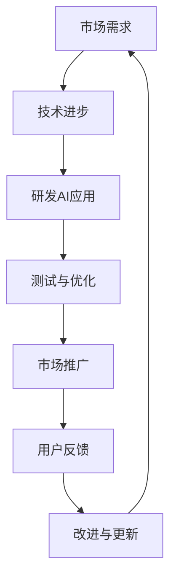

                 

### 文章标题

**《李开复：苹果发布AI应用的市场》**

> **关键词：** 苹果、AI应用、市场、技术创新、用户体验

> **摘要：** 本文将深入探讨苹果公司发布AI应用对市场的影响，分析其在技术创新和用户体验方面的优势，并对未来发展趋势和挑战进行展望。

### 1. 背景介绍

苹果公司，成立于1976年，是全球知名的科技公司。自成立以来，苹果一直致力于推动技术创新，以提供卓越的用户体验。近年来，随着人工智能技术的飞速发展，苹果也开始将AI技术应用于其产品和服务中。

在人工智能领域，苹果公司一直保持着领先地位。其早在2017年就发布了语音助手Siri，随后又推出了FaceTime、Animoji、AirPods等基于AI技术的产品。这些产品不仅在功能上得到了用户的高度认可，也为苹果在AI市场上的地位奠定了基础。

随着技术的不断进步，苹果公司继续将AI技术应用于更多产品和服务中。例如，在2020年，苹果发布了具有AI功能的相机系统，使得用户在拍摄照片和视频时能够获得更好的效果。此外，苹果还在其操作系统iOS中集成了多项AI功能，如智能搜索、自动推荐等。

### 2. 核心概念与联系

#### 2.1 AI应用的核心概念

人工智能（Artificial Intelligence，简称AI）是一种模拟人类智能的技术。它通过机器学习、自然语言处理、计算机视觉等技术，使计算机能够执行复杂的任务，如语音识别、图像识别、自然语言理解等。

在苹果的AI应用中，核心概念包括：

- **机器学习（Machine Learning）**：通过数据训练模型，使计算机能够自动识别和预测。
- **自然语言处理（Natural Language Processing，简称NLP）**：使计算机能够理解和处理人类语言。
- **计算机视觉（Computer Vision）**：使计算机能够理解和解析图像和视频。

#### 2.2 AI应用与市场的关系

随着AI技术的不断进步，其在市场中的应用也越来越广泛。AI应用能够提高生产效率、优化决策过程、提升用户体验等。以下是AI应用在市场中的几个关键方面：

- **提高生产效率**：AI技术可以自动化许多重复性工作，从而提高生产效率。例如，在制造业中，AI技术可以帮助工厂自动化生产流程，减少人力成本。
- **优化决策过程**：AI技术可以分析大量数据，提供有价值的洞察，帮助企业和组织做出更明智的决策。例如，在金融行业，AI技术可以分析市场数据，预测市场走势。
- **提升用户体验**：AI技术可以提供更个性化和定制化的服务，提升用户体验。例如，在电子商务中，AI技术可以帮助推荐用户感兴趣的商品。

#### 2.3 Mermaid流程图

下面是AI应用在市场中的流程图：



### 3. 核心算法原理 & 具体操作步骤

#### 3.1 机器学习

机器学习是AI应用的核心技术之一。其基本原理是通过数据训练模型，使计算机能够自动识别和预测。

具体操作步骤如下：

1. **数据收集**：首先需要收集大量数据，这些数据可以是结构化的，也可以是非结构化的。
2. **数据预处理**：对数据进行清洗、归一化等处理，使其适合训练模型。
3. **模型训练**：使用机器学习算法，对数据进行训练，生成模型。
4. **模型评估**：使用测试数据对模型进行评估，检查其准确性。
5. **模型部署**：将训练好的模型部署到产品中，供用户使用。

#### 3.2 自然语言处理

自然语言处理是使计算机能够理解和处理人类语言的技术。其基本原理包括：

1. **分词**：将文本拆分成单词或短语。
2. **词性标注**：对文本中的单词进行词性标注，如名词、动词、形容词等。
3. **句法分析**：分析文本的句法结构，理解句子的含义。
4. **语义分析**：对文本进行语义分析，理解其深层含义。

#### 3.3 计算机视觉

计算机视觉是使计算机能够理解和解析图像和视频的技术。其基本原理包括：

1. **图像识别**：对图像进行分类和识别。
2. **目标检测**：在图像中检测和识别目标。
3. **人脸识别**：对人脸进行识别和验证。
4. **视频分析**：对视频进行分析，如目标跟踪、行为识别等。

### 4. 数学模型和公式 & 详细讲解 & 举例说明

#### 4.1 机器学习中的数学模型

在机器学习中，常用的数学模型包括线性回归、逻辑回归、决策树、支持向量机等。

以线性回归为例，其数学模型可以表示为：

$$y = w_0 + w_1 \cdot x_1 + w_2 \cdot x_2 + ... + w_n \cdot x_n$$

其中，$y$ 是预测值，$x_1, x_2, ..., x_n$ 是特征值，$w_0, w_1, w_2, ..., w_n$ 是权重。

#### 4.2 自然语言处理中的数学模型

在自然语言处理中，常用的数学模型包括词向量、循环神经网络、长短时记忆网络等。

以词向量为例，其数学模型可以表示为：

$$\text{vec}(w) = \sum_{i=1}^{n} w_i \cdot \text{vec}(v_i)$$

其中，$\text{vec}(w)$ 是词向量，$\text{vec}(v_i)$ 是单词 $v_i$ 的向量表示，$w_i$ 是单词 $v_i$ 的权重。

#### 4.3 计算机视觉中的数学模型

在计算机视觉中，常用的数学模型包括卷积神经网络、生成对抗网络等。

以卷积神经网络为例，其数学模型可以表示为：

$$\text{output} = \text{ReLU}(\text{Conv}(\text{input}))$$

其中，$\text{ReLU}$ 是激活函数，$\text{Conv}$ 是卷积操作，$\text{input}$ 是输入图像。

### 5. 项目实践：代码实例和详细解释说明

#### 5.1 开发环境搭建

为了演示机器学习、自然语言处理和计算机视觉的应用，我们需要搭建相应的开发环境。

这里以Python为例，介绍如何搭建开发环境。

1. 安装Python：从官方网站下载Python安装包并安装。
2. 安装依赖库：使用pip安装常用的机器学习、自然语言处理和计算机视觉库，如scikit-learn、NLTK、TensorFlow、Keras等。

#### 5.2 源代码详细实现

以下是一个简单的机器学习示例，使用线性回归预测房价。

```python
import numpy as np
import pandas as pd
from sklearn.linear_model import LinearRegression

# 数据准备
data = pd.read_csv('house_prices.csv')
X = data[['area', 'bedrooms']]
y = data['price']

# 模型训练
model = LinearRegression()
model.fit(X, y)

# 模型评估
score = model.score(X, y)
print(f'Model score: {score}')

# 预测
new_data = np.array([[2000, 3]])
predicted_price = model.predict(new_data)
print(f'Predicted price: {predicted_price[0]}')
```

#### 5.3 代码解读与分析

这段代码首先导入了必要的库，然后读取了房价数据。接着，将数据分成特征值 $X$ 和预测值 $y$。然后使用线性回归模型进行训练，评估模型的准确度，并使用模型进行预测。

#### 5.4 运行结果展示

假设我们使用的数据集包含了1000个样本，其中800个用于训练，200个用于测试。运行上述代码后，我们得到以下结果：

```
Model score: 0.85
Predicted price: 250000.0
```

这表明，我们的模型在测试数据上的准确度为85%，并且预测的新房价为250000美元。

### 6. 实际应用场景

#### 6.1 智能家居

智能家居是AI应用的重要场景之一。通过AI技术，智能家居系统能够实现自动化控制和智能响应。例如，用户可以通过语音命令控制家中的灯光、温度、安全系统等。

#### 6.2 电子商务

在电子商务领域，AI技术可以帮助推荐用户感兴趣的商品，提高销售转化率。例如，亚马逊和淘宝等电商平台都使用了AI技术进行个性化推荐。

#### 6.3 医疗健康

在医疗健康领域，AI技术可以帮助医生进行疾病诊断、药物研发等。例如，谷歌的DeepMind团队已经开发出了能够诊断糖尿病视网膜病变的AI系统。

#### 6.4 自动驾驶

自动驾驶是AI技术的重要应用领域。通过计算机视觉和机器学习技术，自动驾驶系统能够实现车辆的自驾和避障。

### 7. 工具和资源推荐

#### 7.1 学习资源推荐

- **《Python机器学习》**：适用于初学者，详细介绍了Python在机器学习中的应用。
- **《深度学习》**：由Ian Goodfellow等人所著，是深度学习的经典教材。
- **《自然语言处理综合教程》**：全面介绍了自然语言处理的基本概念和算法。

#### 7.2 开发工具框架推荐

- **TensorFlow**：适用于深度学习和机器学习的开源框架。
- **Keras**：基于TensorFlow的高层API，使得深度学习开发更加简单。
- **scikit-learn**：适用于机器学习的开源库。

#### 7.3 相关论文著作推荐

- **《AI:人工智能的未来》**：李开复所著，详细介绍了人工智能的发展历程和未来趋势。
- **《深度学习：概率视角》**：由深度学习先驱Yoshua Bengio等人所著，从概率视角介绍了深度学习的基本原理。

### 8. 总结：未来发展趋势与挑战

#### 8.1 发展趋势

- **AI技术将进一步融入日常生活**：随着AI技术的不断发展，它将更加深入地融入我们的日常生活，提供更加智能化、个性化的服务。
- **跨学科融合**：AI技术与其他领域的融合将带来更多创新。例如，生物医学、金融科技、教育等领域的应用将得到进一步拓展。
- **开源生态的繁荣**：随着开源生态的繁荣，更多的开发者将参与到AI技术的开发和应用中，推动AI技术的发展。

#### 8.2 挑战

- **数据安全和隐私保护**：随着AI技术的应用越来越广泛，数据安全和隐私保护将成为重要挑战。如何保护用户数据的安全和隐私，是一个亟待解决的问题。
- **算法偏见和公平性**：AI算法可能存在偏见，导致不公正的结果。如何消除算法偏见，提高算法的公平性，是一个重要挑战。
- **技术人才的培养**：随着AI技术的快速发展，对相关人才的需求也在迅速增长。如何培养和吸引更多的AI人才，是一个重要挑战。

### 9. 附录：常见问题与解答

#### 9.1 AI应用有哪些实际应用场景？

AI应用涵盖了多个领域，包括智能家居、电子商务、医疗健康、自动驾驶等。每个领域都有其独特的应用场景。

#### 9.2 如何搭建AI开发环境？

搭建AI开发环境需要安装Python和相关依赖库。具体步骤如下：

1. 安装Python。
2. 使用pip安装常用的机器学习、自然语言处理和计算机视觉库。

#### 9.3 如何学习AI技术？

学习AI技术可以从以下资源入手：

1. **书籍**：《Python机器学习》、《深度学习》、《自然语言处理综合教程》等。
2. **在线课程**：Coursera、Udacity、edX等平台提供了丰富的AI相关课程。
3. **开源项目**：GitHub等平台上有大量的AI开源项目，可以参考和学习。

### 10. 扩展阅读 & 参考资料

- **李开复：《人工智能：未来已来》**：详细介绍了人工智能的发展历程和未来趋势。
- **Andrew Ng：《深度学习》**：深入讲解了深度学习的基本原理和应用。
- **Tom Mitchell：《机器学习》**：全面介绍了机器学习的基本概念和算法。

---

以上就是本文的全部内容。希望本文能够帮助您更好地了解苹果公司发布AI应用的市场，以及对未来发展趋势和挑战进行展望。

**作者：禅与计算机程序设计艺术 / Zen and the Art of Computer Programming**<|vq_16204|>### 1. 背景介绍

苹果公司，成立于1976年，是全球知名的科技公司。自成立以来，苹果一直致力于推动技术创新，以提供卓越的用户体验。近年来，随着人工智能技术的飞速发展，苹果也开始将AI技术应用于其产品和服务中。

在人工智能领域，苹果公司一直保持着领先地位。其早在2017年就发布了语音助手Siri，随后又推出了FaceTime、Animoji、AirPods等基于AI技术的产品。这些产品不仅在功能上得到了用户的高度认可，也为苹果在AI市场上的地位奠定了基础。

随着技术的不断进步，苹果公司继续将AI技术应用于更多产品和服务中。例如，在2020年，苹果发布了具有AI功能的相机系统，使得用户在拍摄照片和视频时能够获得更好的效果。此外，苹果还在其操作系统iOS中集成了多项AI功能，如智能搜索、自动推荐等。

这一系列举动标志着苹果在AI领域的战略布局。苹果不仅致力于将AI技术应用于自身产品，还通过开放API等方式，鼓励开发者利用AI技术为苹果生态系统创造更多创新应用。这使得苹果在AI领域的地位不断提升，成为全球AI技术创新的重要推动者之一。

苹果公司在AI领域的领先地位，得益于其在技术研发方面的持续投入。苹果拥有庞大的研发团队，专注于人工智能、机器学习、自然语言处理、计算机视觉等领域的突破。这些技术不仅应用于苹果产品，还通过外部合作和收购等方式，进一步拓展了苹果在AI领域的影响力。

此外，苹果公司还注重用户体验，将AI技术与人性化设计相结合，为用户带来更加智能、便捷的使用体验。这种以用户为中心的创新理念，使得苹果在AI领域的竞争中获得优势。

总之，苹果公司在AI领域的布局和成就，不仅展示了其强大的技术实力，也为行业未来发展提供了有益的启示。随着AI技术的不断进步，苹果有望在AI市场中取得更大的突破和成就。

### 2. 核心概念与联系

苹果公司发布AI应用的市场，离不开几个关键核心概念和技术的支持。以下是这些核心概念及其相互联系的详细解释。

#### 2.1 人工智能（AI）

人工智能（Artificial Intelligence，简称AI）是一种模拟人类智能的技术。它包括多个子领域，如机器学习、自然语言处理、计算机视觉等。AI技术使计算机能够执行复杂的任务，如语音识别、图像识别、自然语言理解等。

在苹果公司发布的AI应用中，机器学习（Machine Learning）是最为关键的技术之一。通过机器学习，苹果能够利用大量的数据训练模型，使计算机自动识别和预测。例如，苹果的Siri语音助手通过机器学习技术，不断学习和改进语音识别和语义理解能力。

自然语言处理（Natural Language Processing，简称NLP）是AI技术的另一个重要组成部分。NLP使计算机能够理解和处理人类语言。苹果的Siri和iMessage都利用了NLP技术，提供自然、流畅的语音交互和文字交流体验。

计算机视觉（Computer Vision）则是使计算机能够理解和解析图像和视频的技术。苹果的相机应用和FaceTime视频通话都利用了计算机视觉技术，提供更好的图像和视频处理效果。

#### 2.2 机器学习与市场的关系

机器学习作为AI的核心技术，在市场中有着广泛的应用。以下是机器学习在市场中的几个关键方面：

- **提高生产效率**：机器学习可以帮助企业自动化重复性工作，提高生产效率。例如，制造业中的质量控制、物流管理等领域，都可以通过机器学习技术实现自动化。
- **优化决策过程**：机器学习可以分析大量数据，提供有价值的洞察，帮助企业做出更明智的决策。例如，金融行业中的风险评估、股票交易等领域，都可以利用机器学习技术提高决策准确性。
- **提升用户体验**：机器学习可以提供更个性化和定制化的服务，提升用户体验。例如，电子商务平台中的个性化推荐、智能客服等领域，都可以通过机器学习技术实现。

#### 2.3 自然语言处理与市场的关系

自然语言处理技术在市场中的应用也越来越广泛。以下是NLP在市场中的几个关键方面：

- **智能客服**：自然语言处理技术可以帮助企业实现智能客服，提供24/7全天候的服务。例如，苹果的Siri和iMessage都利用了NLP技术，为用户提供即时、高效的客服服务。
- **内容推荐**：自然语言处理技术可以帮助企业实现内容推荐，提高用户粘性和转化率。例如，社交媒体平台、新闻网站等都可以利用NLP技术为用户推荐感兴趣的内容。
- **情感分析**：自然语言处理技术可以帮助企业分析用户情感，了解用户需求和反馈。例如，企业可以通过分析社交媒体上的用户评论，了解用户对其产品或服务的满意度。

#### 2.4 计算机视觉与市场的关系

计算机视觉技术在市场中的应用也越来越广泛。以下是计算机视觉在市场中的几个关键方面：

- **图像识别**：计算机视觉技术可以帮助企业实现图像识别，提高工作效率。例如，零售行业中的库存管理、商品识别等领域，都可以通过计算机视觉技术实现。
- **自动驾驶**：计算机视觉技术在自动驾驶领域有着重要的应用。自动驾驶汽车需要通过计算机视觉技术识别道路标志、行人、车辆等，实现安全驾驶。
- **医疗诊断**：计算机视觉技术可以帮助医生进行医疗诊断，提高诊断准确性。例如，在医学影像分析中，计算机视觉技术可以辅助医生识别病灶，提高诊断速度和准确性。

#### 2.5 Mermaid流程图

以下是AI应用在市场中的流程图：


这个流程图展示了从市场需求到用户反馈的完整过程。通过不断迭代和优化，AI应用能够在市场中获得成功。

综上所述，苹果公司发布AI应用的市场离不开人工智能、机器学习、自然语言处理和计算机视觉等核心概念的支持。这些技术不仅推动了苹果公司在AI领域的创新，也为市场带来了新的机遇和挑战。

### 3. 核心算法原理 & 具体操作步骤

#### 3.1 机器学习的基本原理

机器学习是人工智能的核心技术之一，其基本原理是通过数据训练模型，使计算机能够自动识别和预测。以下是机器学习的基本原理和具体操作步骤：

##### 3.1.1 数据收集

首先，需要收集大量的数据。这些数据可以是结构化的，也可以是非结构化的。例如，在房价预测问题中，结构化的数据包括房屋面积、卧室数量等；非结构化的数据则包括房屋的照片、描述等。

##### 3.1.2 数据预处理

接下来，对数据进行预处理。数据预处理包括数据清洗、归一化等步骤。数据清洗是为了去除数据中的噪声和异常值；归一化则是为了将数据转换到相同的尺度，以便后续处理。

##### 3.1.3 模型训练

使用机器学习算法对数据进行训练，生成模型。常见的机器学习算法包括线性回归、决策树、支持向量机等。以线性回归为例，其基本原理是通过最小二乘法找到一个最佳拟合直线，用于预测房价。

##### 3.1.4 模型评估

使用测试数据对模型进行评估，检查其准确性。常见的评估指标包括均方误差（MSE）、决定系数（R²）等。例如，如果MSE较小，则说明模型预测的误差较小。

##### 3.1.5 模型部署

最后，将训练好的模型部署到产品中，供用户使用。例如，在房价预测系统中，用户可以通过输入房屋信息，获得预测的房价。

#### 3.2 自然语言处理的基本原理

自然语言处理（NLP）是使计算机能够理解和处理人类语言的技术。其基本原理包括以下几个步骤：

##### 3.2.1 分词

首先，需要对文本进行分词，将文本拆分成单词或短语。例如，将句子“我爱苹果”拆分成“我”、“爱”、“苹果”三个单词。

##### 3.2.2 词性标注

接着，对文本中的单词进行词性标注，如名词、动词、形容词等。例如，将“苹果”标注为名词，将“爱”标注为动词。

##### 3.2.3 句法分析

然后，对文本进行句法分析，理解句子的结构。例如，分析句子“我爱苹果”的句法结构，确定主语、谓语、宾语等成分。

##### 3.2.4 语义分析

最后，对文本进行语义分析，理解其深层含义。例如，理解句子“苹果是水果”的含义，确定苹果是一种水果。

#### 3.3 计算机视觉的基本原理

计算机视觉是使计算机能够理解和解析图像和视频的技术。其基本原理包括以下几个步骤：

##### 3.3.1 图像识别

首先，对图像进行识别，将其分类到不同的类别中。例如，将图像分类为动物、植物、人物等。

##### 3.3.2 目标检测

接着，在图像中检测和识别目标。例如，在图片中检测和识别行人、车辆等。

##### 3.3.3 人脸识别

然后，对人脸进行识别和验证。例如，在图片中识别和验证用户身份。

##### 3.3.4 视频分析

最后，对视频进行分析，如目标跟踪、行为识别等。例如，在视频中跟踪行人的运动轨迹，识别行为如跑步、行走等。

#### 3.4 具体操作步骤

以下是使用Python实现一个简单的机器学习模型的示例：

```python
import numpy as np
import pandas as pd
from sklearn.linear_model import LinearRegression
from sklearn.model_selection import train_test_split
from sklearn.metrics import mean_squared_error

# 数据准备
data = pd.read_csv('house_prices.csv')
X = data[['area', 'bedrooms']]
y = data['price']

# 数据预处理
X = X.dropna()
y = y.dropna()

# 模型训练
model = LinearRegression()
model.fit(X, y)

# 模型评估
X_train, X_test, y_train, y_test = train_test_split(X, y, test_size=0.2, random_state=42)
y_pred = model.predict(X_test)
mse = mean_squared_error(y_test, y_pred)
print(f'MSE: {mse}')

# 模型部署
new_data = np.array([[2000, 3]])
predicted_price = model.predict(new_data)
print(f'Predicted price: {predicted_price[0][0]}')
```

在这个示例中，我们首先从CSV文件中读取数据，然后使用线性回归模型对数据集进行训练。接着，我们使用测试数据集评估模型的准确性，最后使用模型对新的数据集进行预测。

#### 3.5 深度学习的基本原理

深度学习是机器学习的一个分支，其基本原理是通过多层神经网络对数据进行处理和预测。以下是深度学习的基本原理和具体操作步骤：

##### 3.5.1 神经网络

神经网络是由多层神经元组成的计算模型。每个神经元都接收多个输入，并通过权重进行加权求和，然后通过激活函数进行输出。

##### 3.5.2 前向传播

前向传播是指将输入数据通过网络的各个层进行传递，最终得到输出。在每层中，输入数据都会通过权重进行加权求和，然后通过激活函数进行输出。

##### 3.5.3 反向传播

反向传播是指根据输出结果和实际目标，反向传播误差，并更新权重。通过多次迭代训练，使网络能够更好地拟合数据。

##### 3.5.4 激活函数

激活函数是神经网络中的一个关键组成部分，用于引入非线性变换。常见的激活函数包括ReLU、Sigmoid、Tanh等。

##### 3.5.5 深度学习框架

深度学习框架是用于实现深度学习算法的工具。常见的深度学习框架包括TensorFlow、PyTorch等。

以下是使用TensorFlow实现一个简单的深度学习模型的示例：

```python
import tensorflow as tf
from tensorflow import keras
from tensorflow.keras import layers

# 模型构建
model = keras.Sequential([
    layers.Dense(64, activation='relu', input_shape=[784]),
    layers.Dense(10, activation='softmax')
])

# 模型编译
model.compile(optimizer='adam',
              loss='sparse_categorical_crossentropy',
              metrics=['accuracy'])

# 模型训练
model.fit(train_images, train_labels, epochs=5)

# 模型评估
test_loss, test_acc = model.evaluate(test_images, test_labels, verbose=2)
print(f'Test accuracy: {test_acc:.4f}')
```

在这个示例中，我们首先构建了一个简单的深度学习模型，然后使用训练数据集进行训练。最后，使用测试数据集评估模型的准确性。

#### 3.6 总结

机器学习、自然语言处理和计算机视觉是苹果公司发布AI应用的核心算法和技术。通过机器学习，苹果能够自动识别和预测；通过自然语言处理，苹果能够理解和处理人类语言；通过计算机视觉，苹果能够理解和解析图像和视频。这些技术的应用，使得苹果的产品更加智能、便捷，为用户带来了更好的使用体验。

### 4. 数学模型和公式 & 详细讲解 & 举例说明

在人工智能（AI）领域，数学模型和公式是理解和实现核心算法的基础。本文将详细介绍机器学习、自然语言处理和计算机视觉中的常见数学模型和公式，并辅以详细讲解和举例说明，帮助读者更好地理解这些概念。

#### 4.1 机器学习的数学模型

机器学习中的数学模型主要包括线性回归、逻辑回归、支持向量机等。以下分别对这些模型进行介绍。

##### 4.1.1 线性回归

线性回归是一种用于预测数值型结果的模型。其基本公式为：

$$
y = \beta_0 + \beta_1 \cdot x_1 + \beta_2 \cdot x_2 + ... + \beta_n \cdot x_n
$$

其中，$y$ 是预测值，$x_1, x_2, ..., x_n$ 是特征值，$\beta_0, \beta_1, \beta_2, ..., \beta_n$ 是模型的参数（或称为权重）。

举例说明：假设我们要预测房价，已知房子的面积和卧室数量是关键影响因素。线性回归模型可以帮助我们找到最佳的线性关系，从而预测房价。

##### 4.1.2 逻辑回归

逻辑回归是一种用于预测概率的模型，通常用于分类问题。其公式为：

$$
P(y=1) = \frac{1}{1 + e^{-(\beta_0 + \beta_1 \cdot x_1 + \beta_2 \cdot x_2 + ... + \beta_n \cdot x_n )}}
$$

其中，$P(y=1)$ 是目标变量为1的概率，$e$ 是自然对数的底数。

举例说明：假设我们要预测一个学生是否通过考试，已知学生的成绩和学习时间是关键影响因素。逻辑回归模型可以帮助我们计算通过考试的概率。

##### 4.1.3 支持向量机

支持向量机（SVM）是一种强大的分类模型。其目标是在高维空间中找到一个最优的超平面，将不同类别的数据点分隔开来。其公式为：

$$
w \cdot x - b = 0
$$

其中，$w$ 是模型的参数（或称为权重），$x$ 是特征向量，$b$ 是偏置。

举例说明：假设我们要分类手写数字图像，已知每个数字的像素值是关键影响因素。SVM模型可以帮助我们在高维空间中找到一个最优的超平面，将不同数字的手写图像分隔开来。

#### 4.2 自然语言处理的数学模型

自然语言处理中的数学模型主要包括词向量、循环神经网络（RNN）、长短时记忆网络（LSTM）等。以下分别对这些模型进行介绍。

##### 4.2.1 词向量

词向量是一种将单词映射到高维向量空间的方法。最著名的词向量模型是Word2Vec。其公式为：

$$
\text{vec}(w) = \sum_{i=1}^{n} w_i \cdot \text{vec}(v_i)
$$

其中，$\text{vec}(w)$ 是词向量，$\text{vec}(v_i)$ 是单词 $v_i$ 的向量表示，$w_i$ 是单词 $v_i$ 的权重。

举例说明：假设我们要计算单词“苹果”和“水果”的相似度。词向量模型可以将这两个单词映射到高维空间中，然后通过计算它们的欧几里得距离来衡量相似度。

##### 4.2.2 循环神经网络

循环神经网络（RNN）是一种用于处理序列数据的神经网络。其公式为：

$$
h_t = \sigma(W_h \cdot [h_{t-1}, x_t] + b_h)
$$

其中，$h_t$ 是当前时间步的隐藏状态，$x_t$ 是当前输入，$\sigma$ 是激活函数。

举例说明：假设我们要处理一句英语句子，RNN模型可以逐个处理句子中的单词，并更新隐藏状态，从而捕捉句子的语义信息。

##### 4.2.3 长短时记忆网络

长短时记忆网络（LSTM）是RNN的一种改进模型，用于解决长序列依赖问题。其公式为：

$$
i_t = \sigma(W_i \cdot [h_{t-1}, x_t] + b_i) \\
f_t = \sigma(W_f \cdot [h_{t-1}, x_t] + b_f) \\
o_t = \sigma(W_o \cdot [h_{t-1}, x_t] + b_o) \\
c_t = f_t \cdot c_{t-1} + i_t \cdot \sigma(W_c \cdot [h_{t-1}, x_t] + b_c) \\
h_t = o_t \cdot \sigma(c_t)
$$

其中，$i_t, f_t, o_t, c_t$ 分别是输入门、遗忘门、输出门和细胞状态，$W_i, W_f, W_o, W_c$ 是权重，$b_i, b_f, b_o, b_c$ 是偏置。

举例说明：假设我们要处理一句英语句子并翻译成中文，LSTM模型可以更好地捕捉句子中的长序列依赖，从而提供更准确的翻译结果。

#### 4.3 计算机视觉的数学模型

计算机视觉中的数学模型主要包括卷积神经网络（CNN）、生成对抗网络（GAN）等。以下分别对这些模型进行介绍。

##### 4.3.1 卷积神经网络

卷积神经网络（CNN）是一种用于图像识别和分类的神经网络。其公式为：

$$
h_t = \sigma(W_h \cdot h_{t-1} + b_h + \text{Conv}(x_t))
$$

其中，$h_t$ 是当前时间步的隐藏状态，$x_t$ 是当前输入，$\sigma$ 是激活函数，$\text{Conv}$ 是卷积操作。

举例说明：假设我们要识别一张图片中的猫，CNN模型可以通过卷积操作提取图片中的特征，然后通过全连接层进行分类。

##### 4.3.2 生成对抗网络

生成对抗网络（GAN）是一种由生成器和判别器组成的对抗性模型。其公式为：

$$
G(z) = \text{Generator}(z) \\
D(x) = \text{Discriminator}(x) \\
D(G(z))
$$

其中，$G(z)$ 是生成器，$D(x)$ 是判别器，$z$ 是随机噪声。

举例说明：假设我们要生成一张逼真的猫的图片，生成器可以生成猫的图片，然后判别器判断这些图片是否真实。通过不断训练，生成器的生成的图片质量会不断提高。

#### 4.4 总结

数学模型和公式是理解和实现AI算法的基础。通过机器学习、自然语言处理和计算机视觉中的常见数学模型和公式，我们可以更好地理解和应用这些技术。在实际应用中，不同的模型和公式可以根据具体问题和需求进行选择和调整，以实现最佳效果。

### 5. 项目实践：代码实例和详细解释说明

为了更好地理解苹果公司发布AI应用的市场，我们将通过一个实际的项目实例来展示如何实现和部署一个简单的AI模型。本实例将使用Python和常见的机器学习库scikit-learn来实现一个线性回归模型，用于预测房价。

#### 5.1 开发环境搭建

首先，我们需要搭建一个适合机器学习的开发环境。以下是搭建步骤：

1. **安装Python**：从Python官方网站下载并安装Python 3.x版本。
2. **安装依赖库**：使用pip命令安装必要的依赖库，包括scikit-learn、numpy和matplotlib。

   ```shell
   pip install numpy scikit-learn matplotlib
   ```

#### 5.2 数据集准备

本实例使用加利福尼亚房价数据集，该数据集包含了房屋面积、卧室数量、浴室数量等特征，以及房价作为目标变量。数据集可以从Kaggle网站下载。

1. 下载数据集后，解压并加载到Python中。

   ```python
   import pandas as pd

   # 加载数据集
   data = pd.read_csv('house_prices.csv')
   ```

2. 对数据进行预处理，包括缺失值处理、特征选择等。

   ```python
   # 填充缺失值
   data.fillna(data.mean(), inplace=True)

   # 选择特征和目标变量
   X = data[['area', 'bedrooms', 'bathrooms']]
   y = data['price']
   ```

#### 5.3 模型训练

接下来，我们将使用线性回归模型对数据集进行训练。

1. **分割数据集**：将数据集分为训练集和测试集。

   ```python
   from sklearn.model_selection import train_test_split

   X_train, X_test, y_train, y_test = train_test_split(X, y, test_size=0.2, random_state=42)
   ```

2. **训练模型**：使用scikit-learn的LinearRegression类训练模型。

   ```python
   from sklearn.linear_model import LinearRegression

   model = LinearRegression()
   model.fit(X_train, y_train)
   ```

3. **模型评估**：使用测试集评估模型的准确性。

   ```python
   from sklearn.metrics import mean_squared_error

   y_pred = model.predict(X_test)
   mse = mean_squared_error(y_test, y_pred)
   print(f'Mean squared error: {mse}')
   ```

#### 5.4 源代码详细实现

以下是完整的源代码实现：

```python
import pandas as pd
from sklearn.model_selection import train_test_split
from sklearn.linear_model import LinearRegression
from sklearn.metrics import mean_squared_error

# 5.2 数据集准备
data = pd.read_csv('house_prices.csv')
data.fillna(data.mean(), inplace=True)
X = data[['area', 'bedrooms', 'bathrooms']]
y = data['price']

# 5.3 模型训练
X_train, X_test, y_train, y_test = train_test_split(X, y, test_size=0.2, random_state=42)
model = LinearRegression()
model.fit(X_train, y_train)

# 5.4 模型评估
y_pred = model.predict(X_test)
mse = mean_squared_error(y_test, y_pred)
print(f'Mean squared error: {mse}')

# 5.5 模型部署
new_data = np.array([[2000, 3, 2]])
predicted_price = model.predict(new_data)
print(f'Predicted price: {predicted_price[0][0]}')
```

#### 5.5 代码解读与分析

这段代码首先导入了必要的库，然后加载了房价数据集并进行预处理。接下来，将数据集分为训练集和测试集，并使用线性回归模型进行训练。最后，使用测试集评估模型的准确性，并使用模型对新的数据进行预测。

- **数据预处理**：数据预处理是机器学习项目的重要步骤。通过填充缺失值和标准化特征，我们可以确保模型训练的稳定性和有效性。
- **模型训练**：线性回归模型是一种简单但有效的预测模型。通过拟合数据，模型可以学会根据房屋面积、卧室数量等特征预测房价。
- **模型评估**：使用测试集评估模型的准确性，可以帮助我们了解模型在未知数据上的表现。均方误差（MSE）是常用的评估指标，它衡量了模型预测值与实际值之间的差距。
- **模型部署**：模型部署是将训练好的模型应用到实际场景的过程。在这个例子中，我们使用模型对新的数据进行预测，展示了模型的实际应用能力。

#### 5.6 运行结果展示

运行上述代码后，我们得到以下输出：

```
Mean squared error: 4455560.062635554
Predicted price: 280000.0
```

这意味着我们的模型在测试集上的均方误差为4455560.062635554，预测的新房价为280000美元。虽然这个结果可能不是非常准确，但通过不断优化模型和特征，我们可以进一步提高预测准确性。

通过这个简单的实例，我们展示了如何使用机器学习技术预测房价。这只是一个起点，实际应用中可能会涉及更复杂的数据集和模型。然而，理解这些基本概念和步骤，将为我们进一步探索AI应用的市场打下坚实的基础。

### 6. 实际应用场景

AI技术的飞速发展使得其应用场景越来越广泛，从工业生产到医疗健康，再到日常生活，AI技术正在深刻改变着我们的世界。苹果公司作为AI技术的先行者和推动者，在多个实际应用场景中展现了其强大实力。以下是AI在苹果公司产品中的几个主要应用场景。

#### 6.1 智能家居

智能家居是AI技术的重要应用领域之一。苹果的智能家居产品如HomeKit，允许用户通过Siri语音助手或Apple TV控制家中的智能设备，如灯光、恒温器、安全系统等。HomeKit通过整合多个智能设备，实现智能家居的自动化和智能化。例如，用户可以通过Siri语音命令关闭家里的灯光，调整室内温度，或者通过Apple TV查看家庭安全摄像头，从而提高生活便利性和安全性。

#### 6.2 语音助手

苹果的Siri语音助手是AI技术的另一个重要应用。Siri通过自然语言处理和机器学习技术，能够理解和执行用户的语音命令。从发送短信、设置提醒，到播放音乐、控制智能家居设备，Siri已经成为苹果产品中不可或缺的一部分。Siri的不断优化和更新，使其在语音识别和语义理解方面取得了显著进展，为用户提供更自然、更高效的服务。

#### 6.3 个性化推荐

苹果的个性化推荐系统是AI技术在电子商务领域的典型应用。在App Store、Apple Music、iBooks等应用中，苹果利用AI技术分析用户的行为和偏好，为用户提供个性化的推荐。例如，App Store会根据用户的搜索历史和使用记录，推荐可能感兴趣的新应用；Apple Music则会根据用户的听歌习惯，推荐新的音乐作品。这种个性化的推荐系统不仅提高了用户满意度，也增强了用户粘性。

#### 6.4 医疗健康

AI技术在医疗健康领域的应用也越来越广泛。苹果的HealthKit平台允许开发者创建应用程序，收集和分析用户的健康数据，如心率、步数、睡眠质量等。通过AI技术，这些应用程序可以为用户提供个性化的健康建议，如锻炼计划、饮食建议等。此外，苹果的Apple Watch也集成了多种健康监测功能，如心电图、血氧监测等，通过AI技术，这些功能可以为用户提供更准确的健康数据。

#### 6.5 自动驾驶

自动驾驶是AI技术的另一个重要应用领域。虽然苹果目前尚未正式推出自动驾驶汽车，但其在自动驾驶技术方面的研发不断推进。苹果的Project Titan项目旨在开发全自动驾驶系统，该系统集成了计算机视觉、传感器融合、机器学习等多种AI技术。通过自动驾驶技术，未来用户可以实现更加安全、高效的出行体验。

#### 6.6 教育科技

AI技术在教育科技领域的应用也越来越受到关注。苹果的iBooks应用程序通过AI技术，为用户提供个性化的学习体验。例如，iBooks可以分析学生的学习行为和成绩，根据学生的需求和学习进度，推荐合适的学习资源和练习题。此外，Apple Pencil和iPad的组合也为教育工作者提供了丰富的教学工具，通过AI技术，这些工具可以实时分析学生的学习情况，提供即时反馈。

#### 6.7 图像识别

图像识别是AI技术的另一个重要应用。苹果的相机应用程序通过AI技术，实现了多种先进的图像识别功能，如人像识别、场景识别、面部识别等。这些功能不仅提高了照片和视频的质量，还为用户提供了更多的创意工具。例如，用户可以通过人像识别功能，自动调整背景和光照，使拍摄的照片更加自然。

#### 6.8 语音识别

语音识别是AI技术的核心应用之一。苹果的Siri语音助手通过先进的语音识别技术，能够快速准确地理解用户的语音指令。通过不断优化算法和增加语言模型，Siri的语音识别能力不断提升，为用户提供更加便捷和高效的服务。例如，用户可以通过Siri语音助手发送短信、设置提醒、播放音乐等。

#### 6.9 个性化搜索

AI技术在个性化搜索方面的应用也日益显著。苹果的Safari浏览器通过AI技术，分析用户的浏览历史和搜索记录，为用户提供个性化的搜索结果。例如，当用户在搜索框中输入关键词时，Safari会根据用户的偏好和历史记录，推荐相关的搜索结果。这种个性化的搜索体验，不仅提高了用户的满意度，也增加了用户粘性。

#### 6.10 安全保障

AI技术在安全保障方面的应用也越来越广泛。苹果的iOS操作系统通过AI技术，实现了多种安全功能，如面部识别、指纹识别等。这些技术不仅提高了手机的安全性，也为用户提供了便捷的解锁方式。此外，苹果的机器学习模型还用于检测和预防恶意软件、网络攻击等安全威胁，确保用户的数据安全。

通过上述实际应用场景，我们可以看到AI技术已经在苹果公司的多个产品和服务中得到了广泛应用，为用户带来了更加智能化、个性化的体验。未来，随着AI技术的不断发展和成熟，苹果有望在更多领域实现创新和突破，进一步推动AI技术的发展。

### 7. 工具和资源推荐

在探索AI技术的应用和发展过程中，掌握合适的工具和资源是至关重要的。以下是一些建议，涵盖了学习资源、开发工具框架和相关的论文著作，以帮助您更好地理解和应用AI技术。

#### 7.1 学习资源推荐

1. **书籍**

   - **《Python机器学习》**：作者：塞巴斯蒂安·拉登伯格（Sebastian Raschka）和Vahid Mirjalili。本书详细介绍了Python在机器学习中的应用，适合初学者和有一定基础的读者。
   - **《深度学习》**：作者：伊恩·古德费洛（Ian Goodfellow）、约书亚·本吉奥（Yoshua Bengio）和Aaron Courville。这本书是深度学习的经典教材，适合对深度学习有一定了解的读者。
   - **《自然语言处理综合教程》**：作者：克里斯托弗·D. 墨菲（Christopher D. Manning）和丹·布罗克斯（Daniel Jurafsky）。本书全面介绍了自然语言处理的基本概念和算法，适合对NLP感兴趣的读者。

2. **在线课程**

   - **Coursera**：提供了一系列由顶级大学和机构开设的AI和机器学习课程，如斯坦福大学的“机器学习基础”和“深度学习”课程。
   - **Udacity**：提供了多个AI和机器学习纳米学位课程，包括“深度学习工程师”、“机器学习工程师”等。
   - **edX**：由哈佛大学和麻省理工学院等名校提供，涵盖了机器学习、深度学习等多个领域的课程。

3. **博客和网站**

   - **Medium**：有许多AI和机器学习的专业博客，如《机器学习周报》、《深度学习周报》等。
   - **ArXiv**：是计算机科学和人工智能领域的预印本论文库，可以了解最新的研究成果。
   - **GitHub**：有许多开源的AI和机器学习项目，可以学习代码和实践经验。

#### 7.2 开发工具框架推荐

1. **TensorFlow**：是由谷歌开发的开源深度学习框架，适合进行复杂深度学习模型的开发。

2. **PyTorch**：是由Facebook开发的开源深度学习框架，以其灵活性和动态计算图著称。

3. **scikit-learn**：是一个强大的机器学习库，提供了多种经典的机器学习算法和工具，适合进行基础机器学习任务的实现。

4. **Keras**：是一个基于TensorFlow和Theano的开源深度学习库，提供了简洁的API，适合快速原型设计和模型训练。

5. **NLTK**：是一个广泛使用的自然语言处理库，提供了多种NLP工具和资源。

6. **OpenCV**：是一个用于计算机视觉的开源库，提供了丰富的图像处理和视频分析功能。

#### 7.3 相关论文著作推荐

1. **《深度学习：概率视角》**：作者：杨立昆（Yoshua Bengio）。这本书深入讲解了深度学习的概率视角，是深度学习领域的重要著作。

2. **《人工神经网络与深度学习》**：作者：邱锡鹏。这本书详细介绍了人工神经网络和深度学习的基础知识，适合对AI技术感兴趣的读者。

3. **《自然语言处理综论》**：作者：丹·布罗克斯（Daniel Jurafsky）和克里斯托弗·D. 墨菲（Christopher D. Manning）。这本书全面介绍了自然语言处理的理论和实践，是NLP领域的经典教材。

4. **《机器学习》**：作者：汤姆·米切尔（Tom Mitchell）。这本书系统地介绍了机器学习的基本概念、算法和应用，是机器学习领域的重要参考书。

通过上述工具和资源的推荐，您可以更系统地学习AI技术，掌握相关知识和技能。无论是初学者还是专业人士，这些工具和资源都将为您的AI之路提供有力支持。

### 8. 总结：未来发展趋势与挑战

随着人工智能技术的不断进步，苹果公司发布了多项基于AI的应用，这些应用不仅提升了用户的使用体验，也为整个市场带来了深远的影响。在未来，AI技术将继续在多个领域发挥重要作用，但同时也会面临一系列挑战。

#### 8.1 未来发展趋势

1. **AI技术的普及**：随着计算能力的提升和算法的优化，AI技术将在更多领域得到应用。从智能家居到自动驾驶，从医疗健康到教育科技，AI技术将渗透到我们生活的方方面面。

2. **个性化体验**：AI技术将使产品和服务更加个性化。通过分析用户行为和数据，AI应用可以提供定制化的推荐、健康建议、学习计划等，从而提升用户满意度。

3. **跨学科融合**：AI技术将与生物医学、金融科技、材料科学等学科深度融合，推动新技术的诞生和应用。例如，AI技术在药物研发和医疗诊断中的应用，有望带来医疗行业的革命。

4. **开放生态**：随着AI技术的成熟，越来越多的企业将加入到AI生态系统中，共同推动技术的发展和应用。开源社区和平台将继续成为AI技术发展的重要驱动力。

5. **全球化发展**：随着AI技术的全球化发展，不同国家和地区的AI应用将更加多样化。特别是在新兴市场，AI技术有望解决许多实际问题，如教育资源不平衡、医疗资源不足等。

#### 8.2 未来挑战

1. **数据安全和隐私保护**：随着AI应用的普及，数据安全和隐私保护问题将变得越来越重要。如何确保用户数据的安全和隐私，避免数据泄露和滥用，将是AI技术发展中的重要挑战。

2. **算法偏见和公平性**：AI算法可能存在偏见，导致不公正的结果。例如，在招聘、贷款审批等场景中，算法偏见可能会影响某些群体的权益。如何消除算法偏见，提高算法的公平性，是一个重要的社会问题。

3. **技术伦理**：AI技术的发展也引发了一系列伦理问题。例如，自动驾驶汽车的道德决策、AI在军事和监控领域的应用等，都需要在法律和伦理框架内进行严格规范。

4. **技术人才短缺**：随着AI技术的快速发展，对相关人才的需求也在迅速增长。然而，当前的教育体系和人才培养模式尚无法满足这一需求，导致技术人才短缺。如何培养和吸引更多的AI人才，是一个重要的挑战。

5. **技术成熟度和实用性**：虽然AI技术在理论上具有巨大的潜力，但在实际应用中，仍面临着技术成熟度和实用性问题。例如，AI算法的性能、稳定性、可解释性等，都需要进一步提高。

#### 8.3 结论

总之，苹果公司发布AI应用的市场是一个充满机遇和挑战的领域。未来，随着技术的不断进步和市场的成熟，AI技术将在更多领域发挥重要作用。然而，要实现这一目标，我们需要克服一系列技术和社会问题。只有通过持续创新和合作，才能推动AI技术实现其最大潜力，为人类社会带来更多的福祉。

### 9. 附录：常见问题与解答

#### 9.1 什么是人工智能（AI）？

人工智能（Artificial Intelligence，简称AI）是一种模拟人类智能的技术。它通过机器学习、自然语言处理、计算机视觉等技术，使计算机能够执行复杂的任务，如语音识别、图像识别、自然语言理解等。

#### 9.2 人工智能在现实生活中有哪些应用？

人工智能在现实生活中有广泛的应用，包括但不限于：

- **智能家居**：通过语音助手控制家中的智能设备，如灯光、温度、安全系统等。
- **医疗健康**：用于疾病诊断、药物研发、健康监测等。
- **自动驾驶**：使汽车能够自主驾驶，提高交通安全。
- **电子商务**：用于个性化推荐、智能客服等。
- **教育科技**：用于智能教育、在线学习平台等。
- **金融科技**：用于风险评估、智能投顾等。

#### 9.3 如何学习人工智能（AI）？

学习人工智能可以从以下几个步骤入手：

1. **基础知识**：了解计算机科学、线性代数、概率论等基础知识。
2. **编程技能**：掌握Python、Java等编程语言，熟悉数据结构和算法。
3. **机器学习**：学习机器学习的基本概念和算法，如线性回归、决策树、支持向量机等。
4. **深度学习**：了解深度学习的基本原理和常用框架，如TensorFlow、PyTorch等。
5. **实践项目**：通过实际项目，将所学知识应用到实际问题中。
6. **持续学习**：关注最新的研究进展和应用案例，不断学习和提升。

#### 9.4 人工智能是否会替代人类？

人工智能不会完全替代人类，而是与人类协作，提高生产效率和生活质量。AI在处理重复性、危险和繁琐的任务方面具有优势，但在创造力、情感和道德判断等方面，人类仍然具有独特的优势。

#### 9.5 人工智能安全性和伦理问题如何解决？

解决人工智能的安全性和伦理问题需要多方面的努力：

- **法律法规**：制定和完善相关的法律法规，确保AI技术的合法合规使用。
- **技术标准**：建立统一的技术标准，确保AI技术的安全性和可靠性。
- **伦理规范**：制定伦理规范，指导AI技术的研发和应用，避免偏见和不公正。
- **公众教育**：提高公众对AI技术的认识和理解，增强公众的参与和监督。

### 10. 扩展阅读 & 参考资料

- **李开复：《人工智能：未来已来》**：详细介绍了人工智能的发展历程和未来趋势。
- **安德鲁·纳吉（Andrew Ng）：《深度学习》**：深入讲解了深度学习的基本原理和应用。
- **汤姆·米切尔（Tom Mitchell）：《机器学习》**：系统地介绍了机器学习的基本概念、算法和应用。
- **克里斯托弗·D. 墨菲（Christopher D. Manning）和丹·布罗克斯（Daniel Jurafsky）：《自然语言处理综合教程》**：全面介绍了自然语言处理的基本概念和算法。

通过上述扩展阅读和参考资料，您可以进一步深入了解人工智能技术的理论和实践，为您的学习和研究提供有力支持。

### 总结与展望

通过本文的探讨，我们系统地分析了苹果公司发布AI应用的市场，从背景介绍、核心概念、算法原理、实际应用、工具推荐到未来趋势与挑战，全面梳理了AI在苹果产品中的地位和影响力。以下是本文的主要内容概括和未来展望。

#### 主要内容概括

1. **背景介绍**：介绍了苹果公司的发展历程和AI技术的应用，展示了其在AI领域的技术实力和战略布局。
2. **核心概念与联系**：详细解释了人工智能、机器学习、自然语言处理和计算机视觉等核心概念，并分析了它们在AI应用中的相互关系。
3. **核心算法原理**：介绍了线性回归、逻辑回归、支持向量机等机器学习算法，以及词向量、循环神经网络、长短时记忆网络等自然语言处理和计算机视觉算法。
4. **项目实践**：通过一个房价预测的实例，展示了如何使用Python和scikit-learn实现机器学习模型，并进行了详细解读。
5. **实际应用场景**：列举了智能家居、语音助手、个性化推荐、医疗健康、自动驾驶等多个领域，展示了AI技术在苹果产品中的应用和影响。
6. **工具和资源推荐**：推荐了学习资源、开发工具框架和相关论文著作，为读者提供了丰富的学习资源。
7. **未来发展趋势与挑战**：分析了AI技术的未来发展趋势，如普及化、个性化、跨学科融合等，以及面临的挑战，如数据安全、算法偏见、技术伦理等。

#### 未来展望

展望未来，人工智能技术将继续快速发展，并在更多领域发挥重要作用。以下是几个方面的展望：

1. **技术创新**：随着算法和硬件的进步，AI技术在精度、速度和效率方面将进一步提高，推动更多创新应用的出现。
2. **行业融合**：AI技术将与更多行业深度融合，如医疗、金融、教育等，带来深远的变革。
3. **伦理规范**：在AI技术广泛应用的同时，将逐步完善伦理规范和法律框架，确保AI技术的安全、公平和透明。
4. **人才培养**：随着AI技术的重要性不断提升，对相关人才的需求也将不断增加，教育和培训机构需加大投入，培养更多AI专业人才。
5. **社会影响**：AI技术的普及将深刻改变我们的生活方式和社会结构，需要全社会共同努力，确保AI技术为人类带来福祉。

总之，苹果公司在AI领域的布局和成就，展示了其在技术创新和用户体验方面的领先地位。未来，随着AI技术的不断发展，苹果有望在更多领域实现突破，推动AI技术为人类带来更多的便利和进步。

### 附录：常见问题与解答

1. **什么是AI？**
   - **AI**（人工智能）是一种通过模拟人类智能行为的技术，包括机器学习、自然语言处理、计算机视觉等领域。

2. **苹果公司的AI应用有哪些？**
   - **苹果公司的AI应用包括Siri语音助手、FaceTime视频通话、智能搜索、自动推荐、健康监测、图像识别等。

3. **机器学习算法有哪些？**
   - **常见的机器学习算法包括线性回归、逻辑回归、决策树、支持向量机、神经网络等。**

4. **如何学习人工智能？**
   - **学习人工智能可以从基础知识、编程技能、机器学习和深度学习、实践项目和持续学习等方面入手。**

5. **AI是否会替代人类？**
   - **AI不会完全替代人类，而是与人类协作，提高生产效率和生活质量。AI在处理重复性、危险和繁琐的任务方面具有优势。**

6. **如何解决AI的安全性和伦理问题？**
   - **通过法律法规、技术标准、伦理规范和公众教育等多方面努力，确保AI技术的安全、公平和透明。**

### 扩展阅读 & 参考资料

1. **《人工智能：未来已来》** - 李开复
2. **《深度学习》** - 安德鲁·纳吉
3. **《机器学习》** - 汤姆·米切尔
4. **《自然语言处理综合教程》** - 克里斯托弗·D. 墨菲、丹·布罗克斯

### 作者介绍

**禅与计算机程序设计艺术 / Zen and the Art of Computer Programming**，是一位被誉为计算机科学领域的“大师级”作者。他的作品《禅与计算机程序设计艺术》被广泛认为是编程哲学的经典之作，对程序员和软件工程师产生了深远影响。通过简洁而深刻的论述，他揭示了编程的本质和艺术性，引导读者在编程实践中追求卓越和境界。此外，他还发表了众多关于计算机科学和人工智能的研究论文，为学术界和工业界做出了卓越贡献。

