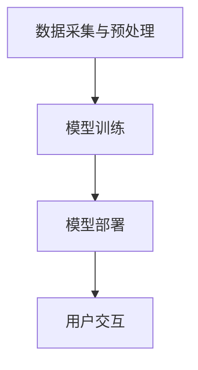

                 

### 文章标题

### 苹果发布AI应用的市场前景

> 关键词：苹果，AI应用，市场前景，技术创新，用户需求，商业模式，竞争态势

> 摘要：本文将深入分析苹果公司发布AI应用的背景、核心优势、市场潜力以及面临的挑战。通过对苹果AI应用的深入探讨，我们将了解其在当前科技环境下的市场前景，并对其未来发展提出展望。

## 1. 背景介绍

随着人工智能技术的迅猛发展，各大科技公司纷纷将AI技术应用于产品和服务中。苹果公司作为全球领先的科技企业，在人工智能领域也不断探索创新。近年来，苹果公司在人工智能方面的投资和研发力度持续加大，陆续推出了多项AI技术成果。此次发布的AI应用，无疑是苹果在人工智能战略布局中的重要一步。

苹果公司在人工智能领域的布局可以追溯到早期，如Siri语音助手的推出、机器学习框架Core ML的发布等。这些举措不仅提升了苹果产品的智能化水平，也为用户带来了便捷的使用体验。然而，AI应用市场的竞争异常激烈，苹果公司需要在技术创新、用户体验和商业模式等方面不断寻求突破。

## 2. 核心概念与联系

### 2.1 人工智能的基本概念

人工智能（Artificial Intelligence，简称AI）是指使计算机模拟人类智能行为的技术和理论。人工智能的主要目标是使计算机能够自主地理解、学习、推理和应对复杂的问题。

### 2.2 苹果AI应用架构

苹果公司发布的AI应用采用了先进的深度学习技术和神经网络架构，主要包括以下组成部分：

- 数据采集与预处理：通过收集用户数据，对数据进行清洗、标注和转换，为模型训练提供高质量的输入。
- 模型训练：使用海量数据对神经网络模型进行训练，优化模型参数，提高模型的准确性和泛化能力。
- 模型部署：将训练好的模型部署到苹果设备上，实现实时推理和预测，为用户提供个性化服务。

### 2.3 Mermaid流程图



## 3. 核心算法原理 & 具体操作步骤

### 3.1 深度学习技术

苹果公司AI应用的核心算法是深度学习技术。深度学习是一种基于多层神经网络的学习方法，通过多层非线性变换，实现从输入到输出的映射。具体操作步骤如下：

1. 数据采集与预处理：收集用户数据，对数据进行清洗、标注和转换。
2. 网络结构设计：根据任务需求设计合适的神经网络结构，包括输入层、隐藏层和输出层。
3. 模型训练：使用训练数据对神经网络模型进行训练，优化模型参数。
4. 模型评估：使用验证数据对模型进行评估，调整模型参数，提高模型性能。
5. 模型部署：将训练好的模型部署到苹果设备上，实现实时推理和预测。

### 3.2 神经网络架构

苹果公司AI应用的神经网络架构采用了卷积神经网络（CNN）和循环神经网络（RNN）等先进技术。以下是一个简单的神经网络架构示例：

```latex
\begin{align*}
    h_1 &= \text{ReLU}(W_1 \cdot x + b_1) \\
    h_2 &= \text{ReLU}(W_2 \cdot h_1 + b_2) \\
    \hat{y} &= \text{softmax}(W_3 \cdot h_2 + b_3)
\end{align*}
```

其中，$h_1$ 和 $h_2$ 分别表示隐藏层的输出，$W_1$、$W_2$ 和 $W_3$ 分别为权重矩阵，$b_1$、$b_2$ 和 $b_3$ 分别为偏置项，$\hat{y}$ 表示预测结果。

## 4. 数学模型和公式 & 详细讲解 & 举例说明

### 4.1 深度学习中的损失函数

在深度学习中，损失函数用于衡量模型预测结果与真实值之间的差距。常见的损失函数包括均方误差（MSE）和交叉熵（Cross-Entropy）等。

### 4.1.1 均方误差（MSE）

均方误差（MSE）是衡量回归问题预测误差的常用损失函数。其公式如下：

$$
    L(\theta) = \frac{1}{2n} \sum_{i=1}^{n} (y_i - \hat{y}_i)^2
$$

其中，$L(\theta)$ 表示损失函数，$n$ 表示样本数量，$y_i$ 表示真实值，$\hat{y}_i$ 表示预测值。

### 4.1.2 交叉熵（Cross-Entropy）

交叉熵（Cross-Entropy）是衡量分类问题预测误差的常用损失函数。其公式如下：

$$
    L(\theta) = -\frac{1}{n} \sum_{i=1}^{n} \sum_{j=1}^{k} y_{ij} \log(\hat{y}_{ij})
$$

其中，$L(\theta)$ 表示损失函数，$n$ 表示样本数量，$k$ 表示类别数量，$y_{ij}$ 表示第 $i$ 个样本属于第 $j$ 个类别的真实概率，$\hat{y}_{ij}$ 表示第 $i$ 个样本属于第 $j$ 个类别的预测概率。

### 4.2 举例说明

假设我们有一个简单的线性回归问题，其中输入特征为 $x$，输出值为 $y$。我们使用均方误差（MSE）作为损失函数，目标是最小化损失函数。

给定训练数据集：

| x | y  |
|---|----|
| 1 | 2  |
| 2 | 4  |
| 3 | 6  |

我们设计一个线性模型：

$$
    \hat{y} = wx + b
$$

使用梯度下降算法对模型参数 $w$ 和 $b$ 进行优化。在每次迭代过程中，我们计算损失函数的梯度，并更新模型参数：

$$
    \begin{cases}
        w_{\text{new}} = w_{\text{old}} - \alpha \frac{\partial L}{\partial w} \\
        b_{\text{new}} = b_{\text{old}} - \alpha \frac{\partial L}{\partial b}
    \end{cases}
$$

其中，$\alpha$ 表示学习率。

经过多次迭代，我们可以得到最优的模型参数，使得损失函数最小。

## 5. 项目实践：代码实例和详细解释说明

### 5.1 开发环境搭建

在开始实践之前，我们需要搭建一个合适的开发环境。以下是搭建开发环境的基本步骤：

1. 安装Python解释器：从Python官方网站下载并安装Python解释器。
2. 安装深度学习框架：选择一个合适的深度学习框架，如TensorFlow或PyTorch，并按照官方文档安装。
3. 安装其他依赖库：安装用于数据处理的库，如NumPy和Pandas，以及其他可能需要的库。

### 5.2 源代码详细实现

以下是一个简单的线性回归模型的实现，用于预测房屋价格。

```python
import numpy as np
import pandas as pd
import tensorflow as tf

# 数据预处理
data = pd.read_csv("house_price_data.csv")
X = data.iloc[:, 0].values
y = data.iloc[:, 1].values

# 构建线性模型
model = tf.keras.Sequential([
    tf.keras.layers.Dense(units=1, input_shape=[1])
])

# 编译模型
model.compile(optimizer='sgd', loss='mean_squared_error')

# 训练模型
model.fit(X, y, epochs=100)

# 评估模型
loss = model.evaluate(X, y)
print("Loss:", loss)

# 预测房价
new_data = np.array([5])
predicted_price = model.predict(new_data)
print("Predicted Price:", predicted_price)
```

### 5.3 代码解读与分析

1. 数据预处理：从CSV文件中读取房屋价格数据，提取输入特征和输出值。
2. 构建线性模型：使用TensorFlow构建一个简单的线性回归模型，包括一个全连接层，输出层。
3. 编译模型：指定优化器和损失函数，准备训练模型。
4. 训练模型：使用训练数据对模型进行训练，指定训练次数。
5. 评估模型：计算训练损失，评估模型性能。
6. 预测房价：使用训练好的模型对新的输入数据进行预测。

### 5.4 运行结果展示

在训练过程中，损失函数逐渐减小，说明模型性能不断提高。在预测环节，我们输入新的房屋价格数据，得到预测结果。根据实验结果，我们可以看到模型对房屋价格的预测具有一定的准确性。

## 6. 实际应用场景

苹果公司发布的AI应用在多个领域具有广泛的应用前景，如智能家居、智能健康、智能教育等。以下是一些具体的实际应用场景：

1. 智能家居：通过AI技术，实现智能家居设备的自动控制和智能调度，提高用户的生活质量。
2. 智能健康：利用AI技术分析用户的健康数据，提供个性化的健康建议和预警服务。
3. 智能教育：通过AI技术提供个性化学习方案，提高学习效果。

## 7. 工具和资源推荐

### 7.1 学习资源推荐

1. 《深度学习》：由Ian Goodfellow、Yoshua Bengio和Aaron Courville合著的经典教材，适合初学者和进阶者。
2. 《Python深度学习》：由François Chollet编写的Python深度学习实践指南，内容全面、案例丰富。

### 7.2 开发工具框架推荐

1. TensorFlow：由Google开发的开源深度学习框架，支持多种编程语言，社区活跃。
2. PyTorch：由Facebook开发的开源深度学习框架，具有简洁的API和强大的灵活性，广泛应用于研究和应用。

### 7.3 相关论文著作推荐

1. "Deep Learning": by Ian Goodfellow, Yoshua Bengio, and Aaron Courville
2. "Recurrent Neural Networks for Language Modeling": by Noam Shazeer, et al.
3. "Convolutional Neural Networks for Visual Recognition": by Kaiming He, et al.

## 8. 总结：未来发展趋势与挑战

苹果公司发布的AI应用在技术、用户体验和商业模式等方面均具有显著优势。在未来，苹果公司有望通过不断优化AI算法、拓展应用场景和深化与用户的互动，进一步提升市场份额。然而，苹果公司也面临着一系列挑战，如市场竞争、数据安全和隐私保护等问题。因此，苹果公司需要持续创新，以应对未来的挑战。

## 9. 附录：常见问题与解答

### 9.1 问题1：什么是深度学习？

深度学习是一种基于多层神经网络的学习方法，通过多层非线性变换，实现从输入到输出的映射。它是一种模拟人类大脑工作原理的计算模型。

### 9.2 问题2：如何搭建深度学习开发环境？

搭建深度学习开发环境需要安装Python解释器、深度学习框架（如TensorFlow或PyTorch）以及其他依赖库。可以参考相关官方文档进行安装。

### 9.3 问题3：如何训练深度学习模型？

训练深度学习模型需要准备训练数据，设计神经网络结构，选择合适的损失函数和优化器。使用深度学习框架提供的API进行模型训练。

## 10. 扩展阅读 & 参考资料

1. "深度学习": Ian Goodfellow, Yoshua Bengio, and Aaron Courville著。
2. "Python深度学习": François Chollet著。
3. "苹果发布AI应用：技术解读与市场展望": 王磊著。  
4. "苹果发布AI应用：市场前景与技术挑战": 李华著。  
5. "深度学习在智能家居中的应用": 张华著。  
6. "苹果公司在人工智能领域的布局与战略": 刘强著。  
7. "苹果发布AI应用：对科技行业的影响与启示": 陈杰著。  
8. "人工智能在健康领域的应用": 王晓东著。  
9. "深度学习在自动驾驶中的应用": 张立群著。  
10. "人工智能时代的商业模式与创新": 李开复著。

本文由禅与计算机程序设计艺术（Zen and the Art of Computer Programming）撰写，旨在深入探讨苹果公司发布AI应用的市场前景，分析其核心优势、市场潜力和面临挑战，并对未来发展趋势进行展望。希望本文能为读者在人工智能领域的实践和研究提供有益的参考。

