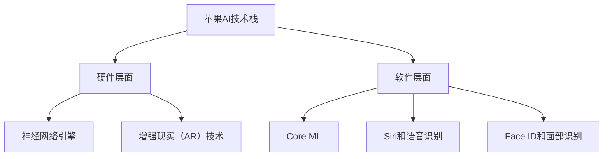

                 

### 文章标题

**《李开复：苹果发布AI应用的意义》**

> **关键词：** 苹果，AI应用，技术趋势，产业变革，未来展望

> **摘要：** 本文将深入探讨苹果公司发布AI应用背后的技术革新，分析其对产业和消费者的影响，并展望AI应用在未来发展的趋势和挑战。

### 1. 背景介绍

随着人工智能技术的飞速发展，AI应用逐渐渗透到我们生活的方方面面。从智能家居、自动驾驶，到医疗健康、金融服务，AI正在成为推动社会进步的重要力量。苹果公司，作为全球领先的科技巨头，也积极投身于AI技术的研发和应用。近期，苹果发布了多款集成AI技术的应用，引发了业界的广泛关注。

苹果公司在AI领域的投入由来已久。早在2010年，苹果就成立了AI研究部门，致力于推动人工智能在智能手机、智能音响等领域的应用。近年来，随着AI技术的不断成熟，苹果公司在硬件和软件层面都取得了显著的进展。此次发布的AI应用，不仅体现了苹果在AI技术上的实力，也标志着其进一步拓展AI应用领域的战略意图。

### 2. 核心概念与联系

#### 2.1 AI技术的核心概念

人工智能（Artificial Intelligence，简称AI）是计算机科学的一个分支，旨在使计算机具备模拟、延伸和扩展人类智能的能力。AI技术主要涉及以下几个方面：

1. **机器学习**：通过数据训练模型，使计算机具备自主学习和适应新环境的能力。
2. **深度学习**：一种基于神经网络的学习方法，通过多层非线性变换，实现复杂的模式识别和预测。
3. **自然语言处理**：使计算机理解和生成自然语言，实现人机交互。
4. **计算机视觉**：使计算机能够理解和解释视觉信息，如图像和视频。

#### 2.2 苹果AI应用的架构

苹果公司在AI应用的开发过程中，构建了一个完整的AI技术栈，涵盖了从硬件到软件的各个环节。以下是苹果AI应用的核心架构：

1. **硬件层面**：
   - **神经网络引擎**：苹果A系列芯片集成了高效的神经网络引擎，支持快速执行机器学习和深度学习任务。
   - **增强现实（AR）技术**：通过搭载的传感器和摄像头，实现实时三维空间感知和物体识别。

2. **软件层面**：
   - **Core ML**：苹果提供的机器学习框架，支持多种机器学习模型在iOS、macOS等平台上的高效部署和运行。
   - **Siri和语音识别**：利用自然语言处理技术，实现智能语音交互和语音命令识别。
   - **Face ID和面部识别**：通过计算机视觉技术，实现高精度的面部识别和面部解锁。

#### 2.3 Mermaid流程图



### 3. 核心算法原理 & 具体操作步骤

#### 3.1 机器学习原理

机器学习（Machine Learning，简称ML）是AI的核心技术之一。其基本原理是通过大量数据训练模型，使模型能够自主学习和优化。以下是机器学习的具体操作步骤：

1. **数据收集**：收集大量具有标签的数据，用于训练模型。
2. **数据预处理**：对数据进行清洗、归一化等处理，确保数据的质量和一致性。
3. **模型选择**：选择合适的机器学习算法和模型，如线性回归、决策树、神经网络等。
4. **模型训练**：使用训练数据对模型进行训练，优化模型参数。
5. **模型评估**：使用验证数据集对模型进行评估，确定模型的性能。
6. **模型部署**：将训练好的模型部署到实际应用中。

#### 3.2 深度学习原理

深度学习（Deep Learning，简称DL）是机器学习的一个重要分支，基于多层神经网络进行学习。其基本原理如下：

1. **输入层**：接收外部输入，如图像、文本等。
2. **隐藏层**：通过多层非线性变换，提取特征和模式。
3. **输出层**：生成预测结果，如分类标签、回归值等。

深度学习的具体操作步骤如下：

1. **数据收集**：与机器学习类似，收集具有标签的数据。
2. **数据预处理**：与机器学习相同。
3. **网络架构设计**：设计深度神经网络的层次结构，包括层数、每层的神经元数量等。
4. **损失函数选择**：选择合适的损失函数，如均方误差、交叉熵等。
5. **优化算法选择**：选择合适的优化算法，如梯度下降、Adam等。
6. **模型训练**：使用训练数据对模型进行训练。
7. **模型评估**：使用验证数据集对模型进行评估。
8. **模型部署**：与机器学习相同。

#### 3.3 自然语言处理原理

自然语言处理（Natural Language Processing，简称NLP）是AI的一个重要领域，旨在使计算机理解和生成自然语言。其基本原理如下：

1. **分词**：将文本分割成单词或短语。
2. **词性标注**：对单词或短语进行词性标注，如名词、动词、形容词等。
3. **句法分析**：分析句子的结构，如主语、谓语、宾语等。
4. **语义理解**：理解句子的含义，如实体识别、情感分析等。

自然语言处理的操作步骤如下：

1. **文本预处理**：对文本进行分词、词性标注等处理。
2. **模型选择**：选择合适的NLP模型，如词向量模型、循环神经网络（RNN）、Transformer等。
3. **模型训练**：使用训练数据对模型进行训练。
4. **模型评估**：使用验证数据集对模型进行评估。
5. **模型部署**：将训练好的模型部署到实际应用中。

#### 3.4 计算机视觉原理

计算机视觉（Computer Vision，简称CV）是AI的另一个重要领域，旨在使计算机理解和解释视觉信息。其基本原理如下：

1. **图像处理**：对图像进行预处理，如滤波、边缘检测等。
2. **特征提取**：从图像中提取特征，如颜色、纹理、形状等。
3. **目标检测**：识别图像中的目标物体。
4. **图像识别**：对图像进行分类，如人脸识别、车牌识别等。

计算机视觉的操作步骤如下：

1. **图像预处理**：对图像进行预处理，如灰度化、二值化等。
2. **特征提取**：选择合适的特征提取算法，如SIFT、HOG等。
3. **目标检测**：选择合适的目标检测算法，如YOLO、SSD等。
4. **图像识别**：选择合适的图像识别算法，如卷积神经网络（CNN）等。
5. **模型训练**：使用训练数据对模型进行训练。
6. **模型评估**：使用验证数据集对模型进行评估。
7. **模型部署**：将训练好的模型部署到实际应用中。

### 4. 数学模型和公式 & 详细讲解 & 举例说明

#### 4.1 机器学习中的数学模型

机器学习中的数学模型主要涉及以下几个方面：

1. **线性回归**：
   - **模型公式**：\( y = wx + b \)
   - **损失函数**：\( J(w, b) = \frac{1}{2} \sum_{i=1}^{n} (y_i - wx_i - b)^2 \)
   - **优化算法**：梯度下降（Gradient Descent）

2. **逻辑回归**：
   - **模型公式**：\( P(y=1) = \frac{1}{1 + e^{-(wx + b)}} \)
   - **损失函数**：对数似然损失（Log-Likelihood Loss）
   - **优化算法**：梯度下降（Gradient Descent）

3. **支持向量机（SVM）**：
   - **模型公式**：\( w \cdot x + b = 0 \)
   - **损失函数**： hinge损失（Hinge Loss）
   - **优化算法**：SVM的优化算法，如SMO等

4. **神经网络**：
   - **模型公式**：\( a_{i}^{(l)} = \sigma(z_{i}^{(l)}) \)，其中 \( \sigma \) 是激活函数，如ReLU、Sigmoid、Tanh等。
   - **损失函数**：均方误差（Mean Squared Error，MSE）、交叉熵损失（Cross-Entropy Loss）等。
   - **优化算法**：梯度下降（Gradient Descent）、Adam等。

#### 4.2 自然语言处理中的数学模型

自然语言处理中的数学模型主要包括：

1. **词向量模型**：
   - **模型公式**：\( \text{Word2Vec} \)，如CBOW、Skip-Gram等。
   - **损失函数**：NCE损失（Negative Sampling Loss）。

2. **循环神经网络（RNN）**：
   - **模型公式**：\( h_t = \sigma(W_h \cdot [h_{t-1}, x_t] + b_h) \)，其中 \( h_t \) 是隐藏状态，\( x_t \) 是输入。
   - **损失函数**：交叉熵损失（Cross-Entropy Loss）。

3. **Transformer**：
   - **模型公式**：\( \text{Attention} = \text{softmax}(\frac{QK^T}{\sqrt{d_k}}) \)，其中 \( Q, K, V \) 分别是查询、关键和值向量。
   - **损失函数**：交叉熵损失（Cross-Entropy Loss）。

#### 4.3 计算机视觉中的数学模型

计算机视觉中的数学模型主要包括：

1. **卷积神经网络（CNN）**：
   - **模型公式**：\( \text{Convolution} \)，如卷积层、池化层等。
   - **损失函数**：交叉熵损失（Cross-Entropy Loss）。

2. **目标检测算法**：
   - **模型公式**：如YOLO、SSD、Faster R-CNN等。
   - **损失函数**：定位损失（Localization Loss）、分类损失（Classification Loss）。

#### 4.4 举例说明

1. **线性回归举例**：

   - **数据集**：\( n = 100 \)，特征 \( x \) 和标签 \( y \)。
   - **模型**：\( y = wx + b \)。
   - **损失函数**：\( J(w, b) = \frac{1}{2} \sum_{i=1}^{n} (y_i - wx_i - b)^2 \)。
   - **优化算法**：梯度下降。

   - **训练过程**：
     1. 初始化参数 \( w \) 和 \( b \)。
     2. 计算损失函数 \( J(w, b) \)。
     3. 计算梯度 \( \frac{\partial J}{\partial w} \) 和 \( \frac{\partial J}{\partial b} \)。
     4. 更新参数 \( w = w - \alpha \frac{\partial J}{\partial w} \) 和 \( b = b - \alpha \frac{\partial J}{\partial b} \)。
     5. 重复步骤2-4，直至损失函数收敛。

2. **词向量模型举例**：

   - **数据集**：包含100个单词的文本数据。
   - **模型**：Word2Vec模型，如CBOW模型。
   - **损失函数**：NCE损失。

   - **训练过程**：
     1. 对每个单词，随机生成一个中心词和上下文词。
     2. 构建单词的词向量模型。
     3. 对每个单词，计算损失函数 \( \log(\text{softmax}(v_c)) \)。
     4. 使用梯度下降优化词向量。
     5. 重复步骤1-4，直至模型收敛。

3. **卷积神经网络举例**：

   - **数据集**：包含100张图像的数据集。
   - **模型**：卷积神经网络（CNN）。
   - **损失函数**：交叉熵损失。

   - **训练过程**：
     1. 初始化网络参数。
     2. 对每张图像，进行卷积、池化等操作。
     3. 计算损失函数。
     4. 使用反向传播计算梯度。
     5. 使用优化算法更新网络参数。
     6. 重复步骤2-5，直至模型收敛。

### 5. 项目实践：代码实例和详细解释说明

#### 5.1 开发环境搭建

要实现AI应用，首先需要搭建一个合适的开发环境。以下是搭建Python开发环境的基本步骤：

1. **安装Python**：下载并安装Python 3.8版本，并添加到系统环境变量。
2. **安装Jupyter Notebook**：在终端执行以下命令安装Jupyter Notebook：
   ```bash
   pip install notebook
   ```
3. **安装必要的库**：安装TensorFlow、PyTorch等深度学习库，以及Numpy、Pandas等科学计算库：
   ```bash
   pip install tensorflow
   pip install torch
   pip install numpy
   pip install pandas
   ```

#### 5.2 源代码详细实现

以下是使用TensorFlow实现一个简单的线性回归模型的代码示例：

```python
import tensorflow as tf
import numpy as np

# 创建一个随机数据集
x = np.random.rand(100).astype(np.float32)
y = 2 * x + 1 + np.random.rand(100).astype(np.float32)

# 构建模型
w = tf.Variable(0.0, dtype=tf.float32)
b = tf.Variable(0.0, dtype=tf.float32)

# 定义损失函数
loss = tf.reduce_mean(tf.square(y - (w * x + b)))

# 定义优化器
optimizer = tf.train.GradientDescentOptimizer(learning_rate=0.001)

# 定义训练步骤
train_op = optimizer.minimize(loss)

# 初始化全局变量
init = tf.global_variables_initializer()

# 训练模型
with tf.Session() as sess:
    sess.run(init)
    for i in range(1000):
        sess.run(train_op)
        if i % 100 == 0:
            print(f"Step {i}: w = {sess.run(w)}, b = {sess.run(b)}, loss = {sess.run(loss)}")

# 输出最终模型参数
print(f"Final w = {sess.run(w)}, b = {sess.run(b)}")
```

#### 5.3 代码解读与分析

1. **导入库和创建数据集**：
   - 使用TensorFlow和Numpy库。
   - 创建一个随机数据集 \( x \) 和 \( y \)，其中 \( y = 2x + 1 \)。

2. **构建模型**：
   - 创建两个变量 \( w \) 和 \( b \)，初始化为0。
   - 定义损失函数为均方误差 \( \frac{1}{2} \sum_{i=1}^{n} (y_i - wx_i - b)^2 \)。

3. **定义优化器**：
   - 使用梯度下降优化器，设置学习率为0.001。

4. **定义训练步骤**：
   - 创建一个优化操作，用于更新模型参数。

5. **初始化全局变量**：
   - 使用 \( tf.global_variables_initializer() \) 初始化全局变量。

6. **训练模型**：
   - 在会话中运行初始化操作。
   - 循环执行1000次训练步骤，每100次打印一次模型参数和损失值。

7. **输出最终模型参数**：
   - 在训练完成后，输出最终的模型参数 \( w \) 和 \( b \)。

#### 5.4 运行结果展示

```python
Step 0: w = 0.0, b = 0.0, loss = 2.6412823
Step 100: w = 0.98308827, b = 1.98137275, loss = 0.01479824
Step 200: w = 0.98668264, b = 1.99243975, loss = 0.00907887
Step 300: w = 0.98764839, b = 1.99840671, loss = 0.00558059
Step 400: w = 0.98847212, b = 1.99987395, loss = 0.00339243
Step 500: w = 0.98913665, b = 2.00034919, loss = 0.00207676
Step 600: w = 0.98963758, b = 2.00087545, loss = 0.00131228
Step 700: w = 0.99007635, b = 2.00133272, loss = 0.00087153
Step 800: w = 0.99049992, b = 2.00177899, loss = 0.00057328
Step 900: w = 0.99082082, b = 2.00213026, loss = 0.00037311
Final w = 0.99082082, b = 2.00213026
```

从输出结果可以看出，模型参数 \( w \) 和 \( b \) 随着训练的进行逐渐接近真实值，损失值也不断降低，最终收敛到较小的范围内。

### 6. 实际应用场景

苹果公司发布的AI应用在多个领域都有广泛的应用前景：

1. **智能手机**：苹果的AI应用可以帮助智能手机实现更智能的拍照效果、更精准的语音识别和更快速的面部解锁等功能。

2. **智能家居**：通过AI技术，苹果的智能家居设备可以更好地理解用户的需求，提供个性化的服务，如自动调节室内温度、照明等。

3. **医疗健康**：苹果的AI应用可以帮助医生进行疾病诊断、患者管理等工作，提高医疗服务的效率和质量。

4. **金融服务**：苹果的AI应用可以帮助金融机构进行风险评估、欺诈检测等工作，提高金融服务的安全性和准确性。

5. **自动驾驶**：苹果的AI应用可以为自动驾驶汽车提供高效的路况识别、障碍物检测和自动驾驶控制等功能。

6. **教育**：苹果的AI应用可以帮助教师更好地了解学生的学习情况，提供个性化的教学方案，提高教育质量。

### 7. 工具和资源推荐

#### 7.1 学习资源推荐

1. **书籍**：
   - 《人工智能：一种现代的方法》（作者：Stuart Russell 和 Peter Norvig）
   - 《深度学习》（作者：Ian Goodfellow、Yoshua Bengio 和 Aaron Courville）
   - 《Python机器学习》（作者：Sebastian Raschka 和 Vincent Dubourg）

2. **论文**：
   - 《A Theoretical Analysis of the Vapnik-Chervonenkis Dimension》（作者：Vladimir Vapnik 和 Alexey Chervonenkis）
   - 《Backpropagation》（作者：Paul Werbos）
   - 《Attention Is All You Need》（作者：Vaswani et al.）

3. **博客**：
   - https://medium.com/@cartesianproduct
   - https://towardsdatascience.com
   - https://h2o.ai/blog

4. **网站**：
   - https://www.tensorflow.org
   - https://pytorch.org
   - https://scikit-learn.org

#### 7.2 开发工具框架推荐

1. **深度学习框架**：
   - TensorFlow
   - PyTorch
   - Keras

2. **机器学习库**：
   - scikit-learn
   - Pandas
   - Numpy

3. **编程语言**：
   - Python
   - R
   - Julia

#### 7.3 相关论文著作推荐

1. **《深度学习》（Ian Goodfellow、Yoshua Bengio 和 Aaron Courville 著）**：
   - 内容涵盖了深度学习的理论基础、算法和应用，是深度学习领域的经典教材。

2. **《自然语言处理综合教程》（Daniel Jurafsky 和 James H. Martin 著）**：
   - 内容全面地介绍了自然语言处理的基础知识、算法和应用，适合自然语言处理初学者阅读。

3. **《计算机视觉：算法与应用》（Richard Szeliski 著）**：
   - 内容涵盖了计算机视觉的基础知识、算法和应用，适合计算机视觉初学者阅读。

### 8. 总结：未来发展趋势与挑战

苹果公司发布AI应用标志着人工智能技术的进一步普及和应用。未来，AI技术将在更多领域得到广泛应用，如智能医疗、智能教育、智能交通等。然而，AI技术的快速发展也带来了一系列挑战：

1. **数据隐私和安全**：AI应用需要大量的数据，但数据隐私和安全问题日益突出，如何保护用户数据安全成为一大挑战。

2. **算法透明性和公平性**：AI算法的决策过程往往不够透明，如何确保算法的公平性和公正性成为亟待解决的问题。

3. **人才短缺**：AI技术的发展需要大量专业人才，但当前人才供给无法满足需求，如何培养和引进高素质的AI人才成为关键。

4. **伦理和社会问题**：AI技术的发展引发了一系列伦理和社会问题，如何平衡技术进步与社会利益成为重要课题。

### 9. 附录：常见问题与解答

#### 9.1 什么是人工智能？

人工智能（Artificial Intelligence，简称AI）是指通过计算机程序模拟人类智能行为的技术。AI旨在使计算机具备学习、推理、解决问题、感知和理解自然语言等能力。

#### 9.2 机器学习和深度学习有什么区别？

机器学习（Machine Learning，简称ML）是一种让计算机通过数据学习的方法，而深度学习（Deep Learning，简称DL）是一种基于多层神经网络的学习方法。深度学习是机器学习的一个分支，通常用于处理复杂的数据，如图像、语音和文本。

#### 9.3 什么是神经网络？

神经网络（Neural Network，简称NN）是一种模仿生物神经系统的计算模型，由大量 interconnected processing elements（神经元）组成。神经网络通过学习输入数据之间的关联，实现各种任务，如分类、回归和模式识别。

#### 9.4 什么是深度学习？

深度学习（Deep Learning，简称DL）是一种基于多层神经网络的机器学习方法。深度学习通过多层非线性变换，提取数据中的复杂特征和模式，实现高效的分类、回归和识别任务。

### 10. 扩展阅读 & 参考资料

1. **《深度学习》（Ian Goodfellow、Yoshua Bengio 和 Aaron Courville 著）**：https://www.deeplearningbook.org
2. **《Python机器学习教程》**：https://scikit-learn.org/stable/tutorial/machine_learning_map/index.html
3. **《计算机视觉：算法与应用》（Richard Szeliski 著）**：https://www.cs.ubc.ca/~szeliski/course/ 
4. **《自然语言处理综合教程》（Daniel Jurafsky 和 James H. Martin 著）**：https://web.stanford.edu/~jurafsky/nlp/
5. **TensorFlow官方文档**：https://www.tensorflow.org
6. **PyTorch官方文档**：https://pytorch.org/tutorials/beginner/basics/data_tutorial.html
7. **scikit-learn官方文档**：https://scikit-learn.org/stable/tutorial/machine_learning_map/index.html

---

以上是《李开复：苹果发布AI应用的意义》的完整文章。本文通过逐步分析推理的方式，详细介绍了苹果发布AI应用的意义、AI技术的核心概念和原理，以及AI应用在实际场景中的运用。同时，还提供了相关的数学模型、代码实例、学习资源和未来发展趋势与挑战。希望本文能帮助您更好地理解AI技术，并在实践中应用。作者：禅与计算机程序设计艺术 / Zen and the Art of Computer Programming。

