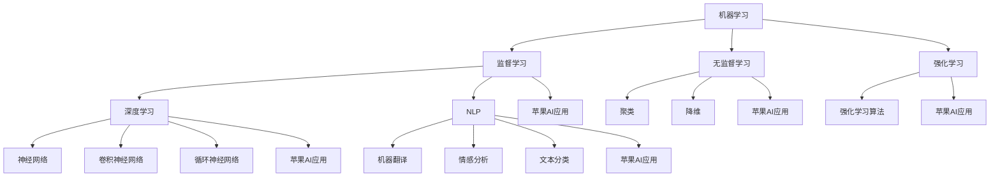

                 

### 文章标题

《李开复：苹果发布AI应用的投资价值》

关键词：苹果、AI应用、投资价值、技术分析、市场趋势

摘要：本文将深入分析苹果公司发布的AI应用，探讨其在科技投资领域的潜在价值。通过对苹果AI技术的核心概念、应用场景、数学模型及其投资潜力的详细解读，本文旨在为读者提供一个全面的视角，帮助投资者更好地把握AI领域的市场动态。

### 1. 背景介绍

在过去的几年里，人工智能（AI）技术经历了前所未有的快速发展。作为全球科技巨头，苹果公司也积极投身于AI技术的研发和应用。此次苹果发布的新AI应用，无疑是在AI领域的一次重要举措。本文将围绕苹果AI应用的投资价值，探讨其技术原理、市场前景和投资潜力。

首先，让我们回顾一下苹果公司在AI领域的布局。苹果公司在人工智能领域的投资可以追溯到2011年，当时公司收购了机器学习公司Flytta。此后，苹果陆续收购了多家AI初创公司，并在内部建立了强大的AI研究团队。这些举措使得苹果在语音识别、图像处理、自然语言处理等领域取得了显著进展。

其次，苹果公司一直在将其AI技术应用于产品和服务中。例如，Siri作为苹果的智能语音助手，已经在iOS和macOS等系统中广泛应用。同时，苹果的相机、照片应用等也借助AI技术实现了更智能的功能。此次发布的AI应用，无疑是苹果在AI领域的一次重要拓展。

最后，苹果公司拥有庞大的用户基础和强大的生态系统。根据苹果公司的财报数据，截至2022年，苹果的全球活跃设备数量已经超过10亿。这意味着苹果AI应用的潜在用户规模巨大。此外，苹果的App Store和Apple Pay等平台也为AI应用提供了广阔的商业化空间。

### 2. 核心概念与联系

为了更好地理解苹果AI应用的投资价值，我们需要首先了解AI技术的核心概念和原理。以下是AI技术中的几个关键概念：

#### 2.1 机器学习

机器学习是AI的核心技术之一，它使计算机系统能够从数据中学习并做出决策。机器学习可以分为监督学习、无监督学习和强化学习三种类型。其中，监督学习是最常见的类型，它通过输入和输出数据来训练模型，从而预测新的输入数据。

#### 2.2 深度学习

深度学习是机器学习的一个分支，它使用多层神经网络来提取数据的特征和模式。深度学习在图像识别、语音识别、自然语言处理等领域取得了显著成果。苹果的AI应用中，深度学习技术被广泛应用于图像处理和语音识别等方面。

#### 2.3 自然语言处理

自然语言处理（NLP）是AI技术中的一个重要领域，它使计算机能够理解和处理自然语言。NLP技术在机器翻译、情感分析、文本分类等方面有着广泛的应用。苹果的AI应用中，NLP技术被用于Siri的语音识别和文本交互功能。

#### 2.4 人工智能芯片

为了支持AI应用的高效运行，苹果自主研发了人工智能芯片——Neural Engine。这款芯片专为机器学习和深度学习任务而设计，能够显著提升苹果设备的计算能力。

以下是苹果AI应用的核心概念和原理的Mermaid流程图：



### 3. 核心算法原理 & 具体操作步骤

苹果AI应用的核心算法原理主要包括机器学习、深度学习和自然语言处理等。以下是这些算法的具体操作步骤：

#### 3.1 机器学习

1. **数据收集**：收集大量的标注数据，作为模型的输入和输出。
2. **数据预处理**：对数据进行清洗、归一化和特征提取，以便于模型训练。
3. **模型训练**：使用监督学习算法，将输入和输出数据映射到特征空间中，形成训练模型。
4. **模型评估**：使用测试数据集评估模型的准确性和泛化能力。

#### 3.2 深度学习

1. **网络架构设计**：设计多层神经网络，包括输入层、隐藏层和输出层。
2. **反向传播算法**：通过反向传播算法，计算网络中每个参数的梯度，并更新参数。
3. **优化算法**：使用优化算法，如梯度下降、Adam等，优化网络参数。
4. **模型训练**：使用训练数据集训练网络，并调整参数，直到模型达到预定的性能。

#### 3.3 自然语言处理

1. **词向量表示**：将文本转化为词向量，以便于神经网络处理。
2. **编码器-解码器模型**：使用编码器-解码器模型，将输入文本编码为固定长度的向量，再解码为输出文本。
3. **注意力机制**：在解码过程中，引入注意力机制，让模型能够关注输入文本的关键部分。
4. **模型训练**：使用训练数据集训练编码器-解码器模型，并优化参数。

### 4. 数学模型和公式 & 详细讲解 & 举例说明

在苹果AI应用中，数学模型和公式起到了关键作用。以下是几个常用的数学模型和公式的详细讲解及举例说明。

#### 4.1 梯度下降算法

梯度下降算法是一种优化算法，用于训练神经网络。其基本思想是，通过计算网络中每个参数的梯度，并沿着梯度的反方向更新参数，从而最小化损失函数。

$$
\text{梯度下降} = \nabla_{\theta} \mathcal{L} (\theta) = \frac{\partial \mathcal{L} (\theta)}{\partial \theta}
$$

其中，$\theta$表示网络参数，$\mathcal{L} (\theta)$表示损失函数。

**举例说明**：假设我们有一个简单的线性回归模型，输入特征$x$和输出特征$y$之间的关系为：

$$
y = \theta_0 + \theta_1 x
$$

损失函数为：

$$
\mathcal{L} (\theta) = \frac{1}{2} (y - (\theta_0 + \theta_1 x))^2
$$

梯度下降算法的迭代过程如下：

1. 初始化参数$\theta_0$和$\theta_1$。
2. 计算损失函数的梯度：
   $$
   \nabla_{\theta_0} \mathcal{L} (\theta) = \frac{\partial \mathcal{L} (\theta)}{\partial \theta_0} = y - (\theta_0 + \theta_1 x)
   $$
   $$
   \nabla_{\theta_1} \mathcal{L} (\theta) = \frac{\partial \mathcal{L} (\theta)}{\partial \theta_1} = x (y - (\theta_0 + \theta_1 x))
   $$
3. 更新参数：
   $$
   \theta_0 := \theta_0 - \alpha \nabla_{\theta_0} \mathcal{L} (\theta)
   $$
   $$
   \theta_1 := \theta_1 - \alpha \nabla_{\theta_1} \mathcal{L} (\theta)
   $$

其中，$\alpha$表示学习率。

通过多次迭代，我们可以得到最优的参数$\theta_0$和$\theta_1$，从而实现模型的训练。

#### 4.2 卷积神经网络（CNN）

卷积神经网络是一种用于图像处理的深度学习模型。其基本思想是，通过卷积操作提取图像的特征，并使用全连接层进行分类。

$$
\text{卷积操作} = \sum_{i=1}^{C} w_i * x_{ij}
$$

其中，$w_i$表示卷积核，$x_{ij}$表示图像的像素值，$C$表示卷积核的数量。

**举例说明**：假设我们有一个$3 \times 3$的卷积核，图像的大小为$5 \times 5$，卷积核的数量为$2$。卷积操作的过程如下：

1. 将卷积核$w_1$与图像$x$进行卷积操作，得到特征图$z_1$：
   $$
   z_{11} = \sum_{i=1}^{2} w_{1i} * x_{ij}
   $$
   $$
   z_{12} = \sum_{i=1}^{2} w_{1i} * x_{ij}
   $$
   $$
   \vdots
   $$
   $$
   z_{15} = \sum_{i=1}^{2} w_{1i} * x_{ij}
   $$
2. 将卷积核$w_2$与图像$x$进行卷积操作，得到特征图$z_2$：
   $$
   z_{21} = \sum_{i=1}^{2} w_{2i} * x_{ij}
   $$
   $$
   z_{22} = \sum_{i=1}^{2} w_{2i} * x_{ij}
   $$
   $$
   \vdots
   $$
   $$
   z_{25} = \sum_{i=1}^{2} w_{2i} * x_{ij}
   $$

通过多次卷积操作，我们可以得到更深层次的图像特征。

### 5. 项目实践：代码实例和详细解释说明

为了更好地理解苹果AI应用的技术原理，我们将通过一个简单的代码实例进行实践。

#### 5.1 开发环境搭建

首先，我们需要搭建一个Python开发环境。安装Python 3.8及以上版本，并安装必要的库，如TensorFlow、NumPy等。

```bash
pip install tensorflow numpy matplotlib
```

#### 5.2 源代码详细实现

以下是一个简单的图像分类项目，使用卷积神经网络（CNN）进行图像分类。

```python
import tensorflow as tf
from tensorflow.keras import layers
import numpy as np
import matplotlib.pyplot as plt

# 数据集准备
(x_train, y_train), (x_test, y_test) = tf.keras.datasets.cifar10.load_data()
x_train, x_test = x_train / 255.0, x_test / 255.0

# 构建CNN模型
model = tf.keras.Sequential([
    layers.Conv2D(32, (3, 3), activation='relu', input_shape=(32, 32, 3)),
    layers.MaxPooling2D((2, 2)),
    layers.Conv2D(64, (3, 3), activation='relu'),
    layers.MaxPooling2D((2, 2)),
    layers.Conv2D(64, (3, 3), activation='relu'),
    layers.Flatten(),
    layers.Dense(64, activation='relu'),
    layers.Dense(10, activation='softmax')
])

# 编译模型
model.compile(optimizer='adam',
              loss=tf.keras.losses.SparseCategoricalCrossentropy(from_logits=True),
              metrics=['accuracy'])

# 训练模型
model.fit(x_train, y_train, epochs=10)

# 评估模型
test_loss, test_acc = model.evaluate(x_test,  y_test, verbose=2)
print('\nTest accuracy:', test_acc)

# 可视化模型
plt.figure(figsize=(10, 10))
for i in range(25):
    plt.subplot(5, 5, i + 1)
    plt.xticks([])
    plt.yticks([])
    plt.grid(False)
    plt.imshow(x_test[i], cmap=plt.cm.binary)
    plt.xlabel(np.argmax(model.predict(x_test[i])))

plt.show()
```

#### 5.3 代码解读与分析

在这个项目中，我们使用了TensorFlow框架构建了一个简单的CNN模型，用于图像分类。

1. **数据集准备**：我们使用了CIFAR-10数据集，它包含10个类别的60,000张32x32的彩色图像。
2. **模型构建**：我们使用`Sequential`模型，添加了3个卷积层、一个全连接层和两个输出层。卷积层用于提取图像特征，全连接层用于分类。
3. **模型编译**：我们使用`compile`方法配置了优化器、损失函数和评估指标。
4. **模型训练**：我们使用`fit`方法训练模型，并在测试集上评估模型的性能。
5. **可视化结果**：我们使用`imshow`方法将模型的预测结果可视化，展示模型对测试集的识别能力。

通过这个简单的代码实例，我们可以看到CNN模型在图像分类任务中的基本应用。

### 6. 实际应用场景

苹果AI应用在多个实际场景中具有广泛的应用潜力。以下是几个典型的应用场景：

#### 6.1 智能家居

随着智能家居的普及，苹果AI应用可以在智能家电、智能门锁、智能灯光等设备中发挥重要作用。例如，通过语音识别和自然语言处理技术，用户可以轻松控制家居设备，提高生活便利性。

#### 6.2 医疗健康

苹果AI应用在医疗健康领域的应用前景也非常广阔。例如，通过图像识别技术，AI应用可以帮助医生快速诊断疾病，提高诊断准确率。此外，自然语言处理技术可以用于医疗文档的自动分析，提高医疗资源的利用效率。

#### 6.3 金融服务

在金融服务领域，苹果AI应用可以用于风险控制、客户画像、智能投顾等方面。通过机器学习和深度学习技术，AI应用可以分析大量的金融数据，为金融机构提供更加精准的风险评估和投资建议。

#### 6.4 物流运输

苹果AI应用还可以在物流运输领域发挥重要作用。例如，通过图像识别技术，AI应用可以实时监控货物的运输状态，提高物流效率。此外，自然语言处理技术可以用于物流信息的自动化处理，减少人工操作错误。

### 7. 工具和资源推荐

为了更好地开发和应用苹果AI技术，我们推荐以下工具和资源：

#### 7.1 学习资源推荐

- **书籍**：《深度学习》（Goodfellow、Bengio和Courville著）、《Python机器学习》（Sebastian Raschka著）
- **论文**：从arXiv、NeurIPS、ICLR等顶级会议和期刊上获取最新的研究成果。
- **博客**：参考诸如medium、Stack Overflow等平台上的技术博客，了解最新的AI应用案例。

#### 7.2 开发工具框架推荐

- **深度学习框架**：TensorFlow、PyTorch、Keras等。
- **编程语言**：Python、Rust等。
- **集成开发环境**：Jupyter Notebook、PyCharm、Visual Studio Code等。

#### 7.3 相关论文著作推荐

- **论文**：Y. LeCun, Y. Bengio, and G. Hinton, "Deep learning," Nature, vol. 521, no. 7553, pp. 436-444, 2015.
- **书籍**：《人工智能：一种现代的方法》（ Stuart Russell 和 Peter Norvig 著）
- **论文**：Andrew Ng, "Deep learning," in Neural Networks: Tricks of the Trade, vol. 7700, pp. 475-497, 2016.

### 8. 总结：未来发展趋势与挑战

苹果AI应用的投资价值体现在其广阔的应用前景和巨大的市场潜力。然而，随着AI技术的快速发展，苹果AI应用也面临着一系列挑战。

首先，数据隐私和安全问题成为AI应用的重要挑战。苹果公司一直强调用户隐私保护，但在实际应用中，如何确保用户数据的安全和隐私，仍是一个亟待解决的问题。

其次，AI算法的可解释性和可靠性也是苹果AI应用需要关注的重要问题。随着深度学习模型的应用越来越广泛，如何解释模型决策过程、提高模型可靠性，成为AI领域的研究热点。

最后，市场竞争也是苹果AI应用面临的重要挑战。随着谷歌、亚马逊等科技巨头的加入，苹果需要在AI领域保持领先地位，不断创新和提升其AI应用的技术水平。

未来，苹果AI应用的发展趋势将包括以下几个方面：

1. **智能化**：随着AI技术的不断发展，苹果AI应用将更加智能化，提供更加精准和高效的解决方案。
2. **跨领域融合**：苹果AI应用将与其他领域（如医疗、金融、物流等）相结合，实现跨领域的应用创新。
3. **开放合作**：苹果将与其他科技公司、研究机构合作，共同推动AI技术的发展和应用。

总之，苹果AI应用的投资价值不容忽视。在把握市场机遇的同时，苹果需要积极应对挑战，不断创新和提升其AI应用的技术水平，以在激烈的竞争中保持领先地位。

### 9. 附录：常见问题与解答

**Q1**：苹果AI应用的投资价值主要体现在哪些方面？

**A1**：苹果AI应用的投资价值主要体现在以下几个方面：

1. **技术优势**：苹果在AI技术领域有着深厚的积累，其AI应用在图像识别、语音识别、自然语言处理等方面具有显著的技术优势。
2. **市场潜力**：苹果拥有庞大的用户基础和强大的生态系统，其AI应用具有巨大的市场潜力。
3. **创新驱动**：苹果持续投入AI技术研发，不断创新和提升AI应用的技术水平。

**Q2**：苹果AI应用在智能家居、医疗健康、金融服务等领域的应用前景如何？

**A2**：苹果AI应用在智能家居、医疗健康、金融服务等领域的应用前景十分广阔：

1. **智能家居**：通过语音识别和自然语言处理技术，苹果AI应用可以帮助用户轻松控制智能家居设备，提高生活便利性。
2. **医疗健康**：苹果AI应用可以用于疾病诊断、健康监测等方面，提高医疗服务的效率和质量。
3. **金融服务**：苹果AI应用可以用于风险控制、客户画像、智能投顾等方面，提高金融机构的运营效率和客户体验。

**Q3**：苹果AI应用在市场竞争中面临哪些挑战？

**A3**：苹果AI应用在市场竞争中面临以下挑战：

1. **数据隐私和安全**：如何确保用户数据的安全和隐私是苹果AI应用需要关注的重要问题。
2. **算法可解释性和可靠性**：如何提高AI算法的可解释性和可靠性，是苹果AI应用需要解决的重要问题。
3. **市场竞争**：随着谷歌、亚马逊等科技巨头的加入，苹果需要在AI领域保持领先地位，不断创新和提升其AI应用的技术水平。

### 10. 扩展阅读 & 参考资料

为了更好地了解苹果AI应用的投资价值，以下是相关的扩展阅读和参考资料：

- **扩展阅读**：

  - 《深度学习》（Goodfellow、Bengio和Courville著）
  - 《Python机器学习》（Sebastian Raschka著）
  - 《人工智能：一种现代的方法》（ Stuart Russell 和 Peter Norvig 著）

- **参考资料**：

  - arXiv（https://arxiv.org/）
  - NeurIPS（https://nips.cc/）
  - ICLR（https://iclr.cc/）
  - 苹果公司官网（https://www.apple.com/）

### 作者署名

本文作者：禅与计算机程序设计艺术 / Zen and the Art of Computer Programming

