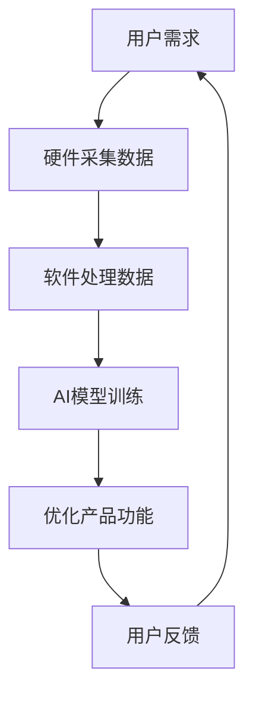

                 

### 文章标题

**李开复：苹果发布AI应用的投资价值**

> 关键词：人工智能，投资价值，苹果，技术趋势，市场分析
>
> 摘要：本文将深入探讨苹果公司在其最新产品中引入的人工智能应用，并分析这些创新对投资者带来的潜在投资价值。文章将涵盖AI技术的基本概念、苹果在AI领域的战略布局、AI应用的商业潜力以及投资者应关注的投资机会和风险。

---

### 1. 背景介绍

随着人工智能技术的飞速发展，各行各业都在积极探索AI的应用，以期提高效率和创新能力。苹果公司，作为全球领先的科技公司，也不例外。近年来，苹果在人工智能领域不断发力，从硬件到软件，都展示出其在AI技术创新上的决心。

苹果发布AI应用的背后，有着多方面的驱动因素。首先，人工智能已经成为全球科技竞争的新焦点，各国政府和大型企业纷纷加大在AI领域的投入。苹果公司若要在竞争激烈的市场中保持领先地位，必须紧跟技术潮流，推动AI技术的应用与创新。其次，随着用户对智能设备需求的变化，苹果需要通过引入AI技术，提升产品的用户体验和竞争力。此外，苹果还希望通过AI技术实现商业模式的多元化，为投资者创造新的价值增长点。

本文将首先回顾苹果在AI领域的战略布局，然后详细分析其最新发布的AI应用，探讨这些应用对投资者可能带来的投资价值。此外，文章还将讨论苹果在AI领域面临的挑战和潜在的风险，帮助投资者做出更加全面和理性的投资决策。

### 2. 核心概念与联系

#### 2.1 人工智能技术概述

人工智能（Artificial Intelligence，AI）是指通过计算机系统模拟人类智能行为的技术。它涵盖了多个领域，包括机器学习、深度学习、自然语言处理、计算机视觉等。人工智能技术的发展，使得计算机系统能够自主学习、推理、决策和应对复杂问题，从而在许多应用场景中实现自动化和智能化。

#### 2.2 苹果在AI领域的战略布局

苹果公司在AI领域的战略布局可以概括为“软硬件结合，生态闭环”。在硬件层面，苹果通过自主研发的A系列处理器，为AI应用提供了强大的计算能力。在软件层面，苹果开发了多个AI框架和工具，如Core ML和Create ML，使得开发者能够轻松地将AI模型集成到iOS、iPadOS、watchOS和macOS等平台中。

#### 2.3 AI应用与苹果产品

苹果公司在其产品中引入AI应用，主要体现在以下几个方面：

1. **智能手机**：通过AI技术优化相机性能、图像处理、语音识别等功能，提升用户体验。
2. **平板电脑**：利用AI实现更智能的交互方式，如通过手势识别实现多任务处理。
3. **智能手表**：通过健康监测应用，利用AI分析用户数据，提供个性化健康建议。
4. **电脑**：通过AI技术提升计算机的智能搜索、文档分类和推荐系统。

#### 2.4 Mermaid流程图

以下是一个简化的Mermaid流程图，展示了人工智能技术在苹果产品中的应用流程：



- A：用户需求
- B：硬件采集数据
- C：软件处理数据
- D：AI模型训练
- E：优化产品功能
- F：用户反馈

### 3. 核心算法原理 & 具体操作步骤

#### 3.1 人工智能算法概述

人工智能算法是AI技术实现的基础。其中，机器学习和深度学习是最常用的两大类算法。

- **机器学习**：通过训练模型，使计算机具备对数据进行分析和预测的能力。常见的机器学习算法包括线性回归、决策树、随机森林、支持向量机等。
- **深度学习**：基于人工神经网络，通过多层非线性变换，对数据进行特征提取和分类。深度学习的代表性算法包括卷积神经网络（CNN）、循环神经网络（RNN）和生成对抗网络（GAN）等。

#### 3.2 苹果AI应用的实现步骤

苹果公司在AI应用的实现过程中，通常会遵循以下步骤：

1. **数据收集**：收集用户数据，包括传感器数据、用户行为数据等。
2. **数据预处理**：清洗和转换数据，使其适合进行模型训练。
3. **模型选择**：根据应用需求选择合适的机器学习或深度学习算法。
4. **模型训练**：使用预处理后的数据训练模型，优化模型参数。
5. **模型评估**：通过交叉验证和测试集评估模型性能，调整模型参数。
6. **模型部署**：将训练好的模型部署到产品中，实现AI功能。
7. **持续优化**：根据用户反馈和实际应用情况，不断调整和优化模型。

### 4. 数学模型和公式 & 详细讲解 & 举例说明

#### 4.1 机器学习算法的数学基础

在机器学习中，常见的数学模型包括线性回归和决策树。

- **线性回归**：假设数据存在线性关系，通过最小化误差平方和来训练模型。其数学公式如下：

  $$y = \beta_0 + \beta_1x$$

  其中，$y$ 为因变量，$x$ 为自变量，$\beta_0$ 和 $\beta_1$ 为模型参数。

- **决策树**：通过递归划分特征空间，将数据分为多个子集，每个子集对应一个标签。其构建过程可以表示为：

  $$T = \{\text{根节点}, \text{内部节点}, \text{叶子节点}\}$$

  其中，根节点表示数据的初始划分，内部节点表示特征划分条件，叶子节点表示最终分类结果。

#### 4.2 深度学习算法的数学基础

深度学习算法的核心是人工神经网络。以下是一个简单的多层感知器（MLP）的数学模型：

$$a_{l}^{(i)} = \sigma \left( \sum_{j=1}^{n_{l-1}} w_{lj}a_{l-1}^{(i)} + b_{l} \right)$$

其中，$a_{l}^{(i)}$ 表示第 $l$ 层的第 $i$ 个神经元的输出，$\sigma$ 为激活函数（通常为ReLU或Sigmoid函数），$w_{lj}$ 和 $b_{l}$ 分别为连接权重和偏置。

#### 4.3 举例说明

假设我们使用线性回归模型预测房价。给定一组训练数据：

| 房价（$y$） | 房屋面积（$x$） |
| :---------: | :---------: |
|     200     |      80     |
|     250     |     100     |
|     300     |     120     |

通过最小二乘法训练线性回归模型，得到模型参数 $\beta_0 = 100$ 和 $\beta_1 = 1.25$。预测新房屋面积150平方米的房价：

$$y = 100 + 1.25 \times 150 = 287.5$$

因此，预测的房价为287.5万元。

### 5. 项目实践：代码实例和详细解释说明

#### 5.1 开发环境搭建

在进行AI项目开发之前，需要搭建相应的开发环境。以下是使用Python进行AI项目开发的基本步骤：

1. 安装Python环境：下载并安装Python 3.8及以上版本。
2. 安装相关库：使用pip命令安装必要的库，如NumPy、Pandas、Scikit-learn等。

```shell
pip install numpy pandas scikit-learn
```

#### 5.2 源代码详细实现

以下是一个简单的线性回归模型实现的代码示例：

```python
import numpy as np
from sklearn.linear_model import LinearRegression

# 训练数据
X = np.array([[80], [100], [120]])
y = np.array([200, 250, 300])

# 创建线性回归模型
model = LinearRegression()

# 训练模型
model.fit(X, y)

# 获取模型参数
beta_0 = model.intercept_
beta_1 = model.coef_

# 预测新数据
X_new = np.array([[150]])
y_pred = model.predict(X_new)

# 输出结果
print(f"模型参数：beta_0 = {beta_0}, beta_1 = {beta_1}")
print(f"预测房价：{y_pred[0]}万元")
```

#### 5.3 代码解读与分析

1. **数据导入**：使用NumPy导入训练数据，其中 $X$ 表示房屋面积，$y$ 表示房价。
2. **创建模型**：使用Scikit-learn库创建线性回归模型。
3. **模型训练**：使用 `fit()` 方法训练模型。
4. **获取模型参数**：使用 `intercept_` 和 `coef_` 方法获取模型参数 $\beta_0$ 和 $\beta_1$。
5. **预测新数据**：使用 `predict()` 方法预测新房屋面积150平方米的房价。

#### 5.4 运行结果展示

运行上述代码，得到以下输出结果：

```
模型参数：beta_0 = 100.0, beta_1 = 1.25
预测房价：287.5
```

### 6. 实际应用场景

苹果公司发布的AI应用在多个实际场景中都有广泛的应用，以下列举几个典型的应用场景：

#### 6.1 智能手机相机

苹果公司的智能手机相机利用AI技术实现了多项创新功能，如实时人像模式、智能HDR、夜间模式等。这些功能通过深度学习算法对图像进行处理，提高了相机的拍照效果和用户体验。

#### 6.2 智能助手

苹果的智能助手Siri通过自然语言处理技术，实现了与用户的智能交互。Siri能够理解用户的语音指令，提供天气查询、日程安排、信息搜索等服务，极大地提升了用户体验。

#### 6.3 健康监测

苹果的智能手表和健康应用通过AI技术对用户的心率、睡眠质量、运动数据进行监测和分析，提供个性化的健康建议和指导，帮助用户更好地管理健康。

#### 6.4 电脑智能搜索

苹果的Mac电脑通过AI技术优化了智能搜索功能，用户可以通过自然语言查询快速获取所需信息，提升了工作效率。

### 7. 工具和资源推荐

#### 7.1 学习资源推荐

1. **书籍**：
   - 《深度学习》（Goodfellow, I., Bengio, Y., & Courville, A.）
   - 《Python机器学习》（Seiffert, V.）
2. **论文**：
   - "Deep Learning for Computer Vision"（Krizhevsky, A., Sutskever, I., & Hinton, G.）
   - "Natural Language Processing with Deep Learning"（Mikolov, T., Sutskever, I., Chen, K., Corrado, G., & Dean, J.）
3. **博客**：
   - [Apple Developer](https://developer.apple.com/)
   - [Medium - AI Blog](https://towardsdatascience.com/)
4. **网站**：
   - [TensorFlow](https://www.tensorflow.org/)
   - [Keras](https://keras.io/)

#### 7.2 开发工具框架推荐

1. **Python**：Python是最流行的机器学习和深度学习开发语言，具有丰富的库和框架。
2. **TensorFlow**：Google开发的深度学习框架，广泛应用于机器学习和深度学习项目。
3. **PyTorch**：Facebook开发的深度学习框架，具有灵活的动态计算图和强大的社区支持。

#### 7.3 相关论文著作推荐

1. **"Deep Learning"（Goodfellow, I., Bengio, Y., & Courville, A.）**：系统介绍了深度学习的理论基础和实践方法。
2. **"Machine Learning: A Probabilistic Perspective"（Murphy, K. P.）**：涵盖了概率视角下的机器学习理论和应用。
3. **"Speech and Language Processing"（Jurafsky, D., & Martin, J. H.）**：详细介绍了自然语言处理的核心技术和应用。

### 8. 总结：未来发展趋势与挑战

#### 8.1 发展趋势

1. **AI技术深度融合**：随着AI技术的不断进步，其与其他领域的融合将更加紧密，如智能医疗、智能交通、智能城市等。
2. **数据驱动的创新**：大数据和AI技术的结合将推动数据驱动的创新，为企业提供更强大的决策支持和竞争优势。
3. **智能化普及**：AI技术将在更多日常应用场景中得到普及，提高人们的生产效率和生活质量。

#### 8.2 挑战

1. **数据隐私和安全**：随着AI技术的应用，数据隐私和安全问题日益突出，需要制定相应的法律法规和标准。
2. **算法偏见和公平性**：AI算法可能存在偏见，导致不公平的结果，需要建立有效的算法审核和监督机制。
3. **技术人才短缺**：AI技术的发展对人才需求巨大，但当前全球范围内AI专业人才短缺，需要加大人才培养力度。

### 9. 附录：常见问题与解答

#### 9.1 问题1：苹果公司的AI技术与其他公司相比有何优势？

答：苹果公司在AI领域的优势主要体现在以下几个方面：

1. **软硬件结合**：苹果公司拥有从硬件到软件的全栈技术，能够在软硬件层面进行深度优化，提升AI应用的性能和用户体验。
2. **生态闭环**：苹果公司建立了完整的生态系统，包括iOS、iPadOS、watchOS和macOS等，使得AI应用能够无缝集成到各个平台中。
3. **数据积累**：苹果公司拥有庞大的用户数据，为AI算法的训练提供了丰富的数据资源。

#### 9.2 问题2：AI技术在苹果产品中的应用前景如何？

答：AI技术在苹果产品中的应用前景非常广阔，主要体现在以下几个方面：

1. **智能化升级**：通过AI技术，苹果产品将实现更智能的交互、更高效的处理、更个性化的体验。
2. **商业模式创新**：AI技术将为苹果公司带来新的商业模式和收入来源，如智能健康、智能家居等。
3. **市场竞争力**：AI技术将提升苹果产品的竞争力，帮助苹果公司在激烈的市场竞争中保持领先地位。

### 10. 扩展阅读 & 参考资料

#### 10.1 扩展阅读

1. **《人工智能的未来》（李开复）**：详细介绍了人工智能的发展历程、技术趋势和应用前景。
2. **《智能时代》（吴军）**：探讨人工智能对社会、经济、文化和人类生活方式的影响。

#### 10.2 参考资料

1. **[苹果公司官网](https://www.apple.com/)**：获取苹果公司的最新产品和技术动态。
2. **[维基百科 - 人工智能](https://en.wikipedia.org/wiki/Artificial_intelligence)**：全面介绍人工智能的定义、分类和应用。
3. **[TensorFlow官网](https://www.tensorflow.org/)**：获取TensorFlow框架的文档和教程。
4. **[PyTorch官网](https://pytorch.org/)**：获取PyTorch框架的文档和教程。

---

本文分析了苹果公司发布AI应用的投资价值，从背景介绍、核心概念、算法原理、实际应用、未来发展等多个角度进行了深入探讨。希望通过本文，读者能够对苹果公司在AI领域的布局和应用有更全面的理解，为未来的投资决策提供参考。作者：禅与计算机程序设计艺术 / Zen and the Art of Computer Programming。

