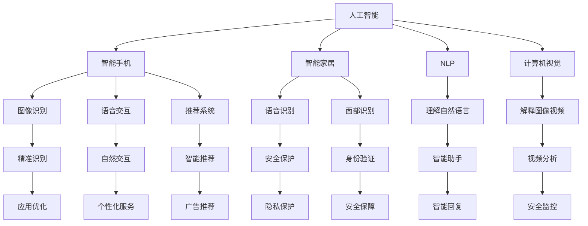

                 

### 1. 背景介绍

苹果公司，作为全球领先的科技企业，一直以来都在积极推动人工智能（AI）技术的研发与应用。近年来，随着AI技术在智能手机、智能家居以及各种智能设备中的广泛应用，苹果公司也开始逐步将AI技术融入其核心产品中。

在2023年的全球开发者大会上，苹果公司发布了多款搭载AI技术的应用，这些应用涵盖了图像识别、语音识别、自然语言处理等多个领域。这些新功能的发布，不仅展示了苹果公司在AI领域的深厚技术积累，也引发了业界对苹果未来在AI领域发展的广泛关注。

然而，苹果公司在AI领域的挑战同样不容忽视。首先，苹果公司一直坚持自主研发，这意味着其在AI算法和应用层面的创新能力需要持续提升。其次，与其他科技巨头相比，苹果在开放性方面可能面临一定的劣势，这可能会限制其AI技术的广泛应用。此外，数据隐私和安全也是苹果公司需要重点考虑的问题，如何在保护用户隐私的同时，充分利用数据进行AI训练和优化，是一个巨大的挑战。

本文将围绕苹果发布AI应用的主题，深入探讨其背后的核心概念、算法原理、数学模型以及实际应用场景，并分析苹果在AI领域面临的挑战和机遇。

### 2. 核心概念与联系

在探讨苹果发布AI应用的挑战之前，我们有必要首先理解一些核心概念和它们之间的联系。

#### 2.1 人工智能（AI）的概念

人工智能（AI）是指由人制造出来的系统所表现出的智能行为，通常涉及机器学习、深度学习、自然语言处理、计算机视觉等领域。AI技术可以帮助设备理解和响应人类语言、图像和其他形式的信息，从而实现更加智能化的操作。

#### 2.2 智能手机与AI

智能手机是AI应用的重要载体。随着AI技术的发展，智能手机的功能也在不断升级。例如，苹果公司的智能手机可以借助AI技术实现更精准的图像识别、更自然的语音交互、更智能的推荐系统等。

#### 2.3 智能家居与AI

智能家居是AI技术的重要应用场景之一。通过AI技术，智能家居设备可以更好地理解和响应用户需求，提高生活便利性。例如，智能音箱可以通过语音识别技术理解用户的指令，智能门锁可以通过面部识别技术确保家庭安全。

#### 2.4 自然语言处理（NLP）与计算机视觉

自然语言处理（NLP）和计算机视觉是AI技术的重要组成部分。NLP使计算机能够理解和生成自然语言，而计算机视觉则使计算机能够理解和解释图像和视频。这些技术在智能手机和智能家居中的应用，极大地提升了用户体验。

#### 2.5 数据隐私和安全

数据隐私和安全是AI应用的重要挑战。AI技术的发展离不开大量的数据支持，但如何在保护用户隐私的同时，充分利用数据进行AI训练和优化，是一个亟待解决的问题。

#### 2.6 Mermaid 流程图

为了更直观地展示上述核心概念和它们之间的联系，我们可以使用Mermaid流程图来描述。



通过上述流程图，我们可以更清晰地理解AI技术在不同领域的应用及其相互之间的联系。

### 3. 核心算法原理 & 具体操作步骤

在了解了核心概念和联系之后，我们接下来将探讨苹果发布AI应用的核心算法原理及其具体操作步骤。

#### 3.1 机器学习与深度学习

机器学习（ML）是AI的核心技术之一，它使计算机能够通过数据和算法自动改进性能。深度学习（DL）是机器学习的一个分支，它使用多层神经网络来提取数据特征，从而实现更复杂的任务。

苹果公司在其AI应用中广泛使用了深度学习技术。例如，在图像识别方面，苹果公司使用了卷积神经网络（CNN）来训练模型，从而实现对图像的准确分类。

#### 3.2 语音识别

语音识别技术使计算机能够理解和处理人类的语音。苹果公司的Siri智能助手就是基于这一技术实现的。具体操作步骤如下：

1. **音频采集**：Siri首先采集用户的语音输入。
2. **音频预处理**：对采集到的音频进行预处理，包括降噪、分帧等。
3. **特征提取**：使用梅尔频率倒谱系数（MFCC）等方法提取语音特征。
4. **模型匹配**：将提取到的特征输入到训练好的深度学习模型中进行匹配，以识别语音中的词语和短语。
5. **响应生成**：根据识别结果生成相应的响应，并将其返回给用户。

#### 3.3 自然语言处理

自然语言处理（NLP）使计算机能够理解和生成自然语言。苹果公司在NLP方面主要使用了以下技术：

1. **词向量表示**：将自然语言中的单词映射到高维空间中的向量表示，以便进行进一步处理。
2. **序列模型**：如循环神经网络（RNN）和长短时记忆网络（LSTM），用于处理序列数据，例如文本和语音。
3. **语言模型**：用于预测下一个单词或短语的概率，从而生成更自然的语言响应。
4. **对话管理**：管理对话流程，包括理解用户意图、生成响应、处理对话中的不一致性等。

#### 3.4 计算机视觉

计算机视觉（CV）使计算机能够理解和解释图像和视频。苹果公司在计算机视觉方面主要使用了以下技术：

1. **图像预处理**：对图像进行去噪、增强、分割等预处理操作。
2. **特征提取**：使用卷积神经网络（CNN）等方法提取图像特征。
3. **目标检测**：使用区域建议网络（RPN）或单阶段检测器（SSD）等方法检测图像中的目标。
4. **图像分类**：使用训练好的卷积神经网络对图像进行分类，例如将图像分类为动物、植物、车辆等。

### 4. 数学模型和公式 & 详细讲解 & 举例说明

在了解了核心算法原理和具体操作步骤之后，我们将进一步探讨这些算法背后的数学模型和公式，并通过具体例子进行详细讲解。

#### 4.1 卷积神经网络（CNN）

卷积神经网络（CNN）是计算机视觉中广泛使用的一种神经网络结构，特别适用于图像分类、目标检测等任务。以下是CNN的核心组成部分和数学模型：

1. **卷积层（Convolutional Layer）**

卷积层是CNN的基础，用于提取图像特征。其数学模型可以表示为：

   $$ f(x) = \sum_{i=1}^{k} w_{i} \cdot x_i + b $$

   其中，$x_i$表示输入特征图中的像素值，$w_i$表示卷积核的权重，$b$表示偏置项，$f(x)$表示输出特征图中的像素值。

2. **激活函数（Activation Function）**

激活函数用于引入非线性特性，常见的激活函数有ReLU（Rectified Linear Unit）函数：

   $$ \text{ReLU}(x) = \max(0, x) $$

3. **池化层（Pooling Layer）**

池化层用于减小特征图的尺寸，减少参数数量和计算量。常见的池化操作有最大池化（Max Pooling）和平均池化（Average Pooling）。

最大池化的数学模型可以表示为：

   $$ p(x) = \max_{i \in \Omega} x_i $$

   其中，$\Omega$表示池化窗口。

#### 4.2 循环神经网络（RNN）和长短时记忆网络（LSTM）

循环神经网络（RNN）和长短时记忆网络（LSTM）是自然语言处理中常用的神经网络结构，特别适用于处理序列数据。以下是RNN和LSTM的核心组成部分和数学模型：

1. **RNN**

   RNN的基本单元是隐藏状态$h_t$和输入$x_t$，其数学模型可以表示为：

   $$ h_t = \text{sigmoid}(W_h \cdot [h_{t-1}, x_t] + b_h) $$

   $$ y_t = \text{softmax}(W_y \cdot h_t + b_y) $$

   其中，$W_h$和$b_h$分别是权重和偏置项，$W_y$和$b_y$是输出权重和偏置项，$\text{sigmoid}$函数是激活函数。

2. **LSTM**

   LSTM是RNN的一种改进，其核心思想是通过引入三个门（输入门、遗忘门和输出门）来控制信息的流动。LSTM的数学模型可以表示为：

   $$ i_t = \text{sigmoid}(W_i \cdot [h_{t-1}, x_t] + b_i) $$

   $$ f_t = \text{sigmoid}(W_f \cdot [h_{t-1}, x_t] + b_f) $$

   $$ g_t = \text{tanh}(W_g \cdot [h_{t-1}, x_t] + b_g) $$

   $$ o_t = \text{sigmoid}(W_o \cdot [h_{t-1}, x_t] + b_o) $$

   $$ h_t = o_t \cdot \text{tanh}(c_t) $$

   $$ c_t = f_t \cdot c_{t-1} + i_t \cdot g_t $$

   其中，$i_t$、$f_t$、$g_t$和$o_t$分别是输入门、遗忘门、输入门和输出门的激活值，$c_t$是细胞状态，$h_t$是隐藏状态。

#### 4.3 深度学习优化算法

深度学习优化算法用于训练神经网络模型，常见的优化算法有随机梯度下降（SGD）和Adam优化器。

1. **随机梯度下降（SGD）**

   随机梯度下降是最早的深度学习优化算法之一，其核心思想是通过随机选择小批量样本来计算梯度，并使用梯度来更新模型参数。SGD的数学模型可以表示为：

   $$ \theta = \theta - \alpha \cdot \nabla_\theta J(\theta) $$

   其中，$\theta$表示模型参数，$\alpha$表示学习率，$J(\theta)$表示损失函数。

2. **Adam优化器**

   Adam优化器是一种结合了SGD和自适应梯度算法（Adagrad）优点的优化算法。其数学模型可以表示为：

   $$ m_t = \beta_1 m_{t-1} + (1 - \beta_1) \cdot \nabla_\theta J(\theta) $$

   $$ v_t = \beta_2 v_{t-1} + (1 - \beta_2) \cdot (\nabla_\theta J(\theta))^2 $$

   $$ \theta = \theta - \alpha \cdot \frac{m_t}{\sqrt{v_t} + \epsilon} $$

   其中，$m_t$和$v_t$分别是梯度的一阶矩估计和二阶矩估计，$\beta_1$和$\beta_2$分别是动量参数，$\alpha$是学习率，$\epsilon$是常数。

#### 4.4 例子说明

假设我们使用卷积神经网络（CNN）对图像进行分类，输入图像的大小为$28 \times 28$像素，输出类别为10个。以下是CNN的具体配置和操作步骤：

1. **卷积层（Convolutional Layer）**

   - 卷积核大小：$5 \times 5$
   - 卷积核数量：32
   - 激活函数：ReLU

   输入图像经过卷积操作后，输出特征图大小为$24 \times 24$。

2. **池化层（Pooling Layer）**

   - 池化窗口大小：$2 \times 2$
   - 池化操作：最大池化

   输出特征图大小减小为$12 \times 12$。

3. **卷积层（Convolutional Layer）**

   - 卷积核大小：$5 \times 5$
   - 卷积核数量：64
   - 激活函数：ReLU

   输出特征图大小为$8 \times 8$。

4. **池化层（Pooling Layer）**

   - 池化窗口大小：$2 \times 2$
   - 池化操作：最大池化

   输出特征图大小减小为$4 \times 4$。

5. **全连接层（Fully Connected Layer）**

   - 输入维度：$4 \times 4 \times 64 = 1024$
   - 输出维度：10

   输出经过ReLU激活函数后，通过softmax函数得到每个类别的概率分布。

6. **损失函数（Loss Function）**

   - 损失函数：交叉熵损失函数

   计算预测概率分布与真实分布之间的交叉熵，作为模型训练的目标。

7. **优化算法（Optimization Algorithm）**

   - 优化算法：Adam优化器

   使用Adam优化器更新模型参数，以最小化损失函数。

通过上述操作步骤，我们可以训练出一个用于图像分类的卷积神经网络模型。在实际应用中，我们还可以根据具体任务需求，调整网络结构、参数配置和训练策略，以达到更好的分类效果。

### 5. 项目实践：代码实例和详细解释说明

在本节中，我们将通过一个具体的代码实例，详细展示如何实现一个简单的图像分类项目，并解释其中的关键代码和步骤。

#### 5.1 开发环境搭建

首先，我们需要搭建一个合适的开发环境。在本例中，我们将使用Python编程语言和TensorFlow开源框架来构建和训练图像分类模型。以下是搭建开发环境的基本步骤：

1. 安装Python

   我们需要安装Python 3.x版本，可以从官方网站（https://www.python.org/）下载并安装。

2. 安装TensorFlow

   使用pip命令安装TensorFlow，命令如下：

   ```shell
   pip install tensorflow
   ```

3. 安装其他依赖库

   根据项目需求，我们可能还需要安装其他依赖库，例如NumPy、Pandas等。可以使用以下命令一次性安装：

   ```shell
   pip install numpy pandas matplotlib
   ```

   安装完成后，我们可以在Python脚本中导入所需的库：

   ```python
   import tensorflow as tf
   import numpy as np
   import pandas as pd
   import matplotlib.pyplot as plt
   ```

#### 5.2 源代码详细实现

下面是一个简单的图像分类项目示例代码，我们将使用TensorFlow的Keras API来构建和训练卷积神经网络（CNN）。

```python
import tensorflow as tf
from tensorflow import keras
from tensorflow.keras import layers

# 1. 数据预处理
# 加载和预处理数据
(x_train, y_train), (x_test, y_test) = keras.datasets.mnist.load_data()
x_train = x_train.astype("float32") / 255.0
x_test = x_test.astype("float32") / 255.0
x_train = x_train[..., tf.newaxis]
x_test = x_test[..., tf.newaxis]

# 2. 构建模型
# 定义模型结构
model = keras.Sequential([
    keras.layers.Conv2D(32, (3, 3), activation="relu", input_shape=(28, 28, 1)),
    keras.layers.MaxPooling2D((2, 2)),
    keras.layers.Conv2D(64, (3, 3), activation="relu"),
    keras.layers.MaxPooling2D((2, 2)),
    keras.layers.Conv2D(64, (3, 3), activation="relu"),
    keras.layers.Flatten(),
    keras.layers.Dense(64, activation="relu"),
    keras.layers.Dense(10, activation="softmax")
])

# 3. 编译模型
# 编译模型，设置优化器和损失函数
model.compile(optimizer="adam",
              loss="sparse_categorical_crossentropy",
              metrics=["accuracy"])

# 4. 训练模型
# 训练模型
model.fit(x_train, y_train, epochs=5)

# 5. 评估模型
# 评估模型在测试集上的性能
test_loss, test_acc = model.evaluate(x_test, y_test, verbose=2)
print(f"Test accuracy: {test_acc:.4f}")

# 6. 预测
# 使用模型进行预测
predictions = model.predict(x_test)

# 7. 可视化
# 可视化预测结果
plt.figure(figsize=(10, 10))
for i in range(25):
    plt.subplot(5, 5, i+1)
    plt.xticks([])
    plt.yticks([])
    plt.grid(False)
    plt.imshow(x_test[i], cmap=plt.cm.binary)
    plt.xlabel(np.argmax(predictions[i]))
plt.show()
```

#### 5.3 代码解读与分析

现在，我们逐一解读上述代码，并分析其中的关键步骤和代码段。

1. **数据预处理**

   ```python
   (x_train, y_train), (x_test, y_test) = keras.datasets.mnist.load_data()
   x_train = x_train.astype("float32") / 255.0
   x_test = x_test.astype("float32") / 255.0
   x_train = x_train[..., tf.newaxis]
   x_test = x_test[..., tf.newaxis]
   ```

   首先，我们加载了MNIST数据集，该数据集包含了60000个训练样本和10000个测试样本。每个样本是一个28x28的灰度图像，标签是0到9之间的数字。接下来，我们将图像数据转换为浮点类型，并将其归一化到[0, 1]范围内。由于CNN输入通常是四维的张量，我们需要在最后一个维度上添加一个轴，以便模型可以处理。

2. **构建模型**

   ```python
   model = keras.Sequential([
       keras.layers.Conv2D(32, (3, 3), activation="relu", input_shape=(28, 28, 1)),
       keras.layers.MaxPooling2D((2, 2)),
       keras.layers.Conv2D(64, (3, 3), activation="relu"),
       keras.layers.MaxPooling2D((2, 2)),
       keras.layers.Conv2D(64, (3, 3), activation="relu"),
       keras.layers.Flatten(),
       keras.layers.Dense(64, activation="relu"),
       keras.layers.Dense(10, activation="softmax")
   ])
   ```

   在这一部分，我们定义了一个简单的卷积神经网络模型。该模型包含以下几个主要部分：

   - **卷积层**：使用两个卷积层，每个卷积层后面跟着一个最大池化层，用于提取图像特征。
   - **全连接层**：两个全连接层用于分类，最后一个全连接层使用softmax激活函数，输出每个类别的概率分布。

3. **编译模型**

   ```python
   model.compile(optimizer="adam",
                 loss="sparse_categorical_crossentropy",
                 metrics=["accuracy"])
   ```

   我们使用Adam优化器来编译模型，并指定了损失函数为sparse_categorical_crossentropy，这是用于多标签分类的标准损失函数。同时，我们关注模型的准确率作为评估指标。

4. **训练模型**

   ```python
   model.fit(x_train, y_train, epochs=5)
   ```

   模型训练的目的是调整模型参数，使其能够更准确地分类图像。在这个例子中，我们设置了5个训练周期（epochs）。

5. **评估模型**

   ```python
   test_loss, test_acc = model.evaluate(x_test, y_test, verbose=2)
   print(f"Test accuracy: {test_acc:.4f}")
   ```

   在模型训练完成后，我们使用测试集来评估模型的性能。这里的`evaluate`函数返回测试损失和准确率，我们可以将准确率作为模型的最终评估指标。

6. **预测**

   ```python
   predictions = model.predict(x_test)
   ```

   使用训练好的模型对测试集进行预测，`predict`函数返回每个样本预测类别的概率分布。

7. **可视化**

   ```python
   plt.figure(figsize=(10, 10))
   for i in range(25):
       plt.subplot(5, 5, i+1)
       plt.xticks([])
       plt.yticks([])
       plt.grid(False)
       plt.imshow(x_test[i], cmap=plt.cm.binary)
       plt.xlabel(np.argmax(predictions[i]))
   plt.show()
   ```

   我们使用matplotlib库将预测结果可视化，展示模型对测试集前25个样本的预测情况。每个图像的左上角标注了模型的预测结果。

通过上述代码实例和详细解释，我们可以看到如何使用TensorFlow构建和训练一个简单的图像分类模型。这个实例虽然简单，但涵盖了深度学习项目的核心步骤，包括数据预处理、模型构建、模型训练、模型评估和预测。

### 6. 实际应用场景

苹果公司在AI领域的新进展，无疑将在多个实际应用场景中发挥重要作用。以下是一些关键的应用场景：

#### 6.1 智能手机

智能手机是苹果公司最为核心的产品之一，AI技术的融入使得智能手机的功能更加智能化。例如，通过AI技术，苹果的智能手机可以实现：

- **智能识图**：用户可以拍摄照片，智能手机通过AI算法快速识别照片中的物体、场景或人物，并提供相关信息。
- **智能翻译**：用户可以在不同语言之间进行实时翻译，无需依赖外部应用程序。
- **个性化推荐**：智能手机可以根据用户的使用习惯和偏好，提供个性化的音乐、电影、应用推荐。

#### 6.2 智能家居

智能家居是AI技术的重要应用领域，苹果的智能家居设备如Apple TV、HomePod等，通过AI技术可以实现：

- **智能语音交互**：用户可以通过语音指令控制智能家居设备，如播放音乐、调整音量、设定提醒等。
- **个性化服务**：智能家居设备可以根据用户的生活习惯，提供个性化的服务，如调整室内温度、湿度等。

#### 6.3 图像和视频分析

AI技术在图像和视频分析方面具有广泛的应用。苹果的iPhone和iPad等设备，通过AI算法可以实现：

- **人脸识别**：快速识别照片或视频中的特定人物。
- **运动检测**：实时监测视频中的运动目标，用于安全监控或运动分析。

#### 6.4 健康监测

健康监测是近年来AI技术的另一个重要应用领域，苹果的Apple Watch通过AI技术可以实现：

- **心率监测**：实时监测用户的心率，并在异常时发出警报。
- **睡眠分析**：分析用户的睡眠质量，提供改善睡眠的建议。

#### 6.5 自动驾驶

自动驾驶是AI技术的另一个重要应用领域，苹果在自动驾驶技术上的投入和进展，有望在未来实现真正的自动驾驶。通过AI技术，自动驾驶汽车可以实现：

- **路况识别**：识别和解析道路标志、车道线等信息。
- **目标检测**：实时检测道路上的行人和车辆，并做出相应的驾驶决策。

#### 6.6 自然语言处理

自然语言处理（NLP）是AI技术的核心领域之一，苹果的Siri、Apple News等应用，通过AI技术可以实现：

- **语音识别**：将用户的语音转换为文字，并理解用户的需求。
- **文本分析**：分析用户的文本输入，提供个性化的服务。

### 7. 工具和资源推荐

为了更好地理解和应用AI技术，以下是一些推荐的学习资源和开发工具：

#### 7.1 学习资源推荐

1. **书籍**：
   - 《深度学习》（Goodfellow, Bengio, Courville）
   - 《Python深度学习》（François Chollet）
   - 《人工智能：一种现代方法》（Stuart J. Russell & Peter Norvig）

2. **在线课程**：
   - Coursera上的“机器学习”（吴恩达）
   - edX上的“深度学习导论”（Andrew Ng）
   - Udacity的“深度学习纳米学位”

3. **论文**：
   - Google Scholar：搜索最新的AI论文和研究
   - arXiv：AI领域的预印本论文库

4. **博客和网站**：
   - Medium：AI领域的高质量博客文章
   - AI博客：涵盖深度学习、自然语言处理等多个领域的博客

#### 7.2 开发工具框架推荐

1. **TensorFlow**：由Google开发的开源机器学习和深度学习框架。
2. **PyTorch**：由Facebook开发的开源深度学习框架，易于使用且具有灵活性。
3. **Keras**：基于TensorFlow和Theano的开源高级神经网络库，用于快速构建和训练深度学习模型。
4. **Scikit-Learn**：Python的机器学习库，提供多种标准机器学习算法的实现。
5. **JAX**：由Google开发的开源数值计算库，支持自动微分和加速计算。

#### 7.3 相关论文著作推荐

1. **论文**：
   - "Deep Learning"（Ian Goodfellow, Yoshua Bengio, Aaron Courville）
   - "Generative Adversarial Nets"（Ian Goodfellow et al.）
   - "Recurrent Neural Networks"（Yoshua Bengio et al.）

2. **著作**：
   - 《Python深度学习》（François Chollet）
   - 《深度学习实践指南》（Mohit Tandon, Josh Patterson）
   - 《机器学习实战》（Peter Harrington）

通过这些工具和资源的帮助，您可以更好地理解AI技术，掌握深度学习、自然语言处理等核心领域，并在实际项目中应用这些技术。

### 8. 总结：未来发展趋势与挑战

随着人工智能技术的快速发展，苹果公司在AI领域的布局也日益成熟。然而，未来苹果公司在AI领域的发展仍面临诸多挑战。以下是未来发展趋势与挑战的总结：

#### 8.1 发展趋势

1. **智能化水平的提升**：随着AI技术的不断进步，苹果公司的产品和服务将更加智能化，用户体验将得到显著提升。
2. **跨领域应用**：AI技术在智能手机、智能家居、健康监测、自动驾驶等多个领域的应用将越来越广泛。
3. **数据隐私和安全**：随着数据量的增加，如何保障数据隐私和安全成为AI应用的重要课题，苹果公司将在这方面加大投入。
4. **开源和生态建设**：苹果公司将进一步开放其AI技术，构建一个健康的AI生态体系，吸引更多的开发者参与。

#### 8.2 挑战

1. **技术创新**：与其他科技巨头相比，苹果公司在AI算法和应用层面的创新能力仍需进一步提升。
2. **开放性问题**：苹果公司的封闭性可能导致其AI技术的广泛应用受到限制，如何在保持封闭性的同时开放生态是一个难题。
3. **数据隐私**：如何在保护用户隐私的同时，充分利用数据进行AI训练和优化，是一个重大的挑战。
4. **硬件与软件的结合**：苹果公司需要不断优化其硬件和软件的结合，以实现更高效的AI计算和数据处理。

总之，未来苹果公司在AI领域的发展前景广阔，但也面临诸多挑战。只有不断推进技术创新、开放生态、保护用户隐私，苹果公司才能在AI领域继续保持领先地位。

### 9. 附录：常见问题与解答

在讨论苹果公司发布AI应用的挑战时，读者可能有一些常见问题。以下是一些问题的解答：

#### 9.1 苹果公司在AI领域的主要挑战是什么？

主要挑战包括技术创新、开放性、数据隐私和安全、以及硬件与软件的结合。

#### 9.2 苹果公司的AI技术与其他科技巨头相比有哪些优势？

苹果公司在AI领域的优势主要体现在其强大的硬件性能、出色的用户体验、以及对于数据隐私和安全的高度重视。

#### 9.3 如何确保苹果AI技术的数据隐私和安全？

苹果公司通过加密技术、数据匿名化、隐私保护算法等措施，确保用户数据在传输和存储过程中的安全。

#### 9.4 AI技术在苹果公司的产品中有哪些应用？

AI技术在苹果公司的产品中广泛应用于图像识别、语音识别、自然语言处理、健康监测等领域。

#### 9.5 苹果公司如何开源其AI技术？

苹果公司通过开源框架和工具，如Core ML和Create ML，鼓励开发者使用和贡献其AI技术。

#### 9.6 未来苹果公司在AI领域的发展趋势是什么？

未来苹果公司在AI领域的发展趋势包括提升智能化水平、拓展跨领域应用、加强数据隐私保护、以及构建健康的AI生态。

### 10. 扩展阅读 & 参考资料

为了深入了解苹果公司在AI领域的挑战和发展，以下是推荐的扩展阅读和参考资料：

1. **书籍**：
   - 《深度学习》（Goodfellow, Bengio, Courville）
   - 《Python深度学习》（François Chollet）
   - 《人工智能：一种现代方法》（Stuart J. Russell & Peter Norvig）

2. **论文**：
   - "Deep Learning"（Ian Goodfellow, Yoshua Bengio, Aaron Courville）
   - "Generative Adversarial Nets"（Ian Goodfellow et al.）
   - "Recurrent Neural Networks"（Yoshua Bengio et al.）

3. **在线课程**：
   - Coursera上的“机器学习”（吴恩达）
   - edX上的“深度学习导论”（Andrew Ng）
   - Udacity的“深度学习纳米学位”

4. **博客和网站**：
   - Medium：AI领域的高质量博客文章
   - AI博客：涵盖深度学习、自然语言处理等多个领域的博客

5. **苹果公司官方文档**：
   - 苹果开发者网站（developer.apple.com）：提供关于Core ML、Create ML等AI技术的详细文档
   - 苹果技术博客（techblog.apple.com）：介绍苹果公司在AI领域的技术进展和应用案例

通过这些扩展阅读和参考资料，您可以更深入地了解AI技术的原理和应用，以及苹果公司在AI领域的挑战和机遇。希望这些内容对您的学习和研究有所帮助。作者：禅与计算机程序设计艺术 / Zen and the Art of Computer Programming。

