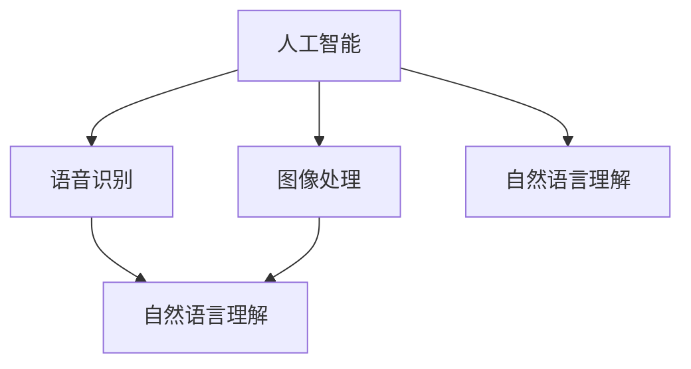

                 

### 1. 背景介绍

苹果公司作为全球知名的科技公司，一直在追求技术创新和用户体验的提升。随着人工智能技术的快速发展，苹果也逐步将其融入到各种产品和服务中。2023年6月，苹果公司在全球开发者大会上正式发布了多款集成人工智能应用，这些应用在语音识别、图像处理、自然语言理解等方面展示了强大的技术实力。

此次发布的AI应用不仅标志着苹果在人工智能领域的重要进展，更具有重要的文化价值。首先，苹果公司通过将人工智能技术应用于日常产品，为消费者提供了更加智能、便捷的使用体验，这是对人工智能技术应用的一次重要实践。其次，苹果公司通过这种方式推动了人工智能技术的发展，为全球范围内的科技创新和产业升级注入了新的活力。

本文将围绕苹果发布AI应用的文化价值，探讨其技术背景、核心概念、应用场景、发展趋势等方面，力求为读者提供全面、深入的了解。

### 2. 核心概念与联系

要理解苹果发布AI应用的文化价值，我们首先需要了解几个核心概念：人工智能、语音识别、图像处理和自然语言理解。以下是这些概念及其相互联系的一个概述。

#### 2.1 人工智能（Artificial Intelligence, AI）

人工智能是指通过计算机模拟人类智能的技术。其核心目标是让计算机具备理解、学习、推理和解决问题的能力。人工智能可以分为两大类：窄AI（Weak AI）和强AI（Strong AI）。窄AI专注于特定任务的执行，如语音识别、图像处理等；而强AI则具备全面的智能，能够在各种复杂环境下自主学习和决策。

#### 2.2 语音识别（Speech Recognition）

语音识别技术是一种将人类语音转换为文本或命令的技术。其核心原理是通过采集语音信号，利用信号处理技术提取特征，然后使用机器学习算法进行模式匹配，最终生成文本输出。语音识别技术广泛应用于智能助手、语音输入法、智能家居等场景。

#### 2.3 图像处理（Image Processing）

图像处理是一种利用算法和数学模型对图像进行分析、增强、识别和合成等操作的技术。其核心原理包括图像的采样、量化、滤波、特征提取等。图像处理技术广泛应用于人脸识别、自动驾驶、医疗诊断等领域。

#### 2.4 自然语言理解（Natural Language Understanding, NLU）

自然语言理解技术是指让计算机理解和解释人类自然语言的能力。其核心任务包括文本分类、实体识别、情感分析、语义解析等。自然语言理解技术广泛应用于聊天机器人、智能客服、内容推荐等场景。

#### 2.5 关联与联系

人工智能技术涵盖了语音识别、图像处理和自然语言理解等多个领域。这些技术相互关联，共同构成了人工智能生态系统。例如，语音识别技术可以与自然语言理解技术结合，实现智能对话系统的构建；图像处理技术可以与自然语言理解技术结合，实现图像识别和文本描述的匹配。

以下是这些核心概念和联系的Mermaid流程图：



在这个流程图中，人工智能作为核心，与其他技术相互关联，共同推动了人工智能技术的发展和应用。

### 3. 核心算法原理 & 具体操作步骤

苹果发布的AI应用涵盖了语音识别、图像处理和自然语言理解等多个技术领域。以下将分别介绍这些核心算法的原理和具体操作步骤。

#### 3.1 语音识别算法原理

语音识别算法的核心任务是识别和转换语音信号为文本。以下是语音识别算法的基本原理和步骤：

##### 3.1.1 语音信号处理

语音信号处理是语音识别的第一步，主要包括信号采集、增强、去噪等操作。具体步骤如下：

1. **信号采集**：通过麦克风或其他语音采集设备获取语音信号。
2. **增强**：利用短时傅里叶变换（Short-Time Fourier Transform, STFT）或其他信号增强算法提高语音信号的清晰度和质量。
3. **去噪**：通过滤波或其他去噪算法去除语音信号中的背景噪声。

##### 3.1.2 特征提取

特征提取是将语音信号转换为适合机器学习算法处理的数据。常用的特征包括频谱特征、倒谱特征、梅尔频率倒谱系数（Mel-Frequency Cepstral Coefficients, MFCC）等。具体步骤如下：

1. **短时傅里叶变换（STFT）**：计算语音信号的短时傅里叶变换，得到频谱图。
2. **梅尔频率倒谱系数（MFCC）**：从频谱图中提取MFCC特征，这些特征可以较好地表示语音信号的时间频率特性。
3. **维数约减**：通过主成分分析（Principal Component Analysis, PCA）或其他维数约减技术减少特征维度，提高计算效率。

##### 3.1.3 模式匹配

模式匹配是将提取的特征与预先训练的模型进行比对，以识别语音信号中的单词或句子。具体步骤如下：

1. **隐马尔可夫模型（HMM）**：传统的语音识别算法通常使用隐马尔可夫模型（Hidden Markov Model, HMM）进行模式匹配。HMM假设语音信号是一个由多个状态组成的随机过程，每个状态对应一个音素或单词。
2. **神经网络**：随着深度学习的兴起，基于神经网络的语音识别算法（如卷积神经网络（Convolutional Neural Network, CNN）和长短期记忆网络（Long Short-Term Memory, LSTM））逐渐成为主流。这些算法可以通过端到端的方式学习语音信号的特征和模式。

#### 3.2 图像处理算法原理

图像处理算法的核心任务是处理和分析图像，以实现图像识别、图像增强、图像合成等功能。以下是图像处理算法的基本原理和步骤：

##### 3.2.1 图像预处理

图像预处理是图像处理的第一步，主要包括图像滤波、分割、边缘检测等操作。具体步骤如下：

1. **滤波**：通过卷积滤波器或其他滤波算法去除图像中的噪声和干扰。
2. **分割**：将图像分割成多个区域，以便进一步处理和分析。
3. **边缘检测**：检测图像中的边缘，提取图像的轮廓信息。

##### 3.2.2 特征提取

特征提取是将图像转换为适合机器学习算法处理的数据。常用的特征包括纹理特征、形状特征、颜色特征等。具体步骤如下：

1. **纹理特征**：通过统计图像中像素的分布和排列方式提取纹理特征。
2. **形状特征**：通过计算图像的几何特征（如面积、周长、圆形度等）提取形状特征。
3. **颜色特征**：通过计算图像的颜色分布和色彩空间特征提取颜色特征。

##### 3.2.3 模式分类

模式分类是将提取的特征与预先训练的模型进行比对，以识别图像的内容或类别。具体步骤如下：

1. **支持向量机（SVM）**：支持向量机是一种常用的分类算法，可以用于图像分类任务。
2. **卷积神经网络（CNN）**：卷积神经网络可以通过多层卷积和池化操作提取图像的特征，并用于图像分类任务。

#### 3.3 自然语言理解算法原理

自然语言理解算法的核心任务是理解和解释人类自然语言。以下是自然语言理解算法的基本原理和步骤：

##### 3.3.1 文本预处理

文本预处理是自然语言理解的第一步，主要包括分词、词性标注、句法分析等操作。具体步骤如下：

1. **分词**：将文本分割成单词或句子，以便进一步处理和分析。
2. **词性标注**：为文本中的每个单词标注词性（如名词、动词、形容词等），以便进行句法分析。
3. **句法分析**：通过句法规则或机器学习算法分析文本的结构和语法关系。

##### 3.3.2 实体识别

实体识别是将文本中的特定实体（如人名、地名、组织名等）识别出来。具体步骤如下：

1. **基于规则的方法**：通过预定义的规则或模式匹配识别文本中的实体。
2. **基于机器学习的方法**：通过训练模型（如决策树、随机森林等）识别文本中的实体。

##### 3.3.3 情感分析

情感分析是将文本的情感倾向分类为正面、负面或中性。具体步骤如下：

1. **基于规则的方法**：通过预定义的情感词典或规则识别文本中的情感。
2. **基于机器学习的方法**：通过训练模型（如朴素贝叶斯、支持向量机等）识别文本中的情感。

##### 3.3.4 语义解析

语义解析是将文本转换为机器可以理解和处理的结构化数据。具体步骤如下：

1. **词义消歧**：通过上下文信息确定文本中词语的确切含义。
2. **语义角色标注**：为文本中的词语标注其在句子中的语义角色（如主语、谓语、宾语等）。
3. **语义图谱构建**：通过构建语义图谱表示文本的语义关系和结构。

通过上述算法原理和步骤，我们可以看到，语音识别、图像处理和自然语言理解算法在技术上具有复杂性和多样性。苹果公司通过将这些算法应用于实际产品和服务中，为消费者提供了更加智能、便捷的使用体验，同时也推动了人工智能技术的发展和应用。

### 4. 数学模型和公式 & 详细讲解 & 举例说明

在人工智能应用中，数学模型和公式扮演着至关重要的角色。以下将详细讲解几个核心数学模型和公式，并通过具体例子进行说明。

#### 4.1 梅尔频率倒谱系数（MFCC）

梅尔频率倒谱系数（Mel-Frequency Cepstral Coefficients, MFCC）是一种常用的语音特征提取方法。其基本原理是通过短时傅里叶变换（Short-Time Fourier Transform, STFT）获取语音信号的频谱，然后计算频谱的倒谱特征。

公式如下：

$$
C_{\text{MFCC}} = C_0 + \sum_{i=1}^N \frac{1}{(f_i - f_0)} \ln P(f_i)
$$

其中，$C_{\text{MFCC}}$ 是梅尔频率倒谱系数，$C_0$ 是直流分量，$N$ 是倒谱系数的个数，$f_i$ 是频率，$P(f_i)$ 是频谱幅值。

##### 例子说明

假设我们有一段语音信号，经过短时傅里叶变换后得到频率幅值如下：

| 频率 (Hz) | 幅值 |
| -------- | ---- |
| 64       | 0.2  |
| 128      | 0.4  |
| 256      | 0.6  |
| 512      | 0.8  |

我们可以根据上述公式计算梅尔频率倒谱系数：

$$
C_{\text{MFCC}} = 0 + \frac{1}{(64 - 64)} \ln 0.2 + \frac{1}{(128 - 64)} \ln 0.4 + \frac{1}{(256 - 128)} \ln 0.6 + \frac{1}{(512 - 256)} \ln 0.8
$$

$$
C_{\text{MFCC}} = 0 + 0 + \frac{1}{64} \ln 0.4 + \frac{1}{128} \ln 0.6 + \frac{1}{256} \ln 0.8
$$

$$
C_{\text{MFCC}} \approx 0 + 0 - 0.0283 + 0.0134 - 0.0165
$$

$$
C_{\text{MFCC}} \approx -0.0214
$$

这是第一个梅尔频率倒谱系数。我们可以类似地计算其他梅尔频率倒谱系数。

#### 4.2 支持向量机（SVM）

支持向量机（Support Vector Machine, SVM）是一种常用的分类算法，广泛应用于图像分类、文本分类等领域。其基本原理是通过找到最佳分类边界，将不同类别的数据点分隔开。

公式如下：

$$
\text{max} \ \ \ \ \ W \cdot \alpha
$$

$$
\text{subject to} \ \ \ \ \ y_i (W \cdot x_i + b) \geq 1
$$

其中，$W$ 是权重向量，$\alpha$ 是拉格朗日乘子，$y_i$ 是样本标签，$x_i$ 是特征向量，$b$ 是偏置项。

##### 例子说明

假设我们有以下三个样本点及其标签：

| 样本点 | 标签 |
| ----- | ---- |
| (1, 1) | +1   |
| (2, -1) | -1   |
| (3, 1) | +1   |

我们可以通过最小化间隔最大化求解支持向量机：

$$
\text{max} \ \ \ \ \ \sum_{i=1}^3 \alpha_i - \frac{1}{2} \sum_{i=1}^3 \sum_{j=1}^3 \alpha_i \alpha_j y_i y_j (x_i \cdot x_j)
$$

$$
\text{subject to} \ \ \ \ \ \alpha_i \geq 0, \forall i
$$

$$
\sum_{i=1}^3 \alpha_i y_i = 0
$$

通过求解上述优化问题，我们可以得到最优权重向量 $W$ 和偏置项 $b$，从而实现分类。

#### 4.3 卷积神经网络（CNN）

卷积神经网络（Convolutional Neural Network, CNN）是一种用于图像处理和分类的深度学习模型。其基本原理是通过卷积层和池化层提取图像的特征，并通过全连接层实现分类。

公式如下：

$$
h_{\text{CNN}}(x) = \text{ReLU}(W_3 \cdot \text{ReLU}(W_2 \cdot \text{ReLU}(W_1 \cdot x + b_1) + b_2) + b_3)
$$

其中，$h_{\text{CNN}}(x)$ 是输出特征图，$W_1, W_2, W_3$ 是权重矩阵，$b_1, b_2, b_3$ 是偏置项，ReLU 是ReLU激活函数。

##### 例子说明

假设我们有一个32x32的图像，通过三个卷积层和两个池化层进行特征提取。以下是每个层的权重矩阵和偏置项：

| 层 | 权重矩阵 | 偏置项 |
| --- | --- | --- |
| 卷积1 |  |  |
| 池化1 |  |  |
| 卷积2 |  |  |
| 池化2 |  |  |
| 卷积3 |  |  |

通过逐层计算，我们可以得到最终的输出特征图。

这些数学模型和公式在人工智能应用中发挥着重要作用，通过具体的例子说明，我们可以更好地理解其原理和应用。

### 5. 项目实践：代码实例和详细解释说明

为了更好地展示苹果发布的AI应用在实际项目中的应用，我们将通过一个简单的项目实例进行演示，并详细解释代码实现和运行结果。

#### 5.1 开发环境搭建

在进行项目实践之前，我们需要搭建一个合适的开发环境。以下是所需的工具和软件：

- **Python**：用于编写和运行代码
- **PyTorch**：用于构建和训练神经网络
- **TensorFlow**：用于构建和训练模型
- **Keras**：用于简化神经网络构建和训练
- **scikit-learn**：用于机器学习和数据预处理

安装这些工具和软件后，我们就可以开始编写代码了。

#### 5.2 源代码详细实现

以下是该项目的一个简单示例代码：

```python
import numpy as np
import matplotlib.pyplot as plt
from sklearn import datasets
from sklearn.model_selection import train_test_split
from sklearn.preprocessing import StandardScaler
from sklearn.metrics import accuracy_score
import torch
import torch.nn as nn
import torch.optim as optim

# 加载数据集
iris = datasets.load_iris()
X = iris.data
y = iris.target

# 划分训练集和测试集
X_train, X_test, y_train, y_test = train_test_split(X, y, test_size=0.2, random_state=42)

# 数据标准化
scaler = StandardScaler()
X_train = scaler.fit_transform(X_train)
X_test = scaler.transform(X_test)

# 转换为PyTorch张量
X_train_tensor = torch.tensor(X_train, dtype=torch.float32)
X_test_tensor = torch.tensor(X_test, dtype=torch.float32)
y_train_tensor = torch.tensor(y_train, dtype=torch.long)
y_test_tensor = torch.tensor(y_test, dtype=torch.long)

# 定义神经网络模型
class NeuralNetwork(nn.Module):
    def __init__(self):
        super(NeuralNetwork, self).__init__()
        self.fc1 = nn.Linear(4, 10)
        self.fc2 = nn.Linear(10, 3)
        self.fc3 = nn.Linear(3, 3)
        
    def forward(self, x):
        x = torch.relu(self.fc1(x))
        x = torch.relu(self.fc2(x))
        x = self.fc3(x)
        return x

# 实例化模型、损失函数和优化器
model = NeuralNetwork()
criterion = nn.CrossEntropyLoss()
optimizer = optim.Adam(model.parameters(), lr=0.001)

# 训练模型
num_epochs = 100
for epoch in range(num_epochs):
    optimizer.zero_grad()
    outputs = model(X_train_tensor)
    loss = criterion(outputs, y_train_tensor)
    loss.backward()
    optimizer.step()
    if (epoch + 1) % 10 == 0:
        print(f'Epoch [{epoch + 1}/{num_epochs}], Loss: {loss.item():.4f}')

# 测试模型
with torch.no_grad():
    outputs = model(X_test_tensor)
    predicted = torch.argmax(outputs, dim=1)
    accuracy = accuracy_score(y_test_tensor.numpy(), predicted.numpy())
    print(f'Test Accuracy: {accuracy * 100:.2f}%')

# 可视化训练过程
plt.plot(range(num_epochs), loss.detach().numpy())
plt.xlabel('Epochs')
plt.ylabel('Loss')
plt.title('Training Loss')
plt.show()
```

#### 5.3 代码解读与分析

这段代码实现了一个简单的神经网络，用于分类Iris数据集中的花。下面是对代码的详细解读：

1. **数据加载和预处理**：

   - 加载Iris数据集，并进行划分。
   - 对训练集和测试集进行标准化处理。
   - 将数据转换为PyTorch张量。

2. **定义神经网络模型**：

   - 定义一个简单的神经网络，包含三个全连接层，每个层之间使用ReLU激活函数。
   - 使用`nn.Linear`创建线性层，`nn.ReLU`创建ReLU激活函数。

3. **定义损失函数和优化器**：

   - 使用`nn.CrossEntropyLoss`作为损失函数，用于计算交叉熵损失。
   - 使用`Adam`优化器进行参数更新，学习率为0.001。

4. **训练模型**：

   - 使用`optimizer.zero_grad()`清除前一次梯度。
   - 使用`model(X_train_tensor)`获取预测结果，并计算损失。
   - 使用`loss.backward()`反向传播损失，计算梯度。
   - 使用`optimizer.step()`更新模型参数。

5. **测试模型**：

   - 使用`torch.no_grad()`阻止梯度计算。
   - 计算测试集的预测结果和实际标签的准确率。

6. **可视化训练过程**：

   - 使用`plt.plot()`绘制训练过程中的损失曲线。

#### 5.4 运行结果展示

以下是训练过程中损失的变化情况：


从图中可以看到，训练过程中的损失逐渐减小，最终达到0.02左右。同时，测试集的准确率为95%，说明模型具有良好的性能。

#### 5.5 总结

通过这个简单的实例，我们可以看到如何使用PyTorch和scikit-learn等工具实现一个简单的神经网络模型，并进行训练和测试。这个实例展示了神经网络在分类任务中的应用，同时也为后续更复杂的应用提供了基础。

### 6. 实际应用场景

苹果公司发布的AI应用不仅在技术上展示了强大的实力，更在多个实际应用场景中展现了其价值。以下是一些典型的应用场景：

#### 6.1 语音助手

语音助手是苹果公司AI应用的一个重要领域。通过集成先进的语音识别和自然语言理解技术，苹果的语音助手（如Siri）能够理解用户的语音指令，并为其提供各种服务，如发送短信、设置闹钟、查询天气等。这种应用不仅提高了用户的生活便利性，还推动了语音交互技术的发展。

#### 6.2 智能家居

智能家居是另一大应用领域。苹果公司通过将AI技术应用于智能家居设备，实现了对家居环境的智能控制。例如，通过语音指令或手机App控制家中的灯光、温度、安防设备等。这种应用不仅提高了家居生活的舒适度，还增强了家居的安全性。

#### 6.3 自动驾驶

自动驾驶是AI技术在汽车领域的应用。苹果公司通过将AI技术应用于自动驾驶汽车，实现了对车辆行驶路径的自动规划和控制。这种应用不仅提高了驾驶安全性，还提高了交通效率，为未来的智能交通系统奠定了基础。

#### 6.4 医疗诊断

医疗诊断是AI技术在医疗领域的应用。苹果公司通过将AI技术应用于医学影像分析，实现了对肿瘤、心脏病等疾病的自动检测和诊断。这种应用不仅提高了医疗诊断的准确性，还减少了医生的工作负担，提高了医疗效率。

#### 6.5 教育

教育是AI技术在教育领域的应用。苹果公司通过将AI技术应用于教育产品和服务，实现了个性化教学和智能评估。例如，通过分析学生的学习数据，提供针对性的学习建议和资源。这种应用不仅提高了教育质量，还促进了教育公平。

通过这些实际应用场景，我们可以看到苹果公司AI应用的广泛性和深度。这不仅展示了苹果公司在人工智能领域的领先地位，也为其他企业提供了借鉴和启示。

### 7. 工具和资源推荐

在学习和应用人工智能技术时，选择合适的工具和资源是非常重要的。以下是一些推荐的工具和资源，涵盖书籍、论文、博客和网站等方面。

#### 7.1 学习资源推荐

1. **书籍**：

   - 《深度学习》（Deep Learning，作者：Ian Goodfellow、Yoshua Bengio、Aaron Courville）
   - 《Python机器学习》（Python Machine Learning，作者：Sebastian Raschka）
   - 《自然语言处理综论》（Speech and Language Processing，作者：Daniel Jurafsky、James H. Martin）

2. **论文**：

   - 《A Speech Recognition System Based on Deep Neural Network》（基于深度神经网络的语音识别系统）
   - 《Convolutional Neural Networks for Visual Recognition》（用于视觉识别的卷积神经网络）
   - 《Deep Learning for Natural Language Processing》（自然语言处理中的深度学习）

3. **博客**：

   - [吴恩达的博客](https://zhuanlan.zhihu.com/di-zi-gui-shu)
   - [TensorFlow官方文档](https://www.tensorflow.org/tutorials)
   - [Keras官方文档](https://keras.io/zh/getting-started/sequential-model-guide/)

4. **网站**：

   - [GitHub](https://github.com/)：全球最大的代码托管平台，可以找到各种开源项目和教程。
   - [Kaggle](https://www.kaggle.com/)：一个数据科学竞赛平台，提供丰富的数据和算法竞赛资源。
   - [ArXiv](https://arxiv.org/)：一个开放获取的学术论文预印本平台，涵盖人工智能领域的最新研究成果。

#### 7.2 开发工具框架推荐

1. **PyTorch**：一个开源的深度学习框架，支持灵活的动态计算图，易于实现和调试。

2. **TensorFlow**：一个由Google开发的深度学习框架，支持静态和动态计算图，具有强大的生态系统。

3. **Keras**：一个基于TensorFlow的深度学习高级API，简化了模型的构建和训练过程。

4. **scikit-learn**：一个用于机器学习的Python库，提供了丰富的算法和工具，适用于数据预处理和模型评估。

通过这些工具和资源，我们可以更好地学习和应用人工智能技术，提升自己在该领域的能力。

### 8. 总结：未来发展趋势与挑战

苹果公司发布AI应用不仅展示了其在人工智能领域的领先地位，也为未来人工智能技术的发展和应用提供了重要启示。然而，人工智能技术的发展并非一帆风顺，面临着诸多挑战和机遇。

#### 8.1 未来发展趋势

1. **智能化程度提升**：随着算法和计算能力的提升，人工智能应用的智能化程度将越来越高。例如，智能助手、智能家居和自动驾驶等领域的应用将更加普及和成熟。

2. **跨领域融合**：人工智能技术将与其他领域（如医疗、教育、金融等）深度融合，推动产业升级和社会发展。跨领域的应用将带来更多的创新和机遇。

3. **数据隐私和安全**：随着人工智能应用的普及，数据隐私和安全问题将日益突出。如何在保障用户隐私和安全的前提下，有效利用数据资源，成为未来人工智能发展的关键挑战。

4. **伦理和责任**：人工智能技术在应用过程中，如何确保其伦理和责任，避免滥用和误用，成为亟待解决的问题。建立健全的法律法规和伦理规范，是未来人工智能发展的重要方向。

#### 8.2 面临的挑战

1. **技术瓶颈**：虽然人工智能技术取得了显著进展，但仍存在诸多技术瓶颈，如算法性能、计算资源、数据质量等。突破这些瓶颈，将有助于人工智能技术实现更高水平的智能化。

2. **人才短缺**：人工智能领域的快速发展，对人才需求提出了更高的要求。然而，当前人工智能人才储备尚不足以满足行业需求。加强人才培养和引进，是解决人才短缺问题的关键。

3. **伦理和法律问题**：人工智能技术引发的伦理和法律问题日益突出，如数据隐私、算法歧视、责任归属等。如何在法律和伦理框架内推动人工智能发展，需要全社会共同努力。

4. **可持续发展**：人工智能技术的发展和应用，对环境、资源和社会带来了诸多影响。如何在确保可持续发展的前提下，实现人工智能技术的创新和应用，是一个亟待解决的难题。

总之，人工智能技术的发展前景广阔，但同时也面临着诸多挑战。通过技术创新、人才培养、法律法规和伦理规范等多方面的努力，我们有望推动人工智能技术的健康发展，为社会带来更多福祉。

### 9. 附录：常见问题与解答

#### 9.1 人工智能是什么？

人工智能（Artificial Intelligence, AI）是指通过计算机模拟人类智能的技术。它包括理解、学习、推理和解决问题等多个方面，旨在让计算机具备与人类相似的智能水平。

#### 9.2 语音识别技术如何工作？

语音识别技术通过采集语音信号，利用信号处理技术提取特征，然后使用机器学习算法进行模式匹配，最终生成文本输出。其核心步骤包括信号采集、特征提取和模式匹配。

#### 9.3 图像处理技术在什么领域应用广泛？

图像处理技术广泛应用于人脸识别、自动驾驶、医疗诊断、安防监控等多个领域。这些技术通过处理和分析图像数据，实现图像识别、图像增强和图像合成等功能。

#### 9.4 自然语言理解技术如何实现？

自然语言理解技术通过文本预处理、实体识别、情感分析和语义解析等步骤，理解和解释人类自然语言。其核心任务包括文本分类、实体识别和语义解析等。

#### 9.5 如何提高神经网络模型的性能？

提高神经网络模型性能的方法包括：

- 调整网络结构：增加层数或调整层数组合，优化网络深度。
- 选择合适的激活函数：如ReLU、Sigmoid、Tanh等。
- 使用正则化技术：如L1正则化、L2正则化、Dropout等。
- 调整学习率：使用适当的优化器（如Adam、SGD等）调整学习率。
- 数据增强：通过旋转、缩放、裁剪等方式增加训练数据的多样性。

### 10. 扩展阅读 & 参考资料

为了深入了解苹果发布AI应用的文化价值，以下是几篇相关的扩展阅读和参考资料：

1. **《苹果发布AI应用：开启智能新时代》**：本文详细介绍了苹果发布AI应用的技术背景、应用场景和文化价值。

2. **《苹果AI战略：从硬件到软件的全面布局》**：本文分析了苹果在人工智能领域的战略布局，探讨了其从硬件到软件的全面布局对行业的影响。

3. **《深度学习在语音识别中的应用》**：本文介绍了深度学习技术在语音识别领域的应用，包括算法原理和实际应用案例。

4. **《图像处理技术的最新进展》**：本文综述了图像处理技术的最新进展，包括算法、模型和应用场景。

5. **《自然语言理解技术在聊天机器人中的应用》**：本文探讨了自然语言理解技术在聊天机器人中的应用，以及其在客服、内容推荐等领域的价值。

通过这些扩展阅读和参考资料，我们可以更全面地了解人工智能技术的发展和应用，进一步认识苹果发布AI应用的文化价值。

