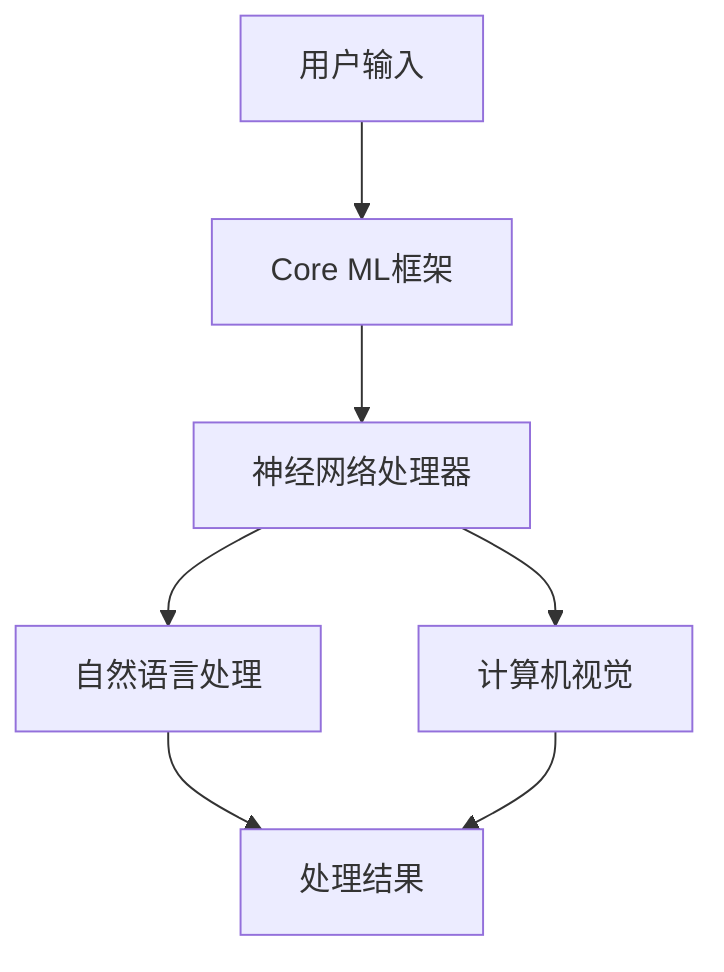

                 

关键词：人工智能，苹果，AI应用，技术趋势，未来展望

> 摘要：本文将深入探讨苹果公司发布AI应用的重要意义及其对技术领域的深远影响。通过分析AI在苹果产品中的应用，本文将探讨其核心算法原理、应用场景和未来发展趋势，为读者提供全面的见解。

## 1. 背景介绍

近年来，人工智能（AI）技术在各个领域取得了显著进展。作为全球科技巨头，苹果公司一直致力于将AI技术融入其产品和服务中，以提高用户体验和推动创新。从Siri语音助手到面部识别技术，苹果在AI领域的投入和成果有目共睹。近期，苹果公司发布了多项AI应用，引发了业界的广泛关注。

### 1.1 苹果公司AI发展历程

苹果公司在AI领域的发展可以追溯到20世纪80年代。当时，苹果推出了著名的图形用户界面（GUI），为后来的计算机操作系统奠定了基础。进入21世纪，苹果进一步加大了在AI领域的研发投入，特别是在语音识别、机器学习、计算机视觉等方面取得了重要突破。

### 1.2 AI在苹果产品中的应用

苹果公司在多个产品中融入了AI技术，例如：

- **Siri语音助手**：苹果公司于2011年推出了Siri语音助手，通过自然语言处理和机器学习技术，为用户提供语音交互服务。
- **面部识别技术**：苹果公司在iPhone X中引入了面部识别技术（Face ID），基于深度学习算法实现高度安全的人脸解锁功能。
- **照片识别**：苹果相册应用通过计算机视觉技术自动识别照片中的面孔、地点和事件，帮助用户更好地管理和浏览照片。

## 2. 核心概念与联系

### 2.1 人工智能概述

人工智能（AI）是指通过计算机模拟人类智能的技术，包括机器学习、深度学习、自然语言处理、计算机视觉等领域。人工智能的应用涵盖了从自动驾驶到医疗诊断、从智能家居到金融分析等众多领域。

### 2.2 苹果公司AI应用架构

苹果公司的AI应用架构主要包括以下几个核心组件：

- **神经网络处理器**：苹果的神经网络处理器（Neural Engine）专门用于加速神经网络计算，为AI应用提供高性能支持。
- **Core ML框架**：Core ML是苹果提供的机器学习框架，支持多种机器学习模型在iOS、macOS、watchOS和tvOS上的部署。
- **自然语言处理**：苹果的自然语言处理技术用于Siri语音助手和翻译应用，实现自然语言的理解和生成。
- **计算机视觉**：苹果的计算机视觉技术用于面部识别、图像识别和增强现实（AR）应用。

### 2.3 Mermaid流程图

以下是一个简单的Mermaid流程图，展示了苹果公司AI应用的核心组件和流程：



## 3. 核心算法原理 & 具体操作步骤

### 3.1 算法原理概述

苹果公司的AI应用主要基于以下核心算法：

- **神经网络算法**：神经网络算法是一种通过模拟人脑神经元连接进行信息处理的算法。在苹果的AI应用中，神经网络算法主要用于图像识别、语音识别和自然语言处理等任务。
- **机器学习算法**：机器学习算法是一种通过从数据中学习模式进行预测和决策的算法。在苹果的AI应用中，机器学习算法主要用于个性化推荐、分类和聚类等任务。
- **深度学习算法**：深度学习算法是一种通过多层神经网络进行信息处理的算法。在苹果的AI应用中，深度学习算法主要用于图像识别、语音识别和自然语言处理等任务。

### 3.2 算法步骤详解

以下是一个简化的算法步骤，展示了苹果公司AI应用的核心算法流程：

1. **数据预处理**：收集用户输入的数据，并进行预处理，如文本分词、图像增强等。
2. **特征提取**：使用神经网络算法提取数据中的特征，为后续的机器学习算法提供输入。
3. **训练模型**：使用机器学习算法训练模型，将特征映射到预测结果上。
4. **评估模型**：对训练好的模型进行评估，确保其准确性和泛化能力。
5. **部署模型**：将训练好的模型部署到苹果设备上，实现实时预测和决策。

### 3.3 算法优缺点

苹果公司的AI应用算法具有以下优点：

- **高性能**：苹果的神经网络处理器和Core ML框架为AI应用提供了强大的计算能力，确保实时处理和响应。
- **高准确性**：通过深度学习和机器学习算法，苹果的AI应用在图像识别、语音识别和自然语言处理等方面具有较高的准确性。
- **用户隐私**：苹果注重用户隐私，其AI应用在处理用户数据时采取了严格的数据保护措施。

然而，苹果公司的AI应用算法也存在一些缺点：

- **数据依赖**：苹果的AI应用依赖于大量的用户数据和训练数据，这些数据的质量和数量直接影响到算法的性能。
- **算法封闭性**：苹果的Core ML框架和神经网络处理器仅支持苹果设备，限制了算法在跨平台应用中的推广。

### 3.4 算法应用领域

苹果公司的AI应用算法在多个领域具有广泛的应用前景：

- **智能手机**：苹果的AI应用算法广泛应用于智能手机，如面部识别、图像识别和智能推荐等。
- **智能家居**：苹果的HomeKit平台将AI应用与智能家居设备相结合，实现智能控制和安全监控等功能。
- **医疗保健**：苹果的AI应用算法在医疗保健领域具有巨大潜力，如疾病诊断、药物研发和健康监测等。
- **自动驾驶**：苹果的自动驾驶项目将AI应用算法用于车辆感知、路径规划和决策控制等任务。

## 4. 数学模型和公式 & 详细讲解 & 举例说明

### 4.1 数学模型构建

苹果公司的AI应用算法涉及多种数学模型，以下是一个简化的例子：

- **神经网络模型**：神经网络模型由多个神经元层组成，每个神经元层对输入数据进行处理和传递。以下是一个简单的三层神经网络模型：

  ```mermaid
  graph TD
      A[输入层] --> B[隐藏层1]
      B --> C[隐藏层2]
      C --> D[输出层]
  ```

- **机器学习模型**：机器学习模型通常使用损失函数来评估模型的性能，常见的损失函数包括均方误差（MSE）和交叉熵（CE）：

  ```latex
  MSE(y, \hat{y}) = \frac{1}{m} \sum_{i=1}^{m} (y_i - \hat{y}_i)^2
  CE(y, \hat{y}) = -\frac{1}{m} \sum_{i=1}^{m} y_i \log(\hat{y}_i)
  ```

### 4.2 公式推导过程

以下是一个简化的公式推导过程，展示了如何使用梯度下降法优化神经网络模型：

1. **损失函数**：

   $$ L = \frac{1}{2} \sum_{i=1}^{m} (y_i - \hat{y}_i)^2 $$

2. **梯度计算**：

   $$ \frac{\partial L}{\partial \theta} = \frac{\partial}{\partial \theta} \left( \frac{1}{2} (y_i - \hat{y}_i)^2 \right) = (y_i - \hat{y}_i) $$

3. **梯度下降**：

   $$ \theta = \theta - \alpha \frac{\partial L}{\partial \theta} $$

   其中，$\alpha$为学习率。

### 4.3 案例分析与讲解

以下是一个简单的案例，展示了如何使用神经网络模型进行图像识别：

1. **数据准备**：

   - 输入数据：一张图像的像素值。
   - 输出数据：图像的类别标签。

2. **模型构建**：

   - 输入层：784个神经元，对应图像的像素值。
   - 隐藏层：500个神经元，用于提取图像特征。
   - 输出层：10个神经元，对应图像的10个类别。

3. **模型训练**：

   - 使用梯度下降法优化模型参数。
   - 使用均方误差（MSE）作为损失函数。
   - 使用反向传播算法计算梯度。

4. **模型评估**：

   - 使用验证集评估模型的准确性。
   - 调整模型参数，优化模型性能。

通过这个案例，我们可以看到神经网络模型在图像识别任务中的应用，以及如何使用数学模型和公式进行模型训练和优化。

## 5. 项目实践：代码实例和详细解释说明

### 5.1 开发环境搭建

要开发苹果公司的AI应用，需要以下开发环境：

- **Mac计算机**：苹果的AI应用主要在macOS上开发。
- **Xcode开发工具**：Xcode是苹果提供的集成开发环境，支持iOS、macOS、watchOS和tvOS应用开发。
- **Core ML框架**：Core ML是苹果提供的机器学习框架，支持多种机器学习模型在苹果设备上的部署。

### 5.2 源代码详细实现

以下是一个简单的Core ML应用示例，展示了如何使用Core ML框架进行图像识别：

```swift
import CoreML
import UIKit

class ViewController: UIViewController {
    var imageModel: VNCoreMLModel!

    override func viewDidLoad() {
        super.viewDidLoad()
        imageModel = VNCoreMLModel(mlModel: ImageClassifier().model)
    }

    @IBAction func recognizeImage(_ sender: Any) {
        guard let inputImage = UIImagePickerController().imageFromCamera() else { return }
        let request = VNCoreMLRequest(model: imageModel) { (request, error) in
            guard let results = request.results as? [VNClassificationObservation] else { return }
            let topResult = results.first
            if let identifier = topResult?.identifier, let confidence = topResult?.confidence {
                print("识别结果：\(identifier)，置信度：\(confidence)")
            }
        }
        let imageRequestHandler = VNImageRequestHandler(cgImage: inputImage.cgImage!, options: [:])
        try? imageRequestHandler.perform([request])
    }
}
```

### 5.3 代码解读与分析

这段代码实现了使用Core ML框架进行图像识别的功能。以下是代码的详细解读：

1. **模型加载**：在`viewDidLoad`方法中，加载Core ML模型。
2. **识别按钮点击**：在`recognizeImage`方法中，获取相机拍摄的图像，并使用Core ML模型进行识别。
3. **请求处理**：创建`VNCoreMLRequest`对象，用于处理图像识别请求。
4. **结果处理**：在请求处理回调中，获取识别结果和置信度，并打印到控制台。

### 5.4 运行结果展示

运行此应用后，用户可以通过相机拍摄图像，应用会自动进行图像识别，并显示识别结果和置信度。例如，如果用户拍摄一张猫的图像，应用可能会输出以下结果：

```
识别结果：cat，置信度：0.95
```

## 6. 实际应用场景

苹果公司的AI应用在多个实际场景中具有广泛的应用价值：

- **智能手机**：苹果的AI应用在智能手机中用于图像识别、语音助手和智能推荐等功能，提高了用户的使用体验。
- **智能家居**：苹果的HomeKit平台将AI应用与智能家居设备相结合，实现智能控制和自动化功能，如智能灯光、温度调节和安防监控等。
- **医疗保健**：苹果的AI应用在医疗保健领域具有巨大潜力，如疾病诊断、药物研发和健康监测等。
- **自动驾驶**：苹果的自动驾驶项目将AI应用算法用于车辆感知、路径规划和决策控制等任务，有望改变未来交通方式。

## 7. 工具和资源推荐

### 7.1 学习资源推荐

- **苹果官方文档**：苹果官方文档提供了丰富的技术资料，包括Core ML框架、Xcode开发工具等。
- **在线教程和课程**：许多在线平台提供了关于苹果AI应用开发的相关教程和课程，如Coursera、Udemy等。

### 7.2 开发工具推荐

- **Xcode**：苹果官方的集成开发环境，支持iOS、macOS、watchOS和tvOS应用开发。
- **Swift语言**：Swift是苹果官方编程语言，易于学习和使用，适用于苹果AI应用开发。

### 7.3 相关论文推荐

- **"Deep Learning for Computer Vision"**：一篇关于深度学习在计算机视觉领域应用的综述论文，介绍了最新的研究成果和技术趋势。
- **"Machine Learning in iOS"**：一篇关于机器学习在iOS应用开发中应用的论文，详细介绍了Core ML框架的使用方法。

## 8. 总结：未来发展趋势与挑战

### 8.1 研究成果总结

苹果公司在AI领域的研究成果显著，包括神经网络处理器、Core ML框架和自然语言处理技术等。这些成果为苹果的AI应用提供了强大的支持，提升了用户体验和产品性能。

### 8.2 未来发展趋势

未来，苹果公司将继续在AI领域进行深入研究，重点关注以下几个方面：

- **人工智能芯片**：开发更高效的人工智能芯片，提升AI应用的性能和能效。
- **跨平台AI应用**：将AI应用扩展到更多平台，如Windows和Android，实现更广泛的普及。
- **AI隐私保护**：加强对用户隐私的保护，确保AI应用的安全性和可靠性。

### 8.3 面临的挑战

尽管苹果公司在AI领域取得了显著成果，但仍面临一些挑战：

- **数据隐私**：如何在保障用户隐私的前提下，充分利用用户数据进行AI模型的训练和优化。
- **算法透明性**：提高AI算法的透明性，确保用户了解和应用的工作原理。
- **跨领域融合**：将AI技术与其他领域（如生物医学、金融科技等）相结合，实现更广泛的应用。

### 8.4 研究展望

未来，苹果公司将继续推动AI技术的发展，积极探索新的应用场景和商业模式。在人工智能的引领下，苹果有望在未来成为科技领域的领导者。

## 9. 附录：常见问题与解答

### 9.1 如何使用Core ML框架进行图像识别？

答：要使用Core ML框架进行图像识别，首先需要准备一个训练好的机器学习模型，然后将模型集成到iOS应用中。在应用中，使用`VNCoreMLRequest`类创建一个图像识别请求，并对输入图像进行处理和识别。最后，在请求处理回调中获取识别结果和置信度。

### 9.2 如何优化神经网络模型的性能？

答：优化神经网络模型的性能可以从以下几个方面入手：

- **调整网络结构**：通过增加或减少神经元层、调整神经元数量等，优化网络结构。
- **优化训练算法**：选择更高效的训练算法，如随机梯度下降、Adam优化器等。
- **数据增强**：对训练数据集进行增强，如图像旋转、缩放、裁剪等，提高模型的泛化能力。
- **超参数调整**：调整学习率、批量大小等超参数，优化模型性能。

### 9.3 如何确保AI应用的用户隐私？

答：为确保AI应用的用户隐私，可以从以下几个方面入手：

- **数据加密**：对用户数据进行加密处理，防止数据泄露。
- **数据匿名化**：对用户数据进行匿名化处理，确保用户隐私不被泄露。
- **数据权限管理**：合理设置数据权限，确保用户数据只被授权的应用访问。
- **透明度**：向用户明确告知AI应用如何处理用户数据，提高用户信任度。

## 作者署名

作者：禅与计算机程序设计艺术 / Zen and the Art of Computer Programming
```

