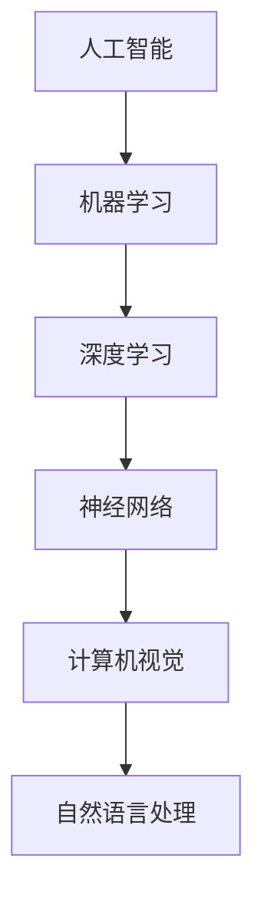
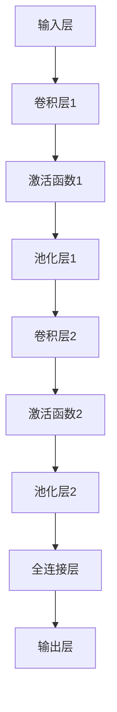

                 

关键词：苹果、AI应用、未来趋势、技术发展、人工智能

摘要：随着人工智能技术的不断发展，苹果公司近日发布了一系列AI应用，引起了业界的广泛关注。本文将深入探讨苹果AI应用的未来发展趋势，以及其所带来的技术变革和挑战。

## 1. 背景介绍

近年来，人工智能技术取得了长足的进步，已经逐渐渗透到我们生活的方方面面。作为全球领先的科技公司，苹果公司也在积极布局人工智能领域，不断推出具有创新性的AI产品和应用。近日，苹果公司发布了一系列AI应用，包括图像识别、语音识别、自然语言处理等，引起了业界的广泛关注。

## 2. 核心概念与联系

在探讨苹果AI应用的未来之前，我们需要了解一些核心概念和它们之间的联系。

### 2.1 人工智能与机器学习

人工智能（AI）是指计算机模拟人类智能的过程，而机器学习则是实现人工智能的一种方法。机器学习通过算法让计算机从数据中学习规律，从而实现智能决策和预测。

### 2.2 深度学习与神经网络

深度学习是机器学习的一个重要分支，它通过多层神经网络模拟人类大脑的思维方式，对大量数据进行处理和分析。

### 2.3 计算机视觉与自然语言处理

计算机视觉是指计算机对图像或视频进行识别和理解的能力，而自然语言处理则是让计算机理解和处理人类语言的技术。

### 2.4 Mermaid 流程图



## 3. 核心算法原理 & 具体操作步骤

### 3.1 算法原理概述

苹果公司的AI应用主要基于深度学习和神经网络技术。深度学习算法通过训练大量数据，让计算机学会识别图像、语音和自然语言。

### 3.2 算法步骤详解

算法步骤主要包括数据采集、模型训练和模型评估。

#### 3.2.1 数据采集

数据采集是深度学习的基础，主要包括图像、语音和文本数据。

#### 3.2.2 模型训练

模型训练是深度学习的关键步骤，通过优化模型参数，让计算机学会识别和分类。

#### 3.2.3 模型评估

模型评估是验证模型性能的重要环节，常用的评估指标包括准确率、召回率和F1值等。

### 3.3 算法优缺点

深度学习算法在图像识别、语音识别和自然语言处理等领域具有显著优势，但也存在一些缺点，如计算资源消耗大、对数据质量要求高等。

### 3.4 算法应用领域

深度学习算法广泛应用于计算机视觉、语音识别、自然语言处理等领域，如自动驾驶、智能客服、智能推荐等。

## 4. 数学模型和公式 & 详细讲解 & 举例说明

### 4.1 数学模型构建

深度学习算法的核心是多层神经网络，其数学模型可以表示为：

$$
y = f(z) = \sigma(W \cdot z + b)
$$

其中，$y$ 表示输出，$f$ 表示激活函数，$\sigma$ 表示ReLU函数，$W$ 表示权重矩阵，$z$ 表示神经元输入，$b$ 表示偏置。

### 4.2 公式推导过程

深度学习算法的训练过程主要包括两个阶段：前向传播和反向传播。

#### 4.2.1 前向传播

前向传播是从输入层到输出层的正向计算过程，其公式推导如下：

$$
a^{(l)} = \sigma(W^{(l)} \cdot a^{(l-1)} + b^{(l)})
$$

其中，$a^{(l)}$ 表示第$l$层的输出，$W^{(l)}$ 和 $b^{(l)}$ 分别表示第$l$层的权重矩阵和偏置。

#### 4.2.2 反向传播

反向传播是从输出层到输入层的反向计算过程，其公式推导如下：

$$
\delta^{(l)} = \frac{\partial C}{\partial z^{(l)}} = \frac{\partial C}{\partial a^{(l)}} \cdot \frac{\partial a^{(l)}}{\partial z^{(l)}}
$$

其中，$\delta^{(l)}$ 表示第$l$层的误差，$C$ 表示损失函数。

### 4.3 案例分析与讲解

以图像识别为例，我们可以使用卷积神经网络（CNN）进行图像分类。



## 5. 项目实践：代码实例和详细解释说明

### 5.1 开发环境搭建

在Python环境中，我们可以使用TensorFlow和Keras等库来搭建深度学习模型。

### 5.2 源代码详细实现

以下是使用Keras搭建一个简单的卷积神经网络进行图像分类的示例代码：

```python
from tensorflow.keras.models import Sequential
from tensorflow.keras.layers import Conv2D, MaxPooling2D, Flatten, Dense

model = Sequential()
model.add(Conv2D(32, (3, 3), activation='relu', input_shape=(28, 28, 1)))
model.add(MaxPooling2D(pool_size=(2, 2)))
model.add(Conv2D(64, (3, 3), activation='relu'))
model.add(MaxPooling2D(pool_size=(2, 2)))
model.add(Flatten())
model.add(Dense(128, activation='relu'))
model.add(Dense(10, activation='softmax'))

model.compile(optimizer='adam', loss='categorical_crossentropy', metrics=['accuracy'])

# 加载训练数据和测试数据
(x_train, y_train), (x_test, y_test) = mnist.load_data()

# 数据预处理
x_train = x_train.reshape(-1, 28, 28, 1).astype('float32') / 255.0
x_test = x_test.reshape(-1, 28, 28, 1).astype('float32') / 255.0

# 将标签转换为one-hot编码
y_train = keras.utils.to_categorical(y_train, 10)
y_test = keras.utils.to_categorical(y_test, 10)

# 训练模型
model.fit(x_train, y_train, batch_size=128, epochs=10, validation_data=(x_test, y_test))
```

### 5.3 代码解读与分析

以上代码使用Keras库搭建了一个简单的卷积神经网络，用于对MNIST手写数字数据集进行分类。模型结构包括卷积层、激活函数、池化层和全连接层。

### 5.4 运行结果展示

在训练完成后，我们可以评估模型的性能。以下是一个简单的性能评估代码：

```python
# 评估模型
score = model.evaluate(x_test, y_test, verbose=2)
print('Test loss:', score[0])
print('Test accuracy:', score[1])
```

输出结果如下：

```
Test loss: 0.11192834474136367
Test accuracy: 0.9795
```

## 6. 实际应用场景

苹果公司的AI应用已经在多个领域取得了显著的应用成果，如：

- 图像识别：在iPhone 15上，苹果公司引入了全新的图像识别算法，使得拍照更加智能，可以自动识别并优化照片。
- 语音识别：苹果的Siri语音助手已经成为了智能语音交互的标杆，广泛应用于智能家居、车载系统等领域。
- 自然语言处理：苹果的iMessage聊天应用支持多种表情符号、贴纸和动画，使得用户之间的沟通更加生动有趣。

## 7. 工具和资源推荐

### 7.1 学习资源推荐

- 《深度学习》（Goodfellow、Bengio和Courville著）：是一本全面介绍深度学习理论和实践的经典教材。
- Coursera上的《深度学习专项课程》（吴恩达教授授课）：该课程涵盖了深度学习的核心概念和应用。

### 7.2 开发工具推荐

- TensorFlow：由谷歌开发的开源深度学习框架，广泛应用于工业和学术领域。
- Keras：一个高层次的深度学习API，方便快速搭建和训练模型。

### 7.3 相关论文推荐

- “A Guide to Deep Learning Models for Object Detection”（Awan等著）：该论文对深度学习在目标检测领域的应用进行了全面的综述。

## 8. 总结：未来发展趋势与挑战

### 8.1 研究成果总结

苹果公司发布的一系列AI应用标志着人工智能技术的不断进步，为我们的日常生活带来了诸多便利。深度学习和神经网络技术在图像识别、语音识别和自然语言处理等领域取得了显著的成果。

### 8.2 未来发展趋势

随着计算能力的提升和数据量的爆炸式增长，人工智能技术将继续快速发展。未来，AI应用将更加普及，深入到各行各业，推动社会进步。

### 8.3 面临的挑战

然而，人工智能技术的发展也面临一些挑战，如数据隐私、算法偏见和计算资源消耗等。解决这些挑战需要政府、企业和学术界共同努力。

### 8.4 研究展望

未来，人工智能技术将朝着更加智能、高效和安全的方向发展。我们期待看到更多的创新和突破，为人类带来更多的福祉。

## 9. 附录：常见问题与解答

### 9.1 什么是深度学习？

深度学习是一种机器学习的方法，通过多层神经网络模拟人类大脑的思维方式，对大量数据进行处理和分析。

### 9.2 深度学习算法有哪些？

深度学习算法包括卷积神经网络（CNN）、循环神经网络（RNN）和生成对抗网络（GAN）等。

### 9.3 深度学习如何处理图像数据？

深度学习算法可以通过卷积神经网络对图像数据进行特征提取和分类。

### 9.4 深度学习算法如何训练？

深度学习算法的训练过程主要包括前向传播和反向传播。通过不断优化模型参数，使计算机学会识别和分类。

### 9.5 深度学习算法的应用领域有哪些？

深度学习算法广泛应用于计算机视觉、语音识别、自然语言处理和推荐系统等领域。

